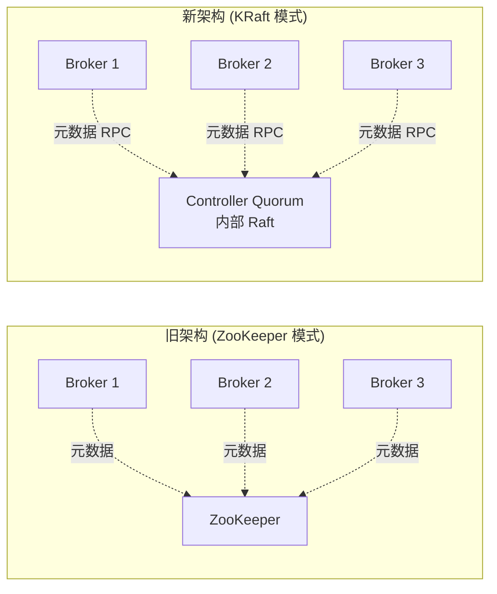
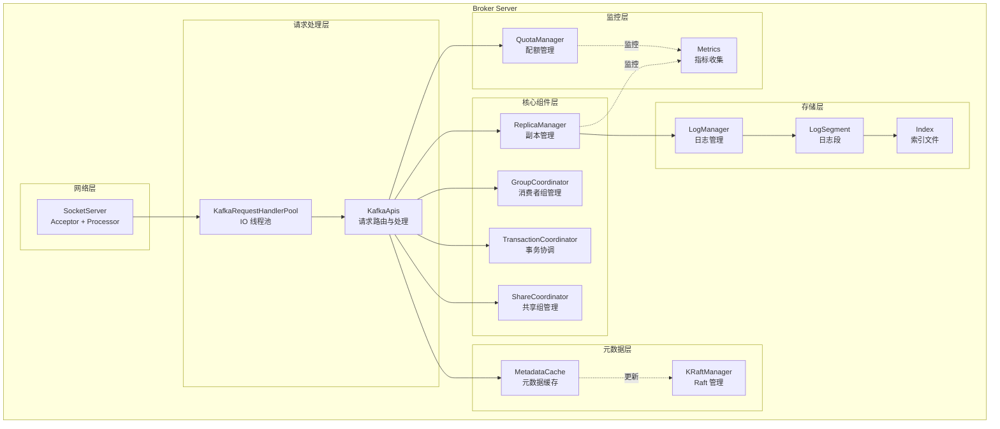
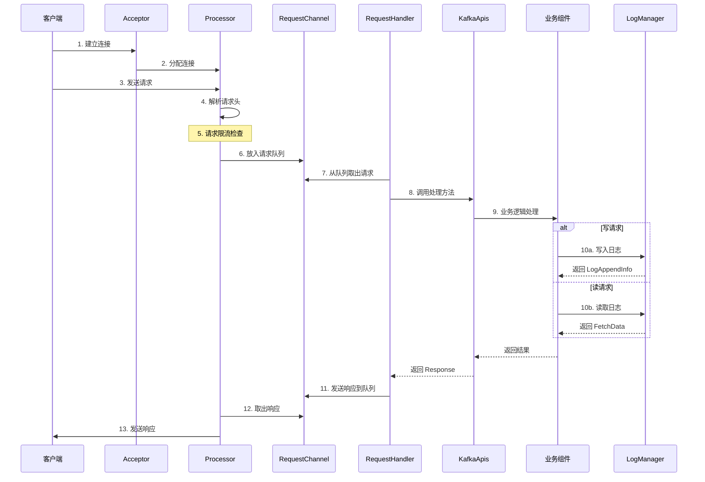
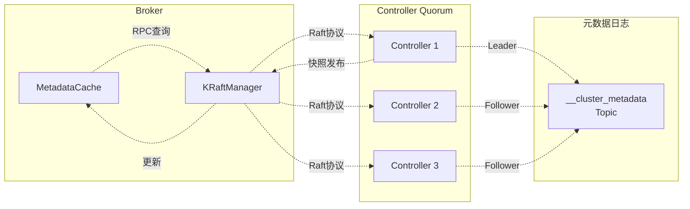

# Kafka 架构概览

## 目录
- [1. Kafka 基本概念](#1-kafka-基本概念)
- [2. KRaft 架构](#2-kraft-架构)
- [3. 核心组件](#3-核心组件)
- [4. 请求处理流程](#4-请求处理流程)
- [5. 存储架构](#5-存储架构)

---

## 1. Kafka 基本概念

### 1.1 什么是 Kafka?

Apache Kafka 是一个分布式流处理平台，主要用于:
- **消息队列**: 高吞吐量的发布-订阅消息系统
- **流处理**: 实时数据处理管道
- **事件存储**: 持久化事件日志

### 1.2 核心概念

| 概念 | 说明 |
|-----|------|
| **Producer** | 消息生产者，向 Kafka 发送消息的客户端 |
| **Consumer** | 消息消费者，从 Kafka 拉取消息的客户端 |
| **Broker** | Kafka Broker 节点，负责存储和转发消息 |
| **Topic** | 消息主题，逻辑上的消息分类 |
| **Partition** | 分区，Topic 的物理分片，实现并行处理和伸缩性 |
| **Segment** | 段，Partition 中的文件段，实际存储单位 |
| **Offset** | 消息在分区中的位置索引 |
| **Consumer Group** | 消费者组，一组协同工作的消费者 |
| **Replica** | 副本，分区的拷贝，提供容错能力 |
| **Leader** | 主副本，处理所有读写请求 |
| **Follower** | 从副本，同步 Leader 数据，作为备用 |
| **ISR** | In-Sync Replicas，与 Leader 保持同步的副本集合 |
| **Controller** | 控制器，负责管理分区状态和副本选举 |

> 💡 **详细解读**：想要深入了解这些概念的工作原理、源码实现和 KRaft 选举机制，请查看 **[03. 核心概念深度解析](./03-core-concepts-deep-dive.md)**

---

## 2. KRaft 架构

### 2.1 从 ZooKeeper 到 KRaft

Kafka 3.x 引入了 KRaft（Kafka Raft）模式，彻底摆脱了对 ZooKeeper 的依赖。



### 2.2 KRaft 模式优势

| 特性 | ZooKeeper 模式 | KRaft 模式 |
|-----|---------------|-----------|
| 元数据存储 | 外部 ZooKeeper 集群 | 内部 __cluster_metadata Topic |
| Controller 选举 | ZooKeeper 选举 | Raft 协议 |
| 扩展性 | 受 ZooKeeper 限制 | 理论上无限制 |
| 运维复杂度 | 需要维护 ZooKeeper | 仅维护 Kafka |
| 元数据延迟 | 通过 Watch 通知 | 通过 RPC 直接查询 |
| 配置复杂度 | 高 (两套配置) | 低 (单一配置) |

### 2.3 KRaft 元数据 Topic

Kafka 使用特殊的 Topic `__cluster_metadata` 来存储集群元数据：

```
Topic 名称: __cluster_metadata
分区数: 1 (固定)
副本数: 取决于 Controller Quorum 大小
位置: 仅在 Controller 节点
```

**存储的元数据包括：**
- Topic 和 Partition 信息
- Partition 到 Broker 的映射
- Broker 配置信息
- ACL（访问控制列表）
- Client Quotas（客户端配额）
- Producer ID（事务相关）
- 其他集群级别的配置

---

## 3. 核心组件

### 3.1 Broker 架构图



### 3.2 组件职责说明

#### 网络层组件

**SocketServer**
- **职责**：处理网络连接和 I/O
- **组成**：
  - `Acceptor`：接受新连接
  - `Processor`：处理已建立连接的 I/O
  - `RequestChannel`：请求队列，连接网络层和处理层

**KafkaRequestHandlerPool**
- **职责**：请求处理线程池
- **配置**：`num.io.threads`（默认 8）
- **作用**：从 RequestChannel 取出请求并交给 KafkaApis 处理

**KafkaApis**
- **职责**：请求路由和处理
- **包含**：各种 API 请求的处理逻辑
  - ProduceApi
  - FetchApi
  - MetadataApi
  - OffsetApi
  - GroupCoordinatorApi
  - TransactionApi
  - ... 等 50+ 种 API

#### 核心业务组件

**ReplicaManager**
- **职责**：副本管理，核心组件
- **功能**：
  - 处理 Produce 请求（写入消息）
  - 处理 Fetch 请求（读取消息）
  - 管理分区副本
  - Leader 选举
  - ISR 维护
  - 副本同步

**GroupCoordinator**
- **职责**：管理消费者组
- **功能**：
  - 消费者组注册
  - 分区分配
  - Offset 提交与获取
  - 心跳检测
  - Rebalance 协调

**TransactionCoordinator**
- **职责**：管理事务
- **功能**：
  - ProducerId 管理
  - 事务状态机
  - 提交/回滚协调
  - 事务日志管理

#### 存储层组件

**LogManager**
- **职责**：管理所有日志
- **功能**：
  - 创建和删除日志
  - 日志恢复
  - 日志清理（Compact/Delete）
  - 日志目录管理

**LogSegment**
- **职责**：单个日志段
- **文件组成**：
  - `.log` - 实际消息数据
  - `.index` - 稀疏索引
  - `.timeindex` - 时间索引
  - `.snapshot` - 事务快照

#### 元数据层组件

**MetadataCache**
- **职责**：缓存集群元数据
- **缓存内容**：
  - Topic 和 Partition 信息
  - Broker 信息
  - Leader 和 ISR 信息
  - 配置信息

**KRaftManager**
- **职责**：管理 Raft 协议
- **功能**：
  - 加载元数据快照
  - 发布元数据更新
  - 管理 Raft 客户端
  - 处理元数据日志

---

## 4. 请求处理流程

### 4.1 请求处理完整流程



### 4.2 关键处理点

| 阶段 | 组件 | 关键操作 |
|-----|------|---------|
| **连接接受** | Acceptor | 非阻塞 accept，分配给 Processor |
| **请求读取** | Processor | 从 Socket 读取，反序列化 |
| **请求队列** | RequestChannel | 请求暂存，等待处理 |
| **请求处理** | RequestHandler | 从队列取出，交给 KafkaApis |
| **业务处理** | KafkaApis | 根据请求类型分发 |
| **存储操作** | ReplicaManager | 实际的读写操作 |
| **响应发送** | Processor | 异步发送响应 |

### 4.3 线程模型

```
┌─────────────────────────────────────────────────────────────────┐
│                        Broker 线程模型                          │
├─────────────────────────────────────────────────────────────────┤
│                                                                 │
│  网络I/O线程 (num.network.threads, 默认 3)                       │
│  ┌──────────┐  ┌──────────┐  ┌──────────┐                      │
│  │Acceptor  │  │Processor1│  │Processor2│ ...                  │
│  │(1个)    │  │          │  │          │                      │
│  └──────────┘  └──────────┘  └──────────┘                      │
│        │             │              │                           │
│        └─────────────┴──────────────┘                           │
│                      │ 接收连接和请求                            │
│                                                                 │
├─────────────────────────────────────────────────────────────────┤
│                                                                 │
│  请求处理线程 (num.io.threads, 默认 8)                           │
│  ┌──────────┐  ┌──────────┐  ┌──────────┐                      │
│  │Handler 1 │  │Handler 2 │  │Handler 3 │ ...                  │
│  └──────────┘  └──────────┘  └──────────┘                      │
│        │             │              │                           │
│        └─────────────┴──────────────┘                           │
│                      │ 从 RequestChannel 获取请求                │
│                                                                 │
├─────────────────────────────────────────────────────────────────┤
│                                                                 │
│  后台任务线程 (background.threads, 默认 10)                      │
│  ┌────────────────────────────────────────────┐                │
│  │  KafkaScheduler                             │                │
│  │  - 日志清理                                 │                │
│  │  - 延迟操作 (DelayedOperationPurgatory)     │                │
│  │  - 定期任务                                 │                │
│  └────────────────────────────────────────────┘                │
│                                                                 │
├─────────────────────────────────────────────────────────────────┤
│                                                                 │
│  专用线程                                                        │
│  ┌──────────────┐  ┌──────────────┐                           │
│  │Raft 线程     │  │心跳线程      │                           │
│  │(Controller)  │  │(LifecycleMgr)│                           │
│  └──────────────┘  └──────────────┘                           │
│                                                                 │
└─────────────────────────────────────────────────────────────────┘
```

---

## 5. 存储架构

### 5.1 存储层次结构

```
数据目录 (log.dirs)
├── __cluster_metadata-0              # 元数据分区
│   ├── 00000000000000000000.log
│   ├── 00000000000000000000.index
│   ├── 00000000000000000000.timeindex
│   └── leader-epoch-checkpoint
│
├── topic1-0                         # Topic1 的 Partition 0
│   ├── 00000000000000000000.log     # 消息数据
│   ├── 00000000000000000000.index   # 偏移量索引
│   ├── 00000000000000000000.timeindex # 时间索引
│   ├── 00000000000000000010.log     # 新的段
│   ├── 00000000000000000010.index
│   ├── 00000000000000000010.timeindex
│   ├── leader-epoch-checkpoint      # Leader epoch 检查点
│   └── partition.metadata           # 分区元数据
│
├── topic1-1                         # Topic1 的 Partition 1
│   └── ...
│
├── topic2-0                         # Topic2 的 Partition 0
│   └── ...
│
├── cleaner-offset-checkpoint        # 清理器检查点
├── recovery-point-offset-checkpoint # 恢复点检查点
└── meta.properties                  # 目录元数据
```

### 5.2 日志段（LogSegment）结构

```
LogSegment
│
├── .log 文件 (实际消息)
│   ┌─────────────────────────────────────────────┐
│   │ 消息格式:                                    │
│   │ ┌──────┬──────┬──────┬────────┬──────────┐ │
│   │ │Offset│ Size  │ CRC  │ Key    │ Value    │ │
│   │ ├──────┼──────┼──────┼────────┼──────────┤ │
│   │ │ 8B   │ 4B    │ 4B    │ VarLen │ VarLen   │ │
│   │ └──────┴──────┴──────┴────────┴──────────┘ │
│   └─────────────────────────────────────────────┘
│
├── .index 文件 (稀疏索引)
│   ┌──────────────────────────────────┐
│   │ Offset (4B) │ Position (4B)      │
│   ├─────────────┼───────────────────┤
│   │ 0           │ 0                 │
│   │ 100         │ 1024              │
│   │ 200         │ 2048              │
│   │ ...         │ ...               │
│   └─────────────┴───────────────────┘
│   └─ 默认每 4KB 创建一个索引项
│
├── .timeindex 文件 (时间索引)
│   ┌──────────────────────────────────┐
│   │ Timestamp (8B) │ Offset (8B)     │
│   ├────────────────┼─────────────────┤
│   │ 1640000000000  │ 0               │
│   │ 1640000100000  │ 100             │
│   │ ...            │ ...             │
│   └────────────────┴─────────────────┘
│
└── .snapshot 文件 (事务快照)
    └─ ProducerId 和序列号快照
```

### 5.3 索引查找机制

```
查找 offset = 150 的消息：

1. 二分查找 .index 文件
   ┌─────────────┬───────────┐
   │ Offset      │ Position  │
   ├─────────────┼───────────┤
   │ 100  ◄──────│ 1024      │ 小于目标
   │ 200         │ 2048      │
   └─────────────┴───────────┘

2. 从 Position 1024 开始扫描 .log 文件

3. 顺序读取直到找到 offset 150

   .log 文件扫描:
   ┌──────┬──────┬──────┬────────┬──────────┐
   │Offset│ Size │ CRC  │ Key    │ Value    │
   ├──────┼──────┼──────┼────────┼──────────┤
   │ 100  │ ...  │ ...  │ ...    │ ...      │ 跳过
   │ 101  │ ...  │ ...  │ ...    │ ...      │ 跳过
   │ ...  │ ...  │ ...  │ ...    │ ...      │ 跳过
   │ 150  │ ...  │ ...  │ target │ found!   │ ✓ 找到
   └──────┴──────┴──────┴────────┴──────────┘
```

### 5.4 日志清理策略

#### Delete 策略（默认）
```
基于时间: log.retention.hours=168 (7天)
基于大小: log.retention.bytes=-1 (无限制)
基于位置: log.retention.checkpoint.interval.ms

清理过程:
1. 检查每个段是否过期
2. 删除过期段文件
3. 更新检查点文件
```

#### Compact 策略
```
基于键的日志压缩
适用场景：changelog、状态存储

compact,delete 策略：
1. 先按时间删除过期段
2. 再按 key 压缩，保留每个 key 最新值
```

---

## 6. 元数据管理架构

### 6.1 元数据流转



### 6.2 元数据快照

**MetadataSnapshot** 包含：
- Topics: Map[String, Uuid] - Topic 名称到 ID 的映射
- TopicIds: Map[Uuid, TopicMetadata] - Topic ID 到元数据的映射
- Brokers: Map[Int, BrokerMetadata] - Broker 信息
- ClusterId: String - 集群 ID
- Features: Map[String, Short] - 集群特性

**发布流程：**
1. Controller 处理元数据变更请求
2. 变更写入 `__cluster_metadata` 日志
3. Leader 通知所有 Follower
4. 达到高水位后，生成新的快照
5. 快照发布到所有 Broker
6. Broker 更新本地 MetadataCache

---

## 7. 总结

Kafka 的架构设计体现了以下原则:

1. **高吞吐量**:
   - 顺序写磁盘
   - 零拷贝技术
   - 批量处理
   - 稀疏索引

2. **高可用性**:
   - 分区副本机制
   - ISR 同步
   - Leader 自动选举
   - 故域 (Fencing)

3. **可扩展性**:
   - 水平分区
   - 增加分区的线性扩展
   - 负载均衡

4. **简化运维**:
   - KRaft 模式去除 ZooKeeper
   - 统一的元数据管理
   - 简化的配置

5. **模块化设计**:
   - 清晰的组件边界
   - 松耦合的依赖关系
   - 易于扩展和维护

---

## 8. 实战示例：消息流转全链路

### 8.1 生产者发送消息完整流程

```mermaid
sequenceDiagram
    participant App as 应用程序
    thread "Producer 线程"
        participant Serializer as 序列化器
        participant Partitioner as 分区器
        participant Accumulator as 消息累加器
        participant RecordBatch as RecordBatch
    end
    thread "Sender 线程"
        participant Client as NetworkClient
        participant Network as 网络层
    end
    participant Broker as Kafka Broker
    participant Log as 日志系统

    App->>Serializer: 1. 创建 ProducerRecord
    Serializer->>Serializer: 2. 序列化 Key 和 Value
    Serializer->>Partitioner: 3. 计算分区
    Partitioner-->>Serializer: 返回分区号

    Serializer->>Accumulator: 4. 添加到缓冲区
    Note over Accumulator: 按 Topic-Partition 分组<br/>放入对应的双端队列

    alt batch 满或超时
        Accumulator->>RecordBatch: 创建/获取 batch
        RecordBatch->>Accumulator: 等待填充
    end

    Accumulator->>Client: 5. 触发 Sender 线程
    Client->>Client: 6. 构建 ProduceRequest
    Client->>Network: 7. 发送请求
    Network->>Broker: 8. 网络传输

    Broker->>Log: 9. 写入日志
    Log->>Log: 10. 追加到 LogSegment
    Log->>Log: 11. 更新索引
    Log-->>Broker: 12. 返回 LogAppendInfo

    Broker-->>Network: 13. ProduceResponse
    Network-->>Client: 14. 接收响应
    Client->>App: 15. 回调通知
```

**关键代码路径:**

```java
// 客户端路径
1. org.apache.kafka.clients.producer.KafkaProducer#send()
2. org.apache.kafka.clients.producer.internals.ProducerInterceptorChain#onSend()
3. org.apache.kafka.clients.producer.internals.RecordAccumulator#append()
4. org.apache.kafka.clients.producer.internals.Sender#run()
5. org.apache.kafka.clients.NetworkClient#send()
6. org.apache.kafka.clients.producer.internals.Sender#completeBatch()

// 服务端路径
1. kafka.network.SocketServer$RequestChannel#request
2. kafka.server.KafkaRequestHandler#run()
3. kafka.server.KafkaApis#handleProduceRequest()
4. kafka.server.ReplicaManager#appendRecords()
5. kafka.log.Log#append()
6. kafka.log.LogSegment#append()
```

### 8.2 消费者消费消息完整流程

```mermaid
sequenceDiagram
    participant App as 应用程序
    thread "Consumer 线程"
        participant Fetcher as Fetcher
        participant Consumer as KafkaConsumer
        participant Deserializer as 反序列化器
    end
    thread "Heartbeat 线程"
        participant Heartbeat as HeartbeatThread
    end
    participant Broker as Kafka Broker
    participant Coordinator as GroupCoordinator

    Consumer->>Broker: 1. JoinGroup 请求
    Broker->>Coordinator: 转发请求
    Coordinator->>Coordinator: 2. 执行 Rebalance
    Coordinator-->>Broker: 返回分区分配
    Broker-->>Consumer: 3. 返回分配的分区

    Heartbeat->>Coordinator: 定期发送心跳
    Coordinator-->>Heartbeat: 心跳响应

    Consumer->>Fetcher: 4. poll() 调用
    Fetcher->>Broker: 5. FetchRequest
    Broker->>Broker: 6. 读取日志
    Broker-->>Fetcher: 7. FetchResponse (消息集)

    Fetcher->>Deserializer: 8. 反序列化 Key/Value
    Deserializer-->>Fetcher: 返回对象

    Fetcher-->>Consumer: 9. 返回 ConsumerRecords
    Consumer-->>App: 10. 返回消息集合

    App->>App: 11. 处理消息

    alt 自动提交
        Consumer->>Broker: 12. 自动提交 Offset
    else 手动提交
        App->>Consumer: commitSync() / commitAsync()
        Consumer->>Broker: 13. 提交 Offset
    end
```

**关键代码路径:**

```java
// 客户端路径
1. org.apache.kafka.clients.consumer.KafkaConsumer#poll()
2. org.apache.kafka.clients.consumer.internals.ConsumerCoordinator#poll()
3. org.apache.kafka.clients.consumer.internals.Fetcher#fetchRecords()
4. org.apache.kafka.clients.consumer.internals.Fetcher#parseFetchedData()
5. org.apache.kafka.clients.consumer.internals.ConsumerCoordinator#commit()

// 服务端路径
1. kafka.server.KafkaApis#handleFetchRequest()
2. kafka.server.ReplicaManager#fetchMessages()
3. kafka.log.Log#read()
4. kafka.log.LogSegment#read()
5. kafka.server.KafkaApis#handleOffsetCommitRequest()
6. kafka.coordinator.group.GroupCoordinator#commitOffsets()
```

### 8.3 Rebalance 流程详解

```mermaid
stateDiagram-v2
    [*] --> Joining: 消费者启动
    Joining --> JoinGroupSent: 发送 JoinGroup 请求

    JoinGroupSent --> AwaitingGroup: 等待所有成员

    AwaitingGroup --> SyncGroupSent: Leader 执行分区分配
    SyncGroupSent --> Stable: 收到分区分配

    Stable --> Rebalancing: 触发 Rebalance
    Note over Rebalancing: 成员变化/订阅变化/心跳超时

    Rebalancing --> Joining: 重新加入组
    Stable --> [*]: 消费者关闭

    note right of Stable
        正常消费状态
        - 持续发送心跳
        - 拉取和处理消息
        - 提交 Offset
    end note

    note right of Rebalancing
        Rebalance 触发条件:
        1. 新成员加入
        2. 成员主动离开
        3. 成员心跳超时
        4. 订阅的 Topic 变化
        5. Topic 分区数变化
    end note
```

---

## 9. 性能优化要点

### 9.1 吞吐量优化

**生产者优化：**

```java
Properties props = new Properties();

// 1. 增加批量大小（默认 16KB，建议 32KB-1MB）
props.put(ProducerConfig.BATCH_SIZE_CONFIG, 32768);

// 2. 增加延迟时间（默认 0，建议 5-100ms）
props.put(ProducerConfig.LINGER_MS_CONFIG, 10);

// 3. 压缩（减少网络传输）
props.put(ProducerConfig.COMPRESSION_TYPE_CONFIG, "lz4");

// 4. 缓冲区大小（默认 32MB，建议 64MB+）
props.put(ProducerConfig.BUFFER_MEMORY_CONFIG, 67108864);

// 5. 使用较弱的 ACK（根据可靠性需求）
props.put(ProducerConfig.ACKS_CONFIG, "1");

// 6. 增大最大请求大小
props.put(ProducerConfig.MAX_REQUEST_SIZE_CONFIG, 1048576);
```

**Broker 优化:**

```properties
# 1. 增加网络线程数 (默认 3)
num.network.threads=8

# 2. 增加 I/O 线程数 (默认 8)
num.io.threads=16

# 3. 增加批处理大小
socket.send.buffer.bytes=102400
socket.receive.buffer.bytes=102400

# 4. 启用页缓存
# (Kafka 默认依赖 OS 页缓存，不需要额外配置)

# 5. 日志刷新配置
log.flush.interval.messages=10000
log.flush.interval.ms=1000
```

**消费者优化:**

```java
Properties props = new Properties();

// 1. 增加最小拉取字节数
props.put(ConsumerConfig.FETCH_MIN_BYTES_CONFIG, 1024);

// 2. 增加最大拉取字节数
props.put(ConsumerConfig.FETCH_MAX_BYTES_CONFIG, 52428800);

// 3. 增加拉取等待时间
props.put(ConsumerConfig.FETCH_MAX_WAIT_MS_CONFIG, 500);

// 4. 增加每次拉取的消息数
props.put(ConsumerConfig.MAX_POLL_RECORDS_CONFIG, 500);

// 5. 多线程消费
// 在应用层实现，每个线程一个 Consumer
```

### 9.2 延迟优化

**降低生产延迟：**

```java
// 1. 减少延迟
props.put(ProducerConfig.LINGER_MS_CONFIG, 0);

// 2. 减少批量大小
props.put(ProducerConfig.BATCH_SIZE_CONFIG, 16384);

// 3. 使用更快的压缩算法
props.put(ProducerConfig.COMPRESSION_TYPE_CONFIG, "lz4"); // 比 gzip 快

// 4. 启用幂等性减少重试开销
props.put(ProducerConfig.ENABLE_IDEMPOTENCE_CONFIG, true);
```

**降低消费延迟：**

```java
// 1. 禁用自动提交，减少开销
props.put(ConsumerConfig.ENABLE_AUTO_COMMIT_CONFIG, false);

// 2. 减少拉取等待时间
props.put(ConsumerConfig.FETCH_MAX_WAIT_MS_CONFIG, 100);

// 3. 减少最小拉取字节数
props.put(ConsumerConfig.FETCH_MIN_BYTES_CONFIG, 1);

// 4. 及时提交
consumer.commitSync();
```

### 9.3 可靠性优化

**数据不丢失配置：**

```java
// 生产者配置
props.put(ProducerConfig.ACKS_CONFIG, "-1"); // 所有 ISR 确认
props.put(ProducerConfig.ENABLE_IDEMPOTENCE_CONFIG, true); // 幂等性
props.put(ProducerConfig.MAX_IN_FLIGHT_REQUESTS_PER_CONNECTION, 5);
props.put(ProducerConfig.RETRIES_CONFIG, Integer.MAX_VALUE);

// Broker 配置
min.insync.replicas=2  // 至少 2 个副本确认
unclean.leader.election.enable=false  // 禁止非 ISR 副本竞选
```

**数据不重复消费：**

```java
// 消费者配置
props.put(ConsumerConfig.ENABLE_AUTO_COMMIT_CONFIG, false); // 手动提交
props.put(ConsumerConfig.ISOLATION_LEVEL_CONFIG, "read_committed"); // 只读已提交

// 应用层处理
while (true) {
    ConsumerRecords<String, String> records = consumer.poll(Duration.ofMillis(100));

    // 处理消息
    for (ConsumerRecord<String, String> record : records) {
        process(record);
    }

    // 处理完后再提交
    consumer.commitSync();
}
```

---

## 10. 监控与运维

### 10.1 关键监控指标

**Broker 指标:**

```yaml
# 1. 网络指标
kafka.network.RequestMetrics.handlers.avg:
  描述: 请求处理平均时间
  阈值: > 1000ms 告警

kafka.network.RequestMetrics.queue.avg:
  描述: 请求队列平均等待时间
  阈值: > 100ms 告警

# 2. 日志指标
kafka.log.Log.Flush.TimeMs.99thPercentile:
  描述: 日志刷新时间 P99
  阈值: > 5000ms 告警

kafka.log.Log.BytesPerSecond:
  描述: 每秒写入字节数
  阈值: 接近磁盘 I/O 上限

# 3. 副本指标
kafka.server.ReplicaManager.UnderReplicatedPartitions:
  描述: 副本不足的分区数
  阈值: > 0 告警

kafka.server.ReplicaManager.IsrShrinksPerSec:
  描述: ISR 收缩速率
  阈值: > 0 需关注

# 4. 请求指标
kafka.server.KafkaRequestHandlerPool.Count:
  描述: 活跃请求处理器数
  阈值: 接近 num.io.threads

kafka.server.DelayedOperationPurgatory.Size:
  描述: 延迟操作队列大小
  阈值: 持续增长需关注
```

**生产者指标:**

```yaml
producer.record-send-rate:
  描述: 每秒发送记录数
  阈值: 低于预期需优化

producer.request-rate:
  描述: 每秒请求数
  阈值: 过高需调整批量大小

producer.request-latency-avg:
  描述: 平均请求延迟
  阈值: > 100ms 需优化

producer.io-wait-time-ns-avg:
  描述: 网络 I/O 等待时间
  阈值: 过高表示网络瓶颈

producer.record-queue-time-avg:
  描述: 记录在缓冲区平均等待时间
  阈值: 过高需增加 linger.ms
```

**消费者指标:**

```yaml
consumer.records-lag:
  描述: 消费延迟
  阈值: > 1000 告警

consumer.records-consumed-rate:
  描述: 每秒消费记录数
  阈值: 低于生产速率需优化

consumer.fetch-rate:
  描述: 每秒拉取次数
  阈值: 过高需调整拉取策略

consumer.fetch-latency-avg:
  描述: 平均拉取延迟
  阈值: > 500ms 需优化

consumer.commit-latency-avg:
  描述: 平均提交延迟
  阈值: > 1000ms 需优化
```

### 10.2 常用运维命令

**Topic 管理:**

```bash
# 创建 Topic
bin/kafka-topics.sh --create \
  --topic my-topic \
  --partitions 3 \
  --replication-factor 2 \
  --bootstrap-server localhost:9092

# 查看 Topic 列表
bin/kafka-topics.sh --list --bootstrap-server localhost:9092

# 查看 Topic 详情
bin/kafka-topics.sh --describe \
  --topic my-topic \
  --bootstrap-server localhost:9092

# 修改分区数 (只能增加)
bin/kafka-topics.sh --alter \
  --topic my-topic \
  --partitions 6 \
  --bootstrap-server localhost:9092

# 删除 Topic
bin/kafka-topics.sh --delete \
  --topic my-topic \
  --bootstrap-server localhost:9092
```

**消费者组管理:**

```bash
# 查看消费者组列表
bin/kafka-consumer-groups.sh --list --bootstrap-server localhost:9092

# 查看消费者组详情
bin/kafka-consumer-groups.sh --describe \
  --group my-group \
  --bootstrap-server localhost:9092

# 重置 Offset
bin/kafka-consumer-groups.sh --reset-offsets \
  --group my-group \
  --topic my-topic \
  --to-earliest \
  --execute \
  --bootstrap-server localhost:9092
```

**性能测试:**

```bash
# 生产者性能测试
bin/kafka-producer-perf-test.sh \
  --topic my-topic \
  --num-records 1000000 \
  --record-size 1024 \
  --throughput 10000 \
  --producer-props bootstrap.servers=localhost:9092 acks=1

# 消费者性能测试
bin/kafka-consumer-perf-test.sh \
  --topic my-topic \
  --messages 1000000 \
  --threads 1 \
  --bootstrap-server localhost:9092
```

---

## 11. 故障排查指南

### 11.1 常见问题诊断

**问题 1: 消息丢失**

可能原因和排查:
```bash
# 检查 ACK 配置
# 应该是 acks=all

# 检查 ISR 配置
bin/kafka-topics.sh --describe --topic my-topic
# 确保 ISR 数量 >= min.insync.replicas

# 检查副本状态
bin/kafka-replica-verification.sh \
  --broker-list localhost:9092 \
  --topic-white-list my-topic

# 检查日志
grep "Under-replicated partitions" logs/server.log
```

**问题 2: 消费延迟**

可能原因和排查:
```bash
# 查看消费延迟
bin/kafka-consumer-groups.sh --describe --group my-group
# 关注 LAG 列

# 检查消费者状态
# - 消费者是否正常运行
# - 是否频繁 Rebalance
# - 消费逻辑是否耗时

# 检查网络带宽
# - 生产者速率
# - 消费者速率
# - 网络带宽

# 检查磁盘 I/O
iostat -x 1
```

**问题 3: Rebalance 频繁**

可能原因和排查:
```bash
# 检查 session.timeout.ms 配置
# 默认 45s，过短容易触发 Rebalance

# 检查 max.poll.interval.ms 配置
# 默认 5 分钟，消息处理时间不能超过此值

# 检查心跳超时日志
grep "Heartbeat session expired" logs/server.log

# 检查消费者日志
grep "Member .* sending LeaveGroup request" logs/consumer.log
```

**问题 4: 性能下降**

可能原因和排查:
```bash
# 1. 检查 CPU 使用率
top -p $(pgrep -f kafka.Kafka)

# 2. 检查内存使用
jps | grep Kafka
jmap -heap <pid>

# 3. 检查磁盘 I/O
iostat -x 1

# 4. 检查网络
netstat -s | grep -i retransmitted

# 5. 检查 GC 日志
grep "GC" logs/server.log | tail -100

# 6. 检查请求队列
jstack <pid> | grep -A 10 "RequestHandler"
```

### 11.2 日志分析技巧

**关键日志位置:**

```bash
# 服务端日志
logs/server.log          # 主日志
logs/controller.log      # Controller 日志
logs/state-change.log    # 状态变更日志
logs/kafka-request.log   # 请求日志 (如果启用)

# 客户端日志
# 通过 log4j2.properties 配置
```

**常用日志级别:**

```properties
# 调试问题
log4j.logger.kafka.server=DEBUG

# 性能分析
log4j.logger.kafka.network.RequestMetrics=TRACE

# 元数据问题
log4j.logger.kafka.server.ReplicaManager=DEBUG
log4j.logger.org.apache.kafka.metadata=DEBUG

# 生产环境
log4j.logger.kafka.server=INFO
```

---

## 12. 总结

Kafka 的架构设计体现了以下原则:

1. **高吞吐量**:
   - 顺序写磁盘
   - 零拷贝技术
   - 批量处理
   - 稀疏索引

2. **高可用性**:
   - 分区副本机制
   - ISR 同步
   - Leader 自动选举
   - 故域 (Fencing)

3. **可扩展性**:
   - 水平分区
   - 增加分区的线性扩展
   - 负载均衡

4. **简化运维**:
   - KRaft 模式去除 ZooKeeper
   - 统一的元数据管理
   - 简化的配置

5. **模块化设计**:
   - 清晰的组件边界
   - 松耦合的依赖关系
   - 易于扩展和维护

**架构演进趋势:**
- ZooKeeper 模式 → KRaft 模式
- 单体 Controller → 分布式 Controller Quorum
- 硬编码协调器 → 可插拔协调器
- 同步阻塞 → 异步非阻塞

**下一步学习:**
1. 理解架构组件的职责
2. 跟踪消息流转的完整链路
3. 实践性能优化配置
4. 掌握故障排查技巧
5. 阅读源码实现细节

---

**下一步**: [01. 源码目录结构解析](./01-source-structure.md)
