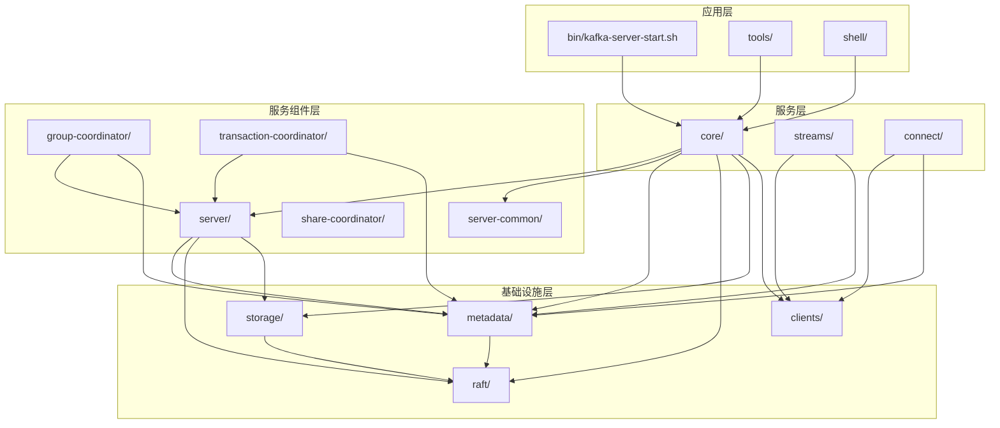
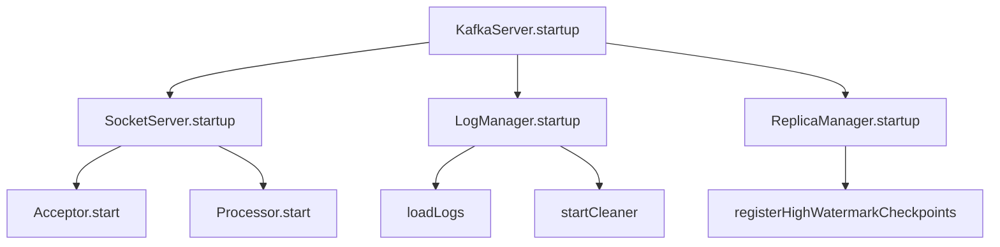

# Kafka 源码目录结构解析

## 目录
- [1. 顶层目录结构](#1-顶层目录结构)
- [2. 核心模块详解](#2-核心模块详解)
- [3. 构建系统](#3-构建系统)
- [4. 模块依赖关系](#4-模块依赖关系)
- [5. 源码阅读建议](#5-源码阅读建议)

---

## 1. 顶层目录结构

```
kafka/
├── bin/                    # 命令行脚本
├── clients/                # Java 客户端库 (Producer/Consumer)
├── connect/                # Kafka Connect 框架
├── config/                 # 配置文件示例
├── core/                   # 服务端核心实现 (Scala)
├── coordinator-common/     # 协调器通用代码
├── docker/                 # Docker 构建文件
├── docs/                   # 文档
├── examples/               # 示例代码
├── generator/              # 代码生成工具
├── group-coordinator/      # 消费者组协调器
├── jmh-benchmarks/         # 性能基准测试
├── metadata/               # 元数据管理
├── raft/                   # Raft 实现
├── server/                 # 服务器通用代码
├── server-common/          # 服务器通用组件
├── shell/                  # Shell 工具
├── storage/                # 存储层
├── streams/                # Kafka Streams
├── tests/                  # 集成测试
├── tools/                  # 工具类
├── transaction-coordinator/# 事务协调器
├── trogdor/               # 测试工具
├── vagrant/               # Vagrant 配置
├── gradle/                # Gradle 构建系统
├── build.gradle           # 主构建文件
├── settings.gradle        # Gradle 设置
└── gradlew                # Gradle 包装脚本
```

---

## 2. 核心模块详解

### 2.1 clients/ - 客户端库

**作用**：提供 Kafka 的 Java 客户端实现

```
clients/
└── src/main/java/org/apache/kafka/
    ├── clients/                     # 通用客户端组件
    │   ├──.consumer/               # 消费者网络客户端
    │   ├── producer/               # 生产者网络客户端
    │   ├── AdminClient.java       # 管理客户端
    │   ├── ClientUtils.java       # 客户端工具类
    │   ├── ConsumerConfig.java    # 消费者配置
    │   ├── ProducerConfig.java    # 生产者配置
    │   └── NetworkClient.java     # 网络层客户端
    │
    ├── consumer/                   # 消费者实现
    │   ├── ConsumerRecords.java   # 消息集合
    │   ├── ConsumerRecord.java    # 单条消息
    │   ├── KafkaConsumer.java     # 消费者主类
    │   ├── ConsumerCoordinator.java
    │   └── ConsumerGroupMetadata.java
    │
    ├── producer/                   # 生产者实现
    │   ├── KafkaProducer.java     # 生产者主类
    │   ├── ProducerRecord.java    # 生产消息
    │   ├── RecordAccumulator.java # 消息累积器
    │   └── Partitioner.java       # 分区选择器
    │
    └── common/                     # 通用组件
        ├── requests/               # 请求定义
        ├── responses/              # 响应定义
        ├── protocol/               # 协议定义
        ├── serialization/          # 序列化
        └── utils/                  # 工具类
```

**关键类说明:**

| 类 | 职责 |
|-----|------|
| `KafkaProducer` | 生产者主类，封装消息发送逻辑 |
| `KafkaConsumer` | 消费者主类，封装消息消费逻辑 |
| `NetworkClient` | 网络层，处理与 Broker 的连接 |
| `RecordAccumulator` | 缓冲待发送消息，批量发送 |
| `ConsumerCoordinator` | 管理消费者组协调 |

### 2.2 core/ - 服务端核心 (Scala)

**作用**：Kafka Broker 的核心实现，使用 Scala 编写

```
core/
└── src/main/scala/kafka/
    ├── Kafka.scala                 # 主入口点
    ├── server/                     # 服务器核心
    │   ├── KafkaRaftServer.scala  # KRaft 服务器
    │   ├── BrokerServer.scala     # Broker 实现
    │   ├── ControllerServer.scala # Controller 实现
    │   ├── KafkaApis.scala        # 请求处理
    │   ├── KafkaRequestHandler.scala
    │   ├── ReplicaManager.scala   # 副本管理
    │   ├── LogManager.scala       # 日志管理
    │   └── ...
    │
    ├── network/                    # 网络层
    │   ├── SocketServer.scala     # Socket 服务器
    │   ├── Processor.scala        # 请求处理器
    │   ├── Acceptor.scala         # 连接接受器
    │   └── RequestChannel.scala   # 请求通道
    │
    ├── log/                        # 日志存储
    │   ├── LogManager.scala       # 日志管理器
    │   ├── Log.scala              # 日志实现
    │   ├── LogSegment.scala       # 日志段
    │   ├── FileRecords.scala      # 文件记录
    │   ├── Index.scala            # 索引实现
    │   └── Cleaner.scala          # 日志清理
    │
    ├── cluster/                    # 集群管理
    │   ├── Partition.scala        # 分区
    │   ├── Broker.scala           # Broker 节点
    │   └── Replica.scala          # 副本
    │
    ├── utils/                      # 工具类
    │   ├── Logging.scala          # 日志
    │   ├── CoreUtils.scala        # 核心工具
    │   └── Json.scala             # JSON 处理
    │
    ├── coordinator/                # 协调器 (旧版)
    │   ├── GroupCoordinator.scala
    │   └── TransactionCoordinator.scala
    │
    ├── metrics/                    # 指标
    │   └── KafkaMetricsReporter.scala
    │
    └── api/                        # API 定义
        ├── LeaderAndIsr.scala
        └── ...
```

**核心包路径对照表:**

| 包路径 | 功能 | 主要语言 |
|-------|------|---------|
| `kafka.server` | 服务器核心 | Scala |
| `kafka.network` | 网络层 | Scala |
| `kafka.log` | 存储层 | Scala |
| `kafka.cluster` | 集群模型 | Scala |
| `kafka.coordinator` | 协调器 | Scala |
| `kafka.utils` | 工具类 | Scala |
| `kafka.api` | API 定义 | Scala |
| `org.apache.kafka.server` | Broker 组件 (Java) | Java |

### 2.3 server/ - 服务器通用代码

**作用**：Broker 和 Controller 共用的服务器组件 (Java)

```
server/src/main/java/org/apache/kafka/server/
├── AssignmentsManager.java         # 分区分配管理
├── BrokerFeatures.java             # Broker 特性
├── BrokerLifecycleManager.java     # Broker 生命周期
├── ClientMetricsManager.java       # 客户端指标
├── DelayedActionQueue.java         # 延迟操作队列
├── FetchManager.java               # Fetch 管理
├── KRaftTopicCreator.java          # Topic 创建器
├── NodeToControllerChannelManager.java # 到 Controller 的通道
└── ...
```

### 2.4 metadata/ - 元数据管理

**作用**：管理集群元数据

```
metadata/src/main/java/org/apache/kafka/metadata/
├── authorizer/                     # 授权相关
├── bootstrap/                      # 启动元数据
├── properties/                     # 元数据属性
├── publisher/                      # 元数据发布器
├── record/                         # 元数据记录
├── Candidate.java                 # 候选者
├── KafkaConfigSchema.java          # 配置 Schema
├── MetadataRecordSerde.java        # 元数据序列化
└── ...
```

### 2.5 raft/ - Raft 实现

**作用**：KRaft 模式的 Raft 协议实现

```
raft/src/main/java/org/apache/kafka/raft/
├── RaftManager.java                # Raft 管理器
├── RaftClient.java                 # Raft 客户端
├── RaftConfig.java                 # Raft 配置
├── QuorumState.java                # 法定人数状态
├── ReplicatedCounter.java          # 复制计数器
└── ...
```

### 2.6 storage/ - 存储层

**作用**: 存储相关的通用组件

```
storage/src/main/java/org/apache/kafka/storage/
├── internals/                      # 内部实现
│   └── log/                        # 日志相关
│       ├── LogConfig.java          # 日志配置
│       ├── LogDirFailureChannel.java
│       ├── ProducerStateManager.java
│       └── ...
└── metrics/                        # 存储指标
```

### 2.7 group-coordinator/ - 消费者组协调器

**作用**：现代化的消费者组协调器实现

```
group-coordinator/src/main/java/org/apache/kafka/coordinator/group/
├── GroupCoordinator.java           # 组协调器
├── GroupCoordinatorService.java    # 协调器服务
├── GroupMetadata.java              # 组元数据
├── ConsumerGroupMember.java        # 消费者组成员
├── Assignor.java                   # 分区分配器
└── ...
```

### 2.8 transaction-coordinator/ - 事务协调器

**作用**: 事务管理

```
transaction-coordinator/src/main/java/org/apache/kafka/coordinator/transaction/
├── TransactionCoordinator.java     # 事务协调器
├── TransactionCoordinatorService.java
├── TransactionStateManager.java    # 事务状态管理
├── ProducerIdManager.java          # Producer ID 管理
└── ...
```

### 2.9 streams/ - Kafka Streams

**作用**：流处理框架

```
streams/src/main/java/org/apache/kafka/streams/
├── KafkaStreams.java               # 主类
├── StreamsBuilder.java             # 构建器
├── Topology.java                   # 处理拓扑
├── processor/                      # 处理器
├── kstream/                        # KStream API
├── ktable/                         # KTable API
└── state/                          # 状态存储
```

### 2.10 connect/ - Kafka Connect

**作用**：数据连接框架

```
connect/
├── api/                            # Connect API
│   └── src/main/java/org/apache/kafka/connect/
│       ├── connector/              # Connector 接口
│       ├── source/                 # Source Connector
│       └── sink/                   # Sink Connector
│
├── runtime/                        # Connect 运行时
│   └── src/main/java/org/apache/kafka/connect/runtime/
│       ├── ConnectDistributed.java
│       ├── ConnectStandalone.java
│       ├── Worker.java
│       └── ...
│
├── transforms/                     # 数据转换
├── mirror/                         # MirrorMaker
└── file/                           # File Connector
```

---

## 3. 构建系统

### 3.1 Gradle 构建配置

Kafka 使用 Gradle 作为构建工具。

**settings.gradle** - 项目设置:

```gradle
rootProject.name = 'kafka'

include ':clients'
include ':core'
include ':connect:api'
include ':connect:runtime'
include ':connect:transforms'
include ':connect:mirror'
include ':connect:mirror-client'
include ':connect:json'
include ':connect:file'
include ':streams'
include ':streams:upgrade-system-tests-0100'
include ':streams:upgrade-system-tests-0101'
include ':streams:upgrade-system-tests-0102'
include ':streams:upgrade-system-tests-0102'
include ':streams:upgrade-system-tests-0110'
include ':streams:upgrade-system-tests-0111'
include ':streams:upgrade-system-tests-0112'
include ':streams:upgrade-system-tests-0113'
include ':streams:upgrade-system-tests-0114'
include ':streams:upgrade-system-tests-0200'
include ':streams:upgrade-system-tests-0201'
include ':streams:upgrade-system-tests-0202'
include ':streams:upgrade-system-tests-0210'
include ':streams:upgrade-system-tests-0211'
include ':streams:upgrade-system-tests-0220'
include ':streams:upgrade-system-tests-0221'
include ':streams:upgrade-system-tests-0222'
include ':streams:upgrade-system-tests-0230'
include ':streams:upgrade-system-tests-0240'
include ':streams:upgrade-system-tests-0300'
include ':streams:upgrade-system-tests-0301'
include ':streams:upgrade-system-tests-0302'
include ':streams:upgrade-system-tests-0303'
include ':streams:upgrade-system-tests-0304'
include ':streams:upgrade-system-tests-0305'
include ':streams:upgrade-system-tests-0306'
include ':streams:upgrade-system-tests-0307'
include ':streams:upgrade-system-tests-0308'
include ':streams:upgrade-system-tests-0309'
include ':streams:upgrade-system-tests-0310'
include ':streams:upgrade-system-tests-0311'
include ':streams:upgrade-system-tests-0312'
include ':streams:upgrade-system-tests-0313'
include ':streams:upgrade-system-tests-0314'
include ':streams:upgrade-system-tests-0315'
include ':streams:upgrade-system-tests-0316'
include ':streams:upgrade-system-tests-0317'
include ':streams:upgrade-system-tests-0318'
include ':streams:upgrade-system-tests-0319'
include ':streams:upgrade-system-tests-0320'
include ':streams:upgrade-system-tests-0321'
include ':streams:upgrade-system-tests-0322'
include ':streams:upgrade-system-tests-0323'
include ':streams:upgrade-system-tests-0324'
include ':streams:upgrade-system-tests-0325'
include ':streams:upgrade-system-tests-0326'
include ':streams:upgrade-system-tests-0327'
include ':streams:upgrade-system-tests-0328'
include ':streams:upgrade-system-tests-0330'
include ':streams:upgrade-system-tests-0331'
include ':streams:upgrade-system-tests-0332'
include ':streams:upgrade-system-tests-0333'
include ':streams:upgrade-system-tests-0334'
include ':streams:upgrade-system-tests-0335'
include ':streams:upgrade-system-tests-0336'
include ':streams:upgrade-system-tests-0337'
include ':tools'
include ':shell'
include ':server'
include ':server-common'
include ':metadata'
include ':generator'
include ':group-coordinator'
include ':group-coordinator:group-coordinator-api'
include ':transaction-coordinator'
include ':raft'
include ':storage'
include ':storage-api'
include ':share-coordinator'
include ':clients'
include ':test-common'
include ':trogdor'
```

### 3.2 主要依赖

**core 模块的主要依赖:**

```gradle
dependencies {
  // Kafka 客户端
  implementation project(':clients')
  implementation project(':server')
  implementation project(':server-common')
  implementation project(':metadata')
  implementation project(':raft')
  implementation project(':storage')

  // 网络层
  implementation 'org.scala-lang.modules:scala-collection-compat_2.13:2.11.0'

  // 日志
  implementation 'org.slf4j:slf4j-api:2.0.9'
  implementation 'org.slf4j:slf4j-reload4j:2.0.9'

  // 度量指标
  implementation 'com.yammer.metrics:metrics-core:2.2.0'

  // Zookeeper client (兼容性)
  implementation 'org.apache.zookeeper:zookeeper:3.8.4'

  // Jetty (JMX/REST)
  implementation 'org.eclipse.jetty:jetty-server:9.4.54.v20240208'

  // Scala
  implementation 'org.scala-lang:scala-library:2.13.12'
  implementation 'org.scala-lang:scala-reflect:2.13.12'
}
```

### 3.3 常用构建命令

```bash
# 清理
./gradlew clean

# 编译
./gradlew build

# 编译特定模块
./gradlew :core:build

# 运行测试
./gradlew test

# 运行特定测试
./gradlew :core:test --tests kafka.server.KafkaServerTest

# 构建分发包
./gradlew clean releaseTarGz

# 跳过测试
./gradlew build -x test

# 查看依赖
./gradlew :core:dependencies

# IDE 项目生成
./gradlew idea    # IntelliJ IDEA
./gradlew eclipse # Eclipse
```

---

## 4. 模块依赖关系

### 4.1 依赖层次图



### 4.2 模块间接口

| 模块 | 提供的接口 | 被依赖方 |
|-----|----------|---------|
| clients | Producer/Consumer API | 所有模块 |
| server | Server, KafkaBroker | core, connect |
| metadata | MetadataLoader, MetadataPublisher | server, core |
| raft | RaftManager | metadata, server |
| storage | LogConfig, LogManager | core |
| group-coordinator | GroupCoordinator | core |
| transaction-coordinator | TransactionCoordinator | core |

---

## 5. 源码阅读建议

### 5.1 按功能模块阅读

推荐的学习路径:

```
1. 基础准备
   ├── clients/ (了解客户端工作原理)
   └── metadata/ (了解元数据管理)

2. 核心服务
   ├── server/ (了解服务器通用组件)
   ├── raft/ (了解 Raft 实现)
   └── core/ (了解核心实现)

3. 专题深入
   ├── network/ (网络层)
   ├── log/ (存储层)
   ├── coordinator/ (协调器)
   └── api/ (API 定义)
```

### 5.2 关键类阅读顺序

**服务端启动:**
```
1. kafka.Kafka (主入口)
2. kafka.server.KafkaRaftServer (KRaft 服务器)
3. kafka.server.BrokerServer (Broker 实现)
4. kafka.server.SharedServer (共享组件)
```

**网络层:**
```
1. kafka.network.SocketServer (网络服务器)
2. kafka.network.Acceptor (连接接受)
3. kafka.network.Processor (请求处理)
4. kafka.network.RequestChannel (请求队列)
```

**请求处理:**
```
1. kafka.server.KafkaApis (请求路由)
2. kafka.server.KafkaRequestHandler (处理线程)
3. kafka.server.ReplicaManager (副本管理)
```

**存储层:**
```
1. kafka.log.LogManager (日志管理)
2. kafka.log.Log (单个日志)
3. kafka.log.LogSegment (日志段)
4. kafka.log.FileRecords (文件记录)
5. kafka.log.Index (索引)
```

### 5.3 IDE 配置建议

**IntelliJ IDEA:**
1. 安装 Scala 插件
2. 安装 Scala Coloring 插件
3. 启用 "Use external build" (加快构建)
4. 配置 code style 为 Kafka 官方风格

**VS Code:**
1. 安装 Scala (Metals) 扩展
2. 安装 Gradle for Java 扩展
3. 配置 Java 17+

### 5.4 调试配置

**远程调试 Broker:**

```bash
# 启动 Broker 时添加 JVM 参数
export KAFKA_OPTS="-agentlib:jdwp=transport=dt_socket,server=y,suspend=n,address=5005"
bin/kafka-server-start.sh config/server.properties

# 然后在 IDE 中连接到 localhost:5005
```

**本地调试:**

```bash
# 直接运行 Kafka.main
java -agentlib:jdwp=transport=dt_socket,server=y,suspend=y,address=5005 \
     -cp $(find ~/.gradle/caches -name "kafka*.jar" | tr '\n' ':') \
     kafka.Kafka config/server.properties
```

---

## 6. 关键源码文件速查表

### 6.1 核心类索引

| 功能 | 文件路径 | 说明 |
|-----|---------|------|
| **主入口** | `core/src/main/scala/kafka/Kafka.scala` | 程序入口点 |
| **Broker** | `core/src/main/scala/kafka/server/BrokerServer.scala` | Broker 实现 |
| **Controller** | `core/src/main/scala/kafka/server/ControllerServer.scala` | Controller 实现 |
| **API处理** | `core/src/main/scala/kafka/server/KafkaApis.scala` | 请求处理 |
| **网络层** | `core/src/main/scala/kafka/network/SocketServer.scala` | 网络服务器 |
| **副本管理** | `core/src/main/scala/kafka/server/ReplicaManager.scala` | 副本管理器 |
| **日志管理** | `core/src/main/scala/kafka/log/LogManager.scala` | 日志管理器 |
| **日志段** | `core/src/main/scala/kafka/log/LogSegment.scala` | 日志段 |
| **索引** | `core/src/main/scala/kafka/log/index/AbstractIndex.scala` | 索引基类 |
| **生产者** | `clients/src/main/java/org/apache/kafka/clients/producer/KafkaProducer.java` | 生产者主类 |
| **消费者** | `clients/src/main/java/org/apache/kafka/clients/consumer/KafkaConsumer.java` | 消费者主类 |
| **组协调** | `group-coordinator/src/main/java/org/apache/kafka/coordinator/group/GroupCoordinator.java` | 组协调器 |
| **事务协调** | `transaction-coordinator/src/main/java/org/apache/kafka/coordinator/transaction/TransactionCoordinator.java` | 事务协调器 |

### 6.2 配置类索引

| 配置类 | 路径 | 说明 |
|-------|-----|------|
| KafkaConfig | `core/src/main/scala/kafka/server/KafkaConfig.scala` | Broker 配置 |
| ProducerConfig | `clients/src/main/java/org/apache/kafka/clients/producer/ProducerConfig.java` | 生产者配置 |
| ConsumerConfig | `clients/src/main/java/org/apache/kafka/clients/consumer/ConsumerConfig.java` | 消费者配置 |
| LogConfig | `storage/src/main/java/org/apache/kafka/storage/internals/log/LogConfig.java` | 日志配置 |

---

## 7. 源码阅读工具与技巧

### 7.1 高效阅读技巧

**1. 自顶向下阅读法**
```
第一轮: 理解架构
  ├── 查看 README 和架构文档
  ├── 理解模块划分和职责
  └── 绘制组件关系图

第二轮: 跟踪流程
  ├── 从主入口开始跟踪
  ├── 记录关键调用链
  └── 标注核心类和方法

第三轮: 深入细节
  ├── 研究关键算法实现
  ├── 理解设计模式应用
  └── 分析性能优化点
```

**2. 用例驱动阅读法**：
```
选择一个具体场景:
  ├── Producer 发送消息
  ├── Consumer 消费消息
  ├── Broker 启动
  ├── Partition Leader 选举
  └── Rebalance 触发

跟踪完整流程:
  1. 找到入口点
  2. 跟踪调用链
  3. 记录关键决策点
  4. 理解错误处理
```

**3. 对比阅读法**：
```
对比不同版本:
  ├── 查看 Git 历史
  ├── 对比实现差异
  └── 理解演进原因

对比类似组件:
  ├── GroupCoordinator vs TransactionCoordinator
  ├── Leader vs Follower
  └── Controller vs Broker
```

### 7.2 代码搜索技巧

**在 IDEA 中搜索:**

1. **按类名搜索**
   - 快捷键: `Cmd+O` (Mac) / `Ctrl+N` (Win)
   - 示例: 输入 `KafkaApis` 快速定位

2. **按文件名搜索**
   - 快捷键: `Cmd+Shift+O` (Mac) / `Ctrl+Shift+N` (Win)
   - 示例: 输入 `LogManager.scala`

3. **按符号搜索**
   - 快捷键: `Cmd+Opt+O` (Mac) / `Ctrl+Alt+Shift+N` (Win)
   - 示例: 搜索方法 `appendRecords`

4. **结构化搜索**
   - Edit → Find → Search Structurally
   - 按代码模式搜索
   - 示例: 查找所有实现 `AppendRecords` 接口的类

**使用命令行搜索:**

```bash
# 在源码中搜索关键词
grep -r "ReplicaManager" --include="*.scala" core/src/main/

# 查找类的定义
find . -name "*.scala" -exec grep -l "class KafkaApis" {} \;

# 查找方法的调用
grep -rn "handleProduceRequest" core/src/main/scala/
```

### 7.3 理解 Scala 代码

**Scala 特有语法快速参考:**

```scala
// 1. 单例对象
object KafkaServer {  // 相当于 Java 的 static 类
  def main(args: Array[String]): Unit = {
    // ...
  }
}

// 2. 类定义
class KafkaServer(config: KafkaConfig) extends Logging {
  // 构造函数参数自动成为字段
}

// 3. Trait (接口)
trait Logging {
  def logger: Logger
}

// 4. 模式匹配
request match {
  case produce: ProduceRequest => handleProduce(produce)
  case fetch: FetchRequest => handleFetch(fetch)
  case _ => handleUnknown(request)
}

// 5. Option 类型 (避免 null)
val replica: Option[Replica] = getReplica(id)
replica match {
  case Some(r) => r.lep
  case None => -1
}

// 6. 隐式转换
implicit val ec = ExecutionContext.global
// 编译器会自动注入参数

// 7. 高阶函数
partitions.foreach { partition =>
  partition.append(records)
}

// 8. for 推导式
for {
  partition <- partitions
  replica <- partition.replicas
  if replica.isAlive
} yield replica.id
```

**Java 开发者过渡建议：**

1. **先看 Java 代码**：从 `clients/` 模块开始
2. **理解 Scala 特性**：重点关注类、对象、trait
3. **使用 IDEA 支持**：利用 IDE 的类型提示
4. **参考官方文档**：[Scala Tour](https://docs.scala-lang.org/tour/)

### 7.4 绘制调用关系图

**使用 IDEA 生成**：

1. **查看调用层次**
   - 右键方法 → Find Usages
   - 或快捷键: `Cmd+Alt+F7` (Mac) / `Ctrl+Alt+F7` (Win)

2. **查看类型层次**
   - 右键类 → Type Hierarchy
   - 或快捷键: `Cmd+H` (Mac) / `Ctrl+H` (Win)

3. **生成 UML 图**
   - 安装 PlantUML 插件
   - 右键包 → Diagrams → Show Diagram

**手动绘制示例:**



### 7.5 使用 Git 历史学习

**查看文件演进:**

```bash
# 查看文件的修改历史
git log --oneline -- core/src/main/scala/kafka/server/KafkaServer.scala

# 查看特定提交的修改
git show <commit-hash> -- core/src/main/scala/kafka/server/KafkaServer.scala

# 查看文件的作者统计
git shortlog -sn -- core/src/main/scala/kafka/server/KafkaServer.scala

# 查看特定行的修改历史
git blame -L 100,120 core/src/main/scala/kafka/server/KafkaServer.scala
```

**查看代码演进的技巧:**

1. **对比版本差异**
   ```bash
   # 对比两个版本
   git diff 3.6..3.7 -- core/src/main/scala/kafka/server/

   # 查看特定 KIP 的修改
   git log --grep="KIP-500" --oneline
   ```

2. **理解重构原因**
   ```bash
   # 查看重构相关的提交
   git log --grep="refactor" --oneline

   # 查看性能优化
   git log --grep="performance" --oneline
   ```

---

## 8. 版本特性演进

### 8.1 架构演进

**ZooKeeper 模式 (2.x 及之前)**
```
Broker ←→ ZooKeeper
  ├─ 元数据存储在 ZooKeeper
  ├─ Controller 通过 ZK 选举
  └─ Broker 通过 Watch 监听变化
```

**KRaft 模式 (3.x+)**
```
Broker ←→ Controller Quorum
  ├─ 元数据存储在 __cluster_metadata
  ├─ Controller 通过 Raft 选举
  └─ Broker 通过 RPC 查询元数据
```

### 8.2 模块演进

| 版本 | 主要变化 |
|-----|---------|
| 2.8 | KRaft 引入 (早期预览) |
| 3.0 | KRaft 生产就绪 (GA) |
| 3.1 | 移除部分 ZooKeeper 依赖 |
| 3.2 | Controller 改进 |
| 3.3 | 性能优化 |
| 3.4 | 弃用 ZooKeeper 模式 |
| 3.5+ | ZooKeeper 模式移除计划 |

### 8.3 新增模块

**3.x 新增的重要模块:**

```
metadata/          # 元数据管理 (替代部分 ZooKeeper 功能)
raft/              # Raft 协议实现
server-common/     # Broker 和 Controller 共用代码
group-coordinator/ # 现代化的消费者组协调器
transaction-coordinator/ # 现代化的事务协调器
```

---

## 9. 常用配置文件说明

### 9.1 Gradle 配置

**gradle.properties** - 项目配置：
```properties
# Scala 版本
scalaVersion=2.13.12

# Kafka 版本
version=3.7.0-SNAPSHOT

# 依赖版本
org.slf4j.version=2.0.9
```

**build.gradle** - 模块构建配置:
```gradle
plugins {
    id 'scala'
    id 'org.jetbrains.gradle.plugin.idea-ext' version '1.1.7'
}

dependencies {
    implementation project(':clients')
    implementation 'org.scala-lang:scala-library:2.13.12'
}
```

### 9.2 IDEA 配置

**.idea/workspace.xml** - 工作区配置：
```xml
<component name="RunManager">
  <configuration name="Kafka" type="Application">
    <option name="MAIN_CLASS_NAME" value="kafka.Kafka" />
    <option name="PROGRAM_PARAMETERS" value="config/server.properties" />
    <option name="VM_PARAMETERS" value="-Dlog4j.configuration=file:config/log4j2.properties" />
  </configuration>
</component>
```

### 9.3 Kafka 配置

**config/server.properties** - Broker 配置：
```properties
# 节点角色 (KRaft 模式)
process.roles=broker,controller

# 节点 ID
node.id=1

# Controller 监听器
controller.quorum.voters=1@localhost:9093

# 监听器
listeners=PLAINTEXT://:9092,CONTROLLER://:9093

# 日志目录
log.dirs=/tmp/kafka-logs
```

---

## 10. 总结

Kafka 的源码结构体现了以下特点:

1. **模块化设计**：清晰的模块边界，职责明确
2. **语言混用**：核心用 Scala，客户端用 Java
3. **分层架构**：从基础设施到应用层的清晰分层
4. **Gradle 构建**：灵活的构建系统
5. **完整的测试**：每个模块都有对应的测试

**阅读建议:**
- 先理解整体架构，再深入细节
- 从客户端开始，更容易理解交互流程
- 多用调试器跟踪执行流程
- 关注接口和抽象，而不是具体实现

**源码阅读路径:**
```
入门路径:
  clients/ → server/ → metadata/ → raft/ → core/

专题路径:
  网络: clients/network/ → core/network/
  存储: storage/ → core/log/
  协调器: group-coordinator/ → transaction-coordinator/
```

**下一步:**
1. 选择一个感兴趣的模块
2. 使用 IDEA 的导航功能
3. 跟踪关键流程
4. 绘制调用关系图
5. 记录学习笔记

---

**下一步**：[02. 构建与调试环境搭建](./02-build-debug-setup.md)
