# Kafka 核心概念深度解析

## 目录
- [1. Producer 消息生产者](#1-producer-消息生产者)
- [2. Consumer 消息消费者](#2-consumer-消息消费者)
- [3. Broker 服务器节点](#3-broker-服务器节点)
- [4. Topic 主题](#4-topic-主题)
- [5. Partition 分区](#5-partition-分区)
- [6. Segment 段](#6-segment-段)
- [7. Offset 偏移量](#7-offset-偏移量)
- [8. Consumer Group 消费者组](#8-consumer-group-消费者组)
- [9. Replica 副本](#9-replica-副本)
- [10. Leader/Follower 角色](#10-leaderfollower-角色)
- [11. ISR 机制](#11-isr-机制)
- [12. Controller 控制器](#12-controller-控制器)
- [13. KRaft 选举机制](#13-kraft-选举机制)

---

## 1. Producer 消息生产者

### 1.1 核心职责

Producer 负责将消息发送到 Kafka Topic，其主要职责包括：

```java
/**
 * Producer 核心职责:
 *
 * 1. 消息序列化
 *    - Key Serializer: 将 Key 序列化为字节数组
 *    - Value Serializer: 将 Value 序列化为字节数组
 *
 * 2. 分区选择
 *    - 如果指定分区，直接发送到该分区
 *    - 如果未指定，通过 Partitioner 选择分区
 *
 * 3. 消息 batching (批量发送)
 *    - 累积消息到 batch
 *    - batch.size 或 linger.ms 达到阈值时发送
 *
 * 4. 可靠性保障
 *    - 重试机制 (retries)
 *    - ACK 确认机制 (acks)
 *    - 幂等性 (enable.idempotence)
 *    - 事务支持 (transactions)
 */
```

### 1.2 消息发送流程

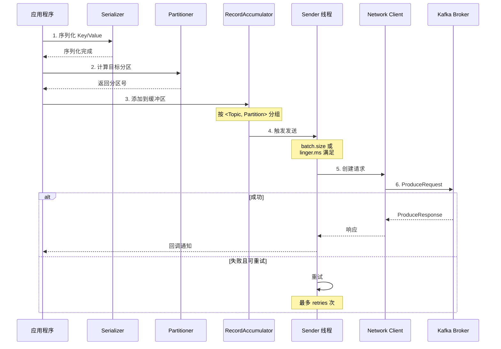

### 1.3 分区策略

```java
/**
 * DefaultPartitioner 分区选择逻辑
 *
 * 1. 如果消息指定了分区，直接使用
 *
 * 2. 如果有 Key：
 *    - 使用 Key 的 Hash 值: murmur2(key)
 *    - 对分区数取模: hash % partitionCount
 *    - 保证相同 Key 的消息进入同一分区
 *
 * 3. 如果没有 Key：
 *    - 粘性分区 (Sticky Partitioning, Kafka 2.4+)
 *    - 随机选择一个分区
 *    - 尽可能使用该分区直到 batch 满或超时
 *    - 然后切换到下一个分区
 *
 * 优势:
 * - 有 Key: 保证顺序性
 * - 无 Key: 提高吞吐量 (减少 batch 数量)
 */
```

### 1.4 ACK 机制详解

| acks 配置 | 说明 | 可靠性 | 性能 | 适用场景 |
|----------|------|--------|------|----------|
| **acks=0** | 发送后不等待确认 | 最低 | 最高 | 允许数据丢失 |
| **acks=1** | 等待 Leader 确认 | 中等 | 高 | 平衡可靠性和性能 |
| **acks=-1/all** | 等待 ISR 所有副本确认 | 最高 | 较低 | 金融/关键业务 |

```java
/**
 * acks=0 (Fire and Forget)
 * - Producer 发送后立即返回
 * - 不等待任何确认
 * - 可能丢失数据
 *
 * 适用: 日志收集、指标采集等允许丢失的场景
 *
 * acks=1 (Leader Ack)
 * - Leader 写入成功后返回
 * - Follower 可能未同步
 * - Leader 故障时可能丢失数据
 *
 * 适用: 大多数普通应用
 *
 * acks=-1 (ISR Ack)
 * - ISR 中所有副本都写入成功后返回
 * - 最强可靠性保证
 * - 需要 min.insync.replicas 配合
 *
 * 适用: 金融交易、订单系统等关键业务
 */
```

---

## 2. Consumer 消息消费者

### 2.1 核心职责

```java
/**
 * Consumer 核心职责:
 *
 * 1. 消息拉取
 *    - 从 Broker 拉取消息
 *    - 支持批量拉取 (fetch.min.bytes)
 *    - 可配置等待时间 (fetch.max.wait.ms)
 *
 * 2. 反序列化
 *    - Key Deserializer: 将字节数组反序列化为 Key
 *    - Value Deserializer: 将字节数组反序列化为 Value
 *
 * 3. 消费位置管理
 *    - 自动提交 (enable.auto.commit)
 *    - 手动提交 (commitSync/commitAsync)
 *    - 重置策略 (auto.offset.reset)
 *
 * 4. Rebalance 协调
 *    - 加入消费者组
 *    - 分区分配
 *    - 心跳维持
 *    - 退出时释放分区
 */
```

### 2.2 消费模型对比

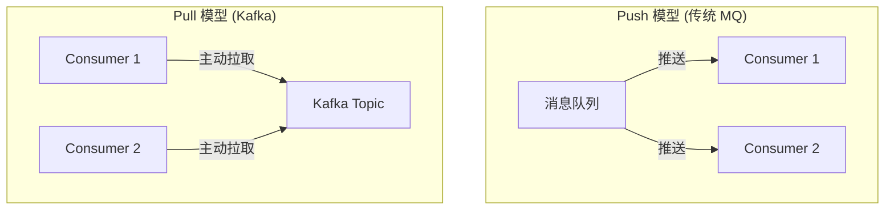

```java
/**
 * Push vs Pull 模型:
 *
 * Push 模型 (传统 MQ):
 * - 优点: 实时性高
 * - 缺点: 消费者处理能力不同时难以控制
 *
 * Pull 模型 (Kafka):
 * - 优点: 消费者控制消费速率
 * - 缺点: 可能有延迟
 *
 * Kafka 折中方案:
 * - 长轮询 (long polling)
 * - Consumer 发起 Fetch 请求
 * - Broker 有数据立即返回
 * - 无数据等待最多 fetch.max.wait.ms
 */
```

### 2.3 Offset 管理机制

```java
/**
 * Offset 存储位置:
 *
 * 旧版本 (Kafka 0.8): 存储在 ZooKeeper
 * - 频繁更新造成 ZooKeeper 压力
 * - 不支持增量查询
 *
 * 新版本 (Kafka 0.9+): 存储在 __consumer_offsets Topic
 * - 类似普通 Topic，可以分区
 * - 利用 Kafka 的高吞吐能力
 * - 支持增量查询
 *
 * Offset 提交策略:
 *
 * 1. 自动提交 (enable.auto.commit=true)
 *    - 定期提交 (auto.commit.interval.ms=5000)
 *    - 简单但可能重复消费或丢失
 *
 * 2. 同步手动提交 (commitSync)
 *    - 显式调用，阻塞直到成功
 *    - 可靠性高，但可能阻塞
 *
 * 3. 异步手动提交 (commitAsync)
 *    - 非阻塞，性能好
 *    - 可能失败，需要处理回调
 */
```

---

## 3. Broker 服务器节点

### 3.1 核心功能

```java
/**
 * Broker 核心功能模块:
 *
 * 1. 网络通信 (SocketServer)
 *    - 接受客户端连接
 *    - 处理请求和响应
 *    - Reactor 模式
 *
 * 2. 存储管理 (LogManager)
 *    - 创建和删除日志
 *    - 日志段管理
 *    - 日志清理
 *
 * 3. 副本管理 (ReplicaManager)
 *    - 副本同步
 *    - ISR 维护
 *    - Leader 选举
 *
 * 4. 协调器 (Coordinators)
 *    - GroupCoordinator: 消费者组
 *    - TransactionCoordinator: 事务
 *
 * 5. 元数据 (MetadataCache)
 *    - 集群元数据缓存
 *    - Topic 和 Partition 信息
 *    - Leader 和 ISR 信息
 */
```

### 3.2 Broker 角色类型

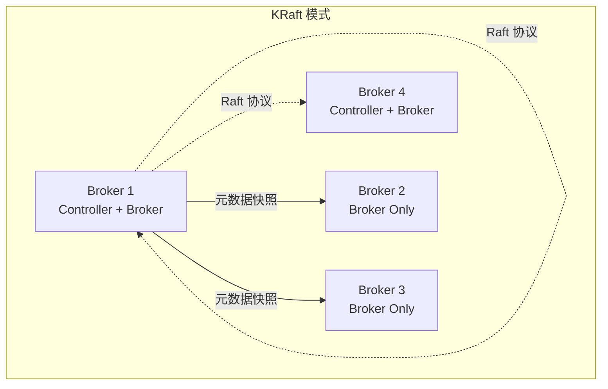

```java
/**
 * Broker 角色分类 (KRaft 模式):
 *
 * process.roles 配置:
 *
 * 1. broker (仅 Broker)
 *    - 处理客户端请求
 *    - 存储数据分区
 *    - 不参与元数据管理
 *
 * 2. controller (仅 Controller)
 *    - 管理集群元数据
 *    - 处理元数据变更请求
 *    - 不存储数据分区
 *    - 管理元数据日志
 *
 * 3. broker,controller (组合模式)
 *    - 同时作为 Broker 和 Controller
 *    - 参与元数据管理
 *    - 存储数据分区
 *    - 适合小集群
 */
```

---

## 4. Topic 主题

### 4.1 Topic 基本概念

```java
/**
 * Topic 是消息的逻辑分类
 *
 * 特性:
 * 1. 命名规则
 *    - 不能包含: / \ : * ? " < > | 空格
 *    - 长度限制: 249 字符
 *    - 区分大小写
 *    - 推荐使用点分隔: com.company.topic
 *
 * 2. 内部 Topic (System Topics)
 *    - __cluster_metadata: 元数据日志
 *    - __consumer_offsets: 消费者 Offset
 *    - __transaction_state: 事务状态
 *    - 以 __ 开头，不可删除
 *
 * 3. Topic 配置
 *    - partition.count: 分区数 (创建后不可减少)
 *    - replication.factor: 副本数
 *    - retention.ms: 保留时间
 *    - retention.bytes: 保留大小
 */
```

### 4.2 Topic 创建流程

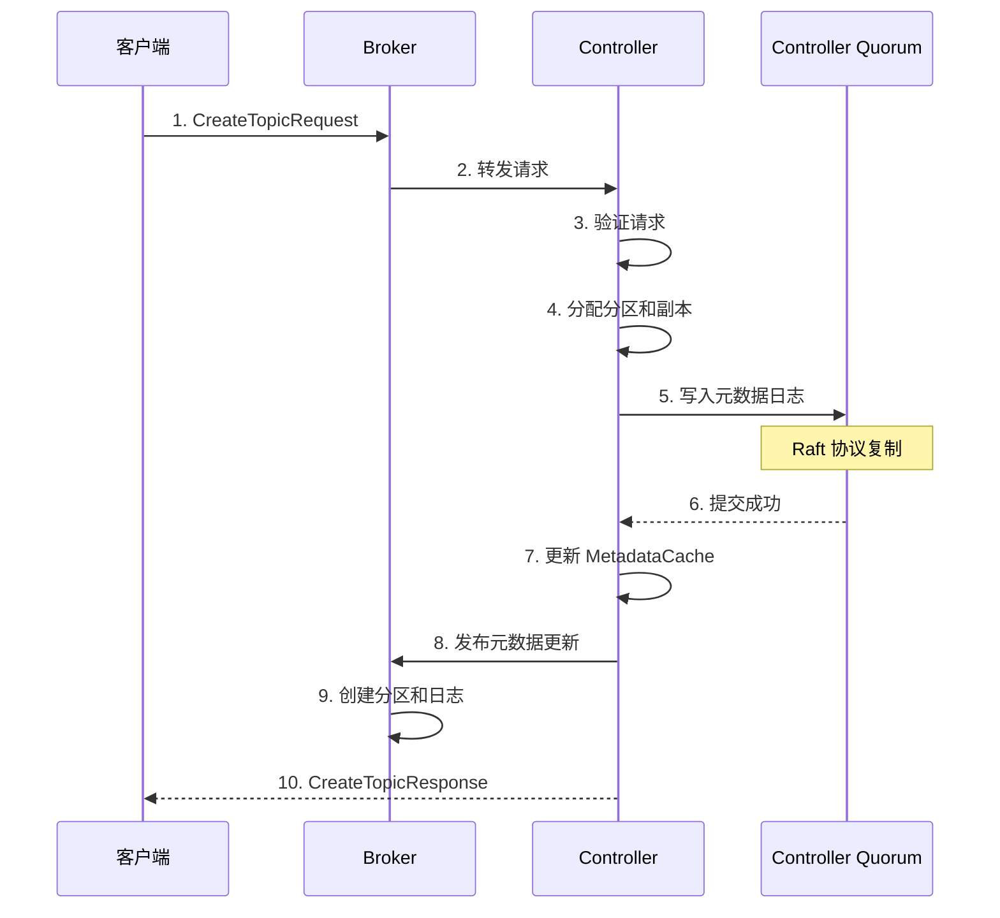

---

## 5. Partition 分区

### 5.1 分区的作用

```java
/**
 * 为什么需要 Partition?
 *
 * 1. 并行处理
 *    - 单个 Topic 的数据分散到多个分区
 *    - 不同分区可以并行读写
 *    - 提高吞吐量
 *
 * 2. 水平扩展
 *    - 分区分布在不同的 Broker
 *    - 增加分区数可增加并行度
 *    - 存储容量可线性扩展
 *
 * 3. 有序性保证
 *    - 分区内有序 (单分区)
 *    - 分区间无序 (多分区)
 *    - 相同 Key 的消息进入同一分区
 *
 * 4. 负载均衡
 *    - 分区 Leader 均匀分布
 *    - 请求分散到不同 Broker
 */
```

### 5.2 分区分配策略

```java
/**
 * 分区分配到 Broker 的策略:
 *
 * 1. Rack Aware (机架感知)
 *    - 考虑 Broker 所在机架
 *    - 副本尽量分布在不同机架
 *    - 提高容灾能力
 *
 * 2. Round-Robin (轮询)
 *    - 依次分配到各个 Broker
 *    - 保证负载均衡
 *
 * 3. Uniform (均匀)
 *    - 尽量均匀分布
 *    - 避免某个 Broker 承载过多
 */
```

### 5.3 分区数选择

```java
/**
 * 分区数如何选择?
 *
 * 考虑因素:
 *
 * 1. 吞吐量需求
 *    - 单分区吞吐量: ~10-100 MB/s
 *    - 目标吞吐量 / 单分区吞吐量 = 最小分区数
 *
 * 2. 消费者数量
 *    - 同组消费者数 <= 分区数
 *    - 多余的消费者将空闲
 *
 * 3. 资源开销
 *    - 每个分区占用文件句柄
 *    - 每个分区有独立的内存结构
 *    - 过多分区增加 ZooKeeper/KRaft 负担
 *
 * 经验公式:
 * - 分区数 = max(目标吞吐/单分区吞吐, 消费者数)
 * - 建议从小开始，按需扩展
 */
```

---

## 6. Segment 段

### 6.1 段的结构

```java
/**
 * LogSegment 组成:
 *
 * 1. .log 文件
 *    - 实际消息数据
 *    - 按顺序追加写入
 *    - 文件名 = 基准 Offset
 *
 * 2. .index 文件
 *    - 稀疏索引 (并非每条消息)
 *    - 映射: Offset -> Position
 *    - 默认每 4KB 创建一个索引项
 *
 * 3. .timeindex 文件
 *    - 时间索引
 *    - 映射: Timestamp -> Offset
 *    - 用于按时间查询
 *
 * 4. .snapshot 文件
 *    - ProducerId 快照
 *    - 事务相关
 *    - 定期生成
 */
```

### 6.2 段的滚动

```java
/**
 * 段滚动触发条件:
 *
 * 1. 大小限制
 *    - log.segment.bytes=1GB (默认)
 *    - 达到大小后创建新段
 *
 * 2. 时间限制
 *    - log.roll.ms 或 log.roll.hours
 *    - 超时后创建新段
 *
 * 3. Offset 索引限制
 *    - log.index.size.max.bytes=10MB
 *    - 索引文件过大时滚动
 *
 * 滚动过程:
 * 1. 关闭当前段
 * 2. 创建新段
 * 3. 更新活跃段指针
 * 4. 旧段变为只读
 */
```

### 6.3 段的查找

```java
/**
 * 查找 Offset 的过程:
 *
 * 1. 定位段
 *    - 二分查找所有段
 *    - 找到基准 Offset <= 目标的最大段
 *
 * 2. 段内查找
 *    - 二分查找 .index 文件
 *    - 找到 <= 目标的最大索引项
 *    - 从对应的 Position 开始扫描
 *    - 顺序读取直到找到目标 Offset
 *
 * 时间复杂度:
 * - 段定位: O(log numSegments)
 * - 索引查找: O(log numIndexEntries)
 * - 顺序扫描: O(距离)
 *
 * 稀疏索引优势:
 * - 索引文件小 (约为 log 的 1/4000)
 * - 可完全加载到内存
 * - 平均扫描距离 < indexIntervalBytes
 */
```

---

## 7. Offset 偏移量

### 7.1 Offset 类型

```java
/**
 * Kafka 中的 Offset 类型:
 *
 * 1. Log Offset (消息位置)
 *    - 分区内从 0 开始递增
 *    - 每条消息唯一
 *    - 不可重用
 *
 * 2. Consumer Offset (消费位置)
 *    - 记录消费者消费到的位置
 *    - 存储在 __consumer_offsets
 *    - 可以重置
 *
 * 3. Base Offset (段基准)
 *    - 段文件名 = 第一条消息的 Offset
 *    - 用于段定位
 *
 * 4. Committed Offset (提交位置)
 *    - 消费者已提交的位置
 *    - 故障恢复时从这里继续
 */
```

### 7.2 Offset 管理策略

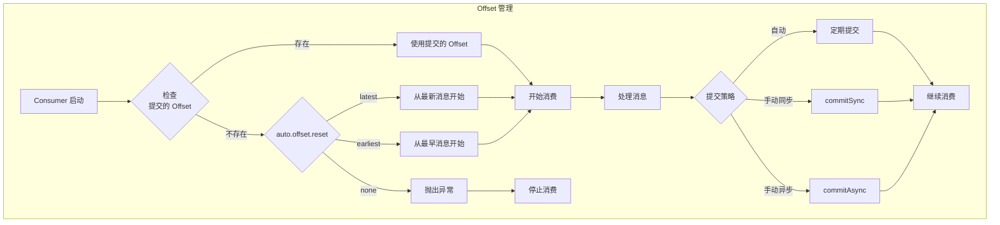

---

## 8. Consumer Group 消费者组

### 8.1 为什么需要消费者组?

```java
/**
 * 单消费者的问题:
 *
 * 1. 吞吐量受限
 *    - 单个消费者处理能力有限
 *    - 无法充分利用分区并行性
 *
 * 2. 可用性问题
 *    - 消费者故障时消费中断
 *
 * 消费者组的优势:
 *
 * 1. 水平扩展
 *    - 多个消费者并行消费
 *    - 提高整体吞吐量
 *
 * 2. 高可用
 *    - 单个消费者故障时自动 Rebalance
 *    - 分区重新分配给健康的消费者
 *
 * 3. 消费语义
 *    - 组内: 一个分区只能被一个消费者消费
 *    - 组间: 不同组独立消费，互不影响
 */
```

### 8.2 分区分配策略

```java
/**
 * PartitionAssignor 分区分配策略:
 *
 * 1. Range (范围, 默认)
 *    - 按分区分片，连续分配
 *    - 例: 7 分区, 3 消费者
 *      - C1: 0,1,2
 *      - C2: 3,4,5
 *      - C3: 6
 *
 * 2. RoundRobin (轮询)
 *    - 依次轮询分配
 *    - 例: 7 分区, 3 消费者
 *      - C1: 0,3,6
 *      - C2: 1,4
 *      - C3: 2,5
 *
 * 3. Sticky (粘性)
 *    - 尽量保持上次的分配
 *    - Rebalance 时只移动必要的分区
 *    - 减少分区移动
 *
 * 4. Cooperative (协作, 默认从 2.4+)
 *    - 渐进式 Rebalance
 *    - 先停止再均衡 (旧)
 *      - 所有消费者停止
 *      - 重新分配
 *      - 所有消费者启动
 *    - 协作再均衡 (新)
 *      - 只涉及必要的消费者
 *      - 减少消费中断
 */
```

---

## 9. Replica 副本

### 9.1 副本的作用

```java
/**
 * 为什么需要副本?
 *
 * 1. 数据可靠性
 *    - 防止单点故障
 *    - 副本数越多可靠性越高
 *
 * 2. 高可用性
 *    - Leader 故障时 Follower 接管
 *    - 自动故障转移
 *
 * 3. 读取扩展 (潜在)
 *    - Follower 可服务读取
 *    - 分担 Leader 压力
 *
 * 副本类型:
 * 1. Leader Replica
 *    - 处理所有读写请求
 *    - 每个 Partition 有且仅有一个
 *
 * 2. Follower Replica
 *    - 从 Leader 同步数据
 *    - 不处理客户端请求 (默认)
 *    - 可配置为可读 (follower.fetch)
 *
 * 3. ISR (In-Sync Replica)
 *    - 与 Leader 保持同步的副本
 *    - 动态集合，慢副本会被移除
 *    - 快副本可以重新加入
 */
```

### 9.2 副本同步流程

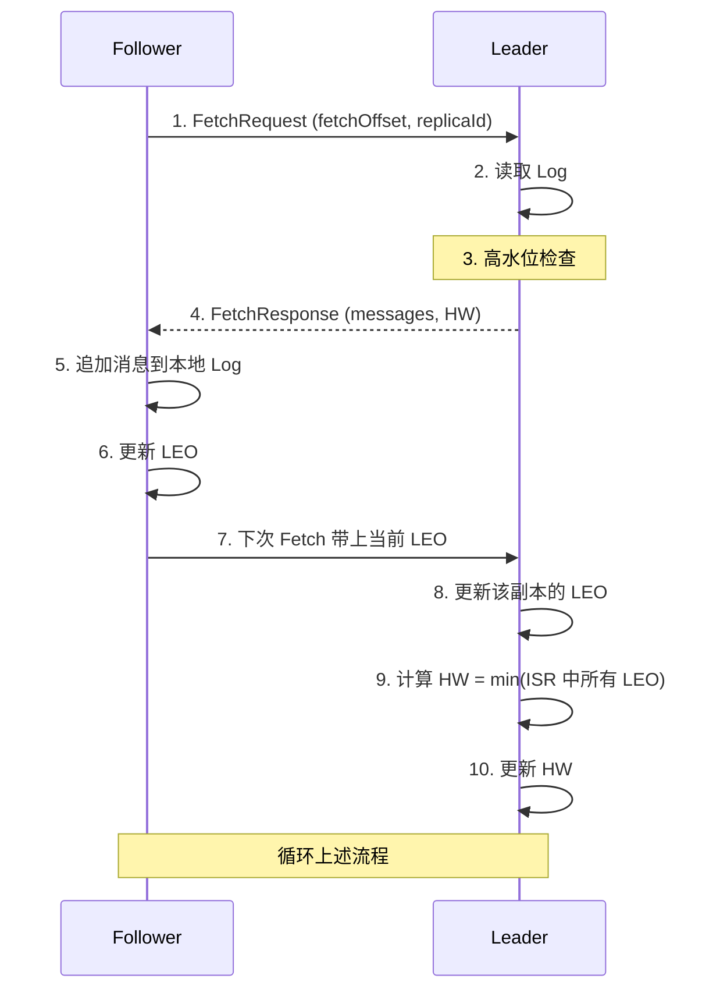

```java
/**
 * 关键概念:
 *
 * 1. LEO (Log End Offset)
 *    - 日志末端位移
 *    - 下一条消息将要写入的 Offset
 *    - 每个副本都有自己的 LEO
 *
 * 2. HW (High Watermark)
 *    - 高水位
 *    - ISR 中所有副本都已同步的 Offset
 *    - HW 之前的消息对 Consumer 可见
 *    - HW 之后的消息可能未完全复制
 *
 * 3. HW 更新条件:
 *    - Leader 收到 ISR 中所有副本的 LEO
 *    - HW = min(ISR 中所有副本的 LEO)
 *
 * 4. 消息可见性:
 *    - Consumer 只能消费到 HW 之前的消息
 *    - 防止消息丢失
 */
```

---

## 10. Leader/Follower 角色

### 10.1 Leader 职责

```java
/**
 * Leader Replica 职责:
 *
 * 1. 处理所有读写请求
 *    - Produce 请求: 写入消息
 *    - Fetch 请求: 返回消息
 *
 * 2. 维护 ISR
 *    - 检查 Follower 同步延迟
 *    - 移除慢副本
 *    - 添加快副本
 *
 * 3. 更新 HW
 *    - 收集 ISR 中所有副本的 LEO
 *    - 计算新的 HW
 *    - 通知 Follower 更新 HW
 *
 * 4. 向 Follower 复制消息
 *    - 响应 Fetch 请求
 *    - 返回新消息和 HW
 *
 * 5. 生成 Leader Epoch
 *    - Leader 变更时递增
 *    - 用于数据一致性检查
 */
```

### 10.2 Follower 职责

```java
/**
 * Follower Replica 职责:
 *
 * 1. 从 Leader 拉取消息
 *    - 定期发送 FetchRequest
 *    - 带上自己的 LEO
 *
 * 2. 追加到本地 Log
 *    - 按顺序追加
 *    - 更新本地 LEO
 *
 * 3. 保持同步
 *    - 不能落后太多
 *    - replica.lag.time.max.ms
 *
 * 4. 成为 ISR 的条件:
 *    - 在过去 replica.lag.time.max.ms 内
 *    - 与 Leader 保持同步
 *
 * 5. 不可作为 Leader 的条件:
 *    - 不在 ISR 中
 *    - 被 Controller 标记为 Offline
 */
```

---

## 11. ISR 机制

### 11. ISR 的动态调整

```java
/**
 * ISR (In-Sync Replicas) 特性:
 *
 * 1. 动态集合
 *    - 初始: 所有副本
 *    - 运行时: 根据同步状态动态调整
 *
 * 2. 副本移出 ISR 的条件:
 *    - replica.lag.time.max.ms 内未完成 Fetch
 *    - LEO 落后 Leader 超过阈值
 *
 * 3. 副本加入 ISR 的条件:
 *    - 追上 Leader 的 LEO
 *    - 被 Leader 重新识别为同步状态
 *
 * 4. 最小 ISR 保证:
 *    - min.insync.replicas 配置
 *    - ISR 数量 < 该值时拒绝写入
 *    - 与 acks=-1 配合使用
 */
```

### 11. ISR 与数据一致性

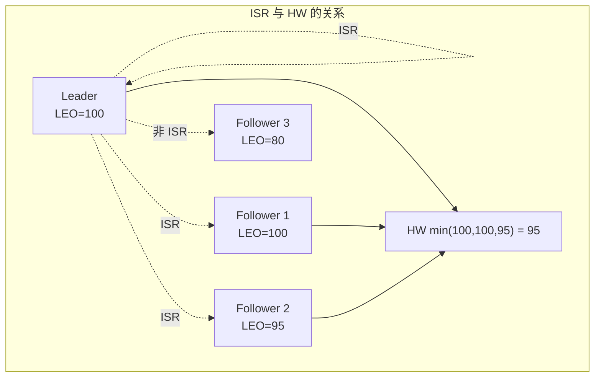

```java
/**
 * ISR 保证数据一致性:
 *
 * 1. HW 计算
 *    - HW = min(ISR 中所有副本的 LEO)
 *    - 确保 ISR 中所有副本都有 HW 之前的数据
 *
 * 2. 数据可见性
 *    - Consumer 只能消费到 HW 之前
 *    - 防止读取未完全复制的数据
 *
 * 3. Leader 故障恢复
 *    - 新 Leader 必须在 ISR 中
 *    - 截断到 HW，丢弃未确认数据
 *    - 保证数据一致性
 *
 * 4. Follower 故障恢复
 *    - 重启后截断到 HW
 *    - 从 Leader 拉取增量数据
 *    - 追上后重新加入 ISR
 */
```

---

## 12. Controller 控制器

### 12.1 Controller 的核心职责

```java
/**
 * Controller 是 Kafka 的"大脑"
 *
 * 核心职责:
 *
 * 1. 分区管理
 *    - 创建 Topic 时的分区分配
 *    - 分区 Leader 选举
 *    - 分区重分配
 *
 * 2. 副本管理
 *    - ISR 变更通知
 *    - 副本重新分配
 *    - 下线副本处理
 *
 * 3. Broker 管理
 *    - Broker 上线处理
 *    - Broker 下线处理
 *    - Broker 元数据更新
 *
 * 4. 元数据发布
 *    - 生成元数据快照
 *    - 发布到所有 Broker
 *    - 维护 MetadataCache 一致性
 *
 * 5. 集群级别的配置管理
 *    - 动态配置更新
 *    - Quota 管理
 */
```

### 12.2 Controller 选举 (KRaft 模式)

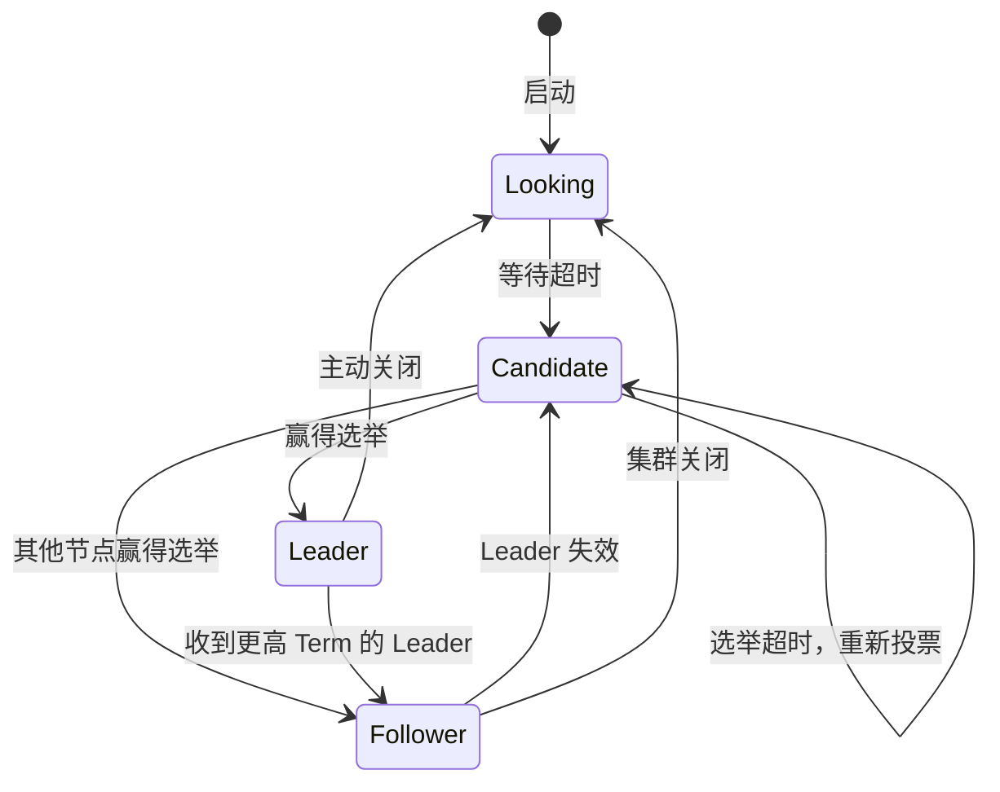

---

## 13. KRaft 选举机制

### 13.1 Raft 协议基础

```java
/**
 * KRaft 使用的 Raft 协议核心概念:
 *
 * 1. 节点角色
 *    - Leader: 处理所有写入请求
 *    - Follower: 从 Leader 复制日志
 *    - Candidate: 候选人，参与选举
 *
 * 2. Term (任期)
 *    - 单调递增的数字
 *    - 每次 Leader 选举递增
 *    - 用于识别过期的 Leader
 *
 * 3. 日志复制
 *    - Leader 追加日志到本地
 *    - 并行复制到所有 Follower
 *    - 大多数节点确认后提交
 *
 * 4. 选举安全性
 *    - Term N 的 Leader 包含所有已提交的 Term N 的日志
 *    - 只有拥有最新日志的节点才能成为 Leader
 */
```

### 13.2 KRaft 选举流程

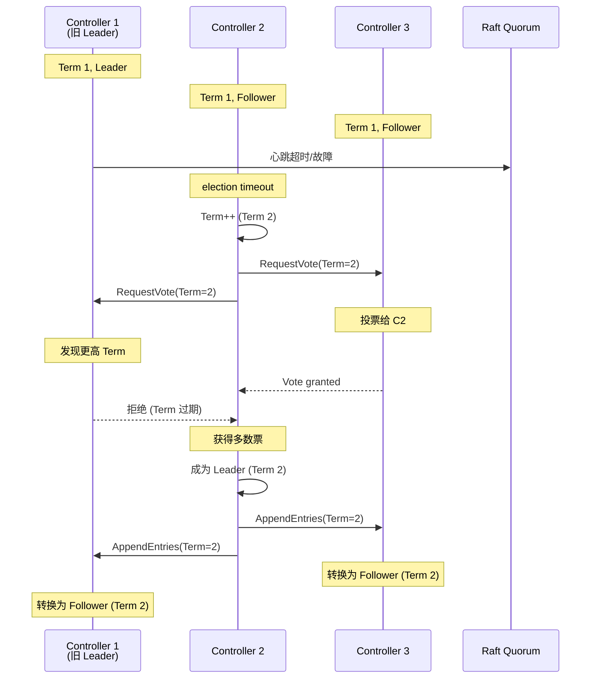

### 13.3 Leader 选举规则

```java
/**
 * Raft Leader 选举规则:
 *
 * 1. 成为 Candidate 的条件:
 *    - election timeout 内未收到 Leader 心跳
 *    - 随机 timeout 避免分裂投票
 *
 * 2. 获得投票的条件:
 *    - Candidate 的 Term >= 本地 Term
 *    - Candidate 的日志至少和自己一样新
 *      (Term 更大 或 Term 相同但 Log Index 更大)
 *
 * 3. 成为 Leader 的条件:
 *    - 获得大多数节点 (N/2 + 1) 的投票
 *    - Controller Quorum 一般为 3 或 5
 *
 * 4. Quorum 大小选择:
 *    - 3 节点: 容忍 1 个故障
 *    - 5 节点: 容忍 2 个故障
 *    - 必须是奇数
 */
```

### 13.4 日志复制与提交

```java
/**
 * KRaft 日志复制机制:
 *
 * 1. 元数据写入流程:
 *    - 接收元数据变更请求 (如 CreateTopic)
 *    - Leader 写入 __cluster_metadata
 *    - 并行复制到所有 Follower
 *    - 等待大多数确认
 *    - 更新 High Watermark
 *    - 应用状态机
 *    - 返回成功
 *
 * 2. 日志匹配特性:
 *    - Leader 和 Follower 日志前缀一致
 *    - 如果不一致，Follower 截断并重新同步
 *
 * 3. 提交条件:
 *    - 日志被复制到大多数节点
 *    - Leader 确认后更新 HW
 *    - HW 之前的日志已提交
 */
```

### 13.5 KRaft 快照机制

```java
/**
 * KRaft 快照机制:
 *
 * 1. 为什么需要快照?
 *    - __cluster_metadata 日志无限增长
 *    - 新启动的 Controller 需要回放所有日志
 *    - 恢复时间过长
 *
 * 2. 快照内容:
 *    - 完整的元数据状态
 *    - Topics: 所有 Topic 信息
 *    - Brokers: 所有 Broker 信息
 *    - 配置: 集群配置
 *    - 最后一条日志的 (Index, Term)
 *
 * 3. 快照生成条件:
 *    - 日志条目数达到阈值
 *    - 时间间隔到期
 *
 * 4. 快照使用:
 *    - Controller 启动时加载最新快照
 *    - 只需回放快照之后的增量日志
 *    - 大幅加快启动速度
 */
```

### 13.6 KRaft 元数据发布

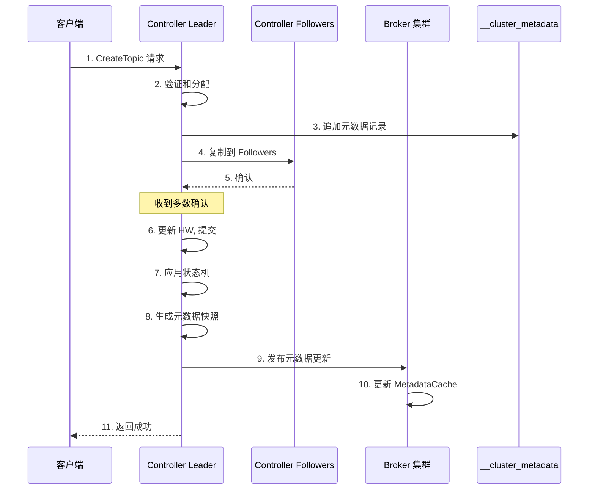

### 13.7 KRaft vs ZooKeeper 选举对比

| 特性 | ZooKeeper 模式 | KRaft 模式 |
|-----|---------------|-----------|
| **选举协议** | ZAB (ZooKeeper Atomic Broadcast) | Raft |
| **Controller 位置** | 在 ZooKeeper 中创建临时节点 | Raft Quorum 内部选举 |
| **元数据存储** | ZooKeeper znode | __cluster_metadata Topic |
| **元数据一致性** | Watch 通知 + 内存缓存 | Raft 复制 + 快照发布 |
| **单点故障** | ZooKeeper 集群 | Controller Quorum |
| **扩展性** | 受 ZooKeeper 写能力限制 | 理论上无限 |
| **故障检测** | ZooKeeper Session | Raft 心跳 |
| **数据恢复** | 从 ZooKeeper 加载 | 从快照 + 日志恢复 |

### 13.8 KRaft 故障转移

```java
/**
 * KRaft 故障转移流程:
 *
 * 1. Leader 故障检测:
 *    - Follower 在 election timeout 内未收到心跳
 *    - 或 RPC 请求的 Term 更高
 *
 * 2. 触发选举:
 *    - Follower 转换为 Candidate
 *    - Term++
 *    - 向所有节点请求投票
 *
 * 3. 投票决策:
 *    - 每个 Term 只能投票一次
 *    - 投给日志最新的 Candidate
 *
 * 4. 新 Leader 上台:
 *    - 获得多数票后成为 Leader
 *    - 立即发送心跳阻止新选举
 *    - 开始处理元数据请求
 *
 * 5. 元数据发布:
 *    - 新 Leader 发布元数据快照
 *    - 所有 Broker 更新 MetadataCache
 *
 * 故障恢复时间:
 * - election timeout (默认 2s)
 * - 网络延迟
 * - 新 Leader 快照加载
 * - 通常 < 10 秒
 */
```

### 13.9 KRaft 配置要点

```java
/**
 * KRaft 关键配置:
 *
 * 1. process.roles
 *    - broker: 仅作为 Broker
 *    - controller: 仅作为 Controller
 *    - broker,controller: 组合模式
 *
 * 2. controller.quorum.voters
 *    - 格式: node_id@host:port
 *    - 例: 1@kafka1:9093,2@kafka2:9093,3@kafka3:9093
 *    - 所有 Controller 节点的列表
 *
 * 3. node.id
 *    - 节点唯一标识
 *    - 替代 broker.id
 *    - 在整个集群中唯一
 *
 * 4. controller.listener.names
 *    - Controller 间通信的监听器
 *    - 例: CONTROLLER
 *    - 需要在 listeners 中定义
 *
 * 5. listeners
 *    - 例: PLAINTEXT://:9092,CONTROLLER://:9093
 *    - PLAINTEXT: 客户端连接
 *    - CONTROLLER: KRaft 通信
 *
 * 6. inter.broker.listener.name
 *    - Broker 间通信使用的监听器
 *    - 例: PLAINTEXT
 */
```

---

## 14. 总结

### 14.1 核心概念关系图

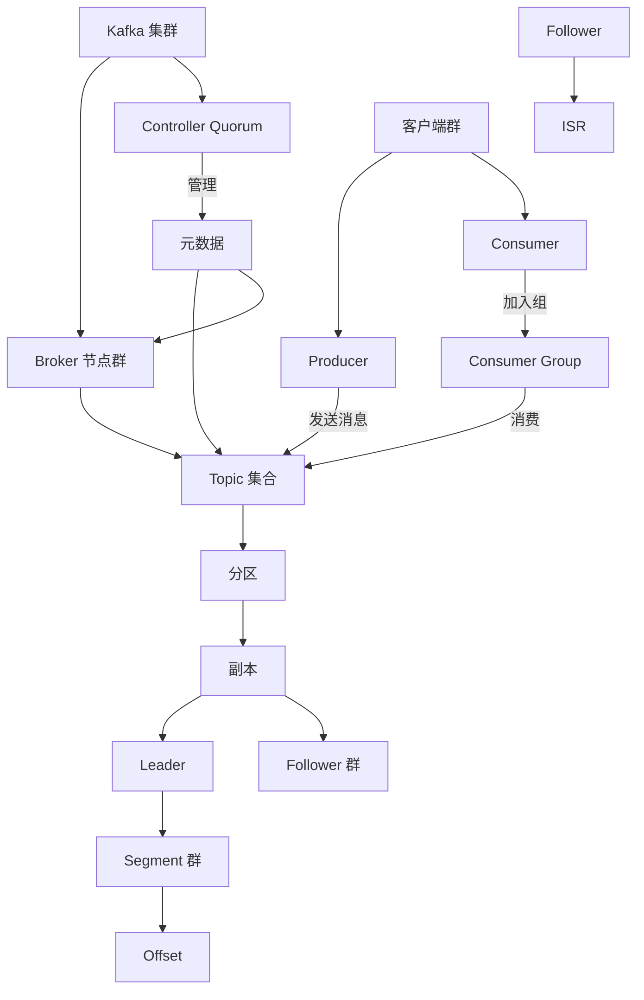

### 14.2 设计原则总结

```java
/**
 * Kafka 核心设计原则:
 *
 * 1. 分区带来并行性
 *    - Topic 分区实现并行读写
 *    - 分区分布在不同 Broker
 *    - 消费者组并行消费
 *
 * 2. 副本带来可靠性
 *    - 数据多副本存储
 *    - ISR 保证同步
 *    - 自动故障转移
 *
 * 3. 顺序写带来高性能
 *    - 磁盘顺序写
 *    - 零拷贝传输
 *    - 页缓存利用
 *
 * 4. 批量带来吞吐量
 *    - Producer 批量发送
 *    - Consumer 批量拉取
 *    - 磁盘顺序批量写
 *
 * 5. 分布式带来可扩展性
 *    - 水平分区
 *    - 增加节点提升容量
 *    - 负载自动均衡
 *
 * 6. KRaft 带来简化
 *    - 去除 ZooKeeper 依赖
 *    - 自包含元数据
 *    - 统一架构
 */
```

---

## 15. 实战配置示例

### 15.1 生产者配置最佳实践

**高吞吐量配置:**

```java
Properties props = new Properties();
props.put(ProducerConfig.BOOTSTRAP_SERVERS_CONFIG, "localhost:9092");

// 批量配置
props.put(ProducerConfig.BATCH_SIZE_CONFIG, 32768); // 32KB
props.put(ProducerConfig.LINGER_MS_CONFIG, 10); // 10ms

// 压缩配置
props.put(ProducerConfig.COMPRESSION_TYPE_CONFIG, "lz4");

// 缓冲区配置
props.put(ProducerConfig.BUFFER_MEMORY_CONFIG, 67108864); // 64MB

// 可靠性配置 (平衡)
props.put(ProducerConfig.ACKS_CONFIG, "1");
props.put(ProducerConfig.RETRIES_CONFIG, 3);
```

**高可靠性配置:**

```java
Properties props = new Properties();
props.put(ProducerConfig.BOOTSTRAP_SERVERS_CONFIG, "localhost:9092");

// 启用幂等性
props.put(ProducerConfig.ENABLE_IDEMPOTENCE_CONFIG, true);

// 强一致性
props.put(ProducerConfig.ACKS_CONFIG, "-1");
props.put(ProducerConfig.RETRIES_CONFIG, Integer.MAX_VALUE);
props.put(ProducerConfig.MAX_IN_FLIGHT_REQUESTS_PER_CONNECTION, 5);

// 事务配置
props.put(ProducerConfig.TRANSACTIONAL_ID_CONFIG, "my-transactional-id");
```

**低延迟配置:**

```java
Properties props = new Properties();
props.put(ProducerConfig.BOOTSTRAP_SERVERS_CONFIG, "localhost:9092");

// 减少延迟
props.put(ProducerConfig.LINGER_MS_CONFIG, 0);
props.put(ProducerConfig.BATCH_SIZE_CONFIG, 16384);

// 快速失败
props.put(ProducerConfig.REQUEST_TIMEOUT_MS_CONFIG, 30000);
props.put(ProducerConfig.DELIVERY_TIMEOUT_MS_CONFIG, 60000);

// 禁用压缩 (减少 CPU 开销)
props.put(ProducerConfig.COMPRESSION_TYPE_CONFIG, "none");
```

### 15.2 消费者配置最佳实践

**高吞吐量配置:**

```java
Properties props = new Properties();
props.put(ConsumerConfig.BOOTSTRAP_SERVERS_CONFIG, "localhost:9092");
props.put(ConsumerConfig.GROUP_ID_CONFIG, "high-throughput-group");

// 批量拉取
props.put(ConsumerConfig.FETCH_MIN_BYTES_CONFIG, 102400); // 100KB
props.put(ConsumerConfig.FETCH_MAX_WAIT_MS_CONFIG, 500);
props.put(ConsumerConfig.MAX_POLL_RECORDS_CONFIG, 1000);

// 手动提交 (减少提交频率)
props.put(ConsumerConfig.ENABLE_AUTO_COMMIT_CONFIG, false);

// 较长的会话超时
props.put(ConsumerConfig.SESSION_TIMEOUT_MS_CONFIG, 60000);
props.put(ConsumerConfig.HEARTBEAT_INTERVAL_MS_CONFIG, 10000);
```

**低延迟配置:**

```java
Properties props = new Properties();
props.put(ConsumerConfig.BOOTSTRAP_SERVERS_CONFIG, "localhost:9092");
props.put(ConsumerConfig.GROUP_ID_CONFIG, "low-latency-group");

// 快速拉取
props.put(ConsumerConfig.FETCH_MIN_BYTES_CONFIG, 1);
props.put(ConsumerConfig.FETCH_MAX_WAIT_MS_CONFIG, 100);
props.put(ConsumerConfig.MAX_POLL_RECORDS_CONFIG, 100);

// 自动提交
props.put(ConsumerConfig.ENABLE_AUTO_COMMIT_CONFIG, true);
props.put(ConsumerConfig.AUTO_COMMIT_INTERVAL_MS_CONFIG, 1000);
```

**精确一次语义配置:**

```java
Properties props = new Properties();
props.put(ConsumerConfig.BOOTSTRAP_SERVERS_CONFIG, "localhost:9092");
props.put(ConsumerConfig.GROUP_ID_CONFIG, "exactly-once-group");

// 隔离级别
props.put(ConsumerConfig.ISOLATION_LEVEL_CONFIG, "read_committed");

// 手动提交
props.put(ConsumerConfig.ENABLE_AUTO_COMMIT_CONFIG, false);

// Offset 策略
props.put(ConsumerConfig.AUTO_OFFSET_RESET_CONFIG, "earliest");
```

### 15.3 Broker 配置最佳实践

**高性能配置:**

```properties
# 线程配置
num.network.threads=8
num.io.threads=16
background.threads=10

# 网络配置
socket.send.buffer.bytes=102400
socket.receive.buffer.bytes=102400
socket.request.max.bytes=104857600

# 日志配置
log.dirs=/data1/kafka-logs,/data2/kafka-logs
num.partitions=3
default.replication.factor=2

# 刷新配置
log.flush.interval.messages=10000
log.flush.interval.ms=1000

# 副本配置
replica.lag.time.max.ms=30000
min.insync.replicas=2
```

**高可用配置:**

```properties
# 副本配置
default.replication.factor=3
min.insync.replicas=2

# 选举配置
unclean.leader.election.enable=false
auto.leader.rebalance.enable=true

# ISR 配置
replica.lag.time.max.ms=10000
min.insync.replicas=2

# 故障转移
zookeeper.session.timeout.ms=6000
zookeeper.connection.timeout.ms=6000
```

### 15.4 Topic 配置最佳实践

**高吞吐量 Topic:**

```bash
bin/kafka-configs.sh --alter --entity-type topics \
  --entity-name high-throughput-topic \
  --add-config \
    max.message.bytes=1048576,\  # 1MB
    compression.type=lz4,\        # 压缩
    flush.messages=10000,\        # 批量刷新
    flush.ms=1000                 # 时间刷新
```

**高可靠性 Topic:**

```bash
bin/kafka-configs.sh --alter --entity-type topics \
  --entity-name high-reliability-topic \
  --add-config \
    min.insync.replicas=2,\       # 最小同步副本
    unclean.leader.election.enable=false,\  # 禁止不干净选举
    max.message.bytes=10485760,\  # 10MB
    retention.ms=-1               # 永久保留
```

**日志压缩 Topic:**

```bash
bin/kafka-configs.sh --alter --entity-type topics \
  --entity-name compacted-topic \
  --add-config \
    cleanup.policy=compact,\      # 压缩策略
    min.cleanable.dirty.ratio=0.5,\  # 压缩阈值
    delete.retention.ms=86400000  # 删除保留 1 天
```

---

## 16. 性能调优指南

### 16.1 吞吐量优化

**生产者优化:**

1. **增加批量大小**
   ```java
   // 默认 16KB, 建议 32KB-1MB
   props.put(ProducerConfig.BATCH_SIZE_CONFIG, 65536);
   ```

2. **增加延迟时间**
   ```java
   // 默认 0, 建议 5-100ms
   props.put(ProducerConfig.LINGER_MS_CONFIG, 20);
   ```

3. **使用压缩**
   ```java
   // lz4 速度最快，gzip 压缩率最高
   props.put(ProducerConfig.COMPRESSION_TYPE_CONFIG, "lz4");
   ```

4. **优化序列化**
   ```java
   // 使用高效的序列化器
   props.put(ProducerConfig.KEY_SERIALIZER_CLASS_CONFIG,
             CustomAvroSerializer.class);
   ```

**Broker 优化:**

1. **增加线程数**
   ```properties
   num.network.threads=8
   num.io.threads=16
   ```

2. **优化页缓存**
   ```bash
   # 确保足够的内存给页缓存
   # Kafka 依赖 OS 页缓存，不需要额外配置
   ```

3. **使用 SSD**
   ```bash
   # SSD 读写性能远超 HDD
   log.dirs=/ssd1/kafka-logs,/ssd2/kafka-logs
   ```

4. **优化网络**
   ```bash
   # 使用万兆网卡
   # 调整内核参数
   net.core.rmem_max=16777216
   net.core.wmem_max=16777216
   ```

### 16.2 延迟优化

**生产者优化:**

```java
// 1. 减少延迟
props.put(ProducerConfig.LINGER_MS_CONFIG, 0);

// 2. 减少批量大小
props.put(ProducerConfig.BATCH_SIZE_CONFIG, 16384);

// 3. 禁用重试 (如果允许丢包)
props.put(ProducerConfig.RETRIES_CONFIG, 0);

// 4. 使用快速压缩算法
props.put(ProducerConfig.COMPRESSION_TYPE_CONFIG, "lz4");
```

**消费者优化:**

```java
// 1. 减少拉取等待时间
props.put(ConsumerConfig.FETCH_MAX_WAIT_MS_CONFIG, 100);

// 2. 减少最小拉取字节数
props.put(ConsumerConfig.FETCH_MIN_BYTES_CONFIG, 1);

// 3. 快速提交
props.put(ConsumerConfig.ENABLE_AUTO_COMMIT_CONFIG, true);
props.put(ConsumerConfig.AUTO_COMMIT_INTERVAL_MS_CONFIG, 100);
```

### 16.3 内存优化

**生产者内存:**

```java
// 1. 增加缓冲区
props.put(ProducerConfig.BUFFER_MEMORY_CONFIG, 134217728); // 128MB

// 2. 堆内存
// JVM 启动参数: -Xms2g -Xmx2g

// 3. 压缩
props.put(ProducerConfig.COMPRESSION_TYPE_CONFIG, "gzip"); // 节省内存
```

**Broker 内存:**

```bash
# 1. 堆内存配置
export KAFKA_HEAP_OPTS="-Xms4g -Xmx4g"

# 2. 页缓存
# 为 OS 预留内存，用于页缓存

# 3. 监控内存使用
jmap -heap <pid>
```

### 16.4 磁盘优化

**1. 使用多目录**

```properties
# 分散 I/O 负载
log.dirs=/data1/kafka-logs,/data2/kafka-logs,/data3/kafka-logs
```

**2. 优化日志段**

```properties
# 增加段大小，减少文件数量
log.segment.bytes=1073741824  # 1GB

# 减少索引大小
log.index.size.max.bytes=10485760  # 10MB
```

**3. 选择合适的文件系统**

```bash
# 推荐使用 ext4 或 xfs
# 挂载选项: noatime,nodiratime
mount -t ext4 -o noatime,nodiratime /dev/sdb1 /data1
```

---

## 17. 监控指标详解

### 17.1 关键监控指标

**生产者指标:**

```yaml
# 吞吐量
record-send-rate: 每秒发送记录数
byte-rate: 每秒发送字节数
request-rate: 每秒请求数

# 延迟
request-latency-avg: 平均请求延迟
request-latency-max: 最大请求延迟

# 错误
record-error-rate: 记录错误率
io-wait-time-ns-avg: 网络 I/O 等待时间

# 缓冲区
record-queue-time-avg: 记录在缓冲区平均等待时间
buffer-available-bytes: 可用缓冲区字节数
bufferpool-wait-time-ns-avg: 缓冲池等待时间
```

**消费者指标:**

```yaml
# 消费延迟
records-lag: 消费延迟 (记录数)
records-lag-max: 最大消费延迟
records-lag-avg: 平均消费延迟

# 吞吐量
records-consumed-rate: 每秒消费记录数
bytes-consumed-rate: 每秒消费字节数

# 拉取
fetch-rate: 每秒拉取次数
fetch-latency-avg: 平均拉取延迟

# 提交
commit-latency-avg: 平均提交延迟

# Rebalance
rebalance-latency-avg: 平均 Rebalance 延迟
rebalance-rate-per-hour: 每小时 Rebalance 次数
```

**Broker 指标:**

```yaml
# 网络
network-io-rate: 网络 I/O 速率
request-handler-avg-idle: 请求处理器平均空闲率

# 日志
log-flush-rate: 日志刷新速率
under-replicated-partitions: 副本不足的分区数
isr-shrinks-per-sec: ISR 每秒收缩次数

# 请求
requests-per-second: 每秒请求数
request-queue-size: 请求队列大小
response-queue-size: 响应队列大小

# 延迟
produce-request-latency-avg: Produce 请求平均延迟
fetch-request-latency-avg: Fetch 请求平均延迟
```

### 17.2 监控工具

**1. Kafka 自带工具**

```bash
# 查看消费者组延迟
bin/kafka-consumer-groups.sh --describe --group my-group

# 查看 Broker 信息
bin/kafka-broker-api-versions.sh --bootstrap-server localhost:9092

# 查看主题信息
bin/kafka-topics.sh --describe --topic my-topic
```

**2. JMX 监控**

```bash
# 启用 JMX
export JMX_PORT=9999
export KAFKA_JMX_OPTS="-Dcom.sun.management.jmxremote \
  -Dcom.sun.management.jmxremote.authenticate=false \
  -Dcom.sun.management.jmxremote.ssl=false"

# 使用 JConsole 或 VisualVM 连接
# localhost:9999
```

**3. 第三方监控工具**

- **Burrow**: 专门监控消费者延迟
- **Kafka Exporter**: Prometheus 导出器
- **Kafka Manager**: Web 管理界面

---

## 18. 故障排查实战

### 18.1 常见问题与解决方案

**问题 1: 消息丢失**

症状: 消息发送成功但消费不到

排查步骤:
```bash
# 1. 检查生产者配置
acks=1  # 改为 acks=-1

# 2. 检查 Topic 配置
bin/kafka-topics.sh --describe --topic my-topic
# 确保 replication-factor >= 2

# 3. 检查 ISR
# 如果 ISR 中只有 Leader，副本可能失效

# 4. 检查 Broker 日志
grep "ERROR" logs/server.log | grep "Replica"

# 5. 启用生产者幂等性
props.put(ProducerConfig.ENABLE_IDEMPOTENCE_CONFIG, true);
```

**问题 2: 消费者组 Rebalance 频繁**

症状: 消费频繁中断，日志显示 Rebalance

排查步骤:
```bash
# 1. 检查 session.timeout.ms
# 过短会导致 Rebalance
session.timeout.ms=45000  # 增加到 60s

# 2. 检查 max.poll.interval.ms
# 消息处理时间不能超过此值
max.poll.interval.ms=300000  # 5 分钟

# 3. 检查心跳间隔
heartbeat.interval.ms=3000  # session.timeout.ms 的 1/3

# 4. 检查日志
grep "Rebalance" logs/consumer.log

# 5. 优化消费逻辑
# 减少 max.poll.records，加快处理
max.poll.records=100
```

**问题 3: 副本不同步**

症状: UnderReplicatedPartitions 指标 > 0

排查步骤:
```bash
# 1. 检查副本状态
bin/kafka-topics.sh --describe --topic my-topic

# 2. 检查 Broker 日志
grep "Offline" logs/server.log

# 3. 检查网络
ping broker2
telnet broker2 9092

# 4. 检查磁盘
df -h
iostat -x

# 5. 检查副本延迟
replica.lag.time.max.ms=30000  # 增加容忍时间
```

**问题 4: 性能下降**

症状: 吞吐量降低，延迟增加

排查步骤:
```bash
# 1. 检查 CPU
top -p $(pgrep -f kafka.Kafka)

# 2. 检查内存
jmap -heap <pid>

# 3. 检查磁盘 I/O
iostat -x 1

# 4. 检查网络
netstat -s | grep retrans

# 5. 检查 GC
jstat -gc <pid> 1000

# 6. 检查线程数
jstack <pid> | grep "java.lang.Thread" | wc -l

# 7. 分析请求处理时间
# 查看 JMX 指标
```

### 18.2 日志分析技巧

**关键日志位置:**

```bash
# 服务端主日志
logs/server.log

# Controller 日志
logs/controller.log

# 状态变更日志
logs/state-change.log

# 请求日志 (如果启用)
logs/kafka-request.log
```

**日志级别调整:**

```properties
# 临时调整 (log4j2.properties)
log4j.logger.kafka.server=DEBUG
log4j.logger.kafka.network.RequestMetrics=TRACE
```

**常用日志搜索:**

```bash
# 搜索错误
grep "ERROR" logs/server.log

# 搜索 Rebalance
grep "Rebalance" logs/consumer.log

# 搜索 ISR 变更
grep "ISR" logs/server.log

# 搜索慢请求
grep "time-ms" logs/kafka-request.log | awk '$NF > 1000'
```

---

## 19. 总结

### 19.1 核心概念关系图


### 19.2 设计原则总结

Kafka 核心设计原则:

1. **分区带来并行性**
   - Topic 分区实现并行读写
   - 分区分布在不同 Broker
   - 消费者组并行消费

2. **副本带来可靠性**
   - 数据多副本存储
   - ISR 保证同步
   - 自动故障转移

3. **顺序写带来高性能**
   - 磁盘顺序写
   - 零拷贝传输
   - 页缓存利用

4. **批量带来吞吐量**
   - Producer 批量发送
   - Consumer 批量拉取
   - 磁盘顺序批量写

5. **分布式带来可扩展性**
   - 水平分区
   - 增加节点提升容量
   - 负载自动均衡

6. **KRaft 带来简化**
   - 去除 ZooKeeper 依赖
   - 自包含元数据
   - 统一架构

### 19.3 学习路径建议

**入门路径:**
```
1. 理解基本概念
   ├── Topic / Partition
   ├── Producer / Consumer
   └── Consumer Group

2. 理解架构
   ├── Broker 组件
   ├── Controller 机制
   └── 元数据管理

3. 理解流程
   ├── 消息发送
   ├── 消息消费
   └── Rebalance
```

**进阶路径:**
```
4. 深入存储
   ├── LogSegment 结构
   ├── 索引机制
   └── 日志清理

5. 深入副本
   ├── 同步机制
   ├── HW/LEO
   └── ISR 维护

6. 深入性能优化
   ├── 批量处理
   ├── 零拷贝
   └── 压缩
```

**专家路径:**
```
7. 源码分析
   ├── 核心类实现
   ├── 算法实现
   └── 设计模式

8. 性能调优
   ├── 监控指标
   ├── 故障排查
   └── 最佳实践

9. 二次开发
   ├── 自定义组件
   ├── 性能优化
   └── 功能扩展
```

---

**下一步**: [04. 源码目录结构解析](./01-source-structure.md)
