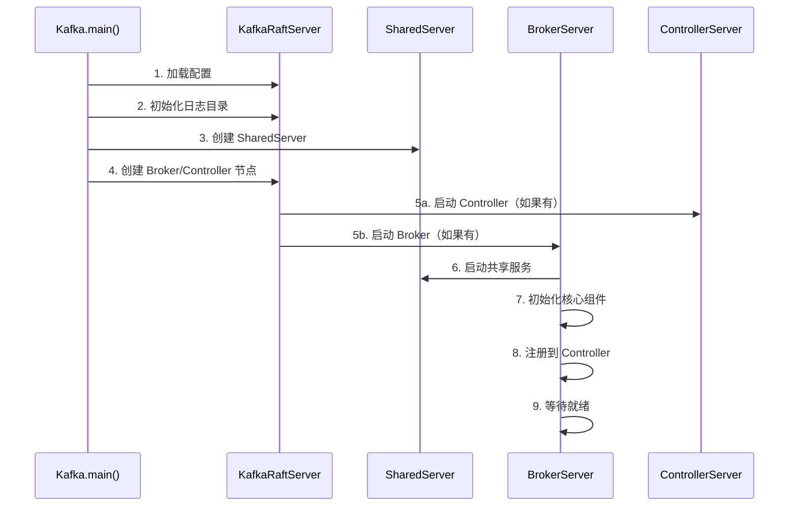
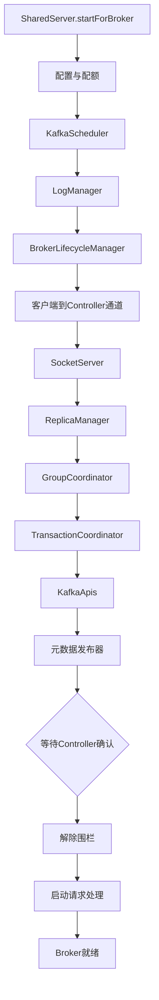
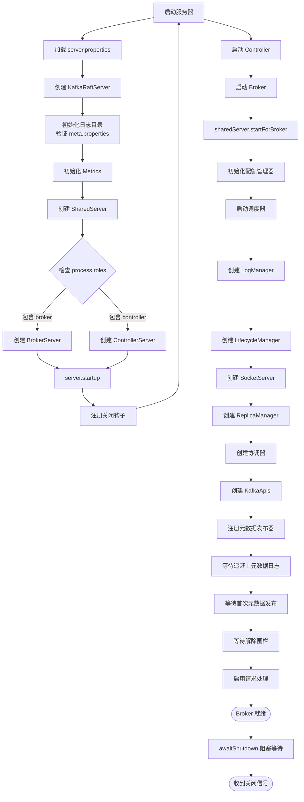
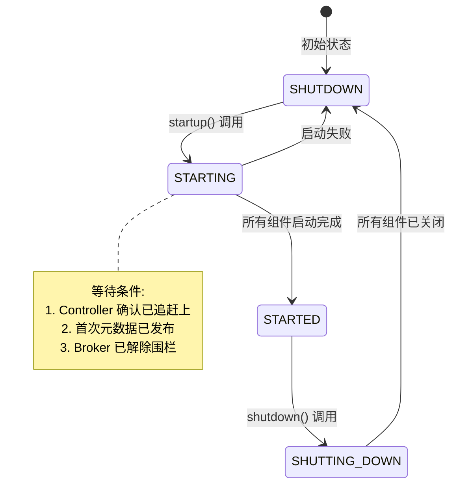

# Kafka 服务端启动流程详解

## 目录
- [1. 启动流程概述](#1-启动流程概述)
- [2. 入口点分析](#2-入口点分析)
- [3. KafkaRaftServer 初始化](#3-kraftserver-初始化)
- [4. BrokerServer 启动流程](#4-brokerserver-启动流程)
- [5. 关键组件初始化](#5-关键组件初始化)
- [6. 启动流程图](#6-启动流程图)

---

## 1. 启动流程概述

Kafka 在 KRaft 模式下的启动流程可以概括为以下几个主要阶段：

```
启动阶段划分:
┌─────────────────────────────────────────────────────────────┐
│  1. 配置加载与参数解析                                         │
│  2. 日志目录初始化（meta.properties 验证）                      │
│  3. SharedServer 创建（共享组件初始化）                         │
│  4. Controller/Broker 角色选择与创建                          │
│  5. 核心组件初始化                                             │
│  6. 服务启动与就绪等待                                         │
└─────────────────────────────────────────────────────────────┘
```

### 1.1 启动流程时序图



---

## 2. 入口点分析

### 2.1 Kafka.scala - 主入口

源码位置：`core/src/main/scala/kafka/Kafka.scala`

```scala
object Kafka extends Logging {
  def main(args: Array[String]): Unit = {
    try {
      // 步骤 1：解析配置文件
      val serverProps = getPropsFromArgs(args)

      // 步骤 2：构建服务器实例
      val server = buildServer(serverProps)

      // 步骤 3：注册信号处理器（Unix 系统）
      try {
        if (!OperatingSystem.IS_WINDOWS && !Java.isIbmJdk)
          new LoggingSignalHandler().register()
      } catch {
        case e: ReflectiveOperationException =>
          warn("Failed to register optional signal handler...")
      }

      // 步骤 4：注册关闭钩子
      Exit.addShutdownHook("kafka-shutdown-hook", () => {
        try server.shutdown()
        catch {
          case _: Throwable =>
            fatal("Halting Kafka.")
            Exit.halt(1)
        }
      })

      // 步骤 5：启动服务器
      try server.startup()
      catch {
        case e: Throwable =>
          fatal("Exiting Kafka due to fatal exception during startup.", e)
          Exit.exit(1)
      }

      // 步骤 6：等待关闭信号
      server.awaitShutdown()
    }
    catch {
      case e: Throwable =>
        fatal("Exiting Kafka due to fatal exception", e)
        Exit.exit(1)
    }
    Exit.exit(0)
  }
}
```

### 2.2 配置解析流程

```scala
def getPropsFromArgs(args: Array[String]): Properties = {
  val optionParser = new OptionParser(false)
  val overrideOpt = optionParser.accepts("override", "Optional property...")
    .withRequiredArg()
    .ofType(classOf[String])

  if (args.isEmpty || args.contains("--help")) {
    CommandLineUtils.printUsageAndExit(...)
  }

  if (args.contains("--version")) {
    CommandLineUtils.printVersionAndExit()
  }

  // 加载主配置文件（通常是 server.properties）
  val props = Utils.loadProps(args(0))

  // 处理命令行覆盖选项
  if (args.length > 1) {
    val options = optionParser.parse(args.slice(1, args.length): _*)
    props ++= CommandLineUtils.parseKeyValueArgs(options.valuesOf(overrideOpt))
  }
  props
}
```

### 2.3 服务器构建

```scala
private def buildServer(props: Properties): Server = {
  // 从 Properties 创建 KafkaConfig
  val config = KafkaConfig.fromProps(props, doLog = false)

  // 创建 KafkaRaftServer（KRaft 模式的服务器实现）
  new KafkaRaftServer(
    config,
    Time.SYSTEM,
  )
}
```

**关键点：**
- Kafka 3.x+ 默认使用 KRaft 模式，不再依赖 ZooKeeper
- `Server` 是服务器接口，`KafkaRaftServer` 是 KRaft 模式的实现
- 配置验证在 `KafkaConfig.fromProps` 中完成

---

## 3. KafkaRaftServer 初始化

### 3.1 类结构

源码位置：`core/src/main/scala/kafka/server/KafkaRaftServer.scala`

```scala
class KafkaRaftServer(
  config: KafkaConfig,
  time: Time,
) extends Server with Logging {

  this.logIdent = s"[KafkaRaftServer nodeId=${config.nodeId}] "

  // 1. 初始化日志目录，加载 meta.properties
  private val (metaPropsEnsemble, bootstrapMetadata) =
    KafkaRaftServer.initializeLogDirs(config, this.logger.underlying, this.logIdent)

  // 2. 初始化指标系统
  private val metrics = Server.initializeMetrics(
    config,
    time,
    metaPropsEnsemble.clusterId().get()
  )

  // 3. 创建共享服务器组件
  private val sharedServer = new SharedServer(
    config,
    metaPropsEnsemble,
    time,
    metrics,
    CompletableFuture.completedFuture(QuorumConfig.parseVoterConnections(config.quorumConfig.voters)),
    QuorumConfig.parseBootstrapServers(config.quorumConfig.bootstrapServers),
    new StandardFaultHandlerFactory(),
    ServerSocketFactory.INSTANCE,
  )

  // 4. 根据 process.roles 创建 Broker 或 Controller
  private val broker: Option[BrokerServer] = if (config.processRoles.contains(ProcessRole.BrokerRole)) {
    Some(new BrokerServer(sharedServer))
  } else {
    None
  }

  private val controller: Option[ControllerServer] = if (config.processRoles.contains(ProcessRole.ControllerRole)) {
    Some(new ControllerServer(
      sharedServer,
      KafkaRaftServer.configSchema,
      bootstrapMetadata,
    ))
  } else {
    None
  }
}
```

### 3.2 日志目录初始化详解

```scala
def initializeLogDirs(
  config: KafkaConfig,
  log: Logger,
  logPrefix: String
): (MetaPropertiesEnsemble, BootstrapMetadata) = {
  // 步骤 1：加载 meta.properties
  val loader = new MetaPropertiesEnsemble.Loader()
  loader.addMetadataLogDir(config.metadataLogDir)
        .addLogDirs(config.logDirs)
  val initialMetaPropsEnsemble = loader.load()

  // 步骤 2：验证元数据一致性
  val verificationFlags = util.EnumSet.of(REQUIRE_AT_LEAST_ONE_VALID, REQUIRE_METADATA_LOG_DIR)
  initialMetaPropsEnsemble.verify(Optional.empty(), OptionalInt.of(config.nodeId), verificationFlags)

  // 步骤 3：检查元数据分区位置
  val metadataPartitionDirName = UnifiedLog.logDirName(MetadataPartition)
  initialMetaPropsEnsemble.logDirProps().keySet().forEach(logDir => {
    if (!logDir.equals(config.metadataLogDir)) {
      val clusterMetadataTopic = new File(logDir, metadataPartitionDirName)
      if (clusterMetadataTopic.exists) {
        throw new KafkaException(s"Found unexpected metadata location...")
      }
    }
  })

  // 步骤 4：设置目录 ID 并重写 meta.properties（如果需要）
  val metaPropsEnsemble = {
    val copier = new MetaPropertiesEnsemble.Copier(initialMetaPropsEnsemble)
    initialMetaPropsEnsemble.nonFailedDirectoryProps().forEachRemaining(e => {
      val logDir = e.getKey
      val metaProps = e.getValue

      // 验证必需字段
      if (!metaProps.isPresent()) {
        throw new RuntimeException(s"No `meta.properties` found in $logDir...")
      }
      if (!metaProps.get().nodeId().isPresent()) {
        throw new RuntimeException(s"Error: node ID not found in $logDir")
      }
      if (!metaProps.get().clusterId().isPresent()) {
        throw new RuntimeException(s"Error: cluster ID not found in $logDir")
      }

      // 生成或保留 directoryId
      val builder = new MetaProperties.Builder(metaProps.get())
      if (!builder.directoryId().isPresent()) {
        builder.setDirectoryId(copier.generateValidDirectoryId())
      }
      copier.setLogDirProps(logDir, builder.build())
    })
    copier.writeLogDirChanges()
    copier.copy()
  }

  // 步骤 5：加载 Bootstrap 元数据
  val bootstrapDirectory = new BootstrapDirectory(config.metadataLogDir)
  val bootstrapMetadata = bootstrapDirectory.read()

  (metaPropsEnsemble, bootstrapMetadata)
}
```

**meta.properties 文件结构:**
```properties
version=1
cluster.id=<集群唯一 ID>
broker.id=<Broker 节点 ID>
node.id=<节点 ID（KRaft 模式）>
directory.id=<目录唯一 ID>
```

**关键验证点：**
1. 所有日志目录必须存在有效的 `meta.properties`
2. `cluster.id` 必须在所有目录中一致
3. `node.id` 必须与配置匹配
4. `directory.id` 用于唯一标识每个日志目录

---

## 4. BrokerServer 启动流程

### 4.1 startup() 方法总览

源码位置：`core/src/main/scala/kafka/server/BrokerServer.scala`

```scala
override def startup(): Unit = {
  if (!maybeChangeStatus(SHUTDOWN, STARTING)) return
  val startupDeadline = Deadline.fromDelay(time, config.serverMaxStartupTimeMs, TimeUnit.MILLISECONDS)
  try {
    // ========== 阶段1: 共享服务启动 ==========
    sharedServer.startForBroker()

    // ========== 阶段2: 配置与配额管理 ==========
    config.dynamicConfig.initialize(Some(clientTelemetryExporterPlugin))
    quotaManagers = QuotaFactory.instantiate(...)
    DynamicBrokerConfig.readDynamicBrokerConfigsFromSnapshot(...)

    // ========== 阶段3: 调度器启动 ==========
    kafkaScheduler = new KafkaScheduler(config.backgroundThreads)
    kafkaScheduler.startup()

    // ========== 阶段4: 日志管理器创建 ==========
    brokerTopicStats = new BrokerTopicStats(...)
    logDirFailureChannel = new LogDirFailureChannel(config.logDirs.size)
    metadataCache = new KRaftMetadataCache(config.nodeId, ...)
    logManager = LogManager(config, sharedServer.metaPropsEnsemble.errorLogDirs().asScala.toSeq, ...)

    // ========== 阶段5: 生命周期管理器 ==========
    lifecycleManager = new BrokerLifecycleManager(...)

    // ========== 阶段6: 认证与网络 ==========
    tokenCache = new DelegationTokenCache(...)
    credentialProvider = new CredentialProvider(...)
    clientToControllerChannelManager = new NodeToControllerChannelManagerImpl(...)
    clientToControllerChannelManager.start()

    // ========== 阶段7: SocketServer 创建 ==========
    socketServer = new SocketServer(config, metrics, time, ...)

    // ========== 阶段8: 副本管理器 ==========
    this._replicaManager = new ReplicaManager(config, metrics, time, ...)

    // ========== 阶段9: 协调器创建 ==========
    groupCoordinator = createGroupCoordinator()
    transactionCoordinator = TransactionCoordinator(...)
    shareCoordinator = createShareCoordinator()

    // ========== 阶段10: 请求处理器 ==========
    dataPlaneRequestProcessor = new KafkaApis(...)
    dataPlaneRequestHandlerPool = sharedServer.requestHandlerPoolFactory.createPool(...)

    // ========== 阶段11: 元数据发布器 ==========
    metadataPublishers.add(brokerMetadataPublisher)
    sharedServer.loader.installPublishers(metadataPublishers)

    // ========== 阶段12: 等待就绪 ==========
    FutureUtils.waitWithLogging(..., lifecycleManager.initialCatchUpFuture, ...)
    FutureUtils.waitWithLogging(..., brokerMetadataPublisher.firstPublishFuture, ...)
    FutureUtils.waitWithLogging(..., lifecycleManager.setReadyToUnfence(), ...)

    // ========== 阶段13: 启动网络处理 ==========
    socketServer.enableRequestProcessing(authorizerFutures)

    maybeChangeStatus(STARTING, STARTED)
  } catch {
    case e: Throwable =>
      fatal("Fatal error during broker startup...", e)
      shutdown()
      throw e
  }
}
```

### 4.2 启动阶段详细分析

#### 阶段 1: 共享服务启动

```scala
sharedServer.startForBroker()
```

`SharedServer` 包含的组件：
- **RaftManager**: 管理 Raft 协议和元数据日志
- **MetadataLoader**: 加载和发布集群元数据快照
- **MetricsReporter**: 指标报告
- **FaultHandler**: 故障处理器

#### 阶段 2-3: 基础组件初始化

```scala
// 动态配置初始化
config.dynamicConfig.initialize(Some(clientTelemetryExporterPlugin))

// 配额管理器 (客户端速率限制)
quotaManagers = QuotaFactory.instantiate(config, metrics, time, ...)

// 从快照读取动态配置
DynamicBrokerConfig.readDynamicBrokerConfigsFromSnapshot(
  raftManager, config, quotaManagers, logContext
)

// 后台任务调度器
kafkaScheduler = new KafkaScheduler(config.backgroundThreads)
kafkaScheduler.startup()
```

**KafkaScheduler** 是 Kafka 的后台任务调度器，用于：
- 定期任务执行
- 延迟操作 (如延迟生产/获取)
- 日志清理调度
- 心跳检测

#### 阶段 4: 存储层初始化

```scala
// Broker 级别统计信息
brokerTopicStats = new BrokerTopicStats(...)

// 日志目录故障通道
logDirFailureChannel = new LogDirFailureChannel(config.logDirs.size)

// 元数据缓存
metadataCache = new KRaftMetadataCache(
  config.nodeId,
  () => raftManager.client.kraftVersion()
)

// 日志管理器 (核心存储组件)
logManager = LogManager(
  config,
  sharedServer.metaPropsEnsemble.errorLogDirs().asScala.toSeq,
  metadataCache,
  kafkaScheduler,
  time,
  brokerTopicStats,
  logDirFailureChannel
)
```

**LogManager** 职责：
- 管理所有 TopicPartition 的日志
- 日志恢复与清理
- 日志目录健康检查
- 配置变更处理

#### 阶段 5: 生命周期管理

```scala
lifecycleManager = new BrokerLifecycleManager(
  config,
  time,
  s"broker-${config.nodeId}-",
  logManager.directoryIdsSet.asJava,
  shutdownHook = () => new Thread(() => shutdown(), "kafka-shutdown-thread").start(),
  isCordonedLogDirsSupported = () => metadataCache.metadataVersion().isCordonedLogDirsSupported
)

// 启动生命周期管理器
lifecycleManager.start(
  lastAppliedOffsetSupplier = () => sharedServer.loader.lastAppliedOffset(),
  channelManager = brokerLifecycleChannelManager,
  clusterId = clusterId,
  brokerRegistration = listenerInfo.toBrokerRegistrationRequest,
  features = featuresRemapped,
  initialBrokerEpoch = logManager.readBrokerEpochFromCleanShutdownFiles(),
  initialCordonedLogDirs = initialCordonedLogDirs
)
```

**BrokerLifecycleManager** 关键职责：
- 向 Controller 注册 Broker
- 维护 Broker 状态 (启动中、运行中、隔离等)
- 处理 Broker Epoch（用于故障检测）
- 发送心跳到 Controller
- 管理 Broker 围栏 (Fencing) 状态

#### 阶段 6-7: 网络层初始化

```scala
// 凭证提供者（用于 SASL/SCRAM 认证）
credentialProvider = new CredentialProvider(ScramMechanism.mechanismNames, tokenCache)

// 到 Controller 的通道管理器
clientToControllerChannelManager = new NodeToControllerChannelManagerImpl(
  controllerNodeProvider,
  time,
  metrics,
  config,
  "forwarding",
  s"broker-${config.nodeId}-",
  60000 // 60秒超时
)
clientToControllerChannelManager.start()

// 转发管理器 (将请求转发到 Controller)
forwardingManager = new ForwardingManagerImpl(clientToControllerChannelManager, metrics)

// Socket 服务器 (网络层核心)
socketServer = new SocketServer(
  config,
  metrics,
  time,
  credentialProvider,
  apiVersionManager,
  sharedServer.socketFactory,
  connectionDisconnectListeners
)
```

#### 阶段 8: 副本管理器

```scala
this._replicaManager = new ReplicaManager(
  config = config,
  metrics = metrics,
  time = time,
  scheduler = kafkaScheduler,
  logManager = logManager,
  remoteLogManager = remoteLogManagerOpt,
  quotaManagers = quotaManagers,
  metadataCache = metadataCache,
  logDirFailureChannel = logDirFailureChannel,
  alterPartitionManager = alterPartitionManager,
  brokerTopicStats = brokerTopicStats,
  brokerEpochSupplier = () => lifecycleManager.brokerEpoch,
  addPartitionsToTxnManager = Some(addPartitionsToTxnManager),
  directoryEventHandler = directoryEventHandler,
  defaultActionQueue = defaultActionQueue
)
```

**ReplicaManager** 是最核心的组件之一：
- 管理分区副本
- 处理生产请求 (写入消息)
- 处理获取请求 (读取消息)
- 副本同步与 Leader 选举
- ISR (In-Sync Replicas) 维护

#### 阶段 9: 协调器

```scala
// Group Coordinator (消费者组协调)
groupCoordinator = createGroupCoordinator()

// Transaction Coordinator (事务协调)
val producerIdManagerSupplier = () => ProducerIdManager.rpc(...)
transactionCoordinator = TransactionCoordinator(
  config,
  replicaManager,
  new KafkaScheduler(1, true, "transaction-log-manager-"),
  producerIdManagerSupplier,
  metrics,
  metadataCache,
  Time.SYSTEM
)

// Share Coordinator (共享组协调 - 新特性)
shareCoordinator = createShareCoordinator()
```

#### 阶段 10: 请求处理

```scala
// API 请求处理器 (处理所有 Kafka 协议请求)
dataPlaneRequestProcessor = new KafkaApis(
  requestChannel = socketServer.dataPlaneRequestChannel,
  forwardingManager = forwardingManager,
  replicaManager = replicaManager,
  groupCoordinator = groupCoordinator,
  txnCoordinator = transactionCoordinator,
  shareCoordinator = shareCoordinator,
  autoTopicCreationManager = autoTopicCreationManager,
  brokerId = config.nodeId,
  config = config,
  configRepository = metadataCache,
  metadataCache = metadataCache,
  metrics = metrics,
  authorizerPlugin = authorizerPlugin,
  quotas = quotaManagers,
  fetchManager = fetchManager,
  sharePartitionManager = sharePartitionManager,
  brokerTopicStats = brokerTopicStats,
  clusterId = clusterId,
  time = time,
  tokenManager = tokenManager,
  apiVersionManager = apiVersionManager,
  clientMetricsManager = clientMetricsManager,
  groupConfigManager = groupConfigManager
)

// 请求处理线程池
dataPlaneRequestHandlerPool = sharedServer.requestHandlerPoolFactory.createPool(
  config.nodeId,
  socketServer.dataPlaneRequestChannel,
  dataPlaneRequestProcessor,
  time,
  config.numIoThreads,
  "broker"
)
```

#### 阶段 11-13: 就绪等待

```scala
// 安装元数据发布器
sharedServer.loader.installPublishers(metadataPublishers)

// 等待: Controller 确认已追赶上元数据日志
FutureUtils.waitWithLogging(
  logger.underlying,
  logIdent,
  "the controller to acknowledge that we are caught up",
  lifecycleManager.initialCatchUpFuture,
  startupDeadline,
  time
)

// 等待: 首次元数据发布完成
FutureUtils.waitWithLogging(
  logger.underlying,
  logIdent,
  "the initial broker metadata update to be published",
  brokerMetadataPublisher.firstPublishFuture,
  startupDeadline,
  time
)

// 等待: Broker 解除围栏 (Unfence)
FutureUtils.waitWithLogging(
  logger.underlying,
  logIdent,
  "the broker to be unfenced",
  lifecycleManager.setReadyToUnfence(),
  startupDeadline,
  time
)

// 启动请求处理
socketServer.enableRequestProcessing(authorizerFutures)

maybeChangeStatus(STARTING, STARTED)
```

---

## 5. 关键组件初始化

### 5.1 组件初始化顺序

以下是 Broker 启动时的关键组件初始化顺序：



### 5.2 组件依赖关系

| 组件 | 依赖 | 被依赖 | 职责 |
|-----|-----|--------|-----|
| KafkaScheduler | 无 | LogManager, ReplicaManager, 协调器 | 后台任务调度 |
| LogManager | KafkaScheduler | ReplicaManager | 日志存储管理 |
| MetadataCache | RaftManager | 几乎所有组件 | 元数据缓存 |
| ReplicaManager | LogManager, MetadataCache | KafkaApis | 副本管理 |
| SocketServer | CredentialProvider | KafkaApis | 网络通信 |
| KafkaApis | 所有核心组件 | 无 | 请求处理 |
| GroupCoordinator | ReplicaManager | KafkaApis | 消费者组管理 |
| TransactionCoordinator | ReplicaManager | KafkaApis | 事务管理 |
| BrokerLifecycleManager | MetadataCache | 所有组件 | Broker生命周期 |

---

## 6. 启动流程图

### 6.1 完整启动流程图



### 6.2 状态转换图



---

## 7. 关键代码路径追踪

### 7.1 主启动流程

```
Kafka.main()
  └─> Kafka.buildServer()
      └─> new KafkaRaftServer()
          ├─> initializeLogDirs()        # 初始化日志目录
          ├─> Server.initializeMetrics() # 初始化指标
          ├─> new SharedServer()         # 创建共享服务
          ├─> new BrokerServer()         # 创建 Broker (如果是 broker 角色)
          └─> new ControllerServer()     # 创建 Controller (如果是 controller 角色)
```

### 7.2 Broker 启动流程

```
KafkaRaftServer.startup()
  └─> ControllerServer.startup()        # 先启动 Controller (如果存在)
  └─> BrokerServer.startup()            # 再启动 Broker (如果存在)
      ├─> sharedServer.startForBroker()
      ├─> quotaManagers = QuotaFactory.instantiate()
      ├─> kafkaScheduler.startup()
      ├─> logManager = LogManager(...)
      ├─> lifecycleManager = new BrokerLifecycleManager(...)
      ├─> socketServer = new SocketServer(...)
      ├─> replicaManager = new ReplicaManager(...)
      ├─> groupCoordinator = createGroupCoordinator()
      ├─> transactionCoordinator = TransactionCoordinator(...)
      ├─> kafkaApis = new KafkaApis(...)
      ├─> sharedServer.loader.installPublishers()
      ├─> lifecycleManager.initialCatchUpFuture.get()      # 等待追赶上
      ├─> brokerMetadataPublisher.firstPublishFuture.get() # 等待首次发布
      ├─> lifecycleManager.setReadyToUnfence().get()       # 等待解除围栏
      └─> socketServer.enableRequestProcessing()
```

---

## 8. 启动过程中的关键检查点

| 检查点 | 说明 | 超时配置 |
|-------|------|---------|
| 配置文件验证 | 验证 server.properties 格式和内容 | N/A |
| meta.properties 验证 | 确保所有日志目录有有效的元数据 | N/A |
| Controller 连接 | 连接到 Raft Quorum 的 Controller | `controller.quorum.voters` |
| 元数据追赶 | 追赶上 __cluster_metadata 分区的高水位 | `server.maxStartupTimeMs` (默认 5 分钟) |
| Broker 注册 | 向 Controller 注册并获取 Broker Epoch | 心跳间隔 |
| 解除围栏 | Controller 确认 Broker 可以提供服务 | 取决于 Controller 处理速度 |

---

## 9. 常见启动问题

### 9.1 meta.properties 缺失

**错误信息:**
```
Error: No `meta.properties` found in /path/to/log/dir (have you run `kafka-storage.sh` to format the directory?)
```

**解决方案:**
```bash
# 格式化存储目录
kafka-storage.sh format \
  --config server.properties \
  --cluster-id <cluster-id>
```

### 9.2 process.roles 配置错误

**问题：** 未配置 `process.roles` 或配置了不存在的角色

**正确配置示例:**
```properties
# 组合模式 (同时是 Broker 和 Controller)
process.roles=broker,controller

# 仅 Broker 模式
process.roles=broker
controller.quorum.voters=1@controller1:9093,2@controller2:9093

# 仅 Controller 模式
process.roles=controller
controller.quorum.voters=1@controller1:9093,2@controller2:9093,3@controller3:9093
```

### 9.3 启动超时

**可能原因：**
1. 无法连接到 Controller Quorum
2. 元数据分区追赶时间过长
3. 日志目录存在问题

**调优参数:**
```properties
# 增加启动超时时间
server.maxStartupTimeMs=600000  # 10分钟

# Controller 心跳间隔
broker.heartbeat.interval.ms=2000
```

---

## 10. 总结

Kafka 的启动流程展示了其精心设计的架构:

1. **模块化设计**: SharedServer 封装了共享组件，BrokerServer 和 ControllerServer 各司其职
2. **依赖管理**: 组件初始化顺序经过精心设计，确保依赖关系正确
3. **状态管理**: BrokerLifecycleManager 提供了完善的生命周期管理
4. **容错性**: 多个检查点和超时机制确保启动过程的可靠性
5. **元数据驱动**: 基于 Raft 的元数据管理是 Kafka 摆脱 ZooKeeper 的关键

### 下一步学习

在理解了启动流程后，建议按以下顺序深入学习:

1. **SocketServer** - 网络层实现
2. **KafkaApis** - 请求处理架构
3. **ReplicaManager** - 副本管理与消息存储
4. **GroupCoordinator** - 消费者组协调
5. **ControllerServer** - Controller 实现

---

**相关代码文件:**
- `core/src/main/scala/kafka/Kafka.scala` - 主入口
- `core/src/main/scala/kafka/server/KafkaRaftServer.scala` - KRaft 服务器
- `core/src/main/scala/kafka/server/BrokerServer.scala` - Broker 实现
- `core/src/main/scala/kafka/server/ControllerServer.scala` - Controller 实现
- `core/src/main/scala/kafka/server/SharedServer.scala` - 共享组件

**下一步**: [02. SocketServer 网络层分析](../02-request-processing/01-socketserver.md)
