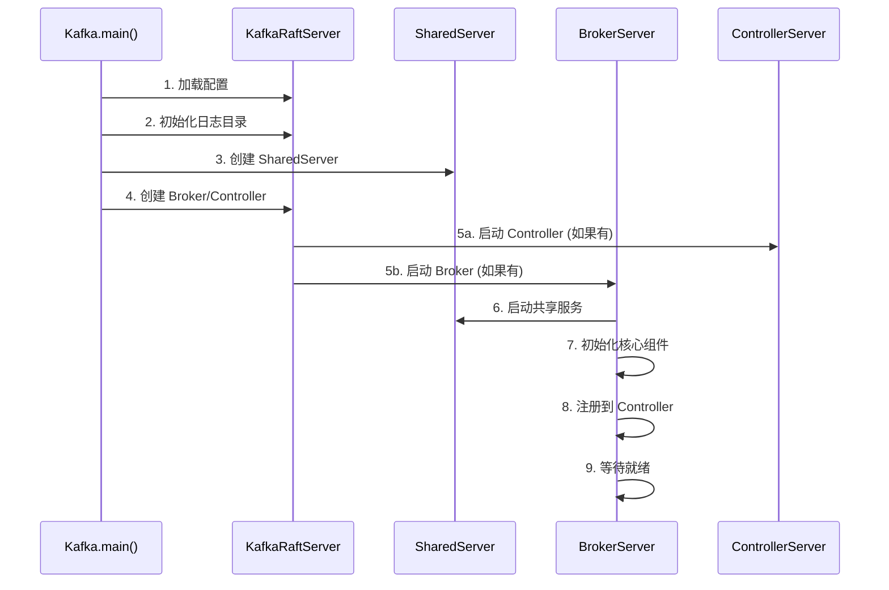

# 启动流程概述

## 本章导读

本文档详细介绍 Kafka Broker 的启动流程概述，帮助读者理解从配置加载到服务就绪的完整过程。

**预计阅读时间**：20 分钟
**相关文档**：[KafkaServer 初始化](./02-kafkaserver-initialization.md) | [启动配置](./11-startup-config.md)

---

## 1. 启动流程概述

Kafka 在 KRaft 模式下的启动流程可以概括为以下几个主要阶段：

```
启动阶段划分:
┌─────────────────────────────────────────────────────────────┐
│  1. 配置加载与参数解析                                         │
│  2. 日志目录初始化 (meta.properties 验证)                      │
│  3. SharedServer 创建 (共享组件初始化)                         │
│  4. Controller/Broker 角色选择与创建                          │
│  5. 核心组件初始化                                             │
│  6. 服务启动与就绪等待                                         │
└─────────────────────────────────────────────────────────────┘
```

### 1.1 启动流程时序图



### 1.2 启动流程详细说明

#### 阶段 1: 配置加载

```scala
// 从配置文件加载参数
val props = Utils.loadProps(args(0))

// 创建 KafkaConfig
val config = KafkaConfig.fromProps(props, doLog = false)
```

**关键配置项**：
- `process.roles`：节点角色（Broker/Controller）
- `node.id`：节点唯一标识
- `controller.quorum.voters`：Controller 集群成员列表
- `log.dirs`：日志存储目录
- `listeners`：监听器配置

#### 阶段 2: 日志目录初始化

```scala
// 验证和初始化日志目录
val (metaPropsEnsemble, bootstrapMetadata) =
  KafkaRaftServer.initializeLogDirs(config, logger, logIdent)
```

**meta.properties 文件结构**:
```properties
version=0
cluster.id=<集群ID>
broker.id=<节点ID>
```

#### 阶段 3: SharedServer 创建

```scala
// 创建 Broker 和 Controller 共享的组件
val sharedServer = new SharedServer(
  config,
  metaPropsEnsemble,
  time,
  metrics,
  ...
)
```

**共享组件包括**：
- Metrics 指标系统
- 指标报告器
- 故障处理器
- Socket 工厂

#### 阶段 4: 角色判断与创建

```scala
// 根据 process.roles 创建对应的服务器
val broker: Option[BrokerServer] =
  if (config.processRoles.contains(ProcessRole.BrokerRole))
    Some(new BrokerServer(sharedServer))
  else None

val controller: Option[ControllerServer] =
  if (config.processRoles.contains(ProcessRole.ControllerRole))
    Some(new ControllerServer(sharedServer))
  else None
```

#### 阶段 5: 核心组件初始化

**Broker 组件**：
- SocketServer：网络层
- LogManager：日志管理
- ReplicaManager：副本管理
- GroupCoordinator：消费者组协调
- TransactionCoordinator：事务协调

**Controller 组件**：
- QuorumController：控制器核心
- KafkaRaftManager：Raft 管理
- MetadataPublisher：元数据发布

#### 阶段 6: 服务启动与就绪

```scala
// 启动服务器
server.startup()

// 等待服务就绪
server.awaitReady()
```

---

## 2. 启动模式对比

### 2.1 KRaft 模式 vs ZooKeeper 模式

| 特性 | ZooKeeper 模式 | KRaft 模式 |
|------|---------------|-----------|
| **元数据存储** | ZooKeeper | __cluster_metadata Topic |
| **启动依赖** | 必须先启动 ZK | 无外部依赖 |
| **配置复杂度** | 高 (两套系统) | 低 (单系统) |
| **启动速度** | 慢 (连接 ZK) | 快 |
| **Controller** | 单个 | 多个 (Quorum) |
| **故障检测** | 依赖 ZK Session | Raft 协议 |

### 2.2 启动角色组合

```
┌─────────────────────────────────────────────────────────────┐
│                    process.roles 配置                        │
├─────────────────────────────────────────────────────────────┤
│                                                             │
│  1. process.roles=broker                                    │
│     ├── 纯 Broker 节点                                       │
│     └── 适用于大规模 Broker 集群                             │
│                                                             │
│  2. process.roles=controller                               │
│     ├── 纯 Controller 节点                                   │
│     └── 专注于元数据管理                                     │
│                                                             │
│  3. process.roles=broker,controller                        │
│     ├── 混合节点                                            │
│     ├── 适用于开发/小规模部署                                │
│     └── 节点同时充当 Broker 和 Controller                   │
│                                                             │
└─────────────────────────────────────────────────────────────┘
```

---

## 3. 启动时间分析

### 3.1 各阶段耗时分布

```
典型启动时间分布 (中等规模集群):

配置加载:       ████░░░░░░░░░░░░░░░░  200ms
目录初始化:    ████████░░░░░░░░░░░  500ms
SharedServer:  ████░░░░░░░░░░░░░░░  200ms
组件初始化:    ████████████████░░░  2s
服务就绪:      ████████░░░░░░░░░░░  1s
─────────────────────────────────────
总计:          ~4-5 秒
```

### 3.2 影响启动速度的因素

| 因素 | 影响 | 优化方法 |
|------|------|---------|
| **日志数量** | 大量分区增加启动时间 | 使用增量恢复 |
| **元数据大小** | 大量 Topic/分区 | 定期快照 |
| **磁盘 I/O** | 慢速磁盘延长启动 | 使用 SSD |
| **网络延迟** | Controller 通信延迟 | 优化网络配置 |
| **JVM 预热** | 首次启动较慢 | 使用 GraalVM |

---

## 4. 启动验证

### 4.1 检查启动状态

```bash
# 1. 检查进程
jps | grep Kafka

# 2. 检查端口
netstat -tlnp | grep :9092
netstat -tlnp | grep :9093

# 3. 查看日志
tail -f logs/server.log

# 4. 测试连接
nc -zv localhost 9092

# 5. 查看 Broker 信息
kafka-broker-api-versions.sh --bootstrap-server localhost:9092
```

### 4.2 启动成功的标志

```
日志中的成功标志：
✓ [KafkaRaftServer] Completed startup
✓ [BrokerServer] Starting up
✓ [BrokerServer] Recorded new broker
✓ [SocketServer] Started data-plane acceptor
✓ [BrokerServer] Finished startup
```

### 4.3 启动失败的常见原因

```
┌─────────────────────────────────────────────────────────────┐
│                    启动失败常见原因                          │
├─────────────────────────────────────────────────────────────┤
│                                                             │
│  1. 配置错误                                                │
│     ├── node.id 冲突                                        │
│     ├── listeners 配置错误                                   │
│     └── log.dirs 权限问题                                    │
│                                                             │
│  2. 资源不足                                                │
│     ├── 端口被占用                                          │
│     ├── 磁盘空间不足                                        │
│     └── 内存不足                                            │
│                                                             │
│  3. 集群问题                                                │
│     ├── Controller 不可达                                   │
│     ├── cluster.id 不匹配                                   │
│     └── 网络分区                                            │
│                                                             │
│  4. 数据问题                                                │
│     ├── meta.properties 损坏                                │
│     ├── 日志文件损坏                                        │
│     └── 元数据不一致                                        │
│                                                             │
└─────────────────────────────────────────────────────────────┘
```

---

## 5. 启动优化

### 5.1 加速启动的配置

```properties
# 减少恢复时的日志检查
log.cleaner.dedupe.buffer.size=134217728

# 使用增量恢复
log.initial.task.delay.ms=0

# 减少元数据加载时间
metadata.max.idleness.interval.ms=5000

# 优化 JVM
KAFKA_HEAP_OPTS="-Xms2g -Xmx2g -XX:+UseG1GC"
```

### 5.2 启动监控指标

```java
// 关键启动指标
1. kafka.server:type=KafkaServer,name=BrokerState
   - 0: 正在创建
   - 1: 正在启动
   - 2: 已启动
   - 3: 正在关闭
   - 4: 已关闭

2. kafka.server:type=KafkaServer,name=StartTimeMs
   - 启动时间戳

3. kafka.server:type=app-info,status=running
   - 应用运行状态
```

---

## 6. 快速参考

### 启动命令速查

```bash
# 标准启动
bin/kafka-server-start.sh -daemon config/kraft/server.properties

# 带覆盖参数启动
bin/kafka-server-start.sh config/kraft/server.properties \
  --override log.retention.hours=168

# 调试模式启动
bin/kafka-run-class.sh kafka.Kafka \
  config/kraft/server.properties

# 查看启动参数
bin/kafka-server-start.sh --help
```

### 常用配置参数

| 参数 | 默认值 | 说明 |
|------|--------|------|
| `process.roles` | - | 节点角色 |
| `node.id` | - | 节点 ID |
| `log.dirs` | /tmp/kafka-logs | 日志目录 |
| `listeners` | - | 监听器 |
| `num.network.threads` | 3 | 网络线程数 |
| `num.io.threads` | 8 | I/O 线程数 |
| `background.threads` | 10 | 后台线程数 |

---

**下一节**: [KafkaServer 初始化详解](./02-kafkaserver-initialization.md)

**故障排查**: [启动故障排查](./10-startup-troubleshooting.md)
