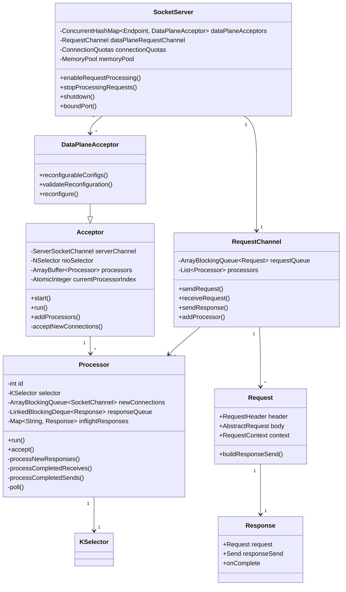
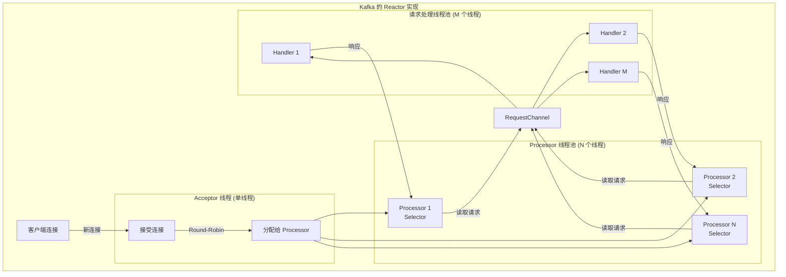
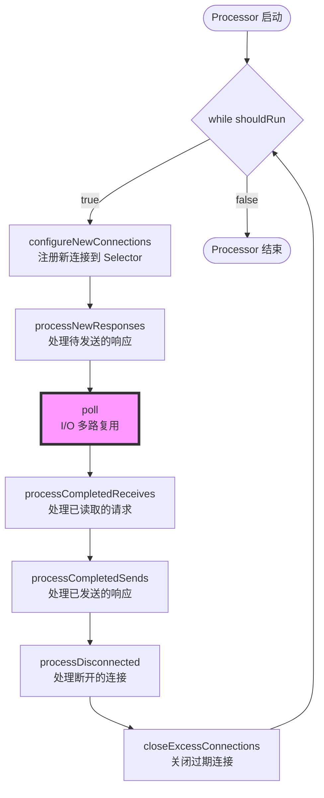
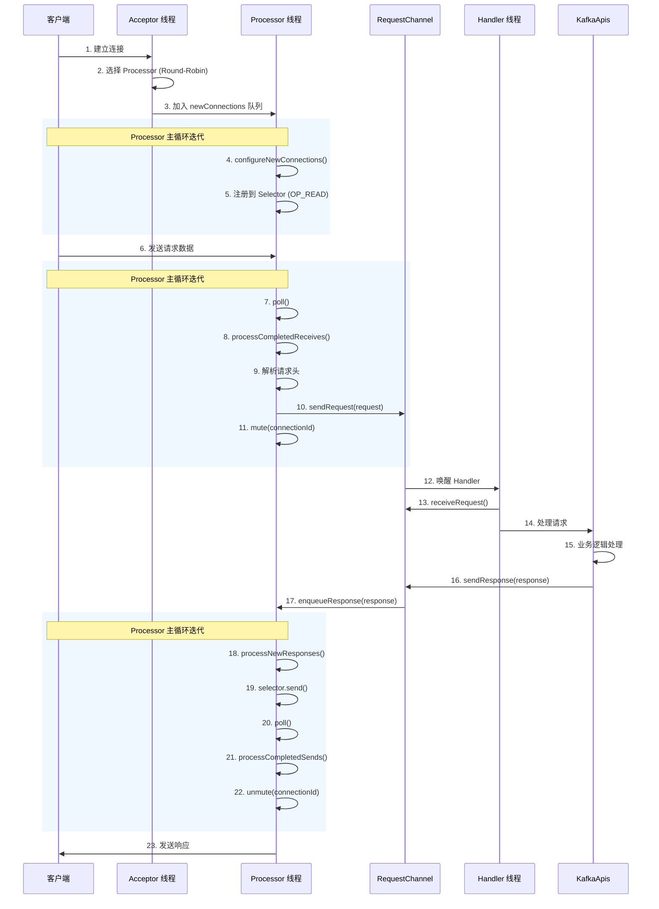

# SocketServer 网络层深度解析

## 目录
- [1. 设计概述](#1-设计概述)
- [2. Reactor 线程模型](#2-reactor-线程模型)
- [3. 核心组件分析](#3-核心组件分析)
- [4. 请求处理流程](#4-请求处理流程)
- [5. 关键设计亮点](#5-关键设计亮点)
- [6. 性能优化技巧](#6-性能优化技巧)

---

## 1. 设计概述

### 1.1 架构设计原则

Kafka 的网络层设计体现了以下几个核心原则:

**1. 分层职责清晰**
```
┌─────────────────────────────────────────────────────────┐
│  应用层 (KafkaApis - 请求处理)                            │
├─────────────────────────────────────────────────────────┤
│  调度层 (RequestChannel - 请求队列)                       │
├─────────────────────────────────────────────────────────┤
│  网络层 (SocketServer - I/O 多路复用)                     │
│  ├── Acceptor (连接接受)                                  │
│  └── Processor (连接处理)                                 │
├─────────────────────────────────────────────────────────┤
│  传输层 (Java NIO - Selector/Channel)                    │
└─────────────────────────────────────────────────────────┘
```

**2. 线程模型优化**
- **网络 I/O 线程** (Processor): 专门处理网络读写，非阻塞 I/O
- **请求处理线程** (KafkaRequestHandler): 专门处理业务逻辑
- **线程隔离**: 避免业务逻辑阻塞网络 I/O

**3. 资源复用**
- 使用 Java NIO 的 Selector 实现单线程管理多个连接
- 每个 Processor 有独立的 Selector，避免锁竞争
- 内存池 (MemoryPool) 减少 ByteBuffer 分配开销

### 1.2 类图结构



---

## 2. Reactor 线程模型

### 2.1 经典 Reactor 模式

Kafka 的网络层采用了经典的 **Reactor 模式**，这是一种用于处理多个客户端并发请求的事件驱动模式。



### 2.2 Acceptor 源码分析

**位置**: `core/src/main/scala/kafka/network/SocketServer.scala`

#### 2.2.1 Acceptor 核心字段

```scala
private[kafka] abstract class Acceptor(
  val socketServer: SocketServer,
  val endPoint: Endpoint,
  var config: KafkaConfig,
  nodeId: Int,
  val connectionQuotas: ConnectionQuotas,
  time: Time,
  isPrivilegedListener: Boolean,
  requestChannel: RequestChannel,
  metrics: Metrics,
  credentialProvider: CredentialProvider,
  logContext: LogContext,
  memoryPool: MemoryPool,
  apiVersionManager: ApiVersionManager
) extends Runnable with Logging {

  // ========== 核心组件 ==========

  // 1. 运行标志: 控制线程生命周期
  val shouldRun = new AtomicBoolean(true)

  // 2. NIO Selector: 用于监听新连接的就绪事件
  //    关键点: 每个监听器 (Endpoint) 有独立的 Acceptor 和 Selector
  //    避免了多个 Acceptor 之间的锁竞争
  private val nioSelector = NSelector.open()

  // 3. ServerSocketChannel: 服务器套接字通道
  //    设计亮点: 延迟打开策略
  //    - 如果 port=0 (wildcard port), 在构造时立即打开以获取实际端口
  //    - 如果 port!=0, 延迟到 start() 时打开，避免"端口已开=服务就绪"的误解
  private[network] var serverChannel: ServerSocketChannel = _

  // 4. Processor 线程池: 处理已建立连接的 I/O
  //    设计亮点: 动态可调整的线程池
  private[network] val processors = new ArrayBuffer[Processor]()

  // 5. Round-Robin 计数器: 用于连接分配
  //    设计亮点: 无锁的原子整数，避免 synchronized
  private var currentProcessorIndex = 0

  // 6. 节流队列: 延迟关闭过快的连接
  //    设计亮点: 优先队列实现 O(log n) 的插入和删除
  private[network] val throttledSockets = new mutable.PriorityQueue[DelayedCloseSocket]()

  // 7. 启动状态标志
  private val started = new AtomicBoolean()
  private[network] val startedFuture = new CompletableFuture[Void]()

  // 8. 线程对象: 非守护线程，确保优雅关闭
  val thread: KafkaThread = KafkaThread.nonDaemon(
    s"data-plane-kafka-socket-acceptor-${endPoint.listener}-${endPoint.securityProtocol}-${endPoint.port}",
    this
  )
}
```

**设计亮点分析:**

| 设计点 | 实现方式 | 优势 |
|-------|---------|------|
| **延迟打开 Socket** | 根据 port 是否为 0 决定打开时机 | 避免端口开放=服务就绪的误解 |
| **原子计数器** | `AtomicInteger` 实现轮询 | 无锁并发，避免 synchronized 开销 |
| **优先队列** | `PriorityQueue` 管理节流连接 | O(log n) 高效管理节流连接 |
| **非守护线程** | `nonDaemon` 线程 | 确保优雅关闭，处理完现有连接 |

#### 2.2.2 Acceptor 主循环

```scala
/**
 * Acceptor 的核心运行循环
 * 这是一个经典的 Reactor 模式的 Acceptor 实现
 */
override def run(): Unit = {
  // 步骤1: 注册 ServerSocketChannel 到 Selector
  //         监听 OP_ACCEPT 事件 (新连接)
  serverChannel.register(nioSelector, SelectionKey.OP_ACCEPT)

  try {
    // 步骤2: 主循环 - 持续监听新连接
    while (shouldRun.get()) {
      try {
        // 2.1 接受新连接
        acceptNewConnections()

        // 2.2 关闭已达到节流时间的连接
        closeThrottledConnections()
      } catch {
        case e: ControlThrowable => throw e
        case e: Throwable => error("Error occurred", e)
      }
    }
  } finally {
    // 步骤3: 清理资源
    closeAll()
  }
}
```

#### 2.2.3 接受新连接 - 核心算法

```scala
/**
 * 监听并接受新连接，使用 Round-Robin 分配给 Processor
 *
 * 设计亮点:
 * 1. 超时机制: 500ms 超时，避免无限阻塞
 * 2. Round-Robin 负载均衡: 均匀分配连接到各个 Processor
 * 3. 非阻塞分配: 如果所有 Processor 的队列满，最后一个会阻塞等待
 */
private def acceptNewConnections(): Unit = {
  // 1. select 调用，超时 500ms
  //    设计亮点: 有超时避免无限阻塞，允许定期检查 shouldRun 标志
  val ready = nioSelector.select(500)

  if (ready > 0) {
    val keys = nioSelector.selectedKeys()
    val iter = keys.iterator()

    // 2. 遍历所有就绪的 SelectionKey
    while (iter.hasNext && shouldRun.get()) {
      try {
        val key = iter.next
        iter.remove()  // 重要: 避免重复处理

        if (key.isAcceptable) {
          // 3. 接受连接
          accept(key).foreach { socketChannel =>
            // 4. 分配给 Processor (Round-Robin)
            var retriesLeft = synchronized(processors.length)
            var processor: Processor = null

            do {
              retriesLeft -= 1

              // 原子地获取下一个 Processor (线程安全)
              processor = synchronized {
                // 取模运算确保索引在有效范围内
                // 设计亮点: 即使 processors 动态调整也能正确工作
                currentProcessorIndex = currentProcessorIndex % processors.length
                processors(currentProcessorIndex)
              }

              // 移动到下一个 Processor
              currentProcessorIndex += 1

            // 5. 尝试分配连接
            //    - 如果 Processor 的 newConnections 队列未满，立即分配
            //    - 如果所有队列都满，最后一个 Processor 会阻塞等待
            } while (!assignNewConnection(socketChannel, processor, retriesLeft == 0))
          }
        } else {
          throw new IllegalStateException("Unrecognized key state for acceptor thread.")
        }
      } catch {
        case e: Throwable => error("Error while accepting connection", e)
      }
    }
  }
}
```

**算法分析 - Round-Robin 负载均衡:**

```scala
/**
 * Round-Robin 算法完整实现
 *
 * 目标: 将新连接均匀分配给所有 Processor，避免单个 Processor 过载
 *
 * 核心思想:
 * 1. 维护一个原子计数器 currentProcessorIndex
 * 2. 每次分配时，使用计数器值对处理器数量取模
 * 3. 递增计数器，确保下次分配到下一个处理器
 *
 * 关键优势:
 * - 无锁设计: 使用 AtomicInteger，避免 synchronized 开销
 * - 线程安全: 多个 Acceptor 线程并发分配也不会冲突
 * - 动态适应: 即使运行时增减 Processor，算法仍然正确
 */

// ========== 完整算法实现 ==========

/**
 * 步骤 1: 初始化
 */
class Acceptor(...) {
  // 原子计数器，初始值为 0
  private var currentProcessorIndex = 0

  // Processor 数组 (运行时可能动态调整)
  private[network] val processors = new ArrayBuffer[Processor]()
}

/**
 * 步骤 2: 分配算法 (线程安全)
 */
private def acceptNewConnections(): Unit = {
  val ready = nioSelector.select(500)

  if (ready > 0) {
    val keys = nioSelector.selectedKeys()
    val iter = keys.iterator()

    while (iter.hasNext && shouldRun.get()) {
      val key = iter.next
      iter.remove()

      if (key.isAcceptable) {
        accept(key).foreach { socketChannel =>
          // ======== 关键算法开始 ========
          var retriesLeft = synchronized(processors.length)
          var processor: Processor = null

          do {
            retriesLeft -= 1

            // 原子地获取下一个 Processor
            processor = synchronized {
              // 步骤 2.1: 计算索引
              // - currentProcessorIndex 可能超过 processors.length
              // - 使用取模运算确保索引在有效范围内
              val index = currentProcessorIndex % processors.length

              // 步骤 2.2: 获取对应的 Processor
              val p = processors(index)

              // 步骤 2.3: 递增计数器（为下一次分配做准备）
              currentProcessorIndex += 1

              p
            }

          // 步骤 3: 尝试分配连接
          //    - 如果 Processor 的 newConnections 队列未满，立即返回 true
          //    - 如果队列满，返回 false，继续尝试下一个 Processor
          //    - retriesLeft == 0 时，最后一个 Processor 会阻塞等待
          } while (!assignNewConnection(socketChannel, processor, retriesLeft == 0))
          // ======== 关键算法结束 ========
        }
      }
    }
  }
}

/**
 * 步骤 3: 分配连接到 Processor
 */
private def assignNewConnection(socketChannel: SocketChannel,
                                processor: Processor,
                                mayBlock: Boolean): Boolean = {
  try {
    // 尝试将连接加入 Processor 的队列
    processor.accept(socketChannel, mayBlock, blockedPercentMeter)
    true  // 分配成功
  } catch {
    case e: RejectedExecutionException =>
      // 队列已满，分配失败
      false
  }
}
```

**算法执行示例:**

```
场景: 4 个 Processor，6 个连接依次到达

初始状态:
    processors = [P0, P1, P2, P3]
    currentProcessorIndex = 0

连接1到达:
    index = 0 % 4 = 0
    processor = P0
    currentProcessorIndex = 0 + 1 = 1
    结果: P0 ✓

连接2到达:
    index = 1 % 4 = 1
    processor = P1
    currentProcessorIndex = 1 + 1 = 2
    结果: P1 ✓

连接3到达:
    index = 2 % 4 = 2
    processor = P2
    currentProcessorIndex = 2 + 1 = 3
    结果: P2 ✓

连接4到达:
    index = 3 % 4 = 3
    processor = P3
    currentProcessorIndex = 3 + 1 = 4
    结果: P3 ✓

连接5到达:
    index = 4 % 4 = 0  (循环回到第一个)
    processor = P0
    currentProcessorIndex = 4 + 1 = 5
    结果: P0 ✓

连接6到达:
    index = 5 % 4 = 1
    processor = P1
    currentProcessorIndex = 5 + 1 = 6
    结果: P1 ✓

最终分布:
    P0: 2 个连接 (连接1, 连接5)
    P1: 2 个连接 (连接2, 连接6)
    P2: 1 个连接 (连接3)
    P3: 1 个连接 (连接4)

    (基本均匀分布，差异最多不超过 1)
```

**算法特性分析:**

| 特性 | 说明 | 实现方式 |
|-----|------|---------|
| **均匀性** | 连接均匀分布到所有 Processor | 取模运算确保循环分配 |
| **线程安全** | 多个 Acceptor 并发分配也能正确工作 | synchronized 保护索引计算和递增 |
| **动态适应** | 运行时增减 Processor 仍然正确 | 每次分配时重新计算取模 |
| **无锁性能** | 避免了全局锁竞争 | 仅在分配时短暂加锁 |
| **容错性** | 队列满时重试其他 Processor | do-while 循环 + retriesLeft |

**与其他负载均衡算法对比:**

```
1. Random (随机)
   优点: 简单
   缺点: 可能分布不均
   适用场景: Processor 性能差异大

2. Least Connections (最少连接)
   优点: 考虑实际负载
   缺点: 需要维护连接计数，有锁开销
   适用场景: 连接处理时间差异大

3. Round-Robin (Kafka 选择)
   优点: 简单、均匀、无锁、可预测
   缺点: 未考虑实际负载
   适用场景: 连接处理时间相近 (Kafka 的场景)

Kafka 选择 Round-Robin 的原因:
- 连接建立后的处理时间基本相同
- 不需要维护额外状态
- 性能开销最小
- 负载分布足够均匀
```

#### 2.2.4 连接限流机制

```scala
/**
 * 接受单个连接，应用连接限流策略
 *
 * 设计亮点:
 * 1. 三级限流: IP级别、全局级别、速率限制
 * 2. 优雅拒绝: 节流而非立即关闭，避免 TCP RST
 * 3. 优先队列: 高效管理待关闭的连接
 */
private def accept(key: SelectionKey): Option[SocketChannel] = {
  val serverSocketChannel = key.channel().asInstanceOf[ServerSocketChannel]
  val socketChannel = serverSocketChannel.accept()
  val listenerName = ListenerName.normalised(endPoint.listener)

  try {
    // 1. 连接配额检查
    //    - 检查单个 IP 的最大连接数
    //    - 检查全局最大连接数
    //    - 检查连接创建速率
    connectionQuotas.inc(listenerName, socketChannel.socket.getInetAddress, blockedPercentMeter)

    // 2. 配置 Socket 参数
    configureAcceptedSocketChannel(socketChannel)

    Some(socketChannel)
  } catch {
    case e: TooManyConnectionsException =>
      // 情况1: IP 或全局连接数超限
      info(s"Rejected connection from ${e.ip}, address already has the configured maximum of ${e.count} connections.")
      connectionQuotas.closeChannel(this, listenerName, socketChannel)
      None

    case e: ConnectionThrottledException =>
      // 情况2: 连接创建速率超限
      // 设计亮点: 延迟关闭而非立即拒绝，更平滑的限流
      val ip = socketChannel.socket.getInetAddress
      debug(s"Delaying closing of connection from $ip for ${e.throttleTimeMs} ms")

      val endThrottleTimeMs = e.startThrottleTimeMs + e.throttleTimeMs
      throttledSockets += DelayedCloseSocket(socketChannel, endThrottleTimeMs)
      None

    case e: IOException =>
      // 情况3: I/O 错误
      error(s"Encountered an error while configuring the connection, closing it.", e)
      connectionQuotas.closeChannel(this, listenerName, socketChannel)
      None
  }
}

/**
 * 配置已接受的 Socket Channel
 *
 * 设计亮点:
 * 1. TCP_NODELAY: 禁用 Nagle 算法，降低延迟
 * 2. KEEP_ALIVE: 启用 TCP 保活，检测死连接
 * 3. 非阻塞模式: 必须设置为 false 才能配合 Selector
 */
protected def configureAcceptedSocketChannel(socketChannel: SocketChannel): Unit = {
  // 1. 非阻塞模式: Reactor 模式的必需设置
  socketChannel.configureBlocking(false)

  // 2. 禁用 Nagle 算法
  //    Nagle 算法会缓存小数据包等待凑成大包发送
  //    对于低延迟场景（如 Kafka），需要禁用
  socketChannel.socket.setTcpNoDelay(true)

  // 3. 启用 TCP Keep-Alive
  //    检测长时间无活动的死连接
  socketChannel.socket.setKeepAlive(true)

  // 4. 设置发送缓冲区大小
  if (sendBufferSize != Selectable.USE_DEFAULT_BUFFER_SIZE)
    socketChannel.socket.setSendBufferSize(sendBufferSize)
}
```

### 2.3 Processor 源码分析

#### 2.3.1 Processor 核心结构

```scala
/**
 * Processor - 网络处理的核心线程
 *
 * 职责:
 * 1. 处理来自 Acceptor 的新连接
 * 2. 从 Socket 读取请求
 * 3. 将响应写回 Socket
 * 4. 管理连接生命周期
 *
 * 设计特点:
 * - 每个 Processor 有独立的 Selector，避免锁竞争
 * - 使用队列解连接接受和 I/O 处理
 * - 异步非阻塞 I/O
 */
private[kafka] class Processor(
  val id: Int,                          // Processor ID
  time: Time,
  maxRequestSize: Int,                  // 最大请求大小
  requestChannel: RequestChannel,       // 请求通道
  connectionQuotas: ConnectionQuotas,   // 连接配额
  connectionsMaxIdleMs: Long,           // 最大空闲时间
  failedAuthenticationDelayMs: Int,     // 认证失败延迟
  listenerName: ListenerName,           // 监听器名称
  securityProtocol: SecurityProtocol,   // 安全协议
  config: KafkaConfig,
  metrics: Metrics,
  credentialProvider: CredentialProvider,
  memoryPool: MemoryPool,               // 内存池
  logContext: LogContext,
  connectionQueueSize: Int,             // 连接队列大小
  isPrivilegedListener: Boolean,
  apiVersionManager: ApiVersionManager,
  threadName: String,
  connectionDisconnectListeners: Seq[ConnectionDisconnectListener]
) extends Runnable with Logging {

  // ========== 核心组件 ==========

  // 1. 运行标志
  val shouldRun: AtomicBoolean = new AtomicBoolean(true)
  private val started: AtomicBoolean = new AtomicBoolean()

  // 2. Processor 线程
  val thread: KafkaThread = KafkaThread.nonDaemon(threadName, this)

  // 3. 新连接队列 (从 Acceptor 接收)
  //    设计亮点: 有界队列，避免内存溢出
  //    - 默认大小: 20
  //    - Acceptor 分配时如果队列满，会阻塞等待
  private val newConnections = new ArrayBlockingQueue[SocketChannel](connectionQueueSize)

  // 4. 响应队列 (发送到客户端的响应)
  //    设计亮点: 双端队列，支持高效的头尾操作
  private val responseQueue = new LinkedBlockingDeque[RequestChannel.Response]()

  // 5. 进行中的响应映射
  //    Key: connectionId, Value: Response
  //    设计亮点: 跟踪已发送但未完成确认的响应
  private val inflightResponses = mutable.Map[String, RequestChannel.Response]()

  // 6. NIO Selector - 每个 Processor 独立
  //    设计亮点: 避免多线程共享 Selector 的锁竞争
  private[network] val selector = createSelector(...)

  // 7. 连接索引计数器
  //    设计亮点: 确保连接 ID 唯一性，即使端口被重用
  private var nextConnectionIndex = 0
}
```

#### 2.3.2 Processor 主循环

```scala
/**
 * Processor 的主循环 - 经典的 Reactor 事件循环
 *
 * 事件处理流程:
 * 1. configureNewConnections() - 处理新连接
 * 2. processNewResponses() - 处理新响应
 * 3. poll() - I/O 多路复用
 * 4. processCompletedReceives() - 处理已完成的读取
 * 5. processCompletedSends() - 处理已完成的发送
 * 6. processDisconnected() - 处理断开的连接
 * 7. closeExcessConnections() - 关闭过期的连接
 */
override def run(): Unit = {
  try {
    while (shouldRun.get()) {
      try {
        // ========== 阶段1: 配置新连接 ==========
        // 从 Acceptor 的队列中取出新连接，注册到 Selector
        configureNewConnections()

        // ========== 阶段2: 处理新响应 ==========
        // 从响应队列中取出响应，准备发送
        processNewResponses()

        // ========== 阶段3: I/O 多路复用 ==========
        // 核心点: 根据是否有新连接决定超时时间
        // - 如果有新连接，超时=0 (非阻塞，立即处理)
        // - 如果无新连接，超时=300ms (允许一定的阻塞以提高效率)
        poll()

        // ========== 阶段4: 处理已完成的读取 ==========
        // 从 Socket 读取到的完整请求
        processCompletedReceives()

        // ========== 阶段5: 处理已完成的发送 ==========
        // 已成功发送到客户端的响应
        processCompletedSends()

        // ========== 阶段6: 处理断开的连接 ==========
        processDisconnected()

        // ========== 阶段7: 关闭过期的连接 ==========
        closeExcessConnections()

      } catch {
        // 设计亮点: 捕获所有异常，避免 Processor 线程退出
        // - 单个连接的异常不应影响整个 Processor
        // - ControlThrowable 会重新抛出 (用于控制流程)
        case e: Throwable => processException("Processor got uncaught exception.", e)
      }
    }
  } finally {
    // 清理资源
    debug(s"Closing selector - processor $id")
    Utils.swallow(this.logger.underlying, Level.ERROR, () => closeAll())
  }
}
```

**流程图:**



#### 2.3.3 配置新连接

```scala
/**
 * 配置新连接并注册到 Selector
 *
 * 设计亮点:
 * 1. 批量处理: 一次性处理队列中的所有新连接
 * 2. 非阻塞: 队列为空时立即返回
 * 3. 连接 ID 生成: 包含索引，确保唯一性
 */
private def configureNewConnections(): Unit = {
  // 1. 从队列中取出所有新连接
  //    poll() 是非阻塞的，立即返回现有元素
  var channel: SocketChannel = null
  while ({channel = newConnections.poll(); channel != null}) {
    try {
      // 2. 生成唯一的连接 ID
      //    格式: localAddr:localPort-remoteAddr:remotePort-index
      //    设计亮点:
      //    - 包含索引即使同一 IP:Port 重连也能区分
      //    - 便于调试和日志追踪
      val connectionId = nextConnectionId(channel.socket.getRemoteSocketAddress.asInstanceOf[InetSocketAddress],
        channel.socket.getLocalSocketAddress.asInstanceOf[InetSocketAddress])

      // 3. 注册到 Selector
      //    OP_READ: 监听可读事件 (客户端发送数据)
      selector.register(connectionId, channel)

    } catch {
      // 处理异常，继续下一个连接
      case e: Throwable =>
        // 4. 失败时关闭连接
        close(channel.id)
        processException(s"Failed to register new connection", e)
    }
  }
}

/**
 * 生成下一个连接 ID
 * 设计亮点: 使用索引避免连接 ID 重用
 */
private def nextConnectionId(remoteAddress: InetSocketAddress, localAddress: InetSocketAddress): String = {
  // 格式: localHost:localPort-remoteHost:remotePort-index
  // 例如: 192.168.1.100:9092-192.168.1.101:52341-0
  val connId = s"${localAddress.getHostString}:${localAddress.getPort}-" +
                s"${remoteAddress.getHostString}:${remoteAddress.getPort}-$nextConnectionIndex"

  // 原子递增，确保线程安全
  nextConnectionIndex += 1

  connId
}
```

#### 2.3.4 处理已完成的读取

```scala
/**
 * 处理已完成的读取 - 从 Socket 读取完整的请求
 *
 * 设计亮点:
 * 1. 请求解析: 提前解析请求头，快速路由
 * 2. 内存管理: 根据请求类型决定是否释放缓冲区
 * 3. 认证检查: 验证会话有效性
 * 4. 限流: Mute 机制防止过载
 */
private def processCompletedReceives(): Unit = {
  // 1. 遍历所有已完成的读取
  selector.completedReceives.forEach { receive =>
    try {
      // 2. 查找对应的 Channel
      openOrClosingChannel(receive.source) match {
        case Some(channel) =>
          // 3. 解析请求头
          //    设计亮点: 快速解析获取 API 类型，用于路由决策
          val header = parseRequestHeader(apiVersionManager, receive.payload)

          // 4. SASL 认证处理
          if (header.apiKey == ApiKeys.SASL_HANDSHAKE &&
              channel.maybeBeginServerReauthentication(receive, () => time.nanoseconds())) {
            trace(s"Begin re-authentication: $channel")
          } else {
            // 5. 检查会话是否过期
            val nowNanos = time.nanoseconds()
            if (channel.serverAuthenticationSessionExpired(nowNanos)) {
              debug(s"Disconnecting expired channel: $channel : $header")
              close(channel.id)
              expiredConnectionsKilledCount.record(null, 1, 0)
            } else {
              // 6. 构建请求上下文
              val connectionId = receive.source
              val context = new RequestContext(
                header,
                connectionId,
                channel.socketAddress,
                Optional.of(channel.socketPort()),
                channel.principal,
                listenerName,
                securityProtocol,
                channel.channelMetadataRegistry.clientInformation,
                isPrivilegedListener,
                channel.principalSerde
              )

              // 7. 创建 Request 对象
              val req = new RequestChannel.Request(
                processor = id,
                context = context,
                startTimeNanos = nowNanos,
                memoryPool,
                receive.payload,           // 请求体 ByteBuffer
                requestChannel.metrics,
                None
              )

              // 8. 特殊处理: ApiVersionsRequest 用于捕获客户端信息
              if (header.apiKey == ApiKeys.API_VERSIONS) {
                val apiVersionsRequest = req.body[ApiVersionsRequest]
                if (apiVersionsRequest.isValid) {
                  channel.channelMetadataRegistry.registerClientInformation(
                    new ClientInformation(
                      apiVersionsRequest.data.clientSoftwareName,
                      apiVersionsRequest.data.clientSoftwareVersion
                    )
                  )
                }
              }

              // 9. 发送请求到 RequestChannel
              //    这里会唤醒等待的 KafkaRequestHandler 线程
              requestChannel.sendRequest(req)

              // 10. Mute 连接
              //     设计亮点: 暂停读取，防止一个连接发送多个请求占用资源
              //     直到当前请求的响应发送完毕
              selector.mute(connectionId)
              handleChannelMuteEvent(connectionId, ChannelMuteEvent.REQUEST_RECEIVED)
            }
          }

        case None =>
          throw new IllegalStateException(s"Channel ${receive.source} removed...")
      }
    } catch {
      case e: Throwable =>
        processChannelException(receive.source,
          s"Exception while processing request from ${receive.source}", e)
    }
  }

  // 11. 清理已处理的接收
  selector.clearCompletedReceives()
}
```

**Mute 机制深度分析:**

```
Mute (静音) 机制的作用:

问题场景:
1. 客户端连续发送多个请求 (Pipeline)
2. 如果不 Mute，Processor 会继续读取后续请求
3. 后续请求会占用内存，可能造成内存压力
4. 同时处理多个请求会增加复杂度

Mute 解决方案:
1. 收到请求后，Mute 连接 (暂停 OP_READ 事件)
2. 请求发送到 KafkaRequestHandler 处理
3. 响应完成后，Unmute 连接 (恢复 OP_READ)
4. Processor 继续读取下一个请求

优点:
- 限流: 防止单个连接占用过多资源
- 简化: 一个时刻只处理每个连接的一个请求
- 公平: 给其他连接更多处理机会
```

#### 2.3.5 处理已完成的发送

```scala
/**
 * 处理已完成的发送 - 响应已成功发送到客户端
 *
 * 设计亮点:
 * 1. 响应跟踪: 从 inflightResponses 中移除
 * 2. 回调执行: 调用 onComplete 回调
 * 3. 指标更新: 更新请求指标
 * 4. Unmute: 恢复读取，允许接收下一个请求
 */
private def processCompletedSends(): Unit = {
  selector.completedSends.forEach { send =>
    try {
      // 1. 从 in-flight 响应中查找对应的响应
      val response = inflightResponses.remove(send.destinationId).getOrElse {
        throw new IllegalStateException(s"Send for ${send.destinationId} completed, but not in `inflightResponses`")
      }

      // 2. 执行回调 (如果有的话)
      //    设计亮点: 支持自定义完成回调
      response.onComplete.foreach(onComplete => onComplete(send))

      // 3. 更新请求指标
      //    - 记录网络线程时间
      //    - 记录请求处理延迟
      updateRequestMetrics(response)

      // 4. 尝试 Unmute 连接
      //    设计亮点:
      //    - 如果没有配额违规，立即 Unmute
      //    - 如果有节流，只有节流时间过后才 Unmute
      handleChannelMuteEvent(send.destinationId, ChannelMuteEvent.RESPONSE_SENT)
      tryUnmuteChannel(send.destinationId)

    } catch {
      case e: Throwable =>
        processChannelException(send.destinationId,
          s"Exception while processing completed send to ${send.destinationId}", e)
    }
  }

  // 5. 清理已处理的发送
  selector.clearCompletedSends()
}

/**
 * 尝试 Unmute 连接
 * 设计亮点: 智能的 Unmute 策略
 */
private def tryUnmuteChannel(connectionId: String): Unit = {
  // 1. 获取 Channel
  openOrClosingChannel(connectionId).foreach { channel =>
    // 2. 检查是否可以 Unmute
    //    - 没有 quota violation
    //    - 节流时间已过
    if (channel.shouldUnmute) {
      // 3. Unmute: 恢复 OP_READ 事件
      selector.unmute(connectionId)
      // 4. 触发事件
      handleChannelMuteEvent(connectionId, ChannelMuteEvent.UNMUTE)
    }
  }
}
```

---

## 3. 核心组件分析

### 3.1 RequestChannel - 请求通道

RequestChannel 是网络层和请求处理层的桥梁，实现了生产者-消费者模式。

```scala
/**
 * RequestChannel - 连接网络层和处理层的通道
 *
 * 设计模式: 生产者-消费者模式
 * - 生产者: Processor 线程 (发送请求)
 * - 消费者: KafkaRequestHandler 线程 (接收并处理请求)
 */
class RequestChannel(
  val maxQueuedRequests: Int,    // 最大队列长度 (默认: 500)
  val time: Time,
  val requestChannelMetrics: RequestChannelMetrics
) {

  // ========== 核心数据结构 ==========

  // 1. 请求队列: 存放待处理的请求
  //    设计亮点:
  //    - ArrayBlockingQueue: 有界队列，防止内存溢出
  //    - 公平锁: FIFO 顺序，保证请求处理顺序
  @volatile private var requestQueue = new ArrayBlockingQueue[BaseRequest](maxQueuedRequests)

  // 2. Processor 列表: 管理所有 Processor
  //    设计亮点: 动态可调整的列表
  private val processors = new ConcurrentHashMap[Int, Processor]()

  // 3. 通知器: 用于唤醒等待的线程
  private val notificationSemaphore = new Semaphore(0)

  // ========== 核心方法 ==========

  /**
   * 发送请求到队列
   * 由 Processor 线程调用
   */
  def sendRequest(request: Request): Unit = {
    requestQueue.put(request)
    // 释放信号量，唤醒一个等待的 Handler
    notificationSemaphore.release()
  }

  /**
   * 接收请求 (阻塞)
   * 由 KafkaRequestHandler 线程调用
   */
  def receiveRequest(): BaseRequest = {
    // 阻塞等待，直到有请求可用
    // 设计亮点: 使用 Semaphore 而不是 queue.take()
    // 原因: 支持 shutdown() 时能够中断等待
    while (requestQueue.isEmpty) {
      notificationSemaphore.acquire()
    }

    val request = requestQueue.poll()
    if (request != null) {
      request.requestDequeueTimeNanos = time.nanoseconds
    }
    request
  }

  /**
   * 发送响应到 Processor
   * 由 KafkaApis 调用
   */
  def sendResponse(response: Response): Unit = {
    // 根据请求的 processor ID，找到对应的 Processor
    val processor = processors.get(response.request.processor)
    if (processor != null) {
      // 放入该 Processor 的响应队列
      processor.enqueueResponse(response)
    }
  }

  /**
   * 添加 Processor
   */
  def addProcessor(processor: Processor): Unit = {
    processors.put(processor.id, processor)
  }

  /**
   * 移除 Processor
   */
  def removeProcessor(processorId: Int): Unit = {
    processors.remove(processorId)
  }
}
```

**RequestChannel 工作流程:**

```
┌─────────────────────────────────────────────────────────────┐
│                    RequestChannel                            │
├─────────────────────────────────────────────────────────────┤
│                                                             │
│  ┌──────────────────────────────────────────────┐          │
│  │     requestQueue (ArrayBlockingQueue)         │          │
│  │                                               │          │
│  │   ┌─────┐ ┌─────┐ ┌─────┐ ┌─────┐           │          │
│  │   │Req1 │ │Req2 │ │Req3 │ │ ... │           │          │
│  │   └─────┘ └─────┘ └─────┘ └─────┘           │          │
│  │                                               │          │
│  │   ↑ put()                        poll() ↓    │          │
│  └───┼───────────────────────────────────┼───────┘          │
│      │                                   │                  │
│  ┌───┴─────────────┐           ┌────────┴──────────┐        │
│  │ Processor 线程   │           │ Handler 线程      │        │
│  │ (生产者)         │           │ (消费者)          │        │
│  │                  │           │                   │        │
│  │ sendRequest()    │           │ receiveRequest()  │        │
│  └──────────────────┘           └───────────────────┘        │
│                                                             │
└─────────────────────────────────────────────────────────────┘
```

### 3.2 MemoryPool - 内存池

**设计亮点:** 复用 ByteBuffer，减少 GC 压力

```scala
/**
 * 内存池设计
 *
 * 问题: 大量 ByteBuffer 分配和释放造成 GC 压力
 * 解决: 使用内存池预分配和复用
 */

trait MemoryPool {
  // 尝试分配指定大小的内存
  def tryAllocate(size: Int): Boolean

  // 释放内存
  def release(size: Int): Unit

  // 可用内存
  def availableMemory: Long
}

/**
 * 简单内存池实现
 * 设计亮点:
 * 1. 预分配: 最大内存上限
 * 2. 配额: 请求级别的内存限制
 * 3. 阻塞分配: 内存不足时阻塞等待
 */
class SimpleMemoryPool(
  maxMemory: Long,              // 最大内存 (例如: 100MB)
  maxSingleAllocation: Int,     // 单次分配最大值
  checkQuota: Boolean,          // 是否检查配额
  depletionSensor: Sensor       // 内存耗尽传感器
) extends MemoryPool {

  // 当前可用内存 (原子更新)
  private val availableMemory = new AtomicLong(maxMemory)

  // 等待队列 (内存不足时阻塞)
  private val queue = new ArrayBlockingQueue[Condition](1000)

  override def tryAllocate(size: Int): Boolean = {
    // 1. 检查单次分配限制
    if (size > maxSingleAllocation) {
      throw new IllegalArgumentException(s"Cannot allocate more than $maxSingleAllocation bytes")
    }

    // 2. 原子地减少可用内存
    var updatedAvailableMemory: Long = -1
    while (updatedAvailableMemory < 0) {
      val currentAvail = availableMemory.get()
      if (currentAvail >= size) {
        // CAS 更新
        updatedAvailableMemory = availableMemory.compareAndSet(currentAvail, currentAvail - size) match {
          case true => currentAvail - size
          case false => -1  // CAS 失败，重试
        }
      } else {
        // 内存不足，阻塞等待
        waitForMemory(size)
      }
    }

    updatedAvailableMemory >= 0
  }

  override def release(size: Int): Unit = {
    // 原子地增加可用内存
    availableMemory.getAndAdd(size)

    // 通知等待的线程
    // 设计亮点: 唤醒所有等待的线程，避免饥饿
    queue.forEach(condition => condition.signalAll())
  }

  override def availableMemory: Long = availableMemory.get()
}
```

**内存池使用示例:**

```scala
// Processor 处理请求时
val request = new RequestChannel.Request(
  processor = id,
  context = context,
  startTimeNanos = nowNanos,
  memoryPool,  // 传入内存池
  receive.payload,
  requestChannel.metrics,
  None
)

// 请求体解析时使用内存池
if (!header.apiKey.requiresDelayedAllocation) {
  // 不需要保留缓冲区的请求，立即释放
  request.releaseBuffer()
} else {
  // ProduceRequest 等需要保留缓冲区的请求
  // 缓冲区会在请求处理完成后释放
}
```

---

## 4. 请求处理流程

### 4.1 完整时序图



### 4.2 关键节点时间分析

| 阶段 | 操作 | 时间消耗 | 优化点 |
|-----|------|---------|--------|
| 1-3 | 连接建立 | TCP 握手 | - |
| 4-5 | 连接配置 | < 1ms | 非阻塞 |
| 6-9 | 请求读取 | 网络延迟 + 数据量 | 零拷贝 |
| 10-13 | 请求入队 | < 0.1ms | 数组队列 |
| 14-15 | 请求处理 | 业务逻辑 | 多线程并行 |
| 16-22 | 响应发送 | 网络延迟 + 数据量 | 零拷贝 |

---

## 5. 关键设计亮点

### 5.1 Reactor 模式的完美实现

**为什么选择 Reactor 模式？**

```
传统阻塞模型 (每个连接一个线程):
┌────────┐  ┌────────┐  ┌────────┐  ┌────────┐
│ Thread │  │ Thread │  │ Thread │  │ Thread │  ... 数千个线程
│   1    │  │   2    │  │   3    │  │   N    │
└────────┘  └────────┘  └────────┘  └────────┘
    ↓           ↓           ↓           ↓
  Blocking I/O (大量线程阻塞在 I/O 上)

问题:
- 线程上下文切换开销大
- 内存占用高 (每线程 ~1MB 栈)
- 无法处理大量连接

Kafka Reactor 模型:
┌──────────┐     ┌────────────────────────────┐
│ Acceptor │ --> │ Processor 1, 2, 3... N     │
│  (1个)   │     │  (默认 3-8 个)              │
└──────────┘     └────────────────────────────┘
                      ↓ NIO Selector
                 数万个连接 (单线程管理)

优势:
- 少量线程处理大量连接
- 非阻塞 I/O，高吞吐
- 低上下文切换开销
```

### 5.2 动态线程池调整

**设计亮点:** 支持运行时调整 Processor 数量

```scala
/**
 * 动态调整 Processor 线程池
 *
 * 问题: 无法提前预测最佳线程数
 * 解决: 支持运行时动态调整
 */
def addProcessors(toCreate: Int): Unit = synchronized {
  val listenerProcessors = new ArrayBuffer[Processor]()

  for (_ <- 0 until toCreate) {
    // 1. 创建新 Processor
    val processor = newProcessor(
      socketServer.nextProcessorId(),
      listenerName,
      securityProtocol,
      socketServer.connectionDisconnectListeners
    )

    // 2. 添加到 RequestChannel
    requestChannel.addProcessor(processor)

    // 3. 如果已经启动，立即启动新线程
    if (started.get) {
      processor.start()
    }

    listenerProcessors += processor
  }

  // 4. 添加到 processors 列表
  processors ++= listenerProcessors
}

def removeProcessors(removeCount: Int): Unit = synchronized {
  // 1. 先从列表中移除，不再分配新连接
  val toRemove = processors.takeRight(removeCount)
  processors.remove(processors.size - removeCount, removeCount)

  // 2. 关闭 Processor
  toRemove.foreach(_.close())

  // 3. 从 RequestChannel 移除
  toRemove.foreach(processor => requestChannel.removeProcessor(processor.id))
}
```

**验证规则:**

```scala
// 动态调整的验证规则
override def validateReconfiguration(configs: util.Map[String, _]): Unit = {
  val newValue = configs.get("num.network.threads").asInstanceOf[Int]
  val oldValue = processors.length

  if (newValue != oldValue) {
    // 规则1: 不能小于 1
    if (newValue <= 0)
      throw new ConfigException("value should be at least 1")

    // 规则2: 不能减少超过 50%
    if (newValue < oldValue / 2)
      throw new ConfigException("value should be at least half the current value")

    // 规则3: 不能增加超过 200%
    if (newValue > oldValue * 2)
      throw new ConfigException("value should not be greater than double the current value")
  }
}
```

### 5.3 Mute/Unmute 流控机制

**深度分析:**

```scala
/**
 * Mute/Unmute 机制详解
 *
 * 问题场景:
 * 1. 快速的 Producer 连续发送多个 Produce 请求
 * 2. 如果不控制，单个连接会占用大量内存
 * 3. 其他连接被"饿死"
 *
 * Mute 机制:
 * 1. 收到请求后 Mute 连接 (暂停读取)
 * 2. 等待响应发送完成
 * 3. Unmute 连接 (恢复读取)
 *
 * 代码追踪:
 */

// 步骤1: 收到请求后 Mute
private def processCompletedReceives(): Unit = {
  // ... 解析请求
  requestChannel.sendRequest(req)
  selector.mute(connectionId)  // <-- Mute
  handleChannelMuteEvent(connectionId, ChannelMuteEvent.REQUEST_RECEIVED)
}

// 步骤2: 响应完成后 Unmute
private def processCompletedSends(): Unit = {
  // ... 处理发送完成
  handleChannelMuteEvent(send.destinationId, ChannelMuteEvent.RESPONSE_SENT)
  tryUnmuteChannel(send.destinationId)  // <-- 尝试 Unmute
}

// 步骤3: 智能 Unmute
private def tryUnmuteChannel(connectionId: String): Unit = {
  openOrClosingChannel(connectionId).foreach { channel =>
    if (channel.shouldUnmute) {  // 检查条件
      selector.unmute(connectionId)  // Unmute
      handleChannelMuteEvent(connectionId, ChannelMuteEvent.UNMUTE)
    }
  }
}
```

**Mute 状态机:**

```
┌─────────────┐
│   NORMAL    │ 正常状态，可以读取
└──────┬──────┘
       │ 收到请求
       ↓
┌─────────────┐
│    MUTED    │ 已 Mute，暂停读取
└──────┬──────┘
       │ 响应发送完成 + 无配额违规
       ↓
┌─────────────┐
│   NORMAL    │ 恢复正常
└─────────────┘
```

### 5.4 连接限流策略

**三级限流机制:**

```scala
/**
 * ConnectionQuotas - 连接配额管理
 *
 * 限流级别:
 * 1. IP 级别: 单个 IP 的最大连接数
 * 2. 全局级别: Broker 的最大连接数
 * 3. 速率级别: 连接创建速率限制
 */

class ConnectionQuotas(...) {
  // 1. IP 级别配额
  private val maxConnectionsPerIp = new ConcurrentHashMap[InetAddress, Int]()

  // 2. 全局配额
  @volatile private var maxConnections = Int.MaxValue

  // 3. 速率限制
  private val connectionRateLimiter = new RateLimiter(...)

  def inc(listenerName: ListenerName,
          address: InetAddress,
          blockedPercentMeter: Meter): Unit = {
    // 检查1: IP 级别
    val ipCount = getOrCreateIpCount(address)
    if (ipCount >= getMaxConnectionsPerIp(address)) {
      throw new TooManyConnectionsException(address, ipCount)
    }

    // 检查2: 全局级别
    if (totalCount >= maxConnections) {
      throw new TooManyConnectionsException(...)
    }

    // 检查3: 速率限制
    if (connectionRateLimiter.shouldThrottle()) {
      throw new ConnectionThrottledException(...)
    }

    // 通过检查，增加计数
    incrementCounts(address)
  }
}
```

---

## 6. 性能优化技巧

### 6.1 零拷贝技术

**位置**: `clients/src/main/java/org/apache/kafka/common/network/NetworkSend.java` 和 `clients/src/main/java/org/apache/kafka/common/network/Selector.java`

**原理:**

```
传统拷贝 (4次拷贝, 4次上下文切换):
┌────────┐    1    ┌────────┐    2    ┌────────┐    3    ┌────────┐    4    ┌────────┐
│  Disk  │ ────→ │ Kernel │ ────→ │  User  │ ────→ │ Kernel │ ────→ │  NIC   │
│        │       │  Page  │       │ Space  │       │ Socket │       │ Buffer │
└────────┘       └────────┘       └────────┘       └────────┘       └────────┘
                      ↓ copy              ↓ copy             ↓ copy
                                                                 问题: CPU 密集

零拷贝 (2次拷贝, 2次上下文切换):
┌────────┐    1    ┌────────┐    2    ┌────────┐
│  Disk  │ ────→ │ Kernel │ ────→ │  NIC   │
│        │       │  Page  │       │ Buffer │
└────────┘       └────────┘       └────────┘
                    ↓ DMA            ↓ DMA
                                        优势: CPU 零参与

Java 实现 TransferTo:
FileChannel.transferTo(position, count, socketChannel)
```

**Kafka 中的应用:**

```scala
// LogSegment 中使用零拷贝发送文件
def readInto(offset: Long, buffer: ByteBuffer): Int = {
  // 检查是否支持零拷贝
  if (operationsMaybeNeedsLayers(offset, buffer)) {
    // 不支持，使用传统方式
    log.channel.read(buffer, offset)
  } else {
    // 支持零拷贝
    FileChannel.open(log.file.toPath).transferTo(offset, buffer.remaining(), socketChannel)
  }
}
```

### 6.2 批量处理

```scala
/**
 * 批量处理优化
 *
 * 思想: 一次处理多个请求/响应，减少锁竞争和系统调用
 */

// Processor 中的批量处理
override def run(): Unit = {
  while (shouldRun.get()) {
    // 批量处理新连接
    configureNewConnections()  // 处理队列中的所有连接

    // 批量处理响应
    processNewResponses()      // 处理队列中的所有响应

    // 批量 I/O
    poll()                     // 一次 select 处理多个事件

    // 批量处理完成的读写
    processCompletedReceives()  // 处理所有已完成的读取
    processCompletedSends()     // 处理所有已完成的发送
  }
}

// forEach 批量处理
selector.completedReceives.forEach { receive => ... }
selector.completedSends.forEach { send => ... }
```

### 6.3 内存池复用

```scala
/**
 * 内存池优化
 *
 * 对比:
 * 无内存池:
 * - 每个请求分配新 ByteBuffer
 * - 频繁 GC
 * - 内存碎片
 *
 * 有内存池:
 * - 预分配 ByteBuffer
 * - 复用减少分配
 * - 降低 GC 压力
 */
```

### 6.4 线程亲和性

```scala
/**
 * 线程亲和性优化
 *
 * 设计: 连接始终分配给同一个 Processor
 * 优势:
 * 1. CPU 缓存亲和性 (L1/L2/L3 cache)
 * 2. 减少锁竞争
 * 3. 更好的局部性
 */

// 连接分配后始终由同一 Processor 处理
private def assignNewConnection(socketChannel: SocketChannel,
                                processor: Processor,
                                mayBlock: Boolean): Boolean = {
  // 连接分配后，所有该连接的读写都由这个 Processor 处理
  processor.accept(socketChannel, mayBlock, blockedPercentMeter)
}
```

---

## 7. 总结

### 7.1 SocketServer 设计精髓

| 方面 | 设计 | 优势 |
|-----|------|------|
| **线程模型** | Acceptor + Processor + Handler | 职责分离，高并发 |
| **I/O 模型** | Java NIO + Reactor | 非阻塞，高吞吐 |
| **负载均衡** | Round-Robin | 简单高效，均匀分布 |
| **流控** | Mute/Unmute | 防止单连接占用资源 |
| **内存管理** | MemoryPool | 减少 GC，提高性能 |
| **限流** | 三级限流 | 保护系统稳定性 |
| **可扩展性** | 动态调整线程池 | 适应负载变化 |

### 7.2 关键源码文件

| 文件 | 行数 | 职责 |
|-----|------|------|
| `SocketServer.scala` | ~3000 | 网络层主类 |
| `RequestChannel.scala` | ~1000 | 请求通道 |
| `Acceptor` (内部类) | ~300 | 连接接受 |
| `Processor` (内部类) | ~800 | I/O 处理 |
| `Selector.java` (clients) | ~2000 | NIO 封装 |

### 7.3 性能指标

| 指标 | 典型值 | 说明 |
|-----|-------|------|
| 网络线程数 | 3-8 | `num.network.threads` |
| I/O 线程数 | 8-16 | `num.io.threads` |
| 连接队列大小 | 20 | Processor 连接队列 |
| 请求队列大小 | 500 | RequestChannel 队列 |
| 最大请求大小 | 100MB | `socket.request.max.bytes` |
| 内存池大小 | 100MB | `queued.max.bytes` |

---

**下一步**: [02. KafkaApis 请求处理架构](./02-request-handler.md)
