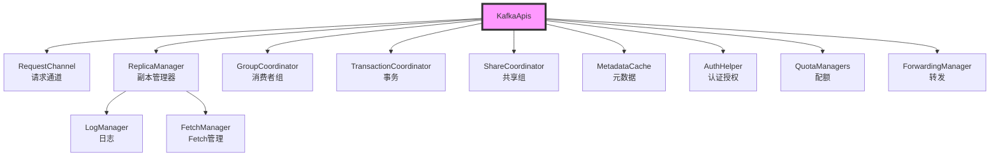
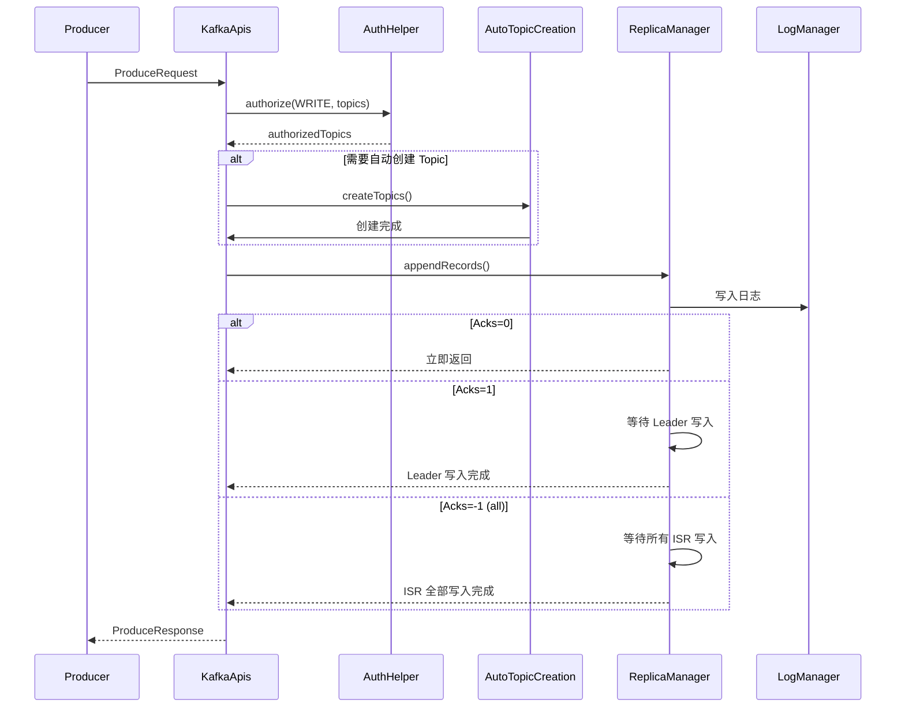
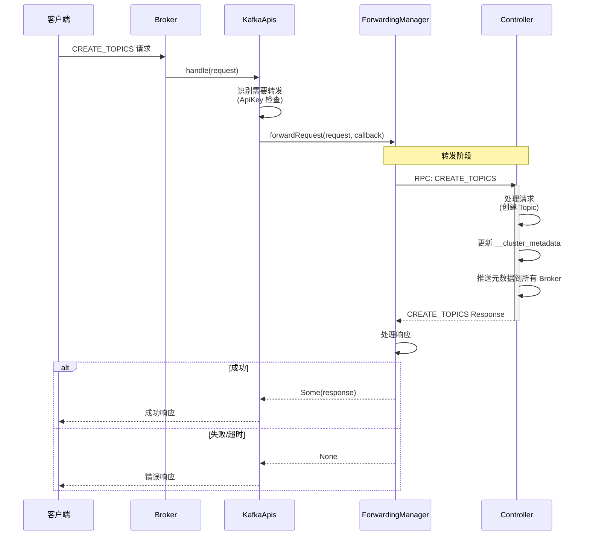

# KafkaApis 请求处理架构深度解析

## 目录
- [1. KafkaApis 概述](#1-kafkaapis-概述)
- [2. 请求路由机制](#2-请求路由机制)
- [3. 核心请求处理](#3-核心请求处理)
- [4. 转发机制](#4-转发机制)
- [5. 认证与授权](#5-认证与授权)
- [6. 设计亮点分析](#6-设计亮点分析)

---

## 1. KafkaApis 概述

### 1.1 职责与定位

KafkaApis 是 Kafka Broker 的**请求处理中心**，负责：

```
┌─────────────────────────────────────────────────────────────┐
│                      KafkaApis                              │
├─────────────────────────────────────────────────────────────┤
│                                                             │
│  1. 请求路由: 根据 ApiKey 分发到对应的处理方法                │
│  2. 业务逻辑: 协调各组件完成请求处理                           │
│  3. 权限控制: ACL 验证                                       │
│  4. 响应构造: 构建并发送响应                                   │
│  5. 异常处理: 统一的异常处理机制                               │
│  6. 转发: 将非本机处理的请求转发到 Controller                   │
│                                                             │
└─────────────────────────────────────────────────────────────┘
```

### 1.2 类结构

```scala
/**
 * KafkaApis - 请求处理的核心类
 *
 * 设计特点:
 * 1. 薄封装: 主要负责路由，具体逻辑委托给专门的组件
 * 2. 依赖注入: 持有所有核心组件的引用
 * 3. 无状态: 不保存请求状态，便于水平扩展
 */
class KafkaApis(
  val requestChannel: RequestChannel,           // 请求通道
  val forwardingManager: ForwardingManager,     // 转发管理器
  val replicaManager: ReplicaManager,           // 副本管理器 (核心)
  val groupCoordinator: GroupCoordinator,       // 消费者组协调器
  val txnCoordinator: TransactionCoordinator,   // 事务协调器
  val shareCoordinator: ShareCoordinator,       // 共享组协调器
  val autoTopicCreationManager: AutoTopicCreationManager, // 自动创建 Topic
  val brokerId: Int,
  val config: KafkaConfig,
  val configRepository: ConfigRepository,
  val metadataCache: MetadataCache,             // 元数据缓存
  val metrics: Metrics,
  val authorizerPlugin: Option[Plugin[Authorizer]], // 授权插件
  val quotas: QuotaManagers,                    // 配额管理
  val fetchManager: FetchManager,               // Fetch 管理
  val sharePartitionManager: SharePartitionManager,
  val brokerTopicStats: BrokerTopicStats,
  val clusterId: String,
  val time: Time,
  val tokenManager: DelegationTokenManager,
  val apiVersionManager: ApiVersionManager,
  val clientMetricsManager: ClientMetricsManager,
  val groupConfigManager: GroupConfigManager
) extends ApiRequestHandler with Logging {

  // ========== 辅助组件 ==========

  // 配置助手: 处理配置相关的请求
  val configHelper = new ConfigHelper(metadataCache, config, configRepository)

  // 认证助手: 处理 ACL 相关的逻辑
  val authHelper = new AuthHelper(authorizerPlugin)

  // 请求处理助手: 通用的请求处理逻辑
  val requestHelper = new RequestHandlerHelper(requestChannel, quotas, time)

  // ACL API 处理器
  val aclApis = new AclApis(authHelper, authorizerPlugin, requestHelper, ...)

  // 配置管理器
  val configManager = new ConfigAdminManager(brokerId, config, configRepository)

  // Topic 分区描述处理器
  val describeTopicPartitionsRequestHandler = new DescribeTopicPartitionsRequestHandler(...)
}
```

### 1.3 依赖关系图



---

## 2. 请求路由机制

### 2.1 主入口 - handle() 方法

```scala
/**
 * 请求处理的主入口 - 所有请求的必经之路
 *
 * 设计亮点:
 * 1. 模式匹配: 使用 Scala 的 match 进行路由
 * 2. 异步处理: 部分请求返回 CompletableFuture
 * 3. 统一异常处理: 所有异常都被捕获
 * 4. 延迟操作: 完成可能满足的延迟操作
 */
override def handle(request: RequestChannel.Request, requestLocal: RequestLocal): Unit = {
  // ========== 异常处理函数 ==========
  def handleError(e: Throwable): Unit = {
    error(s"Unexpected error handling request ${request.requestDesc(true)} " +
          s"with context ${request.context}", e)
    requestHelper.handleError(request, e)
  }

  try {
    trace(s"Handling request:${request.requestDesc(true)} from connection ${request.context.connectionId};")

    // ========== API 版本检查 ==========
    if (!apiVersionManager.isApiEnabled(request.header.apiKey, request.header.apiVersion)) {
      throw new IllegalStateException(s"API ${request.header.apiKey} with version ${request.header.apiVersion} is not enabled")
    }

    // ========== 请求路由: 根据ApiKey 分发 ==========
    request.header.apiKey match {
      // ========== 核心生产/消费 API ==========
      case ApiKeys.PRODUCE => handleProduceRequest(request, requestLocal)
      case ApiKeys.FETCH => handleFetchRequest(request)
      case ApiKeys.LIST_OFFSETS => handleListOffsetRequest(request)
      case ApiKeys.METADATA => handleTopicMetadataRequest(request)

      // ========== 消费者组 API ==========
      case ApiKeys.OFFSET_COMMIT => handleOffsetCommitRequest(request, requestLocal).exceptionally(handleError)
      case ApiKeys.OFFSET_FETCH => handleOffsetFetchRequest(request).exceptionally(handleError)
      case ApiKeys.FIND_COORDINATOR => handleFindCoordinatorRequest(request)
      case ApiKeys.JOIN_GROUP => handleJoinGroupRequest(request, requestLocal).exceptionally(handleError)
      case ApiKeys.HEARTBEAT => handleHeartbeatRequest(request).exceptionally(handleError)
      case ApiKeys.LEAVE_GROUP => handleLeaveGroupRequest(request).exceptionally(handleError)
      case ApiKeys.SYNC_GROUP => handleSyncGroupRequest(request, requestLocal).exceptionally(handleError)
      case ApiKeys.DESCRIBE_GROUPS => handleDescribeGroupsRequest(request).exceptionally(handleError)
      case ApiKeys.LIST_GROUPS => handleListGroupsRequest(request).exceptionally(handleError)

      // ========== 事务 API ==========
      case ApiKeys.INIT_PRODUCER_ID => handleInitProducerIdRequest(request, requestLocal)
      case ApiKeys.ADD_PARTITIONS_TO_TXN => handleAddPartitionsToTxnRequest(request, requestLocal)
      case ApiKeys.ADD_OFFSETS_TO_TXN => handleAddOffsetsToTxnRequest(request, requestLocal)
      case ApiKeys.END_TXN => handleEndTxnRequest(request, requestLocal)
      case ApiKeys.WRITE_TXN_MARKERS => handleWriteTxnMarkersRequest(request, requestLocal)
      case ApiKeys.TXN_OFFSET_COMMIT => handleTxnOffsetCommitRequest(request, requestLocal).exceptionally(handleError)

      // ========== 配置 API ==========
      case ApiKeys.ALTER_CONFIGS => handleAlterConfigsRequest(request)
      case ApiKeys.DESCRIBE_CONFIGS => handleDescribeConfigsRequest(request)
      case ApiKeys.INCREMENTAL_ALTER_CONFIGS => handleIncrementalAlterConfigsRequest(request)

      // ========== ACL API ==========
      case ApiKeys.DESCRIBE_ACLS => handleDescribeAcls(request)

      // ========== 需要转发到 Controller 的 API ==========
      case ApiKeys.CREATE_TOPICS => forwardToController(request)
      case ApiKeys.DELETE_TOPICS => forwardToController(request)
      case ApiKeys.CREATE_ACLS => forwardToController(request)
      case ApiKeys.DELETE_ACLS => forwardToController(request)
      case ApiKeys.CREATE_PARTITIONS => forwardToController(request)
      case ApiKeys.ELECT_LEADERS => forwardToController(request)
      case ApiKeys.ALTER_PARTITION_REASSIGNMENTS => forwardToController(request)
      // ... 更多需要转发的 API

      // ========== 其他 API ==========
      case ApiKeys.API_VERSIONS => handleApiVersionsRequest(request)
      case ApiKeys.SASL_HANDSHAKE => handleSaslHandshakeRequest(request)
      case ApiKeys.SASL_AUTHENTICATE => handleSaslAuthenticateRequest(request)
      // ... 共享组、流处理等 API

      case _ => throw new IllegalStateException(s"No handler for request api key ${request.header.apiKey}")
    }
  } catch {
    case e: FatalExitError => throw e
    case e: Throwable => handleError(e)
  } finally {
    // ========== 完成延迟操作 ==========
    // 设计亮点: 每次请求处理后尝试完成延迟操作
    // 例如: DelayedProduce, DelayedFetch 等
    replicaManager.tryCompleteActions()

    // 记录完成时间
    if (request.apiLocalCompleteTimeNanos < 0)
      request.apiLocalCompleteTimeNanos = time.nanoseconds
  }
}
```

### 2.2 请求路由表

| ApiKey | 处理方法 | 是否转发 | 说明 |
|--------|---------|---------|------|
| PRODUCE | handleProduceRequest | ❌ | 生产消息 |
| FETCH | handleFetchRequest | ❌ | 消费消息 |
| METADATA | handleTopicMetadataRequest | ❌ | 获取元数据 |
| OFFSET_COMMIT | handleOffsetCommitRequest | ❌ | 提交 Offset |
| JOIN_GROUP | handleJoinGroupRequest | ❌ | 加入消费者组 |
| HEARTBEAT | handleHeartbeatRequest | ❌ | 消费者心跳 |
| CREATE_TOPICS | forwardToController | ✅ | 创建 Topic |
| DELETE_TOPICS | forwardToController | ✅ | 删除 Topic |
| CREATE_ACLS | forwardToController | ✅ | 创建 ACL |
| INIT_PRODUCER_ID | handleInitProducerIdRequest | ❌ | 初始化事务 |
| END_TXN | handleEndTxnRequest | ❌ | 结束事务 |

### 2.3 路由模式分析

```scala
/**
 * 路由模式对比
 */

// ========== 模式1: 直接处理 (大部分请求) ==========
case ApiKeys.PRODUCE => handleProduceRequest(request, requestLocal)

// 特点:
// - 本地立即处理
// - 访问 ReplicaManager 等本地组件
// - 快速返回响应

// ========== 模式2: 异步处理 (带 exceptionally) ==========
case ApiKeys.OFFSET_COMMIT => handleOffsetCommitRequest(request, requestLocal)
                                       .exceptionally(handleError)

// 特点:
// - 返回 CompletableFuture
// - 可能涉及异步操作 (如等待其他 Broker)
// - exceptionally 统一异常处理

// ========== 模式3: 转发到 Controller ==========
case ApiKeys.CREATE_TOPICS => forwardToController(request)

// 特点:
// - 只有 Controller 能处理
// - 通过 RPC 转发到 Controller
// - 等待 Controller 响应
```

---

## 3. 核心请求处理

### 3.1 Produce 请求 - 生产消息

```scala
/**
 * 处理 Produce 请求 - Kafka 最核心的 API
 *
 * 流程:
 * 1. 权限验证
 * 2. 请求解析与验证
 * 3. 调用 ReplicaManager 写入日志
 * 4. 构建响应
 */
def handleProduceRequest(request: RequestChannel.Request, requestLocal: RequestLocal): Unit = {
  val produceRequest = request.body[ProduceRequest]

  // ========== 步骤1: 权限验证 ==========
  // 检查是否有 Topic 的 WRITE 权限
  val authorizedTopics = authHelper.filterByAuthorized(
    request.context,
    WRITE,
    TOPIC,
    produceRequest.data.topicNames()
  )

  if (authorizedTopics.isEmpty) {
    // 无权限，返回错误
    requestHelper.sendMaybeThrottle(
      request,
      produceRequest.getErrorResponse(Errors.TOPIC_AUTHORIZATION_FAILED.exception)
    )
    return
  }

  // ========== 步骤2: 请求处理 ==========

  // 2.1 转换 TopicId -> TopicName (如果使用 TopicId)
  if (ProduceRequest.useTopicIds(request.header.apiVersion)) {
    produceRequest.data.topics().forEach { topic =>
      if (topic.topicId != Uuid.ZERO_UUID) {
        metadataCache.getTopicName(topic.topicId)
          .ifPresent(name => topic.setName(name))
      }
    }
  }

  // 2.2 检查是否需要自动创建 Topic
  if (autoTopicCreationManager.shouldAutoCreate(produceRequest.data)) {
    // 过滤出需要创建的 Topic
    val topics = autoTopicCreationManager.filterTopics(produceRequest.data, metadataCache)
    // 自动创建 (异步)
    autoTopicCreationManager.createTopics(
      request.context,
      topics,
      requestLocal,
      autoTopicCreationManager.requestHandler(request)
    )
  }

  // ========== 步骤3: 写入日志 (核心) ==========
  // 调用 ReplicaManager.appendRecords()
  val (existingAndAuthorizedResources, nonExistingOrUnauthorizedResources) = {
    replicaManager.appendRecords(
      timeout = produceRequest.data.timeoutMs.toLong,
      requiredAcks = produceRequest.data.acks.toShort,
      internalTopicsAllowed = true,
      isFromClient = true,
      entriesPerPartition = produceRequest.partitionRecordsOrFail(),
      responseCallback = produceResponseCallback,  // 响应回调
      requestLocal = requestLocal,
      quorum = produceRequest.quorum()
    )
  }

  // ========== 步骤4: 响应回调 ==========
  def produceResponseCallback(result: RecordValidationStats): Unit = {
    // 构建响应
    val response = buildProduceResponse(produceRequest, result)
    requestHelper.sendMaybeThrottle(request, response)
  }
}
```

**Produce 请求流程图:**



**Produce 请求关键源码分析:**

```scala
/**
 * ReplicaManager.appendRecords() - 核心写入逻辑
 */
def appendRecords(
  timeout: Long,
  requiredAcks: Short,
  internalTopicsAllowed: Boolean,
  isFromClient: Boolean,
  entriesPerPartition: Map[TopicPartition, MemoryRecords],
  responseCallback: Map[TopicPartition, PartitionResponse] => Unit,
  requestLocal: RequestLocal,
  quorum: ReplicatedQuota
): Unit = {

  // ========== 步骤1: 检查是否是 Leader ==========
  val partitionResponses = mutable.Map[TopicPartition, PartitionResponse]()
  val partitionsToRetry = mutable.Set[TopicPartition]()

  entriesPerPartition.foreach { case (topicPartition, records) =>
    // 获取分区
    val partition = getPartition(topicPartition)

    // 检查是否是 Leader
    if (partition eq null) {
      // 分区不存在
      partitionResponses.put(topicPartition,
        new PartitionResponse(Errors.UNKNOWN_TOPIC_OR_PARTITION, -1, RecordBatch.NO_TIMESTAMP)
      )
    } else if (!partition.leaderReplicaIdOpt.contains(localBrokerId)) {
      // 不是 Leader
      partitionResponses.put(topicPartition,
        new PartitionResponse(Errors.NOT_LEADER_OR_FOLLOWER, -1, RecordBatch.NO_TIMESTAMP)
      )
    } else {
      // 是 Leader，继续处理
      partitionsToRetry += topicPartition
    }
  }

  // ========== 步骤2: 写入日志 ==========
  partitionsToRetry.foreach { topicPartition =>
    val records = entriesPerPartition(topicPartition)
    val partition = getPartition(topicPartition)

    try {
      // 调用 Partition.append()
      val info = partition.appendRecordsToLeader(
        records = records,
        isFromClient = isFromClient,
        requiredAcks = requiredAcks,
        requestLocal = requestLocal
      )

      // 记录统计信息
      brokerTopicStats.topicStats(topicPartition.topic).totalProduceRequestRate.mark()
      brokerTopicStats.allTopicsStats.totalProduceRequestRate.mark()

      // ========== 步骤3: 处理 Acknowledgement ==========
      if (requiredAcks == 0) {
        // Acks=0: 不需要等待，立即完成
        partitionResponses.put(topicPartition,
          new PartitionResponse(Errors.NONE, info.leaderHwChangeOffset, info.logAppendTime)
        )
      } else {
        // Acks=1 or Acks=-1: 需要等待
        // 创建延迟操作
        val produceRequiredAcks = RequiredAcks(
          topicPartition,
          partition,
          requiredAcks,
          info,
          responseCallback
        )

        // 加入延迟操作队列
        delayedProducePurgatory.tryCompleteElseWatch(
          produceRequiredAcks,
          Seq(topicPartition)
        )
      }

    } catch {
      case e: Exception =>
        // 错误处理
        partitionResponses.put(topicPartition,
          new PartitionResponse(Errors.forException(e), -1, RecordBatch.NO_TIMESTAMP)
        )
    }
  }
}
```

### 3.2 Fetch 请求 - 消费消息

```scala
/**
 * 处理 Fetch 请求 - 消费消息的核心 API
 *
 * 流程:
 * 1. 权限验证
 * 2. 限流检查
 * 3. 从日志读取消息
 * 4. 构建响应
 */
def handleFetchRequest(request: RequestChannel.Request): Unit = {
  val fetchRequest = request.body[FetchRequest]

  // ========== 步骤1: 权限验证 ==========
  val authorizedTopics = authHelper.filterByAuthorized(
    request.context,
    READ,
    TOPIC,
    fetchRequest.data.topics()
  )(_.topic)

  // ========== 步骤2: 解析 Fetch 参数 ==========
  val fetchParams = fetchParamsBuilder.build(
    fetchRequest,
    metadataCache,
    fetchVersion,
    clusterId,
    isForwarding
  )

  // ========== 步骤3: 处理 Fetch 请求 (核心) ==========
  val fetchData = replicaManager.fetchMessages(
    fetchParams = fetchParams,
    quota = quotas.fetch,
    responseCallback = fetchResponseCallback
  )

  // ========== 步骤4: 构建响应 ==========
  def fetchResponseCallback(fetchPartitionData: FetchPartitionData): Unit = {
    // 构建响应
    val response = buildFetchResponse(fetchRequest, fetchPartitionData)
    requestHelper.sendMaybeThrottle(request, response)
  }
}
```

**Fetch 请求优化:**

```scala
/**
 * ReplicaManager.fetchMessages() - 读取消息
 *
 * 优化点:
 * 1. 零拷贝: FileChannel.transferTo
 * 2. 批量读取: 一次读取多个分区
 * 3. 限流: Fetch quota
 * 4. 缓存: FetchSessionCache
 */
def fetchMessages(
  fetchParams: FetchParams,
  quota: ReplicationQuotaManager,
  responseCallback: FetchPartitionData => Unit
): Unit = {

  // ========== 步骤1: 检查是否是 Leader ==========
  val partitionsToFetch = mutable.HashMap[TopicPartition, LogReadResult]()

  fetchParams.partitionInfos.forEach { info =>
    val topicPartition = new TopicPartition(info.topic, info.partition)
    val partition = getPartition(topicPartition)

    if (partition ne null) {
      // ========== 步骤2: 读取日志 ==========
      val readResult = partition.fetchRecords(
        fetchParams = fetchParams,
        fetchInfo = info,
        quota = quota
      )

      partitionsToFetch.put(topicPartition, readResult)
    }
  }

  // ========== 步骤3: 响应回调 ==========
  responseCallback(FetchPartitionData.fromLogReadResult(partitionsToFetch))
}
```

### 3.3 Metadata 请求 - 获取元数据

```scala
/**
 * 处理 Metadata 请求 - 获取集群元数据
 *
 * 返回信息:
 * 1. Broker 列表
 * 2. Topic 信息
 * 3. 分区信息
 * 4. Leader 和 ISR 信息
 */
def handleTopicMetadataRequest(request: RequestChannel.Request): Unit = {
  val metadataRequest = request.body[MetadataRequest]

  // ========== 步骤1: 权限过滤 ==========
  // 只返回用户有权限的 Topic
  val authorizedTopics = authHelper.filterByAuthorized(
    request.context,
    describeAcl(),
    TOPIC,
    metadataRequest.data.topics()
  )(_.topic)

  // ========== 步骤2: 获取元数据 ==========
  val metadataResponse = metadataSnapshotCollector.getMetadataSnapshot(
    topics = authorizedTopics,
    listenerName = request.context.listenerName,
    errorUnavailableEndpoints = metadataRequest.data.allowAutoTopicCreation()
  )

  // ========== 步骤3: 自动创建 Topic (如果需要) ==========
  if (metadataRequest.data.allowAutoTopicCreation() &&
      autoTopicCreationManager.shouldAutoCreate(authorizedTopics, metadataCache)) {

    val nonExistingTopics = authorizedTopics.filter { topic =>
      metadataCache.contains(topic) == false
    }

    if (nonExistingTopics.nonEmpty) {
      // 异步创建 Topic
      autoTopicCreationManager.createTopics(
        request.context,
        nonExistingTopics.toSet,
        requestLocal,
        requestHandler
      )
    }
  }

  // ========== 步骤4: 发送响应 ==========
  requestHelper.sendMaybeThrottle(request, metadataResponse)
}
```

---

## 4. 转发机制

### 4.1 为什么需要转发？

```
KRaft 模式下的职责划分:

┌─────────────────────────────────────────────────────────────┐
│                    Controller Quorum                        │
├─────────────────────────────────────────────────────────────┤
│                                                             │
│  Controller 是集群的"大脑"，负责:                            │
│  1. 元数据管理 (Topic, Partition, Broker)                   │
│  2. Partition Leader 选举                                   │
│  3. Partition 分配                                         │
│  4. ACL 管理                                                │
│  5. Quorum 管理                                             │
│                                                             │
└─────────────────────────────────────────────────────────────┘

只有 Controller 能处理的操作:
- CREATE_TOPICS (创建 Topic)
- DELETE_TOPICS (删除 Topic)
- CREATE_PARTITIONS (增加分区)
- ALTER_PARTITION_REASSIGNMENTS (分区重分配)
- ELECT_LEADERS (Leader 选举)
- CREATE_ACLS (创建 ACL)
- DELETE_ACLS (删除 ACL)
- UPDATE_FEATURES (更新特性)
```

### 4.2 转发流程图



### 4.3 转发决策逻辑

```scala
/**
 * 转发决策树
 *
 * ┌─────────────────────────────────────────────────────────┐
 * │ 决策1: 是否需要 Controller 处理？                        │
 * ├─────────────────────────────────────────────────────────┤
 * │ 需要: CREATE_TOPICS, DELETE_TOPICS, CREATE_ACLS, etc.   │ → 转发
 * │ 不需要: PRODUCE, FETCH, OFFSET_COMMIT, etc.             │ → 本地处理
 * └─────────────────────────────────────────────────────────┘
 *
 * ┌─────────────────────────────────────────────────────────┐
 * │ 决策2: 当前 Broker 是否是 Controller？                   │
 * ├─────────────────────────────────────────────────────────┤
 * │ 是:                                                      │ → 直接处理
 * │ 否:                                                      │ → 转发到 Controller Leader
 * └─────────────────────────────────────────────────────────┘
 *
 * ┌─────────────────────────────────────────────────────────┐
 * │ 决策3: Controller 是否可用？                             │
 * ├─────────────────────────────────────────────────────────┤
 * │ 可用:                                                    │ → 转发
 * │ 不可用 (Quorum 未形成):                                  │ → 返回 NOT_CONTROLLER 错误
 * └─────────────────────────────────────────────────────────┘
 */
```

### 4.4 转发实现

```scala
/**
 * 转发请求到 Controller
 *
 * 设计亮点:
 * 1. 异步转发: 不阻塞当前线程
 * 2. 超时控制: 避免长时间等待 (默认30秒)
 * 3. 错误处理: 版本不兼容的处理
 * 4. 连接复用: 复用到 Controller 的连接
 */
private def forwardToController(request: RequestChannel.Request): Unit = {
  // ========== 步骤1: 构建响应回调 ==========
  def responseCallback(responseOpt: Option[AbstractResponse]): Unit = {
    responseOpt match {
      case Some(response) =>
        // Controller 返回了响应
        requestHelper.sendForwardedResponse(request, response)
      case None =>
        // 版本不兼容，关闭连接
        handleInvalidVersionsDuringForwarding(request)
    }
  }

  // ========== 步骤2: 转发 ==========
  // 通过 ForwardingManager 转发到 Controller
  forwardingManager.forwardRequest(request, responseCallback)
}
```

**ForwardingManager 实现:**

```scala
/**
 * ForwardingManager - 管理到 Controller 的转发
 *
 * 设计:
 * 1. 维护到 Controller 的连接
 * 2. 管理转发请求的生命周期
 * 3. 处理超时和错误
 */
class ForwardingManagerImpl(
  clientChannelManager: NodeToControllerChannelManager,
  metrics: Metrics
) extends ForwardingManager {

  private val outstandingForwardingFutures = new ConcurrentHashMap[Int, CompletableFuture[AbstractResponse]]()

  override def forwardRequest(
    request: RequestChannel.Request,
    responseCallback: Option[AbstractResponse] => Unit
  ): Unit = {
    // ========== 步骤1: 构建转发请求 ==========
    val forwardRequest = buildForwardRequest(request)

    // ========== 步骤2: 发送到 Controller ==========
    val future = clientChannelManager.sendRequest(
      forwardRequest,
      timeoutMs = 30000  // 30秒超时
    )

    // ========== 步骤3: 注册回调 ==========
    outstandingForwardingFutures.put(request.context.correlationId, future)

    future.whenComplete((response, throwable) => {
      outstandingForwardingFutures.remove(request.context.correlationId)

      if (throwable != null) {
        // 转发失败
        responseCallback(None)
      } else {
        // 转发成功
        responseCallback(Some(response))
      }
    })
  }
}
```

---

## 5. 认证与授权

### 5.1 认证流程

```scala
/**
 * SASL 认证处理
 */
def handleSaslAuthenticateRequest(request: RequestChannel.Request): Unit = {
  val saslAuthenticateRequest = request.body[SaslAuthenticateRequest]

  // ========== 步骤1: 验证 Token ==========
  val session = request.context.session
  val authenticator = session.authenticator

  authenticator.authenticate(request, saslAuthenticateRequest) match {
    case Success(principal) =>
      // 认证成功
      val response = new SaslAuthenticateResponse(
        Errors.NONE,
        session.sessionId,
        60000  // 1分钟过期
      )
      requestHelper.sendResponseMaybeThrottle(request, response)

    case Failure(exception) =>
      // 认证失败
      val response = new SaslAuthenticateResponse(
        Errors.SASL_AUTHENTICATION_FAILED,
        0,
        0
      )
      requestHelper.sendResponseMaybeThrottle(request, response)
      // 关闭连接
      requestChannel.closeConnection(request, Collections.emptyMap())
  }
}
```

### 5.2 授权流程

```scala
/**
 * ACL 授权检查
 *
 * Kafka 的授权模型:
 * 1. Resource: TOPIC, GROUP, CLUSTER, etc.
 * 2. Operation: READ, WRITE, DELETE, etc.
 * 3. Permission: ALLOW, DENY
 */
object AuthHelper {
  def filterByAuthorized(
    requestContext: RequestContext,
    operation: AclOperation,
    resourceType: ResourceType,
    resources: Seq[String]
  )(nameFunc: Any => String): Seq[Any] = {
    // ========== 步骤1: 过滤授权的资源 ==========
    resources.filter { resource =>
      // 调用 Authorizer 检查权限
      authorize(
        requestContext,
        operation,
        resourceType,
        nameFunc(resource)
      )
    }
  }

  def authorize(
    requestContext: RequestContext,
    operation: AclOperation,
    resourceType: ResourceType,
    resourceName: String
  ): Boolean = {
    // 构建 Resource 对象
    val resource = new Resource(
      resourceType,
      resourceName
    )

    // 调用 Authorizer
    val action = new Action(
      operation,
      resourceType,
      resourceName,
      1  // 权重
    )

    authorizer.foreach { authz =>
      val authorized = authz.authorize(
        requestContext,
        List(action).asJava
      )

      return authorized.get(0) == AuthorizationResult.ALLOWED
    }

    // 没有 Authorizer，允许所有操作 (开发模式)
    true
  }
}
```

---

## 6. 设计亮点分析

### 6.1 分层架构

```
┌─────────────────────────────────────────────────────────────┐
│                   应用层 (KafkaApis)                          │
│  - 请求路由                                                   │
│  - 业务编排                                                   │
│  - 权限控制                                                   │
├─────────────────────────────────────────────────────────────┤
│                   业务层 (各 Coordinator)                     │
│  - GroupCoordinator: 消费者组管理                             │
│  - TransactionCoordinator: 事务管理                          │
│  - ReplicaManager: 副本管理                                  │
├─────────────────────────────────────────────────────────────┤
│                   存储层 (LogManager)                         │
│  - 日志读写                                                   │
│  - 持久化                                                     │
├─────────────────────────────────────────────────────────────┤
│                   网络层 (SocketServer)                       │
│  - I/O 多路复用                                               │
│  - 连接管理                                                   │
└─────────────────────────────────────────────────────────────┘
```

### 6.2 异步处理模型

```scala
/**
 * 异步处理的三种模式
 */

// ========== 模式1: 同步处理 ==========
case ApiKeys.PRODUCE => handleProduceRequest(request, requestLocal)

// 适用于:
// - 本地可以立即完成的操作
// - 不需要等待其他 Broker 的操作

// ========== 模式2: 异步回调 ==========
case ApiKeys.OFFSET_COMMIT =>
  handleOffsetCommitRequest(request, requestLocal)
    .exceptionally(handleError)

// 适用于:
// - 需要等待其他组件的异步操作
// - 可能超时的操作

// ========== 模式3: 延迟操作 ==========
val delayedProduce = new DelayedProduce(...)
delayedProducePurgatory.tryCompleteElseWatch(delayedProduce, ...)

// 适用于:
// - 需要等待条件满足的操作
// - Produce (等待 ACK)
// - Fetch (等待新数据)
```

### 6.3 统一异常处理

```scala
/**
 * 异常处理策略
 */
override def handle(request: RequestChannel.Request, requestLocal: RequestLocal): Unit = {
  // 异常处理函数
  def handleError(e: Throwable): Unit = {
    error(s"Unexpected error handling request ${request.requestDesc(true)}", e)
    requestHelper.handleError(request, e)
  }

  try {
    // 请求处理
    request.header.apiKey match {
      case ApiKeys.PRODUCE => handleProduceRequest(request, requestLocal)
      // ...
    }
  } catch {
    case e: FatalExitError => throw e  // 致命错误，直接退出
    case e: Throwable => handleError(e)  // 其他错误，处理并返回
  } finally {
    // 清理工作
    replicaManager.tryCompleteActions()
  }
}
```

### 6.4 请求生命周期管理

```scala
/**
 * Request 的生命周期
 */

// ========== 阶段1: 创建 ==========
val req = new RequestChannel.Request(
  processor = id,
  context = context,
  startTimeNanos = nowNanos,
  memoryPool,
  receive.payload,
  requestChannel.metrics,
  None
)

// ========== 阶段2: 入队 ==========
requestChannel.sendRequest(req)

// ========== 阶段3: 出队 ==========
val request = requestChannel.receiveRequest()
request.requestDequeueTimeNanos = time.nanoseconds

// ========== 阶段4: 处理 ==========
KafkaApis.handle(request, requestLocal)

// ========== 阶段5: 完成 ==========
request.apiLocalCompleteTimeNanos = time.nanoseconds

// ========== 阶段6: 响应 ==========
requestHelper.sendMaybeThrottle(request, response)
request.responseCompleteTimeNanos = time.nanoseconds

// ========== 阶段7: 响应出队 ==========
Processor.processCompletedSends()

// ========== 阶段8: 发送完成 ==========
request.responseDequeueTimeNanos = time.nanoseconds
```

---

## 7. 总结

### 7.1 KafkaApis 设计精髓

| 方面 | 设计 | 优势 |
|-----|------|------|
| **路由** | 模式匹配 | 清晰、易扩展 |
| **分层** | 薄封装+委托 | 职责分离 |
| **异步** | CompletableFuture | 高吞吐 |
| **转发** | ForwardingManager | 统一的 Controller 通信 |
| **权限** | Authorizer 插件 | 灵活的授权模型 |
| **异常** | 统一处理 | 健壮性 |

### 7.2 关键源码文件

| 文件 | 行数 | 说明 |
|-----|------|------|
| `KafkaApis.scala` | ~4000 | 请求处理核心 |
| `ReplicaManager.scala` | ~3000 | 副本管理 |
| `GroupCoordinator` | ~2000 | 消费者组协调 |
| `TransactionCoordinator` | ~1500 | 事务协调 |

### 7.3 API 处理性能优化

| 优化点 | 实现 | 效果 |
|-------|------|------|
| **零拷贝** | FileChannel.transferTo | 减少 CPU 开销 |
| **批量处理** | 一次处理多个分区 | 减少系统调用 |
| **异步处理** | CompletableFuture | 提高吞吐量 |
| **延迟操作** | DelayedOperationPurgatory | 等待而不阻塞线程 |
| **Session 缓存** | FetchSessionCache | 减少 Metadata 传输 |

---

**下一步**: [03. 日志存储机制](../03-log-storage/01-log-segment.md)
