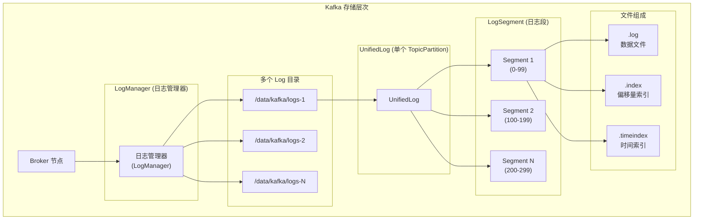
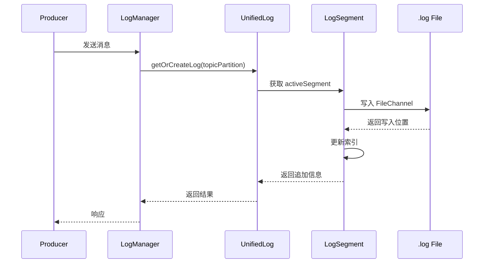
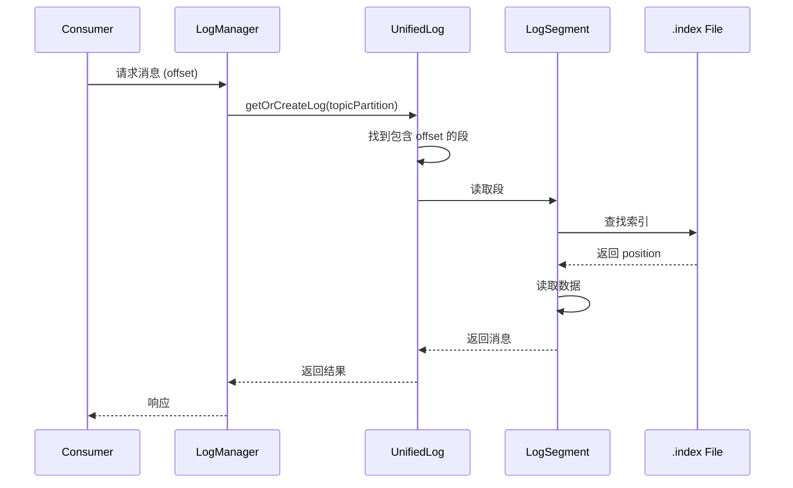
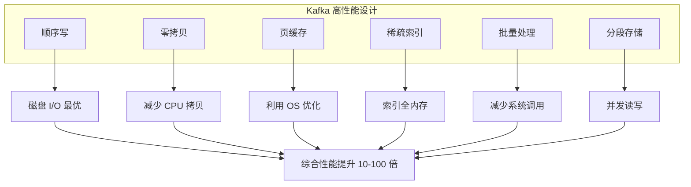

# Kafka 日志存储概述

## 目录
- [1. 存储架构概览](#1-存储架构概览)
- [2. 核心组件关系](#2-核心组件关系)
- [3. 日志目录结构](#3-日志目录结构)
- [4. 存储架构对比](#4-存储架构对比)
- [5. 设计哲学](#5-设计哲学)
- [6. 实战示例](#6-实战示例)

---

## 1. 存储架构概览

### 1.1 Kafka 存储层次

Kafka 采用分层存储架构，从 Broker 到文件系统形成完整的存储层次。



**层次说明**:

1. **Broker 层**：Kafka Broker 节点，管理多个日志目录
2. **LogManager 层**：负责所有日志的创建、删除、恢复
3. **Log 目录层**：可配置多个磁盘目录，分散存储压力
4. **UnifiedLog 层**：单个 Topic-Partition 的完整日志
5. **LogSegment 层**：日志段，日志的基本存储单位
6. **文件层**：实际存储的数据文件和索引文件

### 1.2 多目录存储设计

Kafka 支持配置多个日志目录，实现跨磁盘存储：

```properties
# server.properties
log.dirs=/data/kafka/logs-1,/data/kafka/logs-2,/data/kafka/logs-3
```

**设计优势**：

- **负载均衡**：分散磁盘 I/O 压力
- **容量扩展**：突破单盘容量限制
- **故障隔离**：单盘故障不影响其他数据

**目录分配策略**：

```java
// LogManager 伪代码
class LogManager {
    private List<File> logDirs;

    // 选择目录的策略
    File selectDirectory(TopicPartition tp) {
        // 1. 计算 partition hash
        int hash = Math.abs(tp.hashCode());

        // 2. 模运算选择目录
        int index = hash % logDirs.size();

        // 3. 返回目录
        return logDirs.get(index);
    }
}
```

**实战建议**：

```bash
# 查看目录使用情况
ls -lh /data/kafka/logs-*/

# 监控目录磁盘使用
df -h /data/kafka/logs-*

# 目录迁移操作
kafka-reassign-partitions.sh \
  --bootstrap-server localhost:9092 \
  --reassignment-json-file move-plan.json
```

---

## 2. 核心组件关系

### 2.1 组件层次结构

```
LogManager (日志管理器)
  │
  ├── 职责:
  │   ├── 管理所有 UnifiedLog
  │   ├── 日志的创建、删除、恢复
  │   ├── 日志清理调度
  │   └── 检查点管理
  │
  ├── 管理: 多个 UnifiedLog
  │   ├── 每个 UnifiedLog 对应一个 TopicPartition
  │   ├── 例如: my-topic-0, my-topic-1
  │   └── 委托: 实际读写操作给 LogSegment
  │
  └── 配置:
      ├── log.dirs: 日志目录列表
      ├── num.partitions: 默认分区数
      └── log.retention.*: 保留策略

UnifiedLog (统一日志)
  │
  ├── 职责:
  │   ├── 管理: 多个 LogSegment
  │   ├── 日志段的滚动、合并
  │   ├── 提供: 读写接口
  │   ├── 维护: 高水位标记
  │   └── 处理: 副本恢复
  │
  ├── 管理: 多个 LogSegment
  │   ├── 每段包含: .log, .index, .timeindex
  │   ├── 段内有序: offset 单调递增
  │   └── 段间独立: 不同段的读写不冲突
  │
  └── 核心方法:
      ├── append(): 追加消息
      ├── read(): 读取消息
      ├── truncate(): 截断日志
      └── roll(): 滚动新段

LogSegment (日志段)
  │
  ├── 职责:
  │   ├── 存储实际消息数据
  │   ├── 维护索引信息
  │   ├── 提供段内读写
  │   └── 支持段内查找
  │
  ├── 组成: 文件 + 索引
  │   ├── .log: 实际消息数据
  │   ├── .index: 偏移量稀疏索引
  │   └── .timeindex: 时间索引
  │
  └── 特性:
      ├── 不可变: 写满后不再修改
      ├── 独立索引: 每个段有自己的索引
      └── 滚动机制: 达到限制后创建新段
```

### 2.2 核心类关系图

```scala
// 核心类的简化定义

// LogManager: 日志管理器
class LogManager(
    logDirs: Seq[File],           // 日志目录列表
    config: KafkaConfig,          // 配置
    initialBrokerId: Int          // Broker ID
) {
    // 所有 TopicPartition -> UnifiedLog 的映射
    private val logs = new ConcurrentMap[TopicPartition, UnifiedLog]()

    // 创建或获取 Log
    def getOrCreateLog(topicPartition: TopicPartition): UnifiedLog = {
        logs.computeIfAbsent(topicPartition, tp => createLog(tp))
    }

    // 创建新 Log
    private def createLog(tp: TopicPartition): UnifiedLog = {
        val logDir = selectLogDir(tp)
        UnifiedLog(
            dir = logDir,
            config = config,
            recoveryPoint = loadRecoveryPoint(tp)
        )
    }
}

// UnifiedLog: 统一日志
class UnifiedLog(
    dir: File,                    // 日志目录
    config: LogConfig,            // 日志配置
    recoveryPoint: Long           // 恢复点偏移量
) {
    // 所有段: baseOffset -> LogSegment
    private val segments = new ConcurrentSkipListMap[Long, LogSegment]()

    // 活跃段: 当前写入的段
    private val activeSegment: LogSegment

    // 追加消息
    def append(records: MemoryRecords): LogAppendInfo = {
        // 1. 检查是否需要滚动
        maybeRoll()

        // 2. 追加到活跃段
        activeSegment.append(records)
    }

    // 读取消息
    def read(startOffset: Long, maxLength: Int): FetchDataInfo = {
        // 1. 找到包含 offset 的段
        val segment = segments.floorSegment(startOffset)

        // 2. 从段中读取
        segment.read(startOffset, maxLength)
    }
}

// LogSegment: 日志段
class LogSegment(
    log: FileRecords,             // .log 文件
    offsetIndex: OffsetIndex,     // .index 文件
    timeIndex: TimeIndex,         // .timeindex 文件
    baseOffset: Long              // 起始偏移量
) {
    // 追加到段
    def append(records: MemoryRecords): LogAppendInfo = {
        // 1. 写入 .log 文件
        log.append(records)

        // 2. 更新索引
        updateIndexes(records)
    }

    // 从段读取
    def read(startOffset: Long, maxSize: Int): FetchDataInfo = {
        // 1. 查找索引
        val position = offsetIndex.lookup(startOffset)

        // 2. 读取数据
        log.read(position, maxSize)
    }
}
```

### 2.3 组件交互流程

**写入流程**:



**读取流程**:



---

## 3. 日志目录结构

### 3.1 完整目录结构

```
/data/kafka/logs/
├── meta.properties                    # 元数据属性
│   ├── version=1                     # 版本号
│   ├── broker.id=0                   # Broker ID
│   └── cluster.id=xxx                # 集群 ID
│
├── __cluster_metadata-0               # 元数据 Topic (KRaft 模式)
│   ├── 00000000000000000000.log       # 数据文件
│   ├── 00000000000000000000.index     # 偏移量索引
│   ├── 00000000000000000000.timeindex # 时间索引
│   └── leader-epoch-checkpoint        # Leader Epoch 检查点
│
├── my-topic-0                         # 用户 Topic: my-topic, 分区 0
│   ├── 00000000000000000000.log       # 第 1 个段 (offset 0-99)
│   ├── 00000000000000000000.index
│   ├── 00000000000000000000.timeindex
│   │
│   ├── 00000000000000000100.log       # 第 2 个段 (offset 100-199)
│   ├── 00000000000000000100.index
│   ├── 00000000000000000100.timeindex
│   │
│   ├── 00000000000000000200.log       # 第 3 个段 (offset 200-299)
│   ├── 00000000000000000200.index
│   ├── 00000000000000000200.timeindex
│   │
│   ├── leader-epoch-checkpoint        # Leader Epoch 检查点
│   ├── partition.metadata             # 分区元数据
│   └── .swap                          # 临时文件 (正在创建时)
│
├── my-topic-1                         # 同一 Topic 的分区 1
│   └── (结构同上)
│
├── cleaner-offset-checkpoint          # 日志清理检查点
├── recovery-point-offset-checkpoint   # 恢复点检查点
└── log-start-offset-checkpoint        # 日志起始偏移量检查点
```

### 3.2 文件说明

#### meta.properties

```properties
# Broker 元数据
version=1
broker.id=0
cluster.id=Vj6nX3j-QQCGl2xvRx8W5g
```

**作用**：标识这个日志目录属于哪个 Broker

#### partition.metadata

```json
{
  "version": 1,
  "topic": "my-topic",
  "partition": 0,
  "replicas": [0, 1, 2],
  "isr": [0, 1, 2],
  "adding_replicas": [],
  "removing_replicas": []
}
```

**作用**：记录分区的副本分配信息

#### leader-epoch-checkpoint

```
# 格式: epoch -> startOffset
0 0
1 100
2 250
```

**作用**：记录 Leader Epoch 和对应的起始 Offset，用于日志截断和数据一致性

### 3.3 实战: 目录结构分析

```bash
# 1. 查看目录结构
tree -L 2 /data/kafka/logs/

# 2. 查看某个 Topic 的段文件
ls -lh /data/kafka/logs/my-topic-0/

# 输出示例:
# total 1.1G
# -rw-r--r-- 1 kafka kafka 1.0G Mar  1 10:00 00000000000000000000.log
# -rw-r--r-- 1 kafka kafka 1.2M Mar  1 10:00 00000000000000000000.index
# -rw-r--r-- 1 kafka kafka 1.2M Mar  1 10:00 00000000000000000000.timeindex
# -rw-r--r-- 1 kafka kafka 1.0G Mar  1 11:00 00000000000000001000.log
# -rw-r--r-- 1 kafka kafka 1.2M Mar  1 11:00 00000000000000001000.index
# -rw-r--r-- 1 kafka kafka 1.2M Mar  1 11:00 00000000000000001000.timeindex

# 3. 分析段大小分布
du -sh /data/kafka/logs/*/* | sort -h | tail -20

# 4. 查找大段文件
find /data/kafka/logs/ -name "*.log" -size +100M -exec ls -lh {} \;

# 5. 检查索引文件
kafka-dump-log.sh \
  --files /data/kafka/logs/my-topic-0/00000000000000000000.log \
  --print-data-log | head -20
```

### 3.4 实战: 目录迁移

```bash
# 场景: 将分区从磁盘 A 迁移到磁盘 B

# 1. 创建迁移计划
cat > move-plan.json <<EOF
{
  "version": 1,
  "partitions": [
    {
      "topic": "my-topic",
      "partition": 0,
      "replicas": [1, 2, 3],
      "log_dirs": ["path2", "path2", "path2"]
    }
  ]
}
EOF

# 2. 生成迁移计划
kafka-reassign-partitions.sh \
  --bootstrap-server localhost:9092 \
  --topics-to-move-json-file topics-to-move.json \
  --broker-list "1,2,3" \
  --generate

# 3. 执行迁移
kafka-reassign-partitions.sh \
  --bootstrap-server localhost:9092 \
  --reassignment-json-file move-plan.json \
  --execute

# 4. 验证迁移
kafka-reassign-partitions.sh \
  --bootstrap-server localhost:9092 \
  --reassignment-json-file move-plan.json \
  --verify
```

---

## 4. 存储架构对比

### 4.1 Kafka vs 传统消息队列

| 特性 | Kafka | RabbitMQ | ActiveMQ | RocketMQ |
|-----|-------|----------|----------|----------|
| **存储方式** | 磁盘顺序写 | 内存+磁盘 | 内存+磁盘 | 磁盘+内存 |
| **消息持久化** | 全量持久化 | 可选 | 可选 | 全量持久化 |
| **吞吐量** | 极高 (100K+ msg/s) | 中等 (1K+ msg/s) | 中等 (1K+ msg/s) | 高 (10K+ msg/s) |
| **消息追溯** | 支持历史回溯 | 不支持 | 不支持 | 支持有限 |
| **存储容量** | TB 级别 | GB 级别 | GB 级别 | TB 级别 |
| **运维成本** | 低 | 中 | 中 | 中 |

### 4.2 Kafka vs 数据库

| 特性 | Kafka | MySQL | MongoDB |
|-----|-------|-------|---------|
| **数据模型** | Append-only Log | B+Tree | B-Tree |
| **写入性能** | 极高 (顺序写) | 中等 (随机写) | 中等 (随机写) |
| **读取性能** | 顺序读极快 | 支持索引查询 | 支持索引查询 |
| **数据修改** | 不可变 (追加) | 可更新 | 可更新 |
| **数据删除** | 段删除/压缩 | 行删除 | 文档删除 |
| **适用场景** | 日志、事件流 | 事务数据 | 文档数据 |

### 4.3 为什么 Kafka 快？



**性能对比实例**:

```
场景: 100 万条消息 (每条 1KB)

传统方案:
- 随机写: ~100 IOPS → 需要约 2.8 小时
- 数据库插入: ~10K ops/s → 需要约 100 秒

Kafka:
- 顺序写: ~100 MB/s → 需要约 10 秒
- 批量写: ~500 MB/s → 需要约 2 秒

性能提升: 50-1400 倍
```

---

## 5. 设计哲学

### 5.1 核心设计原则

#### 1. 简单性

**设计思想**：简单的结构往往更可靠

```java
// Kafka 的核心数据结构非常简单

// 消息就是追加到文件的字节数组
public void append(byte[] message) {
    file.write(message);
}

// 查找就是二分查找 + 顺序扫描
public Message find(long offset) {
    position = binarySearch(offset);  // 二分索引
    return scan(position, offset);     // 顺序扫描
}
```

**优势**：
- 易于理解和维护
- 减少边界情况
- 降低故障率

#### 2. 顺序性

**设计思想**：顺序操作比随机操作快得多

```
磁盘性能对比:
- 顺序读: ~100-500 MB/s
- 随机读 (HDD): ~100 IOPS (~0.4 MB/s)
- 随机读 (SSD): ~10K IOPS (~40 MB/s)

性能差异: 2-1000 倍
```

**Kafka 实现**:
- 所有写入都是追加操作
- 所有读取尽量顺序进行
- 避免随机访问

#### 3. 批量性

**设计思想**：批量处理减少开销

```java
// 单条处理
for (Message msg : messages) {
    send(msg);  // 1 次系统调用
}

// 批量处理
List<Message> batch = new ArrayList<>();
for (Message msg : messages) {
    batch.add(msg);
    if (batch.size() >= BATCH_SIZE) {
        send(batch);  // N 条消息 1 次系统调用
    }
}
```

**效果**：
- 减少系统调用次数
- 减少网络往返
- 提高吞吐量

#### 4. 不可变性

**设计思想**：不可变数据更易管理

```java
// 传统方案: 可变数据
update(key, value);  // 需要锁、事务、回滚

// Kafka: 追加数据
append(key, value);  // 不需要锁，不需要回滚
```

**优势**：
- 并发读不需要锁
- 不需要事务
- 易于缓存
- 故障恢复简单

### 5.2 权衡与取舍

#### 吞吐量 vs 延迟

```
高吞吐量配置:
- batch.size=1MB
- linger.ms=100
- compression.type=lz4
→ 吞吐量: 500 MB/s, 延迟: 100-200 ms

低延迟配置:
- batch.size=1KB
- linger.ms=0
- compression.type=none
→ 吞吐量: 50 MB/s, 延迟: 1-5 ms
```

#### 可靠性 vs 性能

```
高可靠性配置:
- acks=all
- replication.factor=3
- min.insync.replicas=2
- log.flush.interval.messages=1
→ 性能: 100 MB/s, 可靠性: 极高

高性能配置:
- acks=1
- replication.factor=2
- min.insync.replicas=1
- log.flush.interval.messages=10000
→ 性能: 500 MB/s, 可靠性: 中等
```

#### 存储成本 vs 查询效率

```
低成本存储:
- log.segment.bytes=1GB
- log.retention.hours=168
- cleanup.policy=delete
→ 成本: 低, 查询: 粗粒度

高查询效率:
- log.segment.bytes=100MB
- log.retention.hours=720
- cleanup.policy=compact
→ 成本: 高, 查询: 细粒度
```

---

## 6. 实战示例

### 6.1 场景 1：高吞吐量日志收集

**需求**：收集应用日志，每秒 10 万条消息

**配置方案**：

```properties
# Broker 配置
num.network.threads=8
num.io.threads=16
log.dirs=/data1/kafka,/data2/kafka,/data3/kafka
log.segment.bytes=1073741824        # 1GB 段大小
log.retention.hours=168              # 7天保留
log.flush.interval.messages=10000    # 批量刷盘
log.flush.interval.ms=1000           # 1秒刷盘
compression.type=lz4                 # LZ4 压缩

# Producer 配置
batch.size=32768                     # 32KB 批次
linger.ms=10                         # 10ms 等待
acks=1                               # Leader 确认
compression.type=lz4
buffer.memory=67108864               # 64MB 缓冲
max.block.ms=60000                   # 60秒阻塞
```

**预期性能**：
- 吞吐量: 500 MB/s
- P99 延迟: 50 ms
- 磁盘使用: ~300 GB/天

### 6.2 场景 2: 精确一次语义

**需求**： 金融交易数据，不能丢失也不能重复

**配置方案**：

```properties
# Broker 配置
log.flush.interval.messages=1        # 每条消息刷盘
log.flush.interval.ms=0              # 立即刷盘
num.replica.fetchers=4
replica.high.watermark.checkpoint.interval.ms=5

# Producer 配置
enable.idempotence=true              # 幂等性
acks=all                             # ISR 全部确认
max.in.flight.requests.per.connection=5
retries=2147483647                   # 无限重试

# Transaction 配置
transactional.id=tx-producer-1
transaction.timeout.ms=90000         # 90秒超时
enable.auto.commit=false             # 手动提交
isolation.level=read_committed       # 读取已提交
```

**预期性能**：
- 吞吐量: 50 MB/s
- P99 延迟: 200 ms
- 可靠性: 精确一次

### 6.3 场景 3: 紧凑型 Topic (状态存储)

**需求**： 存储用户最新状态，如用户资料

**配置方案**：

```properties
# Topic 配置
cleanup.policy=compact               # 压缩策略
segment.bytes=1073741824             # 1GB 段
min.cleanable.dirty.ratio=0.5        # 50% 脏数据触发清理
min.compaction.lag.ms=60000          # 60秒后才能压缩
delete.retention.ms=86400000         # 保留删除记录 1天

# Consumer 配置
isolation.level=read_committed       # 只读已提交
max.poll.records=500
enable.auto.commit=true
auto.commit.interval.ms=5000
```

**预期效果**：
- 每个用户只保留最新状态
- 自动清理旧数据
- 存储空间可控

### 6.4 监控命令

```bash
# 1. 查看 Log 概况
kafka-log-dirs.sh \
  --bootstrap-server localhost:9092 \
  --describe \
  --topic-list my-topic

# 2. 查看 Segment 信息
kafka-dump-log.sh \
  --files /data/kafka/logs/my-topic-0/00000000000000000000.log \
  --print-data-log

# 3. 分析索引
kafka-dump-log.sh \
  --files /data/kafka/logs/my-topic-0/00000000000000000000.index \
  --verify-index

# 4. 监控磁盘使用
du -sh /data/kafka/logs/*/ \
  | sort -h \
  | tail -20

# 5. 检查日志健康
kafka-run-class.sh kafka.tools.LogCleanerIntegrationTest \
  --log-dirs /data/kafka/logs \
  --topics my-topic
```

---

## 7. 总结

### 7.1 核心要点

| 要点 | 说明 |
|-----|------|
| **分层架构** | LogManager → UnifiedLog → LogSegment → File |
| **顺序写** | 始终追加到文件末尾，避免随机写 |
| **分段存储** | 分段管理，支持快速删除和并发读写 |
| **稀疏索引** | 不是每条消息都索引，减少索引大小 |
| **多目录** | 支持跨磁盘存储，负载均衡 |
| **不可变** | 写入后不再修改，简化并发控制 |

### 7.2 设计亮点

1. **简单高效**: 简单的数据结构 + 高效的算法
2. **顺序优先**: 所有操作尽量顺序进行
3. **批量优化**: 批量读写减少开销
4. **系统优化**: 充分利用 OS 特性 (页缓存、零拷贝)
5. **实用主义**: 权衡性能、可靠性、成本

### 7.3 实战建议

| 场景 | 建议 |
|-----|------|
| **日志收集** | 大段 (1GB) + Delete 策略 |
| **状态存储** | 中段 (500MB) + Compact 策略 |
| **实时计算** | 小段 (100MB) + 短保留 |
| **高可靠** | 多副本 + 强刷盘 + Ack=all |
| **高吞吐** | 多目录 + 批量 + 压缩 |

---

**下一章**: [02. LogSegment 结构](./02-log-segment.md)
