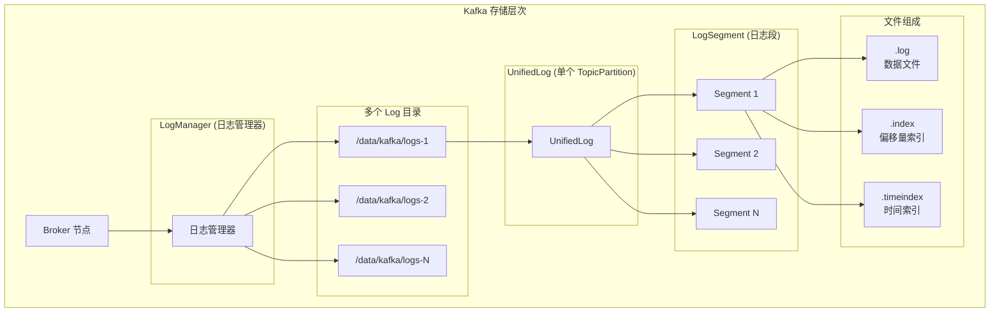
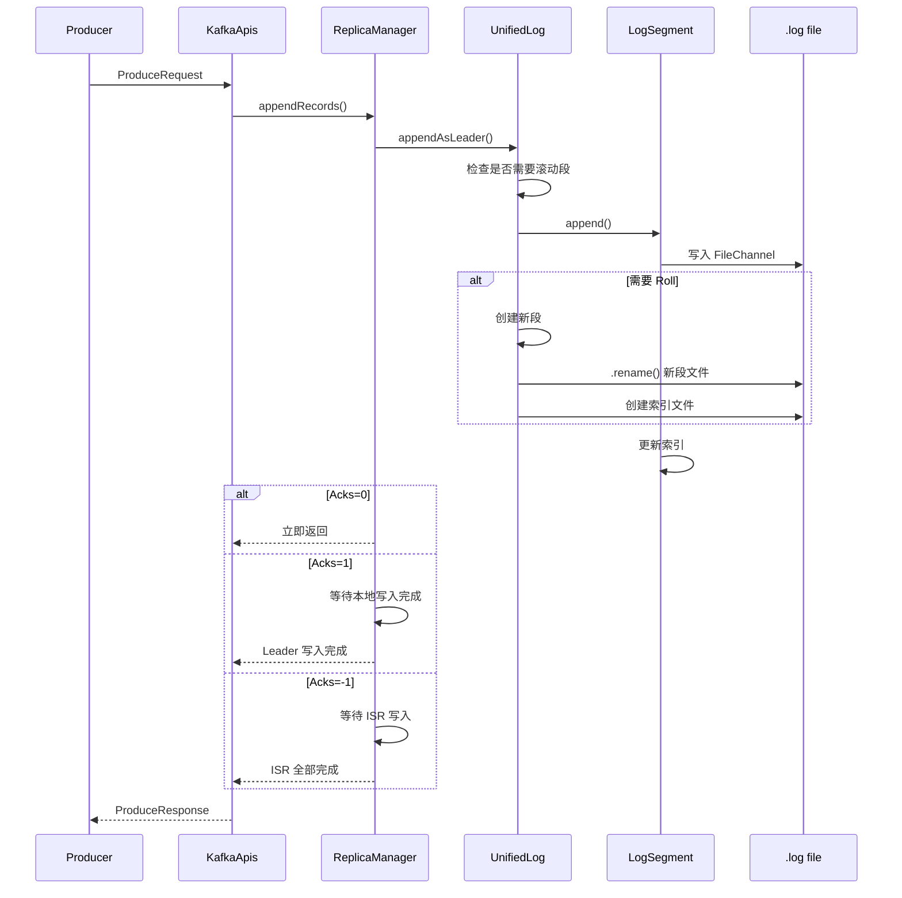
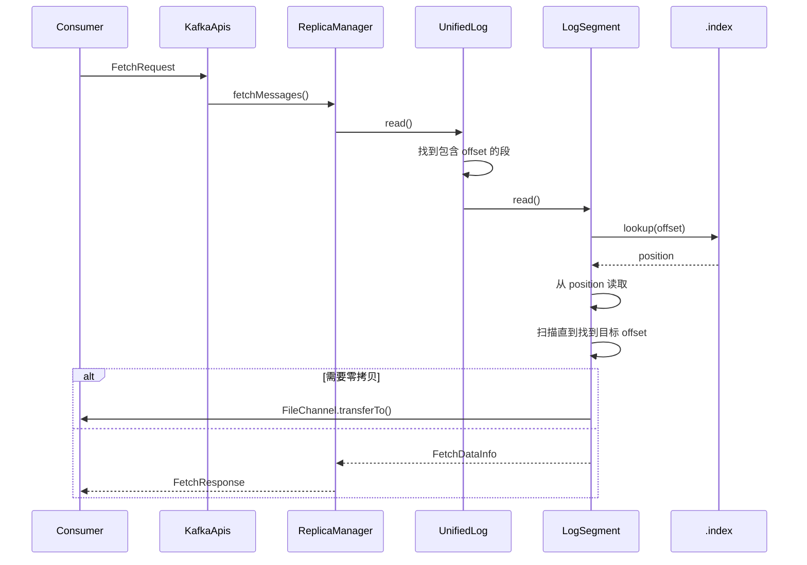

# Kafka 日志存储机制深度解析

## 目录
- [1. 存储架构概览](#1-存储架构概览)
- [2. 日志文件结构](#2-日志文件结构)
- [3. 索引机制](#3-索引机制)
- [4. 写入流程](#4-写入流程)
- [5. 读取流程](#5-读取流程)
- [6. 日志清理](#6-日志清理)
- [7. 核心设计亮点](#7-核心设计亮点)

---

## 1. 存储架构概览

### 1.1 Kafka 存储层次



### 1.2 核心组件关系

```
LogManager (日志管理器)
  └── 管理: 多个 UnifiedLog
       ├── 每个 UnifiedLog 对应一个 TopicPartition
       ├── 负责: 日志的创建、删除、恢复
       └── 委托: 实际读写操作给 LogSegment

UnifiedLog (统一日志)
  └── 管理: 多个 LogSegment
       ├── 每段包含: .log, .index, .timeindex
       ├── 负责: 日志段的滚动、合并
       └── 提供: 读写接口

LogSegment (日志段)
  └── 组成: 文件 + 索引
       ├── .log: 实际消息数据
       ├── .index: 偏移量稀疏索引
       └── .timeindex: 时间索引
```

### 1.3 日志目录结构

```
/data/kafka/logs/
├── meta.properties                    # 元数据属性
├── __cluster_metadata-0               # 元数据 Topic
│   ├── 00000000000000000000.log
│   ├── 00000000000000000000.index
│   ├── 00000000000000000000.timeindex
│   └── leader-epoch-checkpoint
│
├── my-topic-0                         # 用户 Topic
│   ├── 00000000000000000000.log       # 第一个段
│   ├── 00000000000000000000.index
│   ├── 00000000000000000000.timeindex
│   ├── 00000000000000000100.log       # 第二个段 (从 offset 100 开始)
│   ├── 00000000000000000100.index
│   ├── 00000000000000000100.timeindex
│   ├── leader-epoch-checkpoint
│   └── partition.metadata
│
├── cleaner-offset-checkpoint          # 清理器检查点
├── recovery-point-offset-checkpoint   # 恢复点检查点
└── log-start-offset-checkpoint        # 日志起始偏移量检查点
```

---

## 2. 日志文件结构

### 2.1 LogSegment 结构

```java
/**
 * LogSegment - 日志段，日志的基本存储单位
 *
 * 设计思想:
 * 1. 段内有序: offset 单调递增
 * 2. 不可变: 写满后不再修改
 * 3. 独立索引: 每个段有自己的索引文件
 * 4. 滚动机制: 达到大小或时间限制后创建新段
 */
public class LogSegment {
    // ========== 核心组件 ==========

    // 1. 日志文件: 实际存储消息
    private final Log log;

    // 2. 偏移量索引: offset -> position 映射
    private final OffsetIndex offsetIndex;

    // 3. 时间索引: timestamp -> offset 映射
    private final TimeIndex timeIndex;

    // 4. 事务索引: 事务相关消息索引
    private final TransactionIndex txnIndex;

    // 5. 起始偏移量: 该段的第一个消息 offset
    private final long baseOffset;

    // 6. 索引间隔: 每隔多少字节创建一个索引项
    private final int indexIntervalBytes;

    // 7. 滚滚参数
    private final rollJitterMs;
    private final long maxSegmentMs;
    private final long maxSegmentBytes;
}
```

### 2.2 消息格式

```scala
/**
 * Record Batch - Kafka 消息批次 (v2 格式)
 *
 * 设计亮点: 批量处理减少开销
 */
┌──────────────────────────────────────────────────────────────┐
│ Record Batch                                                  │
├──────────────────────────────────────────────────────────────┤
│                                                               │
│ ┌──────────────┐  ┌──────────────┐  ┌──────────────┐        │
│ │ BASE OFFSET  │  │ BATCH LENGTH │  │ PARTITION LEADER│ ... │
│ │   (8 bytes)  │  │  (4 bytes)   │  │  EPOCH (4 bytes)│    │
│ └──────────────┘  └──────────────┘  └──────────────┘        │
│                                                               │
│ ┌─────────────────────────────────────────────────────────┐  │
│ │                RECORDS                                 │  │
│ │  ┌─────────┐  ┌─────────┐  ┌─────────┐  ┌─────────┐   │  │
│ │  │ Record1 │  │ Record2 │  │ Record3 │  │ ...     │   │  │
│ │  └─────────┘  └─────────┘  └─────────┘  └─────────┘   │  │
│ └─────────────────────────────────────────────────────────┘  │
│                                                               │
│ ┌──────────────┐  ┌──────────────┐  ┌──────────────┐        │
│ │ CRC (4 bytes)│  │ ATTRIBUTES   │  │ TIMESTAMP    │        │
│ └──────────────┘  └──────────────┘  └──────────────┘        │
└──────────────────────────────────────────────────────────────┘

/**
 * 单个 Record 结构
 */
┌─────────────────────────────────────────┐
│ Record                                   │
├─────────────────────────────────────────┤
│ ┌─────────┐  ┌─────────┐  ┌─────────┐  │
│ │ LENGTH  │  │ ATTRIBS │  │ TIMESTAMP│ │
│ │ (Varint)│  │ (Varint)│  │ (8 bytes)│ │
│ └─────────┘  └─────────┘  └─────────┘  │
│ ┌─────────┐  ┌─────────┐  ┌─────────┐  │
│ │ KEY     │  │ VALUE   │  │ HEADERS │ │
│ │ (Bytes) │  │ (Bytes) │  │ (Bytes) │ │
│ └─────────┘  └─────────┘  └─────────┘  │
└─────────────────────────────────────────┘
```

### 2.3 文件命名规则

```
文件命名格式: ${起始偏移量}.${扩展名}

例如:
00000000000000000000.log  → 从 offset 0 开始
00000000000000000100.log  → 从 offset 100 开始
00000000000000002000.log  → 从 offset 2000 开始

设计亮点:
1. 零填充: 固定20位，确保排序正确
2. 起始偏移: 文件名即段的起始 offset
3. 顺序排列: 便于范围查找
```

---

## 3. 索引机制

### 3.1 偏移量索引 (.index)

```java
/**
 * OffsetIndex - 偏移量稀疏索引
 *
 * 核心思想:
 * 1. 稀疏索引: 不是每个消息都索引，节省空间
 * 2. 内存映射: 使用 MMap 避免拷贝
 * 3. 有序存储: 支持二分查找
 */
public class OffsetIndex extends AbstractIndex {
    // ========== 索引项结构 ==========
    // 每个索引项占用 8 字节:
    // - offset (4 bytes): 相对偏移量
    // - position (4 bytes): 在 .log 文件中的物理位置

    /**
     * 索引文件格式:
     * ┌────────────────────────────────────────────┐
     * │ Entry 1 │ Entry 2 │ Entry 3 │ ... │ Entry N │
     * ├─────────┼─────────┼─────────┼─────┼─────────┤
     * │ offset  │ offset  │ offset  │     │ offset  │
     * │ position│ position│ position│     │ position│
     * │ (4+4)   │ (4+4)   │ (4+4)   │     │ (4+4)   │
     * └─────────┴─────────┴─────────┴─────┴─────────┘
     *
     * 示例 (假设索引间隔为 4KB):
     * ┌──────────┬──────────┐
     * │ offset   │ position │
     * ├──────────┼──────────┤
     * │ 100      │ 0        │ ← 第1个索引项
     * │ 200      │ 4096     │ ← 第2个索引项 (间隔 4KB)
     * │ 300      │ 8192     │ ← 第3个索引项
     * │ 400      │ 12288    │ ← 第4个索引项
     * │ ...      │ ...      │
     * └──────────┴──────────┘
     */

    /**
     * 查找算法:
     * 1. 二分查找索引: 找到 <= target 的最大索引项
     * 2. 顺序扫描: 从索引位置开始，顺序查找目标 offset
     */
    public PositionEntry lookup(long targetOffset) {
        // 步骤1: 二分查找索引
        // 找到最后一个 <= targetOffset 的索引项
        int slot = indexSlotFor(targetOffset, IndexSearchType.KEY);

        if (slot == -1) {
            // 没找到，返回第一个位置
            return new PositionEntry(baseOffset, 0);
        }

        // 步骤2: 获取索引项对应的物理位置
        IndexEntry entry = entry(slot);

        // 步骤3: 返回位置，后续会从这个位置开始顺序扫描
        return new PositionEntry(entry.offset + baseOffset, entry.position);
    }
}
```

**稀疏索引的优势:**

```
传统稠密索引 vs Kafka 稀疏索引:

┌──────────────────────────────────────────────────────────────┐
│ 稠密索引 (每个消息都索引)                                      │
├──────────────────────────────────────────────────────────────┤
│  100 → 0, 101 → 20, 102 → 45, 103 → 70, ..., 200 → 4096     │
│  ↑ 索引文件大小 ≈ 数据文件大小 (内存无法全部加载)               │
└──────────────────────────────────────────────────────────────┘

┌──────────────────────────────────────────────────────────────┐
│ Kafka 稀疏索引 (每隔 4KB 索引一次)                            │
├──────────────────────────────────────────────────────────────┤
│  100 → 0, 200 → 4096, 300 → 8192, ...                       │
│  ↑ 索引文件大小 ≈ 数据文件大小 / 4KB (可以全部加载到内存)       │
└──────────────────────────────────────────────────────────────┘

查找 offset=250 的过程:
1. 二分索引: 找到 200 → 4096 (O(log N))
2. 从 position 4096 开始顺序扫描: 201, 202, ..., 250 (O(距离))
3. 找到目标 (通常几十到几百条记录)

平均查找时间: O(log N) + O(avg distance)
```

### 3.2 时间索引 (.timeindex)

```java
/**
 * TimeIndex - 时间戳索引
 *
 * 用途: 根据时间戳查找消息位置
 * 场景:
 * - 按时间消费 (offsetsForTime)
 * - 日志清理 (删除旧数据)
 */
public class TimeIndex extends AbstractIndex {
    /**
     * 索引项结构:
     * ┌──────────────┬──────────────┐
     * │ timestamp    │ offset       │
     * │ (8 bytes)    │ (8 bytes)    │
     * ├──────────────┼──────────────┤
     * │ 1640000000000│ 100          │
     * │ 1640000100000│ 200          │
     * │ 1640000200000│ 300          │
     * │ ...          │ ...          │
     * └──────────────┴──────────────┘
     */

    /**
     * 查找算法: 根据时间戳查找 offset
     * 1. 二分查找: 找到 <= targetTimestamp 的最大索引项
     * 2. 返回 offset
     */
    public long lookup(long targetTimestamp) {
        int slot = indexSlotFor(targetTimestamp, IndexSearchType.TIMESTAMP);

        if (slot == -1) {
            return baseOffset;
        }

        return entry(slot).offset + baseOffset;
    }
}
```

### 3.3 索引文件格式

```
.index 文件结构:
┌────────────────────────────────────────────────────────┐
│ Header (40 bytes)                                      │
│ ├─ version (4 bytes)     │ 当前版本: 1                  │
│ ├─ append offset (8 bytes)│ 最后追加的 offset            │
│ └─ ...                                                  │
├────────────────────────────────────────────────────────┤
│ Entries (variable length)                               │
│ ┌───────────────────────────────────────────────┐      │
│ │ Entry 1: offset (4 bytes) | position (4 bytes)│      │
│ ├───────────────────────────────────────────────┤      │
│ │ Entry 2: offset (4 bytes) | position (4 bytes)│      │
│ ├───────────────────────────────────────────────┤      │
│ │ ...                                             │      │
│ └───────────────────────────────────────────────┘      │
└────────────────────────────────────────────────────────┘

设计亮点:
1. 固定长度索引项: 简化内存布局
2. 内存映射: 使用 MMap 实现零拷贝读取
3. 有序存储: 支持高效二分查找
```

---

## 4. 写入流程

### 4.1 写入流程图



### 4.2 核心写入代码分析

```java
/**
 * UnifiedLog.append() - 核心写入方法
 *
 * 设计亮点:
 * 1. 批量写入: 一次写入多个 Record
 * 2. 顺序写入: 追加到文件末尾
 * 3. 批量刷盘: 控制刷盘频率
 */
public LogAppendInfo appendAsLeader(
    Records records,
    AppendOrigin origin
) {
    // ========== 步骤1: 参数验证 ==========
    if (records == null || records.sizeInBytes() == 0) {
        throw new IllegalArgumentException("Cannot append empty records");
    }

    // ========== 步骤2: 检查是否需要滚动段 ==========
    // 滚动条件:
    // 1. 当前段大小 >= maxSegmentBytes
    // 2. 时间超过 maxSegmentMs
    // 3. 索引满了
    maybeRoll(timestamp = records.maxTimestamp());

    // ========== 步骤3: 写入当前段 ==========
    LogSegment activeSegment = activeSegment();

    // 步骤3.1: 写入 .log 文件
    LogAppendInfo appendInfo = activeSegment.append(
        largestOffset = lastOffset,
        largestTimestamp = records.maxTimestamp(),
        shallowOffsetOfMaxTimestamp = shallowOffsetOfMaxTimestamp,
        records = records
    );

    // 步骤3.2: 更新索引
    if (appendInfo.numMessages > 0) {
        // 检查是否需要添加新索引项
        // 条件: 距离上一个索引项的字节数 >= indexIntervalBytes
        if (bytesSinceLastIndexEntry >= indexIntervalBytes) {
            activeSegment.index().append(
                targetOffset = lastOffset,
                position = activeSegment.log().size()
            );
        }
    }

    // ========== 步骤4: 更新统计信息 ==========
    updateLogStartOffset();
    updateLogEndOffset();

    return appendInfo;
}

/**
 * LogSegment.append() - 段内追加
 */
public LogAppendInfo append(
    long largestOffset,
    long largestTimestamp,
    long shallowOffsetOfMaxTimestamp,
    MemoryRecords records
) {
    // ========== 步骤1: 检查 offset 顺序 ==========
    if (largestOffset <= baseOffset) {
        throw new IllegalArgumentException(
            "Offset must be greater than base offset: " + baseOffset
        );
    }

    // ========== 步骤2: 写入 FileRecords ==========
    int written = log.append(records);

    // ========== 步骤3: 更新段信息 ==========
    if (largestOffset > nextOffsetMetadata()) {
        nextOffsetMetadata = new LogOffsetMetadata(
            offset = largestOffset + 1,
            segmentBaseOffset = baseOffset,
            relativePositionInSegment = size()
        );
    }

    // ========== 步骤4: 更新时间索引 ==========
    if (largestTimestamp > maxTimestampSoFar) {
        maxTimestampSoFar = largestTimestamp;
        maxTimestampSoFarOffset = shallowOffsetOfMaxTimestamp;

        // 检查是否需要更新时间索引
        if (timeIndex.indexEntries() == 0 ||
            timeIndex.lastEntry().timestamp < largestTimestamp - segment.ms) {
            timeIndex.append(
                targetTimestamp = largestTimestamp,
                offset = largestOffset
            );
        }
    }

    return new LogAppendInfo(
        firstOffset = new LogOffsetMetadata(baseOffset, baseOffset, 0),
        lastOffset = nextOffsetMetadata(),
        numMessages = records.count(),
        appendedBytes = written
    );
}

/**
 * FileRecords.append() - 实际文件写入
 *
 * 设计亮点: 使用 FileChannel 实现高效写入
 */
public int append(MemoryRecords records) throws IOException {
    if (records.sizeInBytes() > Integer.MAX_VALUE - size.get())
        throw new IllegalArgumentException("Append of size " + records.sizeInBytes() +
                                         " bytes is too large for segment with current file position " + size.get());

    int written = 0;

    // ========== 步骤1: 写入数据 ==========
    // 使用 FileChannel.write()，零拷贝
    ByteBuffer[] buffers = records.bufferArray();
    int start = 0;
    while (start < buffers.length) {
        int bytesToWrite = Math.min(buffers.length - start, maxBytesToWriteAtOnce);
        // 使用 scatter-gather 写入
        written += channel.write(Arrays.copyOfRange(buffers, start, start + bytesToWrite));
        start += bytesToWrite;
    }

    // ========== 步骤2: 更新文件大小 ==========
    size.addAndGet(written);

    // ========== 步骤3: 根据配置决定是否刷盘 ==========
    // if (flushImmediate) {
    //     channel.force(true);  // fsync
    // }

    return written;
}
```

### 4.3 段滚动机制

```java
/**
 * 段滚动 (Roll Segment) - 创建新段
 *
 * 滚动条件:
 * 1. size >= maxSegmentBytes (默认 1GB)
 * 2. time >= maxSegmentMs (默认 7天)
 * 3. 索引满了 (Integer.MAX_VALUE 个索引项)
 */
private void maybeRoll(long expectedNextOffset) {
    // ========== 步骤1: 计算当前段大小 ==========
    LogSegment activeSegment = activeSegment();
    long size = activeSegment.size();

    // ========== 步骤2: 检查滚动条件 ==========
    boolean shouldRoll = false;

    // 条件1: 大小超限
    if (size >= maxSegmentBytes) {
        shouldRoll = true;
    }

    // 条件2: 时间超限
    if (maxSegmentMs > 0) {
        long timeSinceLastRoll = time.milliseconds() - activeSegment.rollTime();
        if (timeSinceLastRoll > maxSegmentMs) {
            shouldRoll = true;
        }
    }

    // 条件3: 索引满了
    if (activeSegment.index().isFull()) {
        shouldRoll = true;
    }

    // ========== 步骤3: 执行滚动 ==========
    if (shouldRoll) {
        roll(expectedNextOffset);
    }
}

/**
 * Roll - 创建新段
 */
private LogSegment roll(long nextOffset) {
    // ========== 步骤1: 创建新段文件名 ==========
    File newFile = new File(logDir, filenamePrefix + nextOffset + LogFileSuffix);

    // ========== 步骤2: 创建新 LogSegment ==========
    LogSegment newSegment = LogSegment.open(
        dir = logDir,
        baseOffset = nextOffset,
        config = segmentConfig,
        time = time,
        initFileSize = initFileSize,
        preallocate = preallocate
    );

    // ========== 步骤3: 关闭旧段 ==========
    LogSegment toClose = segments.last();
    if (toClose != null) {
        toClose.close();
    }

    // ========== 步骤4: 添加新段 ==========
    segments.append(newSegment);

    // ========== 步骤5: 更新活动段 ==========
    updateLogMetrics();

    return newSegment;
}
```

---

## 5. 读取流程

### 5.1 读取流程图



### 5.2 核心读取代码分析

```java
/**
 * UnifiedLog.read() - 读取日志
 *
 * 设计亮点:
 * 1. 段定位: 快速找到包含目标 offset 的段
 * 2. 索引查找: 稀疏索引 + 顺序扫描
 * 3. 零拷贝: 使用 FileChannel.transferTo
 */
public LogReadInfo read(
    long startOffset,
    int maxLength,
    long isolation,
    FetchIsolation fetchIsolation
) {
    // ========== 步骤1: 参数验证 ==========
    if (startOffset < logStartOffset()) {
        throw new OffsetOutOfRangeException("Requested offset " + startOffset +
                                          " is less than log start offset " + logStartOffset());
    }

    // ========== 步骤2: 查找包含目标 offset 的段 ==========
    // 使用跳表 (ConcurrentSkipListMap) 快速定位
    LogSegment segment = segments.floorSegment(startOffset);
    if (segment == null) {
        return LogReadInfo.UNKNOWN;
    }

    // ========== 步骤3: 从段中读取 ==========
    FetchDataInfo fetchData = segment.read(
        startOffset = startOffset,
        maxSize = maxLength,
        fetchSize = accurateSizeForFetching(startOffset)
    );

    // ========== 步骤4: 构建 LogReadInfo ==========
    return new LogReadInfo(
        fetchData = fetchData,
        highWatermark = highWatermark(),
        leaderLogStartOffset = logStartOffset(),
        leaderLogEndOffset = logEndOffset()
    );
}

/**
 * LogSegment.read() - 段内读取
 */
public FetchDataInfo read(
    long startOffset,
    int maxSize,
    long position
) {
    // ========== 步骤1: 查找 offset 在索引中的位置 ==========
    if (startOffset < baseOffset) {
        throw new IllegalArgumentException("Offset " + startOffset +
                                         " is less than base offset " + baseOffset);
    }

    // 使用稀疏索引快速定位
    OffsetPosition offsetPosition = index.lookup(startOffset);

    // ========== 步骤2: 从索引位置开始顺序扫描 ==========
    FileRecords records = log.slice(offsetPosition.position, log.size());

    // ========== 步骤3: 扫描到目标 offset ==========
    // 注意: 索引是稀疏的，可能不包含目标 offset
    // 需要从索引位置开始顺序扫描
    LogOffsetPosition offsetPosition = translateOffset(
        startOffset,
        offsetPosition.position
    );

    // ========== 步骤4: 读取数据 ==========
    FileRecords.fetchRecords fetchRecords = records.fetchRecords(
        startOffset,
        maxSize,
        offsetPosition.position
    );

    return new FetchDataInfo(
        fetchOffsetMetadata = new LogOffsetMetadata(startOffset, baseOffset, position),
        records = fetchRecords,
        firstEntryIncomplete = false
    );
}

/**
 * 零拷贝读取 - FileChannel.transferTo
 *
 * 设计亮点: 直接从文件传输到 Socket，避免拷贝到用户空间
 */
public int readInto(
    long position,
    ByteBuffer buffer
) throws IOException {
    // ========== 步骤1: 转换为 FileChannel ==========
    FileChannel channel = fileChannel();

    // ========== 步骤2: 调用 transferTo ==========
    // 零拷贝: 数据直接从文件系统缓存传输到 Socket 缓冲区
    // 不需要经过应用程序的内存
    return channel.read(buffer, position);
}
```

### 5.3 索引查找详解

```java
/**
 * OffsetIndex.lookup() - 稀疏索引查找
 *
 * 算法: 二分查找 + 顺序扫描
 */
public PositionEntry lookup(long targetOffset) {
    // ========== 步骤1: 边界检查 ==========
    if (entries == 0 || targetOffset < firstEntry.offset) {
        return new PositionEntry(baseOffset, 0);
    }

    // ========== 步骤2: 二分查找索引 ==========
    // 找到最后一个 <= targetOffset 的索引项
    int slot = lowerSlot(targetOffset);

    // ========== 步骤3: 获取索引项 ==========
    IndexEntry entry = entry(slot);

    // ========== 步骤4: 构建返回结果 ==========
    return new PositionEntry(
        offset = baseOffset + entry.offset,
        position = entry.position
    );
}

/**
 * 二分查找实现
 */
private int lowerSlot(long targetOffset) {
    // 使用 C++ STL 风格的 lower_bound
    int lo = 0;
    int hi = entries - 1;

    while (lo < hi) {
        int mid = (lo + hi + 1) >>> 1;

        // 读取索引项
        long offset = readEntryOffset(mid);

        if (offset <= targetOffset) {
            lo = mid;
        } else {
            hi = mid - 1;
        }
    }

    return lo;
}
```

---

## 6. 日志清理

### 6.1 清理策略

```
Kafka 支持两种日志清理策略:

┌─────────────────────────────────────────────────────────────┐
│ 1. Delete (删除策略) - 默认                                 │
├─────────────────────────────────────────────────────────────┤
│                                                              │
│ 清理条件 (满足任一即删除):                                   │
│   - 基于时间: log.retention.hours=168 (7天)                │
│   - 基于大小: log.retention.bytes=-1 (无限制)              │
│   - 基于位置: log.retention.checkpoint.interval.ms          │
│                                                              │
│ 清理方式:                                                    │
│   - 整段删除: 删除过期的整个段                               │
│   - 部分删除: 删除段的前半部分 (不推荐，影响性能)           │
│                                                              │
└─────────────────────────────────────────────────────────────┘

┌─────────────────────────────────────────────────────────────┐
│ 2. Compact (压缩策略) - Key-based 压缩                       │
├─────────────────────────────────────────────────────────────┤
│                                                              │
│ 原理: 保留每个 Key 的最新值，删除旧值                        │
│                                                              │
│ 清理过程:                                                    │
│   1. 扫描 Log，构建 Key -> Offset 映射                       │
│   2. 识别过期/重复的 Key                                     │
│   3. 重写 Log，只保留最新值                                  │
│   4. 替换旧 Log                                             │
│                                                              │
│ 应用场景:                                                    │
│   - Change Log (数据库 CDC)                                  │
│   - 状态存储                                                │
│   - KTable                                                   │
│                                                              │
└─────────────────────────────────────────────────────────────┘
```

### 6.2 LogCleaner 实现

```java
/**
 * LogCleaner - 日志清理器
 *
 * 设计亮点:
 * 1. 异步清理: 不影响正常的读写
 * 2. 增量清理: 每次清理一部分
 * 3. 清理检查点: 记录清理进度
 */
public class LogCleaner {
    private final CleanerConfig config;
    private final List<LogDirtyInfo> dirtyLogs;
    private final ScheduledExecutorService cleanerScheduler;

    /**
     * 清理线程
     */
    public void start() {
        cleanerScheduler.scheduleAtFixedRate(
            () -> {
                try {
                    cleanFilthyLogs();
                } catch (Exception e) {
                    log.error("Error cleaning logs", e);
                }
            },
            config.initialDelay(),
            config.delayBetweenCleanMs(),
            TimeUnit.MILLISECONDS
        );
    }

    /**
     * 清理过程
     */
    private void cleanFilthyLogs() {
        // ========== 步骤1: 选择需要清理的 Log ==========
        List<LogDirtyInfo> toClean = selectLogsToClean();

        for (LogDirtyInfo dirtyInfo : toClean) {
            UnifiedLog log = dirtyInfo.log();

            // ========== 步骤2: 执行清理 ==========
            try {
                cleanLog(log);
            } catch (Exception e) {
                log.error("Error cleaning log " + log.name(), e);
            }
        }
    }

    /**
     * 清理单个 Log
     */
    private void cleanLog(UnifiedLog log) {
        // ========== 步骤1: 获取需要清理的段 ==========
        List<LogSegment> segments = log.segments.values().stream()
            .filter(seg -> shouldClean(seg))
            .collect(Collectors.toList());

        for (LogSegment segment : segments) {
            // ========== 步骤2: 构建映射表 ==========
            // Key -> Offset 映射，用于识别重复
            Map<ByteBuffer, Long> offsetMap = buildOffsetMap(segment);

            // ========== 步骤3: 清理段 ==========
            cleanSegment(segment, offsetMap);
        }
    }

    /**
     * 清理单个段
     */
    private void cleanSegment(
        LogSegment segment,
        Map<ByteBuffer, Long> offsetMap
    ) {
        // ========== 步骤1: 读取段中的所有 Record ==========
        FileRecords records = segment.log;

        // ========== 步骤2: 过滤 Record ==========
        // 只保留每个 Key 的最新版本
        MemoryRecords retainedRecords = filterRecords(records, offsetMap);

        // ========== 步骤3: 创建新段 ==========
        File newSegmentFile = new File(segment.log.file().getParent() +
                                       "/" + segment.baseOffset() + ".cleaned");

        // ========== 步骤4: 写入新段 ==========
        try (FileChannel channel = FileChannel.open(
                newSegmentFile.toPath(),
                StandardOpenOption.CREATE,
                StandardOpenOption.WRITE)) {
            channel.write(retainedRecords.bufferArray());
        }

        // ========== 步骤5: 原子替换 ==========
        // 删除旧段，重命名新段
        segment.log.file().delete();
        newSegmentFile.renameTo(segment.log.file());

        // ========== 步骤6: 重建索引 ==========
        segment.index().renameTo(new File(segment.index().file() + ".deleted"));
        segment.index().truncate();
        rebuildIndex(segment);
    }
}
```

### 6.3 删除策略实现

```java
/**
 * Delete 策略清理
 *
 * 设计亮点: 整段删除，高效且不影响性能
 */
public void deleteOldSegments() {
    // ========== 步骤1: 计算保留截止点 ==========
    long retentionMs = config.retentionMs;
    long deleteTimestamp = time.milliseconds() - retentionMs;

    // ========== 步骤2: 识别过期段 ==========
    List<LogSegment> toDelete = segments.values().stream()
        .filter(segment -> segment.maxTimestamp() < deleteTimestamp)
        .collect(Collectors.toList());

    // ========== 步骤3: 删除段 ==========
    for (LogSegment segment : toDelete) {
        // 从段列表中移除
        segments.remove(segment.baseOffset());

        // 删除文件
        asyncDeleteSegment(segment);
    }
}

/**
 * 异步删除段
 */
private void asyncDeleteSegment(LogSegment segment) {
    // ========== 步骤1: 重命名文件 ==========
    // 添加 .deleted 后缀，标记为待删除
    segment.log.renameTo(new File(segment.log.file().getPath() + ".deleted"));
    segment.index().renameTo(new File(segment.index().file().getPath() + ".deleted"));
    segment.timeIndex().renameTo(new File(segment.timeIndex().file().getPath() + ".deleted"));

    // ========== 步骤2: 加入删除队列 ==========
    // 后台线程会定期清理这些文件
    segmentsToDelete.put(segment, time.milliseconds());
}
```

---

## 7. 核心设计亮点

### 7.1 顺序写

```java
/**
 * 顺序写设计 - Kafka 高性能的核心
 *
 * 对比: 随机写 vs 顺序写
 */
┌─────────────────────────────────────────────────────────────┐
│ 随机写 (传统数据库)                                           │
├─────────────────────────────────────────────────────────────┤
│                                                              │
│    Disk                                                      │
│  ┌─────┐  ┌─────┐  ┌─────┐  ┌─────┐                        │
│  │ Page│  │ Page│  │ Page│  │ Page│                        │
│  │  1  │  │  5  │  │  2  │  │  8  │  ← 随机分布             │
│  └─────┘  └─────┘  └─────┘  └─────┘                        │
│                                                              │
│  磁头需要频繁移动，性能低下                                   │
│  HDD: ~100 IOPS                                              │
│                                                              │
└─────────────────────────────────────────────────────────────┘

┌─────────────────────────────────────────────────────────────┐
│ 顺序写 (Kafka)                                               │
├─────────────────────────────────────────────────────────────┤
│                                                              │
│    Disk                                                      │
│  ┌─────┐  ┌─────┐  ┌─────┐  ┌─────┐                        │
│  │ Msg1│  │ Msg2│  │ Msg3│  │ Msg4│  ← 顺序追加             │
│  └─────┘  └─────┘  └─────┘  └─────┘                        │
│       ↑                                            ↑         │
│   始终写入末尾                               不需要移动磁头     │
│                                                              │
│  磁头基本不动，性能极高                                       │
│  HDD: ~100 MB/s+                                             │
│  SSD: ~500 MB/s+                                             │
│                                                              │
└─────────────────────────────────────────────────────────────┘
```

### 7.2 零拷贝

```java
/**
 * 零拷贝技术 - sendfile / FileChannel.transferTo
 *
 * 原理: 直接在内核空间传输数据，避免拷贝到用户空间
 */
传统数据传输 (4次拷贝, 4次上下文切换):
┌────────┐ read  ┌────────┐      ┌────────┐ write  ┌────────┐
│  Disk  │ ────→ │ Kernel │ ────→ │  User  │ ────→ │  NIC   │
│        │       │  Page  │ copy  │ Space  │ copy   │ Buffer │
└────────┘       └────────┘       └────────┘       └────────┘
                     ↓ CPU              ↓ CPU

零拷贝 (2次拷贝, 2次上下文切换):
┌────────┐ DMA   ┌────────┐ DMA   ┌────────┐
│  Disk  │ ────→ │ Kernel │ ────→ │  NIC   │
│        │       │  Page  │       │ Buffer │
└────────┘       └────────┘       └────────┘
                    ↓ DMA             ↓ DMA

Kafka 实现:
FileRecords.log.readInto(position, buffer):
    1. mmap 文件到内存
    2. 调用 FileChannel.transferTo()
    3. 直接传输到 Socket
    4. 零 CPU 参与
```

### 7.3 页缓存

```java
/**
 * Page Cache 利用
 *
 * 设计: Kafka 不在应用层缓存，而是依赖 OS 页缓存
 */
优势:
┌─────────────────────────────────────────────────────────────┐
│ 1. 自动管理: OS 自动管理内存，无需手动实现                   │
│                                                              │
│ 2. 零拷贝: 应用程序可以直接读取页缓存，无需额外拷贝          │
│                                                              │
│ 3. 内存共享: 多个进程/线程可以共享同一份数据                 │
│                                                              │
│ 4. 自动预热: OS 会自动预读热点数据                           │
│                                                              │
│ 5. 写回优化: OS 会批量写回，减少磁盘 I/O                     │
│                                                              │
└─────────────────────────────────────────────────────────────┘

Kafka 利用方式:
- 写入: write() 直接到页缓存，异步刷盘
- 读取: read() 从页缓存读，miss 时触发预读
- 发送: sendfile() 直接从页缓存发送

配置:
- log.flush.interval.messages: 强制刷盘的消息数
- log.flush.interval.ms: 强制刷盘的时间间隔
```

### 7.4 批量处理

```scala
/**
 * 批量处理设计
 *
 * 思想: 合并多个小请求为大操作
 */
// ========== Producer 批量发送 ==========
// linger.ms: 等待更多消息一起发送
// batch.size: 批次的最大大小
val records = (0 until 100).map { i =>
  new ProducerRecord(topic, key, value)
}
producer.send(records)  // 批量发送

// ========== Consumer 批量拉取 ==========
// max.partition.fetch.bytes: 单次拉取的最大字节数
// max.poll.records: 单次拉取的最大记录数
val records = consumer.poll(Duration.ofMillis(100))

// ========== Broker 批量写入 ==========
// 一个 Record Batch 包含多条消息
RecordBatch:
  - baseOffset: 起始 offset
  - records: N 条消息
  - 压缩: 整个 Batch 压缩
```

### 7.5 分段存储

```java
/**
 * 分段存储设计
 *
 * 优势:
 * 1. 快速删除: 删除整个段即可
 * 2. 并发读写: 不同段的读写不冲突
 * 3. 索引效率: 每个段独立索引
 * 4. 滚动恢复: 段损坏只影响一部分数据
 */
┌─────────────────────────────────────────────────────────────┐
│ 不分段 (单一文件)                                            │
├─────────────────────────────────────────────────────────────┤
│  ┌─────────────────────────────────────────────────────┐    │
│  │ Topic-Partition.log (GB 级别)                       │    │
│  │ 0    100    200    300    ...                    1M │    │
│  └─────────────────────────────────────────────────────┘    │
│                                                              │
│  问题:                                                        │
│  - 删除旧数据需要重写整个文件                                 │
│  - 索引文件太大                                              │
│  - 单点故障风险                                              │
│                                                              │
└─────────────────────────────────────────────────────────────┘

┌─────────────────────────────────────────────────────────────┐
│ 分段存储 (Kafka 设计)                                         │
├─────────────────────────────────────────────────────────────┤
│                                                              │
│  Segment 1        Segment 2        Segment 3                 │
│  ┌────────┐      ┌────────┐      ┌────────┐                 │
│  │ 0-100  │      │100-200 │      │200-300 │ ...              │
│  └────────┘      └────────┘      └────────┘                 │
│      ↓                ↓                ↓                      │
│   删除整段         活跃段          活跃段                      │
│   (过期)          (当前写入)       (未来)                      │
│                                                              │
│  优势:                                                        │
│  - 删除旧数据直接删除段文件                                   │
│  - 每个段独立索引，索引小且高效                               │
│  - 段损坏只影响一部分数据                                     │
│  - 并发读写，不同段不冲突                                    │
│                                                              │
└─────────────────────────────────────────────────────────────┘
```

---

## 8. 总结

### 8.1 Kafka 存储设计精髓

| 设计 | 说明 | 优势 |
|-----|------|------|
| **顺序写** | 始终追加到文件末尾 | 磁盘性能最优 |
| **零拷贝** | sendfile/mmap | 减少 CPU 和内存拷贝 |
| **页缓存** | 利用 OS 缓存 | 自动管理，零拷贝 |
| **稀疏索引** | 不是每条消息都索引 | 索引小，可全内存 |
| **分段存储** | 分段 + 独立索引 | 快速删除，并发读写 |
| **批量处理** | Record Batch | 减少磁盘寻道 |
| **异步刷盘** | 可配置刷盘策略 | 性能和可靠性平衡 |

### 8.2 性能优化技巧

| 优化点 | 配置 | 效果 |
|-------|------|------|
| 段大小 | `log.segment.bytes=1GB` | 减少段文件数量 |
| 刷盘频率 | `log.flush.interval.ms=1000` | 平衡性能和可靠性 |
| 索引间隔 | `log.index.interval.bytes=4096` | 平衡索引大小和查找效率 |
| 页缓存 | 不配置应用缓存 | 利用 OS 页缓存 |
| 零拷贝 | 默认启用 | 减少拷贝开销 |
| 压缩 | `compression.type=lz4` | 减少磁盘 I/O |

### 8.3 关键源码文件

| 文件 | 行数 | 说明 |
|-----|------|------|
| `LogManager.java` | ~2000 | 日志管理 |
| `UnifiedLog.java` | ~3000 | 统一日志接口 |
| `LogSegment.java` | ~800 | 日志段 |
| `FileRecords.java` | ~600 | 文件记录 |
| `OffsetIndex.java` | ~500 | 偏移量索引 |
| `TimeIndex.java` | ~400 | 时间索引 |
| `LogCleaner.java` | ~2000 | 日志清理 |

---

**下一步**: [04. 副本管理与同步](../04-replica-management/01-replica-manager.md)
