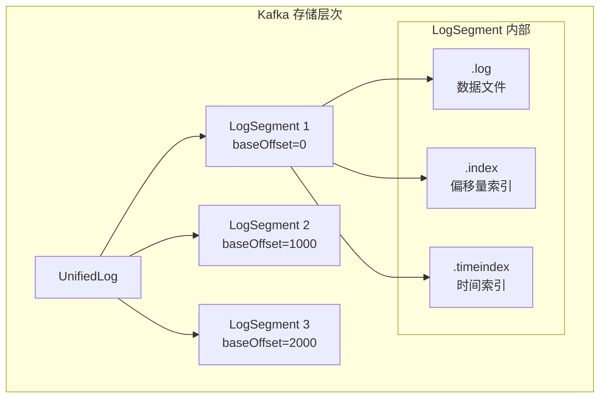
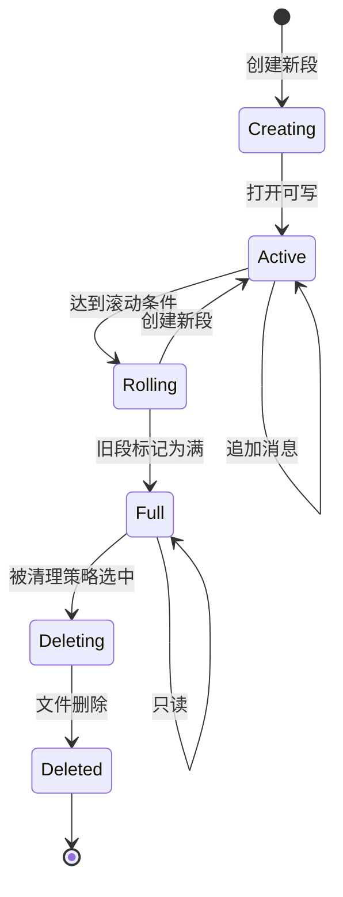

# LogSegment 结构详解

## 目录
- [1. LogSegment 概述](#1-logsegment-概述)
- [2. LogSegment 核心组件](#2-logsegment-核心组件)
- [3. 消息格式](#3-消息格式)
- [4. 文件命名规则](#4-文件命名规则)
- [5. 段的生命周期](#5-段的生命周期)
- [6. 实战分析](#6-实战分析)

---

## 1. LogSegment 概述

### 1.1 什么是 LogSegment

LogSegment 是 Kafka 日志存储的基本单位，每个 LogSegment 包含一个数据文件和多个索引文件。

**核心特性**:
- **段内有序**: Offset 单调递增
- **不可变性**: 写满后不再修改
- **独立索引**: 每个段有自己的索引文件
- **滚动机制**: 达到大小或时间限制后创建新段

**核心特性**:
- **段内有序**: Offset 单调递增
- **不可变性**: 写满后不再修改
- **独立索引**: 每个段有自己的索引文件
- **滚动机制**: 达到大小或时间限制后创建新段

### 1.2 LogSegment 在架构中的位置



---

## 2. LogSegment 核心组件

### 2.1 LogSegment 结构定义

```scala
/**
 * LogSegment - 日志段，日志的基本存储单位
 *
 * 设计思想:
 * 1. 段内有序: offset 单调递增
 * 2. 不可变: 写满后不再修改
 * 3. 独立索引: 每个段有自己的索引文件
 * 4. 滚动机制: 达到大小或时间限制后创建新段
 */
class LogSegment(
    // ========== 核心组件 ==========

    // 1. 日志文件: 实际存储消息
    private val log: FileRecords,

    // 2. 偏移量索引: offset -> position 映射
    private val offsetIndex: OffsetIndex,

    // 3. 时间索引: timestamp -> offset 映射
    private val timeIndex: TimeIndex,

    // 4. 事务索引: 事务相关消息索引
    private val txnIndex: TransactionIndex,

    // 5. 起始偏移量: 该段的第一个消息 offset
    private val baseOffset: Long,

    // 6. 索引间隔: 每隔多少字节创建一个索引项
    private val indexIntervalBytes: Int,

    // 7. 滚动参数
    private val rollJitterMs: Long,
    private val maxSegmentMs: Long,
    private val maxSegmentBytes: Long,

    // 8. 滚动时间: 该段的创建时间
    private val rollTime: Long
) extends Logging {
    // ========== 核心方法 ==========
    def append(largestOffset: Long, records: MemoryRecords): LogAppendInfo
    def read(startOffset: Long, maxSize: Int): FetchDataInfo
    def updateIndexes(offset: Long, position: Int): Unit
    def close(): Unit
    def truncateTo(offset: Long): Unit
}
```

### 2.2 FileRecords - 数据文件

```scala
/**
 * FileRecords - 日志数据文件封装
 *
 * 职责:
 * 1. 封装文件操作
 * 2. 提供 MMap 或 FileChannel 访问
 * 3. 支持批量读写
 */
class FileRecords(
    file: File,                              // 文件路径
    mutable: Boolean,                        // 是否可修改
    fileAlreadyExists: Boolean,              // 文件是否已存在
    initFileSize: Int,                       // 初始文件大小
    preallocate: Boolean                     // 是否预分配
) extends Records {
    // 文件通道
    private val channel: FileChannel

    // 内存映射 (可选)
    private var mmap: MappedByteBuffer

    // 文件大小
    private val size: AtomicInteger

    /**
     * 追加记录
     */
    def append(records: MemoryRecords): Int = {
        // 使用 scatter-gather 写入
        val written = channel.write(records.bufferArray)

        // 更新文件大小
        size.addAndGet(written)

        written
    }

    /**
     * 读取记录
     */
    def read(position: Int, size: Int): FileRecords = {
        // 零拷贝读取
        slice(position, position + size)
    }

    /**
     * 截断文件
     */
    def truncateTo(size: Int): Unit = {
        channel.truncate(size)
        this.size.set(size)
    }
}
```

**设计亮点**:

1. **零拷贝**: 使用 MMap 或 FileChannel 实现零拷贝
2. **批量操作**: 支持 scatter-gather I/O
3. **预分配**: 可选预分配文件空间，避免碎片

### 2.3 OffsetIndex - 偏移量索引

```scala
/**
 * OffsetIndex - 偏移量稀疏索引
 *
 * 核心思想:
 * 1. 稀疏索引: 不是每个消息都索引，节省空间
 * 2. 内存映射: 使用 MMap 避免拷贝
 * 3. 有序存储: 支持二分查找
 */
class OffsetIndex(
    file: File,                  // 索引文件
    baseOffset: Long,            // 基准偏移量
    maxIndexSize: Int            // 最大索引大小
) extends AbstractIndex[Long, Int] {

    /**
     * 索引项结构 (8 字节):
     * - offset (4 bytes): 相对偏移量
     * - position (4 bytes): 在 .log 文件中的物理位置
     */
    override def entrySize: Int = 8

    /**
     * 查找偏移量对应的物理位置
     */
    def lookup(targetOffset: Long): OffsetPosition = {
        // 二分查找索引
        val slot = indexSlotFor(targetOffset, IndexSearchType.KEY)

        if (slot == -1) {
            return new OffsetPosition(baseOffset, 0)
        }

        // 获取索引项
        val entry = entry(slot)
        new OffsetPosition(baseOffset + entry.offset, entry.position)
    }

    /**
     * 追加索引项
     */
    def append(offset: Long, position: Int): Unit = {
        lock.synchronized {
            // 检查索引是否已满
            require(!isFull, "Attempt to append to full index")

            // 写入索引项
            val relativeOffset = offset - baseOffset
            require(relativeOffset >= 0, s"Invalid offset $offset")

            // 追加到索引文件
            mmap.putInt(relativeOffset.toInt)
            mmap.putInt(position)

            // 更新索引项数量
            _entries += 1
        }
    }
}
```

详见: [03. 日志索引机制](./03-log-index.md)

### 2.4 TimeIndex - 时间索引

```scala
/**
 * TimeIndex - 时间戳索引
 *
 * 用途: 根据时间戳查找消息位置
 * 场景:
 * - 按时间消费 (offsetsForTime)
 * - 日志清理 (删除旧数据)
 */
class TimeIndex(
    file: File,
    baseOffset: Long,
    maxIndexSize: Int
) extends AbstractIndex[Long, Long] {

    /**
     * 索引项结构 (16 字节):
     * - timestamp (8 bytes): 时间戳
     * - offset (8 bytes): 偏移量
     */
    override def entrySize: Int = 16

    /**
     * 查找时间戳对应的偏移量
     */
    def lookup(targetTimestamp: Long): Long = {
        val slot = indexSlotFor(targetTimestamp, IndexSearchType.TIMESTAMP)

        if (slot == -1) {
            return baseOffset
        }

        entry(slot).offset + baseOffset
    }

    /**
     * 追加时间索引项
     */
    def append(timestamp: Long, offset: Long): Unit = {
        lock.synchronized {
            require(!isFull, "Attempt to append to full index")

            // 时间戳必须单调递增
            if (_entries > 0) {
                val lastEntry = entry(_entries - 1)
                require(timestamp > lastEntry.timestamp,
                    s"Timestamp $timestamp not greater than last timestamp ${lastEntry.timestamp}")
            }

            // 写入索引项
            mmap.putLong(timestamp)
            mmap.putLong(offset)

            _entries += 1
        }
    }
}
```

### 2.5 TransactionIndex - 事务索引

```scala
/**
 * TransactionIndex - 事务消息索引
 *
 * 用途: 记录事务相关的消息，支持事务回滚
 */
class TransactionIndex(
    baseOffset: Long,
    file: File
) extends Logging {
    // 事务状态列表
    private val abortedTransactions: List[AbortedTxn]

    /**
     * 添加中止的事务
     */
    def append(abortedTxn: AbortedTxn): Unit = {
        abortedTransactions :+= abortedTxn
    }

    /**
     * 查找指定范围内的中止事务
     */
    def allAbortedTxns(startOffset: Long, endOffset: Long): List[AbortedTxn] = {
        abortedTransactions.filter { txn =>
            txn.lastOffset >= startOffset && txn.firstOffset <= endOffset
        }
    }
}
```

---

## 3. 消息格式

### 3.1 Record Batch v2 格式

Kafka 使用 Record Batch v2 格式（Kafka 0.11.0+）：

```
┌──────────────────────────────────────────────────────────────┐
│ Record Batch (v2)                                            │
├──────────────────────────────────────────────────────────────┤
│                                                              │
│ ┌──────────────┐  ┌──────────────┐  ┌──────────────┐        │
│ │ BASE OFFSET  │  │ BATCH LENGTH │  │ PARTITION     │        │
│ │   (8 bytes)  │  │  (4 bytes)   │  │ LEADER EPOCH  │        │
│ └──────────────┘  └──────────────┘  └──────────────┘        │
│                                                              │
│ ┌─────────────────────────────────────────────────────────┐  │
│ │                RECORDS (variable length)                │  │
│ │  ┌─────────┐  ┌─────────┐  ┌─────────┐  ┌─────────┐   │  │
│ │  │ Record1 │  │ Record2 │  │ Record3 │  │ ...     │   │  │
│ │  └─────────┘  └─────────┘  └─────────┘  └─────────┘   │  │
│ └─────────────────────────────────────────────────────────┘  │
│                                                              │
│ ┌──────────────┐  ┌──────────────┐  ┌──────────────┐        │
│ │ CRC (4 bytes)│  │ ATTRIBUTES   │  │ TIMESTAMP    │        │
│ └──────────────┘  └──────────────┘  └──────────────┘        │
│                                                              │
│ │ │ttributes (1 byte):                                       │
│ │  ├── bit 0-2: compression type (NONE, GZIP, SNAPPY, LZ4)  │
│ │  ├── bit 3: timestamp type (CREATE_TIME or LOG_APPEND_TIME)│
│ │  ├── bit 4: is transactional                              │
│ │  ├── bit 5: is control                                    │
│ │  └── bit 6-7: reserved                                    │
│                                                              │
└──────────────────────────────────────────────────────────────┘
```

### 3.2 单个 Record 格式

```
┌─────────────────────────────────────────────────────────────┐
│ Record                                                       │
├─────────────────────────────────────────────────────────────┤
│ ┌─────────┐  ┌─────────┐  ┌─────────┐  ┌─────────┐         │
│ │ LENGTH  │  │ ATTRIBS │  │ TIMESTAMPΔ│  │ KEY LEN │         │
│ │ (Varint)│  │ (Varint)│  │ (Varint) │  │ (Varint)│         │
│ └─────────┘  └─────────┘  └─────────┘  └─────────┘         │
│ ┌─────────┐  ┌─────────┐  ┌─────────┐                       │
│ │ KEY     │  │ VALUE   │  │ HEADERS │                       │
│ │ (Bytes) │  │ (Bytes) │  │ (Bytes) │                       │
│ └─────────┘  └─────────┘  └─────────┘                       │
│                                                              │
│ Headers:                                                     │
│ ┌─────────┐  ┌─────────┐  ┌─────────┐  ┌─────────┐          │
│ │ Header 1│  │ Header 2│  │ ...     │  │ Header N│          │
│ │ Key-Val │  │ Key-Val │  │         │  │ Key-Val │          │
│ └─────────┘  └─────────┘  └─────────┘  └─────────┘          │
└─────────────────────────────────────────────────────────────┘

Varint Encoding (可变长度整数):
- 0-127: 1 byte
- 128-16383: 2 bytes
- 16384-2097151: 3 bytes
- 2097152-268435455: 4 bytes
```

### 3.3 消息格式示例

```java
// 示例: 创建一条消息

// 1. 创建 ProducerRecord
ProducerRecord<String, String> record = new ProducerRecord<>(
    "my-topic",           // topic
    0,                     // partition
    "key-123",             // key
    "Hello Kafka"          // value
);

// 2. 序列化为 Record Batch
MemoryRecords records = RecordBatch.CURRENT.withCompression(
    CompressionType.NONE,
    TimestampType.CREATE_TIME
) {
    // 添加 Record
    append(
        0L,                    // baseOffset
        System.currentTimeMillis(),  // timestamp
        "key-123".getBytes(),  // key
        "Hello Kafka".getBytes()  // value
    )
}

// 3. 实际存储格式 (hex dump)
/*
00 00 00 00 00 00 00 00  // base offset (0)
00 00 00 25              // batch length (37 bytes)
00 00 00 00              // partition leader epoch (0)
00 00 01 7A C4 1B 92 50  // base timestamp (1640000000000)
AF 0F 97 18              // last offset delta (15)
00 00 00 00              // base sequence (0)
00                       // records count (0, actual count in records)
00                       // attributes (none)
00 00 00 00              // reserve (0)
...                      // records data
*/
```

### 3.4 压缩消息格式

当启用压缩时，整个 Record Batch 会被压缩：

```
未压缩:
┌──────────────┐  ┌──────────────┐  ┌──────────────┐
│ Record Batch │  │ Record Batch │  │ Record Batch │
│   (1 KB)     │  │   (1 KB)     │  │   (1 KB)     │
└──────────────┘  └──────────────┘  └──────────────┘
Total: 3 KB

启用 LZ4 压缩:
┌────────────────────────────────────┐
│ Wrapped Record Batch                │
├────────────────────────────────────┤
│ ┌──────────────┐  ┌──────────────┐ │
│ │ Record Batch │  │ Record Batch │  │  内层: 原始 batches
│ │   (1 KB)     │  │   (1 KB)     │  │
│ └──────────────┘  └──────────────┘  │
│                                    │
│ [LZ4 Compressed Data (~600 bytes)] │  │  外层: 压缩 wrapper
└────────────────────────────────────┘
Total: ~600 bytes (压缩比 ~5:1)
```

**压缩配置**:

```properties
# Broker 配置
compression.type=lz4      # 可选: gzip, snappy, lz4, zstd, none

# Producer 配置
compression.type=lz4
```

**压缩比对比**:

| 算法 | 压缩比 | 速度 | CPU 使用 |
|-----|-------|------|---------|
| none | 1:1 | 最快 | 最低 |
| lz4 | ~3:1 | 快 | 低 |
| snappy | ~2.5:1 | 中等 | 中 |
| gzip | ~5:1 | 慢 | 高 |
| zstd | ~4:1 | 中等 | 中 |

---

## 4. 文件命名规则

### 4.1 命名格式

```
文件命名格式: ${起始偏移量}.${扩展名}

偏移量格式: 20 位数字，左补零

扩展名:
- .log: 数据文件
- .index: 偏移量索引
- .timeindex: 时间索引
```

### 4.2 命名示例

```
单个段的文件组:
00000000000000000000.log       # 从 offset 0 开始
00000000000000000000.index     # 对应的偏移量索引
00000000000000000000.timeindex # 对应的时间索引

下一个段:
00000000000000000100.log       # 从 offset 100 开始
00000000000000000100.index
00000000000000000100.timeindex

再下一个段:
00000000000000000200.log       # 从 offset 200 开始
00000000000000000200.index
00000000000000000200.timeindex
```

### 4.3 命名规则解析

```java
/**
 * 命名规则解析
 */
public class FileNameParser {

    // 正则表达式: 匹配 20 位数字 + 扩展名
    private static final Pattern FILE_PATTERN =
        Pattern.compile("^([0-9]{20})\\.(log|index|timeindex)$");

    /**
     * 解析文件名，提取起始偏移量
     */
    public static long parseBaseOffset(String fileName) {
        Matcher matcher = FILE_PATTERN.matcher(fileName);

        if (!matcher.matches()) {
            throw new IllegalArgumentException(
                "Invalid file name format: " + fileName
            );
        }

        // 提取偏移量字符串并转换为 long
        String offsetStr = matcher.group(1);
        return Long.parseLong(offsetStr);
    }

    /**
     * 生成文件名
     */
    public static String generateFileName(long baseOffset, String extension) {
        // 格式化为 20 位数字，左补零
        return String.format("%020d.%s", baseOffset, extension);
    }

    /**
     * 获取文件类型
     */
    public static FileType getFileType(String fileName) {
        if (fileName.endsWith(".log")) {
            return FileType.LOG;
        } else if (fileName.endsWith(".index")) {
            return FileType.INDEX;
        } else if (fileName.endsWith(".timeindex")) {
            return FileType.TIME_INDEX;
        } else {
            return FileType.UNKNOWN;
        }
    }
}
```

### 4.4 设计优势

```java
/**
 * 20 位零填充设计的优势
 */
public class ZeroPaddingBenefits {

    // 1. 字符串排序 = 数字排序
    //    "00000000000000000000" < "00000000000000000100" < "00000000000000000200"
    //    长度相同，字典序即为数值序

    // 2. 文件系统优化
    //    - 文件名长度固定，便于文件系统缓存
    //    - 排序效率高，便于范围查找

    // 3. 最大支持范围
    public static void main(String[] args) {
        long maxOffset = 99999999999999999999L;  // 20 个 9
        System.out.println("Max offset: " + maxOffset);

        // 假设每条消息 1KB，offset 递增
        long maxMessages = maxOffset;
        long maxBytes = maxMessages * 1024;
        long maxPB = maxBytes / (1024L * 1024 * 1024 * 1024 * 1024);

        System.out.println("Max storage: " + maxPB + " PB");
        // 输出: Max storage: 88817841970012523233890533447265625 PB
        // 实际上是无限的（远超人类可观测宇宙的原子数）
    }
}
```

### 4.5 实战: 文件名操作

```bash
# 1. 列出所有段文件
ls -l /data/kafka/logs/my-topic-0/ | grep "^000"

# 输出:
# -rw-r--r-- 1 kafka kafka 1073741824 Mar  1 00:00 00000000000000000000.log
# -rw-r--r-- 1 kafka kafka    1048576 Mar  1 00:00 00000000000000000000.index
# -rw-r--r-- 1 kafka kafka    1048576 Mar  1 00:00 00000000000000000000.timeindex
# -rw-r--r-- 1 kafka kafka 1073741824 Mar  1 01:00 00000000000000001000.log
# ...

# 2. 查找包含特定 offset 的段
# 例如: 查找包含 offset 123456 的段
find /data/kafka/logs/my-topic-0/ -name "*.log" | \
  awk -F'/' '{print $NF}' | \
  sed 's/\.log//' | \
  sort -n | \
  awk '$1 <= 123456 {last=$1} END {print last}'

# 3. 统计段数量
ls -1 /data/kafka/logs/my-topic-0/*.log | wc -l

# 4. 查看段大小分布
ls -l /data/kafka/logs/my-topic-0/*.log | \
  awk '{print $5}' | \
  awk '{sum+=$1; count++} END {print "Avg:", sum/count, "Total:", sum}'

# 5. 重命名段文件 (慎用!)
# 注意: 修改段文件名会导致数据不可用
mv /data/kafka/logs/my-topic-0/00000000000000000000.log \
   /data/kafka/logs/my-topic-0/00000000000000000999.log
```

---

## 5. 段的生命周期

### 5.1 生命周期阶段



### 5.2 段的创建

```java
/**
 * 创建新段
 */
private LogSegment roll(long nextOffset) {
    // ========== 步骤1: 创建新段文件名 ==========
    String fileName = formatFileName(nextOffset);

    // ========== 步骤2: 创建新 LogSegment ==========
    LogSegment newSegment = LogSegment.open(
        dir = logDir,
        baseOffset = nextOffset,
        config = segmentConfig,
        time = time,
        initFileSize = initFileSize,
        preallocate = preallocate
    );

    // ========== 步骤3: 关闭旧段 ==========
    LogSegment toClose = segments.last();
    if (toClose != null) {
        toClose.close();  // flush 缓冲，关闭文件句柄
    }

    // ========== 步骤4: 添加新段 ==========
    segments.append(newSegment);

    // ========== 步骤5: 更新活跃段 ==========
    updateLogMetrics();

    return newSegment;
}
```

### 5.3 段的滚动条件

```java
/**
 * 检查是否需要滚动段
 */
private boolean shouldRoll(LogSegment segment, long now) {
    // ========== 条件1: 大小超限 ==========
    boolean sizeFull = segment.size() >= maxSegmentBytes;

    // ========== 条件2: 时间超限 ==========
    boolean timeFull = (now - segment.rollTime()) >= maxSegmentMs;

    // ========== 条件3: 索引满了 ==========
    boolean indexFull = segment.index().isFull();

    // ========== 条件4: 需要预分配 ==========
    boolean needPreallocate = preallocate && !segment.isFull();

    return sizeFull || timeFull || indexFull || needPreallocate;
}
```

**配置参数**:

```properties
# 段大小 (默认 1GB)
log.segment.bytes=1073741824

# 段时间 (默认 7天，0 表示不按时间滚动)
log.segment.ms=604800000

# 索引最大条目数 (默认 Integer.MAX_VALUE)
log.index.size.max.bytes=10485760
```

### 5.4 段的删除

```java
/**
 * 删除段
 */
private void deleteSegment(LogSegment segment) {
    // ========== 步骤1: 从段列表移除 ==========
    segments.remove(segment.baseOffset());

    // ========== 步骤2: 异步删除文件 ==========
    asyncDeleteSegment(segment);

    // ========== 步骤3: 更新日志元数据 ==========
    updateLogStartOffset();
}

/**
 * 异步删除段文件
 */
private void asyncDeleteSegment(LogSegment segment) {
    // ========== 步骤1: 重命名文件 ==========
    // 添加 .deleted 后缀，标记为待删除
    segment.log.renameTo(new File(segment.log.file().getPath() + ".deleted"));
    segment.index().renameTo(new File(segment.index().file().getPath() + ".deleted"));
    segment.timeIndex().renameTo(new File(segment.timeIndex().file().getPath() + ".deleted"));

    // ========== 步骤2: 加入删除队列 ==========
    // 后台线程会定期清理这些文件
    segmentsToDelete.put(segment, time.milliseconds());

    // ========== 步骤3: 关闭文件句柄 ==========
    segment.close();
}
```

### 5.5 段的状态转换

```java
/**
 * 段状态枚举
 */
enum SegmentState {
    CREATING,   // 正在创建
    ACTIVE,     // 活跃段（可写）
    FULL,       // 已满（只读）
    DELETING,   // 正在删除
    DELETED     // 已删除
}

/**
 * 段状态管理
 */
class LogSegmentStateManager {
    private Map<Long, SegmentState> segmentStates = new ConcurrentHashMap<>();

    /**
     * 状态转换规则
     */
    public boolean canTransition(Long baseOffset, SegmentState from, SegmentState to) {
        SegmentState current = segmentStates.get(baseOffset);

        if (current != from) {
            return false;
        }

        // 允许的转换
        switch (to) {
            case ACTIVE:
                return from == SegmentState.CREATING;
            case FULL:
                return from == SegmentState.ACTIVE;
            case DELETING:
                return from == SegmentState.ACTIVE || from == SegmentState.FULL;
            case DELETED:
                return from == SegmentState.DELETING;
            default:
                return false;
        }
    }
}
```

---

## 6. 实战分析

### 6.1 分析段文件

```bash
# 1. 查看段内容
kafka-dump-log.sh \
  --files /data/kafka/logs/my-topic-0/00000000000000000000.log \
  --print-data-log

# 输出示例:
# Dumping /data/kafka/logs/my-topic-0/00000000000000000000.log
# Starting offset: 0
# BaseOffset: 0 LastOffset: 99 Count: 100 BaseTimestamp: 1640000000000 MaxTimestamp: 1640000100000
# ...

# 2. 验证索引文件
kafka-dump-log.sh \
  --files /data/kafka/logs/my-topic-0/00000000000000000000.index \
  --verify-index

# 输出示例:
# Index file: 00000000000000000000.index
# Entries: 1000
# Offset range: [0, 999]
# Position range: [0, 1048576]
# Index is valid

# 3. 分析段大小
for file in /data/kafka/logs/my-topic-0/*.log; do
  name=$(basename "$file")
  size=$(stat -f%z "$file" 2>/dev/null || stat -c%s "$file")
  echo "$name: $size bytes"
done | sort -t: -k2 -n

# 4. 查看索引密度
kafka-dump-log.sh \
  --files /data/kafka/logs/my-topic-0/00000000000000000000.index | \
  grep "offset:" | \
  awk '{print $2}' | \
  sort -n | \
  awk '{diff=$1-prev; if(prev>0) print diff; prev=$1}' | \
  sort -n | \
  uniq -c
```

### 6.2 段监控

```bash
#!/bin/bash
# segment-monitor.sh - 监控段状态

LOG_DIR="/data/kafka/logs"
TOPIC="my-topic"

echo "=== Segment Monitoring Report ==="
echo "Time: $(date)"
echo

# 1. 段数量统计
echo "1. Segment Count:"
for partition in $(ls -d ${LOG_DIR}/${TOPIC}-*); do
  count=$(ls -1 ${partition}/*.log 2>/dev/null | wc -l)
  echo "  $(basename $partition): $count segments"
done
echo

# 2. 段大小分布
echo "2. Segment Size Distribution (MB):"
ls -lh ${LOG_DIR}/${TOPIC}-0/*.log | \
  awk '{print $5}' | \
  sed 's/M//' | \
  awk '{sum+=$1; count++} END {print "  Avg:", sum/count, "MB"}'
echo

# 3. 活跃段
echo "3. Active Segment:"
for partition in $(ls -d ${LOG_DIR}/${TOPIC}-*); do
  active=$(ls -t ${partition}/*.log 2>/dev/null | head -1)
  size=$(stat -c%s "$active" 2>/dev/null || stat -f%z "$active")
  echo "  $(basename $partition): $(basename $active) ($size bytes)"
done
echo

# 4. 磁盘使用
echo "4. Disk Usage:"
du -sh ${LOG_DIR}/${TOPIC}-*
```

### 6.3 段迁移

```bash
# 场景: 将某个 Topic 的段迁移到其他磁盘

# 1. 停止生产者和消费者（避免数据不一致）

# 2. 查看 Topic 当前的分布
kafka-log-dirs.sh \
  --bootstrap-server localhost:9092 \
  --describe \
  --topic-list my-topic

# 3. 创建迁移计划
cat > move-plan.json <<EOF
{
  "version": 1,
  "partitions": [
    {
      "topic": "my-topic",
      "partition": 0,
      "replicas": [1, 2],
      "log_dirs": ["path2", "path2"]
    }
  ]
}
EOF

# 4. 执行迁移
kafka-reassign-partitions.sh \
  --bootstrap-server localhost:9092 \
  --reassignment-json-file move-plan.json \
  --execute

# 5. 验证迁移
kafka-reassign-partitions.sh \
  --bootstrap-server localhost:9092 \
  --reassignment-json-file move-plan.json \
  --verify
```

### 6.4 段修复

```bash
# 场景: 段文件损坏

# 1. 检测损坏
kafka-run-class.sh kafka.tools.DumpLogSegments \
  --files /data/kafka/logs/my-topic-0/00000000000000000000.log \
  --deep-iteration

# 如果输出显示 "Log file is corrupt"，则需要修复

# 2. 查找最后一个有效 offset
kafka-run-class.sh kafka.tools.DumpLogSegments \
  --files /data/kafka/logs/my-topic-0/*.log \
  --print-data-log | \
  grep "BaseOffset:" | \
  tail -1

# 3. 截断到最后一个有效 offset
kafka-run-class.sh kafka.tools.TruncateAll {
  --bootstrap-server localhost:9092 \
  --topic my-topic \
  --partition 0 \
  --offset <last-valid-offset>
}

# 4. 重启 Broker
```

---

## 7. 总结

### 7.1 核心要点

| 组件 | 职责 | 文件 |
|-----|------|------|
| **FileRecords** | 数据存储 | .log |
| **OffsetIndex** | 偏移量索引 | .index |
| **TimeIndex** | 时间索引 | .timeindex |
| **TransactionIndex** | 事务索引 | 事务目录 |

### 7.2 设计亮点

1. **独立索引**: 每个段独立索引，支持并发
2. **稀疏索引**: 不是每条消息都索引，节省空间
3. **内存映射**: 使用 MMap 实现零拷贝
4. **固定命名**: 20 位零填充，便于排序
5. **滚动机制**: 自动滚动，无需手动干预

### 7.3 最佳实践

| 场景 | 段大小配置 |
|-----|----------|
| **高吞吐** | 1GB (默认) |
| **低延迟** | 100MB |
| **长期存储** | 10GB |
| **频繁删除** | 100MB |

---

**下一章**: [03. 日志索引机制](./03-log-index.md)
