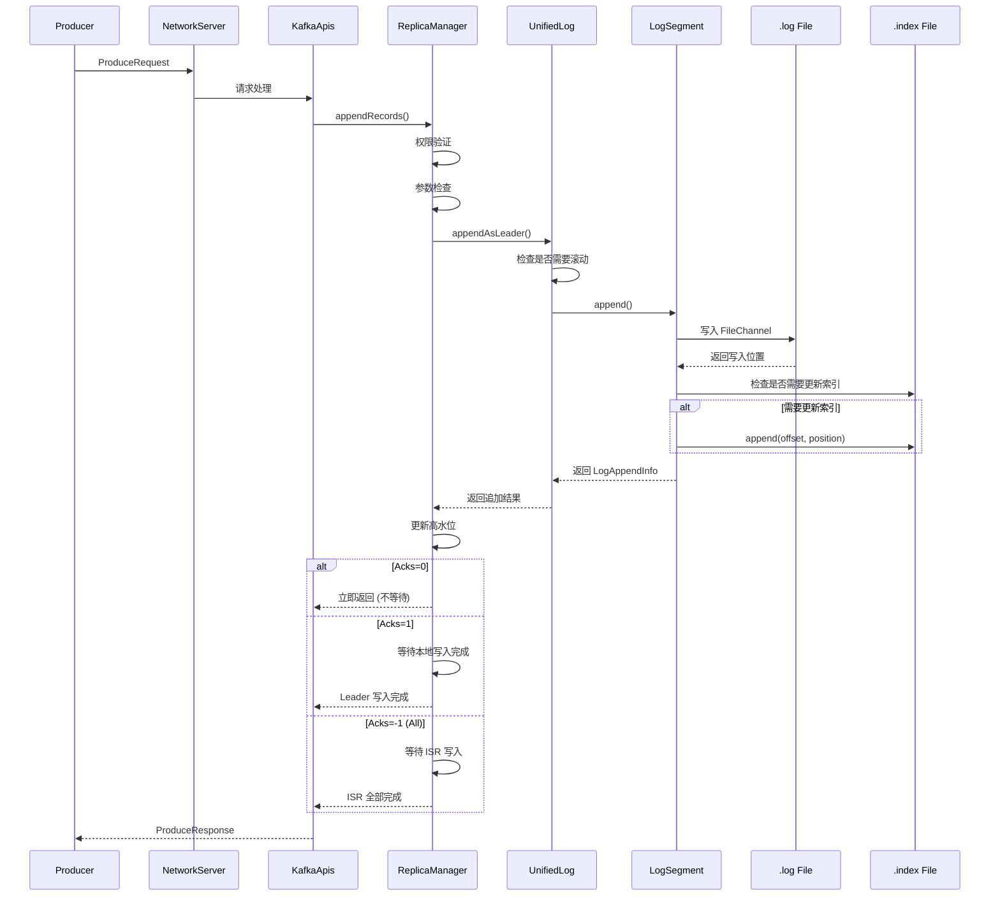

# 日志追加流程

## 目录
- [1. 写入流程概览](#1-写入流程概览)
- [2. 核心写入代码分析](#2-核心写入代码分析)
- [3. 段滚动机制](#3-段滚动机制)
- [4. 批量写入优化](#4-批量写入优化)
- [5. 刷盘策略](#5-刷盘策略)
- [6. 实战调优](#6-实战调优)

---

## 1. 写入流程概览

### 1.1 完整写入流程



### 1.2 写入路径

```
写入路径层次:

Producer
  ↓
NetworkServer (处理网络请求)
  ↓
KafkaApis (解析 ProduceRequest)
  ↓
ReplicaManager (副本管理)
  ↓
UnifiedLog (统一日志接口)
  ↓
LogSegment (日志段)
  ↓
FileRecords (文件操作)
  ↓
FileChannel.write() (系统调用)
  ↓
OS Page Cache (页缓存)
  ↓
Disk (磁盘)
```

---

## 2. 核心写入代码分析

### 2.1 UnifiedLog.append()

```scala
/**
 * UnifiedLog.appendAsLeader() - 核心写入方法
 *
 * 设计亮点：
 * 1. 批量写入：一次写入多个 Record
 * 2. 顺序写入：追加到文件末尾
 * 3. 批量刷盘：控制刷盘频率
 */
def appendAsLeader(
    records: MemoryRecords,
    origin: AppendOrigin,
    requiredAcks: Int = -1
): LogAppendInfo = {

    // ========== 步骤1: 参数验证 ==========
    if (records.sizeInBytes == 0) {
        throw new IllegalArgumentException("Cannot append empty records")
    }

    // ========== 步骤2: 检查日志状态 ==========
    checkLogMetadata()

    // ========== 步骤3: 分配 offset ==========
    val firstOffset = nextOffsetMetadata.messageOffset
    val (lastOffset, maxTimestamp, maybeFirstTimestamp) =
        analyzeAndValidateRecords(records, origin)

    // ========== 步骤4: 检查是否需要滚动段 ==========
    // 滚动条件:
    // 1. 当前段大小 >= maxSegmentBytes
    // 2. 时间超过 maxSegmentMs
    // 3. 索引满了
    maybeRoll(records.sizeInBytes, firstOffset)

    // ========== 步骤5: 写入当前段 ==========
    val activeSegment = segments.activeSegment

    // 步骤5.1: 写入 .log 文件
    val appendInfo = activeSegment.append(
        largestOffset = lastOffset,
        largestTimestamp = maxTimestamp,
        shallowOffsetOfMaxTimestamp = lastOffset,
        records = records
    )

    // 步骤5.2: 更新索引
    if (appendInfo.numMessages > 0) {
        // 检查是否需要添加新索引项
        // 条件: 距离上一个索引项的字节数 >= indexIntervalBytes
        updateIndexes(appendInfo)
    }

    // ========== 步骤6: 更新统计信息 ==========
    updateLogEndOffset(appendInfo.lastOffset)

    // ========== 步骤7: 追加后处理 ==========
    if (requiredAcks > 0) {
        // 需要等待确认
        maybeFlush()
    }

    appendInfo
}
```

### 2.2 LogSegment.append()

```scala
/**
 * LogSegment.append() - 段内追加
 */
def append(
    largestOffset: Long,
    largestTimestamp: Long,
    shallowOffsetOfMaxTimestamp: Long,
    records: MemoryRecords
): LogAppendInfo = {

    // ========== 步骤1: 检查 offset 顺序 ==========
    if (largestOffset <= baseOffset) {
        throw new IllegalArgumentException(
            s"Offset $largestOffset must be greater than base offset $baseOffset"
        )
    }

    // ========== 步骤2: 写入 FileRecords ==========
    val physicalPosition = log.size()
    val appendedBytes = try {
        log.append(records)
    } catch {
        case e: IOException =>
            throw new KafkaStorageException(
                s"IO error appending to log $name", e
            )
    }

    // ========== 步骤3: 更新段信息 ==========
    // 更新下一个可用的 offset 元数据
    if (largestOffset > nextOffsetMetadata.messageOffset) {
        nextOffsetMetadata = new LogOffsetMetadata(
            messageOffset = largestOffset + 1,
            segmentBaseOffset = baseOffset,
            relativePositionInSegment = physicalPosition + appendedBytes
        )
    }

    // ========== 步骤4: 更新时间索引 ==========
    if (largestTimestamp > maxTimestampSoFar) {
        maxTimestampSoFar = largestTimestamp
        offsetOfMaxTimestamp = shallowOffsetOfMaxTimestamp

        // 检查是否需要更新时间索引
        if (timeIndex.indexEntries == 0 ||
            largestTimestamp > timeIndex.lastEntry().timestamp - segment.ms) {
            timeIndex.append(
                timestamp = largestTimestamp,
                offset = largestOffset
            )
        }
    }

    // ========== 步骤5: 更新统计信息 ==========
    incrementAppendInfo()

    // ========== 步骤6: 返回追加信息 ==========
    new LogAppendInfo(
        firstOffset = new LogOffsetMetadata(baseOffset, baseOffset, 0),
        lastOffset = nextOffsetMetadata,
        numMessages = records.count(),
        appendedBytes = appendedBytes
    )
}
```

### 2.3 FileRecords.append()

```scala
/**
 * FileRecords.append() - 实际文件写入
 *
 * 设计亮点：使用 FileChannel 实现高效写入
 */
def append(records: MemoryRecords): Int = {
    // ========== 步骤1: 检查文件大小 ==========
    val written = if (records.sizeInBytes > Integer.MAX_VALUE - size.get) {
        // 批量太大，超过 int 范围
        throw new IllegalArgumentException(
            s"Append of size ${records.sizeInBytes} bytes is too large"
        )
    } else {
        var written = 0

        // ========== 步骤2: 写入数据 ==========
        // 使用 FileChannel.write()，零拷贝
        val buffers = records.bufferArray
        var start = 0

        while (start < buffers.length) {
            val bytesToWrite = math.min(
                buffers.length - start,
                maxBytesToWriteAtOnce
            )

            // 使用 scatter-gather 写入
            val batchWritten = channel.write(
                buffers,           // 缓冲区数组
                start,             // 起始位置
                bytesToWrite       // 写入数量
            )

            written += batchWritten
            start += bytesToWrite
        }

        written
    }

    // ========== 步骤3: 更新文件大小 ==========
    size.addAndGet(written)

    // ========== 步骤4: 记录统计信息 ==========
    registerStats()

    written
}
```

### 2.4 更新索引

```scala
/**
 * updateIndexes() - 更新索引
 *
 * 策略: 稀疏索引，不是每条消息都索引
 */
private def updateIndexes(appendInfo: LogAppendInfo): Unit = {
    // ========== 步骤1: 计算距离上次索引的字节数 ==========
    val bytesSinceLastIndex = appendInfo.firstOffset.relativePositionInSegment -
        lastIndexedOffset.map(_.relativePositionInSegment).getOrElse(0)

    // ========== 步骤2: 检查是否需要添加新索引项 ==========
    // 条件: 距离上一个索引项的字节数 >= indexIntervalBytes
    if (bytesSinceLastIndex >= indexIntervalBytes) {
        // ========== 步骤3: 追加偏移量索引 ==========
        offsetIndex.append(
            offset = appendInfo.lastOffset.messageOffset,
            position = appendInfo.lastOffset.relativePositionInSegment
        )

        // ========== 步骤4: 更新时间索引 ==========
        timeIndex.maybeAppend(
            timestamp = appendInfo.maxTimestamp,
            offset = appendInfo.lastOffset.messageOffset
        )

        // ========== 步骤5: 记录最后索引的 offset ==========
        lastIndexedOffset = Some(appendInfo.lastOffset)
    }
}
```

---

## 3. 段滚动机制

### 3.1 滚动条件

```scala
/**
 * maybeRoll() - 检查是否需要滚动段
 *
 * 滚动条件:
 * 1. size >= maxSegmentBytes (默认 1GB)
 * 2. time >= maxSegmentMs (默认 7天，0 表示不按时间滚动)
 * 3. 索引满了 (Integer.MAX_VALUE 个索引项)
 */
private def maybeRoll(messagesSize: Int, nextOffset: Long): Unit = {
    val activeSegment = segments.activeSegment

    // ========== 条件1: 大小超限 ==========
    val sizeFull = activeSegment.size() >= config.segmentSize - messagesSize

    // ========== 条件2: 时间超限 ==========
    val timeFull = config.segmentMs > 0 &&
        (time.milliseconds - activeSegment.rollTime) > config.segmentMs

    // ========== 条件3: 索引满了 ==========
    val indexFull = activeSegment.index.isFull

    // ========== 条件4: 需要预分配 ==========
    val needsPrealloc = config.preallocate &&
        activeSegment.size() == 0  // 新创建的段

    // ========== 执行滚动 ==========
    if (sizeFull || timeFull || indexFull || needsPrealloc) {
        roll(nextOffset)
    }
}
```

### 3.2 滚动实现

```scala
/**
 * roll() - 创建新段
 */
private def roll(nextOffset: Long): LogSegment = {
    info(s"Rolling log ${name} to next offset $nextOffset")

    // ========== 步骤1: 创建新段文件名 ==========
    val newFile = new File(
        dir,
        s"${filenamePrefix}$nextOffset.log"
    )

    // ========== 步骤2: 创建新 LogSegment ==========
    val newSegment = LogSegment.open(
        dir = dir,
        baseOffset = nextOffset,
        config = config,
        time = time,
        initFileSize = config.initFileSize,
        preallocate = config.preallocate
    )

    // ========== 步骤3: 关闭旧段 ==========
    val toClose = segments.last()
    if (toClose != null) {
        // 刷新缓冲
        toClose.flush()
        // 关闭文件句柄
        toClose.close()
    }

    // ========== 步骤4: 添加新段 ==========
    segments.append(newSegment)

    // ========== 步骤5: 更新活跃段 ==========
    updateLogMetrics()

    // ========== 步骤6: 记录日志 ==========
    info(s"Rolled new log segment for $name in ${newFile.getPath}")

    newSegment
}
```

### 3.3 段预分配

```scala
/**
 * 预分配段文件
 *
 * 优势:
 * 1. 避免文件碎片
 * 2. 减少元数据更新
 * 3. 提高写入性能
 */
private def preallocateFile(file: File, size: Long): Unit = {
    if (!config.preallocate) {
        return
    }

    val raf = new RandomAccessFile(file, "rw")

    try {
        // ========== 步骤1: 设置文件长度 ==========
        raf.setLength(size)

        // ========== 步骤2: 强制分配磁盘空间 ==========
        // Linux: fallocate(FALLOC_FL_KEEP_SIZE)
        // 效果: 预分配连续磁盘空间
        try {
            val channel = raf.getChannel()
            channel.tryLock()

            // 调用 posix_fallocate
            reflect.Method.getDeclaredMethod(
                channel.getClass,
                "file",
                classOf[FileLock],
                classOf[Long],
                classOf[Long]
            ) match {
                case Some(method) =>
                    method.invoke(channel, null, 0L, size)
                case None =>
                    // fallback: 写零填充
                    raf.seek(size - 1)
                    raf.write(0)
            }
        } finally {
            channel.close()
        }

        info(s"Preallocated file ${file.getName} with size $size")
    } finally {
        raf.close()
    }
}
```

---

## 4. 批量写入优化

### 4.1 Record Batch

```scala
/**
 * Record Batch - 批量写入
 *
 * 设计思想: 合并多条消息为一次写入
 */
class RecordBatchBuilder(
    compressionType: CompressionType,
    batchSize: Int
) {
    private val buffer = ByteBuffer.allocate(batchSize)
    private val records = mutableListOf[SimpleRecord]()

    /**
     * 添加记录
     */
    def append(record: SimpleRecord): Unit = {
        records += record

        // 检查是否达到批次大小
        if (estimateSize() >= batchSize) {
            // 构建完整的 Record Batch
            build()
        }
    }

    /**
     * 构建 Record Batch
     */
    def build(): MemoryRecords = {
        // ========== 步骤1: 计算 Batch 大小 ==========
        val batchSize = calculateBatchSize()

        // ========== 步骤2: 分配缓冲区 ==========
        val buffer = ByteBuffer.allocate(batchSize)

        // ========== 步骤3: 写入 Batch Header ==========
        buffer.putLong(baseOffset)              // base offset
        buffer.putInt(batchLength)              // batch length
        buffer.putInt(leaderEpoch)              // partition leader epoch
        buffer.putLong(baseTimestamp)           // base timestamp
        buffer.putInt(maxTimestampDelta)        // max timestamp delta
        buffer.putInt(baseSequence)             // base sequence
        buffer.putInt(records.length)           // records count

        // ========== 步骤4: 写入 Records ==========
        records.foreach { record =>
            writeRecord(buffer, record)
        }

        // ========== 步骤5: 压缩 (可选) ==========
        val compressed = if (compressionType != CompressionType.NONE) {
            compress(buffer.array(), compressionType)
        } else {
            buffer.array()
        }

        // ========== 步骤6: 包装为 MemoryRecords ==========
        MemoryRecords.withRecords(
            compressionType,
            TimestampType.CREATE_TIME,
            compressed
        )
    }
}
```

### 4.2 批量写入策略

```scala
/**
 * 批量写入策略
 *
 * 目标: 合并多个小请求为大操作
 */
class BatchingStrategy(
    lingerMs: Long,           // 等待时间
    batchSize: Int            // 批次大小
) {
    private val buffer = mutable.Map[TopicPartition, RecordAccumulator]()

    /**
     * 添加记录
     */
    def add(tp: TopicPartition, record: SimpleRecord): Unit = {
        val accumulator = buffer.getOrElseUpdate(tp, new RecordAccumulator())

        accumulator.add(record)

        // 检查是否可以发送
        if (accumulator.isFull || accumulator.timeSinceFirst >= lingerMs) {
            // 发送批次
            drain(accumulator)
        }
    }

    /**
     * 排空批次
     */
    private def drain(accumulator: RecordAccumulator): Unit = {
        val records = accumulator.build()

        // 发送到 Broker
        sendToBroker(accumulator.topicPartition, records)

        // 清空缓冲
        buffer.remove(accumulator.topicPartition)
    }
}
```

### 4.3 Gather 写入

```scala
/**
 * Scatter-Gather I/O
 *
 * 优势: 一次系统调用写入多个缓冲区
 */
class GatherWrite {
    /**
     * 使用 writev 系统调用
     */
    def gatherWrite(channel: FileChannel, buffers: Array[ByteBuffer]): Int = {
        // ========== 步骤1: 准备缓冲区数组 ==========
        val nativeBuffers = buffers.map(_.duplicate())

        // ========== 步骤2: 调用 writev ==========
        // 内核会处理多个缓冲区的写入
        channel.write(nativeBuffers)

        // ========== 步骤3: 返回写入字节数 ==========
        // 内核已合并写入
    }
}
```

---

## 5. 刷盘策略

### 5.1 刷盘时机

```scala
/**
 * 刷盘策略
 *
 * 平衡性能和可靠性
 */
class FlushPolicy(
    flushIntervalMessages: Int,  // 消息数阈值
    flushIntervalMs: Long         // 时间阈值
) {
    private var lastFlushTime = time.milliseconds()
    private var lastFlushOffset = 0L

    /**
     * 检查是否需要刷盘
     */
    def shouldFlush(currentOffset: Long): Boolean = {
        // ========== 条件1: 消息数阈值 ==========
        val messageCountTriggered = (currentOffset - lastFlushOffset) >= flushIntervalMessages

        // ========== 条件2: 时间阈值 ==========
        val timeTriggered = (time.milliseconds - lastFlushTime) >= flushIntervalMs

        messageCountTriggered || timeTriggered
    }

    /**
     * 执行刷盘
     */
    def flush(segment: LogSegment): Unit = {
        // ========== 步骤1: 强制写入磁盘 ==========
        segment.log.channel.force(true)  // metadata + data

        // ========== 步骤2: 更新刷盘时间 ==========
        lastFlushTime = time.milliseconds()

        // ========== 步骤3: 更新刷盘 offset ==========
        lastFlushOffset = segment.nextOffset()
    }
}
```

### 5.2 刷盘配置

```properties
# ========== 刷盘配置 ==========

# 消息数阈值: 每写入多少条消息刷盘一次
log.flush.interval.messages=10000

# 时间阈值: 多久刷盘一次
log.flush.interval.ms=1000

# 时间阈值: 检查刷盘的时间间隔
log.flush.scheduler.interval.ms=1000

# ========== 不同场景的配置 ==========

# 场景1: 高性能 (默认)
# log.flush.interval.messages=Long.MaxValue
# log.flush.interval.ms=Long.MaxValue
# → 依赖 OS 刷盘，性能最高

# 场景2: 平衡
# log.flush.interval.messages=10000
# log.flush.interval.ms=1000
# → 每秒刷盘或每 1 万条消息刷盘

# 场景3: 高可靠性
# log.flush.interval.messages=1
# log.flush.interval.ms=0
# → 每条消息立即刷盘，性能最低
```

### 5.3 OS 页缓存刷盘

```scala
/**
 * 依赖 OS 页缓存刷盘
 *
 * Kafka 默认策略: 不主动刷盘，依赖 OS
 */
class OSPageCacheFlush {
    /**
     * 写入策略
     */
    def write(segment: LogSegment, records: MemoryRecords): Unit = {
        // ========== 步骤1: 写入到页缓存 ==========
        segment.log.append(records)

        // ========== 步骤2: 不强制刷盘 ==========
        // 数据在 OS 页缓存中，异步刷盘
        // OS 刷盘策略:
        // - 脏页比例达到阈值
        // - 时间间隔 (默认 30秒)
        // - 内存压力

        // ========== 步骤3: 可选: 建议 OS 刷盘 ==========
        // posix_fadvise(fd, 0, 0, POSIX_FADV_DONTNEED)
        // 告诉 OS: 数据不需要缓存
    }
}
```

---

## 6. 实战调优

### 6.1 高吞吐配置

```properties
# ========== 高吞吐配置 ==========

# Broker 配置
num.replica.fetchers=4              # 增加副本拉取线程
num.network.threads=8               # 增加网络处理线程
num.io.threads=16                   # 增加 I/O 线程
log.dirs=/data1/kafka,/data2/kafka  # 多目录分散 I/O

# 段配置
log.segment.bytes=1073741824        # 1GB 段大小
log.flush.interval.messages=100000  # 10 万条消息刷盘
log.flush.interval.ms=1000          # 1 秒刷盘

# 压缩配置
compression.type=lz4                # LZ4 压缩

# Producer 配置
batch.size=32768                    # 32KB 批次
linger.ms=10                        # 10ms 等待
acks=1                              # Leader 确认
buffer.memory=67108864              # 64MB 缓冲
compression.type=lz4
```

### 6.2 低延迟配置

```properties
# ========== 低延迟配置 ==========

# Broker 配置
num.network.threads=8
num.io.threads=16

# 段配置
log.segment.bytes=268435456         # 256MB 段大小
log.flush.interval.messages=1       # 每条消息刷盘
log.flush.interval.ms=0             # 立即刷盘

# 禁用压缩
compression.type=none

# Producer 配置
batch.size=0                        # 不批量
linger.ms=0                         # 不等待
acks=1                              # Leader 确认
max.in.flight.requests.per.connection=1
buffer.memory=16384                 # 16KB 缓冲
```

### 6.3 监控写入性能

```bash
#!/bin/bash
# write-perf-monitor.sh - 写入性能监控

BROKER="localhost:9092"
TOPIC="test-topic"

echo "=== Write Performance Monitor ==="

# 1. 生产者性能测试
echo "1. Producer Throughput Test:"
kafka-producer-perf-test.sh \
  --topic $TOPIC \
  --num-records 1000000 \
  --record-size 1024 \
  --throughput 100000 \
  --producer-props \
    bootstrap.servers=$BROKER \
    batch.size=32768 \
    linger.ms=10 \
    acks=1

# 2. 监控写入延迟
echo "2. Write Latency:"
kafka-consumer-perf-test.sh \
  --bootstrap-server $BROKER \
  --topic $TOPIC \
  --messages 10000 \
  --threads 1 \
  --show-detailed-stats

# 3. 监控磁盘写入
echo "3. Disk Write I/O:"
iostat -x 1 10 | grep -E "Device|kafka"

# 4. 监控日志段大小
echo "4. Log Segment Size:"
du -sh /data/kafka/logs/$TOPIC-*/*
```

---

## 7. 总结

### 7.1 写入流程关键点

| 步骤 | 操作 | 性能影响 |
|-----|------|---------|
| 1 | 参数验证 | 小 |
| 2 | 分配 offset | 小 |
| 3 | 检查滚动 | 小 |
| 4 | 写入文件 | 大 |
| 5 | 更新索引 | 中 |
| 6 | 刷盘 | 大 (如强制) |

### 7.2 性能优化要点

| 优化点 | 方法 | 效果 |
|-------|------|------|
| **批量写入** | batch.size, linger.ms | 减少系统调用 |
| **段大小** | log.segment.bytes | 减少滚动频率 |
| **刷盘策略** | log.flush.interval.* | 平衡性能和可靠性 |
| **压缩** | compression.type | 减少磁盘 I/O |
| **多目录** | log.dirs | 分散 I/O 压力 |

### 7.3 配置建议

| 场景 | 段大小 | 刷盘策略 | 压缩 |
|-----|-------|---------|------|
| **高吞吐** | 1GB | OS 刷盘 | LZ4 |
| **低延迟** | 256MB | 强制刷盘 | None |
| **平衡** | 512MB | 定期刷盘 | LZ4 |

---

**下一章**: [05. 日志读取流程](./05-log-read.md)
