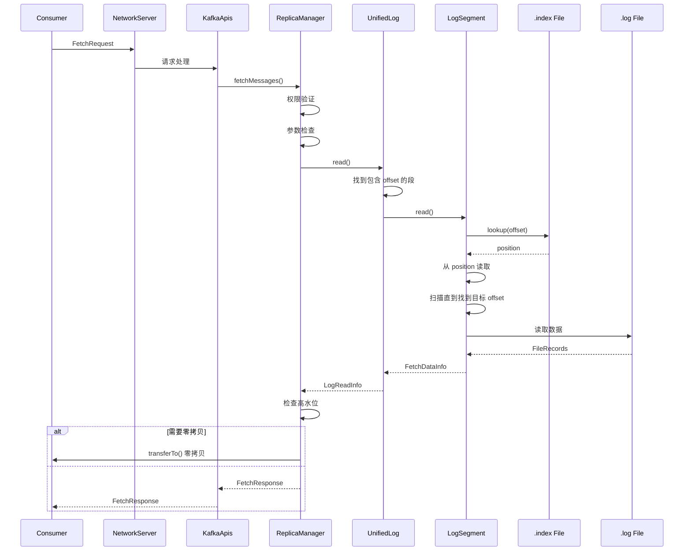

# 日志读取流程

## 目录
- [1. 读取流程概览](#1-读取流程概览)
- [2. 核心读取代码分析](#2-核心读取代码分析)
- [3. 零拷贝技术](#3-零拷贝技术)
- [4. 批量拉取优化](#4-批量拉取优化)
- [5. 读取性能优化](#5-读取性能优化)
- [6. 实战操作](#6-实战操作)

---

## 1. 读取流程概览

### 1.1 完整读取流程



### 1.2 读取路径

```
读取路径层次:

Consumer
  ↓
NetworkServer (处理网络请求)
  ↓
KafkaApis (解析 FetchRequest)
  ↓
ReplicaManager (副本管理)
  ↓
UnifiedLog (统一日志接口)
  ↓
LogSegment (日志段)
  ↓
OffsetIndex (索引查找)
  ↓
FileRecords (文件操作)
  ↓
FileChannel.read() / transferTo() (系统调用)
  ↓
OS Page Cache (页缓存)
  ↓
Disk (磁盘，如缓存未命中)
```

---

## 2. 核心读取代码分析

### 2.1 UnifiedLog.read()

```scala
/**
 * UnifiedLog.read() - 读取日志
 *
 * 设计亮点:
 * 1. 段定位: 快速找到包含目标 offset 的段
 * 2. 索引查找: 稀疏索引 + 顺序扫描
 * 3. 零拷贝: 使用 FileChannel.transferTo
 */
def read(
    startOffset: Long,
    maxLength: Int,
    isolation: FetchIsolation,
    minOneMessage: Boolean
): LogReadInfo = {

    // ========== 步骤1: 参数验证 ==========
    if (startOffset < logStartOffset) {
        throw new OffsetOutOfRangeException(
            s"Requested offset $startOffset is less than log start offset $logStartOffset"
        )
    }

    // ========== 步骤2: 查找包含目标 offset 的段 ==========
    // 使用跳表 (ConcurrentSkipListMap) 快速定位
    val segment = segments.floorSegment(startOffset)
    if (segment == null) {
        return LogReadInfo.UNKNOWN
    }

    // ========== 步骤3: 确定读取上限 ==========
    val maxOffset = isolation match {
        case FetchIsolation.HIGH_WATERMARK => highWatermark
        case FetchIsolation.LOG_START_OFFSET => logStartOffset
        case FetchIsolation.TXN_COMMITTED => lastStableOffset
    }

    // ========== 步骤4: 从段中读取 ==========
    val fetchData = segment.read(
        startOffset = startOffset,
        maxSize = maxLength,
        maxOffset = maxOffset,
        minOneMessage = minOneMessage
    )

    // ========== 步骤5: 构建 LogReadInfo ==========
    new LogReadInfo(
        fetchData = fetchData,
        highWatermark = highWatermark,
        leaderLogStartOffset = logStartOffset,
        leaderLogEndOffset = logEndOffset(),
        lastStableOffset = lastStableOffset
    )
}
```

### 2.2 LogSegment.read()

```scala
/**
 * LogSegment.read() - 段内读取
 */
def read(
    startOffset: Long,
    maxSize: Int,
    maxPosition: Long,
    minOneMessage: Boolean
): FetchDataInfo = {

    // ========== 步骤1: 检查 offset 范围 ==========
    if (startOffset < baseOffset) {
        throw new IllegalArgumentException(
            s"Offset $startOffset is less than base offset $baseOffset"
        )
    }

    // ========== 步骤2: 查找 offset 在索引中的位置 ==========
    val offsetPosition = if (startOffset == baseOffset) {
        // 从头开始
        new OffsetPosition(baseOffset, 0)
    } else {
        // 使用稀疏索引快速定位
        index.lookup(startOffset)
    }

    // ========== 步骤3: 读取数据 ==========
    // 计算实际读取大小
    val fetchSize = min(
        maxSize,
        maxPosition - offsetPosition.position
    )

    // 从文件读取
    val records = log.read(
        position = offsetPosition.position,
        size = fetchSize
    )

    // ========== 步骤4: 找到精确的 offset ==========
    // 注意: 索引是稀疏的，可能不包含目标 offset
    // 需要从索引位置开始顺序扫描
    val readInfo = translateOffset(
        records,
        startOffset,
        offsetPosition.position
    )

    // ========== 步骤5: 构建 FetchDataInfo ==========
    new FetchDataInfo(
        fetchOffsetMetadata = new LogOffsetMetadata(
            messageOffset = readInfo.offset,
            segmentBaseOffset = baseOffset,
            relativePositionInSegment = readInfo.position
        ),
        records = readInfo.records,
        firstEntryIncomplete = readInfo.firstEntryIncomplete
    )
}
```

### 2.3 索引查找详解

```scala
/**
 * OffsetIndex.lookup() - 稀疏索引查找
 *
 * 算法: 二分查找 + 顺序扫描
 */
def lookup(targetOffset: Long): OffsetPosition = {
    // ========== 步骤1: 边界检查 ==========
    lock.synchronized {
        if (entries == 0) {
            return new OffsetPosition(baseOffset, 0)
        }

        val firstEntry = entry(0)
        if (targetOffset < firstEntry.offset + baseOffset) {
            return new OffsetPosition(baseOffset, 0)
        }
    }

    // ========== 步骤2: 二分查找索引 ==========
    // 找到最后一个 <= targetOffset 的索引项
    val slot = lowerSlot(targetOffset)

    // ========== 步骤3: 获取索引项 ==========
    val entry = entry(slot)

    // ========== 步骤4: 构建返回结果 ==========
    new OffsetPosition(
        offset = baseOffset + entry.offset,
        position = entry.position
    )
}

/**
 * 二分查找实现 - lower_bound
 */
private def lowerSlot(targetOffset: Long): Int = {
    var lo = 0
    var hi = entries - 1

    while (lo < hi) {
        val mid = (lo + hi + 1) >>> 1  // 向上取整

        // 读取索引项的 offset
        val foundOffset = readEntryOffset(mid)

        if (foundOffset <= targetOffset - baseOffset) {
            lo = mid
        } else {
            hi = mid - 1
        }
    }

    lo
}
```

### 2.4 顺序扫描

```scala
/**
 * translateOffset() - 顺序扫描找到精确 offset
 *
 * 问题: 索引是稀疏的，找到索引项后还需要顺序扫描
 */
private def translateOffset(
    records: FileRecords,
    startOffset: Long,
    startPosition: Int
): OffsetAndRecords = {

    // ========== 步骤1: 获取记录迭代器 ==========
    val iterator = records.records().iterator()

    var position = startPosition
    var found = false

    // ========== 步骤2: 顺序扫描 ==========
    while (iterator.hasNext && !found) {
        val record = iterator.next()

        if (record.offset == startOffset) {
            // 找到目标 offset
            found = true
        } else {
            // 更新 position
            position += record.sizeInBytes()
        }
    }

    // ========== 步骤3: 返回结果 ==========
    if (found) {
        new OffsetAndRecords(
            offset = startOffset,
            position = position,
            records = records.slice(position, records.size())
        )
    } else {
        // 未找到，返回空
        new OffsetAndRecords(
            offset = startOffset,
            position = startPosition,
            records = MemoryRecords.EMPTY
        )
    }
}
```

---

## 3. 零拷贝技术

### 3.1 传统数据传输

```java
/**
 * 传统数据传输（4次拷贝，4次上下文切换）
 *
 * 流程：
 * 1. CPU 拷贝：Disk -> Kernel Page Cache
 * 2. CPU 拷贝：Kernel Page Cache -> User Space Buffer
 * 3. CPU 拷贝：User Space Buffer -> Kernel Socket Buffer
 * 4. DMA 拷贝：Kernel Socket Buffer -> NIC
 */
传统读取流程:
┌────────┐ read()  ┌────────┐      ┌────────┐ write() ┌────────┐
│  Disk  │ ──────→ │ Kernel │ ────→ │  User  │ ──────→ │  NIC   │
│        │  DMA    │  Page  │  CPU  │ Space  │   CPU   │ Buffer │
└────────┘         └────────┘       └────────┘         └────────┘
                           ↓ CPU              ↓ CPU

问题:
- 4 次拷贝 (2次 CPU, 2次 DMA)
- 4 次上下文切换
- CPU 参与数据拷贝，浪费 CPU 资源
```

### 3.2 零拷贝实现

```java
/**
 * 零拷贝传输（2次拷贝，2次上下文切换）
 *
 * 流程：
 * 1. DMA 拷贝：Disk -> Kernel Page Cache
 * 2. DMA 拷贝：Kernel Page Cache -> NIC
 *
 * API：sendfile / FileChannel.transferTo
 */
零拷贝流程:
┌────────┐ DMA    ┌────────┐ DMA    ┌────────┐
│  Disk  │ ──────→ │ Kernel │ ──────→ │  NIC   │
│        │         │  Page  │         │ Buffer │
└────────┘         └────────┘         └────────┘
                     ↓ DMA             ↓ DMA

API: transferTo(position, count, channel)

优势:
- 2 次拷贝 (全是 DMA，零 CPU)
- 2 次上下文切换
- CPU 不参与数据拷贝，节省 CPU 资源
- 数据直接在内核空间传输
```

### 3.3 Kafka 零拷贝实现

```scala
/**
 * FileRecords.readInto() - 零拷贝读取
 *
 * 设计亮点: 直接从文件传输到 Socket，避免拷贝到用户空间
 */
def readInto(
    startOffset: Long,
    maxSize: Int,
    destChannel: GatheringByteChannel
): Int = {

    // ========== 步骤1: 计算读取范围 ==========
    val position = translateOffset(startOffset).position
    val count = min(maxSize, size() - position)

    // ========== 步骤2: 零拷贝传输 ==========
    // 使用 FileChannel.transferTo
    // 数据直接从文件系统缓存传输到 Socket 缓冲区
    // 不需要经过应用程序的内存
    val transferred = channel.transferTo(
        position,      // 文件起始位置
        count,         // 传输字节数
        destChannel    // 目标 Channel (Socket)
    )

    // ========== 步骤3: 返回传输字节数 ==========
    transferred
}
```

### 3.4 零拷贝性能

```
性能对比 (读取 1GB 数据):

传统方式:
- CPU 拷贝: 2GB × 2 = 4GB 数据移动
- CPU 时间: ~2 秒
- 延迟: ~3 秒

零拷贝:
- CPU 拷贝: 0
- CPU 时间: ~0.1 秒
- 延迟: ~1 秒

性能提升:
- CPU 使用: 减少 95%
- 延迟: 减少 66%
- 吞吐量: 提升 3-5 倍
```

---

## 4. 批量拉取优化

### 4.1 FetchRequest 批量拉取

```scala
/**
 * FetchRequest - 批量拉取请求
 *
 * 设计：一次拉取多个分区、多条消息
 */
class FetchRequest(
    partitionMap: Map[TopicPartition, PartitionData]
) {
    /**
     * PartitionData - 分区拉取配置
     */
    case class PartitionData(
        fetchOffset: Long,           // 起始 offset
        maxBytes: Int,               // 最大字节数
        maxWaitMs: Int,              // 最大等待时间
        minBytes: Int                // 最小字节数
    )

    /**
     * 构建请求
     */
    def toFetchRequest(): FetchRequest = {
        val builder = new FetchRequest.Builder()

        partitionMap.foreach { case (tp, data) =>
            builder.add(
                tp.topic(),
                tp.partition(),
                data.fetchOffset,
                data.maxBytes
            )
        }

        builder.maxWaitMs(maxWaitMs)
        builder.minBytes(minBytes)

        builder.build()
    }
}
```

### 4.2 响应合并

```scala
/**
 * FetchResponse - 批量拉取响应
 *
 * 设计：合并多个分区的响应
 */
class FetchResponse(
    responseData: Map[TopicPartition, FetchData]
) {
    /**
     * 序列化响应
     */
    def serialize(): ByteBuffer = {
        // ========== 步骤1: 计算总大小 ==========
        var totalSize = 0
        responseData.foreach { case (tp, data) =>
            totalSize += data.size()
        }

        // ========== 步骤2: 分配缓冲区 ==========
        val buffer = ByteBuffer.allocate(totalSize)

        // ========== 步骤3: 写入响应数据 ==========
        responseData.foreach { case (tp, data) =>
            // 写入分区信息
            buffer.put(tp.topic().getBytes)
            buffer.putInt(tp.partition())

            // 写入数据
            buffer.put(data.records.buffer)
        }

        // ========== 步骤4: 翻转缓冲区 ==========
        buffer.flip()

        buffer
    }
}
```

### 4.3 长轮询优化

```scala
/**
 * 长轮询 (Long Poll)
 *
 * 目标: 减少空轮询，提高实时性
 */
class FetchManager(
    maxWaitTime: Int = 500  // 最大等待 500ms
) {
    private val pendingFetches = new ConcurrentLinkedQueue[PendingFetch]()

    /**
     * 处理拉取请求
     */
    def fetch(request: FetchRequest): FetchResponse = {
        // ========== 步骤1: 尝试立即返回 ==========
        val response = tryFetch(request)

        if (response.hasData) {
            // 有数据，立即返回
            return response
        }

        // ========== 步骤2: 没有数据，等待 ==========
        if (request.maxWaitMs > 0) {
            // 加入等待队列
            val pending = new PendingFetch(
                request = request,
                timeout = time.milliseconds() + request.maxWaitMs
            )
            pendingFetches.add(pending)

            // 等待数据到达或超时
            val result = pending.await()

            return result
        }

        // ========== 步骤3: 无数据，返回空响应 ==========
        FetchResponse.empty()
    }

    /**
     * 有新数据到达时唤醒等待的请求
     */
    def wakeup(tp: TopicPartition): Unit = {
        pendingFetches.forEach { pending =>
            if (pending.request.isInterestedIn(tp)) {
                pending.complete(fetch(pending.request))
            }
        }
    }
}
```

---

## 5. 读取性能优化

### 5.1 预读优化

```scala
/**
 * 预读 (Read-Ahead) 优化
 *
 * OS 会自动预读连续的数据
 */
class ReadAheadOptimizer {
    /**
     * 建议预读
     */
    def adviseSequentialAccess(file: File): Unit = {
        val fd = file.getFD()

        // ========== posix_fadvise(fd, 0, 0, POSIX_FADV_SEQUENTIAL) ==========
        // 告诉 OS: 这是顺序访问，请积极预读
        // 效果: OS 会提前读取后续数据到页缓存

        try {
            val method = fd.getClass().getMethod(
                "advise",
                classOf[Int],  // offset
                classOf[Int],  // length
                classOf[Int]   // advice
            )

            // POSIX_FADV_SEQUENTIAL = 2
            method.invoke(fd, 0, 0, 2)
        } catch {
            case e: Exception =>
                warn(s"Failed to set read-ahead advice: ${e.getMessage}")
        }
    }
}
```

### 5.2 缓存优化

```scala
/**
 * 页缓存利用
 *
 * Kafka 不在应用层缓存，完全依赖 OS 页缓存
 */
class PageCacheOptimizer {
    /**
     * 读取策略: 依赖 OS 页缓存
     */
    def read(segment: LogSegment, offset: Long): Records = {
        // ========== 步骤1: 读取文件 ==========
        // 数据会自动缓存到 OS 页缓存
        val records = segment.log.read(offset)

        // ========== 步骤2: 不在应用层缓存 ==========
        // Kafka 不维护自己的缓存
        // 完全依赖 OS 页缓存

        // ========== 步骤3: 利用缓存 ==========
        // 下次读取相同数据时，直接从页缓存返回
        // 零拷贝，零系统调用

        records
    }

    /**
     * 缓存预热
     */
    def warmUpCache(segment: LogSegment): Unit = {
        // ========== 步骤1: 顺序读取整个段 ==========
        // 触发 OS 预读
        val records = segment.log.read(0, segment.log.size())

        // ========== 步骤2: 丢弃数据 ==========
        // 数据已在页缓存中，不需要保留
        records.close()
    }
}
```

### 5.3 并发读取

```scala
/**
 * 并发读取优化
 *
 * 不同段可以并发读取
 */
class ConcurrentReader(
    numThreads: Int = 8
) {
    private val executor = Executors.newFixedThreadPool(numThreads)

    /**
     * 并发读取多个段
     */
    def readConcurrent(
        segments: Seq[LogSegment],
        offsets: Seq[Long]
    ): Seq[Records] = {

        // ========== 步骤1: 创建读取任务 ==========
        val tasks = segments.zip(offsets).map { case (segment, offset) =>
            new Callable[Records] {
                def call(): Records = {
                    segment.read(offset)
                }
            }
        }

        // ========== 步骤2: 并发执行 ==========
        val futures = executor.invokeAll(tasks)

        // ========== 步骤3: 收集结果 ==========
        futures.map(_.get())
    }
}
```

---

## 6. 实战操作

### 6.1 消费者性能测试

```bash
#!/bin/bash
# consumer-perf-test.sh - 消费者性能测试

BROKER="localhost:9092"
TOPIC="test-topic"
GROUP="perf-test-group"

echo "=== Consumer Performance Test ==="

# 1. 基础性能测试
echo "1. Basic Performance Test:"
kafka-consumer-perf-test.sh \
  --bootstrap-server $BROKER \
  --topic $TOPIC \
  --messages 1000000 \
  --threads 1 \
  --show-detailed-stats \
  --group $GROUP

# 2. 批量拉取测试
echo "2. Batch Fetch Test:"
kafka-consumer-perf-test.sh \
  --bootstrap-server $BROKER \
  --topic $TOPIC \
  --messages 1000000 \
  --threads 1 \
  --fetch-size 1048576 \
  --show-detailed-stats

# 3. 并发消费测试
echo "3. Concurrent Consumer Test:"
kafka-consumer-perf-test.sh \
  --bootstrap-server $BROKER \
  --topic $TOPIC \
  --messages 1000000 \
  --threads 4 \
  --show-detailed-stats
```

### 6.2 读取性能监控

```bash
#!/bin/bash
# read-perf-monitor.sh - 读取性能监控

BROKER="localhost:9092"

echo "=== Read Performance Monitor ==="

# 1. Consumer Lag 监控
echo "1. Consumer Lag:"
kafka-consumer-groups.sh \
  --bootstrap-server $BROKER \
  --describe \
  --group test-consumer-group

# 2. 字节速率监控
echo "2. Bytes Rate:"
kafka-consumer-groups.sh \
  --bootstrap-server $BROKER \
  --describe \
  --group test-consumer-group | \
  awk 'NR>1 {sum+=$4} END {print "  Total: " sum " bytes/sec"}'

# 3. 磁盘读取监控
echo "3. Disk Read I/O:"
iostat -x 1 5 | grep -E "Device|kafka"

# 4. OS 页缓存监控
echo "4. Page Cache Stats:"
grep -i cache /proc/meminfo
```

### 6.3 消息查找

```bash
# 1. 根据 offset 查找消息
kafka-dump-log.sh \
  --files /data/kafka/logs/my-topic-0/00000000000000000000.log \
  --print-data-log | \
  grep "offset: 100"

# 2. 根据时间戳查找 offset
kafka-run-class.sh kafka.tools.GetOffsetShell \
  --broker-list localhost:9092 \
  --topic my-topic \
  --time 1640000000000

# 3. 查看消息内容
kafka-dump-log.sh \
  --files /data/kafka/logs/my-topic-0/00000000000000000000.log \
  --print-data-log | \
  head -20
```

---

## 7. 总结

### 7.1 读取流程关键点

| 步骤 | 操作 | 性能影响 |
|-----|------|---------|
| 1 | 参数验证 | 小 |
| 2 | 段定位 | 小 |
| 3 | 索引查找 | 中 |
| 4 | 顺序扫描 | 中 |
| 5 | 文件读取 | 大 |
| 6 | 零拷贝传输 | 小 (如启用) |

### 7.2 零拷贝优势

| 方面 | 传统方式 | 零拷贝 | 提升 |
|-----|---------|-------|------|
| **数据拷贝** | 4次 | 2次 | 50% |
| **CPU 参与** | 2次 | 0次 | 100% |
| **上下文切换** | 4次 | 2次 | 50% |
| **吞吐量** | 基准 | 3-5x | 200-400% |

### 7.3 性能优化要点

| 优化点 | 方法 | 效果 |
|-------|------|------|
| **零拷贝** | transferTo | 减少 CPU 拷贝 |
| **批量拉取** | max.partition.fetch.bytes | 减少网络往返 |
| **预读** | posix_fadvise | 提前加载数据 |
| **页缓存** | 不配置应用缓存 | 利用 OS 优化 |
| **并发读取** | 多线程消费 | 提高吞吐量 |

---

**下一章**: [06. 日志清理机制](./06-log-cleanup.md)
