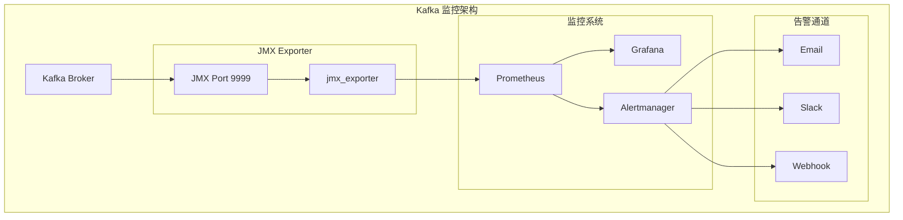

# 日志监控指标

## 目录
- [1. 监控体系](#1-监控体系)
- [2. 关键性能指标](#2-关键性能指标)
- [3. 监控工具](#3-监控工具)
- [4. 告警配置](#4-告警配置)
- [5. 监控仪表盘](#5-监控仪表盘)
- [6. 实战案例](#6-实战案例)

---

## 1. 监控体系

### 1.1 监控层次

```
Kafka 日志监控层次:

┌─────────────────────────────────────────────────────────────┐
│ 应用层监控                                                    │
│ - 生产者吞吐量                                               │
│ - 消费者延迟                                                 │
│ - 消息积压                                                   │
└─────────────────────────────────────────────────────────────┘
                              ↓
┌─────────────────────────────────────────────────────────────┐
│ Broker 层监控                                                 │
│ - 日志写入速率                                               │
│ - 日志读取速率                                               │
│ - 磁盘 I/O                                                   │
└─────────────────────────────────────────────────────────────┘
                              ↓
┌─────────────────────────────────────────────────────────────┐
│ 操作系统监控                                                  │
│ - CPU 使用率                                                 │
│ - 内存使用率                                                 │
│ - 磁盘空间                                                   │
└─────────────────────────────────────────────────────────────┘
```

### 1.2 监控架构



---

## 2. 关键性能指标

### 2.1 日志写入指标

```scala
/**
 * 日志写入监控指标
 */
object LogWriteMetrics {

    // ========== 吞吐量指标 ==========

    /**
     * BytesInPerSec - 每秒写入字节数
     *
     * MBean: kafka.server:type=BrokerTopicMetrics,name=BytesInPerSec
     *
     * 阈值:
     * - 正常: < 100 MB/s
     * - 警告: 100-200 MB/s
     * - 告警: > 200 MB/s
     */
    val bytesInPerSec = "kafka.server:type=BrokerTopicMetrics,name=BytesInPerSec"

    /**
     * MessagesInPerSec - 每秒写入消息数
     *
     * MBean: kafka.server:type=BrokerTopicMetrics,name=MessagesInPerSec
     *
     * 阈值:
     * - 正常: < 100K msg/s
     * - 警告: 100K-200K msg/s
     * - 告警: > 200K msg/s
     */
    val messagesInPerSec = "kafka.server:type=BrokerTopicMetrics,name=MessagesInPerSec"

    // ========== 延迟指标 ==========

    /**
     * ProduceRequestQueueTimeMs - 生产请求队列时间
     *
     * MBean: kafka.network:type=RequestMetrics,name=RequestQueueTimeMs,request=Produce
     *
     * 阈值:
     * - 正常: < 100 ms
     * - 警告: 100-500 ms
     * - 告警: > 500 ms
     */
    val produceRequestQueueTime = "kafka.network:type=RequestMetrics,name=RequestQueueTimeMs,request=Produce"

    /**
     * ProduceRequestLocalTimeMs - 生产请求处理时间
     *
     * MBean: kafka.network:type=RequestMetrics,name=LocalTimeMs,request=Produce
     *
     * 阈值:
     * - 正常: < 100 ms
     * - 警告: 100-500 ms
     * - 告警: > 500 ms
     */
    val produceRequestLocalTime = "kafka.network:type=RequestMetrics,name=LocalTimeMs,request=Produce"

    // ========== 磁盘指标 ==========

    /**
     * LogFlushRateAndTimeMs - 日志刷盘速率和时间
     *
     * MBean: kafka.log:type=LogFlushStats,name=LogFlushRateAndTimeMs
     *
     * 阈值:
     * - 正常: < 1000 ms
     * - 警告: 1000-5000 ms
     * - 告警: > 5000 ms
     */
    val logFlushRateAndTime = "kafka.log:type=LogFlushStats,name=LogFlushRateAndTimeMs"
}
```

### 2.2 日志读取指标

```scala
/**
 * 日志读取监控指标
 */
object LogReadMetrics {

    // ========== 吞吐量指标 ==========

    /**
     * BytesOutPerSec - 每秒读取字节数
     *
     * MBean: kafka.server:type=BrokerTopicMetrics,name=BytesOutPerSec
     *
     * 阈值:
     * - 正常: < 200 MB/s
     * - 警告: 200-500 MB/s
     * - 告警: > 500 MB/s
     */
    val bytesOutPerSec = "kafka.server:type=BrokerTopicMetrics,name=BytesOutPerSec"

    /**
     * MessagesOutPerSec - 每秒读取消息数
     *
     * MBean: kafka.server:type=BrokerTopicMetrics,name=MessagesOutPerSec
     *
     * 阈值:
     * - 正常: < 200K msg/s
     * - 警告: 200K-500K msg/s
     * - 告警: > 500K msg/s
     */
    val messagesOutPerSec = "kafka.server:type=BrokerTopicMetrics,name=MessagesOutPerSec"

    // ========== 延迟指标 ==========

    /**
     * FetchRequestQueueTimeMs - 拉取请求队列时间
     *
     * MBean: kafka.network:type=RequestMetrics,name=RequestQueueTimeMs,request=Fetch
     *
     * 阈值:
     * - 正常: < 50 ms
     * - 警告: 50-200 ms
     * - 告警: > 200 ms
     */
    val fetchRequestQueueTime = "kafka.network:type=RequestMetrics,name=RequestQueueTimeMs,request=Fetch"

    /**
     * FetchRequestLocalTimeMs - 拉取请求处理时间
     *
     * MBean: kafka.network:type=RequestMetrics,name=LocalTimeMs,request=Fetch
     *
     * 阈值:
     * - 正常: < 100 ms
     * - 警告: 100-500 ms
     * - 告警: > 500 ms
     */
    val fetchRequestLocalTime = "kafka.network:type=RequestMetrics,name=LocalTimeMs,request=Fetch"
}
```

### 2.3 日志存储指标

```scala
/**
 * 日志存储监控指标
 */
object LogStorageMetrics {

    /**
     * LogSize - 日志大小
     *
     * MBean: kafka.log:type=Log,name=Size,topic=TOPIC,partition=PARTITION
     *
     * 阈值:
     * - 正常: < 10 GB
     * - 警告: 10-50 GB
     * - 告警: > 50 GB
     */
    val logSize = "kafka.log:type=Log,name=Size"

    /**
     * LogNumSegments - 日志段数量
     *
     * MBean: kafka.log:type=Log,name=NumSegments,topic=TOPIC,partition=PARTITION
     *
     * 阈值:
     * - 正常: < 100
     * - 警告: 100-500
     * - 告警: > 500
     */
    val logNumSegments = "kafka.log:type=Log,name=NumSegments"

    /**
     * LogStartOffset - 日志起始偏移量
     *
     * MBean: kafka.log:type=Log,name=LogStartOffset,topic=TOPIC,partition=PARTITION
     *
     * 用途: 监控数据删除进度
     */
    val logStartOffset = "kafka.log:type=Log,name=LogStartOffset"

    /**
     * LogEndOffset - 日志结束偏移量
     *
     * MBean: kafka.log:type=Log,name=LogEndOffset,topic=TOPIC,partition=PARTITION
     *
     * 用途: 监控数据增长
     */
    val logEndOffset = "kafka.log:type=Log,name=LogEndOffset"
}
```

### 2.4 磁盘 I/O 指标

```scala
/**
 * 磁盘 I/O 监控指标
 */
object DiskIOMetrics {

    /**
     * DiskReadBytesPerSec - 每秒读取字节数
     *
     * 命令: iostat -x 1 5
     *
     * 阈值:
     * - 正常: < 50 MB/s
     * - 警告: 50-100 MB/s
     * - 告警: > 100 MB/s
     */
    val diskReadBytesPerSec = "node_disk_read_bytes_per_second"

    /**
     * DiskWriteBytesPerSec - 每秒写入字节数
     *
     * 命令: iostat -x 1 5
     *
     * 阈值:
     * - 正常: < 100 MB/s
     * - 警告: 100-200 MB/s
     * - 告警: > 200 MB/s
     */
    val diskWriteBytesPerSec = "node_disk_write_bytes_per_second"

    /**
     * DiskIoutil - 磁盘使用率
     *
     * 命令: iostat -x 1 5
     *
     * 阈值:
     * - 正常: < 60%
     * - 警告: 60-80%
     * - 告警: > 80%
     */
    val diskIoutil = "node_disk_io_time_seconds"

    /**
     * DiskAwait - 磁盘 I/O 等待时间
     *
     * 命令: iostat -x 1 5
     *
     * 阈值:
     * - 正常: < 10 ms
     * - 警告: 10-50 ms
     * - 告警: > 50 ms
     */
    val diskAwait = "node_disk_io_time_weighted_seconds"
}
```

---

## 3. 监控工具

### 3.1 JMX 配置

```bash
# ========== 启用 JMX ==========

# 编辑启动脚本
vim /opt/kafka/bin/kafka-server-start.sh

# 添加 JMX 配置
export KAFKA_JMX_OPTS="-Dcom.sun.management.jmxremote \
-Dcom.sun.management.jmxremote.authenticate=false \
-Dcom.sun.management.jmxremote.ssl=false \
-Djava.rmi.server.hostname=192.168.1.100 \
-Dcom.sun.management.jmxremote.port=9999"

# ========== 验证 JMX ==========

# 使用 jconsole 连接
jconsole 192.168.1.100:9999

# 使用 jcmd 查询
jcmd <PID> VM.version
```

### 3.2 Prometheus 配置

```yaml
# ========== Prometheus 配置 ==========

# prometheus.yml
global:
  scrape_interval: 15s
  evaluation_interval: 15s

scrape_configs:
  # Kafka JMX Exporter
  - job_name: 'kafka'
    static_configs:
      - targets:
        - 'localhost:9999'
    relabel_configs:
      - source_labels: [__address__]
        target_label: instance
        replacement: 'kafka-broker-1'

# ========== Grafana Dashboard ==========

# 导入 Kafka Dashboard
# https://grafana.com/grafana/dashboards/721

# 或自定义 Dashboard
{
  "dashboard": {
    "title": "Kafka Log Monitoring",
    "panels": [
      {
        "title": "Bytes In/Out",
        "targets": [
          {
            "expr": "rate(kafka_server_BrokerTopicMetrics_BytesInPerSec[1m])",
            "legendFormat": "Bytes In"
          },
          {
            "expr": "rate(kafka_server_BrokerTopicMetrics_BytesOutPerSec[1m])",
            "legendFormat": "Bytes Out"
          }
        ]
      }
    ]
  }
}
```

### 3.3 监控脚本

```bash
#!/bin/bash
# metrics-collector.sh - 指标收集脚本

BROKER="localhost:9092"
JMX_PORT="9999"
OUTPUT_FILE="/var/log/kafka/metrics.log"

# ========== 收集 JMX 指标 ==========

collect_jmx_metrics() {
    local timestamp=$(date +%s)

    # BytesInPerSec
    local bytes_in=$(jconsole -batch $JMX_PORT 2>/dev/null | \
      grep "kafka.server:type=BrokerTopicMetrics,name=BytesInPerSec" | \
      awk '{print $2}')

    # BytesOutPerSec
    local bytes_out=$(jconsole -batch $JMX_PORT 2>/dev/null | \
      grep "kafka.server:type=BrokerTopicMetrics,name=BytesOutPerSec" | \
      awk '{print $2}')

    # 写入日志
    echo "$timestamp,bytes_in=$bytes_in,bytes_out=$bytes_out" >> $OUTPUT_FILE
}

# ========== 收集磁盘指标 ==========

collect_disk_metrics() {
    local timestamp=$(date +%s)

    # 磁盘使用率
    local disk_usage=$(df -h /data/kafka | tail -1 | awk '{print $5}' | sed 's/%//')

    # I/O 使用率
    local io_util=$(iostat -x 1 2 | grep avg | awk '{print $12}')

    # 写入日志
    echo "$timestamp,disk_usage=$disk_usage,io_util=$io_util" >> $OUTPUT_FILE
}

# ========== 主循环 ==========

while true; do
    collect_jmx_metrics
    collect_disk_metrics
    sleep 60
done
```

---

## 4. 告警配置

### 4.1 告警规则

```yaml
# ========== Prometheus 告警规则 ==========

groups:
  - name: kafka_log_alerts
    interval: 30s
    rules:
      # 磁盘空间告警
      - alert: KafkaDiskSpaceLow
        expr: node_filesystem_avail_bytes{mountpoint="/data/kafka"} / node_filesystem_size_bytes{mountpoint="/data/kafka"} < 0.2
        for: 5m
        labels:
          severity: warning
        annotations:
          summary: "Kafka disk space low on {{ $labels.instance }}"
          description: "Disk space is below 20% on {{ $labels.instance }}"

      # 写入速率告警
      - alert: KafkaWriteRateHigh
        expr: rate(kafka_server_BrokerTopicMetrics_BytesInPerSec[5m]) > 200 * 1024 * 1024
        for: 5m
        labels:
          severity: warning
        annotations:
          summary: "Kafka write rate high on {{ $labels.instance }}"
          description: "Write rate is {{ $value }} bytes/sec"

      # 读取延迟告警
      - alert: KafkaFetchLatencyHigh
        expr: histogram_quantile(0.99, rate(kafka_network_RequestMetrics_Name_LocalTimeMs_request_Fetch_bucket[5m])) > 500
        for: 5m
        labels:
          severity: warning
        annotations:
          summary: "Kafka fetch latency high on {{ $labels.instance }}"
          description: "P99 fetch latency is {{ $value }} ms"

      # 日志段数量告警
      - alert: KafkaLogSegmentsHigh
        expr: kafka_log_Name_NumSegments > 500
        for: 10m
        labels:
          severity: info
        annotations:
          summary: "Kafka log segments high on {{ $labels.topic }}"
          description: "Topic {{ $labels.topic }} has {{ $value }} segments"
```

### 4.2 告警通知

```yaml
# ========== Alertmanager 配置 ==========

global:
  resolve_timeout: 5m
  slack_api_url: 'https://hooks.slack.com/services/YOUR/SLACK/WEBHOOK'

route:
  group_by: ['alertname', 'cluster', 'service']
  group_wait: 10s
  group_interval: 10s
  repeat_interval: 12h
  receiver: 'default'

  routes:
    # 严重告警立即发送
    - match:
        severity: critical
      receiver: 'critical'
      group_wait: 0s

    # 警告告警聚合发送
    - match:
        severity: warning
      receiver: 'warning'
      group_wait: 30s

receivers:
  # 默认接收器
  - name: 'default'
    slack_configs:
      - channel: '#kafka-alerts'
        title: '{{ .GroupLabels.alertname }}'
        text: '{{ range .Alerts }}{{ .Annotations.description }}{{ end }}'

  # 严重告警接收器
  - name: 'critical'
    slack_configs:
      - channel: '#kafka-critical'
        title: '🚨 CRITICAL: {{ .GroupLabels.alertname }}'
        text: '{{ range .Alerts }}{{ .Annotations.description }}{{ end }}'
        send_resolved: true

    email_configs:
      - to: 'ops@example.com'
        subject: '🚨 CRITICAL: {{ .GroupLabels.alertname }}'
        body: '{{ range .Alerts }}{{ .Annotations.description }}{{ end }}'

  # 警告告警接收器
  - name: 'warning'
    slack_configs:
      - channel: '#kafka-warnings'
        title: '⚠️ WARNING: {{ .GroupLabels.alertname }}'
        text: '{{ range .Alerts }}{{ .Annotations.description }}{{ end }}'
        send_resolved: true
```

### 4.3 告警测试

```bash
#!/bin/bash
# alert-test.sh - 告警测试脚本

# ========== 测试磁盘空间告警 ==========

# 创建大文件
dd if=/dev/zero of=/data/kafka/test.dat bs=1G count=100

# 等待告警触发
sleep 60

# 清理测试文件
rm /data/kafka/test.dat

# ========== 测试写入速率告警 ==========

# 使用 kafka-producer-perf-test 产生高负载
kafka-producer-perf-test.sh \
  --topic test-topic \
  --num-records 10000000 \
  --record-size 1024 \
  --throughput 1000000 \
  --producer-props bootstrap.servers=localhost:9092

# ========== 测试延迟告警 ==========

# 模拟延迟
tc qdisc add dev eth0 root netem delay 100ms

# 等待告警触发
sleep 60

# 恢复正常
tc qdisc del dev eth0 root
```

---

## 5. 监控仪表盘

### 5.1 Grafana Dashboard

```json
{
  "dashboard": {
    "title": "Kafka Log Monitoring",
    "panels": [
      {
        "title": "Log Throughput",
        "type": "graph",
        "targets": [
          {
            "expr": "rate(kafka_server_BrokerTopicMetrics_BytesInPerSec[1m])",
            "legendFormat": "Bytes In"
          },
          {
            "expr": "rate(kafka_server_BrokerTopicMetrics_BytesOutPerSec[1m])",
            "legendFormat": "Bytes Out"
          }
        ]
      },
      {
        "title": "Log Latency",
        "type": "graph",
        "targets": [
          {
            "expr": "histogram_quantile(0.99, rate(kafka_network_RequestMetrics_Name_LocalTimeMs_request_Produce_bucket[5m]))",
            "legendFormat": "Produce P99"
          },
          {
            "expr": "histogram_quantile(0.99, rate(kafka_network_RequestMetrics_Name_LocalTimeMs_request_Fetch_bucket[5m]))",
            "legendFormat": "Fetch P99"
          }
        ]
      },
      {
        "title": "Disk Usage",
        "type": "gauge",
        "targets": [
          {
            "expr": "node_filesystem_avail_bytes{mountpoint=\"/data/kafka\"} / node_filesystem_size_bytes{mountpoint=\"/data/kafka\"}"
          }
        ]
      },
      {
        "title": "Log Segments",
        "type": "table",
        "targets": [
          {
            "expr": "kafka_log_Name_NumSegments"
          }
        ]
      }
    ]
  }
}
```

### 5.2 自定义监控面板

```bash
#!/bin/bash
# custom-dashboard.sh - 自定义监控面板

# ========== 安装 Grafana ==========

docker run -d \
  --name=grafana \
  -p 3000:3000 \
  -e "GF_INSTALL_PLUGINS=grafana-piechart-panel" \
  grafana/grafana

# ========== 导入 Dashboard ==========

curl -X POST \
  http://localhost:3000/api/dashboards/db \
  -H "Content-Type: application/json" \
  -d @kafka-dashboard.json

# ========== 访问 Dashboard ==========

echo "Grafana Dashboard: http://localhost:3000"
echo "Username: admin"
echo "Password: admin"
```

---

## 6. 实战案例

### 6.1 监控方案设计

```bash
#!/bin/bash
# monitoring-setup.sh - 监控方案部署

# ========== 1. 部署 JMX Exporter ==========

# 下载 jmx_exporter
wget https://repo1.maven.org/maven2/io/prometheus/jmx/jmx_prometheus_javaagent/0.16.1/jmx_prometheus_javaagent-0.16.1.jar

# 配置 jmx_exporter
cat > /opt/kafka/jmx_exporter_config.yml <<EOF
---
rules:
  - pattern: 'kafka.server<type=BrokerTopicMetrics, name=(BytesInPerSec|BytesOutPerSec)><>Count'
    name: kafka_server_BrokerTopicMetrics_$1
    type: COUNTER
  - pattern: 'kafka.log<type=Log, name=(Size|NumSegments), topic=([^,]+), partition=(\d+)><>Value'
    name: kafka_log_Name_$1
    labels:
      topic: "$2"
      partition: "$3"
    type: GAUGE
EOF

# 配置 Kafka 启动参数
export KAFKA_OPTS="-javaagent:/opt/kafka/jmx_prometheus_javaagent-0.16.1.jar=9999:/opt/kafka/jmx_exporter_config.yml"

# ========== 2. 部署 Prometheus ==========

docker run -d \
  --name=prometheus \
  -p 9090:9090 \
  -v /opt/prometheus/prometheus.yml:/etc/prometheus/prometheus.yml \
  prom/prometheus

# ========== 3. 部署 Grafana ==========

docker run -d \
  --name=grafana \
  -p 3000:3000 \
  -e "GF_SECURITY_ADMIN_PASSWORD=admin123" \
  grafana/grafana

# ========== 4. 配置数据源 ==========

curl -X POST \
  http://localhost:3000/api/datasources \
  -H "Content-Type: application/json" \
  -d '{
    "name": "Prometheus",
    "type": "prometheus",
    "url": "http://localhost:9090",
    "access": "proxy",
    "isDefault": true
  }'

echo "=== Monitoring Setup Complete ==="
echo "Prometheus: http://localhost:9090"
echo "Grafana: http://localhost:3000"
```

### 6.2 故障排查

```bash
#!/bin/bash
# troubleshooting-monitoring.sh - 故障排查脚本

echo "=== Troubleshooting Kafka Issues ==="

# ========== 1. 检查写入性能 ==========

echo "1. Checking write performance:"
kafka-producer-perf-test.sh \
  --topic test-topic \
  --num-records 10000 \
  --record-size 1024 \
  --throughput 10000 \
  --producer-props bootstrap.servers=localhost:9092

# ========== 2. 检查磁盘 I/O ==========

echo "2. Checking disk I/O:"
iostat -x 1 5

# ========== 3. 检查日志段 ==========

echo "3. Checking log segments:"
for topic in $(ls -d /data/kafka/logs/*-* | head -5); do
  count=$(ls -1 $topic/*.log 2>/dev/null | wc -l)
  echo "$(basename $topic): $count segments"
done

# ========== 4. 检查内存使用 ==========

echo "4. Checking memory usage:"
free -h

# ========== 5. 检查 JMX 指标 ==========

echo "5. Checking JMX metrics:"
jconsole 9999 &
```

---

## 7. 总结

### 7.1 关键指标速查

| 指标 | MBean | 阈值 |
|-----|------|------|
| **BytesInPerSec** | BrokerTopicMetrics | > 200 MB/s |
| **BytesOutPerSec** | BrokerTopicMetrics | > 500 MB/s |
| **ProduceLatency** | RequestMetrics | > 500 ms |
| **FetchLatency** | RequestMetrics | > 500 ms |
| **DiskUsage** | node_filesystem | > 80% |
| **LogSegments** | Log | > 500 |

### 7.2 监控最佳实践

| 实践 | 说明 |
|-----|------|
| **分层监控** | 应用层 + Broker层 + OS层 |
| **多维度** | 吞吐量 + 延迟 + 资源使用 |
| **告警分级** | Critical + Warning + Info |
| **可视化** | Grafana 仪表盘 |
| **自动化** | 自动收集 + 自动告警 |

---

**下一章**: [10. 故障排查指南](./10-log-troubleshooting.md)
