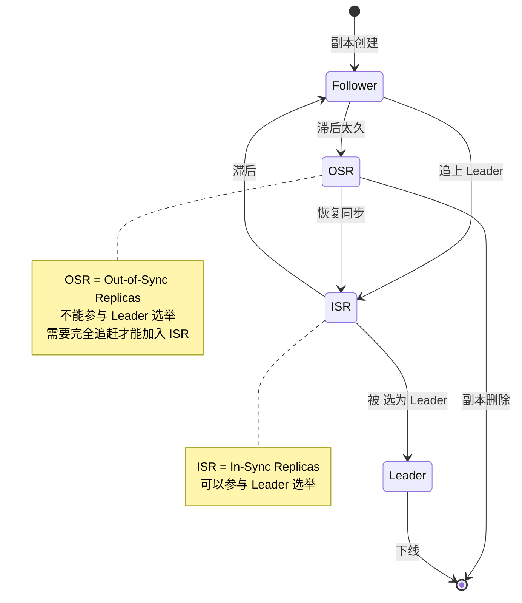
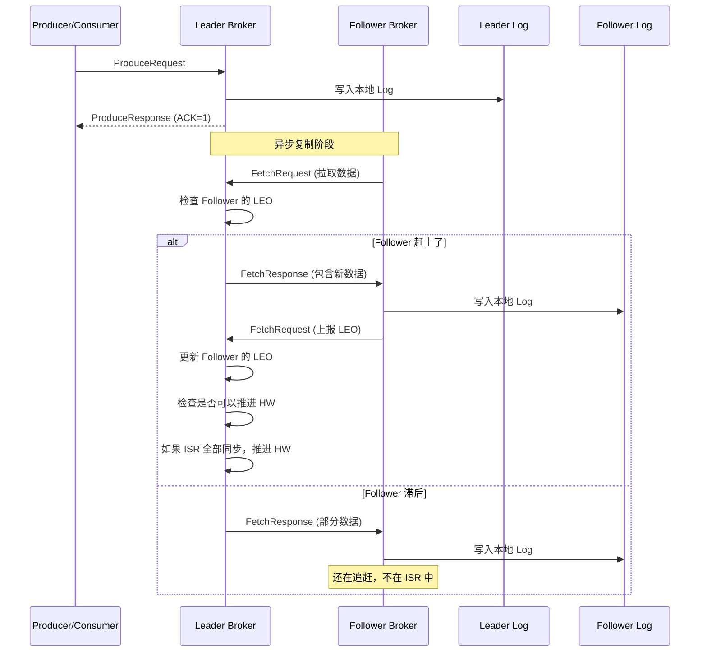
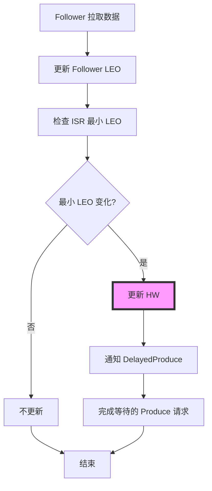
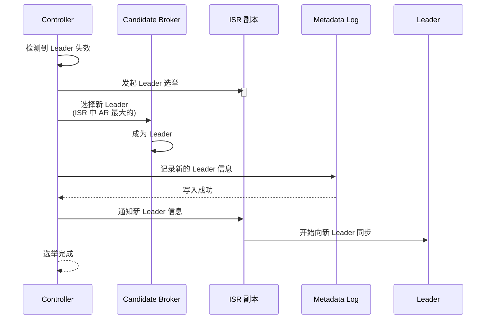

# 副本管理与同步机制深度解析

## 目录
- [1. 副本管理概览](#1-副本管理概览)
- [2. ISR 机制](#2-isr-机制)
- [3. 副本同步流程](#3-副本同步流程)
- [4. HW 管理](#4-hw-管理)
- [5. Leader 选举](#5-leader-选举)
- [6. 故障处理](#6-故障处理)
- [7. 核心设计亮点](#7-核心设计亮点)

---

## 1. 副本管理概览

### 1.1 副本角色

```
Kafka 副本的三个角色:

┌─────────────────────────────────────────────────────────────┐
│  Leader (领导副本)                                           │
├─────────────────────────────────────────────────────────────┤
│  职──────────────────────────────────────────────────────┐  │
│  │ 职责:                                                 │  │
│  │  1. 处理所有读写请求                                 │  │
│  │  2. 管理分区状态                                     │  │
│  │  3. 维护 ISR 列表                                    │  │
│  │  4. 更新 HW (High Watermark)                        │  │
│  └──────────────────────────────────────────────────────┘  │
│                                                              │
│  特点:                                                      │
│  - 每个分区有且仅有一个 Leader                               │
│  - 所有读写请求都经过 Leader                                 │
│  - 性能要求最高                                              │
└─────────────────────────────────────────────────────────────┘

┌─────────────────────────────────────────────────────────────┐
│  Follower (跟随副本)                                         │
├─────────────────────────────────────────────────────────────┤
│  职──────────────────────────────────────────────────────┐  │
│  │ 职责:                                                 │  │
│  │  1. 从 Leader 拉取数据                                │  │
│  │  2. 同步到本地日志                                    │  │
│  │  3. 向 Leader 发送确认                                │  │
│  │  4. 不处理客户端请求                                  │  │
│  └──────────────────────────────────────────────────────┘  │
│                                                              │
│  特点:                                                      │
│  - 每个分区有多个 Follower (副本数 - 1)                    │
│  - 从 Leader 异步复制数据                                   │
│  - 可升级为 Leader (当 Leader 故障时)                       │
└─────────────────────────────────────────────────────────────┘

┌─────────────────────────────────────────────────────────────┐
│  ISR (In-Sync Replicas)                                      │
├─────────────────────────────────────────────────────────────┤
│  定义: 与 Leader 保持同步的副本集合                           │
│                                                              │
│  包含:                                                       │
│  - Leader (始终在 ISR 中)                                    │
│  - 跟上 Leader 的 Follower                                   │
│                                                              │
│  作用:                                                       │
│  - 参与 Leader 选举                                         │
│  - 保证数据一致性                                           │
│  - 动态调整 (慢副本被移出)                                  │
└─────────────────────────────────────────────────────────────┘
```

### 1.2 ReplicaManager 结构

```scala
/**
 * ReplicaManager - 副本管理器
 *
 * 核心职责:
 * 1. 管理所有副本的生命周期
 * 2. 处理 Produce/Fetch 请求
 * 3. 维护 ISR 状态
 * 4. 副本同步管理
 * 5. Leader 选举协调
 */
class ReplicaManager(val config: KafkaConfig,
                     metrics: Metrics,
                     time: Time,
                     scheduler: Scheduler,
                     val logManager: LogManager,
                     val remoteLogManager: Option[RemoteLogManager],
                     quotaManagers: QuotaManagers,
                     val metadataCache: MetadataCache,
                     logDirFailureChannel: LogDirFailureChannel,
                     val alterPartitionManager: AlterPartitionManager,
                     val brokerTopicStats: BrokerTopicStats,
                     ... ) extends Logging {

  // ========== 核心数据结构 ==========

  // 1. 所有分区 (TopicPartition -> Partition)
  protected val allPartitions = new ConcurrentHashMap[TopicPartition, HostedPartition[Partition]]

  // 2. 副本拉取管理器
  val replicaFetcherManager = createReplicaFetcherManager(...)

  // 3. 副本日志目录管理器
  private[server] val replicaAlterLogDirsManager = createReplicaAlterLogDirsManager(...)

  // 4. 高水位检查点
  @volatile private[server] var highWatermarkCheckpoints: Map[String, OffsetCheckpointFile] = ...

  // 5. 延迟操作炼狱 (DelayedOperationPurgatory)
  val delayedProducePurgatory = new DelayedOperationPurgatory[DelayedProduce](...)
  val delayedFetchPurgatory = new DelayedOperationPurgatory[DelayedFetch](...)
  val delayedDeleteRecordsPurgatory = new DelayedOperationPurgatory[DelayedDeleteRecords](...)

  // ========== 关键指标 ==========
  metricsGroup.newGauge("LeaderCount", () => leaderPartitionsIterator.size)
  metricsGroup.newGauge("PartitionCount", () => allPartitions.size)
  metricsGroup.newGauge("UnderReplicatedPartitions", () => underReplicatedPartitionCount)
}
```

---

## 2. ISR 机制

### 2.1 ISR 核心概念

```scala
/**
 * ISR (In-Sync Replicas) - 同步副本集合
 *
 * 设计思想:
 * 1. 动态调整: 慢副本被移出，快副本加入
 * 2. 高可用性: ISR 中所有副本都是可用的
 * 3. 一致性保障: HW 只推进到 ISR 中最慢的副本
 *
 * ISR 调整条件:
 * - 扩展 (Expand): Follower 赶上 Leader
 * - 收缩 (Shrink): Follower 滞后太久
 */
```

### 2.2 ISR 状态图



### 2.3 ISR 收缩 (Shrink) - 慢副本移除

#### ISR 收缩配置参数

| 参数名称 | 默认值 | 说明 |
|---------|-------|------|
| **replica.lag.time.max.ms** | 30000 (30秒) | Follower 被视为不同步的最大滞后时间 |
| **replica.fetch.wait.max.ms** | 500 (500毫秒) | Follower 等待 Fetch 响应的最大时间 |
| **min.insync.replicas** | 1 | ISR 中最小副本数（影响可用性） |

#### ISR 收缩触发条件详解

```scala
/**
 * ISR 收缩机制 - 移除滞后的副本
 *
 * 触发条件 (满足任一即触发收缩):
 * 1. 时间条件: Follower 的 lastCaughtUpTimeMs 超过 replica.lag.time.max.ms
 * 2. 副本失败: Follower 连续失败超过阈值
 *
 * 检查频率:
 * - 默认: replica.lag.time.max.ms / 2 (约15秒检查一次)
 * - 可配置: replica.fetch.wait.max.ms
 *
 * 流程:
 * 1. 定期检查每个 Follower 的最后CaughtUpTimeMs
 * 2. 如果超时，从 ISR 中移除
 * 3. 更新 Leader Epoch (记录 ISR 变更)
 * 4. 通知 Controller 元数据变更
 */
def maybeShrinkIsr(): Unit = {
  // ========== 步骤1: 遍历所有 Leader 分区 ==========
  leaderPartitionsIterator.foreach { partition =>
    try {
      // ========== 步骤2: 检查是否需要收缩 ISR ==========
      val outOfSyncReplicas = partition.getOutOfSyncReplicas(
        replicaLagTimeMaxMs = config.replicaLagTimeMaxMs
      )

      if (outOfSyncReplicas.nonEmpty) {
        // ========== 步骤3: 收缩 ISR ==========
        val newIsr = partition.filterInSyncReplicas(
          inSyncReplicas = partition.inSyncReplicaIds,
          outOfSyncReplicas = outOfSyncReplicas
        )

        // ========== 步骤4: 更新分区状态 ==========
        partition.maybeShrinkIsr(newIsr.toSet)

        // ========== 步骤5: 记录指标 ==========
        isrShrinksPerSec.mark()
      }
    } catch {
      case e: Exception =>
        error(s"Error shrinking ISR for partition ${partition.topicPartition}", e)
        failedIsrUpdatesPerSec.mark()
    }
  }
}

/**
 * Partition.getOutOfSyncReplicas() - 识别不同步的副本
 */
private def getOutOfSyncReplicas(replicaLagTimeMaxMs: Long): Set[Int] = {
  inSyncReplicaIds.flatMap { replicaId =>
    val replica = remoteReplica(replicaId).getOrElse {
      // 副本不存在，视为不同步
      return Some(replicaId)
    }

    // ========== 判断是否不同步 ==========
    // 计算滞后时间
    val lastCaughtUpTimeMs = replica.lastCaughtUpTimeMsMs()
    val currentTimeMs = time.milliseconds()
    val lagMs = currentTimeMs - lastCaughtUpTimeMs

    if (lagMs > replicaLagTimeMaxMs) {
      // 滞后超过阈值，需要移出 ISR
      Some(replicaId)
    } else {
      None
    }
  }
}
```

### 2.4 ISR 扩展 (Expand) - 恢复副本加入

#### ISR 扩展配置参数

| 参数名称 | 默认值 | 说明 |
|---------|-------|------|
| **replica.fetch.max.bytes** | 1048576 (1MB) | 单次 Fetch 请求最大字节数 |
| **replica.fetch.min.bytes** | 1 | 单次 Fetch 请求最小字节数 |
| **replica.fetch.wait.max.ms** | 500 | Follower 等待最小数据量的最大时间 |
| **replica.fetch.backoff.ms** | 1000 | Fetch 失败后的退避时间 |

#### ISR 扩展触发条件详解

```scala
/**
 * ISR 扩展机制 - 将赶上的副本加入 ISR
 *
 * 核心条件 (必须全部满足):
 * 1. Offset 条件: Follower 的 LEO ≥ 当前 HW
 * 2. 时间条件: Follower 持续同步超过 replica.lag.time.max.ms
 * 3. 副本状态: Follower 处于在线状态
 *
 * 优化策略:
 * - 批量检查: 每次 Fetch 请求时检查多个候选副本
 * - 增量更新: 只增加新副本，不移除现有副本
 * - 避免抖动: 引入 min.insync.replicas 避免频繁变更
 *
 * 流程:
 * 1. Follower 拉取数据时更新自己的 LEO
 * 2. Leader 收到 FetchRequest，检查 Follower 的 LEO
 * 3. 如果满足条件，将 Follower 加入 ISR
 * 4. 更新 HW (High Watermark)
 */
private def maybeExpandIsr(partition: Partition): Unit = {
  val leaderLog = partition.localLogOrException
  val currentIsr = partition.inSyncReplicaIds

  // ========== 步骤1: 获取所有副本的 LEO ==========
  val replicaLogEndOffsets = partition.remoteReplicas.map { replica =>
    replica.id -> replica.lastFetchLeaderLogEndOffset
  }.toMap

  // ========== 步骤2: 识别可以加入 ISR 的副本 ==========
  val candidateReplicaIds = replicaLogEndOffsets.filter { case (replicaId, leo) =>
    // 条件: LEO >= Old Leader Epoch 的 HW
    leo >= partition.highWatermark
  }.keySet

  // ========== 步骤3: 计算新 ISR ==========
  val newIsr = currentIsr ++ candidateReplicaIds

  if (newIsr.size > currentIsr.size) {
    // ========== 步骤4: 更新 ISR ==========
    partition.appendRecordsToLeader(...)

    // ========== 步骤5: 记录指标 ==========
    isrExpandRate.mark()
  }
}
```

---

## 3. 副本同步流程

### 3.1 同步架构图



### 3.2 Follower 拉取机制

```scala
/**
 * ReplicaFetcherThread - Follower 拉取线程
 *
 * 每个 Follower 副本有一个专门的拉取线程
 * 从 Leader 拉取数据并写入本地日志
 */
class ReplicaFetcherThread(
  name: String,
  fetcherId: Int,
  brokerConfig: KafkaConfig,
  sourceBroker: BrokerEndPoint,
  replicaMgr: ReplicaManager,
  ...
) extends AbstractFetcherThread(name, clientId, fetcherId, brokerConfig, replicaMgr) {

  /**
   * 核心拉取循环
   */
  override def doWork(): Unit = {
    // ========== 步骤1: 构建 FetchRequest ==========
    val fetchRequest = buildFetchRequest()

    // ========== 步骤2: 发送到 Leader ==========
    val fetchResponse = fetchFromLeader(fetchRequest)

    // ========== 步骤3: 处理 FetchResponse ==========
    processPartitionResponse(fetchResponse)
  }

  /**
   * 处理分区响应
   */
  private def processPartitionResponse(fetchResponse: FetchResponse): Unit = {
    fetchResponse.responses().forEach { response =>
      val partitionId = response.partition
      val topicPartition = new TopicPartition(topic, partitionId)

      // ========== 步骤1: 提取记录 ==========
      val records = response.records()

      if (records != null && records.sizeInBytes() > 0) {
        // ========== 步骤2: 写入本地日志 ==========
        val partition = replicaMgr.getPartition(topicPartition)
        val log = partition.localLogOrException

        // 追加到本地日志
        log.appendAsFollower(
          records = records,
          fetchOffsetInfo = fetchOffsetInfo
        )

        // ========== 步骤3: 更新 Follower 的 LEO ==========
        partition.updateFollowerFetchState(
          replicaId = sourceBroker.id,
          fetchOffset = fetchOffset,
          currentLeaderEpoch = response.leaderEpoch
        )
      }
    }
  }
}
```

### 3.3 LEO (Log End Offset) 管理

```java
/**
 * LEO - Log End Offset
 *
 * 定义: 日志末尾 Offset (下一条待写入消息的 Offset)
 *
 * 作用:
 * - Leader: 追加消息后递增
 * - Follower: 拉取并写入后递增
 * - 用于判断 Follower 是否追上
 */

/**
 * Partition 维护的 LEO 映射
 */
public class Partition {
    // ========== 副本 LEO 映射 ==========
    // Key: replicaId, Value: 该副本的 LEO
    private final ConcurrentMap<Integer, Long> remoteReplicaLEO = new ConcurrentHashMap<>();

    /**
     * 更新 Follower 的 LEO
     */
    public void updateFollowerFetchState(
        int replicaId,
        long fetchOffset,
        long leaderEpoch
    ) {
        // ========== 步骤1: 更新 LEO ==========
        remoteReplicaLEO.put(replicaId, fetchOffset);

        // ========== 步骤2: 检查是否需要扩展 ISR ==========
        if (maybeExpandIsr()) {
            // ISR 扩展了
        }

        // ========== 步骤3: 检查是否需要推进 HW ==========
        maybeUpdateHighWatermark(leaderLog);
    }

    /**
     * 获取副本的 LEO
     */
    public long followerReplicaLEO(int replicaId) {
        return remoteReplicaLEO.getOrDefault(replicaId, 0L);
    }
}
```

---

## 4. HW 管理

### 4.1 HW (High Watermark) 核心概念

```scala
/**
 * HW - High Watermark (高水位)
 *
 * 定义: ISR 中所有副本都已同步的 Offset
 *
 * 作用:
 * 1. 数据可见性: ≤ HW 的消息对 Consumer 可见
 * 2. 一致性保障: 已提交消息 (Committed)
 * 3. 故障恢复: ISR 中任一副本成为 Leader，都不会丢失数据
 *
 * 示例:
 * Leader  LEO = 10 (本地有 10 条消息)
 * Follower LEO = 8  (有 8 条消息)
 * Follower LEO = 7  (有 7 条消息)
 * → HW = 7 (取 ISR 中的最小 LEO)
 * → Offset ≤ 7 的消息是"已提交"的
 */

/**
 * HW 更新条件
 *
 * HW = min(ISR 中所有副本的 LEO)
 *
 * 何时更新:
 * 1. ISR 中所有副本都拉取了最新的数据
 * 2. Leader 收到所有 ISR 副本的 FetchRequest
 * 3. 最小 LEO 发生变化
 */
```

### 4.2 HW 更新流程



```scala
/**
 * 更新 HW 的核心逻辑
 */
private def maybeUpdateHighWatermark(partition: Partition): Unit = {
  val leaderLog = partition.localLogOrException

  // ========== 步骤1: 获取 ISR 所有副本的 LEO ==========
  val isrLEOs = partition.inSyncReplicaIds.map { replicaId =>
    if (replicaId == localBrokerId) {
      // Leader 本身的 LEO
      leaderLog.logEndOffset
    } else {
      // Follower 的 LEO
      partition.followerReplicaLEO(replicaId)
    }
  }

  // ========== 步骤2: 计算新的 HW ==========
  // HW = min(ISR 中所有副本的 LEO)
  val newHighWatermark = isrLEOs.min

  // ========== 步骤3: 检查 HW 是否需要更新 ==========
  val oldHighWatermark = partition.highWatermark
  if (newHighWatermark > oldHighWatermark) {
    // ========== 步骤4: 更新 HW ==========
    leaderLog.updateHighWatermark(newHighWatermark)

    // ========== 步骤5: 完成延迟的 Produce 请求 ==========
    // 等待 HW 推进的请求可以被完成
    delayedProducePurgatory.checkAndComplete(
      topicPartition = partition.topicPartition,
      key = newHighWatermark
    )

    // ========== 步骤6: 持久化 HW ==========
    checkpointHighWatermarks()
  }
}
```

### 4.3 HW 与 Consumer 可见性

```java
/**
 * HW 决定 Consumer 可见的消息
 *
 * Consumer Fetch 流程:
 * 1. Consumer 发送 FetchRequest
 * 2. Leader 根据 HW 过滤消息
 * 3. 只返回 offset ≤ HW 的消息
 * 4. 确保 Consumer 读到的是"已提交"的消息
 */

public class Partition {
    /**
     * 读取日志时应用 HW 限制
     */
    public LogReadInfo read(
        long fetchOffset,
        int maxLength,
        FetchIsolation isolation
    ) {
        UnifiedLog log = localLogOrException;

        // ========== 根据隔离级别读取 ==========
        switch (isolation) {
            case FETCH_LOG_END:
                // 读取到 LEO (可能包含未提交数据)
                return log.read(fetchOffset, maxLength);

            case HIGH_WATERMARK:
                // 读取到 HW (只包含已提交数据)
                // 这是默认行为
                long maxOffset = highWatermark;
                return log.read(fetchOffset, maxLength, maxOffset);

            case TRANSACTIONAL:
                // 事务隔离级别
                // 只返回已中止事务之后的数据
                return readTransactionally(fetchOffset, maxLength);
        }
    }
}
```

---

## 5. Leader 选举

### 5.1 选举触发条件

```
Leader 选举的触发条件:

1. Controller 指示
   - 分区创建时
   - 副本重新分配时
   - 优先级选举时

2. 当前 Leader 失效
   - Leader 所在 Broker 故障
   - Leader 网络分区
   - Leader 主动下线

3. Unclean Leader 选举
   - ISR 中所有副本都失效
   - 允许 OSR 副本成为 Leader
   - 可能丢失数据
```

### 5.2 Leader 选举流程



### 5.3 分区 Leader 选举

```scala
/**
 * Partition.makeLeader() - 成为 Leader
 *
 * 被选为 Leader 后的初始化流程
 */
def makeLeader(
  controllerEpoch: Int,
  newLeaderEpoch: Int,
  isNewLeader: Boolean
): Unit = {
  // ========== 步骤1: 更新状态 ==========
  stateChangeLogger.info(
    s"Adding leader for partition $topicPartition\n" +
    s"Current state: ${leaderStateIfLocal().orElse("none")}"
  )

  // ========== 步骤2: 初始化 Leader 副本 ==========
  val leaderReplica = localReplica()
  if (leaderReplica.isDefined) {
    leaderReplica.get.convertToLocal(
      newLeaderEpoch,
      isNewLeader
    )
  }

  // ========== 步骤3: 初始化 HW ==========
  // 从 Leader Epoch 文件中恢复 HW
  val hw = logManager.highWatermark(topicPartition)
  if (hw.isPresent) {
    log.updateHighWatermark(hw.get())
  }

  // ========== 步骤4: 标记为可提供服务的 Leader ==========
  // 开始接受 Produce/Fetch 请求

  stateChangeLogger.info(s"Completed leader transition for $topicPartition")
}

/**
 * Partition.makeFollower() - 成为 Follower
 *
 * 不再是 Leader 后转为 Follower
 */
def makeFollower(
  controllerEpoch: Int,
  newLeaderEpoch: Int,
  newLeaderBrokerId: Int,
  isNewLeader: Boolean
): Unit = {
  // ========== 步骤1: 更新状态 ==========
  stateChangeLogger.info(
    s"Adding follower for partition $topicPartition\n" +
    s"Current state: ${leaderStateIfLocal().orElse("none")}\n" +
    s"New leader: $newLeaderBrokerId"
  )

  // ========== 步骤2: 初始化 Follower 副本 ==========
  val followerReplica = localReplica()
  if (followerReplica.isDefined) {
    followerReplica.get.convertToFollower(
      newLeaderEpoch,
      isNewLeader
    )
  }

  // ========== 步骤3: 开始从 Leader 拉取数据 ==========
  // ReplicaFetcherManager 会处理

  // ========== 步骤4: 清空未确认的消息 ==========
  // 移除 DelayedProducePurgatory 中等待的请求

  stateChangeLogger.info(s"Completed follower transition for $topicPartition")
}
```

---

## 6. 故障处理

### 6.1 Follower 故障

```
场景: Follower 崩溃或网络中断

检测:
- Leader 定期检查 Follower 的 lastCaughtUpTimeMs
- 超过 replica.lag.time.max.ms 视为故障

处理流程:
1. 将 Follower 从 ISR 中移出
2. 更新 ISR 版本
3. 通知 Controller
4. 继续服务 (ISR 中还有其他副本)

恢复:
1. Follower 重启
2. 向 Leader 发送 OffsetForLeaderEpochRequest
3. 获取最新的 Leader Epoch
4. 截断到该 Epoch 对应的 HW
5. 开始从 Leader 拉取数据
6. 赶上后重新加入 ISR
```

### 6.2 Leader 故障

```
场景: Leader 崩溃

检测:
- Controller 通过心跳检测到 Leader 失效
- ISR 中副本通过 Leader Epoch 检测到失效

处理流程:
1. Controller 从 ISR 中选择新的 Leader
2. 选择策略: AR (Assigned Replica) 最优先
3. 更新元数据 __cluster_metadata Topic
4. 通知所有 ISR 副本
5. 新 Leader 开始服务
6. 其他 Follower 向新 Leader 同步

数据一致性:
- 新 Leader 从旧 HW 开始服务
- 未被 ISR 确认的数据可能丢失
- Consumer 至少看到一次 (At-Least-Once)
```

### 6.3 数据不一致处理

```scala
/**
 * 日志截断 (Truncation) - 处理数据不一致
 *
 * 问题场景:
 * - Leader 故障前，部分数据未被 ISR 确认
 * - 新 Leader 没有这些数据
 * - 旧 Leader 恢复后成为 Follower
 *
 * 解决方案:
 * - Follower 根据 Leader Epoch 截断日志
 * - 删除不一致的数据
 * - 从 Leader 重新拉取
 */

/**
 * Follower 的日志截断流程
 */
def truncateTo(leaderEpoch: Int, leaderEndOffset: Long): Unit = {
  val localLog = localLogOrException

  // ========== 步骤1: 查找需要截断的 Offset ==========
  val truncationOffset = localLog.truncationOffsetFor(leaderEpoch)

  if (truncationOffset.isPresent) {
    // ========== 步骤2: 截断日志 ==========
    localLog.truncateTo(truncationOffset.get())

    // ========== 步骤3: 更新 LEO ==========
    partition.updateFollowerFetchState(
      replicaId = localBrokerId,
      fetchOffset = truncationOffset.get(),
      leaderEpoch = leaderEpoch
    )

    stateChangeLogger.info(
      s"Truncated log $topicPartition to offset ${truncationOffset.get()}"
    )
  }
}
```

---

## 7. 核心设计亮点

### 7.1 ISR 动态调整

```scala
/**
 * 设计亮点: 动态调整 ISR
 *
 * 传统方案:
 * - 静态副本集合
 * - 慢副本拖累整个集群
 * - 所有副本必须同步确认
 *
 * Kafka 方案:
 * - ISR 动态调整
 * - 慢副本自动移出 ISR
 * - 快副本可以重新加入
 * - 保证性能的同时提供可靠性
 */

优势:
1. 性能优化
   - 不等待慢副本
   - Produce 延迟不增加

2. 高可用性
   - ISR 中副本保持同步
   - 任一副本都能成为 Leader

3. 自适应
   - 网络波动时自动调整
   - 故障恢复后自动加入
```

### 7.2 HW 一致性保障

```java
/**
 * HW 机制 - 已提交消息的定义
 *
 * 关键约束:
 * HW = min(ISR 中所有副本的 LEO)
 *
 * 推论:
 * 1. HW 之前的消息已被 ISR 所有副本确认
 * 2. 任一副本成为 Leader，都不会丢失这些数据
 * 3. Consumer 只读已提交消息 (≤ HW)
 */

/**
 * HW 与 Exactly-Once 语义
 *
 * 问题: 如何保证消息不丢失、不重复？
 *
 * 答案:
 * 1. Producer:
 *    - 启用幂等性 (enable.idempotence=true)
 *    - ACKS=all (等待 ISR 确认)
 *
 * 2. Broker:
 *    - HW 推进机制
 *    - ISR 管理
 *
 * 3. Consumer:
 *    - Offset 提交到 HW
 *    - 只消费 ≤ HW 的消息
 *
 * 结果: At-Least-Once + 幂等 = Exactly-Once
 */
```

### 7.3 Leader Epoch 机制

```scala
/**
 * Leader Epoch - Leader 的版本号
 *
 * 作用:
 * 1. 识别过期的 Leader
 * 2. 防止"脑裂" (Split-Brain)
 * 3. 保证数据一致性
 *
 * 示例:
 * Leader Epoch 0: Broker-A 是 Leader
 * Leader Epoch 1: Broker-B 是 Leader (A 故障)
 * Leader Epoch 2: Broker-A 是 Leader (B 故障，A 恢复)
 *
 * 如果 Epoch 2 的 Leader 收到 Epoch 1 的请求
 * → 识别为过期 Leader
 * → 拒绝请求
 * → 避免数据不一致
 */

/**
 * Leader Epoch 文件
 * 格式:
 * ┌──────────────┬──────────────┐
 * │ Leader Epoch │  End Offset  │
 * ├──────────────┼──────────────┤
 * │      0       │    100       │
 * │      1       │    200       │
 * │      2       │    350       │
 * │     ...      │    ...       │
 * └──────────────┴──────────────┘
 *
 * 用途:
 * - 崩溃恢复时确定截断位置
 * - 判断 Leader 是否过期
 * - 解决数据不一致
 */
```

### 7.4 延迟操作机制

```scala
/**
 * DelayedOperationPurgatory - 延迟操作炼狱
 *
 * 设计思想:
 * - 等待条件满足时立即完成操作
 * - 不阻塞线程，提高吞吐量
 *
 * 应用场景:
 * 1. DelayedProduce: 等待 ISR 确认
 * 2. DelayedFetch: 等待新数据到达
 * 3. DelayedDeleteRecords: 等待日志段可删除
 */

/**
 * DelayedProduce - 等待 ISR 确认
 *
 * 流程:
 * 1. Producer 发送 ProduceRequest
 * 2. 如果 acks=all，不能立即响应
 * 3. 创建 DelayedProduce，加入 Purgatory
 * 4. Follower 确认后，检查是否完成
 * 5. 所有 ISR 确认，完成操作
 * 6. 响应 Producer
 */
```

---

## 8. 总结

### 8.1 副本管理设计精髓

| 设计 | 说明 | 优势 |
|-----|------|------|
| **ISR 动态调整** | 慢副本移出，快副本加入 | 性能和可靠性平衡 |
| **HW 机制** | ISR 最小 LEO 作为 HW | 数据一致性保障 |
| **Leader Epoch** | Leader 版本号 | 防止脑裂，数据一致性 |
| **异步复制** | Follower 从 Leader 拉取 | 提高吞吐量 |
| **延迟操作** | 等待条件满足 | 不阻塞线程 |

### 8.2 关键配置参数

| 参数 | 默认值 | 说明 |
|-----|-------|------|
| `replica.lag.time.max.ms` | 30000 | Follower 滞后多久被移出 ISR |
| `replica.fetch.wait.max.ms` | 500 | Follower 拉取的最大等待时间 |
| `replica.fetch.max.bytes` | 10485760 | 单次拉取的最大字节数 |
| `min.insync.replicas` | 1 | ISR 的最小副本数 |
| `unclean.leader.election.enable` | false | 是否允许 OSR 成为 Leader |

### 8.3 性能优化

```scala
/**
 * 优化技巧
 */

// 1. 增加副本数提高可靠性
// 但会降低性能
replication.factor = 3

// 2. 设置合理的 min.insync.replicas
// 平衡性能和可靠性
min.insync.replicas = 2

// 3. 调整 replica.lag.time.max.ms
// 网络环境好时可以减小
replica.lag.time.max.ms = 10000

// 4. 批量拉取
replica.fetch.max.bytes = 10485760
replica.fetch.wait.max.ms = 100

// 5. 禁用 unclean leader election
// 保证数据一致性
unclean.leader.election.enable = false
```

---

**下一步**: [05. Controller 控制器](../05-controller/01-controller.md)
