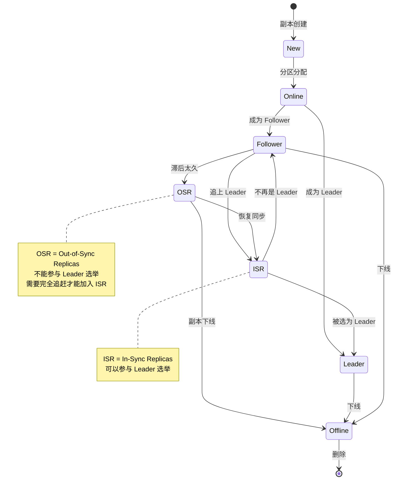
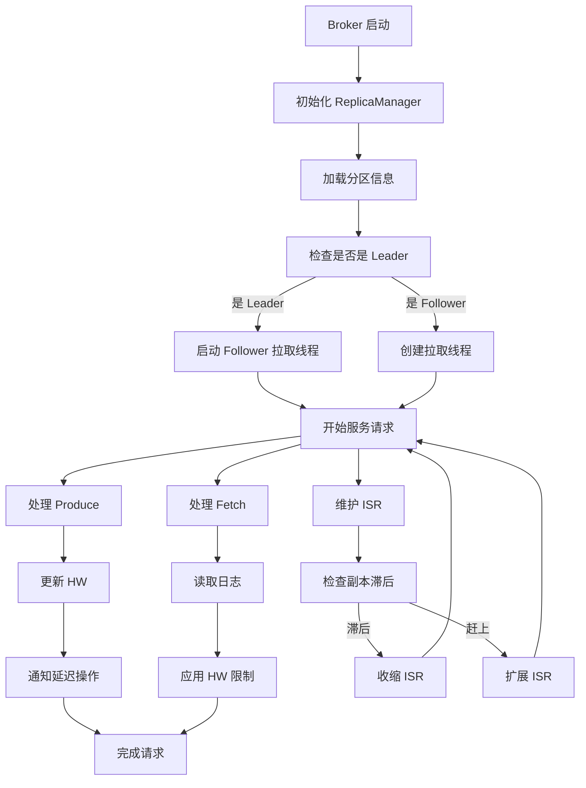
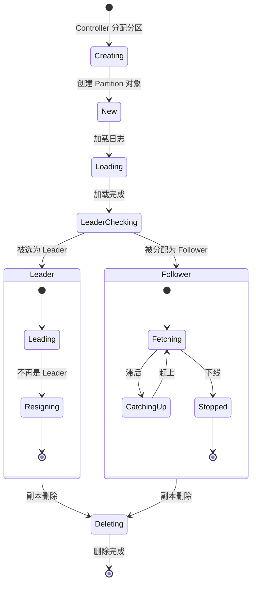

# 01. 副本管理概述

## 目录
- [1. 副本角色与职责](#1-副本角色与职责)
- [2. ReplicaManager 架构](#2-replicamanager-架构)
- [3. 副本生命周期](#3-副本生命周期)
- [4. 核心数据结构](#4-核心数据结构)
- [5. 副本管理最佳实践](#5-副本管理最佳实践)

---

## 1. 副本角色与职责

### 1.1 副本的三个角色

```
Kafka 副本的三个角色:

┌─────────────────────────────────────────────────────────────┐
│  Leader (领导副本)                                           │
├─────────────────────────────────────────────────────────────┤
│  职──────────────────────────────────────────────────────┐  │
│  │ 职责:                                                 │  │
│  │  1. 处理所有读写请求                                 │  │
│  │  2. 管理分区状态                                     │  │
│  │  3. 维护 ISR 列表                                    │  │
│  │  4. 更新 HW (High Watermark)                        │  │
│  └──────────────────────────────────────────────────────┘  │
│                                                              │
│  特点:                                                      │
│  - 每个分区有且仅有一个 Leader                               │
│  - 所有读写请求都经过 Leader                                 │
│  - 性能要求最高                                              │
└─────────────────────────────────────────────────────────────┘

┌─────────────────────────────────────────────────────────────┐
│  Follower (跟随副本)                                         │
├─────────────────────────────────────────────────────────────┤
│  职──────────────────────────────────────────────────────┐  │
│  │ 职责:                                                 │  │
│  │  1. 从 Leader 拉取数据                                │  │
│  │  2. 同步到本地日志                                    │  │
│  │  3. 向 Leader 发送确认                                │  │
│  │  4. 不处理客户端请求                                  │  │
│  └──────────────────────────────────────────────────────┘  │
│                                                              │
│  特点:                                                      │
│  - 每个分区有多个 Follower (副本数 - 1)                    │
│  - 从 Leader 异步复制数据                                   │
│  - 可升级为 Leader (当 Leader 故障时)                       │
└─────────────────────────────────────────────────────────────┘

┌─────────────────────────────────────────────────────────────┐
│  ISR (In-Sync Replicas)                                      │
├─────────────────────────────────────────────────────────────┤
│  定义: 与 Leader 保持同步的副本集合                           │
│                                                              │
│  包含:                                                       │
│  - Leader (始终在 ISR 中)                                    │
│  - 跟上 Leader 的 Follower                                   │
│                                                              │
│  作用:                                                       │
│  - 参与 Leader 选举                                         │
│  - 保证数据一致性                                           │
│  - 动态调整 (慢副本被移出)                                  │
└─────────────────────────────────────────────────────────────┘
```

### 1.2 副本状态图



### 1.3 Leader vs Follower 对比

| 特性 | Leader | Follower |
|-----|--------|----------|
| **读写请求** | 处理所有读写 | 不处理客户端请求 |
| **数据来源** | 接收 Producer 数据 | 从 Leader 拉取 |
| **ISR 状态** | 始终在 ISR 中 | 可能被移出 ISR |
| **选举资格** | N/A | ISR 中可被选为 Leader |
| **数量** | 每分区 1 个 | 每分区 N-1 个 |
| **网络负载** | 高 | 中 |
| **磁盘写入** | 接收数据写入 | 拉取数据写入 |

---

## 2. ReplicaManager 架构

### 2.1 ReplicaManager 核心结构

```scala
/**
 * ReplicaManager - 副本管理器
 *
 * 核心职责:
 * 1. 管理所有副本的生命周期
 * 2. 处理 Produce/Fetch 请求
 * 3. 维护 ISR 状态
 * 4. 副本同步管理
 * 5. Leader 选举协调
 */
class ReplicaManager(val config: KafkaConfig,
                     metrics: Metrics,
                     time: Time,
                     scheduler: Scheduler,
                     val logManager: LogManager,
                     val remoteLogManager: Option[RemoteLogManager],
                     quotaManagers: QuotaManagers,
                     val metadataCache: MetadataCache,
                     logDirFailureChannel: LogDirFailureChannel,
                     val alterPartitionManager: AlterPartitionManager,
                     val brokerTopicStats: BrokerTopicStats,
                     ... ) extends Logging {

  // ========== 核心数据结构 ==========

  // 1. 所有分区 (TopicPartition -> Partition)
  protected val allPartitions = new ConcurrentHashMap[TopicPartition, HostedPartition[Partition]]

  // 2. 副本拉取管理器
  val replicaFetcherManager = createReplicaFetcherManager(...)

  // 3. 副本日志目录管理器
  private[server] val replicaAlterLogDirsManager = createReplicaAlterLogDirsManager(...)

  // 4. 高水位检查点
  @volatile private[server] var highWatermarkCheckpoints: Map[String, OffsetCheckpointFile] = ...

  // 5. 延迟操作炼狱 (DelayedOperationPurgatory)
  val delayedProducePurgatory = new DelayedOperationPurgatory[DelayedProduce](...)
  val delayedFetchPurgatory = new DelayedOperationPurgatory[DelayedFetch](...)
  val delayedDeleteRecordsPurgatory = new DelayedOperationPurgatory[DelayedDeleteRecords](...)
  val delayedElectPurgatory = new DelayedOperationPurgatory[DelayedElectLeader](...)

  // ========== 关键指标 ==========
  metricsGroup.newGauge("LeaderCount", () => leaderPartitionsIterator.size)
  metricsGroup.newGauge("PartitionCount", () => allPartitions.size)
  metricsGroup.newGauge("UnderReplicatedPartitions", () => underReplicatedPartitionCount)
  metricsGroup.newGauge("ISRShrinksPerSec", () => isrShrinksPerSec.count())
  metricsGroup.newGauge("ISRExpandsPerSec", () => isrExpandRate.count())
}
```

### 2.2 ReplicaManager 职责详解

#### 2.2.1 分区管理

```scala
/**
 * 分区管理 - 分区的增删改查
 */

// 启动分区
def startPartition(topicPartition: TopicPartition): Unit = {
  // 1. 创建 Partition 对象
  // 2. 加载日志
  // 3. 初始化副本状态
}

// 停止分区
def stopPartition(topicPartition: TopicPartition): Unit = {
  // 1. 关闭文件句柄
  // 2. 清理资源
  // 3. 从 allPartitions 移除
}

// 获取分区
def getPartition(topicPartition: TopicPartition): Option[Partition] = {
  allPartitions.get(topicPartition) match {
    case None => None
    case Some(hostedPartition) => hostedPartition.partition
  }
}
```

#### 2.2.2 请求处理

```scala
/**
 * Produce 请求处理
 */
def produce(request: RequestChannel.Request): Unit = {
  val produceRequest = request.body[ProduceRequest]

  // 1. 权限检查
  // 2. 检查分区 Leader 是否在本地
  // 3. 追加消息到日志
  // 4. 更新 HW (如果有必要)
  // 5. 响应客户端

  val (allowedTopics, disallowedTopics) = produceRequest.topicData.keys.partition(
    topic => authorize(request.session, Write, Resource.Topic(topic))
  )

  // 处理允许的 Topic
  val result = appendRecords(
    timeout = produceRequest.timeout.toLong,
    requiredAcks = produceRequest.acks.toShort,
    internalTopicsAllowed = internalTopicsAllowed,
    entriesPerPartition = allowedTopics,
    requestLocal = requestLocal
  )
}

/**
 * Fetch 请求处理
 */
def fetch(request: RequestChannel.Request): Unit = {
  val fetchRequest = request.body[FetchRequest]

  // 1. 权限检查
  // 2. 读取日志数据
  // 3. 应用 HW 限制
  // 4. 响应客户端

  val result = readFromLocalLog(
    fetchOnlyFromLeader = fetchRequest.fetchOnlyLeader(),
    fetchIsolation = fetchRequest.isolationLevel,
    fetchMaxBytes = fetchRequest.maxBytes,
    hardMaxBytesLimit = false,
    readPartitionInfo = partitionFetchSizes,
    quota = readQuota,
    responseContext = responseContext
  )
}
```

### 2.3 ReplicaManager 工作流程



---

## 3. 副本生命周期

### 3.1 副本创建流程

```scala
/**
 * 副本创建 - 分区分配时
 */
def createPartition(topicPartition: TopicPartition,
                   replicaAssignment: ReplicaAssignment): Unit = {

  // ========== 步骤1: 创建 Partition 对象 ==========
  val partition = Partition(
    topicPartition = topicPartition,
    replicaAssignment = replicaAssignment,
    time = time,
    replicaManager = this
  )

  // ========== 步骤2: 注册到 allPartitions ==========
  allPartitions.put(topicPartition, HostedPartition.Online(partition))

  // ========== 步骤3: 加载日志 ==========
  partition.getOrCreateReplica(replicaId)

  // ========== 步骤4: 初始化副本状态 ==========
  if (replicaId == localBrokerId) {
    // 本地副本
    partition.createLogIfNotExists(isNew = false, isFutureReplica = false)
  }
}
```

### 3.2 副本状态转换

```scala
/**
 * 副本成为 Leader
 */
def becomeLeader(partition: Partition): Unit = {
  // 1. 检查是否有本地副本
  // 2. 转换为 Leader 状态
  // 3. 初始化 HW
  // 4. 开始处理请求
  partition.makeLeader(
    controllerEpoch = controllerEpoch,
    newLeaderEpoch = newLeaderEpoch,
    isNewLeader = isNewLeader
  )
}

/**
 * 副本成为 Follower
 */
def becomeFollower(partition: Partition,
                  newLeaderBrokerId: Int): Unit = {
  // 1. 停止处理请求
  // 2. 转换为 Follower 状态
  // 3. 开始从 Leader 拉取
  partition.makeFollower(
    controllerEpoch = controllerEpoch,
    newLeaderEpoch = newLeaderEpoch,
    newLeaderBrokerId = newLeaderBrokerId,
    isNewLeader = isNewLeader
  )
}

/**
 * 副本下线
 */
def removePartition(topicPartition: TopicPartition): Unit = {
  // 1. 从 allPartitions 移除
  allPartitions.remove(topicPartition)

  // 2. 停止拉取线程
  replicaFetcherManager.removeFetcherForPartitions(Set(topicPartition))

  // 3. 关闭日志
  // 4. 持久化检查点
}
```

### 3.3 副本生命周期图



---

## 4. 核心数据结构

### 4.1 Partition 对象

```scala
/**
 * Partition - 分区对象
 *
 * 每个分区对应一个 Partition 实例
 * 管理 Leader 和所有 Follower 副本
 */
class Partition(
  val topicPartition: TopicPartition,
  val replicaAssignment: ReplicaAssignment,
  time: Time,
  val replicaManager: ReplicaManager
) extends Logging {

  // ========== Leader Epoch ==========
  @volatile private[cluster] var leaderEpoch: Int = -1

  // ========== ISR 列表 ==========
  @volatile private[cluster] var _inSyncReplicaIds: Set[Int] = Set.empty

  // ========== HW (High Watermark) ==========
  @volatile private[cluster] var _highWatermark: Long = 0L

  // ========== 副本映射 ==========
  // remoteReplicas: 所有远程副本 (包括 Leader 和 Follower)
  private val remoteReplicas = new ConcurrentHashMap[Int, RemoteReplica]()

  // ========== 本地副本 ==========
  // localReplica: 本 Broker 上的副本 (Leader 或 Follower)
  def localReplica: Option[Replica] = replicaManager.localReplica(topicPartition)

  // ========== 分区状态 ==========
  def leaderReplicaIdOpt: Option[Int] = if (leaderEpoch >= 0) Some(leaderReplicaId) else None
  def inSyncReplicaIds: Set[Int] = _inSyncReplicaIds
  def highWatermark: Long = _highWatermark
}
```

### 4.2 Replica 对象

```scala
/**
 * Replica - 副本对象
 *
 * 表示一个分区副本
 * 可以是 Leader 或 Follower
 */
class Replica(
  val brokerId: Int,
  val topicPartition: TopicPartition,
  time: Time
) extends Logging {

  // ========== LEO (Log End Offset) ==========
  @volatile private[replica] var _logEndOffset: Long = 0L

  // ========== HW (High Watermark) ==========
  @volatile private[replica] var _highWatermark: Long = 0L

  // ========== 最后追上时间 ==========
  // lastCaughtUpTimeMs: 最后一次追上 Leader 的时间
  @volatile private[server] var _lastCaughtUpTimeMs: Long = -1L

  // ========== 日志引用 ==========
  def log: Option[UnifiedLog] = ...

  // ========== 状态查询 ==========
  def logEndOffset: Long = _logEndOffset
  def highWatermark: Long = _logEndOffset
  def lastCaughtUpTimeMs: Long = _lastCaughtUpTimeMs
}
```

### 4.3 RemoteReplica 对象

```scala
/**
 * RemoteReplica - 远程副本
 *
 * Leader 用于追踪远程 Follower 的状态
 */
class RemoteReplica(
  val brokerId: Int,
  val topicPartition: TopicPartition,
  time: Time
) extends Logging {

  // ========== Follower 的 LEO ==========
  @volatile private[server] var _lastFetchLeaderLogEndOffset: Long = 0L

  // ========== 最后拉取时间 ==========
  @volatile private[server] var _lastFetchTimeMs: Long = -1L

  // ========== 最后追上时间 ==========
  @volatile private[server] var _lastCaughtUpTimeMs: Long = -1L

  // ========== 状态查询 ==========
  def lastFetchLeaderLogEndOffset: Long = _lastFetchLeaderLogEndOffset
  def lastFetchTimeMs: Long = _lastFetchTimeMs
  def lastCaughtUpTimeMs: Long = _lastCaughtUpTimeMs

  /**
   * 更新 Follower 的拉取状态
   */
  def updateFetchState(
    fetchOffset: Long,
    currentLeaderEpoch: Int,
    currentFetchEpoch: Int
  ): Unit = {
    _lastFetchLeaderLogEndOffset = fetchOffset
    _lastFetchTimeMs = time.milliseconds()

    // 判断是否追上
    if (fetchOffset >= leaderHighWatermark) {
      _lastCaughtUpTimeMs = time.milliseconds()
    }
  }
}
```

### 4.4 HostedPartition 对象

```scala
/**
 * HostedPartition - 托管的分区状态
 *
 * 表示分区在本 Broker 上的托管状态
 */
sealed trait HostedPartition[+T]

object HostedPartition {
  // 分区在线
  case class Online[T](partition: T) extends HostedPartition[T]

  // 分区离线 (正在迁移或恢复中)
  case object Offline extends HostedPartition[Nothing]

  // 分区不可用
  case object None extends HostedPartition[Nothing]
}
```

---

## 5. 副本管理最佳实践

### 5.1 副本数选择

```
副本数选择建议:

高可用性要求:
├── 3 副本: 推荐，适合大多数场景
│   ├── 容忍 1 个 Broker 故障
│   ├── 存储开销: 3x
│   └── 同步延迟: 低
│
├── 5 副本: 关键业务
│   ├── 容忍 2 个 Broker 故障
│   ├── 存储开销: 5x
│   └── 同步延迟: 中等
│
└── 2 副本: 测试环境
    ├── 容忍 0 个 Broker 故障 (无法提供写服务)
    ├── 存储开销: 2x
    └── 同步延迟: 最低

公式:
可用性 = 1 - (故障副本数 / 总副本数)

3 副本, 1 故障: 1 - (1/3) = 66.7%
5 副本, 2 故障: 1 - (2/5) = 60%
```

### 5.2 ISR 配置

```
min.insync.replicas 配置:

作用: ISR 的最小副本数
     - 低于此值, Producer 写入会失败
     - 保证数据可靠性

推荐配置:
├── 3 副本集群: min.insync.replicas = 2
│   ├── 最多容忍 1 个副本滞后
│   └── 保证至少 2 个副本确认
│
├── 5 副本集群: min.insync.replicas = 3
│   ├── 最多容忍 2 个副本滞后
│   └── 保证至少 3 个副本确认
│
└── 高可靠性场景: min.insync.replicas = 副本数
    └── 保证所有副本都确认 (性能较低)

与 Producer ACK 配合:
acks=all + min.insync.replicas=2
├── 等待 ISR 中至少 2 个副本确认
├── 保证数据不丢失 (除非所有 ISR 副本故障)
└── 性能: 中等
```

### 5.3 副本同步优化

```scala
/**
 * 优化副本同步性能
 */

// 1. 增加拉取线程数
// num.replica.fetchers = 2
// 每个 Broker 可以并行拉取多个分区

// 2. 增加拉取缓冲区
// replica.fetch.max.bytes = 10485760 (10MB)
// 减少网络往返次数

// 3. 调整拉取等待时间
// replica.fetch.wait.max.ms = 500
// 平衡延迟和吞吐量

// 4. 调整副本滞后阈值
// replica.lag.time.max.ms = 30000 (30秒)
// 避免频繁 ISR 震荡

// 5. 启用副本压缩
// compression.type = lz4
// 减少网络传输量
```

### 5.4 跨数据中心副本

```
跨数据中心复制方案:

方案 1: MirrorMaker2 (推荐)
├── 优点: Kafka 官方支持, 功能完善
├── 用途: 数据备份、跨数据中心同步
└── 配置: mm2.properties

方案 2: Confluent Replicator
├── 优点: 企业级功能, 性能更好
├── 用途: 大规模生产环境
└── 配置: 需要 Confluent Enterprise

方案 3: 自定义 Follower
├── 优点: 灵活可控
├── 缺点: 需要自己维护
└── 适用: 特殊需求场景

跨数据中心注意事项:
1. 网络延迟对同步的影响
2. 数据一致性要求
3. 故障切换策略
4. 成本考虑
```

### 5.5 监控告警

```
关键监控指标:

1. UnderReplicatedPartitions
   ├── 含义: ISR 副本数 < AR 副本数的分区数
   ├── 告警: > 0 持续 5 分钟
   └── 处理: 检查慢副本, 扩容集群

2. ISRShrinks/ISRExpands
   ├── 含义: ISR 收缩/扩展速率
   ├── 告警: > 10 次/分钟
   └── 处理: 检查网络, 调整 replica.lag.time.max.ms

3. LeaderCount
   ├── 含义: 本 Broker 的 Leader 分区数
   ├── 告警: = 0 (应该有 Leader)
   └── 处理: 检查 Controller, Broker 状态

4. OfflineReplicasCount
   ├── 含义: 离线副本数
   ├── 告警: > 0
   └── 处理: 检查磁盘, Broker 健康状态
```

---

## 6. 总结

### 6.1 核心要点

| 概念 | 说明 |
|-----|------|
| **Leader** | 每分区一个, 处理所有读写请求 |
| **Follower** | 从 Leader 拉取数据, 异步复制 |
| **ISR** | 与 Leader 同步的副本集合, 动态调整 |
| **LEO** | 日志末尾偏移量 |
| **HW** | 高水位, ISR 最小 LEO |

### 6.2 副本管理设计精髓

1. **异步复制**: 提高吞吐量
2. **ISR 动态调整**: 平衡性能和可靠性
3. **HW 机制**: 保证数据一致性
4. **Leader Epoch**: 防止脑裂

---

**下一步**: [02. 分区 Leader 选举](./02-partition-leader.md)
