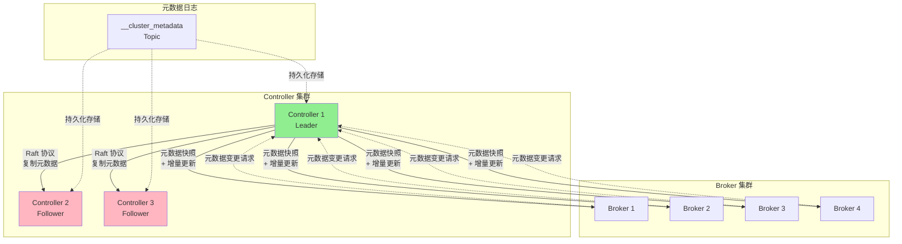
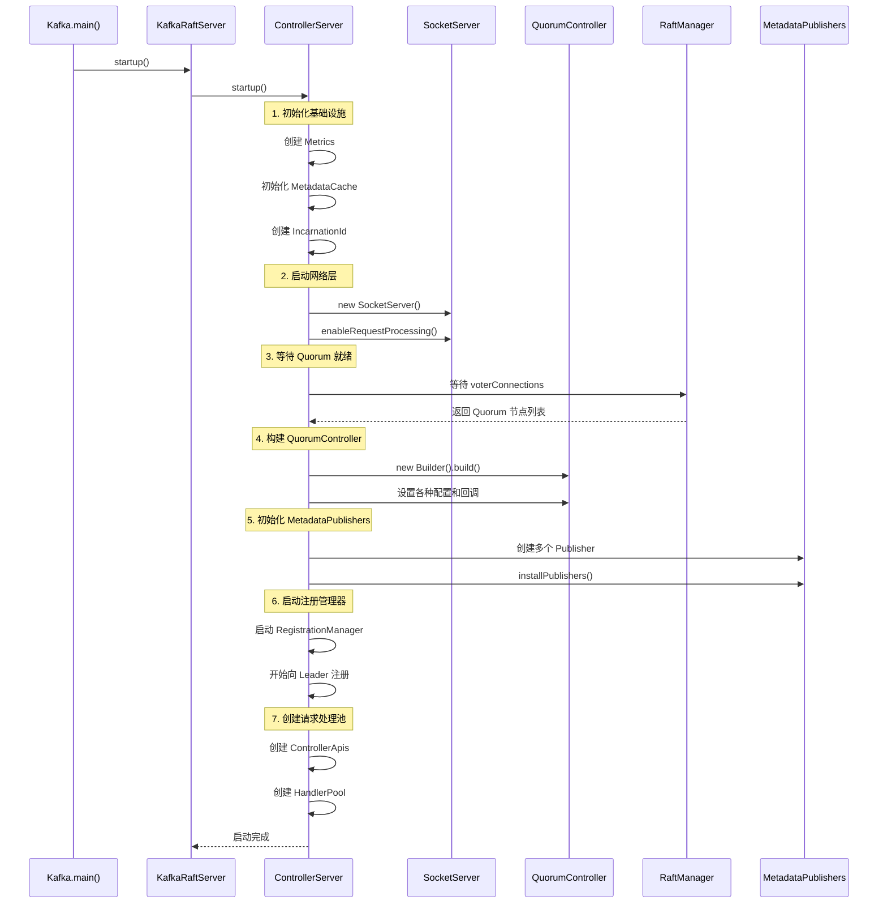
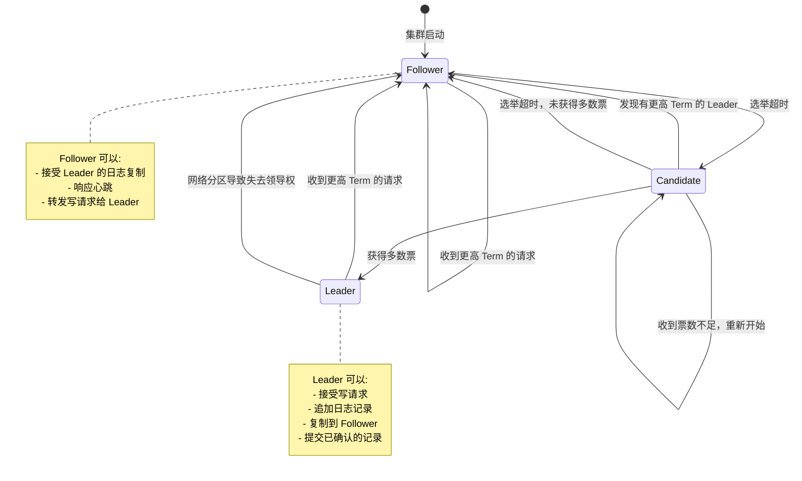
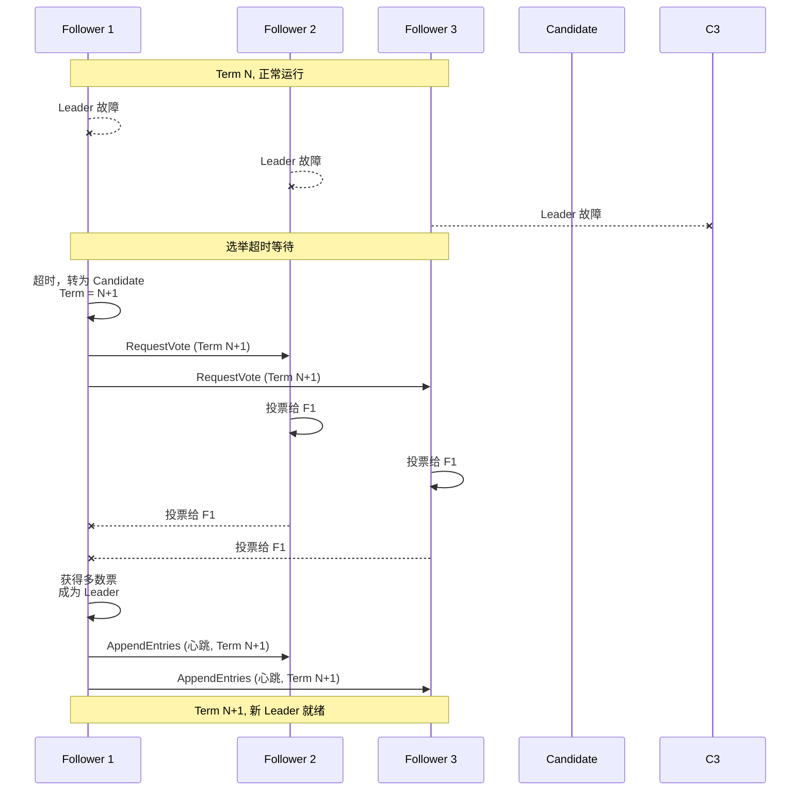
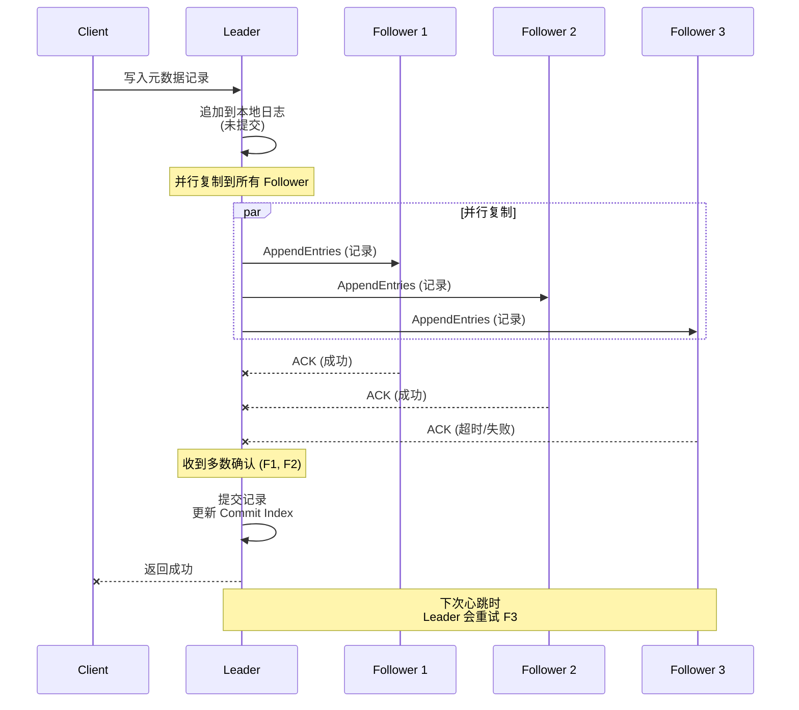
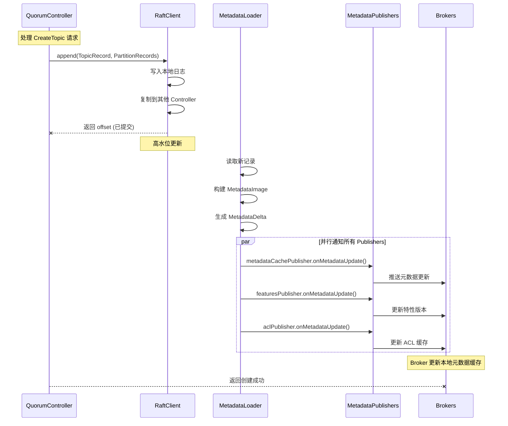
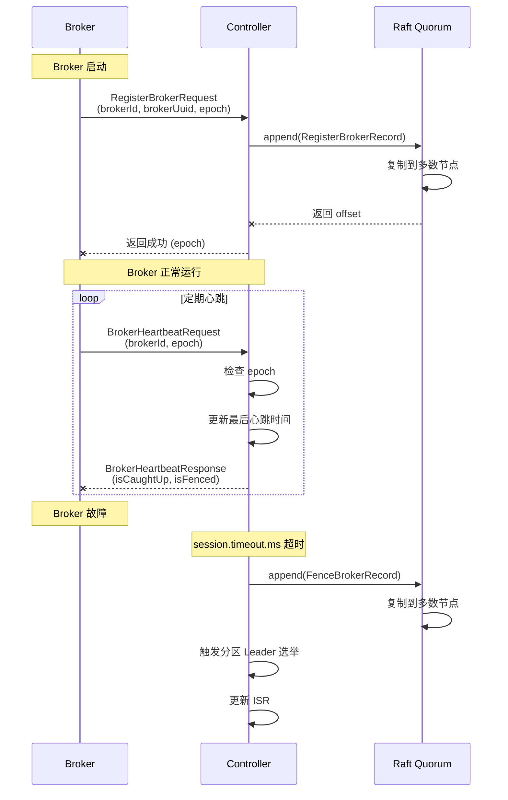

# 05. Controller 控制器 - KRaft 架构的核心

## 本章导读

Controller 是 Kafka KRaft 架构中最核心的组件，它替代了 ZooKeeper，负责管理整个集群的元数据。本章将深入分析：

- **KRaft 架构原理**：如何用 Raft 协议实现元数据一致性
- **QuorumController 实现**：单线程事件处理模型
- **元数据日志**：`__cluster_metadata` Topic 的机制
- **Controller 选举**：Leader 选举与故障转移
- **元数据发布**：如何将元数据变更通知到 Broker

---

## 1. KRaft 架构概述

### 1.1 为什么需要 KRaft？

```scala
/**
 * ZooKeeper 模式的问题:
 *
 * 1. 元数据分离
 *    - ZooKeeper 存储元数据
 *    - Broker 在内存中缓存元数据
 *    - 两者之间可能不一致
 *
 * 2. 性能瓶颈
 *    - 元数据变更需要写入 ZooKeeper
 *    - Watch 通知延迟
 *    - 单点故障风险
 *
 * 3. 运维复杂
 *    - 需要单独部署 ZooKeeper 集群
 *    - 两套系统需要协调
 *    - 配置复杂
 *
 * KRaft 模式的优势:
 *
 * 1. 自包含元数据管理
 *    - 元数据存储在 __cluster_metadata Topic
 *    - Broker 和 Controller 共享同一套元数据
 *
 * 2. Raft 协议保证一致性
 *    - 强一致性保证
 *    - 自动故障转移
 *    - 无需外部协调服务
 *
 * 3. 更好的性能
 *    - 减少网络跳数
 *    - 元数据变更延迟更低
 *    - 水平扩展能力更强
 */
```

### 1.2 KRaft 架构图



### 1.3 核心组件职责

| 组件 | 职责 | 关键类 |
|------|------|--------|
| **ControllerServer** | Controller 服务器入口 | `kafka.server.ControllerServer` |
| **QuorumController** | 核心控制逻辑 | `org.apache.kafka.controller.QuorumController` |
| **KafkaRaftManager** | Raft 协议实现 | `kafka.raft.KafkaRaftManager` |
| **MetadataPublisher** | 元数据发布器 | `org.apache.kafka.image.publisher.MetadataPublisher` |
| **ControllerApis** | 处理 Controller 请求 | `kafka.server.ControllerApis` |

---

## 2. ControllerServer 启动流程

### 2.1 启动时序图



### 2.2 ControllerServer.startup() 源码分析

```scala
// kafka/server/ControllerServer.scala

def startup(): Unit = {
  if (!maybeChangeStatus(SHUTDOWN, STARTING)) return
  val startupDeadline = Deadline.fromDelay(time, config.serverMaxStartupTimeMs, TimeUnit.MILLISECONDS)
  try {
    this.logIdent = logContext.logPrefix()
    info("Starting controller")

    // ========== 1. 初始化 Metrics ==========
    metricsGroup.newGauge("ClusterId", () => clusterId)
    metricsGroup.newGauge("yammer-metrics-count", () => KafkaYammerMetrics.defaultRegistry.allMetrics.size)

    // ========== 2. 初始化 Authorizer ==========
    authorizerPlugin = config.createNewAuthorizer(metrics, ProcessRole.ControllerRole.toString)

    // ========== 3. 初始化 MetadataCache ==========
    /**
     * KRaftMetadataCache: 存储集群元数据
     * - Topic 信息
     * - Partition 信息
     * - Broker 信息
     * - ACL 信息
     */
    metadataCache = new KRaftMetadataCache(config.nodeId, () => raftManager.client.kraftVersion())
    metadataCachePublisher = new KRaftMetadataCachePublisher(metadataCache)

    // ========== 4. 初始化 Features ==========
    featuresPublisher = new FeaturesPublisher(logContext, sharedServer.metadataPublishingFaultHandler)

    // ========== 5. 初始化 RegistrationManager ==========
    registrationsPublisher = new ControllerRegistrationsPublisher()
    incarnationId = Uuid.randomUuid()  // 每次启动生成唯一 ID

    // ========== 6. 初始化 API 版本管理 ==========
    val apiVersionManager = new SimpleApiVersionManager(
      ListenerType.CONTROLLER,
      config.unstableApiVersionsEnabled,
      () => featuresPublisher.features().setFinalizedLevel(
        KRaftVersion.FEATURE_NAME,
        raftManager.client.kraftVersion().featureLevel())
    )

    // ========== 7. 初始化网络层 ==========
    tokenCache = new DelegationTokenCache(ScramMechanism.mechanismNames)
    credentialProvider = new CredentialProvider(ScramMechanism.mechanismNames, tokenCache)

    socketServer = new SocketServer(
      config,
      metrics,
      time,
      credentialProvider,
      apiVersionManager,
      sharedServer.socketFactory
    )

    // 获取监听器信息
    val listenerInfo = ListenerInfo
      .create(config.effectiveAdvertisedControllerListeners.asJava)
      .withWildcardHostnamesResolved()
      .withEphemeralPortsCorrected(name => socketServer.boundPort(new ListenerName(name)))

    socketServerFirstBoundPortFuture.complete(listenerInfo.firstListener().port())

    // ========== 8. 启动 RaftManager ==========
    sharedServer.startForController(listenerInfo)

    // ========== 9. 初始化策略插件 ==========
    createTopicPolicy = Option(config.getConfiguredInstance(
      CREATE_TOPIC_POLICY_CLASS_NAME_CONFIG, classOf[CreateTopicPolicy]))
    alterConfigPolicy = Option(config.getConfiguredInstance(
      ALTER_CONFIG_POLICY_CLASS_NAME_CONFIG, classOf[AlterConfigPolicy]))

    // ========== 10. 等待 Quorum Voter 连接 ==========
    /**
     * 等待所有 Quorum 节点的连接建立
     * 这是一个阻塞操作，确保 Raft 集群可以正常通信
     */
    val voterConnections = FutureUtils.waitWithLogging(
      logger.underlying,
      logIdent,
      "controller quorum voters future",
      sharedServer.controllerQuorumVotersFuture,
      startupDeadline,
      time
    )
    val controllerNodes = QuorumConfig.voterConnectionsToNodes(voterConnections)

    // ========== 11. 初始化 QuorumFeatures ==========
    val quorumFeatures = new QuorumFeatures(
      config.nodeId,
      QuorumFeatures.defaultSupportedFeatureMap(config.unstableFeatureVersionsEnabled),
      controllerNodes.asScala.map(node => Integer.valueOf(node.id())).asJava
    )

    // ========== 12. 构建 QuorumController ==========
    val controllerBuilder = {
      val leaderImbalanceCheckIntervalNs = if (config.autoLeaderRebalanceEnable) {
        OptionalLong.of(TimeUnit.NANOSECONDS.convert(config.leaderImbalanceCheckIntervalSeconds, TimeUnit.SECONDS))
      } else {
        OptionalLong.empty()
      }

      val maxIdleIntervalNs = config.metadataMaxIdleIntervalNs.fold(OptionalLong.empty)(OptionalLong.of)

      quorumControllerMetrics = new QuorumControllerMetrics(
        Optional.of(KafkaYammerMetrics.defaultRegistry),
        time,
        config.brokerSessionTimeoutMs
      )

      new QuorumController.Builder(config.nodeId, sharedServer.clusterId)
        .setTime(time)
        .setThreadNamePrefix(s"quorum-controller-${config.nodeId}-")
        .setConfigSchema(configSchema)
        .setRaftClient(raftManager.client)           // 关键: Raft 客户端
        .setQuorumFeatures(quorumFeatures)
        .setDefaultReplicationFactor(config.defaultReplicationFactor.toShort)
        .setDefaultNumPartitions(config.numPartitions.intValue())
        .setSessionTimeoutNs(TimeUnit.NANOSECONDS.convert(config.brokerSessionTimeoutMs.longValue(), TimeUnit.MILLISECONDS))
        .setLeaderImbalanceCheckIntervalNs(leaderImbalanceCheckIntervalNs)
        .setMaxIdleIntervalNs(maxIdleIntervalNs)
        .setMetrics(quorumControllerMetrics)
        .setCreateTopicPolicy(createTopicPolicy.toJava)
        .setAlterConfigPolicy(alterConfigPolicy.toJava)
        .setConfigurationValidator(new ControllerConfigurationValidator(sharedServer.brokerConfig))
        .setStaticConfig(config.originals)
        .setBootstrapMetadata(bootstrapMetadata)
        .setFatalFaultHandler(sharedServer.fatalQuorumControllerFaultHandler)
        .setNonFatalFaultHandler(sharedServer.nonFatalQuorumControllerFaultHandler)
        .setDelegationTokenCache(tokenCache)
        .setDelegationTokenSecretKey(delegationTokenKeyString)
        .setDelegationTokenMaxLifeMs(delegationTokenManagerConfigs.delegationTokenMaxLifeMs)
        .setDelegationTokenExpiryTimeMs(delegationTokenManagerConfigs.delegationTokenExpiryTimeMs)
        .setDelegationTokenExpiryCheckIntervalMs(delegationTokenManagerConfigs.delegationTokenExpiryCheckIntervalMs)
        .setUncleanLeaderElectionCheckIntervalMs(config.uncleanLeaderElectionCheckIntervalMs)
        .setControllerPerformanceSamplePeriodMs(config.controllerPerformanceSamplePeriodMs)
        .setControllerPerformanceAlwaysLogThresholdMs(config.controllerPerformanceAlwaysLogThresholdMs)
    }

    controller = controllerBuilder.build()  // 构建 QuorumController

    // ========== 13. 设置 Authorizer ==========
    authorizerPlugin.foreach { plugin =>
      plugin.get match {
        case a: ClusterMetadataAuthorizer => a.setAclMutator(controller)
        case _ =>
      }
    }

    // ========== 14. 初始化 Quota 管理器 ==========
    quotaManagers = QuotaFactory.instantiate(
      config,
      metrics,
      time,
      s"controller-${config.nodeId}-",
      ProcessRole.ControllerRole.toString
    )
    clientQuotaMetadataManager = new ClientQuotaMetadataManager(quotaManagers, socketServer.connectionQuotas)

    // ========== 15. 创建 ControllerApis ==========
    controllerApis = new ControllerApis(
      socketServer.dataPlaneRequestChannel,
      authorizerPlugin,
      quotaManagers,
      time,
      controller,
      raftManager,
      config,
      clusterId,
      registrationsPublisher,
      apiVersionManager,
      metadataCache
    )

    controllerApisHandlerPool = sharedServer.requestHandlerPoolFactory.createPool(
      config.nodeId,
      socketServer.dataPlaneRequestChannel,
      controllerApis,
      time,
      config.numIoThreads,
      "controller"
    )

    // ========== 16. 设置 MetadataPublishers ==========
    /**
     * MetadataPublisher 负责将元数据变更发布到各个组件
     * 每个 Publisher 关注不同类型的元数据变更
     */
    metadataPublishers.add(metadataCachePublisher)      // 元数据缓存
    metadataPublishers.add(featuresPublisher)           // 特性版本
    metadataPublishers.add(registrationsPublisher)      // Controller 注册信息

    // ========== 17. 创建 RegistrationManager ==========
    /**
     * KIP-919: Controller 注册机制
     * 每个 Controller 需要向 Leader 注册自己
     */
    registrationManager = new ControllerRegistrationManager(
      config.nodeId,
      clusterId,
      time,
      s"controller-${config.nodeId}-",
      QuorumFeatures.defaultSupportedFeatureMap(config.unstableFeatureVersionsEnabled),
      incarnationId,
      listenerInfo
    )
    metadataPublishers.add(registrationManager)

    // ========== 18. 添加其他 Publishers ==========
    // 动态配置发布器
    metadataPublishers.add(new DynamicConfigPublisher(
      config,
      sharedServer.metadataPublishingFaultHandler,
      immutable.Map[ConfigType, ConfigHandler](
        ConfigType.BROKER -> new BrokerConfigHandler(config, quotaManagers)
      ),
      "controller"
    ))

    // 客户端配额发布器
    metadataPublishers.add(new DynamicClientQuotaPublisher(
      config.nodeId,
      sharedServer.metadataPublishingFaultHandler,
      "controller",
      clientQuotaMetadataManager
    ))

    // Topic 集群配额发布器
    metadataPublishers.add(new DynamicTopicClusterQuotaPublisher(
      clusterId,
      config.nodeId,
      sharedServer.metadataPublishingFaultHandler,
      "controller",
      quotaManagers.clientQuotaCallbackPlugin(),
      quotaManagers.quotaConfigChangeListener()
    ))

    // SCRAM 发布器
    metadataPublishers.add(new ScramPublisher(
      config.nodeId,
      sharedServer.metadataPublishingFaultHandler,
      "controller",
      credentialProvider
    ))

    // DelegationToken 发布器
    metadataPublishers.add(new DelegationTokenPublisher(
      config.nodeId,
      sharedServer.metadataPublishingFaultHandler,
      "controller",
      new DelegationTokenManager(delegationTokenManagerConfigs, tokenCache)
    ))

    // Metrics 发布器
    metadataPublishers.add(new ControllerMetadataMetricsPublisher(
      sharedServer.controllerServerMetrics,
      sharedServer.metadataPublishingFaultHandler
    ))

    // ACL 发布器
    metadataPublishers.add(new AclPublisher(
      config.nodeId,
      sharedServer.metadataPublishingFaultHandler,
      "controller",
      authorizerPlugin.toJava
    ))

    // ========== 19. 安装所有 Publishers ==========
    /**
     * 将 Publishers 注册到 MetadataLoader
     * 开始接收元数据变更通知
     */
    FutureUtils.waitWithLogging(logger.underlying, logIdent,
      "the controller metadata publishers to be installed",
      sharedServer.loader.installPublishers(metadataPublishers),
      startupDeadline,
      time
    )

    // ========== 20. 启动网络处理 ==========
    val authorizerFutures: Map[Endpoint, CompletableFuture[Void]] =
      endpointReadyFutures.futures().asScala.toMap

    val socketServerFuture = socketServer.enableRequestProcessing(authorizerFutures)

    // ========== 21. 启动 RegistrationManager ==========
    val controllerNodeProvider = RaftControllerNodeProvider.create(raftManager, config)
    registrationChannelManager = new NodeToControllerChannelManagerImpl(
      controllerNodeProvider,
      time,
      metrics,
      config,
      "registration",
      s"controller-${config.nodeId}-",
      5000
    )
    registrationChannelManager.start()
    registrationManager.start(registrationChannelManager)

    // ========== 22. 等待所有组件就绪 ==========
    FutureUtils.waitWithLogging(logger.underlying, logIdent,
      "all of the authorizer futures to be completed",
      CompletableFuture.allOf(authorizerFutures.values.toSeq: _*),
      startupDeadline,
      time
    )

    FutureUtils.waitWithLogging(logger.underlying, logIdent,
      "all of the SocketServer Acceptors to be started",
      socketServerFuture,
      startupDeadline,
      time
    )

    maybeChangeStatus(STARTING, STARTED)
  } catch {
    case e: Throwable =>
      maybeChangeStatus(STARTING, STARTED)
      sharedServer.controllerStartupFaultHandler.handleFault("caught exception", e)
      shutdown()
      throw e
  }
}
```

### 2.3 MetadataPublisher 机制

```scala
/**
 * MetadataPublisher 是元数据变更的观察者模式实现
 *
 * 工作流程:
 * 1. QuorumController 写入元数据记录到 __cluster_metadata Topic
 * 2. Raft 协议确保记录复制到多数节点
 * 3. MetadataLoader 读取新记录
 * 4. MetadataLoader 通知所有已注册的 Publishers
 * 5. 每个 Publisher 更新自己负责的组件
 */

// Publisher 类型及职责
trait MetadataPublisher {
  /**
   * 当元数据快照更新时调用
   * @param metadata 新的元数据快照
   */
  def onMetadataUpdate(metadata: MetadataImage, newRecord: Option ApiMessageAndVersion): Unit
}

// 常见的 Publishers:
// 1. KRaftMetadataCachePublisher   - 更新 Broker 的元数据缓存
// 2. FeaturesPublisher             - 更新特性版本
// 3. ControllerRegistrationsPublisher - 更新 Controller 注册信息
// 4. DynamicConfigPublisher        - 处理动态配置变更
// 5. AclPublisher                  - 处理 ACL 变更
// 6. ScramPublisher                - 处理 SCRAM 凭证变更
```

---

## 3. QuorumController 核心实现

### 3.1 单线程事件模型

```java
/**
 * QuorumController 设计哲学:
 *
 * 1. 单线程事件处理
 *    - 所有操作都在同一个事件队列中执行
 *    - 避免复杂的锁机制
 *    - 保证操作的顺序性
 *
 * 2. 异步 API
 *    - 所有公开 API 都返回 CompletableFuture
 *    - 调用者不会阻塞
 *    - 结果在事件完成后通过 Future 返回
 *
 * 3. Raft 集成
 *    - 元数据变更通过 Raft 协议复制
 *    - 只有 Leader 可以写入元数据
 *    - Follower 只能读取
 */

// org/apache/kafka/controller/QuorumController.java

public final class QuorumController implements Controller {
    /**
     * 事件队列: 所有操作都在这个队列中串行执行
     */
    private final KafkaEventQueue eventQueue;

    /**
     * Raft 客户端: 用于读写元数据日志
     */
    private final RaftClient<ApiMessageAndVersion> raftClient;

    /**
     * 元数据快照: 当前集群元数据的完整视图
     */
    private final MetadataDelta metadataDelta;

    /**
     * 集群控制管理器: 管理 Broker 注册、心跳等
     */
    private final ClusterControlManager clusterControl;

    /**
     * 分区管理器: 管理 Topic、Partition、副本分配
     */
    private final PartitionReplicationReplicaManager partitionManager;

    /**
     * 配置管理器: 管理动态配置
     */
    private final ConfigurationControlManager configurationControl;

    /**
     * 特性管理器: 管理特性版本
     */
    private final FeatureControlManager featureControl;

    // ... 其他管理器
}
```

### 3.2 QuorumController 初始化

```java
// QuorumController.Builder.build()

public QuorumController build() {
    // ========== 1. 创建快照注册表 ==========
    /**
     * SnapshotRegistry 用于管理元数据快照
     * 支持时间旅行查询和回滚
     */
    SnapshotRegistry snapshotRegistry = new SnapshotRegistry(logContext);

    // ========== 2. 创建事件队列 ==========
    /**
     * KafkaEventQueue 是一个单线程事件队列
     * 所有操作都在这个队列中执行
     */
    KafkaEventQueue eventQueue = new KafkaEventQueue(
        Time.SYSTEM,
        logContext,
        new EarliestDeadlineFunction(),
        "quorum-controller-" + nodeId + "-",
        true  // 单线程模式
    );

    // ========== 3. 创建各个管理器 ==========
    ClusterControlManager clusterControl = new ClusterControlManager.Builder()
        .setNodeId(nodeId)
        .setTime(time)
        .setThreadNamePrefix(threadNamePrefix)
        .setSnapshotRegistry(snapshotRegistry)
        .setLogContext(logContext)
        .setSessionTimeoutNs(sessionTimeoutNs)
        .setBrokerHeartbeatIntervalNs(brokerHeartbeatIntervalNs)
        .setFatalFaultHandler(fatalFaultHandler)
        .build();

    PartitionReplicationReplicaManager partitionManager =
        new PartitionReplicationReplicaManager.Builder()
            .setNodeId(nodeId)
            .setTime(time)
            .setThreadNamePrefix(threadNamePrefix)
            .setSnapshotRegistry(snapshotRegistry)
            .setLogContext(logContext)
            .setDefaultReplicationFactor(defaultReplicationFactor)
            .setDefaultNumPartitions(defaultNumPartitions)
            .setReplicaPlacer(replicaPlacer)
            .setLeaderImbalanceCheckIntervalNs(leaderImbalanceCheckIntervalNs)
            .build();

    ConfigurationControlManager configurationControl =
        new ConfigurationControlManager.Builder()
            .setNodeId(nodeId)
            .setTime(time)
            .setSnapshotRegistry(snapshotRegistry)
            .setLogContext(logContext)
            .setConfigSchema(configSchema)
            .build();

    FeatureControlManager featureControl = new FeatureControlManager.Builder()
        .setNodeId(nodeId)
        .setTime(time)
        .setThreadNamePrefix(threadNamePrefix)
        .setSnapshotRegistry(snapshotRegistry)
        .setLogContext(logContext)
        .setQuorumFeatures(quorumFeatures)
        .build();

    // ... 其他管理器

    // ========== 4. 创建 QuorumController ==========
    QuorumController controller = new QuorumController(
        logContext,
        nodeId,
        clusterId,
        time,
        threadNamePrefix,
        snapshotRegistry,
        eventQueue,
        raftClient,
        maxRecordsPerBatch,
        // ... 各个管理器
    );

    // ========== 5. 初始化 Raft 客户端 ==========
    /**
     * 设置 Raft 回调:
     * - 当成为 Leader 时调用
     * - 当有新记录可以读取时调用
     * - 当快照需要创建时调用
     */
    raftClient.register(listener);

    return controller;
}
```

### 3.3 CreateTopic 请求处理流程

```java
/**
 * CreateTopic 完整流程:
 *
 * 1. ControllerApis 接收请求
 * 2. 转发到 QuorumController
 * 3. 在事件队列中处理
 * 4. 生成元数据记录
 * 5. 通过 Raft 写入日志
 * 6. 等待多数节点确认
 * 7. 更新内存中的元数据
 * 8. 通知所有 Publishers
 * 9. 返回结果给客户端
 */

// QuorumController.createTopics()

public CompletableFuture<CreateTopicsResponseData> createTopics(
    CreateTopicsRequestData request
) {
    // ========== 1. 创建异步操作 ==========
    /**
     * ControllerOperation 是一个封装了操作逻辑的对象
     * 它会在事件队列中执行
     */
    CreateTopicsOperation op = new CreateTopicsOperation(
        request,
        deadline,
        apiTimeoutTimeNs
    );

    /**
     * 将操作放入事件队列
     * 不会阻塞当前线程
     */
    appendEvent(op);
    return op.future();
}

// ========== 2. 操作在事件队列中执行 ==========

private class CreateTopicsOperation extends ControllerOperation {
    @Override
    public void run() throws Exception {
        // ========== 2.1 检查是否是 Leader ==========
        /**
         * 只有 Leader 可以处理写请求
         * Follower 会将请求转发给 Leader
         */
        if (!isActiveController()) {
            completeFuture(new ApiError(
                NOT_CONTROLLER,
                "This controller is not the active controller."
            ));
            return;
        }

        // ========== 2.2 验证请求 ==========
        /**
         * 检查:
         * - Topic 名称是否合法
         * - Topic 是否已存在
         * - 副本因子是否合理
         * - 分区数是否合理
         */
        ApiError error = validateCreateTopics(request);
        if (error.isFailure()) {
            completeFuture(error);
            return;
        }

        // ========== 2.3 生成元数据记录 ==========
        /**
         * 为每个 Topic 生成元数据记录:
         * - TopicRecord: Topic 元数据
         * - PartitionRecord: 分区元数据
         */
        List<ApiMessageAndVersion> records = new ArrayList<>();

        for (CreatableTopic topic : request.topics()) {
            // 生成 TopicRecord
            records.add(new ApiMessageAndVersion(
                new TopicRecord()
                    .setName(topic.name())
                    .setTopicId(topicId),
                topic.topicId() == null ? (short) 0 : (short) 1
            ));

            // 为每个分区生成 PartitionRecord
            for (CreatablePartition partition : topic.assignments()) {
                // 计算副本分配
                List<Integer> replicas = partitionManager.assignReplicas(
                    partition.brokerIds(),
                    partition.replicationFactor()
                );

                records.add(new ApiMessageAndVersion(
                    new PartitionRecord()
                        .setTopicId(topicId)
                        .setPartitionId(partition.partitionIndex())
                        .setReplicas(replicas)
                        .setIsr(replicas)
                        .setLeader(replicas.get(0)),
                    (short) 0
                ));
            }
        }

        // ========== 2.4 写入元数据日志 ==========
        /**
         * 通过 Raft 协议写入记录
         * 这个操作会:
         * 1. 写入本地日志
         * 2. 复制到 Follower
         * 3. 等待多数节点确认
         * 4. 返回写入结果
         */
        CompletableFuture<Long> appendFuture = raftClient.append(
            records,
            AppendRequest.DEFAULT_TIMEOUT_MS,
            false  // 是否需要全部确认
        );

        // ========== 2.5 等待写入完成 ==========
        appendFuture.whenComplete((offset, exception) -> {
            if (exception != null) {
                completeFuture(new ApiError(
                    UNKNOWN_SERVER_ERROR,
                    "Failed to append to metadata log: " + exception.getMessage()
                ));
            } else {
                // ========== 2.6 创建响应 ==========
                completeFuture(null);  // 成功
            }
        });
    }
}
```

### 3.4 元数据记录类型

```java
/**
 * Kafka 的元数据通过多种类型的记录表示
 * 每种记录对应一种元数据变更
 */

// ===== 核心元数据记录 =====

// 1. TopicRecord: Topic 元数据
class TopicRecord {
    String name;        // Topic 名称
    Uuid topicId;       // Topic 唯一 ID
}

// 2. PartitionRecord: 分区元数据
class PartitionRecord {
    Uuid topicId;           // 所属 Topic ID
    int partitionId;        // 分区 ID
    List<Integer> replicas; // 副本列表
    List<Integer> isr;      // In-Sync Replicas
    int leader;             // Leader 副本
    int leaderEpoch;        // Leader 版本号
    int partitionEpoch;     // 分区版本号
}

// 3. RegisterBrokerRecord: Broker 注册
class RegisterBrokerRecord {
    int brokerId;           // Broker ID
    Uuid brokerUuid;        // Broker 唯一 ID
    String rack;            // 机架信息
    long epoch;             // Broker 版本号
    boolean fenced;         // 是否被隔离
}

// 4. BrokerRegistrationChangeRecord: Broker 变更
class BrokerRegistrationChangeRecord {
    int brokerId;
    long brokerEpoch;
    boolean fenced;
}

// 5. ConfigRecord: 配置变更
class ConfigRecord {
    String resourceType;    // 资源类型 (Topic/Broker)
    String resourceName;    // 资源名称
    String configKey;       // 配置键
    String configValue;     // 配置值
}

// 6. AccessControlEntryRecord: ACL
class AccessControlEntryRecord {
    String resourceType;
    String resourceName;
    String principal;
    String host;
    String operation;
    String permissionType;
}

// 7. FeatureLevelRecord: 特性版本
class FeatureLevelRecord {
    String name;        // 特性名称
    long featureLevel;  // 特性版本号
}

// ... 还有 20+ 种其他记录类型
```

---

## 4. Raft 协议实现

### 4.1 Raft 基础概念

```scala
/**
 * Raft 协议核心概念:
 *
 * 1. 角色类型
 *    - Leader: 处理所有写请求
 *    - Follower: 复制 Leader 的日志
 *    - Candidate: 选举中的临时状态
 *
 * 2. 术语
 *    - Term (任期): 逻辑时钟，每次选举后递增
 *    - Log Entry: 日志条目，包含元数据记录
 *    - Commit Index: 已提交的最大索引
 *    - High Watermark: 多数节点已复制的索引
 *
 * 3. 一致性保证
 *    - Leader 完整性: 如果一条记录在某个 Term 提交，
 *                    它将在所有后续 Term 的 Leader 中存在
 *    - 日志匹配性: 两个日志如果索引相同，则记录相同
 *    - 领导者附加性: Leader 不会覆盖或删除已提交的记录
 */
```

### 4.2 Raft 状态转换



### 4.3 Leader 选举流程



### 4.4 日志复制流程



### 4.5 KafkaRaftManager 实现

```scala
// kafka/raft/KafkaRaftManager.scala

class KafkaRaftManager[MessageType](
    config: KafkaConfig,
    clientConfig: RaftConfig,
    time: Time,
    threadNamePrefix: Option[String],
    val metrics: Metrics,
    val scheduler: Scheduler,
    val topicPartition: TopicPartition,
    val apiVersionManager: ApiVersionManager,
    val listenerName: ListenerName,
    val storageDir: File
) extends Logging {

  /**
   * Raft 客户端: 与 Raft 集群交互
   */
  @volatile var client: RaftClient[MessageType] = _

  /**
   * Raft 服务器: 处理 Raft 协议消息
   */
  @volatile var server: KafkaRaftServer[MessageType] = _

  def startup(): Unit = {
    // ========== 1. 创建 Raft IO 层 ==========
    /**
     * RaftIO 负责:
     * - 读写日志文件
     * - 创建快照
     * - 加载快照
     */
    val raftIo = new RaftIo(
      metadataPartition,
      config,
      time,
      scheduler,
      apiVersionManager
    )

    // ========== 2. 创建 RaftClient ==========
    /**
     * RaftClient 提供给上层使用
     * 用于:
     * - 追加记录
     * - 读取记录
     * - 查询 Leader 信息
     */
    client = RaftClient.newBuilder()
      .setNodeId(config.nodeId)
      .setRaftConfig(clientConfig)
      .setTime(time)
      .setLogContext(logContext)
      .build()

    // ========== 3. 创建 RaftServer ==========
    /**
     * RaftServer 处理:
     * - Raft 协议消息
     * - 选举
     * - 日志复制
     * - 快照管理
     */
    server = KafkaRaftServer.newBuilder()
      .setNodeId(config.nodeId)
      .setRaftConfig(clientConfig)
      .setRaftClient(client)
      .setTime(time)
      .build()

    server.start()
  }

  /**
   * 追加记录到元数据日志
   * 这是一个异步操作
   */
  def append(
    records: JavaList[ApiMessageAndVersion],
    timeoutMs: Long,
    waitForAll: Boolean
  ): CompletableFuture[Long] = {
    client.append(records, timeoutMs, waitForAll)
  }

  /**
   * 读取元数据日志
   */
  def read(
    startOffset: Long,
    maxBytes: Int
  ): JavaOptional[BatchReader[MessageType]] = {
    client.read(startOffset, maxBytes)
  }

  /**
   * 获取当前 Leader 信息
   */
  def leaderAndEpoch(): LeaderAndEpoch = {
    client.leaderAndEpoch()
  }
}
```

---

## 5. 元数据发布机制

### 5.1 MetadataImage 快照

```java
/**
 * MetadataImage 是 Kafka 集群元数据的不可变快照
 *
 * 设计特点:
 * 1. 不可变性: 一旦创建就不会修改
 * 2. 完整性: 包含所有类型的元数据
 * 3. 一致性: 所有元数据在同一时间点一致
 * 4. 快速访问: 预先构建索引，查询快速
 */

// org/apache/kafka/image/MetadataImage.java

public final class MetadataImage {
    /**
     * 元数据特性
     */
    private final FeaturesImage features;

    /**
     * 集群元数据 (Broker 信息)
     */
    private final ClusterImage cluster;

    /**
     * Topic 元数据
     */
    private final TopicsImage topics;

    /**
     * 配置元数据
     */
    private final ConfigsImage configs;

    /**
     * Client 配额
     */
    private final ClientQuotasImage clientQuotas;

    /**
     * Producer ID 映射
     */
    private final ProducerIdsImage producerIds;

    /**
     * ACL 元数据
     */
    private final AclsImage acls;

    /**
     * DelegationToken 元数据
     */
    private final DelegationTokenImage delegationToken;

    /**
     * SCRAM 凭证
     */
    private final ScramImage scram;

    // ... 其他元数据

    /**
     * 创建新快照
     * 当元数据变更时调用
     */
    public MetadataImage with(
        FeaturesImage newFeatures,
        ClusterImage newCluster,
        TopicsImage newTopics,
        // ... 其他参数
    ) {
        return new MetadataImage(
            newFeatures,
            newCluster,
            newTopics,
            // ...
        );
    }
}
```

### 5.2 元数据发布流程



### 5.3 MetadataPublisher 实现

```java
/**
 * MetadataPublisher 接口实现示例
 */

// ===== 1. KRaftMetadataCachePublisher =====

public class KRaftMetadataCachePublisher implements MetadataPublisher {
    private final KRaftMetadataCache cache;

    @Override
    public void onMetadataUpdate(
        MetadataImage newImage,
        MetadataDelta delta
    ) {
        /**
         * 更新 Broker 的元数据缓存
         */
        cache.setImage(newImage);

        /**
         * 通知等待元数据的线程
         */
        cache.notifyAll();
    }
}

// ===== 2. AclPublisher =====

public class AclPublisher implements MetadataPublisher {
    private final Optional<Plugin<Authorizer>> authorizer;

    @Override
    public void onMetadataUpdate(
        MetadataImage newImage,
        MetadataDelta delta
    ) {
        authorizer.ifPresent(plugin -> {
            Authorizer authorizer = plugin.get();

            /**
             * 处理 ACL 变更
             */
            for (ApiMessageAndVersion messageAndVersion : delta.aclChanges()) {
                ApiMessage message = messageAndVersion.message();

                if (message instanceof AccessControlEntryRecord) {
                    AccessControlEntryRecord record =
                        (AccessControlEntryRecord) message;

                    /**
                     * 添加 ACL
                     */
                    authorizer.addAcl(
                        new AccessControlEntry(
                            record.principal(),
                            record.host(),
                            record.operation(),
                            record.permissionType()
                        )
                    );
                } else if (message instanceof RemoveAccessControlEntryRecord) {
                    RemoveAccessControlEntryRecord record =
                        (RemoveAccessControlEntryRecord) message;

                    /**
                     * 删除 ACL
                     */
                    authorizer.removeAcl(
                        new AccessControlEntry(
                            record.principal(),
                            record.host(),
                            record.operation(),
                            record.permissionType()
                        )
                    );
                }
            }
        });
    }
}

// ===== 3. DynamicConfigPublisher =====

public class DynamicConfigPublisher implements MetadataPublisher {
    private final KafkaConfig config;
    private final Map<ConfigType, ConfigHandler> handlers;

    @Override
    public void onMetadataUpdate(
        MetadataImage newImage,
        MetadataDelta delta
    ) {
        /**
         * 处理配置变更
         */
        for (ConfigRecord configRecord : delta.configChanges()) {
            ConfigType type = ConfigType.of(configRecord.resourceType());

            /**
             * 根据配置类型调用对应的 Handler
             */
            ConfigHandler handler = handlers.get(type);

            if (handler != null) {
                handler.processConfigChanges(
                    configRecord.resourceName(),
                    Collections.singletonMap(
                        configRecord.name(),
                        configRecord.value()
                    )
                );
            }
        }
    }
}
```

---

## 6. Controller 高可用与故障处理

### 6.1 Controller 故障检测

```scala
/**
 * Controller 故障检测机制:
 *
 * 1. Broker 心跳
 *    - Broker 定期发送心跳给 Controller
 *    - 心跳包含 Broker 的 epoch
 *    - Controller 检查 epoch 是否连续
 *
 * 2. Session 超时
 *    - 如果 Controller 在 session.timeout.ms 内没有收到心跳
 *    - 将 Broker 标记为过期
 *    - 触发 Leader 重新选举
 *
 * 3. Controller 故障转移
 *    - 如果 Leader Controller 故障
 *    - 其他 Controller 通过 Raft 选举新 Leader
 *    - 新 Leader 恢复元数据管理
 */
```

### 6.2 Broker 注册与心跳



### 6.3 Controller Leader 选举

```java
/**
 * Controller Leader 选举过程
 *
 * 1. 检测到故障
 *    - Follower 发现 Leader 没有发送心跳
 *    - 等待 election timeout
 *
 * 2. 转换为 Candidate
 *    - 递增 Term
 *    - 投票给自己
 *    - 发送 RequestVote 给其他节点
 *
 * 3. 收集投票
 *    - 如果获得多数票，成为 Leader
 *    - 否则，等待下一轮选举
 *
 * 4. 成为 Leader
 *    - 发送心跳维持领导权
 *    - 开始处理写请求
 *    - 追赶 Follower 的日志
 */

// Raft 选举超时
private final long electionTimeoutMs = 1000;  // 1 秒

// 心跳间隔
private final long heartbeatIntervalMs = 100; // 100 毫秒
```

### 6.4 元数据恢复

```java
/**
 * 当新 Controller Leader 上任时，需要恢复元数据
 *
 * 恢复流程:
 * 1. 加载快照
 *    - 从磁盘加载最新的快照文件
 *    - 快照包含完整的元数据状态
 *
 * 2. 重放日志
 *    - 从快照 offset 之后的所有日志
 *    - 按顺序重放，重建最新状态
 *
 * 3. 构建 MetadataImage
 *    - 基于快照和日志，构建最新快照
 *
 * 4. 发布元数据
 *    - 通知所有 Publishers
 *    - Publishers 更新各自管理的组件
 */

// MetadataLoader.replay()

public MetadataImage replay(
    SnapshotReader snapshot,
    BatchReader<ApiMessageAndVersion> batch
) {
    // ========== 1. 加载快照 ==========
    MetadataImage image = MetadataImage.EMPTY;
    if (snapshot != null) {
        image = snapshot.load();
    }

    // ========== 2. 重放日志 ==========
    MetadataDelta delta = new MetadataDelta.Builder()
        .setImage(image)
        .build();

    while (batch.hasNext()) {
        Batch<ApiMessageAndVersion> batch = batch.next();

        for (ApiMessageAndVersion record : batch.records()) {
            /**
             * 重放每条记录
             * delta 会更新内部的元数据
             */
            delta.replay(record);
        }
    }

    // ========== 3. 生成新快照 ==========
    return delta.image();
}
```

---

## 7. 核心设计亮点总结

### 7.1 架构设计亮点

```scala
/**
 * 1. 单线程事件模型
 *
 * 优势:
 * - 避免复杂的锁机制
 * - 保证操作顺序性
 * - 简化代码逻辑
 * - 减少上下文切换
 *
 * 实现:
 * - 所有操作在 KafkaEventQueue 中串行执行
 * - 异步 API 不阻塞调用者
 * - CompletableFuture 返回结果
 */

/**
 * 2. 元数据快照机制
 *
 * 优势:
 * - 快速恢复: 只需加载快照 + 重放增量日志
 * - 时间旅行: 可以查看历史状态
 * - 不可变性: 快照创建后不会修改，线程安全
 *
 * 实现:
 * - MetadataImage 保存完整元数据
 * - 定期创建快照文件
 * - 加载时从最新快照恢复
 */

/**
 * 3. Raft 协议集成
 *
 * 优势:
 * - 强一致性保证
 * - 自动故障转移
 * - 无需外部协调服务
 * - 简化运维
 *
 * 实现:
 * - RaftClient 处理协议细节
 * - Leader 处理写请求
 * - 日志复制到 Follower
 * - 多数确认后提交
 */

/**
 * 4. Publisher 观察者模式
 *
 * 优势:
 * - 解耦元数据处理
 * - 每个 Publisher 负责特定类型
 * - 易于扩展新的元数据类型
 * - 并行通知，性能高
 *
 * 实现:
 * - MetadataPublisher 接口
 * - MetadataLoader 通知所有 Publishers
 * - 每个 Publisher 更新对应组件
 */
```

### 7.2 性能优化

| 优化点 | 实现方式 | 效果 |
|-------|---------|------|
| **批量写入** | 单次可写入 10000 条记录 | 减少 Raft 开销 |
| **异步处理** | CompletableFuture API | 不阻塞请求线程 |
| **并行通知** | Publishers 并行处理元数据更新 | 降低延迟 |
| **快照机制** | 定期快照 + 增量日志 | 快速恢复 |
| **增量更新** | MetadataDelta 只包含变更 | 减少数据传输 |

### 7.3 可靠性保证

```scala
/**
 * 1. 元数据持久化
 *    - 所有变更写入 __cluster_metadata Topic
 *    - Raft 协议保证复制到多数节点
 *    - 定期创建快照
 *
 * 2. 故障检测
 *    - Broker 心跳检测
 *    - Controller Leader 心跳检测
 *    - Session 超时机制
 *
 * 3. 自动故障转移
 *    - Raft 自动选举新 Leader
 *    - 新 Leader 恢复元数据
 *    - 重新选举分区 Leader
 *
 * 4. 数据一致性
 *    - 强一致性模型
 *    - 多数确认后才提交
 *    - Leader 完整性保证
 */
```

---

## 8. 与 ZooKeeper 模式对比

| 特性 | ZooKeeper 模式 | KRaft 模式 |
|------|---------------|-----------|
| **元数据存储** | ZooKeeper | __cluster_metadata Topic |
| **一致性协议** | ZAB | Raft |
| **Controller 数量** | 1 个 (多个候选) | 多个 (Quorum) |
| **元数据延迟** | Watch 通知延迟 | 镜像更新延迟 |
| **部署复杂度** | 需要部署 ZK 集群 | 无需外部依赖 |
| **故障转移** | 需要重新选举 | Raft 自动选举 |
| **扩展性** | 受 ZK 限制 | 更好的水平扩展 |

---

## 9. 源码阅读建议

### 9.1 关键类路径

```
Controller 核心实现:
├── org/apache/kafka/controller/QuorumController.java        # 核心控制器逻辑
├── kafka/server/ControllerServer.scala                      # Controller 服务器
├── kafka/raft/KafkaRaftManager.scala                        # Raft 管理器
├── org/apache/kafka/raft/RaftClient.java                    # Raft 客户端

元数据管理:
├── org/apache/kafka/image/MetadataImage.java               # 元数据快照
├── org/apache/kafka/image/loader/MetadataLoader.java        # 元数据加载器
├── org/apache/kafka/image/publisher/MetadataPublisher.java # 发布器接口

请求处理:
├── kafka/server/ControllerApis.scala                         # 请求处理
├── kafka/server/ControllerRegistrationManager.scala         # 注册管理
```

### 9.2 学习路径

```
1. 理解 Raft 协议
   ├── 选举机制
   ├── 日志复制
   └── 一致性保证

2. 阅读 QuorumController
   ├── 初始化流程
   ├── 事件处理模型
   └── 元数据操作

3. 理解元数据管理
   ├── MetadataImage 结构
   ├── MetadataDelta 机制
   └── Publisher 模式

4. 分析 Raft 集成
   ├── KafkaRaftManager
   ├── RaftClient
   └── 日志持久化
```

---

**本章总结**

本章深入分析了 Kafka KRaft 架构的核心 - Controller。通过源码分析，我们了解了：

1. **KRaft 架构如何替代 ZooKeeper**：通过 Raft 协议实现元数据一致性，消除了对外部协调服务的依赖
2. **QuorumController 单线程事件模型**：简化并发控制，保证操作顺序性
3. **元数据发布机制**：通过 Publisher 模式，将元数据变更通知到各个组件
4. **Raft 协议集成**：自动故障转移，强一致性保证

**核心设计亮点**：
- 单线程事件模型避免锁竞争
- 元数据快照机制实现快速恢复
- Publisher 观察者模式解耦元数据处理
- Raft 协议保证高可用和一致性

---

## 10. 实战操作指南

### 10.1 搭建 KRaft 集群

#### 10.1.1 准备工作

```bash
# 1. 下载 Kafka
wget https://downloads.apache.org/kafka/3.7.0/kafka_2.13-3.7.0.tgz
tar -xzf kafka_2.13-3.7.0.tgz
cd kafka_2.13-3.7.0

# 2. 生成集群 ID
KAFKA_CLUSTER_ID="$(bin/kafka-storage.sh random-uuid)"
echo "Cluster ID: $KAFKA_CLUSTER_ID"

# 3. 格式化存储目录 (每个节点都需要执行)
# Node 1
bin/kafka-storage.sh format -t $KAFKA_CLUSTER_ID -c config/kraft/server.properties \
  --ignore-formatted

# Node 2 (如果有多节点)
bin/kafka-storage.sh format -t $KAFKA_CLUSTER_ID -c config/kraft/server-2.properties \
  --ignore-formatted
```

#### 10.1.2 配置文件详解

```properties
# ==================== 基础配置 ====================
# 进程角色：同时作为 Broker 和 Controller
process.roles=broker,controller

# 节点 ID
node.id=1

# Controller 监听地址
controller.listener.names=CONTROLLER

# 监听器配置
listeners=PLAINTEXT://:9092,CONTROLLER://:9093

# 广播地址 (集群环境需要配置实际 IP)
advertised.listeners=PLAINTEXT://localhost:9092

# Controller 集群成员列表
controller.quorum.voters=1@localhost:9093,2@localhost:9094,3@localhost:9095

# ==================== 日志配置 ====================
# 日志目录
log.dirs=/tmp/kraft-combined-logs

# ==================== 元数据配置 ====================
# 元数据日志目录
metadata.log.dir=/tmp/kraft-combined-logs/metadata

# 快照生成频率
metadata.log.max.snapshot.interval.bytes=52428800

# ==================== Raft 配置 ====================
# 选举超时 (ms)
controller.quorum.election.timeout.ms=1000

# 心跳间隔 (ms)
controller.quorum.heartbeat.interval.ms=500

# 请求超时 (ms)
controller.quorum.request.timeout.ms=2000

# ==================== 性能调优 ====================
# 批量写入大小
metadata.log.max.record.bytes.between.snapshots=20000

# 快照保留数量
metadata.log.max.snapshot.cache.size=3
```

#### 10.1.3 启动集群

```bash
# 1. 启动 Controller 节点 (先启动所有 Controller)
# Node 1
bin/kafka-server-start.sh -daemon config/kraft/server.properties

# Node 2
bin/kafka-server-start.sh -daemon config/kraft/server-2.properties

# Node 3
bin/kafka-server-start.sh -daemon config/kraft/server-3.properties

# 2. 验证集群状态
bin/kafka-metadata-shell.sh --snapshot /tmp/kraft-combined-logs/metadata/__cluster_metadata-0/00000000000000000000.log

# 3. 检查日志
tail -f /tmp/kraft-combined-logs/server.log | grep -i controller

# 4. 查看 Controller Leader
bin/kafka-metadata-quorum.sh describe --status

# 输出示例:
# ClusterId:              xxxxx
# LeaderId:               1
# LeaderEpoch:            5
# HighWatermark:          12345
# MaxFollowerLag:         0
# CurrentVoters:          [1,2,3]
# CurrentObservers:       []
```

### 10.2 常用操作命令

#### 10.2.1 元数据查询

```bash
# 1. 查看集群元数据
bin/kafka-metadata-shell.sh --snapshot <metadata-log-file>

# 进入交互式 Shell 后可执行:
>> ls
>> cd /brokers
>> ls
>> cat /brokers/ids/0

# 2. 查看元数据 Quorum 状态
bin/kafka-metadata-quorum.sh describe --status

# 3. 查看特定分区的 Leader
bin/kafka-metadata-quorum.sh describe --partition --topic test-topic --partition 0

# 4. 导出元数据到 JSON
bin/kafka-metadata-shell.sh --snapshot <snapshot-file> --export metadata.json
```

#### 10.2.2 Controller 操作

```bash
# 1. 触发 Controller 选举 (通过关闭 Leader)
# 找到 Leader 节点
bin/kafka-metadata-quorum.sh describe --status | grep LeaderId

# 停止 Leader 节点
bin/kafka-server-stop.sh

# 观察新 Leader 选举
bin/kafka-metadata-quorum.sh describe --status --bootstrap-server localhost:9092

# 2. 手动触发快照
# Kafka 会定期自动创建快照，但也可以通过 API 触发
kafka-metadata.sh trigger-snapshot

# 3. 查看元数据日志文件
ls -lh /tmp/kraft-combined-logs/metadata/
# __cluster_metadata-0/
#   ├── 00000000000000000000.log
#   ├── 00000000000000000000.snapshot
#   └── ...
```

### 10.3 验证 KRaft 功能

```bash
# 1. 创建 Topic
bin/kafka-topics.sh --create \
  --topic test-topic \
  --partitions 3 \
  --replication-factor 2 \
  --bootstrap-server localhost:9092

# 2. 验证 Topic 元数据
bin/kafka-topics.sh --describe \
  --topic test-topic \
  --bootstrap-server localhost:9092

# 3. 测试生产消费
bin/kafka-console-producer.sh \
  --topic test-topic \
  --bootstrap-server localhost:9092

bin/kafka-console-consumer.sh \
  --topic test-topic \
  --from-beginning \
  --bootstrap-server localhost:9092

# 4. 验证元数据一致性
# 在不同的 Controller 节点上查询，结果应该一致
for broker in localhost:9092 localhost:9094 localhost:9096; do
  echo "Querying $broker:"
  bin/kafka-topics.sh --describe --bootstrap-server $broker
  echo "---"
done
```

---

## 11. 监控与指标

### 11.1 关键监控指标

#### 11.1.1 JMX 指标

```java
/**
 * Controller 关键 JMX 指标
 *
 * 1. kafka.controller:type=KafkaController,name=ActiveControllerCount
 *    - 活跃 Controller 数量
 *    - 正常值: 1 (只有一个 Leader)
 *
 * 2. kafka.controller:type=KafkaController,name=OfflinePartitionsCount
 *    - 离线分区数量
 *    - 正常值: 0
 *
 * 3. kafka.controller:type=ControllerEventManager,name=EventQueueTimeMs
 *    - 事件队列处理时间
 *    - 监控是否有事件处理延迟
 *
 * 4. kafka.server:type=ReplicaManager,name=UnderReplicatedPartitions
 *    - 副本不足的分区数
 *    - 正常值: 0
 *
 * 5. kafka.controller:type=KafkaController,name=PreferredReplicaImbalanceCount
 *    - 首选副本不平衡数量
 */
```

#### 11.1.2 Raft 协议指标

```java
/**
 * Raft 协议相关指标
 *
 * 1. kafka.raft:type=RaftManager,name=CommitLatencyMs
 *    - 日志提交延迟
 *    - 正常值: < 100ms
 *
 * 2. kafka.raft:type=RaftManager,name=AppendLatencyMs
 *    - 日志追加延迟
 *    - 正常值: < 50ms
 *
 * 3. kafka.raft:type=RaftManager,name=SnapshotLatencyMs
 *    - 快照生成延迟
 *    - 正常值: < 5s
 *
 * 4. kafka.raft:type=RaftManager,name=CurrentState
 *    - 当前节点状态 (Leader/Follower/Candidate)
 *
 * 5. kafka.raft:type=RaftManager,name=CurrentLeader
 *    - 当前 Leader ID
 */
```

### 11.2 Prometheus 监控配置

```yaml
# ==================== Prometheus 配置示例 ====================
# prometheus.yml

global:
  scrape_interval: 15s

scrape_configs:
  - job_name: 'kafka-controller'
    static_configs:
      - targets: ['localhost:9092']
    metrics_path: '/metrics'
    # JMX Exporter 配置

# ==================== Grafana Dashboard ====================
# 推荐的 Dashboard 面板:

# 面板 1: Controller 健康状态
# - ActiveControllerCount (Gauge)
# - OfflinePartitionsCount (Gauge)

# 面板 2: Raft 协议指标
# - Leader 选举次数
# - 日志复制延迟
# - 快照生成时间

# 面板 3: 元数据操作
# - CreateTopics 速率
# - DeleteTopics 速率
# - AlterPartitions 速率
```

### 11.3 告警规则

```yaml
# ==================== 告警规则 ====================
groups:
  - name: kafka_controller
    rules:
      # Controller 数量异常
      - alert: KafkaControllerCount
        expr: kafka_controller_KafkaController_ActiveControllerCount != 1
        for: 1m
        labels:
          severity: critical
        annotations:
          summary: "Controller 数量异常"
          description: "活跃 Controller 数量不为 1: {{ $value }}"

      # 离线分区
      - alert: KafkaOfflinePartitions
        expr: kafka_controller_KafkaController_OfflinePartitionsCount > 0
        for: 5m
        labels:
          severity: warning
        annotations:
          summary: "存在离线分区"
          description: "{{ $value }} 个分区处于离线状态"

      # 日志提交延迟过高
      - alert: KafkaRaftCommitLatency
        expr: kafka_raft_RaftManager_CommitLatencyMs > 1000
        for: 5m
        labels:
          severity: warning
        annotations:
          summary: "Raft 提交延迟过高"
          description: "提交延迟: {{ $value }}ms"

      # 快照生成失败
      - alert: KafkaSnapshotFailure
        expr: rate(kafka_raft_RaftManager_SnapshotFailureCount[5m]) > 0
        labels:
          severity: critical
        annotations:
          summary: "快照生成失败"
          description: "检测到快照生成失败"
```

---

## 12. 故障排查指南

### 12.1 Controller 选举失败

#### 现象

```bash
# 日志显示选举超时
[Controller] Election timeout, starting new election

# 无法选出 Leader
bin/kafka-metadata-quorum.sh describe --status
# LeaderId: -1 (无 Leader)
```

#### 排查步骤

```bash
# 1. 检查网络连通性
nc -zv localhost 9093
nc -zv localhost 9094
nc -zv localhost 9095

# 2. 验证配置文件
grep "controller.quorum.voters" config/kraft/server.properties

# 3. 检查节点 ID 是否冲突
grep "node.id" config/kraft/*.properties

# 4. 查看日志中的错误
grep -i "error" /tmp/kraft-combined-logs/server.log | grep -i controller

# 5. 检查磁盘空间
df -h /tmp/kraft-combined-logs

# 6. 验证元数据日志文件
ls -la /tmp/kraft-combined-logs/metadata/__cluster_metadata-0/
```

#### 常见原因

```
┌─────────────────────────────────────────────────────────────┐
│                    Controller 选举失败原因                    │
├─────────────────────────────────────────────────────────────┤
│                                                             │
│  1. 网络问题                                                │
│     ├── Controller 节点之间网络不通                         │
│     ├── 防火墙阻止 Raft 通信端口                            │
│     └── DNS 解析问题                                        │
│                                                             │
│  2. 配置错误                                                │
│     ├── controller.quorum.voters 配置不一致                 │
│     ├── node.id 冲突                                        │
│     └── listener 配置错误                                   │
│                                                             │
│  3. 资源不足                                                │
│     ├── 磁盘空间不足                                        │
│     ├── 内存不足                                            │
│     └── CPU 占用过高                                        │
│                                                             │
│  4. 元数据损坏                                              │
│     ├── 日志文件损坏                                        │
│     ├── 快照文件损坏                                        │
│     └── 格式化失败                                          │
│                                                             │
│  5. 时钟偏差                                                │
│     ├── 节点时间不同步                                      │
│     └── NTP 服务未启动                                      │
│                                                             │
└─────────────────────────────────────────────────────────────┘
```

#### 解决方案

```bash
# 方案 1: 重新配置网络
# 确保所有 Controller 节点可以互相通信
for port in 9093 9094 9095; do
  nc -zv localhost $port
done

# 方案 2: 同步配置
# 确保所有节点的 controller.quorum.voters 一致
cat config/kraft/server.properties | grep voters

# 方案 3: 清理并重新格式化
# 停止所有节点
bin/kafka-server-stop.sh

# 清理元数据目录 (谨慎操作!)
rm -rf /tmp/kraft-combined-logs/metadata

# 重新生成集群 ID 并格式化
KAFKA_CLUSTER_ID=$(bin/kafka-storage.sh random-uuid)
bin/kafka-storage.sh format -t $KAFKA_CLUSTER_ID -c config/kraft/server.properties

# 方案 4: 调整选举超时
# 在 server.properties 中增加超时时间
controller.quorum.election.timeout.ms=5000

# 方案 5: 同步时间
# 启动 NTP 服务
systemctl start ntpd
systemctl enable ntpd

# 验证时间同步
ntpq -p
```

### 12.2 元数据不一致

#### 现象

```bash
# 不同节点显示的 Topic 列表不一致
# 在 Broker 1 查询
bin/kafka-topics.sh --list --bootstrap-server localhost:9092
# topic1, topic2

# 在 Broker 2 查询
bin/kafka-topics.sh --list --bootstrap-server localhost:9094
# topic1, topic2, topic3  ← 不一致!
```

#### 排查步骤

```bash
# 1. 检查 Controller 状态
bin/kafka-metadata-quorum.sh describe --status

# 2. 检查元数据发布状态
bin/kafka-metadata-quorum.sh describe --replication

# 3. 查看 Broker 注册信息
bin/kafka-metadata-shell.sh --snapshot <snapshot-file>
>> cd /brokers/ids
>> ls

# 4. 检查日志中的元数据发布事件
grep "MetadataPublisher" /tmp/kraft-combined-logs/server.log

# 5. 验证 __cluster_metadata Topic
bin/kafka-console-consumer.sh \
  --topic __cluster_metadata \
  --bootstrap-server localhost:9092 \
  --formatter kafka.tools.DefaultMessageFormatter \
  --from-beginning --max-messages 10
```

#### 解决方案

```bash
# 方案 1: 触发元数据重载
# 重启 Follower Broker
bin/kafka-server-stop.sh
bin/kafka-server-start.sh -daemon config/kraft/server.properties

# 方案 2: 强制元数据同步
# 等待下一次 MetadataImage 更新周期 (默认 1 秒)

# 方案 3: 检查并修复 Broker 注册
# 移除故障 Broker
bin/kafka-metadata.sh delete-broker --id <broker-id>

# 重新注册 Broker
bin/kafka-server-start.sh -daemon config/kraft/server.properties

# 方案 4: 验证网络延迟
# 如果网络延迟过高，增加元数据更新间隔
metadata.publisher.max.delay.ms=5000
```

### 12.3 性能问题诊断

#### 现象

```bash
# 元数据操作响应慢
bin/kafka-topics.sh --create --topic test --bootstrap-server localhost:9092
# 响应时间 > 5s

# Raft 提交延迟高
# JMX 指标显示 CommitLatencyMs > 1000ms
```

#### 诊断工具

```bash
# 1. 开启调试日志
# 在 log4j.properties 中添加
log4j.logger.kafka.controller=DEBUG
log4j.logger.kafka.raft=DEBUG

# 2. 使用 JMX 监控
jconsole
# 连接到 Kafka 进程
# 查看 kafka.raft 和 kafka.controller MBean

# 3. 分析线程状态
jstack <pid> | grep -A 10 "controller"

# 4. 查看 Raft 指标
curl http://localhost:9092/metrics | grep raft

# 5. 性能分析
# 使用 async-profiler 生成火焰图
profiler.sh -d 30 -f profile.html <pid>
```

#### 优化建议

```properties
# ==================== 性能调优配置 ====================

# 1. 增加批量写入大小
metadata.log.max.record.bytes.between.snapshots=50000

# 2. 调整快照策略
metadata.log.max.snapshot.interval.bytes=104857600

# 3. 增加事件队列容量
controller.event.queue.size=10000

# 4. 调整 Raft 超时
controller.quorum.append.linger.ms=10
controller.quorum.fetch.max.wait.ms=50

# 5. 启用压缩
compression.type=producer
```

---

## 13. 配置参数详解

### 13.1 核心配置参数

| 参数 | 默认值 | 说明 | 推荐值 |
|------|--------|------|--------|
| **process.roles** | - | 节点角色 (broker/controller) | 根据部署模式 |
| **node.id** | - | 节点唯一标识 | 0-1000 |
| **controller.quorum.voters** | - | Controller 集群成员 | 3-5 个节点 |
| **listeners** | - | 监听地址列表 | 配置实际地址 |
| **controller.quorum.election.timeout.ms** | 1000 | 选举超时时间 | 1000-5000 |
| **controller.quorum.heartbeat.interval.ms** | 500 | 心跳间隔 | 100-500 |
| **metadata.log.max.record.bytes.between.snapshots** | 20000 | 快照触发阈值 | 根据负载调整 |

### 13.2 性能调优参数

```properties
# ==================== 吞吐量优化 ====================
# 增加批量写入
metadata.log.max.batch.size=10000

# 减少 ACK 等待
controller.quorum.request.timeout.ms=2000

# 并行复制
num.replica.alter.log.dirs.threads=4

# ==================== 延迟优化 ====================
# 减少批量大小
metadata.log.max.batch.size=1000

# 减少快照间隔
metadata.log.max.snapshot.interval.bytes=10485760

# ==================== 可靠性优化 ====================
# 增加副本数 (仅 Controller)
controller.quorum.voters=1@host1:9093,2@host2:9093,3@host3:9093

# 增加快照保留
metadata.log.max.snapshot.cache.size=5

# 启用日志压缩
log.cleanup.policy=compact
```

### 13.3 不同场景的配置推荐

```properties
# ==================== 开发环境 ====================
# 单节点开发
process.roles=broker,controller
node.id=1
controller.quorum.voters=1@localhost:9093
listeners=PLAINTEXT://:9092,CONTROLLER://:9093

# 快速测试
metadata.log.max.record.bytes.between.snapshots=1000
controller.quorum.election.timeout.ms=500

# ==================== 测试环境 ====================
# 3 节点集群
process.roles=broker,controller
controller.quorum.voters=1@test1:9093,2@test2:9093,3@test3:9093

# 平衡性能和可靠性
metadata.log.max.record.bytes.between.snapshots=20000
controller.quorum.election.timeout.ms=1000

# ==================== 生产环境 ====================
# 分离 Broker 和 Controller
# Broker 配置
process.roles=broker
node.id=1
listeners=PLAINTEXT://:9092
controller.quorum.voters=1@ctrl1:9093,2@ctrl2:9093,3@ctrl3:9093

# Controller 配置
process.roles=controller
node.id=1
listeners=CONTROLLER://:9093
controller.quorum.voters=1@ctrl1:9093,2@ctrl2:9093,3@ctrl3:9093

# 高可靠性配置
metadata.log.max.record.bytes.between.snapshots=50000
metadata.log.max.snapshot.interval.bytes=52428800
controller.quorum.election.timeout.ms=2000
```

---

## 14. 调试技巧

### 14.1 开启调试日志

```properties
# log4j.properties

# Controller 相关日志
log4j.logger.kafka.controller=DEBUG, controllerAppender
log4j.logger.kafka.raft=DEBUG, raftAppender

# Raft 协议日志
log4j.logger.org.apache.kafka.raft=DEBUG, raftAppender

# 元数据日志
log4j.logger.org.apache.kafka.image=DEBUG, metadataAppender

# Appender 配置
log4j.appender.controllerAppender=org.apache.log4j.DailyRollingFileAppender
log4j.appender.controllerAppender.DatePattern='.'yyyy-MM-dd
log4j.appender.controllerAppender.File=/tmp/kraft-logs/controller.log
log4j.appender.controllerAppender.layout=org.apache.log4j.PatternLayout
log4j.appender.controllerAppender.layout.ConversionPattern=%d{ISO8601} [%t] %-5p %c{2} - %m%n
```

### 14.2 常用调试命令

```bash
# 1. 查看当前 Leader
bin/kafka-metadata-quorum.sh describe --status

# 2. 查看 Raft 日志
bin/kafka-metadata-shell.sh --snapshot /path/to/snapshot

# 3. 实时监控 Controller 事件
tail -f /tmp/kraft-combined-logs/server.log | grep -i "controller\|raft"

# 4. 检查元数据版本
bin/kafka-metadata-shell.sh --snapshot <snapshot-file> --batch 0 --count 1

# 5. 验证配置
bin/kafka-configs.sh --bootstrap-server localhost:9092 --describe

# 6. 监控 JMX 指标
jconsole &
# 连接到 localhost:9092
# 浏览 MBeans: kafka.controller, kafka.raft

# 7. 分析线程堆栈
jps | grep Kafka
jstack <pid> > thread_dump.txt
cat thread_dump.txt | grep -A 20 "controller-event-processor"

# 8. 查看网络连接
netstat -an | grep 9093
ss -tuln | grep 9093
```

### 14.3 问题诊断流程图

```
┌─────────────────────────────────────────────────────────────┐
│                    Controller 问题诊断流程                    │
├─────────────────────────────────────────────────────────────┤
│                                                             │
│  问题现象                                                   │
│       │                                                     │
│       ▼                                                     │
│  ┌─────────────┐                                           │
│  │ 检查基础状态 │                                           │
│  │ - 服务运行? │                                           │
│  │ - 端口监听? │                                           │
│  │ - 日志错误? │                                           │
│  └──────┬──────┘                                           │
│         │                                                  │
│         ▼                                                  │
│  ┌─────────────┐                                           │
│  │ 检查网络    │                                           │
│  │ - 连通性    │                                           │
│  │ - 防火墙    │                                           │
│  │ - DNS       │                                           │
│  └──────┬──────┘                                           │
│         │                                                  │
│         ▼                                                  │
│  ┌─────────────┐                                           │
│  │ 检查配置    │                                           │
│  │ - voters配置│                                           │
│  │ - node.id   │                                           │
│  │ - listeners │                                           │
│  └──────┬──────┘                                           │
│         │                                                  │
│         ▼                                                  │
│  ┌─────────────┐                                           │
│  │ 检查资源    │                                           │
│  │ - 磁盘空间  │                                           │
│  │ - 内存      │                                           │
│  │ - CPU       │                                           │
│  └──────┬──────┘                                           │
│         │                                                  │
│         ▼                                                  │
│  ┌─────────────┐                                           │
│  │ 检查元数据  │                                           │
│  │ - 日志文件  │                                           │
│  │ - 快照文件  │                                           │
│  │ - 一致性    │                                           │
│  └──────┬──────┘                                           │
│         │                                                  │
│         ▼                                                  │
│  ┌─────────────┐                                           │
│  │ 检查 Raft   │                                           │
│  │ - Leader选举│                                           │
│  │ - 日志复制  │                                           │
│  │ - 提交延迟  │                                           │
│  └──────┬──────┘                                           │
│         │                                                  │
│         ▼                                                  │
│    应用解决方案                                            │
│                                                             │
└─────────────────────────────────────────────────────────────┘
```

---

## 15. 最佳实践

### 15.1 生产环境部署建议

```scala
/**
 * 1. Controller 与 Broker 分离
 *
 * 优势:
 * - 职责分离，便于独立扩展
 * - 资源隔离，避免相互影响
 * - 便于监控和运维
 *
 * 推荐:
 * - Controller: 3-5 个专用节点
 * - Broker: 根据负载配置
 */
```

```properties
# Controller 节点配置
process.roles=controller
node.id=1
listeners=CONTROLLER://:9093
controller.quorum.voters=1@ctrl1:9093,2@ctrl2:9093,3@ctrl3:9093

# Broker 节点配置
process.roles=broker
node.id=10
listeners=PLAINTEXT://:9092
controller.quorum.voters=1@ctrl1:9093,2@ctrl2:9093,3@ctrl3:9093
```

### 15.2 容量规划

```
┌─────────────────────────────────────────────────────────────┐
│                    Controller 容量规划                       │
├─────────────────────────────────────────────────────────────┤
│                                                             │
│  1. 硬件资源                                                │
│     ├── CPU: 4 核心 (处理元数据请求)                        │
│     ├── 内存: 4GB (元数据缓存 + JVM 堆)                    │
│     ├── 磁盘: 100GB SSD (元数据日志 + 快照)                 │
│     └── 网络: 1Gbps (Raft 复制流量)                        │
│                                                             │
│  2. 容量评估                                                │
│     ├── 单个 Topic: ~1KB 元数据                            │
│     ├── 单个分区: ~500B 元数据                             │
│     ├── 10000 Topics / 100000 Partitions                    │
│     │   → ~50MB 元数据                                      │
│     └── 元数据变更速率: ~100 ops/s                          │
│                                                             │
│  3. 网络带宽                                                │
│     ├── Raft 复制流量: ~10MB/s                             │
│     ├── 心跳流量: ~1KB/s per connection                    │
│     └── 元数据发布流量: ~5MB/s                             │
│                                                             │
│  4. 存储增长                                                │
│     ├── 元数据日志: ~1GB/天                                │
│     ├── 快照文件: ~50MB/个                                 │
│     └── 保留策略: 定期清理旧快照                            │
│                                                             │
└─────────────────────────────────────────────────────────────┘
```

### 15.3 安全配置

```properties
# ==================== 启用 SSL/TLS ====================
# Controller 监听器
listeners=CONTROLLER://:9093
controller.listener.names=CONTROLLER
listener.security.protocol.map=CONTROLLER:SSL

# SSL 配置
ssl.keystore.location=/path/to/keystore.jks
ssl.keystore.password=password
ssl.truststore.location=/path/to/truststore.jks
ssl.truststore.password=password

# ==================== 启用 ACL ====================
# 启用 ACL
authorizer.class.name=kafka.security.authorizer.AclAuthorizer

# Controller 操作权限
# CreateTopics, DeleteTopics, AlterConfigs
super.users=User:admin

# ==================== 网络隔离 ====================
# 限制 Controller 监听器访问
# 通过防火墙规则
# 只允许 Broker 和 Controller 之间通信
```

### 15.4 备份与恢复

```bash
# ==================== 元数据备份 ====================

# 1. 备份元数据快照
cp -r /tmp/kraft-combined-logs/metadata /backup/metadata-$(date +%Y%m%d)

# 2. 导出元数据到 JSON
bin/kafka-metadata-shell.sh --snapshot <snapshot-file> --export metadata-backup.json

# 3. 定期备份脚本
#!/bin/bash
BACKUP_DIR="/backup/kafka-metadata"
DATE=$(date +%Y%m%d_%H%M%S)

mkdir -p $BACKUP_DIR
kafka-metadata-shell.sh --snapshot /tmp/kraft-combined-logs/metadata/__cluster_metadata-0/*.snapshot \
  --export $BACKUP_DIR/metadata_$DATE.json

# 保留最近 7 天的备份
find $BACKUP_DIR -name "metadata_*.json" -mtime +7 -delete

# ==================== 元数据恢复 ====================

# 1. 从快照恢复
# 停止所有节点
bin/kafka-server-stop.sh

# 清理元数据目录
rm -rf /tmp/kraft-combined-logs/metadata

# 恢复快照
cp -r /backup/metadata-20250301/* /tmp/kraft-combined-logs/metadata/

# 重新启动
bin/kafka-server-start.sh -daemon config/kraft/server.properties

# 2. 从 JSON 导入 (需要自定义工具)
# kafka-metadata-import.sh --import metadata-backup.json
```

---

## 16. 常见问题 FAQ

### Q1: KRaft 模式下如何查看 Controller Leader?

```bash
# 方法 1: 使用 kafka-metadata-quorum.sh
bin/kafka-metadata-quorum.sh describe --status

# 方法 2: 使用 JMX
jconsole
# 查看 kafka.controller:type=KafkaController,name=ActiveControllerCount

# 方法 3: 查看日志
grep "Becoming leader" /tmp/kraft-combined-logs/server.log
```

### Q2: 如何验证 KRaft 集群健康状态?

```bash
# 1. 检查 Controller Quorum
bin/kafka-metadata-quorum.sh describe --status

# 2. 检查所有 Broker 注册
bin/kafka-metadata-shell.sh --snapshot <snapshot-file>
>> cd /brokers/ids
>> ls

# 3. 检查分区 Leader 分布
bin/kafka-topics.sh --describe --bootstrap-server localhost:9092

# 4. 检查元数据日志
ls -la /tmp/kraft-combined-logs/metadata/
```

### Q3: KRaft 模式下 Controller 能否动态调整?

```scala
/**
 * 答案: 可以，但有限制
 *
 * 1. 增加 Controller
 *    - 停止集群
 *    - 更新所有节点的 controller.quorum.voters
 *    - 启动新 Controller
 *    - 重启集群
 *
 * 2. 减少 Controller
 *    - 注意: 需要保持多数派
 *    - 从 voters 列表移除节点
 *    - 重启集群
 *
 * 3. 最佳实践:
 *    - 部署时就规划好 Controller 数量
 *    - 使用奇数个 Controller (3, 5, 7)
 *    - 避免频繁调整
 */
```

### Q4: KRaft 与 ZooKeeper 模式如何迁移?

```bash
# ==================== ZK 迁移到 KRaft ====================

# 1. 导出 ZooKeeper 元数据
bin/kafka-metadata-tools.sh --export \
  --zookeeper.connect localhost:2181 \
  --output-file zk-metadata.json

# 2. 生成 KRaft 集群 ID
KAFKA_CLUSTER_ID=$(bin/kafka-storage.sh random-uuid)

# 3. 格式化 KRaft 存储并导入元数据
bin/kafka-storage.sh format \
  -t $KAFKA_CLUSTER_ID \
  -c config/kraft/server.properties \
  --ignore-formatted

# 4. 验证迁移
bin/kafka-topics.sh --list --bootstrap-server localhost:9092

# 注意: Kafka 3.x 提供了迁移工具
# bin/kafka-migration-mode.sh --zookeeper.connect localhost:2181
```

### Q5: 如何监控 Raft 协议状态?

```bash
# 1. 查看 Raft 指标
curl http://localhost:9092/metrics | grep raft

# 2. 关键指标
# - raft_leader_epoch: Leader 任期
# - raft_commit_latency: 提交延迟
# - raft_append_latency: 追加延迟
# - raft_snapshot_count: 快照数量

# 3. 实时监控
watch -n 1 'curl -s http://localhost:9092/metrics | grep raft_commit_latency'
```

---

**本章总结**

本章深入分析了 Kafka KRaft 架构的核心 - Controller。通过源码分析，我们了解了：

1. **KRaft 架构如何替代 ZooKeeper**：通过 Raft 协议实现元数据一致性，消除了对外部协调服务的依赖
2. **QuorumController 单线程事件模型**：简化并发控制，保证操作顺序性
3. **元数据发布机制**：通过 Publisher 模式，将元数据变更通知到各个组件
4. **Raft 协议集成**：自动故障转移，强一致性保证

**实战要点**：
- 掌握 KRaft 集群的部署和配置方法
- 了解 Controller 关键监控指标和告警配置
- 熟悉常见问题的排查和解决方法
- 理解性能调优的最佳实践

**核心设计亮点**：
- 单线程事件模型避免锁竞争
- 元数据快照机制实现快速恢复
- Publisher 观察者模式解耦元数据处理
- Raft 协议保证高可用和一致性

**下一章预告**：我们将分析 GroupCoordinator，了解 Consumer Group 的协调机制和 Rebalance 过程。
