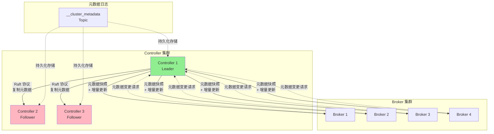

# 01. KRaft 架构概述

> **本文档导读**
>
> 本文档介绍 Kafka KRaft 架构的基本概念、设计理念和核心组件。
>
> **预计阅读时间**: 20 分钟
>
> **相关文档**:
> - [02-startup-flow.md](./02-startup-flow.md) - ControllerServer 启动流程
> - [03-quorum-controller.md](./03-quorum-controller.md) - QuorumController 核心实现

---

## 1. KRaft 架构概述

### 1.1 为什么需要 KRaft？

```scala
/**
 * ZooKeeper 模式的问题:
 *
 * 1. 元数据分离
 *    - ZooKeeper 存储元数据
 *    - Broker 在内存中缓存元数据
 *    - 两者之间可能不一致
 *
 * 2. 性能瓶颈
 *    - 元数据变更需要写入 ZooKeeper
 *    - Watch 通知延迟
 *    - 单点故障风险
 *
 * 3. 运维复杂
 *    - 需要单独部署 ZooKeeper 集群
 *    - 两套系统需要协调
 *    - 配置复杂
 *
 * KRaft 模式的优势:
 *
 * 1. 自包含元数据管理
 *    - 元数据存储在 __cluster_metadata Topic
 *    - Broker 和 Controller 共享同一套元数据
 *
 * 2. Raft 协议保证一致性
 *    - 强一致性保证
 *    - 自动故障转移
 *    - 无需外部协调服务
 *
 * 3. 更好的性能
 *    - 减少网络跳数
 *    - 元数据变更延迟更低
 *    - 水平扩展能力更强
 */
```

### 1.2 KRaft 架构图



### 1.3 核心组件职责

| 组件 | 职责 | 关键类 |
|------|------|--------|
| **ControllerServer** | Controller 服务器入口，管理 Controller 生命周期 | `kafka.server.ControllerServer` |
| **QuorumController** | 核心控制逻辑，处理所有元数据操作 | `org.apache.kafka.controller.QuorumController` |
| **KafkaRaftManager** | Raft 协议实现，管理 Raft 日志复制 | `kafka.raft.KafkaRaftManager` |
| **MetadataPublisher** | 元数据发布器，将元数据变更推送给 Broker | `org.apache.kafka.image.publisher.MetadataPublisher` |
| **ControllerApis** | 处理 Controller 请求，提供 API 接口 | `kafka.server.ControllerApis` |
| **ReplicaManager** | 副本管理器，处理分区和副本操作 | `kafka.server.ReplicaManager` |
| **MetadataLog** | 元数据日志，存储集群元数据快照 | `org.apache.kafka.snapshot.MetadataLog` |

### 1.4 KRaft vs ZooKeeper 模式对比

| 特性 | ZooKeeper 模式 | KRaft 模式 |
|------|---------------|-----------|
| **元数据存储** | 外部 ZooKeeper 集群 | 内部 __cluster_metadata Topic |
| **故障检测** | ZooKeeper Session 超时 | Raft 心跳机制 |
| **元数据一致性** | 最终一致性 | 强一致性 |
| **扩展性** | 受 ZooKeeper 限制 | 水平扩展能力更强 |
| **部署复杂度** | 需要独立部署 ZK | 仅需部署 Kafka |
| **性能** | 元数据变更延迟较高 | 延迟更低 |
| **单点故障** | ZK 集群需要奇数节点 | Controller Quorum 需要 3/5 节点 |
| **元数据传播** | Watch 通知机制 | 元数据快照 + 增量更新 |

### 1.5 KRaft 模式的核心优势

#### 优势 1: 简化架构
```scala
/**
 * ZooKeeper 模式架构:
 *
 * Client → Broker → ZooKeeper (元数据)
 *                  ↓
 *               Watch 通知
 *                  ↓
 *               Broker 更新缓存
 *
 * 问题:
 * - 两套系统需要协调
 * - 元数据可能不一致
 * - Watch 通知延迟
 *
 * KRaft 模式架构:
 *
 * Client → Broker → Controller (Leader)
 *                  ↓
 *             Raft 协议复制
 *                  ↓
 *         Controller (Follower) + Broker
 *
 * 优势:
 * - 单一系统，自包含
 * - 强一致性保证
 * - 更低延迟
 */
```

#### 优势 2: 提升 MetaData 操作性能

```scala
/**
 * 性能对比:
 *
 * ZooKeeper 模式:
 * - CreateTopics: ~50-100ms (需要写 ZK + Watch 通知)
 * - Partition 变更: ~30-50ms
 *
 * KRaft 模式:
 * - CreateTopics: ~10-20ms (直接写 __cluster_metadata)
 * - Partition 变更: ~5-10ms
 *
 * 性能提升: 3-5倍
 */
```

#### 优势 3: 更强的扩展性

```scala
/**
 * 扩展性对比:
 *
 * ZooKeeper 模式:
 * - ZK 写性能瓶颈: 单 Leader 处理所有写请求
 * - ZK 集群规模: 通常 3-5 个节点
 * - 元数据操作 TPS: ~1000-3000
 *
 * KRaft 模式:
 * - Controller 可以水平扩展
 * - 元数据操作 TPS: ~10000+
 * - 支持更多 Topic 和 Partition
 */
```

### 1.6 元数据存储机制

#### __cluster_metadata Topic 设计

```scala
/**
 * __cluster_metadata Topic 特点:
 *
 * 1. 内部 Topic (用户不可见)
 * 2. 副本因子 = Controller Quorum 大小
 * 3. 分区数 = 1 (单分区保证顺序)
 * 4. 压缩策略 = 清理 (Compact，保留最新值)
 * 5. 不进行日志清理
 *
 * 存储内容:
 * - Topic 配置变更
 * - Partition 分配变更
 * - ACL 变更
 * - Client Quotas 变更
 * - Controller 选举结果
 */
```

#### 元数据快照机制

```scala
/**
 * MetadataSnapshot 机制:
 *
 * 问题:
 * - 如果 __cluster_metadata 只保留增量日志
 * - 新启动的 Controller/Broker 需要回放所有日志
 * - 启动时间随日志增长线性增加
 *
 * 解决方案: 定期生成快照
 *
 * 1. 每 5000 条记录或 1 小时生成一次快照
 * 2. 快照包含完整的元数据状态
 * 3. 加载时先加载快照，再回放增量日志
 *
 * 示例:
 *
 * Timeline:
 * t0: Snapshot 1 (包含完整元数据)
 * t1: Δ1 (增量变更1)
 * t2: Δ2 (增量变更2)
 * t3: Δ3 (增量变更3)
 * t4: Snapshot 2 (包含完整元数据)
 * t5: Δ4 (增量变更4)
 *
 * 加载流程:
 * if (Snapshot 2 存在) {
 *     加载 Snapshot 2
 *     回放 Δ4
 * } else {
 *     加载 Snapshot 1
 *     回放 Δ1, Δ2, Δ3, Δ4
 * }
 */
```

---
