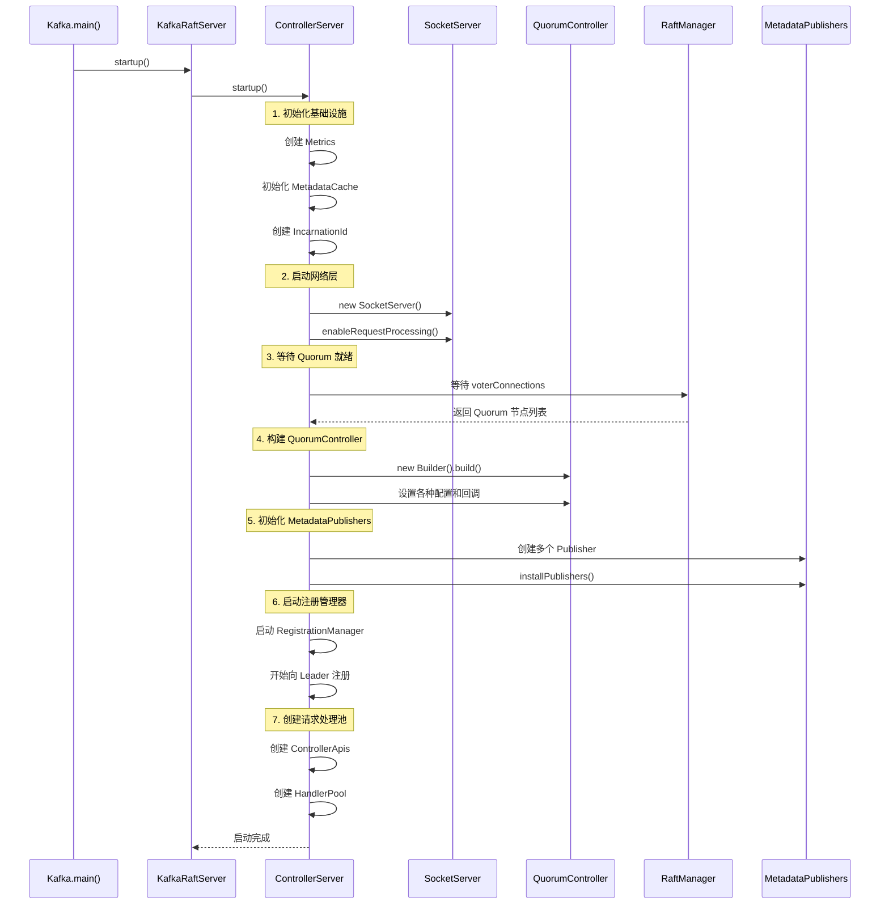

# 02. ControllerServer 启动流程

> **本文档导读**
>
> 本文档详细分析 ControllerServer 的启动流程，包括各个组件的初始化顺序和依赖关系。
>
> **预计阅读时间**: 30 分钟
>
> **相关文档**:
> - [01-krft-overview.md](./01-krft-overview.md) - KRaft 架构概述
> - [03-quorum-controller.md](./03-quorum-controller.md) - QuorumController 核心实现

---

## 2. ControllerServer 启动流程

### 2.1 启动时序图



### 2.2 ControllerServer.startup() 源码分析

```scala
// kafka/server/ControllerServer.scala

def startup(): Unit = {
  if (!maybeChangeStatus(SHUTDOWN, STARTING)) return
  val startupDeadline = Deadline.fromDelay(time, config.serverMaxStartupTimeMs, TimeUnit.MILLISECONDS)
  try {
    this.logIdent = logContext.logPrefix()
    info("Starting controller")

    // ========== 1. 初始化 Metrics ==========
    metricsGroup.newGauge("ClusterId", () => clusterId)
    metricsGroup.newGauge("yammer-metrics-count", () => KafkaYammerMetrics.defaultRegistry.allMetrics.size)

    // ========== 2. 初始化 Authorizer ==========
    authorizerPlugin = config.createNewAuthorizer(metrics, ProcessRole.ControllerRole.toString)

    // ========== 3. 初始化 MetadataCache ==========
    /**
     * KRaftMetadataCache: 存储集群元数据
     * - Topic 信息
     * - Partition 信息
     * - Broker 信息
     * - ACL 信息
     */
    metadataCache = new KRaftMetadataCache(config.nodeId, () => raftManager.client.kraftVersion())
    metadataCachePublisher = new KRaftMetadataCachePublisher(metadataCache)

    // ========== 4. 初始化 Features ==========
    featuresPublisher = new FeaturesPublisher(logContext, sharedServer.metadataPublishingFaultHandler)

    // ========== 5. 初始化 RegistrationManager ==========
    registrationsPublisher = new ControllerRegistrationsPublisher()
    incarnationId = Uuid.randomUuid()  // 每次启动生成唯一 ID

    // ========== 6. 初始化 API 版本管理 ==========
    val apiVersionManager = new SimpleApiVersionManager(
      ListenerType.CONTROLLER,
      config.unstableApiVersionsEnabled,
      () => featuresPublisher.features().setFinalizedLevel(
        KRaftVersion.FEATURE_NAME,
        raftManager.client.kraftVersion().featureLevel())
    )

    // ========== 7. 初始化网络层 ==========
    tokenCache = new DelegationTokenCache(ScramMechanism.mechanismNames)
    credentialProvider = new CredentialProvider(ScramMechanism.mechanismNames, tokenCache)

    socketServer = new SocketServer(
      config,
      metrics,
      time,
      credentialProvider,
      apiVersionManager,
      sharedServer.socketFactory
    )

    // 获取监听器信息
    val listenerInfo = ListenerInfo
      .create(config.effectiveAdvertisedControllerListeners.asJava)
      .withWildcardHostnamesResolved()
      .withEphemeralPortsCorrected(name => socketServer.boundPort(new ListenerName(name)))

    socketServerFirstBoundPortFuture.complete(listenerInfo.firstListener().port())

    // ========== 8. 启动 RaftManager ==========
    sharedServer.startForController(listenerInfo)

    // ========== 9. 初始化策略插件 ==========
    createTopicPolicy = Option(config.getConfiguredInstance(
      CREATE_TOPIC_POLICY_CLASS_NAME_CONFIG, classOf[CreateTopicPolicy]))
    alterConfigPolicy = Option(config.getConfiguredInstance(
      ALTER_CONFIG_POLICY_CLASS_NAME_CONFIG, classOf[AlterConfigPolicy]))

    // ========== 10. 等待 Quorum Voter 连接 ==========
    /**
     * 等待所有 Quorum 节点的连接建立
     * 这是一个阻塞操作，确保 Raft 集群可以正常通信
     */
    val voterConnections = FutureUtils.waitWithLogging(
    logger.underlying,
    logIdent,
    "controller quorum voters future",
    sharedServer.controllerQuorumVotersFuture,
    startupDeadline,
    time
  )
    val controllerNodes = QuorumConfig.voterConnectionsToNodes(voterConnections)

    // ========== 11. 初始化 QuorumFeatures ==========
    val quorumFeatures = new QuorumFeatures(
      config.nodeId,
      QuorumFeatures.defaultSupportedFeatureMap(config.unstableFeatureVersionsEnabled),
      controllerNodes.asScala.map(node => Integer.valueOf(node.id())).asJava
    )

    // ========== 12. 构建 QuorumController ==========
    val controllerBuilder = {
      val leaderImbalanceCheckIntervalNs = if (config.autoLeaderRebalanceEnable) {
        OptionalLong.of(TimeUnit.NANOSECONDS.convert(config.leaderImbalanceCheckIntervalSeconds, TimeUnit.SECONDS))
      } else {
        OptionalLong.empty()
      }

      val maxIdleIntervalNs = config.metadataMaxIdleIntervalNs.fold(OptionalLong.empty)(OptionalLong.of)

      quorumControllerMetrics = new QuorumControllerMetrics(
        Optional.of(KafkaYammerMetrics.defaultRegistry),
        time,
        config.brokerSessionTimeoutMs
      )

      new QuorumController.Builder(config.nodeId, sharedServer.clusterId)
        .setTime(time)
        .setThreadNamePrefix(s"quorum-controller-${config.nodeId}-")
        .setConfigSchema(configSchema)
        .setRaftClient(raftManager.client)           // 关键: Raft 客户端
        .setQuorumFeatures(quorumFeatures)
        .setDefaultReplicationFactor(config.defaultReplicationFactor.toShort)
        .setDefaultNumPartitions(config.numPartitions.intValue())
        .setSessionTimeoutNs(TimeUnit.NANOSECONDS.convert(config.brokerSessionTimeoutMs.longValue(), TimeUnit.MILLISECONDS))
        .setLeaderImbalanceCheckIntervalNs(leaderImbalanceCheckIntervalNs)
        .setMaxIdleIntervalNs(maxIdleIntervalNs)
        .setMetrics(quorumControllerMetrics)
        .setCreateTopicPolicy(createTopicPolicy.toJava)
        .setAlterConfigPolicy(alterConfigPolicy.toJava)
        .setConfigurationValidator(new ControllerConfigurationValidator(sharedServer.brokerConfig))
        .setStaticConfig(config.originals)
        .setBootstrapMetadata(bootstrapMetadata)
        .setFatalFaultHandler(sharedServer.fatalQuorumControllerFaultHandler)
        .setNonFatalFaultHandler(sharedServer.nonFatalQuorumControllerFaultHandler)
        .setDelegationTokenCache(tokenCache)
        .setDelegationTokenSecretKey(delegationTokenKeyString)
        .setDelegationTokenMaxLifeMs(delegationTokenManagerConfigs.delegationTokenMaxLifeMs)
        .setDelegationTokenExpiryTimeMs(delegationTokenManagerConfigs.delegationTokenExpiryTimeMs)
        .setDelegationTokenExpiryCheckIntervalMs(delegationTokenManagerConfigs.delegationTokenExpiryCheckIntervalMs)
        .setUncleanLeaderElectionCheckIntervalMs(config.uncleanLeaderElectionCheckIntervalMs)
        .setControllerPerformanceSamplePeriodMs(config.controllerPerformanceSamplePeriodMs)
        .setControllerPerformanceAlwaysLogThresholdMs(config.controllerPerformanceAlwaysLogThresholdMs)
    }

    controller = controllerBuilder.build()  // 构建 QuorumController

    // ========== 13. 设置 Authorizer ==========
    authorizerPlugin.foreach { plugin =>
      plugin.get match {
        case a: ClusterMetadataAuthorizer => a.setAclMutator(controller)
        case _ =>
      }
    }

    // ========== 14. 初始化 Quota 管理器 ==========
    quotaManagers = QuotaFactory.instantiate(
      config,
      metrics,
      time,
      s"controller-${config.nodeId}-",
      ProcessRole.ControllerRole.toString
    )
    clientQuotaMetadataManager = new ClientQuotaMetadataManager(quotaManagers, socketServer.connectionQuotas)

    // ========== 15. 创建 ControllerApis ==========
    controllerApis = new ControllerApis(
      socketServer.dataPlaneRequestChannel,
      authorizerPlugin,
      quotaManagers,
      time,
      controller,
      raftManager,
      config,
      clusterId,
      registrationsPublisher,
      apiVersionManager,
      metadataCache
    )

    controllerApisHandlerPool = sharedServer.requestHandlerPoolFactory.createPool(
      config.nodeId,
      socketServer.dataPlaneRequestChannel,
      controllerApis,
      time,
      config.numIoThreads,
      "controller"
    )

    // ========== 16. 设置 MetadataPublishers ==========
    /**
     * MetadataPublisher 负责将元数据变更发布到各个组件
     * 每个 Publisher 关注不同类型的元数据变更
     */
    metadataPublishers.add(metadataCachePublisher)      // 元数据缓存
    metadataPublishers.add(featuresPublisher)            // 特性版本
    metadataPublishers.add(registrationsPublisher)       // Controller 注册信息

    // ========== 17. 创建 RegistrationManager ==========
    /**
     * KIP-919: Controller 注册机制
     * 每个 Controller 需要向 Leader 注册自己
     */
    registrationManager = new ControllerRegistrationManager(
      config.nodeId,
      clusterId,
      time,
      s"controller-${config.nodeId}-",
      QuorumFeatures.defaultSupportedFeatureMap(config.unstableFeatureVersionsEnabled),
      incarnationId,
      listenerInfo
    )
    metadataPublishers.add(registrationManager)

    // ========== 18. 添加其他 Publishers ==========
    // 动态配置发布器
    metadataPublishers.add(new DynamicConfigPublisher(
      config,
      sharedServer.metadataPublishingFaultHandler,
      immutable.Map[ConfigType, ConfigHandler](
        ConfigType.BROKER -> new BrokerConfigHandler(config, quotaManagers)
      ),
      "controller"
    ))

    // 客户端配额发布器
    metadataPublishers.add(new DynamicClientQuotaPublisher(
      config.nodeId,
      sharedServer.metadataPublishingFaultHandler,
      "controller",
      clientQuotaMetadataManager
    ))

    // Topic 集群配额发布器
    metadataPublishers.add(new DynamicTopicClusterQuotaPublisher(
      clusterId,
      config.nodeId,
      sharedServer.metadataPublishingFaultHandler,
      "controller",
      quotaManagers.clientQuotaCallbackPlugin(),
      quotaManagers.quotaConfigChangeListener()
    ))

    // SCRAM 发布器
    metadataPublishers.add(new ScramPublisher(
      config.nodeId,
      sharedServer.metadataPublishingFaultHandler,
      "controller",
      credentialProvider
    ))

    // DelegationToken 发布器
    metadataPublishers.add(new DelegationTokenPublisher(
      config.nodeId,
      sharedServer.metadataPublishingFaultHandler,
      "controller",
      new DelegationTokenManager(delegationTokenManagerConfigs, tokenCache)
    ))

    // Metrics 发布器
    metadataPublishers.add(new ControllerMetadataMetricsPublisher(
      sharedServer.controllerServerMetrics,
      sharedServer.metadataPublishingFaultHandler
    ))

    // ACL 发布器
    metadataPublishers.add(new AclPublisher(
      config.nodeId,
      sharedServer.metadataPublishingFaultHandler,
      "controller",
      authorizerPlugin.toJava
    ))

    // ========== 19. 安装所有 Publishers ==========
    /**
     * 将 Publishers 注册到 MetadataLoader
     * 开始接收元数据变更通知
     */
    FutureUtils.waitWithLogging(logger.underlying, logIdent,
      "the controller metadata publishers to be installed",
      sharedServer.loader.installPublishers(metadataPublishers),
      startupDeadline,
      time
    )

    // ========== 20. 启动网络处理 ==========
    val authorizerFutures: Map[Endpoint, CompletableFuture[Void]] =
      endpointReadyFutures.futures().asScala.toMap

    val socketServerFuture = socketServer.enableRequestProcessing(authorizerFutures)

    // ========== 21. 启动 RegistrationManager ==========
    val controllerNodeProvider = RaftControllerNodeProvider.create(raftManager, config)
    registrationChannelManager = new NodeToControllerChannelManagerImpl(
      controllerNodeProvider,
      time,
      metrics,
      config,
      "registration",
      s"controller-${config.nodeId}-",
      5000
    )
    registrationChannelManager.start()
    registrationManager.start(registrationChannelManager)

    // ========== 22. 等待所有组件就绪 ==========
    FutureUtils.waitWithLogging(logger.underlying, logIdent,
      "all of the authorizer futures to be completed",
      CompletableFuture.allOf(authorizerFutures.values.toSeq: _*),
      startupDeadline,
      time
    )

    FutureUtils.waitWithLogging(logger.underlying, logIdent,
      "all of the SocketServer Acceptors to be started",
      socketServerFuture,
      startupDeadline,
      time
    )

    maybeChangeStatus(STARTING, STARTED)
  } catch {
    case e: Throwable =>
      maybeChangeStatus(STARTING, STARTED)
      sharedServer.controllerStartupFaultHandler.handleFault("caught exception", e)
      shutdown()
      throw e
  }
}
```

### 2.3 MetadataPublisher 机制

```scala
/**
 * MetadataPublisher 是元数据变更的观察者模式实现
 *
 * 工作流程:
 * 1. QuorumController 写入元数据记录到 __cluster_metadata Topic
 * 2. Raft 协议确保记录复制到多数节点
 * 3. MetadataLoader 读取新记录
 * 4. MetadataLoader 通知所有已注册的 Publishers
 * 5. 每个 Publisher 更新自己负责的组件
 */

// Publisher 类型及职责
trait MetadataPublisher {
  /**
   * 当元数据快照更新时调用
   * @param metadata 新的元数据快照
   */
  def onMetadataUpdate(metadata: MetadataImage, newRecord: Option[ApiMessageAndVersion]): Unit
}

// 常见的 Publishers:
// 1. KRaftMetadataCachePublisher   - 更新 Broker 的元数据缓存
// 2. FeaturesPublisher             - 更新特性版本
// 3. ControllerRegistrationsPublisher - 更新 Controller 注册信息
// 4. DynamicConfigPublisher        - 处理动态配置变更
// 5. AclPublisher                  - 处理 ACL 变更
// 6. ScramPublisher                - 处理 SCRAM 凭证变更
```

---
