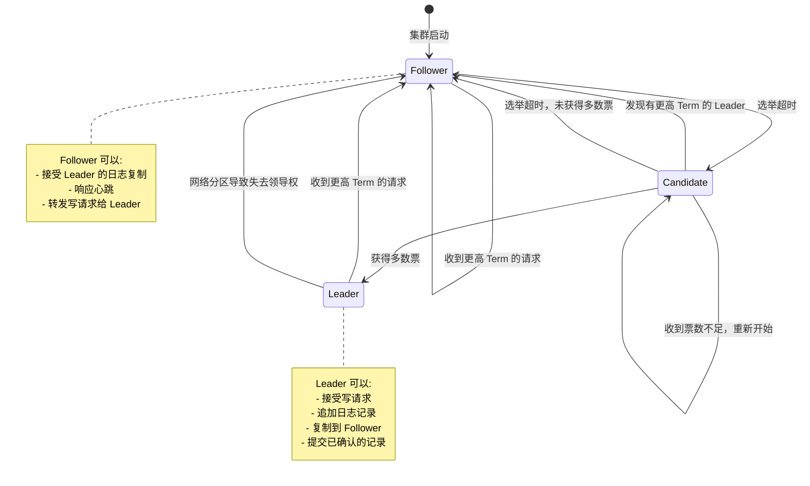
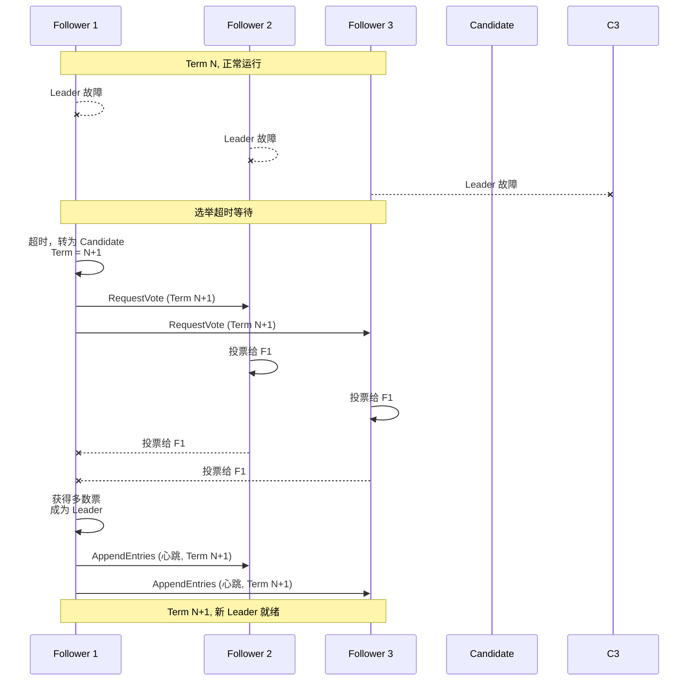
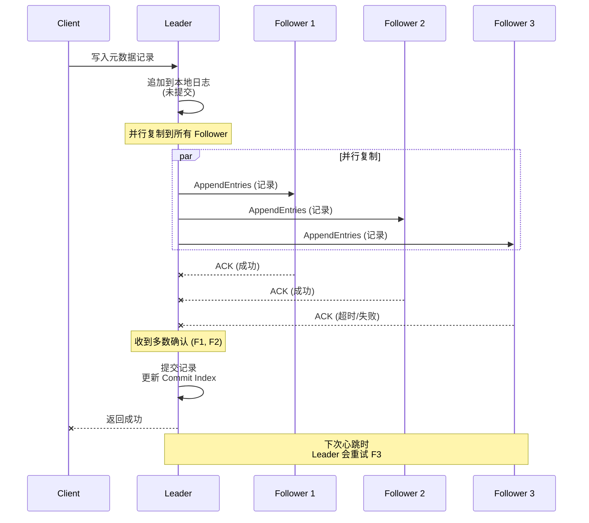

# 04. Raft 协议实现

> **本文档导读**
>
> 本文档介绍 Raft 协议在 Kafka 中的具体实现，包括 Leader 选举、日志复制等机制。
>
> **预计阅读时间**: 40 分钟
>
> **相关文档**:
> - [01-krft-overview.md](./01-krft-overview.md) - KRaft 架构概述
> - [03-quorum-controller.md](./03-quorum-controller.md) - QuorumController 核心实现

---

## 4. Raft 协议实现

### 4.1 Raft 基础概念

```scala
/**
 * Raft 协议核心概念:
 *
 * 1. 角色类型
 *    - Leader: 处理所有写请求
 *    - Follower: 复制 Leader 的日志
 *    - Candidate: 选举中的临时状态
 *
 * 2. 术语
 *    - Term (任期): 逻辑时钟，每次选举后递增
 *    - Log Entry: 日志条目，包含元数据记录
 *    - Commit Index: 已提交的最大索引
 *    - High Watermark: 多数节点已复制的索引
 *
 * 3. 一致性保证
 *    - Leader 完整性: 如果一条记录在某个 Term 提交，
 *                    它将在所有后续 Term 的 Leader 中存在
 *    - 日志匹配性: 两个日志如果索引相同，则记录相同
 *    - 领导者附加性: Leader 不会覆盖或删除已提交的记录
 */
```

### 4.2 Raft 状态转换



### 4.3 Leader 选举流程



### 4.4 日志复制流程



### 4.5 KafkaRaftManager 实现

```scala
// kafka/raft/KafkaRaftManager.scala

class KafkaRaftManager[MessageType](
    config: KafkaConfig,
    clientConfig: RaftConfig,
    time: Time,
    threadNamePrefix: Option[String],
    val metrics: Metrics,
    val scheduler: Scheduler,
    val topicPartition: TopicPartition,
    val apiVersionManager: ApiVersionManager,
    val listenerName: ListenerName,
    val storageDir: File
) extends Logging {

  /**
   * Raft 客户端: 与 Raft 集群交互
   */
  @volatile var client: RaftClient[MessageType] = _

  /**
   * Raft 服务器: 处理 Raft 协议消息
   */
  @volatile var server: KafkaRaftServer[MessageType] = _

  def startup(): Unit = {
    // ========== 1. 创建 Raft IO 层 ==========
    /**
     * RaftIO 负责:
     * - 读写日志文件
     * - 创建快照
     * - 加载快照
     */
    val raftIo = new RaftIo(
      metadataPartition,
      config,
      time,
      scheduler,
      apiVersionManager
    )

    // ========== 2. 创建 RaftClient ==========
    /**
     * RaftClient 提供给上层使用
     * 用于:
     * - 追加记录
     * - 读取记录
     * - 查询 Leader 信息
     */
    client = RaftClient.newBuilder()
      .setNodeId(config.nodeId)
      .setRaftConfig(clientConfig)
      .setTime(time)
      .setLogContext(logContext)
      .build()

    // ========== 3. 创建 RaftServer ==========
    /**
     * RaftServer 处理:
     * - Raft 协议消息
     * - 选举
     * - 日志复制
     * - 快照管理
     */
    server = KafkaRaftServer.newBuilder()
      .setNodeId(config.nodeId)
      .setRaftConfig(clientConfig)
      .setRaftClient(client)
      .setTime(time)
      .build()

    server.start()
  }

  /**
   * 追加记录到元数据日志
   * 这是一个异步操作
   */
  def append(
    records: JavaList[ApiMessageAndVersion],
    timeoutMs: Long,
    waitForAll: Boolean
  ): CompletableFuture[Long] = {
    client.append(records, timeoutMs, waitForAll)
  }

  /**
   * 读取元数据日志
   */
  def read(
    startOffset: Long,
    maxBytes: Int
  ): JavaOptional[BatchReader[MessageType]] = {
    client.read(startOffset, maxBytes)
  }

  /**
   * 获取当前 Leader 信息
   */
  def leaderAndEpoch(): LeaderAndEpoch = {
    client.leaderAndEpoch()
  }
}
```

---
