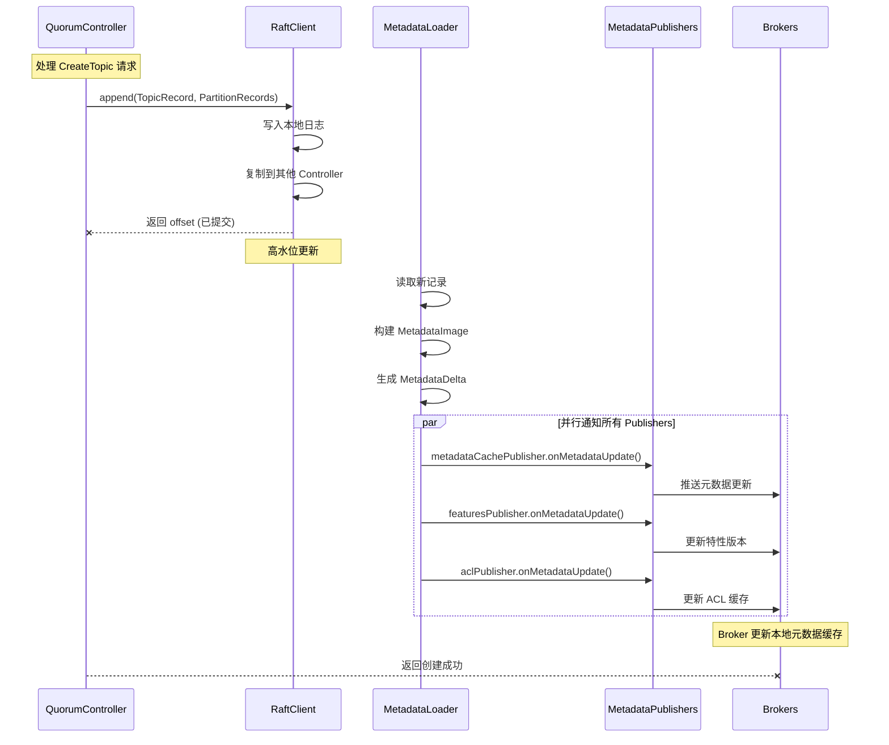

# 05. 元数据发布机制

> **本文档导读**
>
> 本文档介绍元数据发布机制，包括 MetadataImage、MetadataDelta 和 MetadataPublisher 的实现。
>
> **预计阅读时间**: 35 分钟
>
> **相关文档**:
> - [03-quorum-controller.md](./03-quorum-controller.md) - QuorumController 核心实现
> - [02-startup-flow.md](./02-startup-flow.md) - ControllerServer 启动流程

---

## 5. 元数据发布机制

### 5.1 MetadataImage 快照

```java
/**
 * MetadataImage 是 Kafka 集群元数据的不可变快照
 *
 * 设计特点:
 * 1. 不可变性: 一旦创建就不会修改
 * 2. 完整性: 包含所有类型的元数据
 * 3. 一致性: 所有元数据在同一时间点一致
 * 4. 快速访问: 预先构建索引，查询快速
 */

// org/apache/kafka/image/MetadataImage.java

public final class MetadataImage {
    /**
     * 元数据特性
     */
    private final FeaturesImage features;

    /**
     * 集群元数据 (Broker 信息)
     */
    private final ClusterImage cluster;

    /**
     * Topic 元数据
     */
    private final TopicsImage topics;

    /**
     * 配置元数据
     */
    private final ConfigsImage configs;

    /**
     * Client 配额
     */
    private final ClientQuotasImage clientQuotas;

    /**
     * Producer ID 映射
     */
    private final ProducerIdsImage producerIds;

    /**
     * ACL 元数据
     */
    private final AclsImage acls;

    /**
     * DelegationToken 元数据
     */
    private final DelegationTokenImage delegationToken;

    /**
     * SCRAM 凭证
     */
    private final ScramImage scram;

    // ... 其他元数据

    /**
     * 创建新快照
     * 当元数据变更时调用
     */
    public MetadataImage with(
        FeaturesImage newFeatures,
        ClusterImage newCluster,
        TopicsImage newTopics,
        // ... 其他参数
    ) {
        return new MetadataImage(
            newFeatures,
            newCluster,
            newTopics,
            // ...
        );
    }
}
```

### 5.2 元数据发布流程



### 5.3 MetadataPublisher 实现

```java
/**
 * MetadataPublisher 接口实现示例
 */

// ===== 1. KRaftMetadataCachePublisher =====

public class KRaftMetadataCachePublisher implements MetadataPublisher {
    private final KRaftMetadataCache cache;

    @Override
    public void onMetadataUpdate(
        MetadataImage newImage,
        MetadataDelta delta
    ) {
        /**
         * 更新 Broker 的元数据缓存
         */
        cache.setImage(newImage);

        /**
         * 通知等待元数据的线程
         */
        cache.notifyAll();
    }
}

// ===== 2. AclPublisher =====

public class AclPublisher implements MetadataPublisher {
    private final Optional<Plugin<Authorizer>> authorizer;

    @Override
    public void onMetadataUpdate(
        MetadataImage newImage,
        MetadataDelta delta
    ) {
        authorizer.ifPresent(plugin -> {
            Authorizer authorizer = plugin.get();

            /**
             * 处理 ACL 变更
             */
            for (ApiMessageAndVersion messageAndVersion : delta.aclChanges()) {
                ApiMessage message = messageAndVersion.message();

                if (message instanceof AccessControlEntryRecord) {
                    AccessControlEntryRecord record =
                        (AccessControlEntryRecord) message;

                    /**
                     * 添加 ACL
                     */
                    authorizer.addAcl(
                        new AccessControlEntry(
                            record.principal(),
                            record.host(),
                            record.operation(),
                            record.permissionType()
                        )
                    );
                } else if (message instanceof RemoveAccessControlEntryRecord) {
                    RemoveAccessControlEntryRecord record =
                        (RemoveAccessControlEntryRecord) message;

                    /**
                     * 删除 ACL
                     */
                    authorizer.removeAcl(
                        new AccessControlEntry(
                            record.principal(),
                            record.host(),
                            record.operation(),
                            record.permissionType()
                        )
                    );
                }
            }
        });
    }
}

// ===== 3. DynamicConfigPublisher =====

public class DynamicConfigPublisher implements MetadataPublisher {
    private final KafkaConfig config;
    private final Map<ConfigType, ConfigHandler> handlers;

    @Override
    public void onMetadataUpdate(
        MetadataImage newImage,
        MetadataDelta delta
    ) {
        /**
         * 处理配置变更
         */
        for (ConfigRecord configRecord : delta.configChanges()) {
            ConfigType type = ConfigType.of(configRecord.resourceType());

            /**
             * 根据配置类型调用对应的 Handler
             */
            ConfigHandler handler = handlers.get(type);

            if (handler != null) {
                handler.processConfigChanges(
                    configRecord.resourceName(),
                    Collections.singletonMap(
                        configRecord.name(),
                        configRecord.value()
                    )
                );
            }
        }
    }
}
```

---
