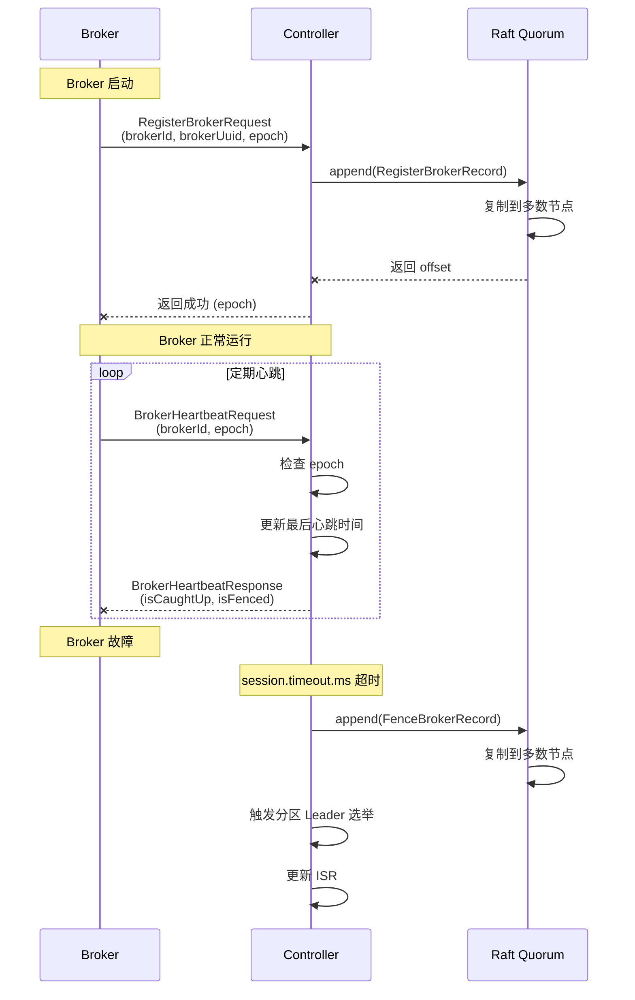

# 06. Controller 高可用与故障处理

> **本文档导读**
>
> 本文档介绍 Controller 的高可用机制，包括故障检测、Leader 选举和故障转移。
>
> **预计阅读时间**: 25 分钟
>
> **相关文档**:
> - [07-leader-election.md](./07-leader-election.md) - Leader 选举机制详解
> - [11-troubleshooting.md](./11-troubleshooting.md) - 故障排查指南

---

## 6. Controller 高可用与故障处理

### 6.1 Controller 故障检测

```scala
/**
 * Controller 故障检测机制:
 *
 * 1. Broker 心跳
 *    - Broker 定期发送心跳给 Controller
 *    - 心跳包含 Broker 的 epoch
 *    - Controller 检查 epoch 是否连续
 *
 * 2. Session 超时
 *    - 如果 Controller 在 session.timeout.ms 内没有收到心跳
 *    - 将 Broker 标记为过期
 *    - 触发 Leader 重新选举
 *
 * 3. Controller 故障转移
 *    - 如果 Leader Controller 故障
 *    - 其他 Controller 通过 Raft 选举新 Leader
 *    - 新 Leader 恢复元数据管理
 */
```

### 6.2 Broker 注册与心跳



### 6.3 Controller Leader 选举

```java
/**
 * Controller Leader 选举过程
 *
 * 1. 检测到故障
 *    - Follower 发现 Leader 没有发送心跳
 *    - 等待 election timeout
 *
 * 2. 转换为 Candidate
 *    - 递增 Term
 *    - 投票给自己
 *    - 发送 RequestVote 给其他节点
 *
 * 3. 收集投票
 *    - 如果获得多数票，成为 Leader
 *    - 否则，等待下一轮选举
 *
 * 4. 成为 Leader
 *    - 发送心跳维持领导权
 *    - 开始处理写请求
 *    - 追赶 Follower 的日志
 */

// Raft 选举超时
private final long electionTimeoutMs = 1000;  // 1 秒

// 心跳间隔
private final long heartbeatIntervalMs = 100; // 100 毫秒
```

### 6.4 元数据恢复

```java
/**
 * 当新 Controller Leader 上任时，需要恢复元数据
 *
 * 恢复流程:
 * 1. 加载快照
 *    - 从磁盘加载最新的快照文件
 *    - 快照包含完整的元数据状态
 *
 * 2. 重放日志
 *    - 从快照 offset 之后的所有日志
 *    - 按顺序重放，重建最新状态
 *
 * 3. 构建 MetadataImage
 *    - 基于快照和日志，构建最新快照
 *
 * 4. 发布元数据
 *    - 通知所有 Publishers
 *    - Publishers 更新各自管理的组件
 */

// MetadataLoader.replay()

public MetadataImage replay(
    SnapshotReader snapshot,
    BatchReader<ApiMessageAndVersion> batch
) {
    // ========== 1. 加载快照 ==========
    MetadataImage image = MetadataImage.EMPTY;
    if (snapshot != null) {
        image = snapshot.load();
    }

    // ========== 2. 重放日志 ==========
    MetadataDelta delta = new MetadataDelta.Builder()
        .setImage(image)
        .build();

    while (batch.hasNext()) {
        Batch<ApiMessageAndVersion> batch = batch.next();

        for (ApiMessageAndVersion record : batch.records()) {
            /**
             * 重放每条记录
             * delta 会更新内部的元数据
             */
            delta.replay(record);
        }
    }

    // ========== 3. 生成新快照 ==========
    return delta.image();
}
```

---
