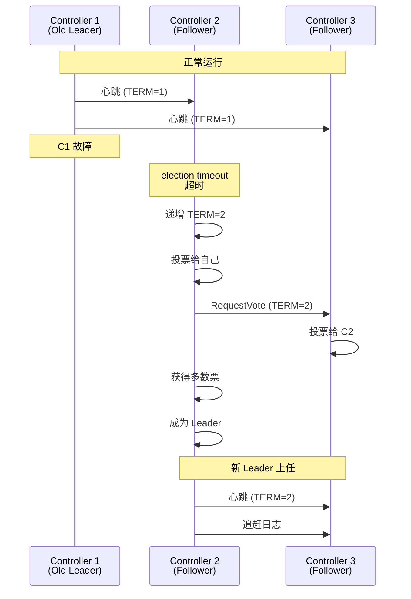
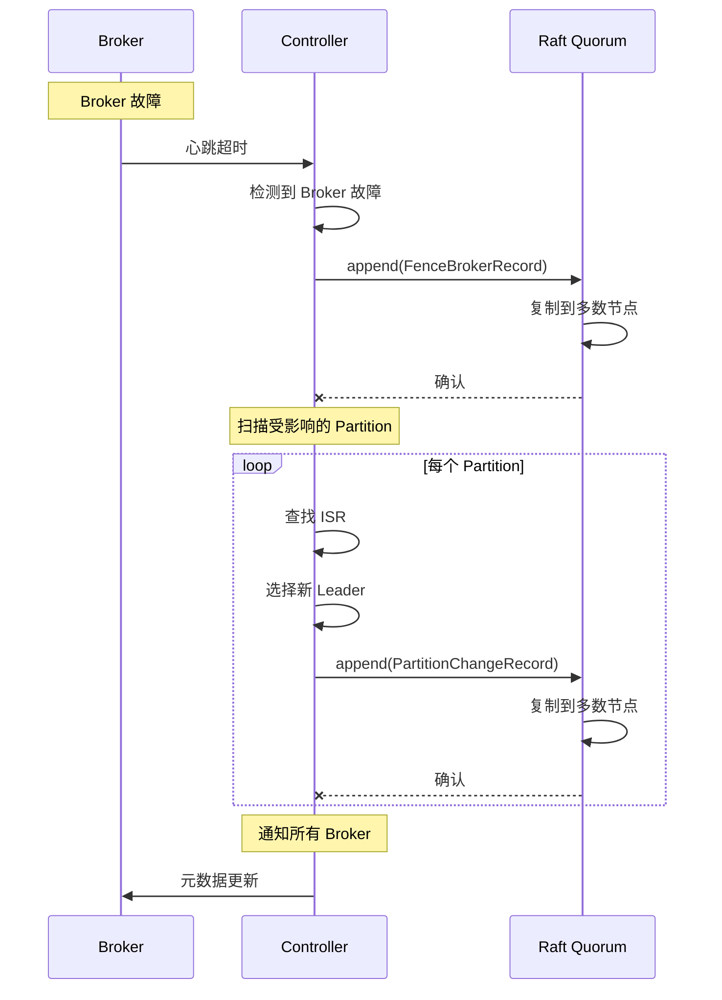

# 07. Leader 选举机制详解

> **本文档导读**
>
> 本文档详细介绍 KRaft 中的 Leader 选举机制，包括 Controller Leader 选举和 Partition Leader 选举。
>
> **预计阅读时间**: 20 分钟
>
> **相关文档**:
> - [06-high-availability.md](./06-high-availability.md) - Controller 高可用与故障处理
> - [04-raft-implementation.md](./04-raft-implementation.md) - Raft 协议实现

---

## 1. Controller Leader 选举

### 1.1 选举触发条件

Controller Leader 选举在以下情况下触发:

1. **集群初始化**
   - Controller 集群首次启动
   - 所有节点都是 Candidate 状态

2. **Leader 故障**
   - Follower 检测到 Leader 失效
   - 超过 `election.timeout.ms` 未收到心跳

3. **Leader 主动辞职**
   - Leader 收到更高 TERM 的请求
   - Leader 发现自己不再是活跃节点

### 1.2 选举流程

```java
/**
 * Controller Leader 选举过程
 *
 * 1. 检测到故障
 *    - Follower 发现 Leader 没有发送心跳
 *    - 等待 election timeout
 *
 * 2. 转换为 Candidate
 *    - 递增 TERM
 *    - 投票给自己
 *    - 发送 RequestVote 给其他节点
 *
 * 3. 收集投票
 *    - 如果获得多数票，成为 Leader
 *    - 否则，等待下一轮选举
 *
 * 4. 成为 Leader
 *    - 发送心跳维持领导权
 *    - 开始处理写请求
 *    - 追赶 Follower 的日志
 */

// Raft 选举超时
private final long electionTimeoutMs = 1000;  // 1 秒

// 心跳间隔
private final long heartbeatIntervalMs = 100; // 100 毫秒
```

### 1.3 选举时序图



### 1.4 选举配置参数

| 参数 | 默认值 | 说明 |
|------|--------|------|
| `controller.quorum.election.timeout.ms` | 1000 | 选举超时时间 (毫秒) |
| `controller.quorum.heartbeat.interval.ms` | 100 | 心跳间隔 (毫秒) |
| `controller.quorum.fetch.timeout.ms` | 2000 | 日志拉取超时 (毫秒) |

---

## 2. Partition Leader 选举

### 2.1 选举触发条件

Partition Leader 选举在以下情况下触发:

1. **Broker 故障**
   - Leader Broker 宕机
   - Controller 检测到 Broker Session 过期

2. **Leader 下线**
   - 主动下线 Broker
   - 维护操作

3. **Unclean Leader 选举**
   - ISR 中所有 Broker 都不可用
   - 需要从非 ISR 中选择 Leader

### 2.2 选举策略

```scala
/**
 * Partition Leader 选举策略
 *
 * 1. 优先从 ISR 中选择
 *    - ISR (In-Sync Replicas) 是与 Leader 保持同步的副本
 *    - 优先选择 ISR 中的第一个副本作为新 Leader
 *
 * 2. Unclean Leader 选举
 *    - 如果 ISR 为空，且 unclean.leader.election.enable=true
 *    - 从非 ISR 中选择 Leader
 *    - 可能导致数据丢失
 *
 * 3. 根据优先级选择
 *    - 可以配置 Broker 优先级
 *    - 优先选择高优先级的 Broker
 */
```

### 2.3 选举流程



### 2.4 选举算法

```scala
// Controller 中的 Partition Leader 选举逻辑

def electLeaders(
  partitions: Seq[TopicPartition]
  // 接口定义: List<TopicPartition> electLeaders(List<TopicPartition> partitions, ElectionType electionType, Timeout timeout)
): Map[TopicPartition, Either[ApiError, Int]] = {

  partitions.map { partition =>
    // ========== 1. 获取 Partition 信息 ==========
    val partitionInfo = image.topics().getPartition(partition)

    if (partitionInfo.isEmpty) {
      partition -> Left(new ApiError(Errors.UNKNOWN_TOPIC_OR_PARTITION, null))
    } else {
      val info = partitionInfo.get

      // ========== 2. 获取 ISR ==========
      val isr = info.isr

      if (isr.isEmpty) {
        // ========== 3. ISR 为空，尝试 Unclean 选举 ==========
        if (config.uncleanLeaderElectionEnable) {
          val replicas = info.replicas
          val newLeader = replicas.head
          partition -> Right(newLeader.id())
        } else {
          partition -> Left(new ApiError(Errors.LEADER_NOT_AVAILABLE, null))
        }
      } else {
        // ========== 4. 从 ISR 中选择第一个作为 Leader ==========
        val newLeader = isr.iterator().next()
        partition -> Right(newLeader.id())
      }
    }
  }.toMap
}
```

---

## 3. 选举参数调优

### 3.1 Controller 选举参数

```properties
# Controller 选举超时
# 建议: 根据网络延迟调整
# 网络较好: 500-1000ms
# 网络一般: 1000-2000ms
controller.quorum.election.timeout.ms=1000

# Controller 心跳间隔
# 建议: election.timeout.ms 的 1/5 到 1/10
controller.quorum.heartbeat.interval.ms=100

# Controller 日志拉取超时
# 建议: heartbeat.interval.ms 的 10-20 倍
controller.quorum.fetch.timeout.ms=2000
```

### 3.2 Partition 选举参数

```properties
# 是否允许 Unclean Leader 选举
# 生产环境建议: false (避免数据丢失)
# 测试环境: true (提高可用性)
unclean.leader.election.enable=false

# Leader 不平衡检查间隔
# 建议: 300s (5分钟)
leader.imbalance.check.interval.seconds=300

# Leader 不平衡比例阈值
# 建议: 0.1 (10%)
leader.imbalance.per.broker.percentage.threshold=10
```

---

## 4. 选举故障排查

### 4.1 Controller 选举慢

**症状**: Controller 选举耗时过长

**可能原因**:
1. 网络延迟高
2. `election.timeout.ms` 设置过大
3. Controller 负载过高

**解决方案**:
```bash
# 检查网络延迟
ping controller2
ping controller3

# 检查 Controller 负载
jstack <controller_pid> | grep QuorumController

# 调整选举超时
# controller.quorum.election.timeout.ms=500
```

### 4.2 Partition Leader 频繁选举

**症状**: Partition Leader 频繁变更

**可能原因**:
1. Broker 频繁故障
2. Session timeout 过短
3. GC 导致的长暂停

**解决方案**:
```bash
# 检查 Broker 日志
grep "Session expired" server.log

# 调整 Session timeout
# broker.session.timeout.ms=20000

# 检查 GC
jstat -gc <broker_pid> 1000
```

---

## 5. 相关源码

```
选举相关源码路径:
├── kafka/raft/
│   ├── RaftClient.java                    # Raft 客户端
│   ├── QuorumState.java                   # Quorum 状态机
│   └── CandidateState.java                # Candidate 状态
├── org/apache/kafka/controller/
│   ├── QuorumController.java              # Controller 实现
│   └── PartitionLeaderElector.java        # Partition Leader 选举
└── org/apache/kafka/image/
    └── MetadataImage.java                 # 元数据快照
```

---

## 6. 总结

### 6.1 选举机制对比

| 类型 | 触发条件 | 选举范围 | 协议 |
|------|----------|----------|------|
| **Controller Leader 选举** | Controller 故障 | Controller 集群 | Raft |
| **Partition Leader 选举** | Broker 故障 | Partition ISR | Controller 决定 |

### 6.2 最佳实践

1. **Controller 选举**
   - 至少 3 个 Controller 节点
   - 分布在不同机架
   - 配置合理的超时参数

2. **Partition Leader 选举**
   - 禁用 Unclean 选举
   - 保持 ISR 健康
   - 监控选举频率

3. **监控指标**
   - Controller 选举次数
   - Partition Leader 选举次数
   - 选举耗时

---

## 7. 相关文档

- **[06-high-availability.md](./06-high-availability.md)** - Controller 高可用与故障处理
- **[04-raft-implementation.md](./04-raft-implementation.md)** - Raft 协议实现
- **[11-troubleshooting.md](./11-troubleshooting.md)** - 故障排查指南
- **[10-monitoring.md](./10-monitoring.md)** - 监控与指标

---

**返回**: [README.md](./README.md)
