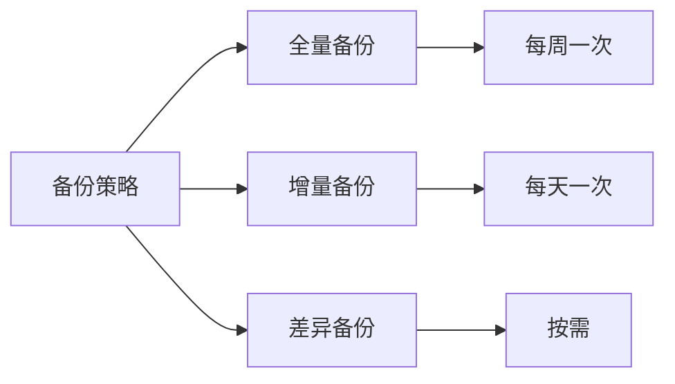

# 17. 备份与恢复策略

> **本文档导读**
>
> 本文档介绍 KRaft 模式的备份与恢复策略，包括元数据备份、集群备份和灾难恢复。
>
> **预计阅读时间**: 25 分钟
>
> **相关文档**:
> - [15-best-practices.md](./15-best-practices.md) - 最佳实践
> - [11-troubleshooting.md](./11-troubleshooting.md) - 故障排查指南

---

## 1. 备份概述

### 1.1 备份类型

```scala
/**
 * KRaft 备份类型:
 *
 * 1. 元数据备份
 *    - __cluster_metadata Topic 日志
 *    - 元数据快照文件
 *    - Controller 配置文件
 *
 * 2. 数据备份
 *    - Topic 数据日志
 *    - Consumer Group 偏移量
 *    - 事务日志
 *
 * 3. 配置备份
 *    - server.properties
 *    - JAAS 配置
 *    - SSL 证书
 */
```

### 1.2 备份策略



---

## 2. 元数据备份

### 2.1 备份元数据日志

```bash
#!/bin/bash
# backup-metadata.sh

# ==================== 配置 ====================
METADATA_DIR="/tmp/kraft-combined-logs/metadata"
BACKUP_ROOT="/backup/kafka-metadata"
CLUSTER_ID=$(kafka-metadata-quorum.sh describe --status --bootstrap-server localhost:9092 | grep ClusterId | awk '{print $2}')
TIMESTAMP=$(date +%Y%m%d_%H%M%S)
BACKUP_DIR="$BACKUP_ROOT/$CLUSTER_ID/$TIMESTAMP"

# ==================== 创建备份目录 ====================
mkdir -p $BACKUP_DIR

echo "=== 开始备份元数据 ==="
echo "Cluster ID: $CLUSTER_ID"
echo "备份目录: $BACKUP_DIR"

# ==================== 备份元数据日志 ====================
echo "1. 备份元数据日志..."
cp -r $METADATA_DIR $BACKUP_DIR/

# ==================== 备份 Quorum 状态 ====================
echo "2. 备份 Quorum 状态..."
kafka-metadata-quorum.sh describe --status --bootstrap-server localhost:9092 > $BACKUP_DIR/quorum-status.txt

# ==================== 备份配置文件 ====================
echo "3. 备份配置文件..."
cp /opt/kafka/config/kraft/server.properties $BACKUP_DIR/
cp /opt/kafka/config/kraft/jaas.conf $BACKUP_DIR/ 2>/dev/null

# ==================== 记录元数据版本 ====================
echo "4. 记录元数据版本..."
kafka-metadata-quorum.sh describe --status --bootstrap-server localhost:9092 >> $BACKUP_DIR/metadata-info.txt

# ==================== 压缩备份 ====================
echo "5. 压缩备份..."
tar -czf $BACKUP_DIR.tar.gz -C $BACKUP_ROOT $CLUSTER_ID/$TIMESTAMP
rm -rf $BACKUP_DIR

# ==================== 记录备份信息 ====================
echo "备份时间: $(date)" > $BACKUP_ROOT/backup-log.txt
echo "备份文件: $BACKUP_DIR.tar.gz" >> $BACKUP_ROOT/backup-log.txt

echo "=== 备份完成 ==="
echo "备份文件: $BACKUP_DIR.tar.gz"
ls -lh $BACKUP_DIR.tar.gz
```

### 2.2 自动化备份

```bash
#!/bin/bash
# auto-backup.sh

# ==================== 配置 ====================
BACKUP_SCRIPT="/opt/kafka/scripts/backup-metadata.sh"
RETENTION_DAYS=30

# ==================== 执行备份 ====================
$BACKUP_SCRIPT

# ==================== 清理旧备份 ====================
echo "清理 ${RETENTION_DAYS} 天前的备份..."
find /backup/kafka-metadata -name "*.tar.gz" -mtime +$RETENTION_DAYS -delete

# ==================== 发送通知 ====================
# 集成到监控系统
if [ $? -eq 0 ]; then
  echo "备份成功" | mail -s "Kafka 备份通知" admin@example.com
else
  echo "备份失败" | mail -s "Kafka 备份失败" admin@example.com
fi
```

### 2.3 定时备份

```bash
# ==================== 配置 Cron 任务 ====================

# 编辑 crontab
crontab -e

# 每天凌晨 2 点执行备份
0 2 * * * /opt/kafka/scripts/auto-backup.sh >> /var/log/kafka/backup.log 2>&1

# 每周日凌晨 3 点执行全量备份
0 3 * * 0 /opt/kafka/scripts/full-backup.sh >> /var/log/kafka/backup.log 2>&1

# 查看定时任务
crontab -l
```

---

## 3. 集群备份

### 3.1 完整集群备份

```bash
#!/bin/bash
# backup-cluster.sh

# ==================== 配置 ====================
KAFKA_HOME="/opt/kafka"
BACKUP_ROOT="/backup/kafka-cluster"
TIMESTAMP=$(date +%Y%m%d_%H%M%S)
BACKUP_DIR="$BACKUP_ROOT/$TIMESTAMP"

# ==================== 创建备份目录 ====================
mkdir -p $BACKUP_DIR/{metadata,logs,config}

echo "=== 开始备份集群 ==="

# ==================== 备份元数据 ====================
echo "1. 备份元数据..."
cp -r $KAFKA_HOME/data/metadata $BACKUP_DIR/metadata/

# ==================== 备份日志 ====================
echo "2. 备份日志..."
cp -r $KAFKA_HOME/logs $BACKUP_DIR/logs/

# ==================== 备份配置 ====================
echo "3. 备份配置..."
cp $KAFKA_HOME/config/kraft/*.properties $BACKUP_DIR/config/
cp $KAFKA_HOME/config/kraft/*.conf $BACKUP_DIR/config/ 2>/dev/null

# ==================== 备份证书 ====================
echo "4. 备份证书..."
cp -r $KAFKA_HOME/config/certs $BACKUP_DIR/config/ 2>/dev/null

# ==================== 导出 Topic 列表 ====================
echo "5. 导出 Topic 列表..."
kafka-topics.sh --bootstrap-server localhost:9092 --list > $BACKUP_DIR/topics.txt

# ==================== 导出 Topic 配置 ====================
echo "6. 导出 Topic 配置..."
kafka-topics.sh --bootstrap-server localhost:9092 --describe > $BACKUP_DIR/topics-details.txt

# ==================== 导出 ACL ====================
echo "7. 导出 ACL..."
kafka-acls.sh --bootstrap-server localhost:9092 --list > $BACKUP_DIR/acls.txt 2>/dev/null

# ==================== 导出 Consumer Groups ====================
echo "8. 导出 Consumer Groups..."
kafka-consumer-groups.sh --bootstrap-server localhost:9092 --list > $BACKUP_DIR/consumer-groups.txt
kafka-consumer-groups.sh --bootstrap-server localhost:9092 --describe --all-groups > $BACKUP_DIR/consumer-groups-details.txt

# ==================== 压缩备份 ====================
echo "9. 压缩备份..."
tar -czf $BACKUP_DIR.tar.gz -C $BACKUP_ROOT $TIMESTAMP
rm -rf $BACKUP_DIR

echo "=== 备份完成 ==="
echo "备份文件: $BACKUP_DIR.tar.gz"
```

### 3.2 增量备份

```bash
#!/bin/bash
# incremental-backup.sh

# ==================== 配置 ====================
LAST_BACKUP=$(ls -t /backup/kafka-cluster/*.tar.gz 2>/dev/null | head -1)
INCREMENTAL_DIR="/backup/kafka-incremental/$(date +%Y%m%d_%H%M%S)"

# ==================== 创建增量备份 ====================
mkdir -p $INCREMENTAL_DIR

echo "=== 开始增量备份 ==="

# ==================== 使用 rsync 同步变更 ====================
if [ -n "$LAST_BACKUP" ]; then
  echo "基于上次备份: $LAST_BACKUP"
  # 提取上次备份
  mkdir -p /tmp/last-backup
  tar -xzf $LAST_BACKUP -C /tmp/last-backup

  # 同步变更
  rsync -av --link-dest=/tmp/last-backup /opt/kafka/data/ $INCREMENTAL_DIR/

  # 清理临时文件
  rm -rf /tmp/last-backup
else
  echo "首次全量备份"
  cp -r /opt/kafka/data $INCREMENTAL_DIR/
fi

# ==================== 压缩增量备份 ====================
tar -czf $INCREMENTAL_DIR.tar.gz -C /backup/kafka-incremental $(basename $INCREMENTAL_DIR)
rm -rf $INCREMENTAL_DIR

echo "=== 增量备份完成 ==="
```

---

## 4. 恢复策略

### 4.1 元数据恢复

```bash
#!/bin/bash
# restore-metadata.sh

BACKUP_FILE=$1

if [ -z "$BACKUP_FILE" ]; then
  echo "用法: $0 <备份文件>"
  exit 1
fi

echo "=== 开始恢复元数据 ==="
echo "备份文件: $BACKUP_FILE"

# ==================== 停止 Kafka ====================
echo "1. 停止 Kafka..."
kafka-server-stop.sh
sleep 10

# ==================== 备份当前数据 ====================
echo "2. 备份当前数据..."
mv /tmp/kraft-combined-logs/metadata /tmp/kraft-combined-logs/metadata.backup.$(date +%Y%m%d_%H%M%S)

# ==================== 恢复元数据 ====================
echo "3. 恢复元数据..."
mkdir -p /tmp/kraft-combined-logs/metadata
tar -xzf $BACKUP_FILE -C /tmp/kraft-combined-logs/

# ==================== 恢复配置文件 ====================
echo "4. 恢复配置文件..."
cp /tmp/kraft-combined-logs/metadata/server.properties /opt/kafka/config/kraft/

# ==================== 启动 Kafka ====================
echo "5. 启动 Kafka..."
kafka-server-start.sh -daemon /opt/kafka/config/kraft/server.properties

# ==================== 验证恢复 ====================
echo "6. 验证恢复..."
sleep 10
kafka-metadata-quorum.sh describe --status --bootstrap-server localhost:9092

echo "=== 恢复完成 ==="
```

### 4.2 集群恢复

```bash
#!/bin/bash
# restore-cluster.sh

BACKUP_FILE=$1

if [ -z "$BACKUP_FILE" ]; then
  echo "用法: $0 <备份文件>"
  exit 1
fi

echo "=== 开始恢复集群 ==="
echo "备份文件: $BACKUP_FILE"

# ==================== 停止所有节点 ====================
echo "1. 停止所有节点..."
for broker in broker1 broker2 broker3; do
  ssh $broker "kafka-server-stop.sh"
done

# ==================== 恢复每个节点 ====================
for broker in broker1 broker2 broker3; do
  echo "恢复节点: $broker"

  # 解压备份
  ssh $broker "mkdir -p /tmp/restore"
  scp $BACKUP_FILE $broker:/tmp/restore/

  # 恢复数据
  ssh $broker "
    tar -xzf /tmp/restore/$(basename $BACKUP_FILE) -C /tmp/
    mv /opt/kafka/data /opt/kafka/data.backup.$(date +%Y%m%d_%H%M%S)
    cp -r /tmp/*/data /opt/kafka/
  "
done

# ==================== 启动集群 ====================
echo "2. 启动集群..."
for broker in broker1 broker2 broker3; do
  ssh $broker "kafka-server-start.sh -daemon /opt/kafka/config/kraft/server.properties"
done

# ==================== 验证集群 ====================
echo "3. 验证集群..."
kafka-topics.sh --bootstrap-server broker1:9092 --list
kafka-metadata-quorum.sh describe --status --bootstrap-server broker1:9092

echo "=== 恢复完成 ==="
```

### 4.3 灾难恢复

```bash
#!/bin/bash
# disaster-recovery.sh

# ==================== 场景: 整个集群宕机 ====================

echo "=== 灾难恢复流程 ==="

# 1. 准备新环境
echo "1. 准备新环境..."
# 在新机器上安装 Kafka
# 配置网络和防火墙
# 准备存储

# 2. 恢复元数据
echo "2. 恢复元数据..."
./restore-metadata.sh /backup/kafka-metadata/latest.tar.gz

# 3. 恢复配置
echo "3. 恢复配置..."
cp /backup/kafka-config/server.properties /opt/kafka/config/kraft/
cp /backup/kafka-config/certs/* /opt/kafka/config/certs/

# 4. 启动集群
echo "4. 启动集群..."
kafka-server-start.sh -daemon /opt/kafka/config/kraft/server.properties

# 5. 验证服务
echo "5. 验证服务..."
kafka-topics.sh --bootstrap-server localhost:9092 --list
kafka-consumer-groups.sh --bootstrap-server localhost:9092 --list

# 6. 切换流量
echo "6. 切换流量..."
# 更新负载均衡器配置
# 更新 DNS 记录
# 通知客户端

echo "=== 灾难恢复完成 ==="
```

---

## 5. 验证备份

### 5.1 备份完整性检查

```bash
#!/bin/bash
# verify-backup.sh

BACKUP_FILE=$1

echo "=== 验证备份: $BACKUP_FILE ==="

# ==================== 检查文件完整性 ====================
echo "1. 检查文件完整性..."
if [ ! -f "$BACKUP_FILE" ]; then
  echo "错误: 备份文件不存在"
  exit 1
fi

# ==================== 解压并验证 ====================
echo "2. 解压备份..."
TEMP_DIR="/tmp/verify-backup-$$"
mkdir -p $TEMP_DIR
tar -xzf $BACKUP_FILE -C $TEMP_DIR

# ==================== 检查必要文件 ====================
echo "3. 检查必要文件..."
REQUIRED_FILES=(
  "metadata/__cluster_metadata-0"
  "server.properties"
  "quorum-status.txt"
)

for file in "${REQUIRED_FILES[@]}"; do
  if [ ! -e "$TEMP_DIR/$file" ]; then
    echo "错误: 缺少必要文件 $file"
    rm -rf $TEMP_DIR
    exit 1
  fi
  echo "  ✓ $file"
done

# ==================== 验证元数据快照 ====================
echo "4. 验证元数据快照..."
SNAPSHOT_FILE=$(find $TEMP_DIR -name "*.snapshot" | head -1)
if [ -n "$SNAPSHOT_FILE" ]; then
  kafka-metadata-shell.sh --snapshot $SNAPSHOT_FILE <<EOF
exit
EOF
  if [ $? -eq 0 ]; then
    echo "  ✓ 元数据快照有效"
  else
    echo "  ✗ 元数据快照损坏"
    rm -rf $TEMP_DIR
    exit 1
  fi
else
  echo "  ⚠ 未找到快照文件"
fi

# ==================== 清理 ====================
rm -rf $TEMP_DIR

echo "=== 验证通过 ==="
```

### 5.2 定期验证

```bash
#!/bin/bash
# regular-verify.sh

# ==================== 配置 ====================
BACKUP_DIR="/backup/kafka-metadata"
LATEST_BACKUP=$(ls -t $BACKUP_DIR/*.tar.gz 2>/dev/null | head -1)

if [ -z "$LATEST_BACKUP" ]; then
  echo "错误: 未找到备份文件"
  exit 1
fi

echo "=== 定期验证最新备份 ==="
echo "备份文件: $LATEST_BACKUP"

# 执行验证
/opt/kafka/scripts/verify-backup.sh $LATEST_BACKUP

if [ $? -eq 0 ]; then
  echo "验证成功"
  # 记录到日志
  echo "$(date): 验证成功 - $LATEST_BACKUP" >> /var/log/kafka/backup-verify.log
else
  echo "验证失败"
  echo "$(date): 验证失败 - $LATEST_BACKUP" >> /var/log/kafka/backup-verify.log
  # 发送告警
  echo "备份验证失败" | mail -s "Kafka 备份验证告警" admin@example.com
  exit 1
fi
```

---

## 6. 备份存储

### 6.1 本地存储

```bash
# ==================== 本地备份存储 ====================

# 创建备份目录结构
mkdir -p /backup/kafka-metadata/{daily,weekly,monthly}
mkdir -p /backup/kafka-cluster/{daily,weekly,monthly}

# 设置权限
chown -R kafka:kafka /backup
chmod -R 750 /backup

# 使用单独的磁盘
mount /dev/sdb1 /backup
```

### 6.2 远程存储

```bash
#!/bin/bash
# sync-to-remote.sh

# ==================== 同步到远程存储 ====================

LOCAL_BACKUP="/backup/kafka-metadata"
REMOTE_BACKUP="user@backup-server:/backups/kafka"

echo "=== 同步备份到远程 ==="

# 使用 rsync 同步
rsync -avz --delete \
  -e "ssh -i /home/kafka/.ssh/backup-key" \
  $LOCAL_BACKUP/ \
  $REMOTE_BACKUP/

if [ $? -eq 0 ]; then
  echo "同步成功"
  echo "$(date): 远程同步成功" >> /var/log/kafka/remote-sync.log
else
  echo "同步失败"
  echo "$(date): 远程同步失败" >> /var/log/kafka/remote-sync.log
  exit 1
fi
```

### 6.3 云存储

```bash
#!/bin/bash
# upload-to-s3.sh

# ==================== 上传到 S3 ====================

BACKUP_FILE=$1
BUCKET_NAME="kafka-backups"

if [ -z "$BACKUP_FILE" ]; then
  echo "用法: $0 <备份文件>"
  exit 1
fi

echo "=== 上传到 S3 ==="

# 使用 AWS CLI 上传
aws s3 cp $BACKUP_FILE s3://$BUCKET_NAME/$(basename $BACKUP_FILE)

if [ $? -eq 0 ]; then
  echo "上传成功"

  # 设置生命周期策略
  # 30 天后转换到 Glacier
  # 90 天后删除
  echo "$(date): S3 上传成功 - $BACKUP_FILE" >> /var/log/kafka/s3-upload.log
else
  echo "上传失败"
  echo "$(date): S3 上传失败 - $BACKUP_FILE" >> /var/log/kafka/s3-upload.log
  exit 1
fi
```

---

## 7. 恢复演练

### 7.1 定期演练

```bash
#!/bin/bash
# recovery-drill.sh

# ==================== 恢复演练脚本 ====================

echo "=== 开始恢复演练 ==="

# 1. 选择最近的备份
BACKUP_FILE=$(ls -t /backup/kafka-metadata/*.tar.gz 2>/dev/null | head -1)

if [ -z "$BACKUP_FILE" ]; then
  echo "错误: 未找到备份文件"
  exit 1
fi

echo "使用备份: $BACKUP_FILE"

# 2. 在测试环境中恢复
echo "在测试环境中恢复..."
# 在测试集群上执行恢复
# ssh test-cluster "/opt/kafka/scripts/restore-metadata.sh $BACKUP_FILE"

# 3. 验证恢复结果
echo "验证恢复结果..."
# kafka-topics.sh --bootstrap-server test-cluster:9092 --list
# kafka-consumer-groups.sh --bootstrap-server test-cluster:9092 --list

# 4. 清理测试环境
echo "清理测试环境..."

echo "=== 演练完成 ==="
```

---

## 8. 监控告警

### 8.1 备份监控

```yaml
# Prometheus 告警规则

groups:
  - name: kafka_backup
    rules:
      # 备份文件检查
      - alert: KafkaBackupFileTooOld
        expr: time() - (kafka_backup_last_success_timestamp_seconds > 86400)
        for: 1h
        labels:
          severity: warning
        annotations:
          summary: "Kafka 备份文件超过 24 小时未更新"

      # 备份失败
      - alert: KafkaBackupFailed
        expr: kafka_backup_last_success == 0
        for: 1h
        labels:
          severity: critical
        annotations:
          summary: "Kafka 备份失败"
```

---

## 9. 相关文档

- **[15-best-practices.md](./15-best-practices.md)** - 最佳实践
- **[11-troubleshooting.md](./11-troubleshooting.md)** - 故障排查指南
- **[09-operations.md](./09-operations.md)** - 常用运维操作命令

---

**返回**: [README.md](./README.md)
