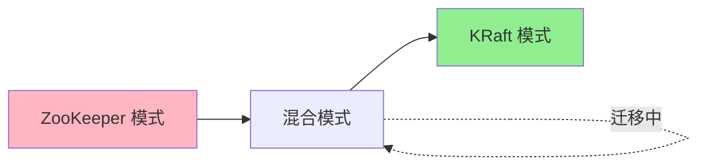

# 18. ZooKeeper 到 KRaft 迁移指南

> **本文档导读**
>
> 本文档提供从 ZooKeeper 模式迁移到 KRaft 模式的完整指南。
>
> **预计阅读时间**: 40 分钟
>
> **相关文档**:
> - [01-krft-overview.md](./01-krft-overview.md) - KRaft 架构概述
> - [20-comparison.md](./20-comparison.md) - KRaft vs ZooKeeper 对比

---

## 1. 迁移概述

### 1.1 为什么迁移？

```scala
/**
 * 迁移到 KRaft 的好处:
 *
 * 1. 简化架构
 *    - 移除 ZooKeeper 依赖
 *    - 减少 Kafka 部署的组件数量
 *    - 降低运维复杂度
 *
 * 2. 提升性能
 *    - 减少元数据操作延迟
 *    - 提高元数据变更吞吐量
 *    - 消除 ZooKeeper 瓶颈
 *
 * 3. 增强可扩展性
 *    - 支持更多 Partition
 *    - 更快的元数据操作
 *    - 更好的水平扩展能力
 *
 * 4. 改善可靠性
 *    - Raft 协议保证一致性
 *    - 自动故障转移
 *    - 更简单的故障恢复
 */
```

### 1.2 迁移模式



---

## 2. 迁移准备

### 2.1 前置条件检查

```bash
#!/bin/bash
# pre-migration-check.sh

echo "=== 迁移前置条件检查 ==="

# ==================== 1. 检查 Kafka 版本 ====================
echo "1. 检查 Kafka 版本..."
KAFKA_VERSION=$(kafka-topics.sh --version | grep -oP '\d+\.\d+\.\d+')
REQUIRED_VERSION="3.5.0"

if [ "$(printf '%s\n' "$REQUIRED_VERSION" "$KAFKA_VERSION" | sort -V | head -n1)" = "$REQUIRED_VERSION" ]; then
  echo "  ✓ Kafka 版本: $KAFKA_VERSION (满足要求)"
else
  echo "  ✗ Kafka 版本: $KAFKA_VERSION (需要 >= $REQUIRED_VERSION)"
  exit 1
fi

# ==================== 2. 检查 ZooKeeper 连接 ====================
echo "2. 检查 ZooKeeper 连接..."
ZK_CONNECT="localhost:2181"

if echo ruok | nc localhost 2181 | grep -q imok; then
  echo "  ✓ ZooKeeper 连接正常"
else
  echo "  ✗ ZooKeeper 连接失败"
  exit 1
fi

# ==================== 3. 检查集群状态 ====================
echo "3. 检查集群状态..."
BROKER_COUNT=$(kafka-broker-api-versions.sh --bootstrap-server localhost:9092 | grep -c "id:")

if [ $BROKER_COUNT -ge 3 ]; then
  echo "  ✓ Broker 数量: $BROKER_COUNT (满足要求)"
else
  echo "  ⚠ Broker 数量: $BROKER_COUNT (建议 >= 3)"
fi

# ==================== 4. 检查未完成操作 ====================
echo "4. 检查未完成操作..."
UNCLEAN_LEADER=$(kafka-topics.sh --bootstrap-server localhost:9092 --describe --under-replicated-partitions | wc -l)

if [ $UNCLEAN_LEADER -eq 0 ]; then
  echo "  ✓ 所有 Partition 状态正常"
else
  echo "  ⚠ 存在 $UNCLEAN_LEADER 个副本不足的 Partition"
fi

# ==================== 5. 检查磁盘空间 ====================
echo "5. 检查磁盘空间..."
REQUIRED_SPACE=10  # GB
AVAILABLE_SPACE=$(df -BG /tmp/kraft-combined-logs | awk 'NR==2 {print $4}' | sed 's/G//')

if [ $AVAILABLE_SPACE -ge $REQUIRED_SPACE ]; then
  echo "  ✓ 可用空间: ${AVAILABLE_SPACE}G (满足要求)"
else
  echo "  ✗ 可用空间: ${AVAILABLE_SPACE}G (需要 >= ${REQUIRED_SPACE}G)"
  exit 1
fi

echo "=== 检查完成 ==="
```

### 2.2 生成迁移配置

```bash
# ==================== 生成 Cluster ID ====================

# 生成 KRaft 集群 ID
KAFKA_CLUSTER_ID=$(kafka-storage.sh random-uuid)
echo "Cluster ID: $KAFKA_CLUSTER_ID"

# 保存 Cluster ID
echo $KAFKA_CLUSTER_ID > /tmp/kafka-cluster-id.txt
```

---

## 3. 迁移步骤

### 3.1 阶段 1: 准备 KRaft Controller

```bash
#!/bin/bash
# migration-step1.sh

echo "=== 阶段 1: 准备 KRaft Controller ==="

# ==================== 1. 配置 Controller 节点 ====================
echo "1. 配置 Controller 节点..."

# 在现有 Broker 上配置 Controller 角色
# 编辑 server.properties

cat >> /opt/kafka/config/server.properties <<EOF
# ==================== KRaft Controller 配置 ====================
process.roles=broker,controller
node.id=<broker-id>
controller.quorum.voters=<controller-ids>@<controller-hosts>:<controller-ports>
controller.listener.names=CONTROLLER
listeners=PLAINTEXT://:9092,CONTROLLER://:9093
inter.broker.listener.name=PLAINTEXT
EOF

# ==================== 2. 格式化元数据存储 ====================
echo "2. 格式化元数据存储..."
kafka-storage.sh format \
  -t $KAFKA_CLUSTER_ID \
  -c /opt/kafka/config/server.properties \
  --ignore-formatted

# ==================== 3. 启动 KRaft Controller ====================
echo "3. 启动 KRaft Controller..."
# 重启 Broker，启动 KRaft Controller
kafka-server-stop.sh
sleep 10
kafka-server-start.sh -daemon /opt/kafka/config/server.properties

# ==================== 4. 验证 Controller 启动 ====================
echo "4. 验证 Controller 启动..."
sleep 10
kafka-metadata-quorum.sh describe --status --bootstrap-server localhost:9092

echo "=== 阶段 1 完成 ==="
```

### 3.2 阶段 2: 迁移元数据

```bash
#!/bin/bash
# migration-step2.sh

echo "=== 阶段 2: 迁移元数据 ==="

# ==================== 1. 导出 ZooKeeper 元数据 ====================
echo "1. 导出 ZooKeeper 元数据..."

# 使用 ZkMigrationTool 导出元数据
kafka-migration-tools.sh \
  --bootstrap-server localhost:9092 \
  --zookeeper.connect localhost:2181 \
  --export /tmp/metadata-export.json

# ==================== 2. 导入到 KRaft ====================
echo "2. 导入到 KRaft..."
kafka-metadata.sh \
  --bootstrap-server localhost:9092 \
  --import /tmp/metadata-export.json

# ==================== 3. 验证元数据迁移 ====================
echo "3. 验证元数据迁移..."

# 检查 Topic 数量
ZK_TOPIC_COUNT=$(kafka-topics.sh --zookeeper localhost:2181 --list | wc -l)
KRAFT_TOPIC_COUNT=$(kafka-topics.sh --bootstrap-server localhost:9092 --list | wc -l)

echo "ZooKeeper Topics: $ZK_TOPIC_COUNT"
echo "KRaft Topics: $KRAFT_TOPIC_COUNT"

if [ $ZK_TOPIC_COUNT -eq $KRAFT_TOPIC_COUNT ]; then
  echo "  ✓ Topic 数量一致"
else
  echo "  ⚠ Topic 数量不一致"
fi

echo "=== 阶段 2 完成 ==="
```

### 3.3 阶段 3: 切换到 KRaft 模式

```bash
#!/bin/bash
# migration-step3.sh

echo "=== 阶段 3: 切换到 KRaft 模式 ==="

# ==================== 1. 停止 ZooKeeper 连接 ====================
echo "1. 停止 ZooKeeper 连接..."

# 修改配置，移除 ZooKeeper 连接
# 编辑 server.properties，注释掉：
# zookeeper.connect=localhost:2181

# ==================== 2. 验证 KRaft 模式 ====================
echo "2. 验证 KRaft 模式..."

# 检查是否使用 KRaft
kafka-metadata-quorum.sh describe --status --bootstrap-server localhost:9092

# 检查 Topic 操作
kafka-topics.sh --bootstrap-server localhost:9092 --list

# ==================== 3. 监控集群状态 ====================
echo "3. 监控集群状态..."

# 检查 Controller 状态
kafka-metadata-quorum.sh describe --status --bootstrap-server localhost:9092

# 检查 Broker 状态
kafka-broker-api-versions.sh --bootstrap-server localhost:9092

# 检查 Partition 状态
kafka-topics.sh --bootstrap-server localhost:9092 --describe --under-replicated-partitions

echo "=== 阶段 3 完成 ==="
echo "现在集群已切换到 KRaft 模式"
```

### 3.4 阶段 4: 清理 ZooKeeper

```bash
#!/bin/bash
# migration-step4.sh

echo "=== 阶段 4: 清理 ZooKeeper ==="

# ==================== 1. 验证 KRaft 稳定运行 ====================
echo "1. 验证 KRaft 稳定运行..."
# 观察 24-48 小时
# 确认无异常后执行清理

# ==================== 2. 备份 ZooKeeper 数据 ====================
echo "2. 备份 ZooKeeper 数据..."
ZK_BACKUP_DIR="/backup/zookeeper/$(date +%Y%m%d_%H%M%S)"
mkdir -p $ZK_BACKUP_DIR
cp -r /var/lib/zookeeper/* $ZK_BACKUP_DIR/

echo "ZooKeeper 数据已备份到: $ZK_BACKUP_DIR"

# ==================== 3. 停止 ZooKeeper ====================
echo "3. 停止 ZooKeeper..."
# 确认所有 Broker 都已切换到 KRaft
# 然后停止 ZooKeeper

# systemctl stop zookeeper

# ==================== 4. 清理 ZooKeeper 配置 ====================
echo "4. 清理 ZooKeeper 配置..."
# 从配置文件中移除 ZooKeeper 相关配置

echo "=== 阶段 4 完成 ==="
echo "ZooKeeper 已停用，可以安全卸载"
```

---

## 4. 回滚计划

### 4.1 回滚步骤

```bash
#!/bin/bash
# rollback.sh

echo "=== 开始回滚到 ZooKeeper 模式 ==="

# ==================== 1. 停止 KRaft ====================
echo "1. 停止 KRaft Controller..."
kafka-server-stop.sh

# ==================== 2. 恢复 ZooKeeper 配置 ====================
echo "2. 恢复 ZooKeeper 配置..."

# 取消注释 server.properties 中的:
# zookeeper.connect=localhost:2181

# 注释掉 KRaft 相关配置:
# process.roles=broker,controller
# controller.quorum.voters=...

# ==================== 3. 启动 ZooKeeper ====================
echo "3. 启动 ZooKeeper..."
# systemctl start zookeeper

# ==================== 4. 启动 Broker ====================
echo "4. 启动 Broker..."
kafka-server-start.sh -daemon /opt/kafka/config/server.properties

# ==================== 5. 验证回滚 ====================
echo "5. 验证回滚..."
kafka-topics.sh --zookeeper localhost:2181 --list

echo "=== 回滚完成 ==="
```

---

## 5. 验证清单

### 5.1 迁移前验证

```bash
#!/bin/bash
# pre-migration-verification.sh

echo "=== 迁移前验证清单 ==="

# ==================== 1. 集群健康检查 ====================
echo "1. 集群健康检查..."
# 所有 Broker 在线
# Controller 正常工作
# 无离线 Partition

# ==================== 2. 元数据一致性检查 ====================
echo "2. 元数据一致性检查..."
# ZooKeeper 元数据完整
# Broker 元数据一致

# ==================== 3. 性能基准测试 ====================
echo "3. 性能基准测试..."
# 记录当前性能指标
# 用于迁移后对比

# ==================== 4. 备份验证 ====================
echo "4. 备份验证..."
# 确认所有备份完成
# 验证备份完整性

echo "=== 验证完成 ==="
```

### 5.2 迁移后验证

```bash
#!/bin/bash
# post-migration-verification.sh

echo "=== 迁移后验证清单 ==="

# ==================== 1. Controller 状态 ====================
echo "1. Controller 状态..."
kafka-metadata-quorum.sh describe --status --bootstrap-server localhost:9092

# ==================== 2. Topic 验证 ====================
echo "2. Topic 验证..."
kafka-topics.sh --bootstrap-server localhost:9092 --list
kafka-topics.sh --bootstrap-server localhost:9092 --describe

# ==================== 3. 生产消费测试 ====================
echo "3. 生产消费测试..."
kafka-console-producer.sh --bootstrap-server localhost:9092 --topic test-topic
kafka-console-consumer.sh --bootstrap-server localhost:9092 --topic test-topic --from-beginning

# ==================== 4. 性能对比 ====================
echo "4. 性能对比..."
# 对比迁移前后的性能指标

# ==================== 5. 监控告警 ====================
echo "5. 监控告警..."
# 检查监控指标
# 验证告警配置

echo "=== 验证完成 ==="
```

---

## 6. 常见问题

### 6.1 迁移失败

**问题**: 迁移过程中元数据导入失败

**解决方案**:
```bash
# 1. 检查错误日志
tail -f /tmp/kraft-combined-logs/server.log

# 2. 验证元数据导出文件
kafka-migration-tools.sh --validate /tmp/metadata-export.json

# 3. 重新导出元数据
kafka-migration-tools.sh --export /tmp/metadata-export-new.json

# 4. 重新导入
kafka-metadata.sh --import /tmp/metadata-export-new.json
```

### 6.2 性能下降

**问题**: 迁移后性能下降

**解决方案**:
```bash
# 1. 检查配置
# 确认 KRaft 配置正确

# 2. 调整参数
# 增加快照间隔
metadata.log.max.record.bytes.between.snapshots=50000

# 3. 监控指标
kafka-metadata-quorum.sh describe --status --bootstrap-server localhost:9092

# 4. 优化 JVM
export KAFKA_HEAP_OPTS="-Xms4g -Xmx4g"
```

---

## 7. 最佳实践

### 7.1 迁移建议

```scala
/**
 * 迁移最佳实践:
 *
 * 1. 充分准备
 *    - 在测试环境完整演练
 *    - 准备详细的回滚计划
 *    - 确保有完整的备份
 *
 * 2. 分阶段执行
 *    - 先迁移测试环境
 *    - 再迁移生产环境
 *    - 逐步切换，不要一次性全部切换
 *
 * 3. 监控验证
 *    - 密切监控迁移过程
 *    - 验证每个阶段的结果
 *    - 准备好应急响应
 *
 * 4. 文档记录
 *    - 记录迁移过程
 *    - 记录遇到的问题
 *    - 记录解决方案
 */
```

### 7.2 生产环境迁移

```bash
# ==================== 生产环境迁移计划 ====================

# 1. 迁移时间窗口
# - 选择业务低峰期
# - 预留足够的迁移时间
# - 准备应急响应团队

# 2. 通知相关方
# - 通知业务团队
# - 通知运维团队
# - 通知监控系统

# 3. 执行迁移
# - 按照演练步骤执行
# - 实时监控迁移进度
# - 及时处理异常

# 4. 验证结果
# - 验证集群状态
# - 验证业务功能
# - 验证性能指标

# 5. 清理工作
# - 清理 ZooKeeper 数据
# - 更新文档
# - 总结迁移经验
```

---

## 8. 相关文档

- **[01-krft-overview.md](./01-krft-overview.md)** - KRaft 架构概述
- **[20-comparison.md](./20-comparison.md)** - KRaft vs ZooKeeper 对比
- **[11-troubleshooting.md](./11-troubleshooting.md)** - 故障排查指南

---

**返回**: [README.md](./README.md)
