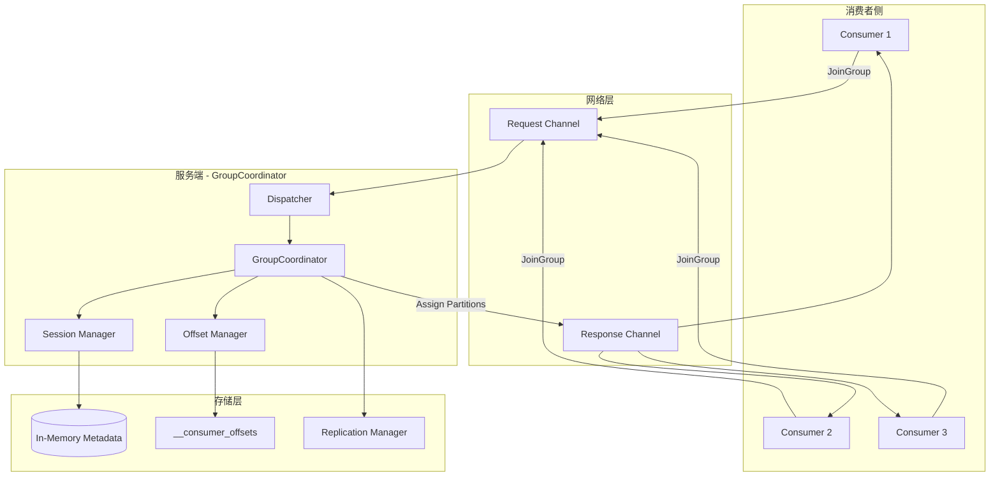
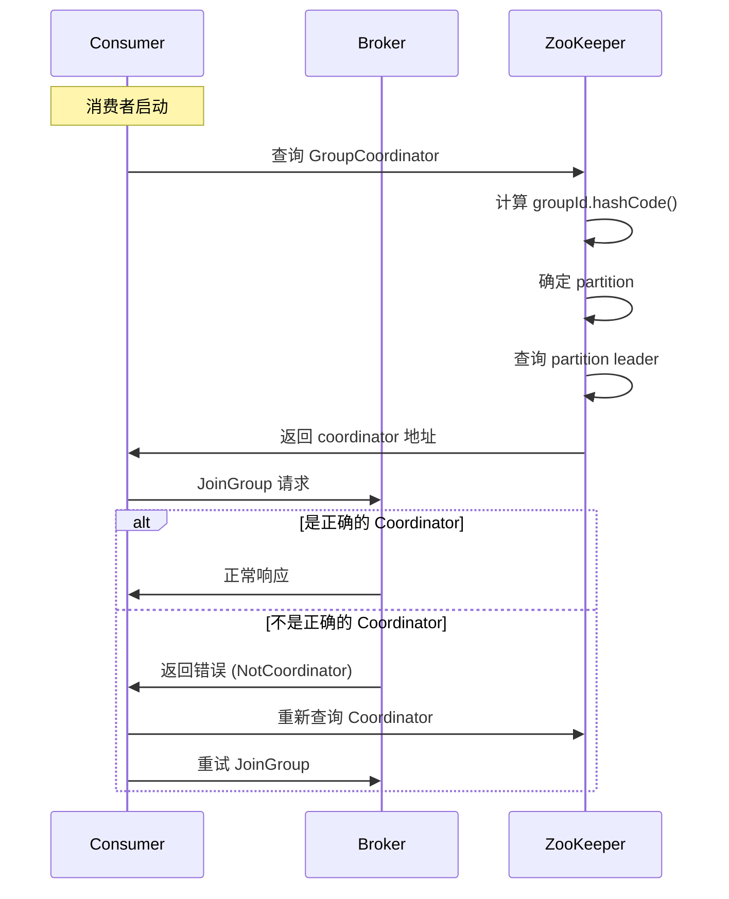
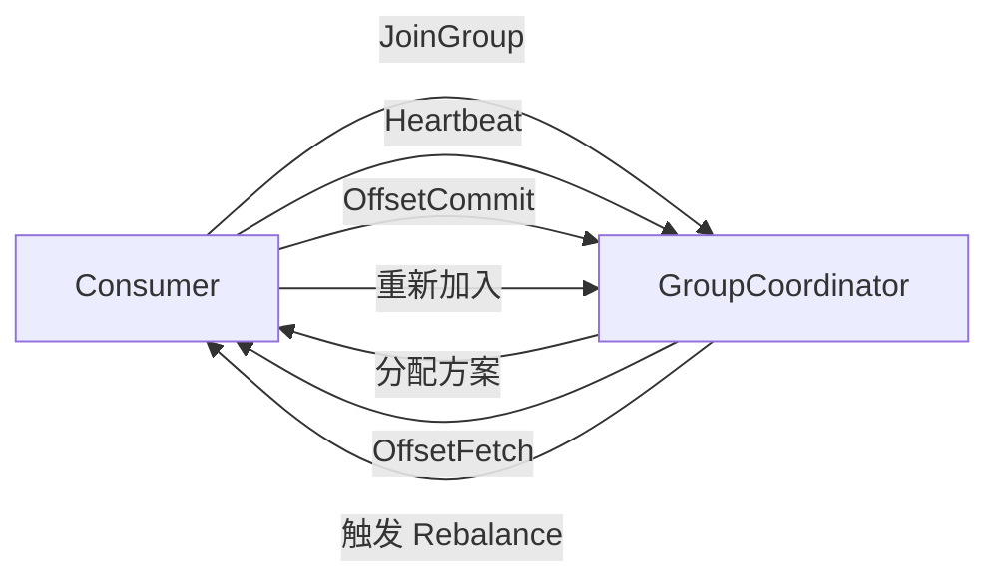
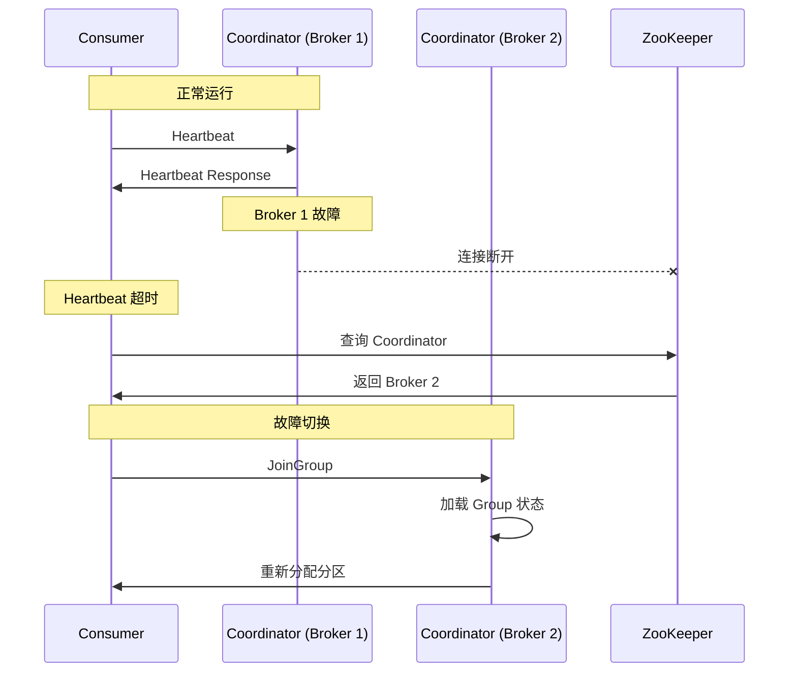

# 01. Coordinator 概述

## 1.1 什么是 GroupCoordinator

### 核心定义

GroupCoordinator 是 Kafka 服务端（Broker）负责管理消费者组的核心组件，每个消费者组都有一个对应的 GroupCoordinator，通常运行在集群的某个 Broker 节点上。

```scala
/**
 * GroupCoordinator 核心职责:
 *
 * 1. 组成员管理
 *    - 管理消费者的加入和离开
 *    - 检测消费者故障
 *    - 维护组成员列表
 *
 * 2. 重平衡协调
 *    - 触发和协调重平衡过程
 *    - 协商分区分配方案
 *    - 通知消费者新的分配方案
 *
 * 3. Offset 管理
 *    - 接收和保存 Offset 提交
 *    - 提供 Offset 查询服务
 *    - 管理 Offset 过期和清理
 *
 * 4. 状态管理
 *    - 维护消费者组的状态
 *    - 管理组元数据
 *    - 处理状态转换
 * /
```

### 设计目标

GroupCoordinator 的设计需要平衡以下目标：

```scala
/**
 * 设计目标:
 *
 * 1. 高可用性
 *    - Coordinator 故障时快速恢复
 *    - 通过 __consumer_offsets 实现状态持久化
 *    - 支持故障自动转移
 *
 * 2. 性能优化
 *    - 减少不必要的 Rebalance
 *    - 优化元数据管理开销
 *    - 支持大规模消费者组
 *
 * 3. 一致性保证
 *    - 确保分区分配的一致性
 *    - 保证 Offset 提交的原子性
 *    - 防止脑裂和分裂投票
 *
 * 4. 可扩展性
 *    - 支持多种分区分配策略
 *    - 可插拔的协调器接口
 *    - 支持增量 Rebalance
 * /
```

## 1.2 架构设计

### 整体架构



### 核心组件

```scala
class GroupCoordinator(
    brokerId: Int,
    groupConfig: GroupCoordinatorConfig,
    offsetConfig: OffsetManagerConfig,
    heartbeatPurgatory: DelayedOperationPurgatory[DelayedHeartbeat],
    joinPurgatory: DelayedOperationPurgatory[DelayedJoin],
    time: Time
) extends Logging {
    // 会话管理器 - 管理消费者心跳
    private val sessionTimeout = groupConfig.groupMinSessionTimeoutMs
    private val sessionManager = new GroupSessionManager(
        heartbeatPurgatory,
        sessionTimeout,
        time
    )

    // Offset 管理器 - 管理消费进度
    private val offsetManager = new OffsetManager(
        offsetConfig,
        replicaManager,
        ZkUtils.GroupCoordinatorZNode,
        time
    )

    // 组元数据缓存 - 管理组状态
    private val groupMetadataCache = new GroupMetadataCache(
        groupConfig.groupInitialRebalanceDelayMs,
        groupConfig.groupInitialRebalanceDelayMs +
        groupConfig.groupMaxRebalanceDelayMs,
        time
    )

    // 分区分配器 - 执行分区分配
    private val assignors = Map(
        "range" -> new RangeAssignor(),
        "roundrobin" -> new RoundRobinAssignor(),
        "sticky" -> new StickyAssignor(),
        "cooperative-sticky" -> new CooperativeStickyAssignor()
    )
}
```

## 1.3 Coordinator 选举与定位

### Coordinator 选择算法

```scala
/**
 * Coordinator 选择算法:
 *
 * 1. 计算 Group ID 的 Hash 值
 *    hash = Math.abs(groupId.hashCode)
 *
 * 2. 计算分区号
 *    partition = hash % offsetsTopicNumPartitions
 *
 * 3. 确定 Leader Broker
 *    coordinator = partitionLeader(partition)
 *
 * 这种设计确保:
 * - 同一个 Group ID 总是映射到同一个 Coordinator
 * - 通过分区副本机制提供高可用性
 * - 负载均衡分布到多个 Broker
 * /

// 源码实现
def coordinatorGroupIdHashOffset(groupId: String): Int = {
    Math.abs(groupId.hashCode) % groupMetadataTopicPartitionCount
}

def partitionFor(groupId: GroupId): Int = {
    coordinatorGroupIdHashOffset(groupId)
}
```

### Coordinator 查找流程



```java
// 消费者端查找 Coordinator 实现
// KafkaConsumer.java
private RequestFuture<ClientResponse> findCoordinator() {
    // 查找 GroupCoordinator
    // 发送 FindCoordinatorRequest 到任意 Broker
    return client.findCoordinator(findCoordinatorRequest);
}

// NetworkClient.java
public FindCoordinatorRequest.Builder findCoordinatorRequest =
    new FindCoordinatorRequest.Builder(
        FindCoordinatorRequest.CoordinatorType.GROUP,
        groupId
    );
```

## 1.4 核心职责详解

### 1.4.1 组成员管理

```scala
/**
 * 组成员管理职责:
 *
 * 1. 成员注册
 *    - 处理 JoinGroup 请求
 *    - 验证成员资格
 *    - 分配 Member ID
 *
 * 2. 成员跟踪
 *    - 维护活跃成员列表
 *    - 跟踪成员订阅信息
 *    - 记录成员支持的分配策略
 *
 * 3. 成员失效检测
 *    - 监测心跳超时
 *    - 检测 session 过期
 *    - 移除失效成员
 * /

case class MemberMetadata(
    memberId: String,                    // 成员唯一标识
    groupInstanceId: Option[String],      // 静态成员 ID
    clientId: String,                     // 客户端 ID
    clientHost: String,                   // 客户端主机
    rebalanceTimeoutMs: Int,              // Rebalance 超时
    sessionTimeoutMs: Int,                // 会话超时
    protocolType: String,                 // 协议类型
    protocols: List[(String, Array[Byte])], // 支持的分配策略
    supportSkippingMetadata: Boolean      // 是否支持跳过元数据
) {
    // 成员当前分配的分区
    var assignment: Array[Byte] = Array.empty

    // 成员是否仍在心跳
    def isLeaving: Boolean = sessionTimeoutMs < 0

    // 检查心跳是否过期
    def hasNotLeft: Boolean = !isLeaving
}
```

### 1.4.2 重平衡协调

```scala
/**
 * 重平衡协调职责:
 *
 * 1. 触发 Rebalance
 *    - 检测成员变化
 *    - 检测订阅变化
 *    - 检测 Coordinator 变更
 *
 * 2. 协调分配过程
 *    - 选择 Leader Consumer
 *    - 收集订阅信息
 *    - 等待分配方案
 *
 * 3. 分发结果
 *    - 广播分配方案
 *    - 等待成员确认
 *    - 完成状态转换
 * /

// 重平衡触发条件
def tryCompleteRebalance(group: GroupMetadata): Boolean = {
    group.inLock {
        if (!group.hasReceivedAllJoinResponses) {
            // 等待所有成员响应
            false
        } else if (group.is(PreparingRebalance)) {
            // 准备 Rebalance
            completeRebalance(group)
            true
        } else {
            false
        }
    }
}
```

### 1.4.3 Offset 管理

```scala
/**
 * Offset 管理职责:
 *
 * 1. Offset 存储
 *    - 接收 Offset 提交请求
 *    - 写入 __consumer_offsets
 *    - 更新内存缓存
 *
 * 2. Offset 查询
 *    - 从缓存读取
 *    - 从日志文件读取
 *    - 提供给消费者
 *
 * 3. Offset 清理
 *    - 检查过期时间
 *    - 清理过期 Offset
 *    - 压缩日志文件
 * /

// Offset 提交处理
def handleCommitOffsets(
    groupId: String,
    memberId: String,
    generationId: Int,
    offsetMetadata: Map[TopicPartition, OffsetAndMetadata]
): Errors = {
    // 1. 验证组状态
    // 2. 验证成员身份
    // 3. 提交 Offset
    // 4. 更新缓存
}
```

## 1.5 消息类型与协议

### 支持的请求类型

```scala
/**
 * GroupCoordinator 支持的请求:
 *
 * 1. JoinGroup (请求码: 11)
 *    - 消费者加入组
 *    - 触发 Rebalance
 *
 * 2. SyncGroup (请求码: 14)
 *    - 同步分区分配方案
 *    - 完成 Rebalance
 *
 * 3. Heartbeat (请求码: 12)
 *    - 发送心跳保持会话
 *    - 报告消费者存活
 *
 * 4. LeaveGroup (请求码: 13)
 *    - 主动离开组
 *    - 触发 Rebalance
 *
 * 5. OffsetCommit (请求码: 8)
 *    - 提交消费位置
 *    - 更新消费进度
 *
 * 6. OffsetFetch (请求码: 9)
 *    - 获取消费位置
 *    - 查询消费进度
 *
 * 7. DescribeGroups (请求码: 15)
 *    - 查询组状态
 *    - 获取组详情
 *
 * 8. ListGroups (请求码: 16)
 *    - 列举所有组
 *    - 获取组列表
 * /
```

### 请求处理流程

```scala
// GroupCoordinator 请求分发
def handleRequest(request: RequestChannel.Request): Unit = {
    val api = request.header.apiKey

    try {
        api match {
            case ApiKeys.JOIN_GROUP =>
                handleJoinGroup(request)

            case ApiKeys.SYNC_GROUP =>
                handleSyncGroup(request)

            case ApiKeys.HEARTBEAT =>
                handleHeartbeat(request)

            case ApiKeys.LEAVE_GROUP =>
                handleLeaveGroup(request)

            case ApiKeys.OFFSET_COMMIT =>
                handleOffsetCommit(request)

            case ApiKeys.OFFSET_FETCH =>
                handleOffsetFetch(request)

            case ApiKeys.DESCRIBE_GROUPS =>
                handleDescribeGroups(request)

            case ApiKeys.LIST_GROUPS =>
                handleListGroups(request)
        }
    } catch {
        case e: Throwable =>
            handleError(request, e)
    }
}
```

## 1.6 与其他组件的关系

### 与 Consumer 的关系



### 与 ReplicaManager 的关系

```scala
/**
 * 与 ReplicaManager 的交互:
 *
 * 1. 写入 __consumer_offsets
 *    - Offset 提交记录
 *    - Group 元数据快照
 *
 * 2. 读取 __consumer_offsets
 *    - 加载 Group 元数据
 *    - 恢复 Offset 数据
 *
 * 3. 副本同步
 *    - 保证数据一致性
 *    - 支持故障恢复
 * /
```

### 与 ZooKeeper 的关系

```scala
/**
 * 与 ZooKeeper 的交互 (Kafka 2.x 之前):
 *
 * 1. 存储 Coordinator 信息
 *    - /consumers/[groupId]/ids
 *
 * 2. 存储 Offset 信息
 *    - /consumers/[groupId]/offsets
 *
 * 3. 选举 Controller
 *    - /controller
 *
 * 注意: Kafka 2.x+ 已经将大部分功能
 * 迁移到内部 Topic，减少 ZK 依赖
 * /
```

## 1.7 高可用设计

### 状态持久化

```scala
/**
 * 状态持久化机制:
 *
 * 1. Group 元数据快照
 *    - 定期保存到 __consumer_offsets
 *    - 包含组状态、成员信息、分配方案
 *
 * 2. Offset 提交记录
 *    - 实时写入 __consumer_offsets
 *    - 支持 exactly-once 语义
 *
 * 3. 故障恢复
 *    - 从 __consumer_offsets 加载状态
 *    - 重建内存缓存
 *    - 重新开始服务
 * /

// Group 元数据存储
case class GroupMetadata(
    groupId: String,                    // 组 ID
    generationId: Int,                  // 代数
    protocolType: Option[String],       // 协议类型
    protocol: Option[String],           // 使用的分配策略
    leaderId: Option[String],           // Leader 成员 ID
    state: GroupState,                  // 组状态
    members: Map[String, MemberMetadata] // 成员列表
) {
    // 序列化到消息
    def toMessage: Array[Byte] = {
        // 构建 GroupMetadataMessage
        // 包含完整的组状态
    }
}
```

### 故障切换



## 1.8 性能考虑

### 性能优化点

```scala
/**
 * 性能优化设计:
 *
 * 1. 内存缓存
 *    - 缓存 Group 元数据
 *    - 减少 __consumer_offsets 读取
 *    - 使用快速路径处理心跳
 *
 * 2. 批量操作
 *    - 批量写入 Offset
 *    - 减少磁盘 I/O
 *    - 提高吞吐量
 *
 * 3. 异步处理
 *    - 延迟操作处理
 *    - 定时任务调度
 *    - 非阻塞状态转换
 *
 * 4. 负载均衡
 *    - 均匀分布 Group
 *    - 避免 Coordinator 过载
 *    - 支持水平扩展
 * /

// 心跳处理的快速路径
def tryCompleteHeartbeat(
    group: GroupMetadata,
    memberId: String,
    heartbeatDeadline: Long
): Boolean = {
    group.inLock {
        if (group.has(memberId)) {
            val member = group.get(memberId)
            member.heartbeatTimestamp = time.milliseconds()
            true
        } else {
            false
        }
    }
}
```

### 性能指标

| 指标 | 说明 | 优化目标 |
|------|------|----------|
| Heartbeat 延迟 | 心跳请求处理时间 | < 10ms |
| JoinGroup 延迟 | 加入组请求处理时间 | < 100ms |
| OffsetCommit 延迟 | Offset 提交处理时间 | < 50ms |
| Rebalance 时间 | Rebalance 完成时间 | < 1min |

## 1.9 版本演进

### Kafka 0.9 之前

```scala
/**
 * 早期版本特点:
 *
 * 1. 基于 ZooKeeper
 *    - 元数据存储在 ZK
 *    - Offset 存储在 ZK
 *    - 依赖 ZK watch
 *
 * 2. 性能瓶颈
 *    - ZK 写入性能限制
 *    - watch 通知延迟
 *    - 水平扩展困难
 * /
```

### Kafka 0.9+

```scala
/**
 * 现代版本特点:
 *
 * 1. 基于内部 Topic
 *    - __consumer_offsets 存储
 *    - 减少 ZK 依赖
 *    - 提高性能和扩展性
 *
 * 2. 增强功能
 *    - 支持静态成员
 *    - 支持增量 Rebalance
 *    - 支持更细粒度的控制
 * /
```

## 1.10 小结

GroupCoordinator 是 Kafka 消费者组机制的核心组件，通过以下机制实现高效协调：

1. **分布式协调**：通过分区 Leader 机制提供高可用性
2. **状态管理**：维护消费者组的完整状态和元数据
3. **协议支持**：实现完整的 Rebalance 和 Offset 管理协议
4. **性能优化**：通过缓存、批量操作、异步处理提升性能
5. **可扩展性**：支持大规模消费者组和多种分配策略

## 参考文档

- [02-group-management.md](./02-group-management.md) - Consumer Group 管理详解
- [03-rebalance-protocol.md](./03-rebalance-protocol.md) - Rebalance 协议详解
- [05-offset-management.md](./05-offset-management.md) - Offset 管理详解
