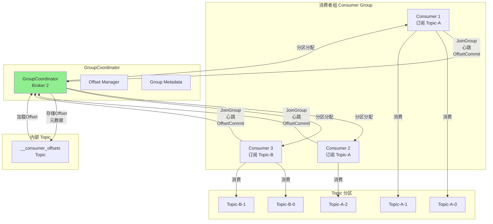
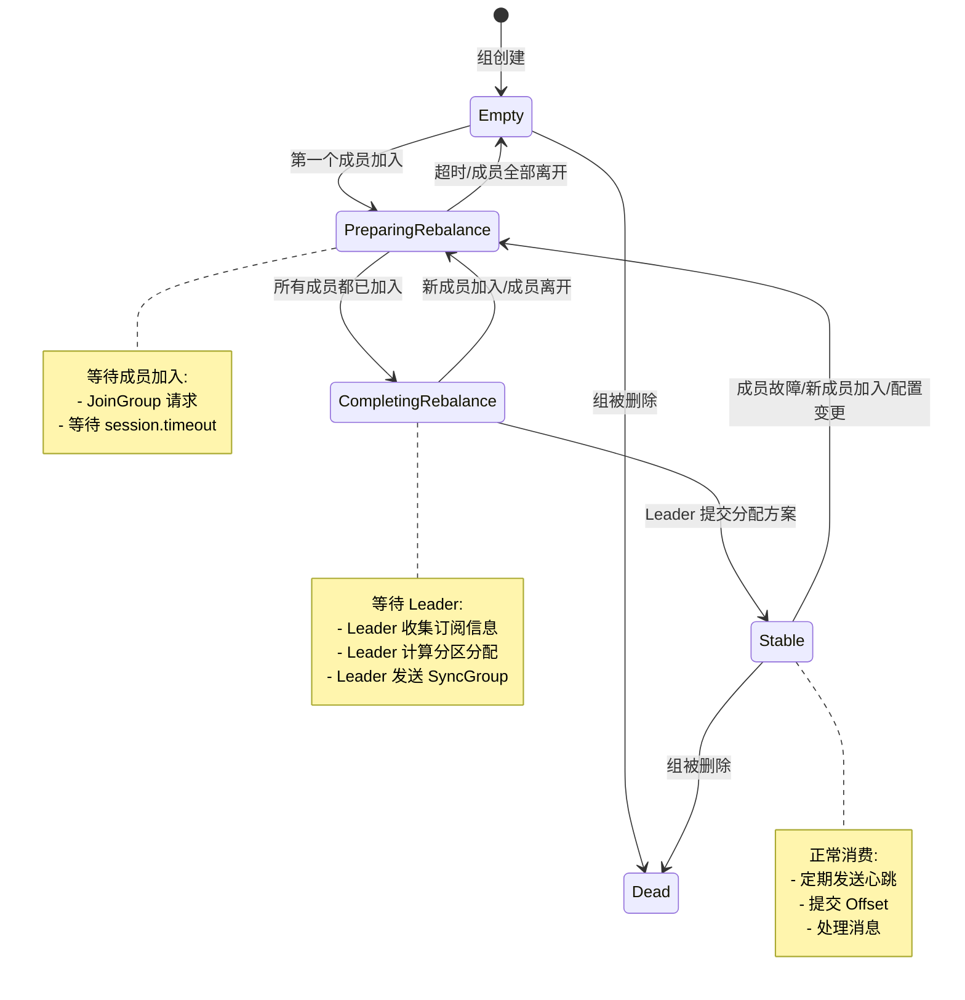
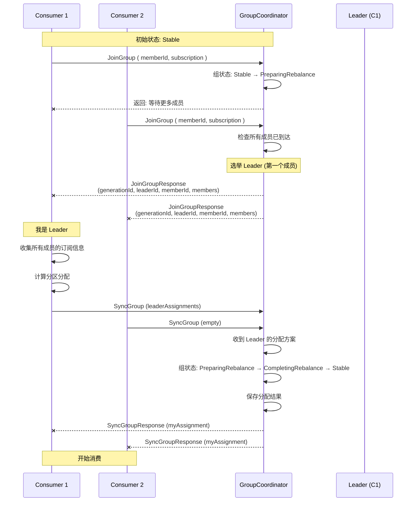
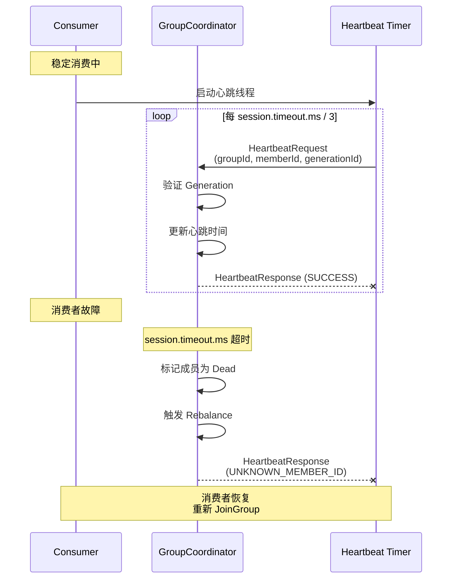
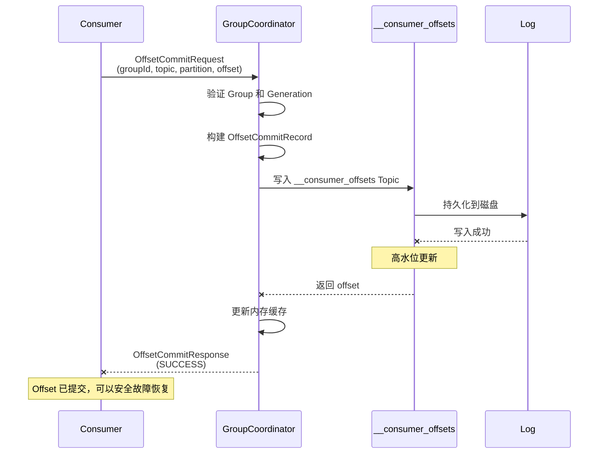

# 06. GroupCoordinator - 消费者组协调器

## 本章导读

GroupCoordinator 是 Kafka 中负责管理消费者组的核心组件。本章将深入分析：

- **消费者组协调机制**：如何管理消费者成员关系
- **Rebalance 过程**：JoinGroup、SyncGroup 完整流程
- **心跳与会话管理**：如何检测消费者故障
- **Offset 管理与提交**：__consumer_offsets Topic
- **分区分配策略**：Range、RoundRobin、Sticky 等算法

---

## 1. 消费者组基础

### 1.1 为什么需要消费者组？

```scala
/**
 * 消费者组的核心目的:
 *
 * 1. 扩展消费能力
 *    - 单个消费者处理能力有限
 *    - 多个消费者并行处理不同分区
 *    - 水平扩展消费能力
 *
 * 2. 故障容错
 *    - 某个消费者故障时
 *    - 分区重新分配给其他消费者
 *    - 保证消费不中断
 *
 * 3. 位置管理
 *    - 统一管理消费进度
 *    - 支持从上次位置继续消费
 *    - 支持重置消费位置
 */

// 消费者组的基本规则
// - 一个分区只能被组内一个消费者消费
// - 一个消费者可以消费多个分区
// - 组内消费者数 > 分区数时，部分消费者空闲
```

### 1.2 GroupCoordinator 架构



### 1.3 核心概念

| 概念 | 说明 |
|------|------|
| **Group ID** | 消费者组的唯一标识 |
| **Member ID** | 消费者成员的唯一标识（格式：groupUniqueId-instanceId-序号） |
| **Generation** | 消费者组的代数，每次 Rebalance 后递增 |
| **Leader** | 消费者组的主消费者，负责分区分配 |
| **Coordinator** | 管理 Group 的 Broker |
| **Heartbeat** | 消费者定期发送的心跳，维持存活状态 |
| **Session Timeout** | 心跳超时时间，超过则认为消费者故障 |

---

## 2. GroupCoordinator 服务结构

### 2.1 组件架构

```java
/**
 * GroupCoordinatorService 整体结构
 *
 * 核心组件:
 * 1. GroupCoordinatorShard: 管理消费者组的分片
 * 2. GroupMetadataManager: 管理组元数据
 * 3. OffsetMetadataManager: 管理 Offset
 * 4. CoordinatorRuntime: 协调器运行时
 * 5. Timer: 定时器（心跳超时、Rebalance 超时）
 */

// org/apache/kafka/coordinator/group/GroupCoordinatorService.java

public class GroupCoordinatorService implements GroupCoordinator {

    /**
     * 协调器运行时
     * - 处理所有协调器请求
     * - 管理并发
     * - 持久化元数据
     */
    private final CoordinatorRuntime<GroupCoordinatorShard, CoordinatorRecord> runtime;

    /**
     * Group 配置管理器
     */
    private final GroupConfigManager groupConfigManager;

    /**
     * 持久化服务
     * 用于 Share Group 的状态持久化
     */
    private final Persister persister;

    /**
     * 定时器
     * - 心跳超时检测
     * - Rebalance 超时检测
     */
    private final Timer timer;

    /**
     * 分区元数据客户端
     * - 查询 Topic 分区信息
     * - 用于正则表达式订阅解析
     */
    private final PartitionMetadataClient partitionMetadataClient;
}
```

### 2.2 GroupCoordinatorShard

```java
/**
 * GroupCoordinatorShard 管理一个分片上的所有消费者组
 *
 * 分片机制:
 * - Group ID 的 Hash 决定分片
 * - 每个分片独立管理
 * - 减少锁竞争
 */

// org/apache/kafka/coordinator/group/GroupCoordinatorShard.java

public class GroupCoordinatorShard {

    /**
     * Classic 消费者组（旧版本协议）
     * 使用 JoinGroup/SyncGroup 协议
     */
    private final TimelineHashMap<String, ClassicGroup> classicGroups;

    /**
     * Modern 消费者组（新版本协议）
     * 使用 ConsumerGroupHeartbeat 协议
     */
    private final TimelineHashMap<String, ConsumerGroup> consumerGroups;

    /**
     * Share Group
     * 共享消费者组，支持多个消费者同时消费同一分区
     */
    private final TimelineHashMap<String, ShareGroup> shareGroups;

    /**
     * Streams Group
     * Kafka Streams 使用的消费者组
     */
    private final TimelineHashMap<String, StreamsGroup> streamsGroups;

    /**
     * Offset 管理器
     */
    private final OffsetMetadataManager offsetMetadataManager;

    /**
     * 分片 ID
     */
    private final int shardId;

    /**
     * 定时器
     */
    private final Timer timer;

    // ========== 核心方法 ==========

    /**
     * 处理 JoinGroup 请求
     * - 消费者加入组
     * - 触发 Rebalance
     */
    public CoordinatorResult<JoinGroupResponseData, Record> joinGroup(
        String groupId,
        JoinGroupRequestData request
    ) {
        // 查找或创建 ClassicGroup
        ClassicGroup group = getOrCreateClassicGroup(groupId);

        // 验证请求
        validateJoinGroupRequest(group, request);

        // 添加成员
        ClassicGroupMember member = group.addMember(
            request.memberId(),
            request.groupInstanceId(),
            request.protocolType(),
            request.protocols()
        );

        // 检查是否可以完成 Rebalance
        if (group.canRebalance()) {
            return completeRebalance(group);
        } else {
            // 等待更多成员加入
            return createPendingJoinResponse(member);
        }
    }

    /**
     * 处理 SyncGroup 请求
     * - Leader 发送分区分配方案
     * - 所有成员接收分配结果
     */
    public CoordinatorResult<SyncGroupResponseData, Record> syncGroup(
        String groupId,
        SyncGroupRequestData request
    ) {
        ClassicGroup group = classicGroups.get(groupId);

        if (group == null) {
            throw new UnknownMemberIdException();
        }

        // 验证 Generation
        if (request.generationId() != group.generationId()) {
            throw new IllegalGenerationException();
        }

        // Leader 发送分配方案
        if (request.memberId().equals(group.leaderId())) {
            // 解析 Leader 的分配方案
            Map<String, ByteBuffer> assignments = parseAssignments(request.assignments());

            // 保存分配结果
            group.initNextGeneration(assignments);
        }

        // 返回成员的分配
        ByteBuffer assignment = group.members().get(request.memberId()).assignment();

        return new CoordinatorResult<>(
            new SyncGroupResponseData()
                .setErrorCode(Errors.NONE.code())
                .setAssignment(Utils.toArray(assignment)),
            Collections.emptyList()
        );
    }

    /**
     * 处理心跳请求
     */
    public CoordinatorResult<HeartbeatResponseData, Record> heartbeat(
        String groupId,
        HeartbeatRequestData request
    ) {
        ClassicGroup group = classicGroups.get(groupId);

        if (group == null) {
            throw new GroupIdNotFoundException();
        }

        ClassicGroupMember member = group.members().get(request.memberId());

        if (member == null) {
            throw new UnknownMemberIdException();
        }

        // 验证 Generation
        if (request.generationId() != group.generationId()) {
            throw new IllegalGenerationException();
        }

        // 更新心跳时间
        member.updateHeartbeat(time.milliseconds());

        return new CoordinatorResult<>(
            new HeartbeatResponseData().setErrorCode(Errors.NONE.code()),
            Collections.emptyList()
        );
    }

    /**
     * 处理 Offset 提交
     */
    public CoordinatorResult<OffsetCommitResponseData, Record> offsetCommit(
        String groupId,
        OffsetCommitRequestData request
    ) {
        List<Record> records = new ArrayList<>();

        // 为每个分区创建 Offset 记录
        for (OffsetCommitRequestData.TopicData topic : request.topics()) {
            for (OffsetCommitRequestData.PartitionData partition : topic.partitionIndexes()) {
                /**
                 * OffsetCommitRecord 结构:
                 * - Group ID
                 * - Topic
                 * - Partition
                 * - Offset
                 * - Metadata (可选)
                 * - Commit Timestamp
                 */
                OffsetCommitValue commitValue = new OffsetCommitValue()
                    .setOffset(partition.committedOffset())
                    .setLeaderEpoch(partition.committedLeaderEpoch())
                    .setCommitTimestamp(time.milliseconds())
                    .setExpireTimestamp(
                        time.milliseconds() +
                        offsetRetentionMs
                    );

                if (partition.committedMetadata() != null) {
                    commitValue.setMetadata(partition.committedMetadata());
                }

                OffsetCommitKey commitKey = new OffsetCommitKey()
                    .setGroup(groupId)
                    .setTopic(topic.name())
                    .setPartition(partition.partitionIndex());

                records.add(new Record(
                    commitKey.toRecordKey(),
                    commitValue.toRecordValue()
                ));
            }
        }

        return new CoordinatorResult<>(
            new OffsetCommitResponseData(),
            records
        );
    }
}
```

### 2.3 ClassicGroup 状态机

```java
/**
 * ClassicGroup 状态机
 *
 * 状态转换:
 * Empty -> PreparingRebalance -> CompletingRebalance -> Stable -> PreparingRebalance
 *                                                    -> Dead
 *                                                    -> Empty
 */

// org/apache/kafka/coordinator/group/classic/ClassicGroupState.java

public enum ClassicGroupState {
    /**
     * 组为空，没有成员
     */
    EMPTY,

    /**
     * 准备 Rebalance，等待成员加入
     */
    PREPARING_REBALANCE,

    /**
     * 完成 Rebalance，等待 Leader 发送分配方案
     */
    COMPLETING_REBALANCE,

    /**
     * 稳定状态，成员正在消费
     */
    STABLE,

    /**
     * 组已删除
     */
    DEAD;

    /**
     * 是否可以转换到目标状态
     */
    public boolean canTransitionTo(ClassicGroupState targetState) {
        switch (this) {
            case EMPTY:
                return targetState == PREPARING_REBALANCE ||
                       targetState == DEAD;

            case PREPARING_REBALANCE:
                return targetState == COMPLETING_REBALANCE ||
                       targetState == EMPTY ||
                       targetState == DEAD;

            case COMPLETING_REBALANCE:
                return targetState == STABLE ||
                       targetState == PREPARING_REBALANCE ||
                       targetState == DEAD;

            case STABLE:
                return targetState == PREPARING_REBALANCE ||
                       targetState == DEAD;

            case DEAD:
                return false;

            default:
                return false;
        }
    }
}
```



---

## 3. Rebalance 完整流程

### 3.1 Rebalance 触发条件

```scala
/**
 * Rebalance 触发条件:
 *
 * 1. 成员变化
 *    - 新成员加入组
 *    - 成员主动离开
 *    - 成员故障（心跳超时）
 *
 * 2. 订阅变化
 *    - 成员订阅的 Topic 变化
 *    - Topic 分区数变化
 *
 * 3. 配置变更
 *    - 组配置变更
 *    - 分区分配策略变更
 *
 * 4. 时间触发
 *    - 定期 Rebalance（很少使用）
 */
```

### 3.2 JoinGroup 流程详解



### 3.3 JoinGroup 源码分析

```java
/**
 * JoinGroup 请求处理
 */

// ========== 客户端发起 JoinGroup ==========

// org/apache/kafka/clients/consumer/internals/AbstractCoordinator.java

public RequestFuture<ByteBuffer> sendJoinGroupRequest() {
    /**
     * 构建 JoinGroup 请求
     */
    JoinGroupRequestData request = new JoinGroupRequestData()
        .setGroupId(rebalanceConfig.groupId)
        .setSessionTimeoutMs(rebalanceConfig.sessionTimeoutMs)
        .setRebalanceTimeoutMs(rebalanceConfig.rebalanceTimeoutMs)
        .setMemberId(this.memberId)           // 首次为空，后续使用返回的 ID
        .setGroupInstanceId(this.groupInstanceId.orElse(null))
        .setProtocolType(protocolType())       // "consumer"
        .setProtocols(collectMetadata())       // 订阅信息 + 分配策略
        .setRebalanceTimeoutMs(rebalanceConfig.rebalanceTimeoutMs);

    /**
     * 发送请求到 Coordinator
     */
    log.info("Sending JoinGroup ({}) to coordinator {}", rebalanceConfig.groupId, this.coordinator);

    return client.send(coordinator, request)
        .compose(new JoinGroupResponseHandler());
}

/**
 * 处理 JoinGroup 响应
 */
private class JoinGroupResponseHandler extends ResponseHandler<JoinGroupResponseData, ByteBuffer> {

    @Override
    public void handle(JoinGroupResponseData joinResponse) {
        Errors error = Errors.forCode(joinResponse.errorCode());

        switch (error) {
            case NONE:
                /**
                 * 成功加入
                 */
                this.memberId = joinResponse.memberId();
                this.generation = new Generation(
                    joinResponse.generationId(),
                    joinResponse.memberId(),
                    joinResponse.protocolName()
                );

                /**
                 * 检查是否是 Leader
                 */
                if (joinResponse.leaderId().equals(this.memberId)) {
                    /**
                     * Leader 需要执行分区分配
                     */
                    onLeaderElected();
                } else {
                    /**
                     * Follower 等待 SyncGroup
                     */
                    sendSyncGroupRequest();
                }
                break;

            case GROUP_MAX_SIZE_REACHED:
                /**
                 * 组成员数达到上限
                 */
                throw new GroupMaxSizeReachedException();

            case UNKNOWN_MEMBER_ID:
                /**
                 * Member ID 无效
                 * - 重置 memberId
                 * - 重新发送 JoinGroup
                 */
                this.memberId = JoinGroupRequest.UNKNOWN_MEMBER_ID;
                requestRejoin("Member ID 已失效");
                break;

            case REBALANCE_IN_PROGRESS:
                /**
                 * Rebalance 正在进行
                 * - 等待当前 Rebalance 完成
                 * - 然后重新加入
                 */
                requestRejoin("Rebalance 正在进行");
                break;

            default:
                /**
                 * 其他错误
                 */
                throw error.exception();
        }
    }
}

// ========== 服务端处理 JoinGroup ==========

// org/apache/kafka/coordinator/group/GroupMetadataManager.java

public CoordinatorResult<JoinGroupResponseData, Record> joinGroup(
    String groupId,
    JoinGroupRequestData request
) {
    // ========== 1. 查找或创建组 ==========
    ClassicGroup group = getOrCreateClassicGroup(groupId);

    // ========== 2. 验证请求 ==========
    validateJoinGroupRequest(group, request);

    // ========== 3. 处理成员加入 ==========

    /**
     * 情况1: 成员已存在
     * - 更新元数据
     * - 更新心跳时间
     */
    if (group.hasMemberId(request.memberId())) {
        ClassicGroupMember member = group.member(request.memberId());

        member.updateHeartbeat(time.milliseconds());
        member.setSupportedProtocols(request.protocols());

        /**
         * 如果是 Rebalance 过程中的重复请求
         */
        if (group.state() == ClassicGroupState.COMPLETING_REBALANCE) {
            return createInProgressResponse(group, member);
        }
    }

    /**
     * 情况2: 新成员加入
     * - 创建新成员
     * - 生成 Member ID
     */
    else {
        /**
         * 生成 Member ID
         * 格式: {groupId}-{instanceId}-{uuid}
         */
        String memberId = generateMemberId(groupId, request.groupInstanceId());

        ClassicGroupMember member = new ClassicGroupMember(
            memberId,
            request.groupInstanceId(),
            group.generationId(),
            clientId,
            clientHost,
            rebalanceTimeoutMs,
            sessionTimeoutMs,
            request.protocols()
        );

        group.add(member);

        /**
         * 如果是第一个成员
         * - 成为 Leader
         * - 状态: Empty → PreparingRebalance
         */
        if (group.numMembers() == 1) {
            group.setLeaderId(memberId);
            group.transitionTo(ClassicGroupState.PREPARING_REBALANCE);
        }
    }

    // ========== 4. 检查是否可以完成 Rebalance ==========

    /**
     * 可以完成 Rebalance 的条件:
     * 1. 所有成员都已发送 JoinGroup
     * 2. 达到 Rebalance Timeout
     */
    if (group.canRebalance()) {
        return completeJoin(group);
    } else {
        /**
         * 返回等待响应
         * 包含当前已知的成员列表
         */
        return createPendingJoinResponse(group);
    }
}

/**
 * 完成 JoinGroup，准备进入 SyncGroup
 */
private CoordinatorResult<JoinGroupResponseData, Record> completeJoin(
    ClassicGroup group
) {
    /**
     * 状态: PreparingRebalance → CompletingRebalance
     */
    group.transitionTo(ClassicGroupState.COMPLETING_REBALANCE);

    /**
     * 递增 Generation
     */
    group.initNextGeneration();

    /**
     * 构建 JoinGroup 响应
     */
    List<JoinGroupResponseData.JoinGroupResponseMember> members = group.members().values()
        .stream()
        .map(member -> new JoinGroupResponseData.JoinGroupResponseMember()
            .setMemberId(member.memberId())
            .setMetadata(member.metadata().array())
        )
        .collect(Collectors.toList());

    JoinGroupResponseData response = new JoinGroupResponseData()
        .setErrorCode(Errors.NONE.code())
        .setGenerationId(group.generationId())
        .setProtocolType(group.protocolType())
        .setProtocolName(group.protocolName())
        .setLeaderId(group.leaderId())
        .setMembers(members);

    /**
     * 创建元数据记录
     * 用于持久化组元数据
     */
    List<Record> records = new ArrayList<>();

    /**
     * GroupMetadata 记录
     * - 保存组的 Generation、状态等
     */
    GroupMetadataKey key = new GroupMetadataKey().setGroup(group.groupId());
    GroupMetadataValue value = new GroupMetadataValue()
        .setProtocolType(group.protocolType())
        .setProtocolName(group.protocolName())
        .setGenerationId(group.generationId())
        .setLeader(group.leaderId())
        .setMembers(group.members().values());

    records.add(new Record(key.toRecordKey(), value.toRecordValue()));

    /**
     * 每个成员的元数据记录
     */
    for (ClassicGroupMember member : group.members()) {
        GroupMetadataMemberKey memberKey = new GroupMetadataMemberKey()
            .setGroup(group.groupId())
            .setMemberId(member.memberId());

        GroupMetadataMemberValue memberValue = new GroupMetadataMemberValue()
            .setSessionTimeoutMs(member.sessionTimeoutMs())
            .setRebalanceTimeoutMs(member.rebalanceTimeoutMs())
            .setSubscription(member.subscription());

        records.add(new Record(memberKey.toRecordKey(), memberValue.toRecordValue()));
    }

    return new CoordinatorResult<>(response, records);
}
```

### 3.4 SyncGroup 流程详解

```java
/**
 * SyncGroup 请求处理
 */

// ========== 客户端发送 SyncGroup ==========

// org/apache/kafka/clients/consumer/internals/ConsumerCoordinator.java

RequestFuture<ByteBuffer> sendSyncGroupRequest() {
    /**
     * Leader: 包含分配方案
     * Follower: 空分配
     */
    Map<String, ByteBuffer> assignments;

    if (generation.leaderId.equals(memberId)) {
        /**
         * Leader 计算分区分配
         */
        assignments = performAssignment();

        log.info("Sending SyncGroup to coordinator {} with assignments {}", coordinator, assignments);
    } else {
        /**
         * Follower 不发送分配
         */
        assignments = Collections.emptyMap();

        log.info("Sending SyncGroup to coordinator {} (follower)", coordinator);
    }

    /**
     * 构建 SyncGroup 请求
     */
    SyncGroupRequestData request = new SyncGroupRequestData()
        .setGroupId(groupId)
        .setMemberId(memberId)
        .setGenerationId(generation.generationId)
        .setAssignments(assignments.entrySet().stream()
            .map(entry -> new SyncGroupRequestData.SyncGroupRequestAssignment()
                .setMemberId(entry.getKey())
                .setAssignment(Utils.toArray(entry.getValue()))
            )
            .collect(Collectors.toList())
        );

    return client.send(coordinator, request)
        .compose(new SyncGroupResponseHandler());
}

/**
 * Leader 执行分区分配
 */
private Map<String, ByteBuffer> performAssignment() {
    /**
     * 1. 获取所有成员的订阅信息
     */
    Map<String, Subscription> subscriptions = new HashMap<>();
    for (MemberInfo member : members) {
        subscriptions.put(member.memberId, deserializeSubscription(member.metadata));
    }

    /**
     * 2. 选择分配策略
     *    - Range: 按范围分配
     *    - RoundRobin: 轮询分配
     *    - Sticky: 尽量保持上一次分配
     */
    PartitionAssignor assignor = lookupAssignor(assignorName);

    /**
     * 3. 执行分配
     */
    Map<String, Assignment> assignments = assignor.assign(
        config,
        subscriptions
    );

    /**
     * 4. 序列化分配结果
     */
    Map<String, ByteBuffer> serializedAssignments = new HashMap<>();
    for (Map.Entry<String, Assignment> entry : assignments.entrySet()) {
        serializedAssignments.put(
            entry.getKey(),
            serializeAssignment(entry.getValue())
        );
    }

    return serializedAssignments;
}

// ========== 服务端处理 SyncGroup ==========

public CoordinatorResult<SyncGroupResponseData, Record> syncGroup(
    String groupId,
    SyncGroupRequestData request
) {
    ClassicGroup group = classicGroups.get(groupId);

    if (group == null) {
        throw new GroupIdNotFoundException();
    }

    /**
     * 验证 Generation
     */
    if (request.generationId() != group.generationId()) {
        throw new IllegalGenerationException();
    }

    ClassicGroupMember member = group.member(request.memberId());

    if (member == null) {
        throw new UnknownMemberIdException();
    }

    List<Record> records = new ArrayList<>();

    /**
     * Leader 发送分配方案
     */
    if (request.memberId().equals(group.leaderId())) {
        /**
         * 解析分配方案
         */
        Map<String, ByteBuffer> assignments = new HashMap<>();
        for (SyncGroupRequestData.SyncGroupRequestAssignment assignment : request.assignments()) {
            assignments.put(
                assignment.memberId(),
                ByteBuffer.wrap(assignment.assignment())
            );
        }

        /**
         * 保存分配结果到元数据
         */
        for (Map.Entry<String, ByteBuffer> entry : assignments.entrySet()) {
            String memberId = entry.getKey();
            ByteBuffer assignment = entry.getValue();

            ClassicGroupMember groupMember = group.member(memberId);
            groupMember.setAssignment(assignment);

            /**
             * 创建成员分配记录
             */
            if (!group.member(memberId).isStaticMember()) {
                ConsumerGroupCurrentMemberAssignmentKey assignmentKey =
                    new ConsumerGroupCurrentMemberAssignmentKey()
                        .setGroup(groupId)
                        .setMemberId(memberId);

                ConsumerGroupCurrentMemberAssignmentValue assignmentValue =
                    new ConsumerGroupCurrentMemberAssignmentValue()
                        .setMemberEpoch(member.memberEpoch())
                        .setAssignment(assignment.array());

                records.add(new Record(
                    assignmentKey.toRecordKey(),
                    assignmentValue.toRecordValue()
                ));
            }
        }

        /**
         * 状态: CompletingRebalance → Stable
         */
        group.transitionTo(ClassicGroupState.STABLE);

        log.info("Group {} (generation {}) transitioned to Stable with assignments: {}",
                 groupId, group.generationId(), assignments);
    }

    /**
     * 返回成员的分配
     */
    ByteBuffer assignment = member.assignment();

    SyncGroupResponseData response = new SyncGroupResponseData()
        .setErrorCode(Errors.NONE.code())
        .setAssignment(assignment == null ? new byte[0] : assignment.array());

    return new CoordinatorResult<>(response, records);
}
```

---

## 4. 心跳与会话管理

### 4.1 心跳机制



### 4.2 心跳源码分析

```java
/**
 * 心跳线程
 */

// org/apache/kafka/clients/consumer/internals/AbstractCoordinator.java

/**
 * HeartbeatThread 独立线程，定期发送心跳
 */
private class HeartbeatThread extends BaseHeartbeatThread {

    @Override
    public void run() {
        try {
            log.debug("Heartbeat thread started");

            while (isRunning()) {
                /**
                 * 等待下一次心跳时间
                 * 间隔 = session.timeout.ms / heartbeat.timeout.ms
                 */
                long currentTimeMs = time.milliseconds();
                long nextHeartbeatTimeMs = heartbeat.nextHeartbeatTimeMs(currentTimeMs);

                if (currentTimeMs < nextHeartbeatTimeMs) {
                    long sleepTimeMs = nextHeartbeatTimeMs - currentTimeMs;
                    time.sleep(sleepTimeMs);
                    continue;
                }

                /**
                 * 发送心跳
                 */
                boolean heartbeatFailed = false;

                synchronized (AbstractCoordinator.this) {
                    /**
                     * 只有 STABLE 状态才发送心跳
                     */
                    if (state != MemberState.STABLE) {
                        continue;
                    }

                    /**
                     * 检查是否需要 Rejoin
                     */
                    if (rejoinNeeded) {
                        continue;
                    }

                    /**
                     * 发送心跳请求
                     */
                    HeartbeatRequestData request = new HeartbeatRequestData()
                        .setGroupId(rebalanceConfig.groupId)
                        .setMemberId(memberId)
                        .setGenerationId(generation.generationId());

                    /**
                     * 同步发送（使用心跳线程）
                     */
                    try {
                        HeartbeatResponseData response = sendHeartbeatRequest(request);

                        Errors error = Errors.forCode(response.errorCode());

                        switch (error) {
                            case NONE:
                                /**
                                 * 心跳成功
                                 */
                                heartbeat.resetSessionTimeout(time.milliseconds());
                                break;

                            case GROUP_AUTHORIZATION_FAILED:
                                heartbeatFailed = true;
                                throw new GroupAuthorizationException();

                            case ILLEGAL_GENERATION:
                            case UNKNOWN_MEMBER_ID:
                                /**
                                 * Generation 或 Member ID 失效
                                 * 需要重新加入
                                 */
                                heartbeatFailed = true;
                                requestRejoin("心跳失败: " + error);
                                break;

                            case REBALANCE_IN_PROGRESS:
                                /**
                                 * Rebalance 正在进行
                                 */
                                heartbeatFailed = true;
                                requestRejoin("Rebalance 正在进行");
                                break;

                            default:
                                heartbeatFailed = true;
                                throw error.exception();
                        }
                    } catch (IOException e) {
                        /**
                         * 网络错误
                         * 重试
                         */
                        heartbeatFailed = true;
                        log.warn("心跳发送失败: {}", e.getMessage());
                    }
                }

                /**
                 * 如果心跳失败，等待重试
                 */
                if (heartbeatFailed) {
                    time.sleep(rebalanceConfig.retryBackoffMs);
                }
            }
        } catch (Exception e) {
            log.error("心跳线程异常", e);
        }
    }
}

/**
 * Heartbeat 类管理心跳状态
 */
private static class Heartbeat {
    private final long sessionTimeoutMs;
    private long lastHeartbeatSendMs;
    private long lastHeartbeatReceiveMs;
    private long lastHeartbeatTimeMs;
    private long sessionTimeoutDeadlineMs;
    private boolean heartbeatInFlight;

    public void resetSessionTimeout(long nowMs) {
        /**
         * 更新心跳时间
         */
        this.lastHeartbeatSendMs = nowMs;
        this.lastHeartbeatReceiveMs = nowMs;
        this.lastHeartbeatTimeMs = nowMs;

        /**
         * 更新超时截止时间
         */
        this.sessionTimeoutDeadlineMs = nowMs + sessionTimeoutMs;

        /**
         * 心跳已收到响应
         */
        this.heartbeatInFlight = false;
    }

    /**
     * 计算下一次心跳时间
     */
    public long nextHeartbeatTimeMs(long nowMs) {
        /**
         * 如果有未完成的心跳，等待
         */
        if (heartbeatInFlight) {
            return Long.MAX_VALUE;
        }

        /**
         * 距离上次心跳的时间
         */
        long timeSinceLastHeartbeat = nowMs - lastHeartbeatSendMs;

        /**
         * 心跳间隔 = session.timeout.ms / 3
         * 保证有至少 3 次心跳机会
         */
        long heartbeatIntervalMs = sessionTimeoutMs / 3;

        return lastHeartbeatSendMs + heartbeatIntervalMs;
    }

    /**
     * 检查会话是否超时
     */
    public boolean hasSessionExpired(long nowMs) {
        return nowMs > sessionTimeoutDeadlineMs;
    }
}
```

### 4.3 会话超时处理

```java
/**
 * 服务端心跳超时检测
 */

// org/apache/kafka/coordinator/group/GroupCoordinatorShard.java

/**
 * 定时任务：检查成员心跳超时
 */
private class HeartbeatExpirationTask implements TimerTask {

    @Override
    public void run(long deadlineMs) {
        long currentTimeMs = time.milliseconds();

        /**
         * 遍历所有组
         */
        for (ClassicGroup group : classicGroups.values()) {
            /**
             * 只检查 Stable 状态的组
             */
            if (group.state() != ClassicGroupState.STABLE) {
                continue;
            }

            /**
             * 检查每个成员
             */
            List<ClassicGroupMember> expiredMembers = new ArrayList<>();

            for (ClassicGroupMember member : group.members()) {
                /**
                 * 判断是否超时
                 */
                long lastHeartbeatTime = member.lastHeartbeatTimeMs();
                long sessionTimeoutMs = member.sessionTimeoutMs();

                if (currentTimeMs - lastHeartbeatTime > sessionTimeoutMs) {
                    expiredMembers.add(member);

                    log.warn("成员 {} 心跳超时 (超过 {}ms)，从组 {} 中移除",
                             member.memberId(), sessionTimeoutMs, group.groupId());
                }
            }

            /**
             * 移除过期成员
             */
            if (!expiredMembers.isEmpty()) {
                for (ClassicGroupMember member : expiredMembers) {
                    group.remove(member.memberId());
                }

                /**
                 * 触发 Rebalance
                 */
                if (!group.members().isEmpty()) {
                    group.transitionTo(ClassicGroupState.PREPARING_REBALANCE);

                    /**
                     * 通知所有成员重新加入
                     * 下次心跳会返回 ILLEGAL_GENERATION
                     */
                    log.info("组 {} 因成员超时触发 Rebalance", group.groupId());
                } else {
                    /**
                     * 所有成员都过期，组变为 Empty
                     */
                    group.transitionTo(ClassicGroupState.EMPTY);

                    log.info("组 {} 所有成员都过期，变为 Empty", group.groupId());
                }
            }
        }

        /**
         * 重新调度下次检查
         */
        timer.add(this, currentTimeMs + HEARTBEAT_CHECK_INTERVAL_MS);
    }
}

/**
 * 初始化时启动心跳检查任务
 */
public void setupHeartbeatTask() {
    /**
     * 每隔一段时间检查一次
     * 间隔 = session.timeout.ms / 2
     * 保证及时检测超时
     */
    long checkIntervalMs = Math.min(
        DEFAULT_SESSION_TIMEOUT_MS / 2,
        5000  // 最多 5 秒检查一次
    );

    timer.add(
        new HeartbeatExpirationTask(),
        time.milliseconds() + checkIntervalMs
    );
}
```

---

## 5. Offset 管理与提交

### 5.1 Offset 存储结构

```scala
/**
 * Offset 存储在 __consumer_offsets Topic
 *
 * Topic 结构:
 * - 默认 50 个分区
 * - 分区数: Math.max(1, 数量 / offset.storage.partitions)
 * - 副本数: 默认 3
 *
 * Key 结构: Group + Topic + Partition
 * Value 结构: Offset + Metadata + Timestamp
 */

// ===== Offset 记录格式 =====

/**
 * Key:
 * - version: 版本号
 * - group: 消费者组 ID
 * - topic: Topic 名称
 * - partition: 分区 ID
 */

/**
 * Value:
 * - offset: 消费位置
 * - leaderEpoch: 分区 Leader 的 epoch (用于日志截断检测)
 * - metadata: 用户自定义元数据
 * - commitTimestamp: 提交时间
 * - expireTimestamp: 过期时间
 */
```

### 5.2 Offset 提交流程



### 5.3 Offset 提交源码

```java
/**
 * Offset 提交处理
 */

// ========== 客户端提交 Offset ==========

// org/apache/kafka/clients/consumer/internals/ConsumerCoordinator.java

/**
 * 同步提交 Offset
 */
@Override
public void commitSync(Map<TopicPartition, OffsetAndMetadata> offsets) {
    /**
     * 准备提交数据
     */
    Map<TopicPartition, OffsetAndMetadata> offsetsToCommit = new HashMap<>(offsets);

    /**
     * 去除需要拦截的 Offset（用于事务）
     */
    offsetsToCommit = interceptors.onCommit(offsetsToCommit);

    /**
     * 发送提交请求
     */
    doCommitSync(offsetsToCommit);
}

/**
 * 执行同步提交
 */
private void doCommitSync(Map<TopicPartition, OffsetAndMetadata> offsets) {
    /**
     * 检查 Generation
     */
    if (generation == Generation.NO_GENERATION) {
        throw new NoSubscriptionException();
    }

    /**
     * 构建 OffsetCommit 请求
     */
    OffsetCommitRequestData request = new OffsetCommitRequestData()
        .setGroupId(groupId)
        .setGenerationId(generation.generationId)
        .setMemberId(generation.memberId)
        .setGroupInstanceId(Optional.ofNullable(groupInstanceId))
        .setRetentionTimeMs(retentionTimeMs)  // Offset 保留时间
        .setTopics(offsets.entrySet().stream()
            .map(entry -> new OffsetCommitRequestData.TopicData()
                .setName(entry.getKey().topic())
                .setPartitions(Collections.singletonList(
                    new OffsetCommitRequestData.PartitionData()
                        .setPartitionIndex(entry.getKey().partition())
                        .setCommittedOffset(entry.getValue().offset())
                        .setCommittedLeaderEpoch(entry.getValue().leaderEpoch().orElse(-1))
                        .setCommittedMetadata(entry.getValue().metadata())
                ))
            )
            .collect(Collectors.toList())
        );

    /**
     * 发送请求
     */
    log.debug("提交 Offset: {}", offsets);

    doCommitSync(request);
}

/**
 * 发送同步请求并等待响应
 */
private void doCommitSync(OffsetCommitRequestData request) {
    /**
     * 重试逻辑
     */
    int retries = 0;
    while (true) {
        try {
            /**
             * 发送请求
             */
            RequestFuture<Void> future = sendOffsetCommitRequest(request);

            /**
             * 阻塞等待响应
             */
            client.poll(future);

            if (future.exception() instanceof RetriableException) {
                /**
                 * 可重试错误
                 * - 网络错误
                 * - Coordinator 不可用
                 * - Rebalance 正在进行
                 */
                long retryBackoffMs = calculateRetryBackoff(retries);
                time.sleep(retryBackoffMs);
                retries++;
                continue;
            }

            /**
             * 重新抛出异常
             */
            if (future.exception() != null) {
                throw future.exception();
            }

            /**
             * 成功
             */
            return;

        } catch (Exception e) {
            throw new KafkaException("Offset 提交失败", e);
        }
    }
}

// ========== 服务端处理 Offset 提交 ==========

public CoordinatorResult<OffsetCommitResponseData, Record> offsetCommit(
    String groupId,
    OffsetCommitRequestData request
) {
    /**
     * 查找组
     */
    ClassicGroup group = classicGroups.get(groupId);

    /**
     * 如果组不存在，静默创建
     */
    if (group == null) {
        group = new ClassicGroup(
            groupId,
            ClassicGroupState.EMPTY,
            time
        );
        classicGroups.put(groupId, group);
    }

    /**
     * 验证 Generation（如果组处于 Stable 状态）
     */
    if (group.state() == ClassicGroupState.STABLE) {
        /**
         * 新协议: 使用 member epoch 验证
         */
        if (isNewProtocol) {
            // 验证 member epoch
        } else {
            /**
             * 旧协议: 验证 generation ID
             */
            if (request.generationId() != group.generationId() ||
                !request.memberId().equals(group.memberId())) {
                throw new IllegalGenerationException();
            }
        }
    }

    /**
     * 准备写入的记录
     */
    List<Record> records = new ArrayList<>();

    /**
     * 遍历所有 Topic 和 Partition
     */
    for (OffsetCommitRequestData.TopicData topicData : request.topics()) {
        String topic = topicData.name();

        for (OffsetCommitRequestData.PartitionData partitionData : topicData.partitions()) {
            int partition = partitionData.partitionIndex();
            long offset = partitionData.committedOffset();
            int leaderEpoch = partitionData.committedLeaderEpoch();
            String metadata = partitionData.committedMetadata();

            /**
             * 构建记录 Key
             */
            OffsetCommitKey key = new OffsetCommitKey()
                .setGroup(groupId)
                .setTopic(topic)
                .setPartition(partition);

            /**
             * 构建记录 Value
             */
            OffsetCommitValue value = new OffsetCommitValue()
                .setOffset(offset)
                .setLeaderEpoch(leaderEpoch)
                .setCommitTimestamp(time.milliseconds())
                .setExpireTimestamp(
                    time.milliseconds() +
                    config.offsetsRetentionMs()
                );

            /**
             * 设置元数据
             */
            if (metadata != null) {
                value.setMetadata(metadata);
            }

            /**
             * 创建记录
             */
            records.add(new Record(
                key.toRecordKey(),
                value.toRecordValue()
            ));

            /**
             * 更新内存缓存
             */
            offsetMetadataManager.updateOffset(
                groupId,
                new TopicPartition(topic, partition),
                new OffsetAndMetadata(offset, leaderEpoch, metadata)
            );

            log.debug("Offset 提交: group={}, topic={}, partition={}, offset={}",
                     groupId, topic, partition, offset);
        }
    }

    /**
     * 返回响应
     */
    OffsetCommitResponseData response = new OffsetCommitResponseData()
        .setTopics(request.topics().stream()
            .map(topicData -> new OffsetCommitResponseData.OffsetCommitResponseTopic()
                .setName(topicData.name())
                .setPartitions(topicData.partitions().stream()
                    .map(partitionData -> new OffsetCommitResponseData.OffsetCommitResponsePartition()
                        .setPartitionIndex(partitionData.partitionIndex())
                        .setErrorCode(Errors.NONE.code())
                    )
                    .collect(Collectors.toList())
                )
            )
            .collect(Collectors.toList())
        );

    return new CoordinatorResult<>(response, records);
}
```

### 5.4 Offset 读取

```java
/**
 * Offset 读取处理
 */

public CompletableFuture<OffsetFetchResponseData> offsetFetch(
    String groupId,
    OffsetFetchRequestData request
) {
    /**
     * 是否需要持久化
     * 如果是旧协议，需要等待 Offset 写入完成
     */
    boolean requireStable = request.requireStable();

    /**
     * 准备响应
     */
    List<OffsetFetchResponseData.OffsetFetchResponseTopic> responseTopics = new ArrayList<>();

    /**
     * 遍历请求的 Topic
     */
    for (OffsetFetchRequestData.OffsetFetchRequestTopic topicData : request.topics()) {
        String topic = topicData.name();
        List<OffsetFetchResponseData.OffsetFetchResponsePartition> responsePartitions = new ArrayList<>();

        for (Integer partition : topicData.partitionIndexes()) {
            TopicPartition tp = new TopicPartition(topic, partition);

            /**
             * 从缓存读取 Offset
             */
            OffsetAndMetadata offset = offsetMetadataManager.getOffset(groupId, tp);

            if (offset != null) {
                /**
                 * 找到 Offset
                 */
                responsePartitions.add(new OffsetFetchResponseData.OffsetFetchResponsePartition()
                    .setPartitionIndex(partition)
                    .setCommittedOffset(offset.offset())
                    .setCommittedLeaderEpoch(offset.leaderEpoch().orElse(-1))
                    .setMetadata(offset.metadata())
                    .setErrorCode(Errors.NONE.code())
                );
            } else {
                /**
                 * Offset 不存在
                 */
                responsePartitions.add(new OffsetFetchResponseData.OffsetFetchResponsePartition()
                    .setPartitionIndex(partition)
                    .setCommittedOffset(-1)
                    .setCommittedLeaderEpoch(-1)
                    .setMetadata(null)
                    .setErrorCode(Errors.NONE.code())  // 新协议不返回错误
                );
            }
        }

        responseTopics.add(new OffsetFetchResponseData.OffsetFetchResponseTopic()
            .setName(topic)
            .setPartitions(responsePartitions)
        );
    }

    /**
     * 如果请求所有分区，返回缓存中的所有 Offset
     */
    if (request.topics().isEmpty()) {
        /**
         * 获取组中所有 Offset
         */
        Map<TopicPartition, OffsetAndMetadata> allOffsets =
            offsetMetadataManager.getAllOffsets(groupId);

        /**
         * 按 Topic 分组
         */
        Map<String, Map<Integer, OffsetAndMetadata>> groupedOffsets = new HashMap<>();

        for (Map.Entry<TopicPartition, OffsetAndMetadata> entry : allOffsets.entrySet()) {
            String topic = entry.getKey().topic();
            int partition = entry.getKey().partition();
            OffsetAndMetadata offset = entry.getValue();

            groupedOffsets
                .computeIfAbsent(topic, k -> new HashMap<>())
                .put(partition, offset);
        }

        /**
         * 构建响应
         */
        for (Map.Entry<String, Map<Integer, OffsetAndMetadata>> topicEntry : groupedOffsets.entrySet()) {
            String topic = topicEntry.getKey();
            List<OffsetFetchResponseData.OffsetFetchResponsePartition> partitions = new ArrayList<>();

            for (Map.Entry<Integer, OffsetAndMetadata> partitionEntry : topicEntry.getValue().entrySet()) {
                int partition = partitionEntry.getKey();
                OffsetAndMetadata offset = partitionEntry.getValue();

                partitions.add(new OffsetFetchResponseData.OffsetFetchResponsePartition()
                    .setPartitionIndex(partition)
                    .setCommittedOffset(offset.offset())
                    .setCommittedLeaderEpoch(offset.leaderEpoch().orElse(-1))
                    .setMetadata(offset.metadata())
                    .setErrorCode(Errors.NONE.code())
                );
            }

            responseTopics.add(new OffsetFetchResponseData.OffsetFetchResponseTopic()
                .setName(topic)
                .setPartitions(partitions)
            );
        }
    }

    /**
     * 返回响应
     */
    OffsetFetchResponseData response = new OffsetFetchResponseData()
        .setErrorCode(Errors.NONE.code())
        .setGroupId(groupId)
        .setTopics(responseTopics);

    return CompletableFuture.completedFuture(response);
}
```

---

## 6. 分区分配策略

### 6.1 分配策略对比

| 策略 | 算法 | 优点 | 缺点 | 使用场景 |
|------|------|------|------|----------|
| **Range** | 按范围分配 | 分区连续 | 可能不均匀 | Topic 较少 |
| **RoundRobin** | 轮询分配 | 均匀分布 | 分区分散 | Topic 较多 |
| **Sticky** | 尽量保持上次分配 | 减少移动 | 复杂 | 需要减少影响 |
| **CooperativeSticky** | 渐进式 Rebalance | 平滑迁移 | 复杂 | 需要平滑迁移 |

### 6.2 Range 分配算法

```java
/**
 * Range 分配策略
 *
 * 算法:
 * 1. 按 Topic 分配
 * 2. 每个组内成员按字典序排序
 * 3. 分区按 ID 排序
 * 4. 连续分区分配给同一成员
 *
 * 公式:
 * - 每个成员分配的分区数 = nPartitions / nConsumers
 * - 前 nPartitions % nConsumers 个成员多分配一个分区
 */

// org/apache/kafka/clients/consumer/RangeAssignor.java

@Override
public Map<String, Assignment> assign(
    Map<String, Subscription> subscriptions,
    Map<Integer, Set<TopicPartition>> partitionsPerTopic
) {
    /**
     * 构建分配结果
     */
    Map<String, Assignment> assignments = new HashMap<>();

    /**
     * 1. 收集所有订阅的 Topic
     */
    Set<String> allSubscribedTopics = new HashSet<>();
    for (Subscription subscription : subscriptions.values()) {
        allSubscribedTopics.addAll(subscription.topics());
    }

    /**
     * 2. 按 Topic 分配
     */
    Map<String, List<TopicPartition>> topicPartitions = new HashMap<>();

    for (String topic : allSubscribedTopics) {
        /**
         * 获取订阅该 Topic 的成员
         */
        List<String> consumersForTopic = subscriptions.entrySet().stream()
            .filter(entry -> entry.getValue().topics().contains(topic))
            .map(Map.Entry::getKey)
            .sorted()  // 按字典序排序
            .collect(Collectors.toList());

        /**
         * 获取该 Topic 的所有分区
         */
        List<TopicPartition> partitions = partitionsPerTopic.values().stream()
            .flatMap(set -> set.stream())
            .filter(tp -> tp.topic().equals(topic))
            .sorted(Comparator.comparingInt(TopicPartition::partition))  // 按 ID 排序
            .collect(Collectors.toList());

        /**
         * 分配分区
         */
        int nConsumers = consumersForTopic.size();
        int nPartitions = partitions.size();

        if (nConsumers == 0 || nPartitions == 0) {
            continue;
        }

        /**
         * 计算每个成员分配的分区数
         */
        int floor = nPartitions / nConsumers;
        int ceiling = floor + 1;
        int numConsumersWithCeiling = nPartitions % nConsumers;

        /**
         * 分配
         */
        int startIndex = 0;
        for (int i = 0; i < nConsumers; i++) {
            String consumer = consumersForTopic.get(i);

            /**
             * 前 numConsumersWithCeiling 个成员多分配一个分区
             */
            int numPartitionsForConsumer =
                i < numConsumersWithCeiling ? ceiling : floor;

            /**
             * 获取连续的分区
             */
            List<TopicPartition> partitionsForConsumer =
                partitions.subList(startIndex, startIndex + numPartitionsForConsumer);

            topicPartitions
                .computeIfAbsent(consumer, k -> new ArrayList<>())
                .addAll(partitionsForConsumer);

            startIndex += numPartitionsForConsumer;
        }
    }

    /**
     * 3. 构建分配结果
     */
    for (Map.Entry<String, Subscription> entry : subscriptions.entrySet()) {
        String consumer = entry.getKey();
        List<TopicPartition> partitions = topicPartitions.getOrDefault(consumer, Collections.emptyList());

        assignments.put(
            consumer,
            new Assignment(partitions)
        );
    }

    log.info("Range 分配完成: {}", assignments);

    return assignments;
}

/**
 * 示例:
 *
 * Topic: my-topic, 10 个分区 (0-9)
 * Consumers: 3 个 (C1, C2, C3)
 *
 * 计算:
 * - floor = 10 / 3 = 3
 * - ceiling = 4
 * - numConsumersWithCeiling = 10 % 3 = 1
 *
 * 分配:
 * - C1: 4 个分区 (0, 1, 2, 3)
 * - C2: 3 个分区 (4, 5, 6)
 * - C3: 3 个分区 (7, 8, 9)
 */
```

### 6.3 RoundRobin 分配算法

```java
/**
 * RoundRobin 分配策略
 *
 * 算法:
 * 1. 所有成员按字典序排序
 * 2. 所有分区按字典序排序
 * 3. 轮询分配给每个成员
 *
 * 优势:
 * - 分区分配更均匀
 * - 减少 Leader 负载
 */

// org/apache/kafka/clients/consumer/RoundRobinAssignor.java

@Override
public Map<String, Assignment> assign(
    Map<String, Subscription> subscriptions,
    Map<Integer, Set<TopicPartition>> partitionsPerTopic
) {
    /**
     * 构建分配结果
     */
    Map<String, Assignment> assignments = new HashMap<>();

    /**
     * 1. 收集所有成员和分区
     */
    List<String> consumers = new ArrayList<>(subscriptions.keySet());
    Collections.sort(consumers);  // 字典序排序

    List<TopicPartition> allPartitions = new ArrayList<>();
    for (Subscription subscription : subscriptions.values()) {
        /**
         * 只考虑订阅的 Topic
         */
        for (String topic : subscription.topics()) {
            /**
             * 获取该 Topic 的分区
             */
            Set<TopicPartition> partitions = partitionsPerTopic.get(
                TopicPartition.namePartition(topic, 0)  // 只是为了获取 partition 数
            );

            if (partitions != null) {
                allPartitions.addAll(partitions);
            }
        }
    }

    /**
     * 按字典序排序
     * 先按 Topic 名称，再按分区 ID
     */
    Collections.sort(allPartitions, (tp1, tp2) -> {
        int topicCompare = tp1.topic().compareTo(tp2.topic());
        if (topicCompare != 0) {
            return topicCompare;
        }
        return Integer.compare(tp1.partition(), tp2.partition());
    });

    /**
     * 2. 轮询分配
     */
    int numConsumers = consumers.size();
    int numPartitions = allPartitions.size();

    for (int i = 0; i < numPartitions; i++) {
        String consumer = consumers.get(i % numConsumers);
        TopicPartition partition = allPartitions.get(i);

        assignments
            .computeIfAbsent(consumer, k -> new ArrayList<>())
            .add(partition);
    }

    /**
     * 3. 构建最终分配
     */
    Map<String, Assignment> result = new HashMap<>();
    for (Map.Entry<String, Assignment> entry : assignments.entrySet()) {
        result.put(
            entry.getKey(),
            new Assignment(entry.getValue())
        );
    }

    log.info("RoundRobin 分配完成: {}", result);

    return result;
}

/**
 * 示例:
 *
 * Topics: topic1 (0-2), topic2 (0-2)
 * Consumers: 3 个 (C1, C2, C3)
 *
 * 所有分区排序:
 * - topic1-0, topic1-1, topic1-2, topic2-0, topic2-1, topic2-2
 *
 * 轮询分配:
 * - C1: topic1-0, topic2-0
 * - C2: topic1-1, topic2-1
 * - C3: topic1-2, topic2-2
 */
```

### 6.4 Sticky 分配算法

```java
/**
 * Sticky 分配策略
 *
 * 算法:
 * 1. 尽量保持上一次的分配
 * 2. 最小化分区移动
 * 3. 保证均匀分配
 *
 * 优势:
 * - 减少 Rebalance 的影响
 * - 保持消费者本地缓存
 * - 减少网络开销
 */

// org/apache/kafka/clients/consumer/StickyAssignor.java

@Override
public Map<String, Assignment> assign(
    Map<String, Subscription> subscriptions,
    Map<Integer, Set<TopicPartition>> partitionsPerTopic
) {
    /**
     * 1. 获取上一次的分配
     */
    Map<String, List<TopicPartition>> currentAssignment = getCurrentAssignment(subscriptions);

    /**
     * 2. 计算理想的分配
     */
    Map<String, List<TopicPartition>> idealAssignment = computeIdealAssignment(
        subscriptions,
        partitionsPerTopic
    );

    /**
     * 3. 尽量保持当前的分配
     * - 只移动必要的分区
     * - 保证均匀分布
     */
    Map<String, List<TopicPartition>> balancedAndStickyAssignment =
        balance(currentAssignment, idealAssignment);

    /**
     * 4. 构建结果
     */
    Map<String, Assignment> assignments = new HashMap<>();
    for (Map.Entry<String, List<TopicPartition>> entry : balancedAndStickyAssignment.entrySet()) {
        assignments.put(
            entry.getKey(),
            new Assignment(entry.getValue())
        );
    }

    log.info("Sticky 分配完成: {}", assignments);

    return assignments;
}

/**
 * 平衡分配
 * - 尽量保持当前分配
 * - 保证均匀分布
 */
private Map<String, List<TopicPartition>> balance(
    Map<String, List<TopicPartition>> currentAssignment,
    Map<String, List<TopicPartition>> idealAssignment
) {
    /**
     * 1. 计算每个成员应该拥有的分区数
     */
    int totalPartitions = idealAssignment.values().stream()
        .mapToInt(List::size)
        .sum();

    int numConsumers = idealAssignment.size();
    int avgPartitionsPerConsumer = totalPartitions / numConsumers;
    int numConsumersWithExtra = totalPartitions % numConsumers;

    /**
     * 2. 初始化分配
     */
    Map<String, List<TopicPartition>> assignment = new HashMap<>();

    for (String consumer : idealAssignment.keySet()) {
        assignment.put(consumer, new ArrayList<>());
    }

    /**
     * 3. 先保留当前分配中合理的部分
     */
    for (Map.Entry<String, List<TopicPartition>> entry : currentAssignment.entrySet()) {
        String consumer = entry.getKey();
        List<TopicPartition> partitions = entry.getValue();

        /**
         * 检查是否合理
         */
        if (isReasonable(currentAssignment, consumer, partitions)) {
            assignment.get(consumer).addAll(partitions);
        }
    }

    /**
     * 4. 分配剩余的分区
     */
    Set<TopicPartition> assignedPartitions = assignment.values().stream()
        .flatMap(List::stream)
        .collect(Collectors.toSet());

    List<TopicPartition> unassignedPartitions = idealAssignment.values().stream()
        .flatMap(List::stream)
        .filter(tp -> !assignedPartitions.contains(tp))
        .collect(Collectors.toList());

    /**
     * 按字典序排序，保证确定性
     */
    Collections.sort(unassignedPartitions);

    /**
     * 轮询分配给未满的成员
     */
    int index = 0;
    List<String> consumers = new ArrayList<>(assignment.keySet());

    for (TopicPartition partition : unassignedPartitions) {
        /**
         * 找到还未达到平均值的成员
         */
        String consumer = findUnderfullConsumer(
            consumers,
            assignment,
            avgPartitionsPerConsumer,
            numConsumersWithExtra
        );

        if (consumer != null) {
            assignment.get(consumer).add(partition);
        }
    }

    return assignment;
}

/**
 * 检查分配是否合理
 */
private boolean isReasonable(
    Map<String, List<TopicPartition>> currentAssignment,
    String consumer,
    List<TopicPartition> partitions
) {
    /**
     * 检查:
     * 1. 成员仍然订阅这些 Topic
     * 2. 分区没有重复分配
     * 3. 分配数量不超过平均值
     */
    // ... 实现细节
    return true;
}
```

---

## 7. 核心设计亮点总结

### 7.1 架构设计亮点

```scala
/**
 * 1. 分片设计
 *
 * 优势:
 * - 减少 GroupCoordinator 的锁竞争
 * - 每个 Shard 独立处理
 * - 水平扩展能力
 *
 * 实现:
 * - Group ID Hash 决定分片
 * - 每个分片独立管理
 */

/**
 * 2. 状态机设计
 *
 * 优势:
 * - 清晰的状态转换
 * - 防止非法操作
 * - 易于调试
 *
 * 状态:
 * - Empty: 无成员
 * - PreparingRebalance: 准备 Rebalance
 * - CompletingRebalance: 完成 Rebalance
 * - Stable: 稳定运行
 * - Dead: 已删除
 */

/**
 * 3. 异步处理模型
 *
 * 优势:
 * - 不阻塞网络线程
 * - 高吞吐量
 * - 并发处理多个请求
 *
 * 实现:
 * - CompletableFuture API
 * - 事件队列
 * - 异步持久化
 */

/**
 * 4. 心跳与故障检测
 *
 * 优势:
 * - 及时检测故障
 * - 自动触发 Rebalance
 * - 简单可靠
 *
 * 实现:
 * - 独立心跳线程
 * - 定期发送心跳
 * - 超时自动剔除
 */

/**
 * 5. Offset 持久化
 *
 * 优势:
 * - 故障可恢复
 * - 支持重置位置
 * - 不会丢失进度
 *
 * 实现:
 * - __consumer_offsets Topic
 * - 定期提交
 * - 内存 + 磁盘双重存储
 */
```

### 7.2 性能优化

| 优化点 | 实现方式 | 效果 |
|-------|---------|------|
| **分片并发** | 多个 Shard 并发处理 | 减少锁竞争 |
| **异步持久化** | 批量写入 __consumer_offsets | 减少磁盘 I/O |
| **内存缓存** | Offset 缓存在内存 | 快速查询 |
| **心跳优化** | 独立线程，不阻塞消费 | 高可用 |
| **增量 Rebalance** | Sticky 分配策略 | 减少分区移动 |

### 7.3 可靠性保证

```scala
/**
 * 1. Generation 机制
 *    - 每次 Rebalance 递增
 *    - 防止旧成员干扰
 *    - 保证一致性
 *
 * 2. 心跳超时
 *    - 及时检测故障
 *    - 自动触发 Rebalance
 *    - 保证可用性
 *
 * 3. Offset 持久化
 *    - 每次提交写入日志
 *    - 多副本复制
 *    - 故障可恢复
 *
 * 4. 幂等性
 *    - 重复提交不会有问题
 *    - Offset 只会前进
 *    - 不会丢失数据
 */
```

---

## 8. 与旧版本对比

| 特性 | 旧版本 (ZooKeeper) | 新版本 (KRaft) |
|------|-------------------|---------------|
| **元数据存储** | ZooKeeper | __consumer_offsets Topic |
| **Rebalance 协议** | JoinGroup/SyncGroup | 新增 ConsumerGroupHeartbeat |
| **Coordinator** | 依赖 ZooKeeper 选举 | 内置在 Broker |
| **分配策略** | Range/RoundRobin/Sticky | + CooperativeSticky |
| **故障检测** | SessionTimeout | Heartbeat + SessionTimeout |

---

**本章总结**

本章深入分析了 GroupCoordinator 的核心机制，包括：

1. **消费者组协调**：通过 JoinGroup/SyncGroup 实现 Rebalance
2. **状态机设计**：清晰的 5 状态转换，保证一致性
3. **心跳机制**：独立线程定期发送心跳，及时检测故障
4. **Offset 管理**：持久化到 __consumer_offsets Topic，故障可恢复
5. **分区分配**：Range/RoundRobin/Sticky 等多种策略

**核心设计亮点**：
- 分片设计减少锁竞争
- 状态机保证操作顺序
- 异步处理提高吞吐量
- 心跳机制保证高可用
- Offset 持久化保证可靠性

**下一章预告**：我们将分析 TransactionCoordinator，了解 Kafka 事务支持的实现原理。
