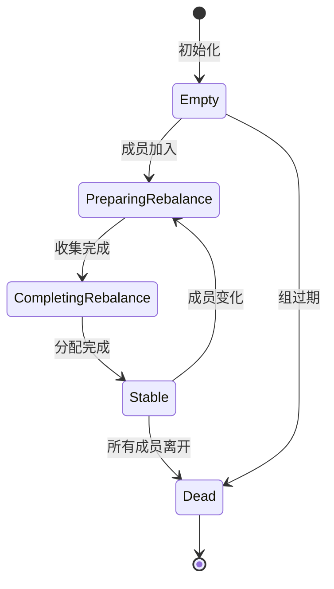

# 02. Consumer Group 管理

## 2.1 消费者组概念

### 什么是消费者组

```scala
/**
 * 消费者组定义:
 *
 * 消费者组是 Kafka 中实现消费并行化和故障容错的核心机制。
 * 多个消费者可以组成一个组，共同消费一个或多个 Topic 的消息。
 *
 * 核心规则:
 * 1. 一个分区只能被组内一个消费者消费
 * 2. 一个消费者可以消费多个分区
 * 3. 组内消费者数 > 分区数时，部分消费者会空闲
 * 4. 组内消费者通过 Coordinator 协调分区分配
 * /
```

### 为什么需要消费者组

```scala
/**
 * 使用场景:
 *
 * 1. 扩展消费能力
 *    - 单个消费者处理能力有限
 *    - 多个消费者并行处理不同分区
 *    - 水平扩展以提高吞吐量
 *
 * 2. 故障容错
 *    - 某个消费者故障时
 *    - 分区自动重新分配给其他消费者
 *    - 保证消费不中断
 *
 * 3. 位置管理
 *    - 统一管理消费进度
 *    - 支持从上次位置继续消费
 *    - 支持重置消费位置
 *
 * 4. 消费语义
 *    - 实现至少一次语义
 *    - 防止消息丢失
 *    - 支持消息重试
 * /
```

## 2.2 消费者组元数据

### GroupMetadata 结构

```scala
/**
 * Group 元数据结构:
 *
 * 包含了 GroupCoordinator 管理消费者组所需的所有信息
 * /
case class GroupMetadata(
    // 组标识
    groupId: String,                          // 唯一标识

    // 代数信息 - 用于防止僵尸成员
    generationId: Int,                        // 当前代数
    protocolType: Option[String],             // 协议类型 (consumer)

    // 选择的分配策略
    protocol: Option[String],                 // 使用的策略名称
    leaderId: Option[String],                 // Leader 成员 ID

    // 组状态
    state: GroupState,                        // 当前状态

    // 成员信息
    members: Map[String, MemberMetadata],     // 成员列表

    // 时间戳
    lastRebalanceTimeMs: Long = -1L,          // 上次 Rebalance 时间
    currentStateTimestamp: Option[Long] = None // 状态变更时间
) {
    // 获取组类型
    def groupType: GroupType = {
        if (protocolType.contains("consumer"))
            GroupType.CONSUMER
        else
            GroupType.CLASSIC
    }

    // 检查是否包含指定成员
    def has(memberId: String): Boolean = {
        members.containsKey(memberId)
    }

    // 获取成员
    def get(memberId: String): MemberMetadata = {
        members.get(memberId)
    }

    // 检查是否所有成员都已响应
    def hasReceivedAllJoinResponses: Boolean = {
        members.values.forall(_.isAwaitingJoin)
    }

    // 获取订阅信息 (用于分区分配)
    def allMemberSubscriptions: Map[String, List[String]] = {
        members.map { case (id, member) =>
            id -> member.metadata.subscription
        }
    }
}
```

### MemberMetadata 结构

```scala
/**
 * 成员元数据结构:
 *
 * 记录了每个消费者的详细信息
 * /
case class MemberMetadata(
    // 成员标识
    memberId: String,                         // 系统生成的唯一 ID
    groupInstanceId: Option[String],          // 静态成员 ID (用户配置)

    // 客户端信息
    clientId: String,                         // 客户端 ID
    clientHost: String,                       // 客户端主机地址

    // 超时配置
    rebalanceTimeoutMs: Int,                  // Rebalance 超时时间
    sessionTimeoutMs: Int,                    // 会话超时时间

    // 分配策略
    protocolType: String,                     // 协议类型
    protocols: List[(String, Array[Byte])],   // 支持的分配策略列表

    // 元数据
    metadata: ConsumerMetadata,               // 消费者元数据

    // 状态标志
    supportSkippingMetadata: Boolean,         // 是否支持跳过元数据

    // 分配结果
    var assignment: Array[Byte] = Array.empty // 分配的分区
) {
    // 成员是否正在等待 Join 响应
    def isAwaitingJoin: Boolean = {
        // 检查是否已经完成 Join 阶段
    }

    // 成员是否即将离开
    def isLeaving: Boolean = {
        sessionTimeoutMs < 0
    }

    // 成员是否仍在组中
    def hasNotLeft: Boolean = {
        !isLeaving
    }
}

/**
 * 消费者元数据:
 *
 * 包含订阅信息和其他消费配置
 * /
case class ConsumerMetadata(
    subscription: List[String],               // 订阅的 Topic 列表
    userData: Array[Byte] = Array.empty       // 用户自定义数据
)
```

## 2.3 消费者组类型

### Classic Consumer Group

```scala
/**
 * Classic Consumer Group:
 *
 * 传统的消费者组模式，适用于:
 * - 高吞吐量消费场景
 * - 可以容忍短暂的 Rebalance
 * - 使用 range、roundrobin、sticky 等策略
 *
 * 特点:
 * - Rebalance 时所有消费者重新加入
 * - stop-the-world 式的分区重分配
 * - 需要处理 session timeout
 * /
```

### Static Consumer Group

```scala
/**
 * Static Consumer Group:
 *
 * 引入静态成员概念，适用于:
 * - 需要稳定的分区分配
 * - 减少不必要的 Rebalance
 * - 容器化部署场景
 *
 * 特点:
 * - 通过 group.instance.id 标识成员
 * - 成员短暂离线后可恢复身份
 * - 减少因网络抖动导致的 Rebalance
 *
 * 配置示例:
 * properties.put("group.instance.id", "consumer-1");
 * /
```

## 2.4 组管理操作

### 创建组

```scala
/**
 * 创建消费者组:
 *
 * 组是惰性创建的，当第一个消费者加入时自动创建。
 * /
def createGroup(
    groupId: String,
    protocolType: String
): GroupMetadata = {
    val group = new GroupMetadata(
        groupId = groupId,
        generationId = 0,
        protocolType = Some(protocolType),
        protocol = None,
        leaderId = None,
        state = Empty,
        members = Map.empty,
        lastRebalanceTimeMs = time.milliseconds()
    )

    // 添加到缓存
    groupMetadataCache.put(group)

    group
}
```

### 查找组

```scala
/**
 * 查找消费者组:
 *
 * 支持按组 ID 查找，如果不存在则创建
 * /
def getOrMaybeCreateGroup(
    groupId: String,
    protocolType: Option[String]
): GroupMetadata = {
    // 1. 尝试从缓存获取
    val group = groupMetadataCache.get(groupId)

    group match {
        case Some(g) => g

        case None =>
            // 2. 缓存不存在，创建新组
            protocolType match {
                case Some(pt) =>
                    createGroup(groupId, pt)
                case None =>
                    throw new InvalidGroupIdException(
                        s"Group $groupId does not exist"
                    )
            }
    }
}
```

### 删除组

```scala
/**
 * 删除消费者组:
 *
 * 当组内没有成员且不需要保留 Offset 时删除
 * /
def deleteGroup(groupId: String): Unit = {
    val group = groupMetadataCache.get(groupId)

    group match {
        case Some(g) if g.isEmpty =>
            // 删除内存缓存
            groupMetadataCache.remove(groupId)

            // 删除持久化数据
            offsetManager.deleteGroup(groupId)

        case Some(g) =>
            throw new GroupNotEmptyException(
                s"Group $groupId is not empty"
            )

        case None =>
            // 组不存在，无需删除
    }
}
```

## 2.5 成员管理操作

### 添加成员

```scala
/**
 * 添加成员到组:
 *
 * 处理 JoinGroup 请求，添加新成员
 * /
def addMember(
    group: GroupMetadata,
    memberId: String,
    groupInstanceId: Option[String],
    clientId: String,
    clientHost: String,
    rebalanceTimeoutMs: Int,
    sessionTimeoutMs: Int,
    protocolType: String,
    protocols: List[(String, Array[Byte])],
    metadata: ConsumerMetadata,
    supportSkippingMetadata: Boolean
): MemberMetadata = {
    group.inLock {
        val member = MemberMetadata(
            memberId = memberId,
            groupInstanceId = groupInstanceId,
            clientId = clientId,
            clientHost = clientHost,
            rebalanceTimeoutMs = rebalanceTimeoutMs,
            sessionTimeoutMs = sessionTimeoutMs,
            protocolType = protocolType,
            protocols = protocols,
            metadata = metadata,
            supportSkippingMetadata = supportSkippingMetadata
        )

        // 添加到组
        group.add(member)

        // 触发 Rebalance
        prepareRebalance(group)

        member
    }
}
```

### 移除成员

```scala
/**
 * 移除成员:
 *
 * 处理成员离开或超时
 * /
def removeMember(
    group: GroupMetadata,
    memberId: String
): Unit = {
    group.inLock {
        if (group.has(memberId)) {
            // 移除成员
            group.remove(memberId)

            // 触发 Rebalance
            if (!group.isEmpty) {
                prepareRebalance(group)
            } else {
                // 组为空，进入 Empty 状态
                group.transitionTo(Empty)
            }
        }
    }
}
```

### 更新成员

```scala
/**
 * 更新成员信息:
 *
 * 心跳时更新成员时间戳
 * /
def updateMember(
    group: GroupMetadata,
    memberId: String
): Boolean = {
    group.inLock {
        if (group.has(memberId)) {
            val member = group.get(memberId)

            // 更新心跳时间
            member.lastHeartbeatTimestamp = time.milliseconds()

            // 检查是否需要刷新会话
            sessionManager.updateSessionExpiration(
                group.groupId,
                memberId,
                member.sessionTimeoutMs
            )

            true
        } else {
            false
        }
    }
}
```

## 2.6 成员身份管理

### Member ID 生成

```scala
/**
 * Member ID 生成规则:
 *
 * 1. 首次加入
 *    - 系统自动生成: ${clientId}-${epoch}
 *    - epoch 是时间戳或 UUID
 *
 * 2. 静态成员
 *    - 使用用户配置的 group.instance.id
 *    - 保持身份稳定
 *
 * 3. 重连场景
 *    - 动态成员: 生成新的 Member ID
 *    - 静态成员: 使用相同的 Member ID
 * /

// 源码实现
def generateMemberId(clientId: String): String = {
    val uuid = UUID.randomUUID().toString
    s"$clientId-$uuid"
}
```

### 静态成员处理

```scala
/**
 * 静态成员特性:
 *
 * 1. 身份保持
 *    - group.instance.id 保持不变
 *    - 重连后恢复原有分配
 *    - 减少不必要的 Rebalance
 *
 * 2. 超时处理
 *    - session.timeout 内保持身份
 *    - 超时后触发 Rebalance
 *    - 重新加入时替换旧成员
 * /
def handleStaticMember(
    group: GroupMetadata,
    groupInstanceId: String,
    metadata: MemberMetadata
): Unit = {
    group.inLock {
        // 查找现有静态成员
        val existingMember = group.members.values.find(
            _.groupInstanceId.contains(groupInstanceId)
        )

        existingMember match {
            case Some(member) =>
                // 更新现有成员
                member.update(metadata)

            case None =>
                // 添加新成员
                group.add(metadata)
        }
    }
}
```

## 2.7 组生命周期管理

### 组状态转换



### 生命周期事件

```scala
/**
 * 组生命周期事件:
 *
 * 1. 创建
 *    - 第一个成员加入
 *    - 初始化 GroupMetadata
 *
 * 2. Rebalance
 *    - 成员加入/离开
 *    - 订阅变化
 *    - Coordinator 变更
 *
 * 3. 运行
 *    - 处理心跳
 *    - 提交 Offset
 *    - 消费消息
 *
 * 4. 销毁
 *    - 所有成员离开
 *    - Offset 过期
 *    - 手动删除
 * /
```

## 2.8 组监控信息

### 组详情查询

```scala
/**
 * 查询组详情:
 *
 * 包含组的完整状态信息
 * /
def describeGroup(groupId: String): GroupDescription = {
    val group = getGroup(groupId)

    GroupDescription(
        groupId = group.groupId,
        protocolType = group.protocolType,
        state = group.state.toString,
        members = group.members.map { case (id, member) =>
            MemberDescription(
                memberId = id,
                groupInstanceId = member.groupInstanceId,
                clientId = member.clientId,
                clientHost = member.clientHost,
                assignment = deserializeAssignment(member.assignment)
            )
        }.toList,
        partitionAssignor = group.protocol,
        coordinator = findCoordinator(groupId)
    )
}
```

### 组列表查询

```scala
/**
 * 列举所有组:
 *
 * 支持过滤和分页
 * /
def listGroups(
    states: Option[Set[GroupState]] = None,
    topic: Option[String] = None
): List[GroupOverview] = {
    var groups = groupMetadataCache.values

    // 按状态过滤
    states.foreach { stateFilter =>
        groups = groups.filter(g => stateFilter.contains(g.state))
    }

    // 按订阅 Topic 过滤
    topic.foreach { topicFilter =>
        groups = groups.filter { g =>
            g.members.values.exists { member =>
                member.metadata.subscription.contains(topicFilter)
            }
        }
    }

    groups.map { g =>
        GroupOverview(
            groupId = g.groupId,
            protocolType = g.protocolType,
            state = g.state.toString,
            coordinator = findCoordinator(g.groupId)
        )
    }.toList
}
```

## 2.9 大规模组管理

### 性能优化

```scala
/**
 * 大规模组管理优化:
 *
 * 1. 减少 Rebalance 频率
 *    - 使用静态成员
 *    - 增大 session timeout
 *    - 优化网络配置
 *
 * 2. 优化内存使用
 *    - 定期清理空组
 *    - 压缩元数据
 *    - 分区负载均衡
 *
 * 3. 提升处理能力
 *    - 增加 Broker 数量
 *    - 优化 __consumer_offsets 分区数
 *    - 调整线程池大小
 * /
```

### 容量规划

```scala
/**
 * 容量规划建议:
 *
 * 1. 单 Broker 组数量
 *    - 建议不超过 10,000 个组
 *    - 监控内存使用情况
 *
 * 2. 单组成员数量
 *    - 建议不超过 1,000 个成员
 *    - 考虑 Rebalance 时间
 *
 * 3. Topic 分区数
 *    - __consumer_offsets 建议 25-50 分区
 *    - 根据组数量调整
 * /
```

## 2.10 实战经验

### 最佳实践

```scala
/**
 * 组管理最佳实践:
 *
 * 1. Group ID 命名
 *    - 使用有意义的名称
 *    - 包含应用名和用途
 *    - 例如: order-processing-app
 *
 * 2. 成员配置
 *    - session.timeout.ms: 10-30s
 *    - heartbeat.interval.ms: session/3
 *    - max.poll.interval.ms: 5min
 *
 * 3. 静态成员
 *    - 适合容器化部署
 *    - 减少 Rebalance
 *    - 使用唯一的 instance.id
 *
 * 4. 监控告警
 *    - 监控 Rebalance 频率
 *    - 监控组大小变化
 *    - 监控消费延迟
 * /
```

### 常见问题

```scala
/**
 * 常见问题及解决方案:
 *
 * 1. 频繁 Rebalance
 *    - 检查 session timeout 配置
 *    - 检查网络连接
 *    - 使用静态成员
 *
 * 2. 组无法加入
 *    - 检查 Group ID 是否正确
 *    - 检查 Coordinator 状态
 *    - 检查权限配置
 *
 * 3. 分配不均
 *    - 检查分区数和消费者数
 *    - 选择合适的分配策略
 *    - 考虑使用 Sticky 策略
 * /
```

## 2.11 小结

Consumer Group 管理是 Kafka 消费模型的核心，通过有效的组管理可以实现：

1. **水平扩展**：通过增加消费者提升处理能力
2. **故障容错**：自动检测和处理消费者故障
3. **负载均衡**：合理分配分区给消费者
4. **位置管理**：统一管理消费进度

## 参考文档

- [01-coordinator-overview.md](./01-coordinator-overview.md) - Coordinator 概述
- [06-group-state-machine.md](./06-group-state-machine.md) - Group 状态机详解
- [08-rebalance-optimization.md](./08-rebalance-optimization.md) - Rebalance 优化
