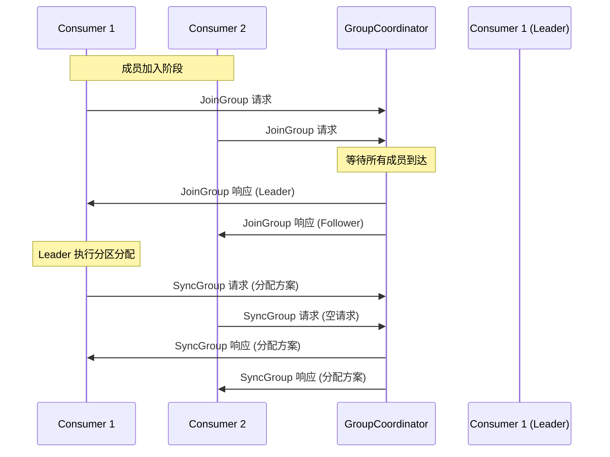
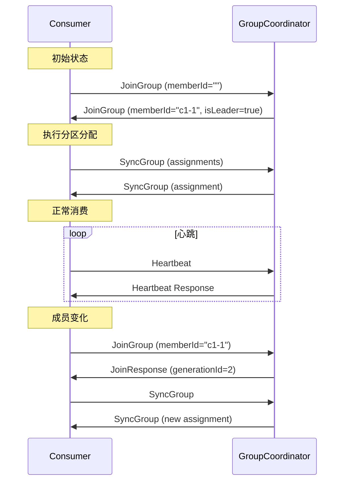

# 03. Rebalance 协议详解

## 3.1 Rebalance 概述

### 什么是 Rebalance

```scala
/**
 * Rebalance 定义:
 *
 * Rebalance 是消费者组重新分配分区的过程。
 * 当组成员关系或订阅关系发生变化时，
 * Coordinator 会协调所有消费者重新分配分区。
 *
 * Rebalance 的目的:
 * 1. 确保每个分区只被组内一个消费者消费
 * 2. 在成员变化时重新平衡负载
 * 3. 维护消费语义的一致性
 *
 * Rebalance 的代价:
 * 1. 消费暂停 - 消费者停止消费
 * 2. 重复消费 - 重新分配导致位置回滚
 * 3. 性能影响 - 协调过程消耗资源
 * /
```

### Rebalance 类型

```scala
/**
 * Rebalance 类型演进:
 *
 * 1. Eager Rebalance (急切模式)
 *    - 所有消费者停止消费
 *    - 全部重新加入组
 *    - 完全重新分配分区
 *    - 代价高，影响大
 *
 * 2. Cooperative Rebalance (协作模式)
 *    - 只重新分配受影响的分区
 *    - 其他消费者继续消费
 *    - 逐步完成分区转移
 *    - 代价小，影响小
 *
 * Kafka 2.4+ 支持 Cooperative Sticky Assignor
 * /
```

## 3.2 JoinGroup 协议

### 协议流程



### JoinGroup 请求结构

```scala
/**
 * JoinGroup 请求结构 (API Key: 11)
 *
 * Version 7 (Kafka 2.3+)
 * /
case class JoinGroupRequest(
    // 组信息
    groupId: String,                         // 组 ID
    sessionTimeoutMs: Int,                   // 会话超时时间
    rebalanceTimeoutMs: Int,                 // Rebalance 超时时间
    memberId: String,                        // 成员 ID (首次加入为空)
    groupInstanceId: Option[String],         // 静态成员 ID

    // 协议类型
    protocolType: String,                    // 协议类型 (consumer)
    protocols: List[Protocol],               // 支持的分配策略

    // 主题和元数据
    topics: List[String],                    // 订阅的主题
    userData: Array[Byte]                    // 用户数据
) {
    /**
     * Protocol 结构:
     * - name: 分配策略名称 (range, roundrobin, sticky)
     * - metadata: 策略相关的元数据
     * /
}

case class Protocol(
    name: String,
    metadata: Array[Byte]
)
```

### JoinGroup 响应结构

```scala
/**
 * JoinGroup 响应结构
 * /
case class JoinGroupResponse(
    // 错误码
    errorCode: Short,                        // 错误码

    // 代数信息
    generationId: Int,                       // 新的代数
    protocolType: String,                    // 协议类型
    protocolName: String,                    // 选定的分配策略

    // 成员信息
    memberId: String,                        // 分配的成员 ID
    members: List[Member],                   // 所有成员信息

    // Leader 信息
    leaderId: String,                        // Leader 成员 ID
    skipAssignment: Boolean                  // 是否跳过分配
) {
    /**
     * Member 结构:
     * - memberId: 成员 ID
     * - groupInstanceId: 静态成员 ID
     * - metadata: 成员订阅元数据
     * /
}

case class Member(
    memberId: String,
    groupInstanceId: Option[String],
    metadata: Array[Byte]
)
```

### JoinGroup 处理逻辑

```scala
/**
 * JoinGroup 请求处理流程
 * /
def handleJoinGroup(
    groupId: String,
    memberId: String,
    groupInstanceId: Option[String],
    clientId: String,
    clientHost: String,
    rebalanceTimeoutMs: Int,
    sessionTimeoutMs: int,
    protocolType: String,
    protocols: List[Protocol],
    metadata: Array[Byte]
): JoinGroupResponse = {

    // 1. 获取或创建组
    val group = getOrMaybeCreateGroup(groupId, Some(protocolType))

    group.inLock {
        // 2. 验证请求
        validateJoinGroup(group, memberId, protocols) match {
            case Some(error) =>
                return JoinGroupResponse(
                    errorCode = error.code,
                    // ... 其他字段
                )

            case None =>
                // 继续处理
        }

        // 3. 处理成员加入
        val member = if (memberId.isEmpty) {
            // 首次加入 - 生成新 Member ID
            val newMemberId = generateMemberId(clientId)
            addMember(
                group = group,
                memberId = newMemberId,
                groupInstanceId = groupInstanceId,
                // ... 其他参数
            )
        } else {
            // 重新加入 - 更新现有成员
            updateMember(group, memberId, metadata)
        }

        // 4. 检查是否需要等待其他成员
        if (!canCompleteJoin(group)) {
            // 等待更多成员加入
            val delayedJoin = new DelayedJoin(
                group = group,
                rebalanceTimeoutMs = rebalanceTimeoutMs
            )
            joinPurgatory.tryCompleteElseWatch(delayedJoin, List(group))
        }

        // 5. 准备响应
        prepareJoinResponse(group, member)
    }
}

/**
 * 验证 JoinGroup 请求
 * /
private def validateJoinGroup(
    group: GroupMetadata,
    memberId: String,
    protocols: List[Protocol]
): Option[Errors] = {
    // 1. 检查组状态
    if (group.is(Dead)) {
        return Some(Errors.GROUP_ID_NOT_FOUND)
    }

    // 2. 检查协议类型
    if (group.protocolType.exists(_ != protocolType)) {
        return Some(Errors.INCONSISTENT_GROUP_PROTOCOL)
    }

    // 3. 检查分配策略
    if (protocols.isEmpty) {
        return Some(Errors.INCONSISTENT_GROUP_PROTOCOL)
    }

    // 4. 检查成员身份
    if (memberId.nonEmpty && !group.has(memberId)) {
        return Some(Errors.UNKNOWN_MEMBER_ID)
    }

    None
}
```

## 3.3 SyncGroup 协议

### SyncGroup 请求结构

```scala
/**
 * SyncGroup 请求结构 (API Key: 14)
 *
 * Version 5 (Kafka 2.3+)
 * /
case class SyncGroupRequest(
    // 组信息
    groupId: String,                         // 组 ID
    generationId: Int,                       // 代数
    memberId: String,                        // 成员 ID

    // 分配方案 (仅 Leader)
    groupAssignment: List[MemberAssignment]  // 所有成员的分配
) {
    /**
     * MemberAssignment 结构:
     * - memberId: 成员 ID
     * - assignment: 分配的分区 (序列化)
     * /
}

case class MemberAssignment(
    memberId: String,
    assignment: Array[Byte]
)
```

### SyncGroup 响应结构

```scala
/**
 * SyncGroup 响应结构
 * /
case class SyncGroupResponse(
    // 错误码
    errorCode: Short,                        // 错误码

    // 分配结果
    assignment: Array[Byte],                 // 本成员的分配方案

    // 协议信息
    protocolType: Option[String],            // 协议类型
    protocolName: Option[String]             // 分配策略名称
)
```

### SyncGroup 处理逻辑

```scala
/**
 * SyncGroup 请求处理流程
 * /
def handleSyncGroup(
    groupId: String,
    generationId: Int,
    memberId: String,
    groupAssignment: List[MemberAssignment]
): SyncGroupResponse = {

    // 1. 获取组
    val group = getGroup(groupId)

    group.inLock {
        // 2. 验证请求
        validateSyncGroup(group, generationId, memberId) match {
            case Some(error) =>
                return SyncGroupResponse(
                    errorCode = error.code,
                    assignment = Array.empty
                )

            case None =>
                // 继续处理
        }

        // 3. 处理 Leader 的分配方案
        if (group.isLeader(memberId)) {
            // Leader 提交分配方案
            processLeaderAssignment(
                group = group,
                assignments = groupAssignment
            )
        } else {
            // Follower 等待 Leader 完成
            if (!group.hasReceivedAllSyncResponses) {
                // 等待 Leader
                val delayedSync = new DelayedSync(
                    group = group,
                    timeoutMs = group.rebalanceTimeoutMs
                )
                syncPurgatory.tryCompleteElseWatch(delayedSync, List(group))
            }
        }

        // 4. 准备响应
        prepareSyncResponse(group, memberId)
    }
}

/**
 * 处理 Leader 的分配方案
 * /
private def processLeaderAssignment(
    group: GroupMetadata,
    assignments: List[MemberAssignment]
): Unit = {
    // 1. 验证分配方案
    assignments.foreach { assignment =>
        val member = group.get(assignment.memberId)
        if (member == null) {
            throw new IllegalArgumentException(
                s"Member ${assignment.memberId} not found"
            )
        }
    }

    // 2. 应用分配方案
    assignments.foreach { assignment =>
        val member = group.get(assignment.memberId)
        member.assignment = assignment.assignment
    }

    // 3. 完成状态转换
    group.transitionTo(Stable)
}

/**
 * 验证 SyncGroup 请求
 * /
private def validateSyncGroup(
    group: GroupMetadata,
    generationId: Int,
    memberId: String
): Option[Errors] = {
    // 1. 检查组状态
    if (!group.is(CompletingRebalance)) {
        return Some(Errors.UNKNOWN_MEMBER_ID)
    }

    // 2. 检查代数
    if (group.generationId != generationId) {
        return Some(Errors.ILLEGAL_GENERATION)
    }

    // 3. 检查成员身份
    if (!group.has(memberId)) {
        return Some(Errors.UNKNOWN_MEMBER_ID)
    }

    None
}
```

## 3.4 Heartbeat 协议

### Heartbeat 请求结构

```scala
/**
 * Heartbeat 请求结构 (API Key: 12)
 *
 * Version 4 (Kafka 2.3+)
 * /
case class HeartbeatRequest(
    // 组信息
    groupId: String,                         // 组 ID
    generationId: Int,                       // 代数
    memberId: String,                        // 成员 ID
    groupInstanceId: Option[String]          // 静态成员 ID
)
```

### Heartbeat 响应结构

```scala
/**
 * Heartbeat 响应结构
 * /
case class HeartbeatResponse(
    errorCode: Short                         // 错误码
)
```

### Heartbeat 处理逻辑

```scala
/**
 * Heartbeat 请求处理流程
 * /
def handleHeartbeat(
    groupId: String,
    generationId: Int,
    memberId: String,
    groupInstanceId: Option[String]
): HeartbeatResponse = {

    // 1. 获取组
    val group = getGroup(groupId)

    group.inLock {
        // 2. 验证请求
        validateHeartbeat(group, generationId, memberId) match {
            case Some(error) =>
                return HeartbeatResponse(errorCode = error.code)

            case None =>
                // 继续处理
        }

        // 3. 更新心跳时间
        val member = group.get(memberId)
        member.lastHeartbeatTimestamp = time.milliseconds()

        // 4. 刷新会话
        sessionManager.updateSessionExpiration(
            groupId = groupId,
            memberId = memberId,
            timeoutMs = member.sessionTimeoutMs
        )

        HeartbeatResponse(errorCode = Errors.NONE.code)
    }
}

/**
 * 验证 Heartbeat 请求
 * /
private def validateHeartbeat(
    group: GroupMetadata,
    generationId: Int,
    memberId: String
): Option[Errors] = {
    // 1. 检查组状态
    if (group.is(Dead)) {
        return Some(Errors.GROUP_ID_NOT_FOUND)
    }

    // 2. 检查成员是否存在
    if (!group.has(memberId)) {
        return Some(Errors.UNKNOWN_MEMBER_ID)
    }

    // 3. 检查代数
    if (group.generationId != generationId) {
        return Some(Errors.ILLEGAL_GENERATION)
    }

    None
}
```

### 心跳超时检测

```scala
/**
 * 心跳超时检测机制
 *
 * 使用 DelayedOperationPurgatory 实现定时检查
 * /
class GroupSessionManager(
    purgatory: DelayedOperationPurgatory[DelayedHeartbeat],
    sessionTimeoutMs: Int,
    time: Time
) extends Logging {

    // 活跃会话
    private val sessions = new ConcurrentHashMap[String, Session]()

    /**
     * 更新会话过期时间
     * /
    def updateSessionExpiration(
        groupId: String,
        memberId: String,
        timeoutMs: Int
    ): Unit = {
        val key = s"$groupId-$memberId"
        val deadline = time.milliseconds() + timeoutMs

        // 创建或更新会话
        val session = new Session(
            groupId = groupId,
            memberId = memberId,
            deadline = deadline
        )

        sessions.put(key, session)

        // 安排超时检查
        scheduleExpiration(session)
    }

    /**
     * 安排超时检查
     * /
    private def scheduleExpiration(session: Session): Unit = {
        val delayedHeartbeat = new DelayedHeartbeat(
            session = session,
            sessionTimeoutMs = sessionTimeoutMs,
            time = time
        )

        purgatory.tryCompleteElseWatch(delayedHeartbeat, List(session))
    }

    /**
     * 检查并处理过期会话
     * /
    def onExpiration(session: Session): Unit = {
        val key = s"${session.groupId}-${session.memberId}"

        // 移除会话
        sessions.remove(key)

        // 触发成员失效
        onMemberFailure(session.groupId, session.memberId)
    }
}

/**
 * 会话定义
 * /
case class Session(
    groupId: String,
    memberId: String,
    deadline: Long
)

/**
 * 延迟心跳操作
 * /
class DelayedHeartbeat(
    session: Session,
    sessionTimeoutMs: Int,
    time: Time
) extends DelayedOperation {

    override def tryComplete(): Boolean = {
        // 检查会话是否已更新
        val now = time.milliseconds()
        if (now < session.deadline) {
            // 会话仍然有效，等待
            false
        } else {
            // 会话过期，完成操作
            forceComplete()
        }
    }

    override def onComplete(): Unit = {
        // 会话过期，触发处理
        sessionManager.onExpiration(session)
    }
}
```

## 3.5 LeaveGroup 协议

### LeaveGroup 请求结构

```scala
/**
 * LeaveGroup 请求结构 (API Key: 13)
 *
 * Version 4 (Kafka 2.3+)
 * /
case class LeaveGroupRequest(
    groupId: String,                         // 组 ID
    memberId: String,                        // 成员 ID
    // 支持一次离开多个成员 (Kafka 2.4+)
    members: List[MemberIdentity]            // 成员列表
) {
    /**
     * MemberIdentity 结构:
     * - memberId: 成员 ID
     * - groupInstanceId: 静态成员 ID
     * /
}

case class MemberIdentity(
    memberId: String,
    groupInstanceId: Option[String]
)
```

### LeaveGroup 响应结构

```scala
/**
 * LeaveGroup 响应结构
 * /
case class LeaveGroupResponse(
    errorCode: Short,                        // 错误码
    members: List[MemberResponse]           // 离开结果
) {
    /**
     * MemberResponse 结构:
     * - memberId: 成员 ID
     * - groupInstanceId: 静态成员 ID
     * - errorCode: 错误码
     * /
}

case class MemberResponse(
    memberId: String,
    groupInstanceId: Option[String],
    errorCode: Short
)
```

### LeaveGroup 处理逻辑

```scala
/**
 * LeaveGroup 请求处理流程
 * /
def handleLeaveGroup(
    groupId: String,
    memberId: String,
    members: List[MemberIdentity]
): LeaveGroupResponse = {

    // 1. 获取组
    val group = getGroup(groupId)

    group.inLock {
        // 2. 处理成员离开
        val results = if (members.isEmpty) {
            // 单成员离开 (旧版本)
            List(removeMember(group, memberId))
        } else {
            // 多成员离开 (新版本)
            members.map { identity =>
                removeMember(group, identity.memberId)
            }
        }

        // 3. 触发 Rebalance
        if (!group.isEmpty) {
            prepareRebalance(group)
        } else {
            // 组为空
            group.transitionTo(Empty)
        }

        LeaveGroupResponse(
            errorCode = Errors.NONE.code,
            members = results
        )
    }
}

/**
 * 移除成员
 * /
private def removeMember(
    group: GroupMetadata,
    memberId: String
): MemberResponse = {
    if (group.has(memberId)) {
        // 移除成员
        group.remove(memberId)

        MemberResponse(
            memberId = memberId,
            groupInstanceId = None,
            errorCode = Errors.NONE.code
        )
    } else {
        MemberResponse(
            memberId = memberId,
            groupInstanceId = None,
            errorCode = Errors.UNKNOWN_MEMBER_ID.code
        )
    }
}
```

## 3.6 协议对比

### 请求对比

| 请求 | 用途 | 触发条件 | 超时处理 |
|------|------|----------|----------|
| JoinGroup | 加入组 | 成员加入、Rebalance | rebalance.timeout.ms |
| SyncGroup | 同步分配 | Leader 提交方案 | rebalance.timeout.ms |
| Heartbeat | 保持会话 | 定期发送 | session.timeout.ms |
| LeaveGroup | 离开组 | 主动关闭 | 无超时 |

### 错误码处理

```scala
/**
 * 常见错误码及处理
 *
 * 1. NONE (0)
 *    - 成功
 *
 * 2. GROUP_COORDINATOR_NOT_AVAILABLE (15)
 *    - Coordinator 不可用
 *    - 客户端需要重新查找 Coordinator
 *
 * 3. NOT_COORDINATOR (16)
 *    - 不是正确的 Coordinator
 *    - 客户端需要重新查找 Coordinator
 *
 * 4. ILLEGAL_GENERATION (22)
 *    - 代数不匹配
 *    - 需要重新加入组
 *
 * 5. UNKNOWN_MEMBER_ID (25)
 *    - 成员 ID 不存在
 *    - 需要重新加入组
 *
 * 6. REBALANCE_IN_PROGRESS (27)
 *    - 正在 Rebalance
 *    - 需要等待完成
 *
 * 7. GROUP_AUTHORIZATION_FAILED (30)
 *    - 权限不足
 *    - 检查 ACL 配置
 * /
```

## 3.7 协议时序

### 完整 Rebalance 时序



## 3.8 小结

Rebalance 协议是 Kafka 消费者组协调的核心机制，包含：

1. **JoinGroup**：成员加入，协商分配策略
2. **SyncGroup**：同步分区分配方案
3. **Heartbeat**：维护成员会话
4. **LeaveGroup**：成员主动离开

理解这些协议的细节对于排查消费者组问题至关重要。

## 参考文档

- [01-coordinator-overview.md](./01-coordinator-overview.md) - Coordinator 概述
- [04-rebalance-process.md](./04-rebalance-process.md) - 重平衡流程详解
- [08-rebalance-optimization.md](./08-rebalance-optimization.md) - Rebalance 优化
