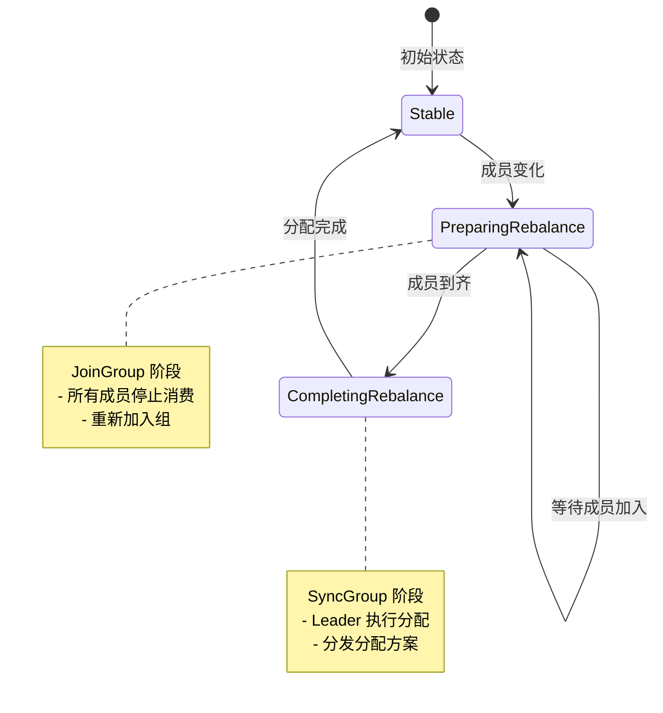
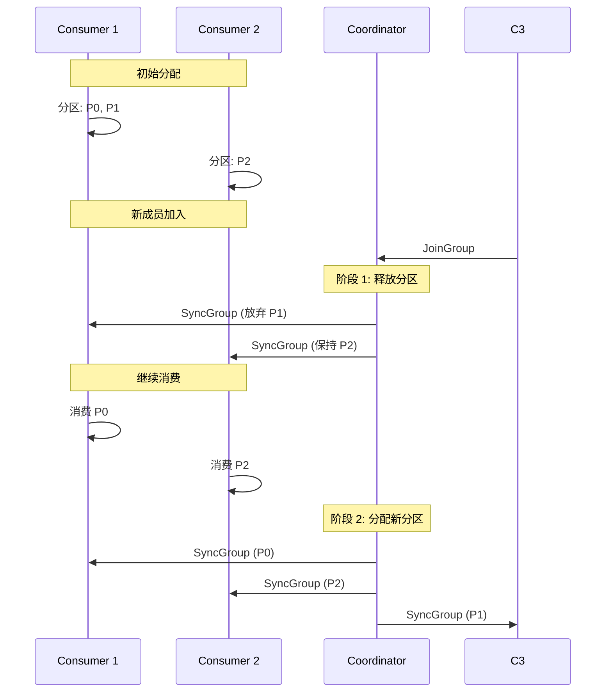

# 04. 重平衡流程分析

## 4.1 重平衡触发条件

### 触发场景

```scala
/**
 * 重平衡触发条件:
 *
 * 1. 成员变化
 *    - 新成员加入
 *    - 成员主动离开
 *    - 成员超时失效
 *    - 成员被踢出
 *
 * 2. 订阅变化
 *    - 订阅的 Topic 变化
 *    - Topic 分区数变化
 *
 * 3. Coordinator 变化
 *    - Coordinator 故障
 *    - Broker 重新选举
 *
 * 4. 分配策略变化
 *    - partition.assignment.strategy 变化
 *    - 不支持的策略组合
 * /

// 检查是否需要 Rebalance
def needsRebalance(
    group: GroupMetadata,
    newMemberMetadata: MemberMetadata
): Boolean = {
    // 1. 检查成员数量变化
    if (group.size != newMembers.size) {
        return true
    }

    // 2. 检查订阅变化
    if (hasSubscriptionChanged(group, newMemberMetadata)) {
        return true
    }

    // 3. 检查策略变化
    if (hasStrategyChanged(group, newMemberMetadata)) {
        return true
    }

    false
}
```

### 成员变化触发

```scala
/**
 * 成员变化触发 Rebalance:
 *
 * 新成员加入:
 * 1. 消费者调用 JoinGroup
 * 2. Coordinator 发现成员列表变化
 * 3. 触发 Rebalance
 *
 * 成员离开:
 * 1. 消费者调用 LeaveGroup
 * 2. 或心跳超时
 * 3. Coordinator 移除成员
 * 4. 触发 Rebalance
 * /

// 成员超时检测
def checkMemberExpiration(): Unit = {
    val now = time.milliseconds()

    groupMetadataCache.foreach { case (_, group) =>
        group.inLock {
            if (group.is(Stable) || group.is(CompletingRebalance)) {
                group.members.foreach { case (memberId, member) =>
                    val lastHeartbeat = member.lastHeartbeatTimestamp
                    val sessionTimeout = member.sessionTimeoutMs

                    if (now - lastHeartbeat > sessionTimeout) {
                        // 成员超时
                        info(s"Member $memberId has failed")
                        removeMember(group, memberId)
                    }
                }
            }
        }
    }
}
```

## 4.2 Eager 重平衡流程

### 完整流程



### 阶段 1: PreparingRebalance

```scala
/**
 * PreparingRebalance 阶段:
 *
 * 目标: 等待所有成员重新加入
 *
 * 1. 组状态转换
 *    - Stable -> PreparingRebalance
 *    - 增加 generationId
 *
 * 2. 等待成员加入
 *    - 接收 JoinGroup 请求
 *    - 记录成员信息
 *
 * 3. 超时控制
 *    - rebalance.timeout.ms
 *    - 超时后使用当前成员
 * /
def prepareRebalance(group: GroupMetadata): Unit = {
    group.inLock {
        // 1. 检查当前状态
        if (group.is(PreparingRebalance)) {
            // 已经在 Rebalance，更新超时
            updateRebalanceTimeout(group)
            return
        }

        // 2. 转换状态
        if (group.is(Stable) || group.is(CompletingRebalance)) {
            // 下一代
            group.generationId += 1

            // 转换状态
            group.transitionTo(PreparingRebalance)

            // 通知所有成员
            group.members.values.foreach { member =>
                member.awaitingJoin = true
            }

            // 初始化定时任务
            val delayedRebalance = new DelayedJoin(
                group,
                rebalanceTimeoutMs
            )
            joinPurgatory.tryCompleteElseWatch(delayedRebalance, List(group))
        }
    }
}
```

### 阶段 2: 处理 JoinGroup

```scala
/**
 * 处理 JoinGroup 请求
 * /
def handleJoinGroupInPreparing(
    group: GroupMetadata,
    memberId: String,
    metadata: JoinGroupMetadata
): JoinGroupResponse = {
    group.inLock {
        // 1. 检查成员是否已存在
        if (group.has(memberId)) {
            // 现有成员重新加入
            val member = group.get(memberId)
            member.update(metadata)

            // 检查是否所有成员都已加入
            tryCompleteJoin(group)
        } else {
            // 新成员加入
            val newMember = addMember(group, memberId, metadata)

            // 触发等待重置
            resetRebalanceTimeout(group)
        }

        // 2. 准备响应
        prepareJoinResponse(group, memberId)
    }
}

/**
 * 尝试完成 Join 阶段
 * /
def tryCompleteJoin(group: GroupMetadata): Boolean = {
    group.inLock {
        // 1. 检查是否所有成员都已加入
        if (!hasReceivedAllJoinResponses(group)) {
            // 等待更多成员
            false
        } else {
            // 2. 所有成员已加入，进入下一阶段
            completeJoin(group)
            true
        }
    }
}

/**
 * 检查是否所有成员都已加入
 * /
def hasReceivedAllJoinResponses(group: GroupMetadata): Boolean = {
    // 检查是否所有成员都发送了 JoinGroup
    group.members.values.forall { member =>
        member.hasRequestedJoin
    }
}

/**
 * 完成 Join 阶段
 * /
def completeJoin(group: GroupMetadata): Unit = {
    group.inLock {
        // 1. 选择 Leader
        selectLeader(group)

        // 2. 选择分配策略
        selectPartitionAssignor(group)

        // 3. 转换状态
        group.transitionTo(CompletingRebalance)

        // 4. 通知所有成员
        group.members.values.foreach { member =>
            member.awaitingJoin = false
            member.awaitingSync = true
        }
    }
}
```

### 阶段 3: CompletingRebalance

```scala
/**
 * CompletingRebalance 阶段:
 *
 * 目标: 等待 Leader 提交分配方案
 *
 * 1. Leader Consumer
 *    - 收集所有成员订阅信息
 *    - 执行分区分配算法
 *    - 发送 SyncGroup (包含分配方案)
 *
 * 2. Follower Consumer
 *    - 发送 SyncGroup (空请求)
 *    - 等待 Leader 完成
 *
 * 3. Coordinator
 *    - 等待 Leader 的分配方案
 *    - 广播分配方案给所有成员
 *    - 转换到 Stable 状态
 * /
def handleSyncGroupInCompleting(
    group: GroupMetadata,
    memberId: String,
    assignments: Map[String, Array[Byte]]
): SyncGroupResponse = {
    group.inLock {
        // 1. 检查是否是 Leader
        if (group.isLeader(memberId)) {
            // Leader 提交分配方案
            processLeaderAssignment(group, assignments)

            // 应用分配方案
            applyAssignments(group)

            // 转换到 Stable
            group.transitionTo(Stable)

            // 唤醒等待的成员
            completeAllMembers(group)
        } else {
            // Follower 等待 Leader
            if (group.hasReceivedAllSyncResponses) {
                // Leader 已完成，返回分配
                prepareSyncResponse(group, memberId)
            } else {
                // 等待 Leader
                val delayedSync = new DelayedSync(group, memberId)
                syncPurgatory.tryCompleteElseWatch(delayedSync, List(group))
            }
        }
    }
}

/**
 * 应用分配方案
 * /
def applyAssignments(group: GroupMetadata): Unit = {
    group.assignments.foreach { case (memberId, assignment) =>
        val member = group.get(memberId)
        if (member != null) {
            member.assignment = assignment
        }
    }
}
```

## 4.3 Cooperative 重平衡流程

### 与 Eager 的区别

```scala
/**
 * Cooperative Rebalance 特性:
 *
 * 1. 渐进式
 *    - 只重新分配受影响的分区
 *    - 其他消费者继续消费
 *
 * 2. 两阶段
 *    - 第一阶段: 释放要转移的分区
 *    - 第二阶段: 分配新的分区
 *
 * 3. 无停止
 *    - 消费者不会完全停止
 *    - 减少消费暂停时间
 * /

// 触发条件
def needsCooperativeRebalance(
    group: GroupMetadata,
    changes: MemberChanges
): Boolean = {
    // 检查使用的分配策略
    group.protocol match {
        case Some("cooperative-sticky") => true
        case _ => false
    }
}
```

### 两阶段流程



### 阶段 1: 释放分区

```scala
/**
 * Cooperative Rebalance - 阶段 1
 *
 * 目标: 释放需要转移的分区
 * /
def cooperativeRebalancePhase1(
    group: GroupMetadata,
    newMembers: List[MemberMetadata]
): Map[String, Set[TopicPartition]] = {
    // 1. 执行增量分配
    val currentAssignment = group.getCurrentAssignment
    val newAssignment = performIncrementalAssign(
        currentAssignment,
        newMembers
    )

    // 2. 计算需要释放的分区
    val revokedPartitions = mutable.Map[String, Set[TopicPartition]]()

    currentAssignment.foreach { case (memberId, partitions) =>
        val newPartitions = newAssignment.getOrElse(memberId, Set.empty)
        val revoked = partitions -- newPartitions

        if (revoked.nonEmpty) {
            revokedPartitions(memberId) = revoked
        }
    }

    // 3. 通知成员释放分区
    revokedPartitions.foreach { case (memberId, partitions) =>
        val member = group.get(memberId)
        member.revokedPartitions = partitions
    }

    // 4. 等待成员确认释放完成
    waitForRevocationCompletion(group)

    revokedPartitions.toMap
}
```

### 阶段 2: 分配新分区

```scala
/**
 * Cooperative Rebalance - 阶段 2
 *
 * 目标: 分配释放的分区
 * /
def cooperativeRebalancePhase2(
    group: GroupMetadata,
    revokedPartitions: Map[String, Set[TopicPartition]]
): Unit = {
    // 1. 收集已释放的分区
    val availablePartitions = revokedPartitions.values.flatten.toSet

    // 2. 执行最终分配
    val currentAssignment = group.getCurrentAssignment
    val finalAssignment = performFinalAssign(
        currentAssignment,
        availablePartitions
    )

    // 3. 应用分配
    finalAssignment.foreach { case (memberId, partitions) =>
        val member = group.get(memberId)
        if (member != null) {
            member.assignment = serializeAssignment(partitions)
            member.assignedPartitions = partitions
        }
    }

    // 4. 转换到 Stable
    group.transitionTo(Stable)
}
```

## 4.4 分区分配策略

### Range Assignor

```scala
/**
 * Range 分配策略:
 *
 * 算法:
 * 1. 按 Topic 分组
 * 2. 对每个 Topic，按成员顺序分配分区
 * 3. 每个成员获得连续的分区范围
 *
 * 特点:
 * - 简单直观
 * - 可能不均匀 (Topic 数不能整除成员数)
 * /
class RangeAssignor extends PartitionAssignor {
    override def name(): String = "range"

    override def assign(
        ctx: AssignmentContext,
        members: List[MemberMetadata]
    ): Map[String, Assignment] = {
        val assignments = mutable.Map[String, Assignment]()

        // 按成员排序
        val sortedMembers = members.sortBy(_.memberId)

        // 对每个 Topic 分配
        ctx.subscribedTopics.foreach { topic =>
            val partitions = ctx.partitionsForTopic(topic)
            val numPartitions = partitions.size

            // 计算每个成员的分区数
            val numMembers = sortedMembers.size
            val maxSize = numPartitions / numMembers
            val remainder = numPartitions % numMembers

            var startPartition = 0
            sortedMembers.zipWithIndex.foreach { case (member, i) =>
                // 计算该成员的分区数
                val size = maxSize + (if (i < remainder) 1 else 0)

                // 获取分区范围
                val assigned = partitions.slice(
                    startPartition,
                    startPartition + size
                )

                // 添加到分配结果
                val current = assignments.getOrElse(
                    member.memberId,
                    Assignment(Set.empty)
                )
                assignments(member.memberId) =
                    Assignment(current.partitions ++ assigned)

                startPartition += size
            }
        }

        assignments.toMap
    }
}
```

### RoundRobin Assignor

```scala
/**
 * RoundRobin 分配策略:
 *
 * 算法:
 * 1. 收集所有 Topic 的所有分区
 * 2. 对所有分区排序
 * 3. 轮流分配给每个成员
 *
 * 特点:
 * - 分配更均匀
 * - 可能打乱 Topic 的连续性
 * /
class RoundRobinAssignor extends PartitionAssignor {
    override def name(): String = "roundrobin"

    override def assign(
        ctx: AssignmentContext,
        members: List[MemberMetadata]
    ): Map[String, Assignment] = {
        val assignments = mutable.Map[String, Assignment]()

        // 1. 收集所有分区
        val allPartitions = ctx.subscribedTopics.flatMap { topic =>
            ctx.partitionsForTopic(topic).map(topic -> _)
        }.sortBy { case (topic, partition) =>
            s"$topic-$partition"
        }

        // 2. 按成员排序
        val sortedMembers = members.sortBy(_.memberId)

        // 3. 轮流分配
        allPartitions.zipWithIndex.foreach { case ((topic, partition), i) =>
            val memberId = sortedMembers(i % sortedMembers.size).memberId

            val current = assignments.getOrElse(
                memberId,
                Assignment(Set.empty)
            )
            assignments(memberId) =
                Assignment(current.partitions + TopicPartition(topic, partition))
        }

        assignments.toMap
    }
}
```

### Sticky Assignor

```scala
/**
 * Sticky 分配策略:
 *
 * 算法:
 * 1. 尽量保持现有分配
 * 2. 最小化分区转移
 * 3. 保证分配均匀
 *
 * 特点:
 * - 减少 Rebalance 影响
 * - 保持分区粘性
 * - 计算复杂度高
 * /
class StickyAssignor extends PartitionAssignor {
    override def name(): String = "sticky"

    override def assign(
        ctx: AssignmentContext,
        members: List[MemberMetadata]
    ): Map[String, Assignment] = {
        // 1. 获取现有分配
        val currentAssignment = ctx.currentAssignment

        // 2. 计算新的最优分配
        val newAssignment = performStickyAssign(
            members,
            ctx.subscribedTopics,
            ctx.partitionsPerTopic,
            currentAssignment
        )

        newAssignment
    }

    /**
     * Sticky 分配算法
     * /
    private def performStickyAssign(
        members: List[MemberMetadata],
        topics: Set[String],
        partitionsPerTopic: Map[String, Int],
        currentAssignment: Map[String, Set[TopicPartition]]
    ): Map[String, Assignment] = {
        // 实现略 - 涉及复杂的优化算法
        // 核心思路:
        // 1. 尽量保持现有分配
        // 2. 识别需要重新分配的分区
        // 3. 最小化分区移动
        // 4. 保证最终均匀分配
    }
}
```

## 4.5 Rebalance 超时处理

### 超时配置

```scala
/**
 * Rebalance 超时配置:
 *
 * rebalance.timeout.ms (默认 60000)
 * - JoinGroup 阶段的最大等待时间
 * - 如果有成员未加入，超时后继续
 *
 * session.timeout.ms (默认 45000)
 * - 会话超时时间
 * - 心跳间隔必须小于此值
 *
 * max.poll.interval.ms (默认 300000)
 * - 两次 poll 的最大间隔
 * - 超过则认为成员失效
 * /

// 超时检测
def checkRebalanceTimeout(group: GroupMetadata): Unit = {
    val now = time.milliseconds()
    val deadline = group.lastRebalanceTimeMs + group.rebalanceTimeoutMs

    if (now >= deadline) {
        // 超时，使用当前成员继续
        info(s"Rebalance timeout for group ${group.groupId}")
        completeRebalance(group)
    }
}
```

### 超时后处理

```scala
/**
 * 超时后处理策略:
 *
 * 1. 使用已加入的成员继续
 *    - 不再等待未加入的成员
 *    - 开始 SyncGroup 阶段
 *
 * 2. 失败成员处理
 *    - 标记为失效
 *    - 下次 Rebalance 时移除
 * /
def handleRebalanceTimeout(group: GroupMetadata): Unit = {
    group.inLock {
        if (group.is(PreparingRebalance)) {
            // 使用当前已加入的成员
            val joinedMembers = group.members.values.filter(
                _.hasRequestedJoin
            ).toSet

            // 移除未加入的成员
            group.members.keys.foreach { memberId =>
                if (!joinedMembers.exists(_.memberId == memberId)) {
                    removeMember(group, memberId)
                }
            }

            // 完成加入阶段
            completeJoin(group)
        }
    }
}
```

## 4.6 Rebalance 性能影响

### 性能指标

```scala
/**
 * Rebalance 性能指标:
 *
 * 1. Rebalance 时间
 *    - 从触发到完成的时长
 *    - 目标: < 1 分钟
 *
 * 2. 消费暂停时间
 *    - 消费者停止消费的时间
 *    - Eager: 整个 Rebalance 期间
 *    - Cooperative: 仅第一阶段
 *
 * 3. 重复消费量
 *    - Rebalance 导致的重复消费
 *    - 与 auto.commit.interval 有关
 * /

// 性能监控
def monitorRebalancePerformance(group: GroupMetadata): RebalanceMetrics = {
    val duration = time.milliseconds() - group.rebalanceStartTimeMs
    val pauseDuration = group.consumerPauseDuration
    val duplicateMessages = estimateDuplicateMessages(group)

    RebalanceMetrics(
        duration = duration,
        pauseDuration = pauseDuration,
        duplicateMessages = duplicateMessages
    )
}
```

### 性能优化

```scala
/**
 * Rebalance 性能优化:
 *
 * 1. 减少 Rebalance 频率
 *    - 使用静态成员
 *    - 增大 session timeout
 *    - 优化网络配置
 *
 * 2. 缩短 Rebalance 时间
 *    - 减小组成员数
 *    - 优化分配策略
 *    - 使用 Cooperative 模式
 *
 * 3. 减少影响
 *    - 缩短 auto.commit.interval
 *    - 使用异步提交
 *    - 缓存消费结果
 * /
```

## 4.7 常见问题排查

### 问题 1: Rebalance 超时

```scala
/**
 * 现象: Rebalance 长时间无法完成
 *
 * 原因:
 * 1. 有成员未加入
 * 2. 网络延迟
 * 3. 消费者处理慢
 *
 * 解决:
 * 1. 检查成员日志
 * 2. 增加 rebalance.timeout.ms
 * 3. 排查网络问题
 * /
```

### 问题 2: 无限 Rebalance

```scala
/**
 * 现象: 持续进行 Rebalance
 *
 * 原因:
 * 1. session.timeout 太小
 * 2. 处理时间超过 max.poll.interval
 * 3. 心跳未正常发送
 *
 * 解决:
 * 1. 增大超时配置
 * 2. 优化消息处理
 * 3. 检查心跳配置
 * /
```

## 4.8 小结

Rebalance 是消费者组的核心机制，理解其流程对于优化消费性能至关重要：

1. **Eager 模式**：简单但影响大，所有成员停止消费
2. **Cooperative 模式**：复杂但影响小，渐进式重分配
3. **分配策略**：Range、RoundRobin、Sticky 各有优劣
4. **超时处理**：合理配置超时时间避免长时间等待

## 参考文档

- [03-rebalance-protocol.md](./03-rebalance-protocol.md) - Rebalance 协议详解
- [06-group-state-machine.md](./06-group-state-machine.md) - Group 状态机
- [08-rebalance-optimization.md](./08-rebalance-optimization.md) - Rebalance 优化策略
