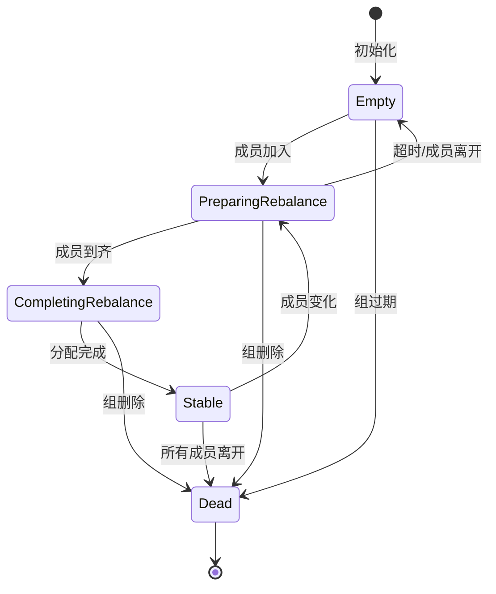

# 06. Group 状态机

## 6.1 状态机概述

### 为什么需要状态机

```scala
/**
 * Group 状态机的作用:
 *
 * 1. 明确状态定义
 *    - 每个状态有明确的含义
 *    - 清晰的转换规则
 *
 * 2. 保证一致性
 *    - 防止非法状态转换
 *    - 确保操作的正确性
 *
 * 3. 简化逻辑
 *    - 复杂的协调过程分解
 *    - 每个状态处理特定逻辑
 *
 * 4. 便于调试
 *    - 清晰的状态转换路径
 *    - 易于定位问题
 * /
```

### 状态定义

```scala
/**
 * Group 状态定义
 * /
sealed trait GroupState {
    def name: String
    def validPreviousStates: Set[GroupState]
}

/**
 * 1. Empty (空)
 * - 组内没有成员
 * - 元数据已保留
 * - 可以加入新成员
 * /
case object Empty extends GroupState {
    val name = "Empty"
    val validPreviousStates: Set[GroupState] = Set(PreparingRebalance, Dead)
}

/**
 * 2. PreparingRebalance (准备重平衡)
 * - 正在等待成员加入
 * - 收集成员信息
 * - 选择分配策略
 * /
case object PreparingRebalance extends GroupState {
    val name = "PreparingRebalance"
    val validPreviousStates: Set[GroupState] = Set(Empty, Stable, CompletingRebalance)
}

/**
 * 3. CompletingRebalance (完成重平衡)
 * - Leader 执行分配
 * - 等待分配方案
 * - 同步分配结果
 * /
case object CompletingRebalance extends GroupState {
    val name = "CompletingRebalance"
    val validPreviousStates: Set[GroupState] = Set(PreparingRebalance)
}

/**
 * 4. Stable (稳定)
 * - 组稳定运行
 * - 消费者正常消费
 * - 接收心跳和 Offset 提交
 * /
case object Stable extends GroupState {
    val name = "Stable"
    val validPreviousStates: Set[GroupState] = Set(CompletingRebalance)
}

/**
 * 5. Dead (已死亡)
 * - 组已被删除
 * - 元数据已清除
 * - 不可恢复
 * /
case object Dead extends GroupState {
    val name = "Dead"
    val validPreviousStates: Set[GroupState] = Set(Empty, PreparingRebalance, Stable, CompletingRebalance)
}
```

## 6.2 状态转换图

### 完整状态转换



### 转换条件详解

```scala
/**
 * 状态转换条件表
 *
 * 当前状态 -> 事件 -> 新状态
 *
 * Empty -> 成员加入 -> PreparingRebalance
 * - 第一个成员加入
 * - 开始 Rebalance
 *
 * PreparingRebalance -> 成员到齐 -> CompletingRebalance
 * - 所有成员已发送 JoinGroup
 * - 超时后使用当前成员
 *
 * PreparingRebalance -> 成员全部离开 -> Empty
 * - 所有成员离开
 * - 超时无新成员加入
 *
 * CompletingRebalance -> Leader 提交方案 -> Stable
 * - Leader 发送 SyncGroup
 * - 分配方案已应用
 *
 * Stable -> 成员变化 -> PreparingRebalance
 * - 新成员加入
 * - 成员离开
 * - 成员超时
 *
 * Stable -> 所有成员离开 -> Dead
 * - 组内无成员
 * - Offset 已过期
 *
 * 任意状态 -> 删除组 -> Dead
 * - 手动删除
 * - 系统清理
 * /
```

## 6.3 状态转换实现

### 状态转换方法

```scala
/**
 * Group 状态转换实现
 * /
class GroupMetadata(
    var groupId: String,
    var generationId: Int = 0,
    var protocolType: Option[String] = None,
    var protocol: Option[String] = None,
    var leaderId: Option[String] = None,
    private var state: GroupState = Empty
) extends Logging {

    // 状态转换锁
    private val lock = new ReentrantLock()

    /**
     * 状态转换
     * /
    def transitionTo(targetState: GroupState): Unit = {
        inLock {
            // 1. 验证转换合法性
            if (!canTransitionTo(targetState)) {
                throw new IllegalStateException(
                    s"Cannot transition from $state to $targetState"
                )
            }

            // 2. 记录转换
            val previousState = state
            info(s"Group ${groupId} transitioned from $previousState to $targetState")

            // 3. 执行转换
            doTransitionTo(targetState, previousState)
        }
    }

    /**
     * 检查是否可以转换到目标状态
     * /
    def canTransitionTo(targetState: GroupState): Boolean = {
        targetState.validPreviousStates.contains(state)
    }

    /**
     * 执行状态转换
     * /
    private def doTransitionTo(
        targetState: GroupState,
        previousState: GroupState
    ): Unit = {
        state match {
            case Empty =>
                // 准备离开 Empty 状态
                onExitEmpty(targetState)

            case PreparingRebalance =>
                // 准备离开 PreparingRebalance 状态
                onExitPreparingRebalance(targetState)

            case CompletingRebalance =>
                // 准备离开 CompletingRebalance 状态
                onExitCompletingRebalance(targetState)

            case Stable =>
                // 准备离开 Stable 状态
                onExitStable(targetState)

            case Dead =>
                // Dead 状态不能转换
                throw new IllegalStateException("Cannot transition from Dead state")
        }

        // 更新状态
        state = targetState

        // 进入新状态
        targetState match {
            case Empty => onEnterEmpty(previousState)
            case PreparingRebalance => onEnterPreparingRebalance(previousState)
            case CompletingRebalance => onEnterCompletingRebalance(previousState)
            case Stable => onEnterStable(previousState)
            case Dead => onEnterDead(previousState)
        }
    }

    /**
     * 检查是否在特定状态
     * /
    def is(targetState: GroupState): Boolean = {
        inLock {
            state == targetState
        }
    }

    /**
     * 获取当前状态
     * /
    def currentState: GroupState = {
        inLock {
            state
        }
    }

    /**
     * 在锁中执行
     * /
    private def inLock[T](fn: => T): T = {
        lock.lock()
        try {
            fn
        } finally {
            lock.unlock()
        }
    }
}
```

### Empty 状态处理

```scala
/**
 * Empty 状态处理
 * /

/**
 * 进入 Empty 状态
 * /
private def onEnterEmpty(previousState: GroupState): Unit = {
    previousState match {
        case PreparingRebalance =>
            // Rebalance 超时，没有成员加入
            info(s"Group $groupId rebalance timed out, returning to Empty")

        case Dead =>
            // 不应该从 Dead 转换到 Empty
            throw new IllegalStateException("Cannot transition from Dead to Empty")

        case _ =>
            // 其他情况正常
    }

    // 1. 清除成员信息
    members.clear()

    // 2. 重置代数
    generationId = 0

    // 3. 清除分配方案
    protocol = None
    leaderId = None

    // 4. 保留 Offset 数据
    // Offset 数据不受影响
}

/**
 * 退出 Empty 状态
 * /
private def onExitEmpty(targetState: GroupState): Unit = {
    targetState match {
        case PreparingRebalance =>
            // 有成员加入，开始 Rebalance
            generationId = 1

        case Dead =>
            // 组被删除
            cleanup()

        case _ =>
            throw new IllegalStateException(
                s"Invalid transition from Empty to $targetState"
            )
    }
}
```

### PreparingRebalance 状态处理

```scala
/**
 * PreparingRebalance 状态处理
 * /

/**
 * 进入 PreparingRebalance 状态
 * /
private def onEnterPreparingRebalance(previousState: GroupState): Unit = {
    // 1. 增加代数
    generationId += 1

    // 2. 清除旧的分配方案
    protocol = None
    leaderId = None
    members.values.foreach { member =>
        member.assignment = Array.empty
        member.awaitingJoin = true
    }

    // 3. 记录开始时间
    lastRebalanceTimeMs = time.milliseconds()

    // 4. 启动超时检查
    scheduleRebalanceTimeout()
}

/**
 * 退出 PreparingRebalance 状态
 * /
private def onExitPreparingRebalance(targetState: GroupState): Unit = {
    targetState match {
        case Empty =>
            // 成员全部离开，返回 Empty
            members.clear()

        case CompletingRebalance =>
            // 成员已到齐，进入下一阶段
            selectLeader()
            selectPartitionAssignor()

        case Dead =>
            // 组被删除
            cleanup()

        case _ =>
            throw new IllegalStateException(
                s"Invalid transition from PreparingRebalance to $targetState"
            )
    }
}
```

### CompletingRebalance 状态处理

```scala
/**
 * CompletingRebalance 状态处理
 * /

/**
 * 进入 CompletingRebalance 状态
 * /
private def onEnterCompletingRebalance(previousState: GroupState): Unit = {
    // 1. 选择分配策略
    protocol = Some(determineProtocol)

    // 2. 所有成员等待 SyncGroup
    members.values.foreach { member =>
        member.awaitingJoin = false
        member.awaitingSync = true
    }

    // 3. 通知 Leader 开始分配
    val leader = members(leaderId.get)
    leader.isLeader = true
}

/**
 * 退出 CompletingRebalance 状态
 * /
private def onExitCompletingRebalance(targetState: GroupState): Unit = {
    targetState match {
        case Stable =>
            // 分配完成，进入稳定状态
            members.values.foreach { member =>
                member.awaitingSync = false
            }

        case PreparingRebalance =>
            // 又有成员变化，重新开始 Rebalance
            // 可能是成员离开或新的成员加入

        case Dead =>
            // 组被删除
            cleanup()

        case _ =>
            throw new IllegalStateException(
                s"Invalid transition from CompletingRebalance to $targetState"
            )
    }
}
```

### Stable 状态处理

```scala
/**
 * Stable 状态处理
 * /

/**
 * 进入 Stable 状态
 * /
private def onEnterStable(previousState: GroupState): Unit = {
    // 1. 应用分配方案
    members.values.foreach { member =>
        if (member.assignment.nonEmpty) {
            // 反序列化分配结果
            val assignedPartitions = deserializeAssignment(member.assignment)
            member.assignedPartitions = assignedPartitions
        }
    }

    // 2. 记录状态
    lastStableTimestamp = time.milliseconds()

    // 3. 开始接收心跳和 Offset 提交
    // 正常运行状态
}

/**
 * 退出 Stable 状态
 * /
private def onExitStable(targetState: GroupState): Unit = {
    targetState match {
        case PreparingRebalance =>
            // 成员变化，开始新的 Rebalance
            info(s"Group $groupId is preparing for rebalance")

        case Dead =>
            // 组被删除或所有成员离开
            cleanup()

        case _ =>
            throw new IllegalStateException(
                s"Invalid transition from Stable to $targetState"
            )
    }
}
```

### Dead 状态处理

```scala
/**
 * Dead 状态处理
 * /

/**
 * 进入 Dead 状态
 * /
private def onEnterDead(previousState: GroupState): Unit = {
    // 1. 清除所有数据
    cleanup()

    // 2. 记录日志
    info(s"Group $groupId transitioned to Dead state from $previousState")
}

/**
 * 清理组数据
 * /
private def cleanup(): Unit = {
    // 1. 清除成员
    members.clear()

    // 2. 清除元数据
    protocol = None
    leaderId = None

    // 3. 不清除 Offset (由 OffsetManager 管理)

    // 4. 从缓存移除
    groupMetadataCache.remove(groupId)
}
```

## 6.4 状态转换触发器

### JoinGroup 触发

```scala
/**
 * JoinGroup 触发的状态转换
 * /
def handleJoinGroup(
    group: GroupMetadata,
    memberId: String,
    metadata: MemberMetadata
): JoinGroupResponse = {
    group.inLock {
        group.state match {
            case Empty =>
                // 第一个成员加入
                addMember(group, memberId, metadata)
                group.transitionTo(PreparingRebalance)
                prepareJoinResponse(group, memberId)

            case PreparingRebalance =>
                // 已在 Rebalance，添加成员
                addOrUpdateMember(group, memberId, metadata)
                tryCompleteRebalance(group)
                prepareJoinResponse(group, memberId)

            case Stable | CompletingRebalance =>
                // 需要新的 Rebalance
                prepareRebalance(group)
                addOrUpdateMember(group, memberId, metadata)
                prepareJoinResponse(group, memberId)

            case Dead =>
                // 组已死亡
                JoinGroupResponse(
                    errorCode = Errors.GROUP_ID_NOT_FOUND.code,
                    generationId = -1,
                    memberId = "",
                    // ...
                )
        }
    }
}
```

### Heartbeat 触发

```scala
/**
 * Heartbeat 触发的状态转换
 * /
def handleHeartbeat(
    group: GroupMetadata,
    memberId: String,
    generationId: Int
): HeartbeatResponse = {
    group.inLock {
        group.state match {
            case Stable =>
                // 正常心跳
                if (validateHeartbeat(group, memberId, generationId)) {
                    updateMemberHeartbeat(group, memberId)
                    HeartbeatResponse(Errors.NONE.code)
                } else {
                    HeartbeatResponse(Errors.ILLEGAL_GENERATION.code)
                }

            case PreparingRebalance | CompletingRebalance =>
                // Rebalance 中的心跳
                if (validateHeartbeat(group, memberId, generationId)) {
                    updateMemberHeartbeat(group, memberId)
                    HeartbeatResponse(Errors.NONE.code)
                } else {
                    HeartbeatResponse(Errors.ILLEGAL_GENERATION.code)
                }

            case Dead =>
                // 组已死亡
                HeartbeatResponse(Errors.GROUP_ID_NOT_FOUND.code)

            case Empty =>
                // 组为空，不应该有心跳
                HeartbeatResponse(Errors.UNKNOWN_MEMBER_ID.code)
        }
    }
}
```

### LeaveGroup 触发

```scala
/**
 * LeaveGroup 触发的状态转换
 * /
def handleLeaveGroup(
    group: GroupMetadata,
    memberId: String
): LeaveGroupResponse = {
    group.inLock {
        group.state match {
            case Stable | PreparingRebalance | CompletingRebalance =>
                // 移除成员
                if (group.has(memberId)) {
                    removeMember(group, memberId)

                    // 检查是否还有成员
                    if (group.members.isEmpty) {
                        // 没有成员了
                        group.transitionTo(Empty)
                    } else {
                        // 还有成员，需要 Rebalance
                        group.transitionTo(PreparingRebalance)
                    }

                    LeaveGroupResponse(Errors.NONE.code)
                } else {
                    LeaveGroupResponse(Errors.UNKNOWN_MEMBER_ID.code)
                }

            case Empty =>
                // 组为空，成员不存在
                LeaveGroupResponse(Errors.UNKNOWN_MEMBER_ID.code)

            case Dead =>
                // 组已死亡
                LeaveGroupResponse(Errors.GROUP_ID_NOT_FOUND.code)
        }
    }
}
```

### 成员超时触发

```scala
/**
 * 成员超时触发的状态转换
 * /
def onMemberExpire(
    group: GroupMetadata,
    memberId: String
): Unit = {
    group.inLock {
        group.state match {
            case Stable =>
                // 稳定状态下的成员超时
                removeMember(group, memberId)

                if (group.members.isEmpty) {
                    // 所有成员都超时
                    group.transitionTo(Empty)
                } else {
                    // 还有成员，需要 Rebalance
                    group.transitionTo(PreparingRebalance)
                }

            case PreparingRebalance | CompletingRebalance =>
                // Rebalance 中的成员超时
                removeMember(group, memberId)

                if (group.members.isEmpty) {
                    // 所有成员都超时
                    group.transitionTo(Empty)
                }
                // 否则继续当前 Rebalance

            case Empty | Dead =>
                // 无需处理
        }
    }
}
```

## 6.5 状态持久化

### 状态快照

```scala
/**
 * 保存状态快照到 __consumer_offsets
 *
 * 在以下情况保存快照:
 * 1. 状态转换
 * 2. 成员变化
 * 3. 定期备份
 * /
def saveGroupSnapshot(group: GroupMetadata): Unit = {
    val snapshot = GroupMetadataSnapshot(
        groupId = group.groupId,
        generationId = group.generationId,
        protocolType = group.protocolType,
        protocol = group.protocol,
        leaderId = group.leaderId,
        state = group.currentState.name,
        members = group.members.map { case (id, member) =>
            id -> MemberSnapshot(
                memberId = member.memberId,
                groupInstanceId = member.groupInstanceId,
                clientId = member.clientId,
                clientHost = member.clientHost,
                assignment = member.assignment
            )
        },
        timestamp = time.milliseconds()
    )

    // 序列化
    val key = buildGroupKey(group.groupId)
    val value = serializeGroupSnapshot(snapshot)

    // 写入 __consumer_offsets
    appendGroupMetadata(key, value)
}
```

### 状态恢复

```scala
/**
 * 从 __consumer_offsets 恢复状态
 *
 * Coordinator 启动时执行
 * /
def loadGroupState(groupId: String): GroupMetadata = {
    // 1. 读取快照
    val key = buildGroupKey(groupId)
    val record = readGroupMetadata(key)

    record match {
        case Some(snapshot) =>
            // 2. 反序列化
            val groupMetadata = deserializeGroupSnapshot(snapshot)

            // 3. 恢复状态
            val state = parseState(snapshot.state)
            val group = new GroupMetadata(
                groupId = groupId,
                generationId = snapshot.generationId,
                protocolType = snapshot.protocolType,
                protocol = snapshot.protocol,
                leaderId = snapshot.leaderId,
                state = state
            )

            // 4. 恢复成员
            snapshot.members.foreach { case (id, memberSnapshot) =>
                val member = new MemberMetadata(
                    memberId = memberSnapshot.memberId,
                    groupInstanceId = memberSnapshot.groupInstanceId,
                    clientId = memberSnapshot.clientId,
                    clientHost = memberSnapshot.clientHost,
                    // ... 其他字段
                )
                member.assignment = memberSnapshot.assignment
                group.add(member)
            }

            info(s"Loaded group $groupId in state $state")
            group

        case None =>
            // 组不存在，创建新组
            new GroupMetadata(groupId, state = Empty)
    }
}
```

## 6.6 状态监控

### 状态监控指标

```scala
/**
 * 状态监控指标
 * /
case class GroupStateMetrics(
    groupId: String,
    currentState: String,
    generationId: Int,
    memberCount: Int,
    lastTransitionTime: Long,
    timeInCurrentState: Long,
    rebalanceCount: Long,
    lastRebalanceDuration: Long
)

/**
 * 收集状态指标
 * /
def collectStateMetrics(group: GroupMetadata): GroupStateMetrics = {
    GroupStateMetrics(
        groupId = group.groupId,
        currentState = group.currentState.name,
        generationId = group.generationId,
        memberCount = group.members.size,
        lastTransitionTime = group.lastStateChangeTimestamp,
        timeInCurrentState = time.milliseconds() - group.lastStateChangeTimestamp,
        rebalanceCount = group.totalRebalanceCount,
        lastRebalanceDuration = group.lastRebalanceDurationMs
    )
}
```

### 状态异常检测

```scala
/**
 * 检测状态异常
 * /
def detectStateAnomalies(group: GroupMetadata): List[String] = {
    val anomalies = mutable.ListBuffer[String]()

    // 1. 检查长时间 Rebalance
    if (group.is(PreparingRebalance) || group.is(CompletingRebalance)) {
        val rebalanceTime = time.milliseconds() - group.lastRebalanceTimeMs
        if (rebalanceTime > 5 * 60 * 1000) {  // 5 分钟
            anomalies += s"Group ${group.groupId} has been rebalancing for ${rebalanceTime / 1000}s"
        }
    }

    // 2. 检查空组
    if (group.is(Empty)) {
        val emptyTime = time.milliseconds() - group.lastStateChangeTimestamp
        if (emptyTime > 7 * 24 * 60 * 60 * 1000) {  // 7 天
            anomalies += s"Group ${group.groupId} has been empty for ${emptyTime / (24 * 60 * 60 * 1000)} days"
        }
    }

    // 3. 检查频繁 Rebalance
    val recentRebalances = group.rebalanceHistory.take(10)
    if (recentRebalances.size >= 10) {
        val avgInterval = recentRebalances.sliding(2).map { pair =>
            pair(1).timestamp - pair(0).timestamp
        }.sum / recentRebalances.size

        if (avgInterval < 60000) {  // 1 分钟
            anomalies += s"Group ${group.groupId} is rebalancing frequently (avg interval: ${avgInterval / 1000}s)"
        }
    }

    anomalies.toList
}
```

## 6.7 状态转换问题排查

### 常见问题

```scala
/**
 * 问题 1: 陷入 PreparingRebalance
 *
 * 现象: 组长时间停留在 PreparingRebalance
 *
 * 原因:
 * 1. 有成员未加入
 * 2. rebalance.timeout.ms 太大
 * 3. 网络问题
 *
 * 排查:
 * 1. 检查成员日志
 * 2. 检查网络连接
 * 3. 查看成员列表
 * /

/**
 * 问题 2: 无法转换到 Stable
 *
 * 现象: 组停留在 CompletingRebalance
 *
 * 原因:
 * 1. Leader 未发送 SyncGroup
 * 2. 分配方案有问题
 * 3. 成员配置不一致
 *
 * 排查:
 * 1. 检查 Leader 日志
 * 2. 验证分配策略
 * 3. 检查成员配置
 * /

/**
 * 问题 3: 频繁状态转换
 *
 * 现象: 组在 Stable 和 PreparingRebalance 间频繁切换
 *
 * 原因:
 * 1. session.timeout 太小
 * 2. 处理时间过长
 * 3. 网络不稳定
 *
 * 排查:
 * 1. 检查超时配置
 * 2. 分析处理时间
 * 3. 检查网络稳定性
 * /
```

## 6.8 小结

Group 状态机是 GroupCoordinator 的核心控制机制：

1. **五个状态**：Empty、PreparingRebalance、CompletingRebalance、Stable、Dead
2. **严格转换**：每个状态只能转换到特定状态
3. **触发机制**：JoinGroup、Heartbeat、LeaveGroup、超时
4. **持久化**：状态快照保存到 __consumer_offsets
5. **监控诊断**：通过状态指标排查问题

理解状态机对于分析和解决消费者组问题至关重要。

## 参考文档

- [02-group-management.md](./02-group-management.md) - Consumer Group 管理
- [04-rebalance-process.md](./04-rebalance-process.md) - 重平衡流程
- [10-coordinator-troubleshooting.md](./10-coordinator-troubleshooting.md) - 故障排查
