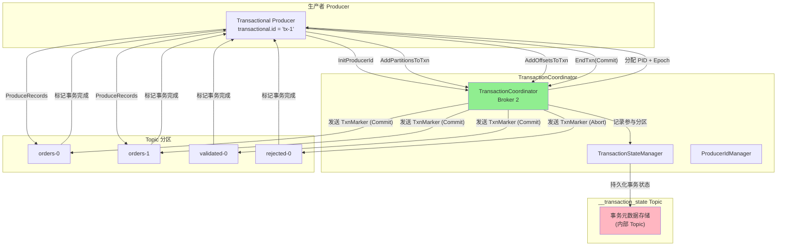
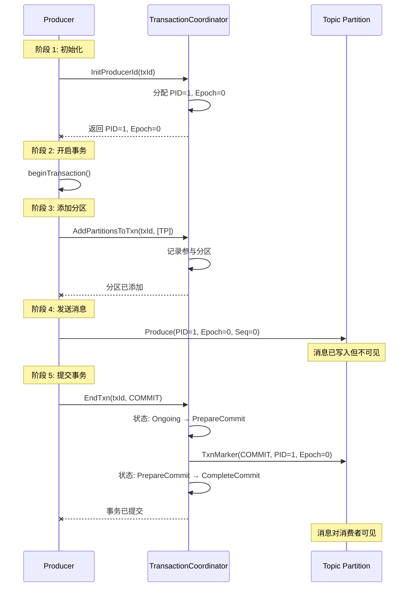

# 01. 事务概述

## 本章导读

本章介绍 Kafka 事务的基础概念，包括为什么需要事务、事务的应用场景、核心概念以及整体架构。通过本章学习，你将对 Kafka 事务有一个全面的认识。

---

## 1. 为什么需要事务？

### 1.1 消息传递的语义问题

在分布式消息系统中，消息传递面临三个核心问题：

```scala
/**
 * 消息传递的三个语义问题:
 *
 * 1. At-Most-Once (最多一次)
 *    - 消息可能丢失
 *    - 但不会重复
 *    - 适用于可容忍丢失的场景
 *
 * 2. At-Least-Once (至少一次)
 *    - 消息不会丢失
 *    - 但可能重复
 *    - 需要消费者去重
 *
 * 3. Exactly-Once (精确一次)
 *    - 消息不丢失
 *    - 消息不重复
 *    - 理想的语义
 */
```

### 1.2 Kafka 事务解决的问题

```scala
/**
 * Kafka 事务机制解决的核心问题：
 *
 * 1. 生产者幂等性
 *    - 网络重试导致消息重复
 *    - Broker 端自动去重
 *    - 保证每条消息只被处理一次
 *
 * 2. 跨分区原子性
 *    - 一个事务可能写入多个分区
 *    - 要么全部成功，要么全部失败
 *    - 不会出现部分成功的情况
 *
 * 3. 消费-生产 Exactly-Once
 *    - 消费者读取消息处理后，结果写入另一个 Topic
 *    - 保证消费和生产的原子性
 *    - 实现"消费一次，处理一次，生产一次"
 */
```

### 1.3 实际应用场景

#### 场景 1：订单处理系统

```scala
/**
 * 订单处理示例
 *
 * 需求：
 * 1. 每条订单消息只处理一次
 * 2. 订单验证后，要么写入 validated-orders，要么写入 rejected-orders
 * 3. 不能同时写入两个 Topic
 * 4. 不能丢失任何订单
 *
 * 输入：orders Topic
 * 输出：validated-orders、rejected-orders Topics
 */

// 没有事务的情况：
// 1. 消费 orders 消息
// 2. 验证订单
// 3. 写入 validated-orders
// 4. 提交消费 offset
//
// 问题：步骤 3 和 4 之间可能失败，导致：
// - 消息已写入但 offset 未提交，重新消费后重复写入
// - offset 已提交但消息未写入，订单丢失

// 使用事务的情况：
// 1. 开启事务
// 2. 消费 orders 消息
// 3. 验证订单
// 4. 写入 validated-orders（在事务中）
// 5. 提交消费 offset（在事务中）
// 6. 提交事务
//
// 保证：步骤 4 和 5 要么都成功，要么都失败
```

#### 场景 2：流处理 ETL

```scala
/**
 * ETL 流处理示例
 *
 * 需求：
 * 1. 从源 Topic 读取数据
 * 2. 转换数据
 * 3. 写入目标 Topic
 * 4. 保证每条数据只处理一次
 *
 * 输入：raw-events Topic
 * 输出：cleaned-events Topic
 */

// Kafka Streams 实现：
// 1. 自动使用事务
// 2. 消费和生产在同一事务中
// 3. 自动保证 Exactly-Once
```

#### 场景 3：数据库同步

```scala
/**
 * 数据库同步示例
 *
 * 需求：
 * 1. 从数据库 CDC Topic 读取变更
 * 2. 更新搜索索引
 * 3. 更新缓存
 * 4. 保证一致性
 *
 * 输入：mysql-cdc Topic
 * 输出：search-index、cache Topics
 */

// 使用事务：
// 1. 在事务中写入 search-index
// 2. 在事务中写入 cache
// 3. 提交事务
// 4. 保证两个 Topic 同时更新或都不更新
```

---

## 2. 事务架构

### 2.1 整体架构图



### 2.2 组件说明

| 组件 | 职责 |
|------|------|
| **Transactional Producer** | 事务性生产者，使用 transactional.id 标识 |
| **TransactionCoordinator** | 事务协调器，管理事务生命周期 |
| **TransactionStateManager** | 管理事务元数据和状态 |
| **ProducerIdManager** | 分配和管理 Producer ID |
| **__transaction_state** | 内部 Topic，存储事务元数据 |
| **Transaction Marker** | 特殊消息，标记事务结果 |

---

## 3. 核心概念

### 3.1 Transactional ID（事务 ID）

```scala
/**
 * Transactional ID 特性：
 *
 * 1. 用户提供的唯一标识符
 *    - 由用户配置指定
 *    - 例如："order-processor-1"
 *
 * 2. 持久化关联
 *    - 与 Producer ID 绑定
 *    - 即使生产者重启，ID 不变
 *
 * 3. 唯一性保证
 *    - 同一时刻只有一个生产者活跃
 *    - 通过 Producer Epoch 实现
 *
 * 4. 跨会话事务
 *    - 支持跨会话的事务恢复
 *    - 保证未完成事务的完成或回滚
 */

// 配置示例
Properties props = new Properties();
props.put("transactional.id", "order-processor-1");
KafkaProducer<String, String> producer = new KafkaProducer<>(props);

// 初始化事务
producer.initTransactions();
```

### 3.2 Producer ID（PID）

```scala
/**
 * Producer ID 特性：
 *
 * 1. 系统分配的唯一标识符
 *    - 由 ProducerIdManager 分配
 *    - 长整型，单调递增
 *
 * 2. 与 Transactional ID 关联
 *    - 一个 Transactional ID 对应一个 PID
 *    - 关系持久化到 __transaction_state
 *
 * 3. 用于幂等性检查
 *    - 服务端识别生产者
 *    - 检测重复消息
 */

object ProducerId {
    /**
     * 未分配 PID
     */
    val NO_PRODUCER_ID: Long = -1

    /**
     * 生产者 ID 管理
     */
    private val producerIdCache = new ConcurrentHashMap[String, Long]()

    def getProducerId(transactionalId: String): Long = {
        producerIdCache.computeIfAbsent(transactionalId, _ => generateProducerId())
    }

    private def generateProducerId(): Long = {
        // 生成唯一的 PID
        // 持久化到 __transaction_state
        // 确保全局唯一
    }
}
```

### 3.3 Producer Epoch

```scala
/**
 * Producer Epoch 特性：
 *
 * 1. 版本号机制
 *    - 短整型（0-65535）
 *    - 每次 PID 冲突时递增
 *
 * 2. 隔离僵尸生产者
 *    - 相同 PID，不同 Epoch
 *    - 旧 Epoch 的请求被拒绝
 *
 * 3. 故障恢复
 *    - 新生产者递增 Epoch
 *    - 旧生产者自动失效
 */

// Epoch 递增场景
object ProducerEpoch {
    /**
     * 初始 Epoch
     */
    val INITIAL_EPOCH: Short = 0

    /**
     * 检测并递增 Epoch
     */
    def fenceProducer(currentEpoch: Short): Short = {
        if (currentEpoch == Short.MaxValue) {
            // Epoch 耗尽，重新分配 PID
            throw new EpochExhaustedException()
        }
        (currentEpoch + 1).toShort
    }
}
```

### 3.4 Sequence Number

```scala
/**
 * Sequence Number 特性：
 *
 * 1. 每个 Partition 独立
 *    - 相同 PID，不同 Partition 有不同序列号
 *    - 从 0 开始，严格递增
 *
 * 2. 幂等性保证
 *    - PID + Epoch + Sequence 唯一标识消息
 *    - 服务端检测重复序列号
 *
 * 3. 重试机制
 *    - 发送失败重试时，使用相同序列号
 *    - 服务端自动去重
 */

case class ProducerIdAndEpoch(
    producerId: Long,
    producerEpoch: Short
)

case class SequenceNumber(
    producerId: Long,
    producerEpoch: Short,
    sequence: Int
)
```

### 3.5 Transaction Coordinator

```scala
/**
 * Transaction Coordinator 特性：
 *
 * 1. 协调者角色
 *    - 管理 Transactional ID 对应的事务
 *    - 分配和管理 PID/Epoch
 *
 * 2. 位置计算
 *    - 基于 Transactional ID Hash
 *    - 确保同一事务在同一 Coordinator
 *
 * 3. 故障转移
 *    - Coordinator 挂掉后重新选举
 *    - 从 __transaction_state 恢复状态
 */

// Coordinator 选择算法
object TransactionCoordinator {
    /**
     * 计算 Transactional ID 对应的 Broker
     */
    def coordinatorBrokerId(
        transactionalId: String,
        brokers: Seq[Broker]
    ): Int = {
        /**
         * 1. 计算 Transactional ID 的 Hash
         */
        val hash = Math.abs(transactionalId.hashCode)

        /**
         * 2. 对 Broker 数量取模
         */
        val brokerIndex = hash % brokers.size

        /**
         * 3. 返回 Broker ID
         */
        brokers(brokerIndex).id
    }
}
```

### 3.6 Transaction Marker

```scala
/**
 * Transaction Marker 特性：
 *
 * 1. 特殊的控制记录
 *    - 不对消费者可见
 *    - 标记事务结果
 *
 * 2. 类型
 *    - COMMIT：标记事务提交
 *    - ABORT：标记事务回滚
 *
 * 3. 作用
 *    - 通知各分区事务结果
 *    - 决定消息可见性
 *    - 支持事务恢复
 */

case class EndTxnMarker(
    producerId: Long,
    producerEpoch: Short,
    result: TransactionResult  // COMMIT 或 ABORT
)

object TransactionResult extends Enumeration {
    val COMMIT: TransactionResult = new TransactionResult(0, "COMMIT")
    val ABORT: TransactionResult = new TransactionResult(1, "ABORT")
}
```

---

## 4. 事务工作流程

### 4.1 完整的事务流程



### 4.2 事务状态流转

```scala
/**
 * 事务状态流转：
 *
 * Empty → Ongoing → PrepareCommit/Abort → CompleteCommit/Abort → Empty
 *
 * 状态说明：
 * - Empty：空闲状态，没有活跃事务
 * - Ongoing：事务进行中，正在写入消息
 * - PrepareCommit/Abort：准备提交/回滚，发送 Marker
 * - CompleteCommit/Abort：事务完成
 */

// 状态转换示例
val stateTransitions = Seq(
    "Empty → Ongoing",           // InitProducerId
    "Ongoing → PrepareCommit",   // EndTxn(COMMIT)
    "Ongoing → PrepareAbort",    // EndTxn(ABORT)
    "PrepareCommit → CompleteCommit",  // Marker 发送完成
    "PrepareAbort → CompleteAbort",    // Marker 发送完成
    "CompleteCommit → Empty",    // 清理完成
    "CompleteAbort → Empty"      // 清理完成
)
```

---

## 5. 事务 vs 幂等性

### 5.1 概念对比

| 特性 | 幂等性 | 事务 |
|------|--------|------|
| **配置参数** | `enable.idempotence=true` | `transactional.id=xxx` |
| **作用范围** | 单个 Partition | 多个 Partition |
| **保证语义** | Per-Partition 幂等 | 跨分区原子性 |
| **依赖组件** | Producer ID + Sequence | TransactionCoordinator |
| **使用场景** | 防止重复消息 | 端到端 Exactly-Once |

### 5.2 幂等性是事务的基础

```scala
/**
 * 幂等性与事务的关系：
 *
 * 1. 幂等性是事务的基础
 *    - 事务自动启用幂等性
 *    - 即使配置 enable.idempotence=false
 *
 * 2. 事务扩展了幂等性
 *    - 幂等性：单分区内不重复
 *    - 事务：跨分区原子性
 *
 * 3. 共同机制
 *    - 都使用 Producer ID
 *    - 都使用 Sequence Number
 *    - 都使用 Producer Epoch
 */
```

---

## 6. 事务的应用模式

### 6.1 生产者事务

```scala
/**
 * 纯生产者事务
 * - 只涉及消息生产
 * - 保证跨分区原子性
 */

val producer = new KafkaProducer[String, String](props)

// 初始化事务
producer.initTransactions()

try {
    // 开启事务
    producer.beginTransaction()

    // 发送消息到多个分区
    producer.send(new ProducerRecord("topic1", "key1", "value1"))
    producer.send(new ProducerRecord("topic2", "key2", "value2"))

    // 提交事务
    producer.commitTransaction()
} catch {
    case ex: Exception =>
        // 回滚事务
        producer.abortTransaction()
}
```

### 6.2 消费-生产事务

```scala
/**
 * 消费-生产事务
 * - 涉及消费和生产
 * - 实现 Exactly-Once 语义
 */

val consumer = new KafkaConsumer[String, String](props)
val producer = new KafkaProducer[String, String](props)

// 初始化
producer.initTransactions()

consumer.subscribe(Seq("input-topic").asJava)

try {
    while (true) {
        // 消费消息
        val records = consumer.poll(Duration.ofSeconds(1))

        // 开启事务
        producer.beginTransaction()

        // 处理并发送
        for (record <- records.asScala) {
            val result = process(record)
            producer.send(new ProducerRecord("output-topic", result))
        }

        // 提交消费 Offset 到事务
        val offsets = Map(
            new TopicPartition("input-topic", 0) ->
            new OffsetAndMetadata(consumer.position(new TopicPartition("input-topic", 0)))
        )
        producer.sendOffsetsToTransaction(offsets.asJava, consumer.groupMetadata())

        // 提交事务
        producer.commitTransaction()
    }
} catch {
    case ex: Exception =>
        producer.abortTransaction()
}
```

---

## 7. 性能考虑

### 7.1 事务的性能开销

```scala
/**
 * 事务的性能开销：
 *
 * 1. 额外的网络请求
 *    - InitProducerId
 *    - AddPartitionsToTxn
 *    - EndTxn
 *    - WriteTxnMarker
 *
 * 2. 状态持久化
 *    - __transaction_state 写入
 *    - 多副本复制
 *
 * 3. 锁竞争
 *    - TransactionCoordinator 锁
 *    - 分区锁
 *
 * 4. 延迟增加
 *    - 事务提交延迟
 *    - Marker 发送延迟
 */
```

### 7.2 性能优化建议

| 优化项 | 说明 |
|--------|------|
| **批量大小** | 增大批量，减少事务次数 |
| **事务超时** | 根据业务调整 `transaction.timeout.ms` |
| **并发度** | 增加 `max.in.flight.requests.per.connection` |
| **分区数** | 合理规划分区数，避免跨过多分区 |

---

## 8. 总结

### 8.1 核心要点

1. **事务解决的问题**
   - 生产者幂等性：防止消息重复
   - 跨分区原子性：要么全成功，要么全失败
   - 消费-生产 Exactly-Once：端到端精确一次

2. **核心概念**
   - Transactional ID：用户提供的唯一标识
   - Producer ID：系统分配的生产者 ID
   - Producer Epoch：版本号，隔离僵尸生产者
   - Sequence Number：序列号，保证幂等性
   - Transaction Coordinator：事务协调器
   - Transaction Marker：事务结果标记

3. **事务流程**
   - 初始化 → 添加分区 → 发送消息 → 提交/回滚

### 8.2 下一步学习

- **[02-transaction-coordinator.md](./02-transaction-coordinator.md)** - 深入了解 TransactionCoordinator 的实现
- **[03-transaction-protocol.md](./03-transaction-protocol.md)** - 学习事务协议的细节
- **[04-two-phase-commit.md](./04-two-phase-commit.md)** - 理解两阶段提交协议

---

**思考题**：
1. 如果事务提交过程中，Transaction Coordinator 挂掉了，会发生什么？
2. 为什么需要 Transaction Marker，而不是在提交时直接标记消息可见？
3. 事务和幂等性有什么区别？什么场景下应该使用事务？
