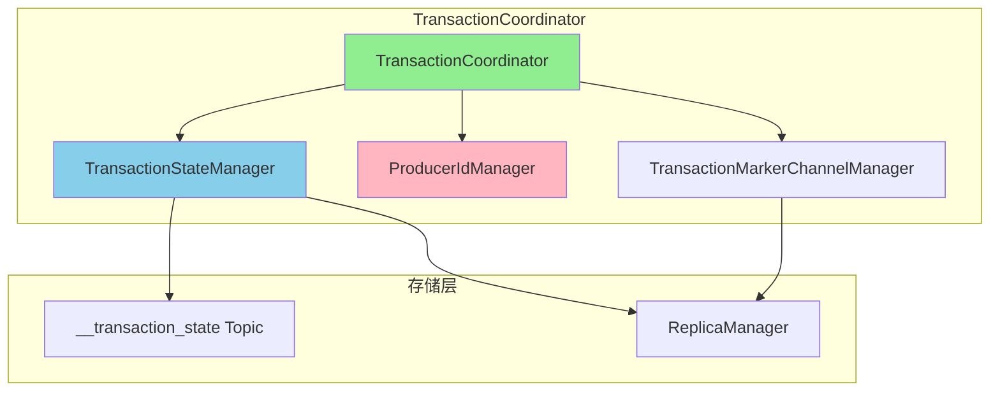
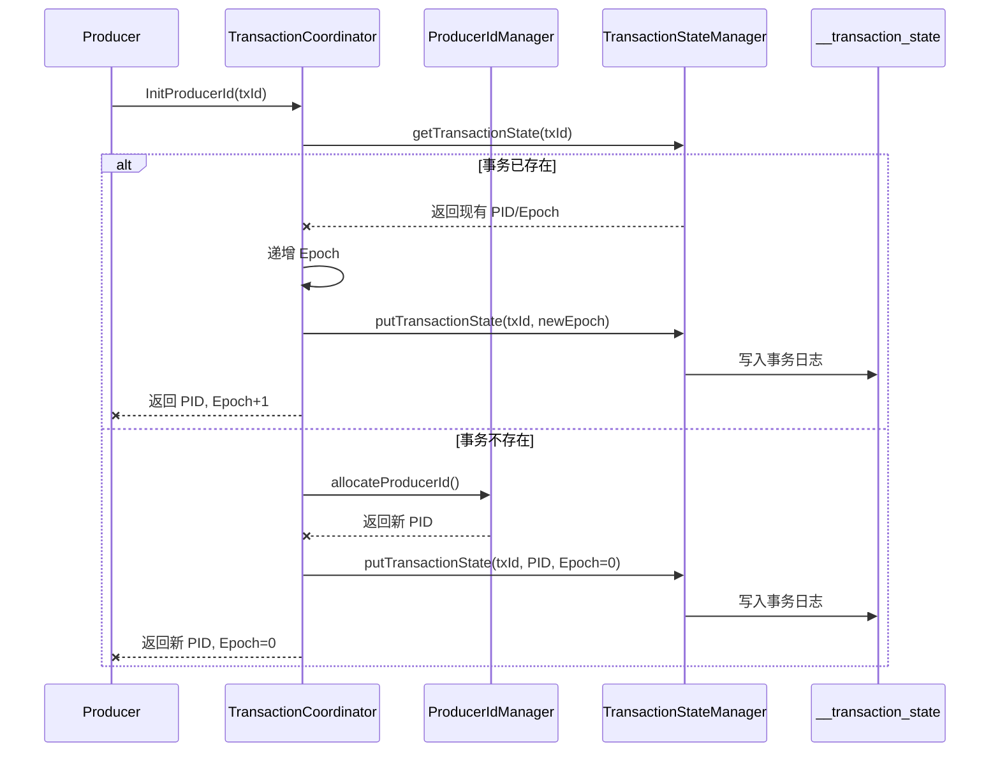
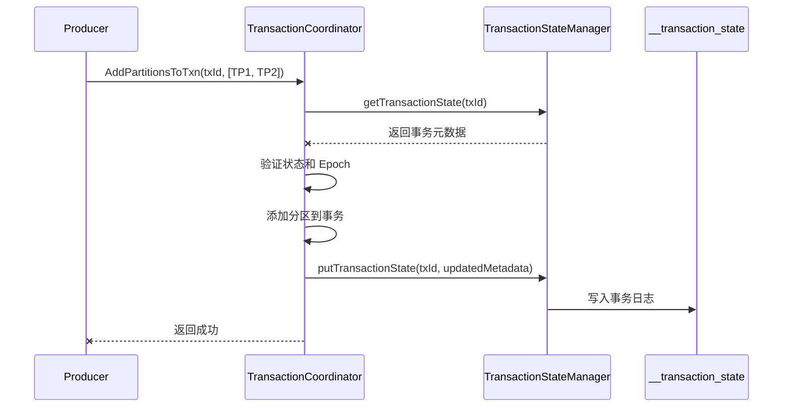
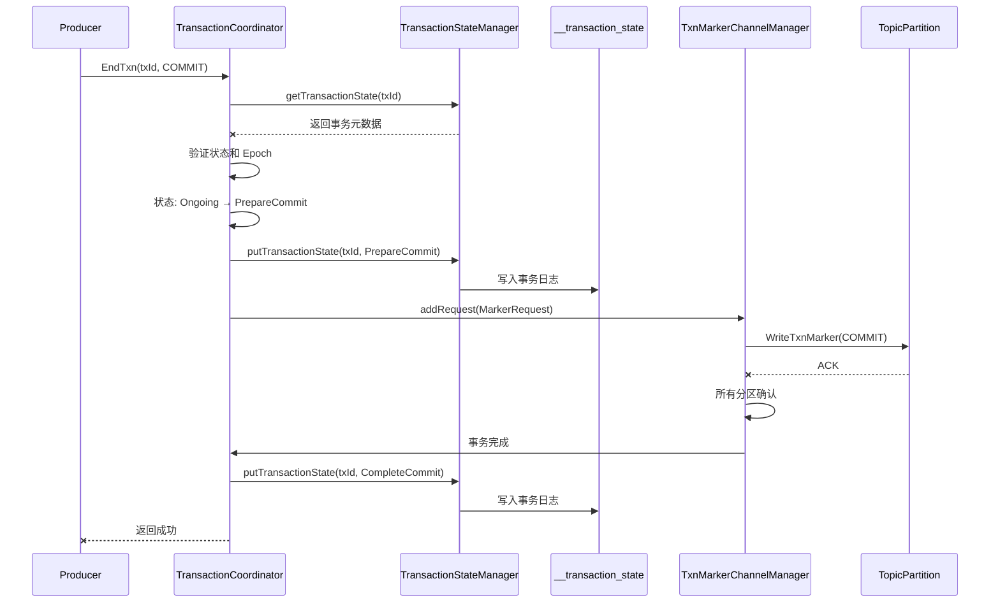

# 02. TransactionCoordinator - 事务协调器

## 本章导读

TransactionCoordinator 是 Kafka 实现事务支持的核心组件。本章将深入分析 TransactionCoordinator 的结构、职责、实现细节以及与其他组件的交互。

---

## 1. TransactionCoordinator 概述

### 1.1 职责

```scala
/**
 * TransactionCoordinator 的核心职责：
 *
 * 1. Producer ID 管理
 *    - 分配 Producer ID
 *    - 管理 Producer Epoch
 *    - 处理 PID 冲突
 *
 * 2. 事务状态管理
 *    - 维护事务状态机
 *    - 处理状态转换
 *    - 持久化事务状态
 *
 * 3. 事务协议处理
 *    - InitProducerId
 *    - AddPartitionsToTxn
 *    - AddOffsetsToTxn
 *    - EndTxn
 *
 * 4. Transaction Marker 发送
 *    - 协调 Marker 发送
 *    - 处理发送失败
 *    - 确保所有分区收到 Marker
 *
 * 5. 事务超时处理
 *    - 检测超时事务
 *    - 自动回滚超时事务
 *    - 清理过期事务
 */
```

### 1.2 组件关系



---

## 2. TransactionCoordinator 结构

### 2.1 核心类定义

```scala
/**
 * TransactionCoordinator 主类
 *
 * 主要组件:
 * 1. TransactionStateManager: 管理事务元数据
 * 2. ProducerIdManager: 分配 Producer ID
 * 3. TransactionMarkerChannelManager: 发送 Transaction Marker
 */

// kafka/coordinator/transaction/TransactionCoordinator.scala

class TransactionCoordinator(
    brokerId: Int,
    txnConfig: TransactionConfig,
    scheduler: Scheduler,
    replicaManager: ReplicaManager,
    metadataCache: MetadataCache,
    transactionManager: TransactionStateManager,
    time: Time,
    metrics: Metrics,
    createProducerIdManager: () => ProducerIdManager
) extends Logging {

    /**
     * Producer ID 管理器
     * - 分配唯一的 PID
     * - 持久化到 __transaction_state
     * - 保证全局唯一
     */
    val producerIdManager: ProducerIdManager = createProducerIdManager()

    /**
     * Transaction Marker 管理器
     * - 管理 Marker 发送队列
     * - 处理发送失败
     * - 重试机制
     */
    val txnMarkerChannelManager: TransactionMarkerChannelManager =
        new TransactionMarkerChannelManager(
            config,
            metrics,
            metadataCache,
            transactionManager,
            time,
            logContext
        )

    /**
     * 事务超时检测器
     * - 定期扫描超时事务
     * - 自动回滚超时事务
     */
    scheduler.schedule(
        "transaction-expiration",
        () => purgeTransactionalIds(),
        delay = txnConfig.transactionalIdExpirationMs,
        period = txnConfig.transactionalIdExpirationMs
    )
}
```

### 2.2 请求处理入口

```scala
/**
 * 事务请求处理
 *
 * 所有事务相关请求都通过 TransactionCoordinator 处理
 */

/**
 * 处理 InitProducerId 请求
 * - 获取或分配 Producer ID
 * - 递增 Producer Epoch
 * - 初始化事务状态
 */
def handleInitProducerId(
    transactionalId: String,
    transactionTimeoutMs: Int,
    expectedProducerIdAndEpoch: Option[ProducerIdAndEpoch],
    responseCallback: InitProducerIdCallback
): Unit = {
    // 实现细节见后续章节
}

/**
 * 处理 AddPartitionsToTxn 请求
 * - 记录事务涉及的分区
 * - 准备写入事务日志
 */
def handleAddPartitionsToTxn(
    transactionalId: String,
    producerId: Long,
    producerEpoch: Short,
    partitions: util.Map[TopicPartition, Errors],
    responseCallback: AddPartitionsCallback
): Unit = {
    // 实现细节见后续章节
}

/**
 * 处理 AddOffsetsToTxn 请求
 * - 添加消费 Offset 到事务
 * - 实现 consume-produce 事务
 */
def handleAddOffsetsToTxn(
    transactionalId: String,
    producerId: Long,
    producerEpoch: Short,
    groupId: String,
    offsetMetadata: util.Map[TopicPartition, OffsetAndMetadata],
    responseCallback: AddOffsetsCallback
): Unit = {
    // 实现细节见后续章节
}

/**
 * 处理 EndTxn 请求
 * - 提交或回滚事务
 * - 发送 Transaction Marker
 */
def handleEndTxn(
    transactionalId: String,
    producerId: Long,
    producerEpoch: Short,
    command: TransactionResult,
    responseCallback: EndTxnCallback
): Unit = {
    // 实现细节见后续章节
}
```

---

## 3. TransactionStateManager

### 3.1 职责

```scala
/**
 * TransactionStateManager 职责:
 *
 * 1. 管理事务元数据
 *    - 加载事务状态
 *    - 缓存事务状态
 *    - 查询事务状态
 *
 * 2. 状态转换
 *    - 验证状态转换的合法性
 *    - 更新事务状态
 *    - 写入事务日志
 *
 * 3. 事务清理
 *    - 清理超时事务
 *    - 清理过期事务 ID
 *    - 回收资源
 *
 * 4. 故障恢复
 *    - 加载 __transaction_state
 *    - 恢复事务状态
 *    - 补偿未完成事务
 */
```

### 3.2 核心实现

```scala
// kafka/coordinator/transaction/TransactionStateManager.scala

class TransactionStateManager(
    brokerId: Int,
    scheduler: Scheduler,
    replicaManager: ReplicaManager,
    metadataCache: MetadataCache,
    txnConfig: TransactionConfig,
    time: Time,
    metrics: Metrics
) extends Logging {

    /**
     * 事务元数据缓存
     * Key: Transactional ID
     * Value: TransactionMetadata
     */
    private val transactionMetadataCache = new TxnMetadataCache

    /**
     * 获取事务状态
     */
    def getTransactionState(transactionalId: String): Option[CoordinatorEpochAndTxnMetadata] = {
        transactionMetadataCache.get(transactionalId)
    }

    /**
     * 加载事务状态
     * - 从 __transaction_state Topic 加载
     * - 恢复事务元数据缓存
     * - 补偿未完成事务
     */
    def loadTransactionState(topicPartition: TopicPartition): Unit = {
        val partitionId = topicPartition.partition()

        log.info(s"加载事务状态: $topicPartition")

        /**
         * 1. 读取 __transaction_state 分区
         */
        val log = replicaManager.getLog(topicPartition)
        log match {
            case Some(log) =>
                /**
                 * 2. 遍历日志记录
                 */
                var recordsLoaded = 0
                for (batch <- log.log.batches.asScala) {
                    for (record <- batch.records.asScala) {
                        /**
                         * 3. 解析事务消息
                         */
                        val key = new TransactionLogKey(record.key)
                        val value = new TransactionLogValue(record.value)

                        key.transactionType match {
                            case TransactionLogKey.TransactionType.TRANSACTION_TYPE =>
                                val transactionalId = key.transactionalId

                                /**
                                 * 4. 恢复事务元数据
                                 */
                                val metadata = value match {
                                    case null => null
                                    case _ =>
                                        TransactionMetadata(
                                            value.producerId,
                                            value.producerEpoch,
                                            value.timeout,
                                            value.state,
                                            value.topicPartitions,
                                            value.lastUpdateTimestamp
                                        )
                                }

                                /**
                                 * 5. 更新缓存
                                 */
                                transactionMetadataCache.put(
                                    transactionalId,
                                    coordinatorEpoch,
                                    metadata
                                )

                                recordsLoaded += 1
                        }
                    }
                }

                log.info(s"加载完成，共加载 $recordsLoaded 条事务记录")

            case None =>
                log.warn(s"事务日志分区不存在: $topicPartition")
        }
    }

    /**
     * 保存事务状态
     * - 验证 Coordinator Epoch
     * - 写入事务日志
     * - 更新缓存
     */
    def putTransactionState(
        transactionalId: String,
        metadata: TransactionMetadata,
        coordinatorEpoch: Int,
        responseCallback: Errors => Unit
    ): Unit = {
        /**
         * 1. 构建事务消息
         */
        val key = new TransactionLogKey(
            TransactionLogKey.TransactionType.TRANSACTION_TYPE,
            transactionalId,
            0
        )

        val value = new TransactionLogValue(
            metadata.producerId,
            metadata.producerEpoch,
            metadata.txnTimeoutMs,
            metadata.state,
            metadata.topicPartitions,
            time.milliseconds()
        )

        val records = MemoryRecords.withRecords(
            TransactionLog.ENCODING,
            CompressionType.NONE,
            new SimpleRecord(key.toBytes, value.toBytes)
        )

        /**
         * 2. 写入 __transaction_state
         */
        val topicPartition = new TopicPartition(
            TransactionLog.TOPIC_NAME,
            partitionFor(transactionalId)
        )

        val appendResults = replicaManager.appendRecords(
            timeout = txnConfig.transactionalIdExpirationMs,
            requiredAcks = -1,  // 全部副本确认
            internalTopicsAllowed = true,
            isFromClient = false,
            entriesPerPartition = Map(topicPartition -> records),
            responseCallback = responseCallback
        )

        /**
         * 3. 更新缓存
         */
        appendResults.onSuccess { _ =>
            transactionMetadataCache.put(
                transactionalId,
                coordinatorEpoch,
                metadata
            )
        }
    }

    /**
     * 计算 Transactional ID 对应的分区
     */
    private def partitionFor(transactionalId: String): Int = {
        val hash = Math.abs(transactionalId.hashCode)
        hash % txnConfig.transactionLogNumPartitions
    }
}
```

### 3.3 事务元数据缓存

```scala
/**
 * TxnMetadataCache
 *
 * 事务元数据缓存，提供快速查询
 */

class TxnMetadataCache {
    /**
     * 缓存结构
     * Key: Transactional ID
     * Value: CoordinatorEpochAndTxnMetadata
     */
    private val cache = new ConcurrentHashMap[String, CoordinatorEpochAndTxnMetadata]()

    /**
     * 获取事务元数据
     */
    def get(transactionalId: String): Option[CoordinatorEpochAndTxnMetadata] = {
        Option(cache.get(transactionalId))
    }

    /**
     * 添加或更新事务元数据
     */
    def put(
        transactionalId: String,
        coordinatorEpoch: Int,
        metadata: TransactionMetadata
    ): Unit = {
        cache.put(
            transactionalId,
            CoordinatorEpochAndTxnMetadata(coordinatorEpoch, metadata)
        )
    }

    /**
     * 删除事务元数据
     */
    def remove(transactionalId: String): Unit = {
        cache.remove(transactionalId)
    }

    /**
     * 获取所有事务
     */
    def listAll(): util.Map[String, CoordinatorEpochAndTxnMetadata] = {
        new util.HashMap[String, CoordinatorEpochAndTxnMetadata](cache)
    }
}

case class CoordinatorEpochAndTxnMetadata(
    coordinatorEpoch: Int,
    transactionMetadata: TransactionMetadata
)
```

---

## 4. ProducerIdManager

### 4.1 职责

```scala
/**
 * ProducerIdManager 职责:
 *
 * 1. 分配 Producer ID
 *    - 生成全局唯一的 PID
 *    - 持久化到 __transaction_state
 *
 * 2. 管理 PID 块
 *    - 预分配 PID 范围
 *    - 减少 __transaction_state 写入
 *
 * 3. 故障恢复
 *    - 从 __transaction_state 恢复当前 PID
 *    - 确保不重复分配
 */
```

### 4.2 核心实现

```scala
// kafka/coordinator/transaction/ProducerIdManager.scala

class ProducerIdManager(
    brokerId: Int,
    scheduler: Scheduler,
    replicaManager: ReplicaManager,
    config: TransactionConfig,
    time: Time
) extends Logging {

    /**
     * 当前 Producer ID
     */
    @volatile private var currentProducerId: Long = 0L

    /**
     * PID 块大小
     * - 每次分配一个块的 PID
     * - 减少 __transaction_state 写入
     */
    private val pidBlockSize: Long = 1000L

    /**
     * 剩余 PID 数量
     */
    @volatile private var pidsInBlock: Long = 0L

    /**
     * 初始化
     * - 从 __transaction_state 加载当前 PID
     */
    def load(): Unit = {
        val partition = new TopicPartition(
            TransactionLog.TOPIC_NAME,
            ProducerIdBlockManager.PRODUCER_ID_BLOCK_PARTITION
        )

        log.info("加载 Producer ID 管理器")

        val log = replicaManager.getLog(partition)
        log match {
            case Some(log) =>
                /**
                 * 遍历日志，找到最大的 PID
                 */
                var maxPid: Long = 0L
                for (batch <- log.log.batches.asScala) {
                    for (record <- batch.records.asScala) {
                        val key = new TransactionLogKey(record.key)

                        if (key.transactionType == TransactionLogKey.TransactionType.PRODUCER_ID_TYPE) {
                            val value = new TransactionLogValue(record.value)
                            if (value != null) {
                                maxPid = Math.max(maxPid, value.producerId)
                            }
                        }
                    }
                }

                currentProducerId = maxPid
                pidsInBlock = 0L

                log.info(s"Producer ID 管理器加载完成，当前 PID: $currentProducerId")

            case None =>
                log.warn("Producer ID 日志分区不存在")
                currentProducerId = 0L
                pidsInBlock = 0L
        }
    }

    /**
     * 分配 Producer ID
     */
    def allocateProducerId(): Long = {
        /**
         * 1. 检查是否需要申请新的 PID 块
         */
        if (pidsInBlock == 0L) {
            /**
             * 2. 申请新的 PID 块
             */
            val newPidBlock = requestNewPidBlock()

            currentProducerId = newPidBlock
            pidsInBlock = pidBlockSize

            log.info(s"申请新的 PID 块: [$currentProducerId, ${currentProducerId + pidBlockSize})")
        }

        /**
         * 3. 分配 PID
         */
        val pid = currentProducerId
        currentProducerId += 1
        pidsInBlock -= 1

        pid
    }

    /**
     * 申请新的 PID 块
     * - 持久化到 __transaction_state
     */
    private def requestNewPidBlock(): Long = {
        /**
         * 1. 计算 PID 块的起始值
         */
        val blockStartPid = currentProducerId + pidBlockSize

        /**
         * 2. 构建 PID 消息
         */
        val key = new TransactionLogKey(
            TransactionLogKey.TransactionType.PRODUCER_ID_TYPE,
            brokerId.toString,
            0
        )

        val value = new TransactionLogValue(
            blockStartPid,
            0.toShort,
            0,
            null,
            null,
            time.milliseconds()
        )

        val records = MemoryRecords.withRecords(
            TransactionLog.ENCODING,
            CompressionType.NONE,
            new SimpleRecord(key.toBytes, value.toBytes)
        )

        /**
         * 3. 写入 __transaction_state
         */
        val partition = new TopicPartition(
            TransactionLog.TOPIC_NAME,
            ProducerIdBlockManager.PRODUCER_ID_BLOCK_PARTITION
        )

        val appendResults = replicaManager.appendRecords(
            timeout = config.transactionalIdExpirationMs,
            requiredAcks = -1,
            internalTopicsAllowed = true,
            isFromClient = false,
            entriesPerPartition = Map(partition -> records),
            responseCallback = _ => {}
        )

        /**
         * 4. 等待写入完成
         */
        appendResults.await()

        blockStartPid
    }
}
```

---

## 5. TransactionMarkerChannelManager

### 5.1 职责

```scala
/**
 * TransactionMarkerChannelManager 职责:
 *
 * 1. 管理 Marker 发送队列
 *    - 接收 Marker 发送请求
 *    - 按优先级排序
 *    - 批量发送
 *
 * 2. 处理发送失败
 *    - 自动重试
 *    - 处理分区故障
 *    - 处理网络错误
 *
 * 3. 状态更新
     * - Marker 发送完成后更新事务状态
 *    - 通知 TransactionCoordinator
 */
```

### 5.2 核心实现

```scala
// kafka/coordinator/transaction/TransactionMarkerChannelManager.scala

class TransactionMarkerChannelManager(
    config: KafkaConfig,
    metrics: Metrics,
    metadataCache: MetadataCache,
    txnManager: TransactionStateManager,
    time: Time,
    logContext: LogContext
) extends Logging {

    /**
     * 待发送的 Marker 请求队列
     * - 按优先级排序
     * - Commit 优先于 Abort
     */
    private val pendingRequests = new PriorityQueue[TransactionMarkerRequest]()

    /**
     * 正在发送的 Marker 请求
     */
    private val inFlightRequests = new ConcurrentHashMap[TopicPartition, TransactionMarkerRequest]()

    /**
     * 添加 Marker 请求
     */
    def addRequest(request: TransactionMarkerRequest): Unit = {
        pendingRequests.add(request)
        maybeDrainQueue()
    }

    /**
     * 处理队列中的请求
     */
    private def maybeDrainQueue(): Unit = {
        while (!pendingRequests.isEmpty && hasAvailableQuota()) {
            val request = pendingRequests.poll()
            sendMarkersToPartitions(request)
        }
    }

    /**
     * 发送 Marker 到分区
     */
    private def sendMarkersToPartitions(request: TransactionMarkerRequest): Unit = {
        val marker = new EndTxnMarker(
            request.producerId,
            request.producerEpoch,
            request.command
        )

        val partitions = request.partitions

        /**
         * 并行发送到所有分区
         */
        for (partition <- partitions) {
            /**
             * 标记为正在发送
             */
            inFlightRequests.put(partition, request)

            /**
             * 构建 WriteTxnMarker 请求
             */
            val markerRequest = new WriteTxnMarkerRequest.Builder(
                request.coordinatorEpoch,
                request.producerId,
                request.producerEpoch,
                request.command,
                JavaCollections.singleton(partition)
            )

            /**
             * 获取分区 Leader
             */
            val partitionLeaderEndpoint = metadataCache.getPartitionLeaderEndpoint(
                partition.topic(),
                partition.partition()
            )

            partitionLeaderEndpoint match {
                case Some(leaderEndpoint) =>
                    /**
                     * 发送 Marker
                     */
                    sendToBroker(leaderEndpoint, markerRequest, partition)

                case None =>
                    /**
                     * 分区 Leader 未知，稍后重试
                     */
                    log.error(s"分区 Leader 未知: $partition")
                    retryRequest(request, partition)
            }
        }
    }

    /**
     * 发送到 Broker
     */
    private def sendToBroker(
        brokerEndpoint: Node,
        request: WriteTxnMarkerRequest.Builder,
        partition: TopicPartition
    ): Unit = {
        /**
         * 使用 NetworkClient 发送
         */
        val client = new NetworkClient(
            new Selector(),
            new ManualMetadataUpdater(),
            "transaction-marker-manager",
            1,
            1000,
            1000,
            1,
            time,
            false,
            new ApiVersions(),
            logContext
        )

        try {
            /**
             * 发送请求
             */
            val response = client.sendAndReceive(
                brokerEndpoint,
                request,
                time.milliseconds()
            )

            response match {
                case _: WriteTxnMarkerResponse =>
                    /**
                     * 发送成功
                     */
                    inFlightRequests.remove(partition)
                    completePartition(request, partition)

                case _ =>
                    /**
                     * 发送失败，重试
                     */
                    log.error(s"发送 Transaction Marker 失败: $partition")
                    retryRequest(request, partition)
            }

        } catch {
            case ex: Exception =>
                /**
                 * 发送异常，重试
                 */
                log.error(s"发送 Transaction Marker 异常: ${ex.getMessage}")
                retryRequest(request, partition)
        }
    }

    /**
     * 分区 Marker 发送完成
     */
    private def completePartition(
        request: TransactionMarkerRequest,
        partition: TopicPartition
    ): Unit = {
        log.info(s"Transaction Marker 发送完成: $partition")

        /**
         * 检查是否所有分区都完成
         */
        val remainingPartitions = request.partitions.filter { p =>
            !inFlightRequests.containsKey(p)
        }

        if (remainingPartitions.isEmpty) {
            /**
             * 所有分区都完成，更新事务状态
             */
            completeTransaction(request)
        }
    }

    /**
     * 事务完成
     */
    private def completeTransaction(request: TransactionMarkerRequest): Unit = {
        /**
         * 更新事务状态为 Complete
         */
        val nextState = request.command match {
            case TransactionResult.COMMIT => TransactionState.CompleteCommit
            case TransactionResult.ABORT => TransactionState.CompleteAbort
        }

        /**
         * 通知 TransactionCoordinator
         */
        txnManager.getTransactionState(request.transactionalId).foreach {
            case CoordinatorEpochAndTxnMetadata(coordinatorEpoch, txnMetadata) =>
                txnMetadata.inLock(() => {
                    /**
                     * 持久化状态转换
                     */
                    txnManager.putTransactionState(
                        request.transactionalId,
                        txnMetadata.prepareTransitionTo(nextState),
                        coordinatorEpoch,
                        _ => {}
                    )
                })
        }

        log.info(s"事务 ${request.transactionalId} 已${request.command.name.toLowerCase}")
    }

    /**
     * 重试请求
     */
    private def retryRequest(request: TransactionMarkerRequest, partition: TopicPartition): Unit = {
        inFlightRequests.remove(partition)
        pendingRequests.add(request)
    }

    /**
     * 检查是否有可用配额
     */
    private def hasAvailableQuota(): Boolean = {
        inFlightRequests.size() < config.transactionMarkerMaxInFlightRequests
    }
}

/**
 * Transaction Marker 请求
 */
case class TransactionMarkerRequest(
    transactionalId: String,
    producerId: Long,
    producerEpoch: Short,
    command: TransactionResult,
    partitions: Set[TopicPartition],
    coordinatorEpoch: Int
) extends Comparable[TransactionMarkerRequest] {

    /**
     * 优先级比较
     * - COMMIT 优先于 ABORT
     * - Epoch 大的优先
     */
    override def compareTo(other: TransactionMarkerRequest): Int = {
        if (this.command != other.command) {
            this.command.id - other.command.id
        } else {
            this.producerEpoch - other.producerEpoch
        }
    }
}
```

---

## 6. 组件交互流程

### 6.1 InitProducerId 流程



### 6.2 AddPartitionsToTxn 流程



### 6.3 EndTxn 流程



---

## 7. 事务超时处理

### 7.1 超时检测

```scala
/**
 * 事务超时处理
 */

/**
 * 定期清理超时事务
 */
private def purgeTransactionalIds(): Unit = {
    val currentTime = time.milliseconds()
    val expiredTxns = new ArrayBuffer[String]()

    /**
     * 1. 扫描所有事务
     */
    val allTxns = transactionManager.listAllTransactionState()

    for (entry <- allTxns.entrySet.asScala) {
        val transactionalId = entry.getKey
        val txnMetadata = entry.getValue.transactionMetadata

        txnMetadata.inLock(() => {
            /**
             * 2. 检查是否超时
             */
            if (txnMetadata.state == TransactionState.Ongoing &&
                txnMetadata.txnTimeoutMs > 0 &&
                (currentTime - txnMetadata.lastUpdateTimestamp) > txnMetadata.txnTimeoutMs) {

                expiredTxns += transactionalId
            }
        })
    }

    /**
     * 3. 回滚超时事务
     */
    for (transactionalId <- expiredTxns) {
        log.info(s"事务超时，自动回滚: $transactionalId")
        abortExpiredTransaction(transactionalId)
    }
}

/**
 * 回滚过期事务
 */
private def abortExpiredTransaction(transactionalId: String): Unit = {
    transactionManager.getTransactionState(transactionalId).foreach {
        case CoordinatorEpochAndTxnMetadata(coordinatorEpoch, txnMetadata) =>
            txnMetadata.inLock(() => {
                /**
                 * 1. 验证状态
                 */
                if (txnMetadata.state != TransactionState.Ongoing) {
                    return
                }

                /**
                 * 2. 状态转换: Ongoing → PrepareAbort
                 */
                transactionManager.putTransactionState(
                    transactionalId,
                    txnMetadata.prepareTransitionTo(TransactionState.PrepareAbort),
                    coordinatorEpoch,
                    responseCallback = {
                        case Errors.NONE =>
                            /**
                             * 3. 发送 Abort Marker
                             */
                            val request = TransactionMarkerRequest(
                                transactionalId,
                                txnMetadata.producerId,
                                txnMetadata.producerEpoch,
                                TransactionResult.ABORT,
                                txnMetadata.topicPartitions.toSet,
                                coordinatorEpoch
                            )

                            txnMarkerChannelManager.addRequest(request)

                        case error =>
                            log.error(s"回滚过期事务失败: $transactionalId, error: $error")
                    }
                )
            })
    }
}
```

---

## 8. 总结

### 8.1 核心组件

1. **TransactionCoordinator**
   - 事务协调器，管理事务生命周期
   - 处理所有事务协议请求
   - 协调 Transaction Marker 发送

2. **TransactionStateManager**
   - 管理事务元数据缓存
   - 持久化事务状态
   - 加载和恢复事务状态

3. **ProducerIdManager**
   - 分配 Producer ID
   - 管理 PID 块
   - 确保全局唯一

4. **TransactionMarkerChannelManager**
   - 管理 Marker 发送队列
   - 处理发送失败和重试
   - 更新事务状态

### 8.2 设计亮点

1. **组件分离**
   - 各组件职责明确
   - 便于测试和维护

2. **异步处理**
   - Marker 异步发送
   - 不阻塞生产者

3. **状态持久化**
   - 所有状态写入日志
   - 支持故障恢复

4. **自动重试**
   - 发送失败自动重试
   - 超时自动回滚

### 8.3 下一步学习

- **[03-transaction-protocol.md](./03-transaction-protocol.md)** - 学习事务协议的详细实现
- **[04-two-phase-commit.md](./04-two-phase-commit.md)** - 深入理解两阶段提交协议

---

**思考题**：
1. TransactionCoordinator 如何保证高可用？如果 Coordinator 所在 Broker 挂了会发生什么？
2. ProducerIdManager 为什么使用 PID 块？直接每次分配一个 PID 有什么问题？
3. TransactionMarkerChannelManager 如何处理网络分区？
