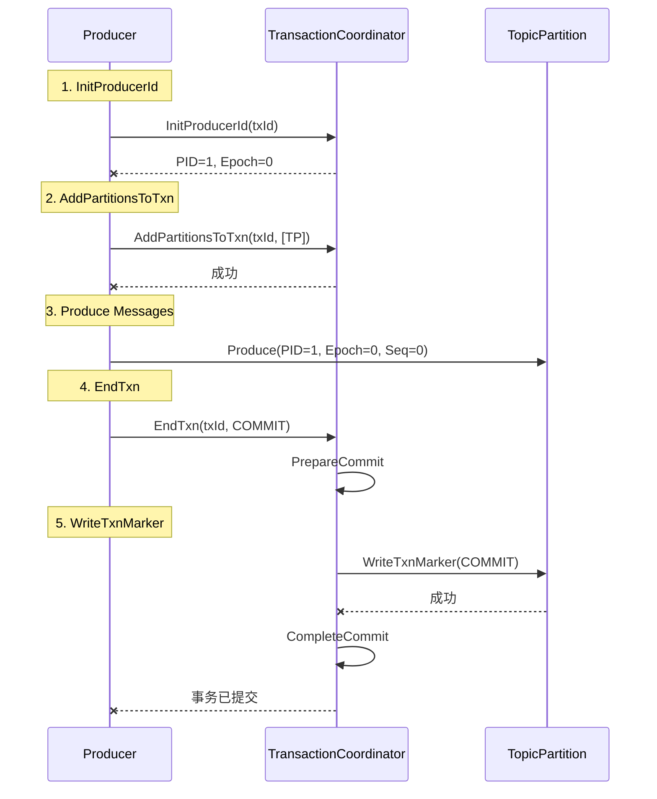

# 03. 事务协议

## 本章导读

Kafka 事务通过一系列协议实现，包括 InitProducerId、AddPartitionsToTxn、AddOffsetsToTxn、EndTxn 和 WriteTxnMarker。本章将详细分析这些协议的格式、流程和实现细节。

---

## 1. 协议概览

### 1.1 协议列表

```scala
/**
 * Kafka 事务相关的 API：
 *
 * 1. InitProducerId（18）
 *    - 初始化生产者
 *    - 分配 Producer ID 和 Epoch
 *
 * 2. AddPartitionsToTxn（19）
 *    - 添加分区到事务
 *    - 记录事务涉及的分区
 *
 * 3. AddOffsetsToTxn（21）
 *    - 添加消费 Offset 到事务
 *    - 实现 consume-produce 事务
 *
 * 4. EndTxn（20）
 *    - 提交或回滚事务
 *    - 触发两阶段提交
 *
 * 5. WriteTxnMarker（22）
 *    - 写入 Transaction Marker
 *    - 标记事务结果
 */
```

### 1.2 协议流程


---

## 2. InitProducerId 协议

### 2.1 协议作用

```scala
/**
 * InitProducerId 协议作用:
 *
 * 1. 分配 Producer ID
 *    - 首次使用时分配新的 PID
 *    - 后续使用时返回现有 PID
 *
 * 2. 管理 Producer Epoch
 *    - PID 冲突时递增 Epoch
 *    - 隔离旧的生产者
 *
 * 3. 初始化事务状态
 *    - 创建事务元数据
 *    - 状态: Empty → Ongoing
 *
 * 4. 验证事务状态
 *    - 检查未完成的事务
 *    - 决定是否需要恢复
 */
```

### 2.2 请求格式

```scala
/**
 * InitProducerIdRequest 结构
 *
 * ApiKey: InitProducerId (18)
 * ApiVersion: 0-3
 */

case class InitProducerIdRequest(
    /**
     * 事务 ID
     * - 用户提供的唯一标识
     * - 可为空（仅幂等生产者）
     */
    transactionalId: String,

    /**
     * 事务超时时间（毫秒）
     * - 默认: 60000 (1分钟)
     * - 最大: transaction.max.timeout.ms (15分钟)
     */
    transactionTimeoutMs: Int,

    /**
     * 是否启用两阶段提交
     * - true: 启用事务
     * - false: 仅幂等性
     */
    enableTwoPCFlag: Boolean,

    /**
     * 是否保留准备状态的事务
     * - 用于故障恢复
     */
    keepPreparedTxn: Boolean,

    /**
     * 期望的 Producer ID 和 Epoch
     * - 用于验证和恢复
     */
    expectedProducerIdAndEpoch: Option[ProducerIdAndEpoch]
)

/**
 * ProducerIdAndEpoch 结构
 */
case class ProducerIdAndEpoch(
    producerId: Long,
    producerEpoch: Short
)
```

### 2.3 响应格式

```scala
/**
 * InitProducerIdResponse 结构
 */

case class InitProducerIdResponse(
    /**
     * 错误码
     * - NONE: 成功
     * - TRANSACTIONAL_ID_AUTHORIZATION_FAILED: 权限不足
     * - INVALID_TRANSACTION_TIMEOUT_MS: 超时时间无效
     */
    errorCode: Errors,

    /**
     * Producer ID
     * - 系统分配的唯一标识
     */
    producerId: Long,

    /**
     * Producer Epoch
     * - 版本号，用于隔离
     */
    producerEpoch: Short,

    /**
     * Transaction Coordinator ID
     * - Coordinator 所在的 Broker ID
     */
    throttleTimeMs: Int
)
```

### 2.4 处理流程

```scala
/**
 * InitProducerId 处理流程
 */

def handleInitProducerId(
    transactionalId: String,
    transactionTimeoutMs: Int,
    enableTwoPCFlag: Boolean,
    keepPreparedTxn: Boolean,
    expectedProducerIdAndEpoch: Option[ProducerIdAndEpoch],
    responseCallback: InitProducerIdCallback
): Unit = {

    log.info(s"处理 InitProducerId: transactionalId=$transactionalId")

    /**
     * 1. 验证事务超时时间
     */
    if (transactionTimeoutMs < 0 ||
        transactionTimeoutMs > txnConfig.transactionMaxTimeoutMs) {
        responseCallback(
            InitProducerIdResult(
                Errors.INVALID_TRANSACTION_TIMEOUT_MS,
                ProducerIdAndEpoch.NO_PRODUCER_ID,
                ProducerIdAndEpoch.NO_PRODUCER_EPOCH
            )
        )
        return
    }

    /**
     * 2. 获取或分配 Producer ID
     */
    val result = if (transactionalId == null) {
        /**
         * 仅幂等性，分配临时 PID
         */
        val producerId = producerIdManager.allocateProducerId()
        Right((producerId, 0.toShort))

    } else {
        /**
         * 事务生产者，获取持久化 PID
         */
        transactionManager.getTransactionState(transactionalId) match {
            case None =>
                /**
                 * 首次使用，分配新的 PID
                 */
                val producerId = producerIdManager.allocateProducerId()
                val producerEpoch = 0.toShort
                Right((producerId, producerEpoch))

            case Some(CoordinatorEpochAndTxnMetadata(coordinatorEpoch, txnMetadata)) =>
                txnMetadata.inLock(() => {
                    /**
                     * 检查是否有未完成的事务
                     */
                    if (txnMetadata.state == TransactionState.PrepareCommit ||
                        txnMetadata.state == TransactionState.PrepareAbort) {
                        
                        /**
                         * 有未完成的事务
                         */
                        expectedProducerIdAndEpoch match {
                            case Some(expected) =>
                                /**
                                 * 生产者提供了期望的 PID/Epoch
                                 * 验证是否匹配
                                 */
                                if (txnMetadata.producerId == expected.producerId &&
                                    txnMetadata.producerEpoch == expected.producerEpoch) {
                                    /**
                                     * 匹配，继续使用现有 PID/Epoch
                                     */
                                    Right((txnMetadata.producerId, txnMetadata.producerEpoch))
                                } else {
                                    /**
                                     * 不匹配，递增 Epoch
                                     */
                                    val newEpoch = (txnMetadata.producerEpoch + 1).toShort
                                    Right((txnMetadata.producerId, newEpoch))
                                }

                            case None =>
                                /**
                                 * 未提供期望的 PID/Epoch
                                 * 递增 Epoch，隔离旧生产者
                                 */
                                val newEpoch = (txnMetadata.producerEpoch + 1).toShort
                                Right((txnMetadata.producerId, newEpoch))
                        }

                    } else if (txnMetadata.state == TransactionState.CompleteCommit ||
                               txnMetadata.state == TransactionState.CompleteAbort) {
                        /**
                         * 事务已完成
                         * 可以继续使用
                         */
                        Right((txnMetadata.producerId, txnMetadata.producerEpoch))

                    } else {
                        /**
                         * 其他状态，使用现有 PID/Epoch
                         */
                        Right((txnMetadata.producerId, txnMetadata.producerEpoch))
                    }
                })
        }
    }

    result match {
        case Left(error) =>
            responseCallback(
                InitProducerIdResult(
                    error,
                    ProducerIdAndEpoch.NO_PRODUCER_ID,
                    ProducerIdAndEpoch.NO_PRODUCER_EPOCH
                )
            )

        case Right((producerId, producerEpoch)) =>
            /**
             * 3. 持久化事务元数据
             */
            val metadata = TransactionMetadata(
                producerId = producerId,
                producerEpoch = producerEpoch,
                txnTimeoutMs = transactionTimeoutMs,
                state = TransactionState.Empty,
                topicPartitions = Set.empty,
                lastUpdateTimestamp = time.milliseconds()
            )

            transactionManager.putTransactionState(
                transactionalId,
                metadata,
                coordinatorEpoch = 0,
                responseCallback = { error =>
                    if (error == Errors.NONE) {
                        log.info(s"InitProducerId 成功: transactionalId=$transactionalId, " +
                                s"producerId=$producerId, producerEpoch=$producerEpoch")
                    }
                    responseCallback(
                        InitProducerIdResult(
                            error,
                            producerId,
                            producerEpoch
                        )
                    )
                }
            )
    }
}
```

---

## 3. AddPartitionsToTxn 协议

### 3.1 协议作用

```scala
/**
 * AddPartitionsToTxn 协议作用:
 *
 * 1. 添加分区到事务
 *    - 记录事务涉及的分区
 *    - 为后续发送 Marker 做准备
 *
 * 2. 验证事务状态
 *    - 确保事务处于 Ongoing 状态
 *    - 验证 Producer Epoch
 *
 * 3. 持久化分区列表
 *    - 写入 __transaction_state
 *    - 支持故障恢复
 */
```

### 3.2 请求格式

```scala
/**
 * AddPartitionsToTxnRequest 结构
 *
 * ApiKey: AddPartitionsToTxn (19)
 * ApiVersion: 0-3
 */

case class AddPartitionsToTxnRequest(
    /**
     * 事务 ID
     */
    transactionalId: String,

    /**
     * Producer ID
     */
    producerId: Long,

    /**
     * Producer Epoch
     */
    producerEpoch: Short,

    /**
     * 要添加的分区列表
     * - Topic -> List[Partition]
     */
    partitions: Map[String, List[Int]]
)
```

### 3.3 响应格式

```scala
/**
 * AddPartitionsToTxnResponse 结构
 */

case class AddPartitionsToTxnResponse(
    /**
     * 错误码
     */
    errorCode: Errors,

    /**
     * 各分区的结果
     * - Topic -> (Partition -> Error)
     */
    errors: Map[String, Map[Int, Errors]]
)
```

### 3.4 处理流程

```scala
/**
 * AddPartitionsToTxn 处理流程
 */

def handleAddPartitionsToTxn(
    transactionalId: String,
    producerId: Long,
    producerEpoch: Short,
    partitions: Map[TopicPartition, Errors],
    responseCallback: AddPartitionsCallback
): Unit = {

    log.info(s"处理 AddPartitionsToTxn: transactionalId=$transactionalId")

    /**
     * 1. 获取事务元数据
     */
    val result = transactionManager.getTransactionState(transactionalId).flatMap {
        case None =>
            /**
             * 事务不存在
             */
            Left(Errors.INVALID_PRODUCER_ID_MAPPING)

        case Some(CoordinatorEpochAndTxnMetadata(coordinatorEpoch, txnMetadata)) =>
            txnMetadata.inLock(() => {
                /**
                 * 2. 验证 Producer ID 和 Epoch
                 */
                if (txnMetadata.producerId != producerId) {
                    Left(Errors.INVALID_PRODUCER_ID_MAPPING)
                } else if (txnMetadata.producerEpoch != producerEpoch) {
                    Left(Errors.PRODUCER_FENCED)
                } else {
                    /**
                     * 3. 状态转换: Empty/Ongoing → Ongoing
                     */
                    val currentState = txnMetadata.state
                    if (currentState != TransactionState.Empty &&
                        currentState != TransactionState.Ongoing) {
                        Left(Errors.INVALID_TXN_STATE)
                    } else {
                        /**
                         * 4. 添加分区到事务
                         */
                        val newPartitions = txnMetadata.topicPartitions ++ partitions.keySet

                        val newMetadata = txnMetadata.copy(
                            state = TransactionState.Ongoing,
                            topicPartitions = newPartitions,
                            lastUpdateTimestamp = time.milliseconds()
                        )

                        /**
                         * 5. 持久化状态变更
                         */
                        transactionManager.putTransactionState(
                            transactionalId,
                            newMetadata,
                            coordinatorEpoch,
                            responseCallback
                        )

                        Right((coordinatorEpoch, newMetadata))
                    }
                }
            })
    }

    result match {
        case Left(error) =>
            responseCallback(
                partitions.keys.map(_ -> error).toMap
            )

        case Right((coordinatorEpoch, newMetadata)) =>
            responseCallback(
                partitions.keys.map(_ -> Errors.NONE).toMap
            )
    }
}
```

---

## 4. AddOffsetsToTxn 协议

### 4.1 协议作用

```scala
/**
 * AddOffsetsToTxn 协议作用:
 *
 * 1. 添加消费 Offset 到事务
 *    - 实现 consume-produce 事务
 *    - 保证消费和生产的原子性
 *
 * 2. 添加 __consumer_offsets 分区
 *    - Offset 存储在 __consumer_offsets
 *    - 将该分区加入事务
 *
 * 3. 准备提交 Offset
 *    - 后续通过 sendOffsetsToTransaction 提交
 */
```

### 4.2 请求格式

```scala
/**
 * AddOffsetsToTxnRequest 结构
 *
 * ApiKey: AddOffsetsToTxn (21)
 * ApiVersion: 0-3
 */

case class AddOffsetsToTxnRequest(
    /**
     * 事务 ID
     */
    transactionalId: String,

    /**
     * Producer ID
     */
    producerId: Long,

    /**
     * Producer Epoch
     */
    producerEpoch: Short,

    /**
     * 消费者组 ID
     */
    groupId: String
)
```

### 4.3 响应格式

```scala
/**
 * AddOffsetsToTxnResponse 结构
 */

case class AddOffsetsToTxnResponse(
    /**
     * 错误码
     */
    errorCode: Errors,

    /**
     * 节流时间
     */
    throttleTimeMs: Int
)
```

### 4.4 处理流程

```scala
/**
 * AddOffsetsToTxn 处理流程
 */

def handleAddOffsetsToTxn(
    transactionalId: String,
    producerId: Long,
    producerEpoch: Short,
    groupId: String,
    offsetMetadata: Map[TopicPartition, OffsetAndMetadata],
    responseCallback: AddOffsetsCallback
): Unit = {

    log.info(s"处理 AddOffsetsToTxn: transactionalId=$transactionalId, groupId=$groupId")

    /**
     * 1. 计算 __consumer_offsets 分区
     */
    val partitionId = partitionFor(groupId)

    val offsetPartition = new TopicPartition(
        Topic.GROUP_METADATA_TOPIC_NAME,
        partitionId
    )

    /**
     * 2. 调用 AddPartitionsToTxn
     * - 将 __consumer_offsets 分区加入事务
     */
    handleAddPartitionsToTxn(
        transactionalId = transactionalId,
        producerId = producerId,
        producerEpoch = producerEpoch,
        partitions = Map(offsetPartition -> Errors.NONE),
        responseCallback = { result =>
            responseCallback(result.getOrElse(offsetPartition, Errors.NONE))
        }
    )
}

/**
 * 计算消费者组对应的分区
 */
private def partitionFor(groupId: String): Int = {
    val hash = Math.abs(groupId.hashCode)
    hash % offsetManagerTopicPartitionCount
}
```

---

## 5. EndTxn 协议

### 5.1 协议作用

```scala
/**
 * EndTxn 协议作用:
 *
 * 1. 提交或回滚事务
 *    - COMMIT: 提交事务
 *    - ABORT: 回滚事务
 *
 * 2. 触发两阶段提交
 *    - 状态转换: Ongoing → PrepareCommit/Abort
 *    - 发送 Transaction Marker
 *
 * 3. 清理事务状态
 *    - 状态转换: PrepareCommit/Abort → CompleteCommit/Abort
 *    - 最终回到 Empty 状态
 */
```

### 5.2 请求格式

```scala
/**
 * EndTxnRequest 结构
 *
 * ApiKey: EndTxn (20)
 * ApiVersion: 0-3
 */

case class EndTxnRequest(
    /**
     * 事务 ID
     */
    transactionalId: String,

    /**
     * Producer ID
     */
    producerId: Long,

    /**
     * Producer Epoch
     */
    producerEpoch: Short,

    /**
     * 事务结果
     * - 0: COMMIT
     * - 1: ABORT
     */
    command: TransactionResult
)
```

### 5.3 响应格式

```scala
/**
 * EndTxnResponse 结构
 */

case class EndTxnResponse(
    /**
     * 错误码
     */
    errorCode: Errors,

    /**
     * 节流时间
     */
    throttleTimeMs: Int
)
```

### 5.4 处理流程

```scala
/**
 * EndTxn 处理流程
 */

def handleEndTxn(
    transactionalId: String,
    producerId: Long,
    producerEpoch: Short,
    command: TransactionResult,
    responseCallback: EndTxnCallback
): Unit = {

    log.info(s"处理 EndTxn: transactionalId=$transactionalId, command=${command.name}")

    /**
     * 1. 获取事务元数据
     */
    val result = transactionManager.getTransactionState(transactionalId).flatMap {
        case None =>
            Left(Errors.INVALID_PRODUCER_ID_MAPPING)

        case Some(CoordinatorEpochAndTxnMetadata(coordinatorEpoch, txnMetadata)) =>
            txnMetadata.inLock(() => {
                /**
                 * 2. 验证 Producer ID 和 Epoch
                 */
                if (txnMetadata.producerId != producerId) {
                    Left(Errors.INVALID_PRODUCER_ID_MAPPING)
                } else if (txnMetadata.producerEpoch != producerEpoch) {
                    Left(Errors.PRODUCER_FENCED)
                } else if (!isValidTransition(txnMetadata.state, command)) {
                    Left(Errors.INVALID_TXN_STATE)
                } else {
                    /**
                     * 3. 准备状态转换
                     */
                    val nextState = command match {
                        case TransactionResult.COMMIT => TransactionState.PrepareCommit
                        case TransactionResult.ABORT => TransactionState.PrepareAbort
                    }

                    /**
                     * 4. 持久化状态转换
                     */
                    transactionManager.putTransactionState(
                        transactionalId,
                        txnMetadata.prepareTransitionTo(nextState),
                        coordinatorEpoch,
                        responseCallback = { error =>
                            if (error == Errors.NONE) {
                                /**
                                 * 5. 发送 Transaction Marker
                                 */
                                completeTransaction(
                                    transactionalId,
                                    coordinatorEpoch,
                                    txnMetadata,
                                    command,
                                    responseCallback
                                )
                            } else {
                                responseCallback(error)
                            }
                        }
                    )

                    Right((coordinatorEpoch, txnMetadata))
                }
            })
    }

    result match {
        case Left(error) =>
            responseCallback(error)

        case Right(_) =>
            // 在回调中处理
    }
}

/**
 * 验证状态转换是否合法
 */
private def isValidTransition(
    currentState: TransactionState,
    command: TransactionResult
): Boolean = {
    command match {
        case TransactionResult.COMMIT =>
            currentState == TransactionState.Ongoing ||
            currentState == TransactionState.PrepareCommit

        case TransactionResult.ABORT =>
            currentState == TransactionState.Ongoing ||
            currentState == TransactionState.PrepareAbort
    }
}
```

---

## 6. WriteTxnMarker 协议

### 6.1 协议作用

```scala
/**
 * WriteTxnMarker 协议作用:
 *
 * 1. 写入 Transaction Marker
 *    - 标记事务结果
 *    - 决定消息可见性
 *
 * 2. 更新事务状态
 *    - 标记分区已完成
 *    - 清理事务消息
 *
 * 3. 支持事务恢复
 *    - Marker 持久化到日志
 *    - 重启后可恢复
 */
```

### 6.2 请求格式

```scala
/**
 * WriteTxnMarkerRequest 结构
 *
 * ApiKey: WriteTxnMarker (22)
 * ApiVersion: 0-3
 */

case class WriteTxnMarkerRequest(
    /**
     * Coordinator Epoch
     */
    coordinatorEpoch: Int,

    /**
     * Producer ID
     */
    producerId: Long,

    /**
     * Producer Epoch
     */
    producerEpoch: Short,

    /**
     * 事务结果
     */
    command: TransactionResult,

    /**
     * 分区列表
     */
    partitions: util.Map[TopicPartition, TxnPartitionMetadata]
)

/**
 * 事务分区元数据
 */
case class TxnPartitionMetadata(
    /**
     * 分区版本
     */
    version: Int
)
```

### 6.3 响应格式

```scala
/**
 * WriteTxnMarkerResponse 结构
 */

case class WriteTxnMarkerResponse(
    /**
     * 各分区的结果
     */
    errors: Map[TopicPartition, Errors]
)
```

### 6.4 处理流程

```scala
/**
 * WriteTxnMarker 处理流程
 */

def handleWriteTxnMarker(
    coordinatorEpoch: Int,
    producerId: Long,
    producerEpoch: Short,
    command: TransactionResult,
    partitions: Map[TopicPartition, TxnPartitionMetadata],
    responseCallback: WriteTxnMarkerCallback
): Unit = {

    log.info(s"处理 WriteTxnMarker: producerId=$producerId, command=${command.name}")

    val results = new ConcurrentHashMap[TopicPartition, Errors]()

    /**
     * 1. 并行处理所有分区
     */
    val futures = partitions.map { case (partition, metadata) =>
        CompletableFuture.supplyAsync(() => {
            try {
                /**
                 * 2. 写入 Marker 到分区
                 */
                writeMarkerToPartition(
                    partition,
                    producerId,
                    producerEpoch,
                    command,
                    coordinatorEpoch
                )

                /**
                 * 3. 成功
                 */
                results.put(partition, Errors.NONE)

            } catch {
                case ex: Exception =>
                    /**
                     * 4. 失败
                     */
                    log.error(s"写入 Transaction Marker 失败: $partition", ex)
                    results.put(partition, Errors.UNKNOWN_SERVER_ERROR)
            }
        })
    }

    /**
     * 5. 等待所有分区完成
     */
    CompletableFuture.allOf(futures: _*)
        .thenRun(() => {
            responseCallback(results.asScala.toMap)
        })
}

/**
 * 写入 Marker 到分区
 */
private def writeMarkerToPartition(
    partition: TopicPartition,
    producerId: Long,
    producerEpoch: Short,
    command: TransactionResult,
    coordinatorEpoch: Int
): Unit = {

    /**
     * 1. 构建 Control Record
     */
    val controlRecordType = command match {
        case TransactionResult.COMMIT => ControlRecordType.COMMIT
        case TransactionResult.ABORT => ControlRecordType.ABORT
    }

    val controlRecord = new ControlRecord(
        version = 0,
        controlRecordType = controlRecordType,
        producerId = producerId,
        producerEpoch = producerEpoch
    )

    /**
     * 2. 序列化
     */
    val key = new ControlRecordKey(controlRecord)
    val value = new ControlRecordValue(controlRecord)

    /**
     * 3. 构建 MemoryRecords
     */
    val records = MemoryRecords.withRecords(
        RecordBatch.MAGIC_VALUE_V2,
        compression = CompressionType.NONE,
        new SimpleRecord(key.toBytes, value.toBytes)
    )

    /**
     * 4. 追加到日志
     */
    replicaManager.appendRecords(
        timeout = 10000,
        requiredAcks = -1,
        internalTopicsAllowed = true,
        isFromClient = false,
        entriesPerPartition = Map(partition -> records),
        responseCallback = _ => {}
    ).await()
}
```

---

## 7. 协议时序图

### 7.1 完整事务流程



---

## 8. 总结

### 8.1 协议总结

| 协议 | 作用 | 触发时机 |
|------|------|----------|
| **InitProducerId** | 初始化生产者 | 生产者启动或恢复 |
| **AddPartitionsToTxn** | 添加分区到事务 | 发送消息前 |
| **AddOffsetsToTxn** | 添加 Offset 到事务 | consume-produce 事务 |
| **EndTxn** | 提交或回滚事务 | 事务结束时 |
| **WriteTxnMarker** | 写入事务标记 | EndTxn 后异步进行 |

### 8.2 设计亮点

1. **协议分离**
   - 每个协议职责单一
   - 便于扩展和维护

2. **异步处理**
   - Marker 异步发送
   - 不阻塞生产者

3. **状态验证**
   - 每个请求都验证状态
   - 防止非法操作

4. **持久化优先**
   - 状态先持久化再执行
   - 支持故障恢复

### 8.3 下一步学习

- **[04-two-phase-commit.md](./04-two-phase-commit.md)** - 深入理解两阶段提交协议
- **[05-transaction-log.md](./05-transaction-log.md)** - 学习事务日志的实现

---

**思考题**：
1. 为什么 AddOffsetsToTxn 需要调用 AddPartitionsToTxn？
2. 如果 EndTxn 发送后，WriteTxnMarker 全部失败，会发生什么？
3. 为什么需要 Coordinator Epoch？它有什么作用？
