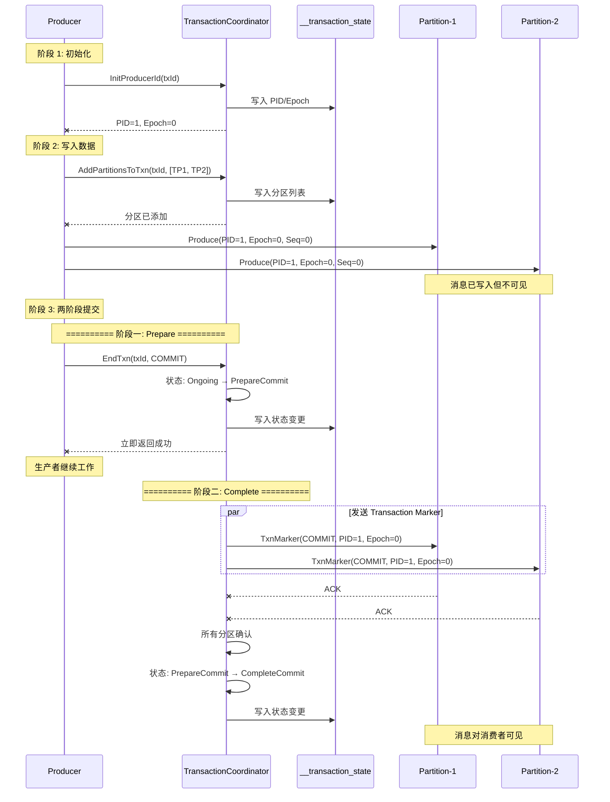

# 04. 两阶段提交协议

## 本章导读

两阶段提交（Two-Phase Commit, 2PC）是 Kafka 实现事务原子性的核心协议。本章将深入分析 Kafka 如何实现两阶段提交，包括 Prepare 和 Complete 阶段的详细流程、状态转换以及异常处理。

---

## 1. 两阶段提交概述

### 1.1 什么是两阶段提交

```scala
/**
 * 两阶段提交协议：
 *
 * 目标：保证分布式事务的原子性
 * - 要么所有参与者都提交
 * - 要么所有参与者都回滚
 *
 * 两个阶段：
 * 1. Prepare（准备）阶段
 *    - 询问参与者是否准备好
 *    - 参与者锁定资源
 *    - 参与者返回 YES/NO
 *
 * 2. Complete（完成）阶段
 *    - 根据参与者反馈决定
 *    - 如果全部 YES，发送 COMMIT
 *    - 如果有 NO，发送 ABORT
 *    - 参与者执行最终操作
 */
```

### 1.2 Kafka 的两阶段提交

```scala
/**
 * Kafka 两阶段提交的特点:
 *
 * 1. 简化的参与者模型
 *    - 参与者是被动的分区
 *    - 不需要返回 YES/NO
 *    - 直接接收最终决定
 *
 * 2. 异步完成
 *    - Prepare 阶段完成后立即返回
 *    - Complete 阶段异步进行
 *    - 通过 Transaction Marker 实现
 *
 * 3. 乐观提交
 *    - 假设所有分区都能提交
 *    - 通过 Marker 实现最终一致性
 */
```

---

## 2. 两阶段提交流程

### 2.1 完整流程图



### 2.2 状态转换

```scala
/**
 * 两阶段提交状态转换:
 *
 * 提交流程:
 * Empty → Ongoing → PrepareCommit → CompleteCommit → Empty
 *
 * 回滚流程:
 * Empty → Ongoing → PrepareAbort → CompleteAbort → Empty
 */

object TwoPhaseCommitStates {
    /**
     * 提交状态转换
     */
    val commitTransitions = Seq(
        TransactionState.Empty,
        TransactionState.Ongoing,
        TransactionState.PrepareCommit,
        TransactionState.CompleteCommit,
        TransactionState.Empty
    )

    /**
     * 回滚状态转换
     */
    val abortTransitions = Seq(
        TransactionState.Empty,
        TransactionState.Ongoing,
        TransactionState.PrepareAbort,
        TransactionState.CompleteAbort,
        TransactionState.Empty
    )
}
```

---

## 3. Prepare 阶段

### 3.1 阶段目标

```scala
/**
 * Prepare 阶段目标:
 *
 * 1. 状态转换
 *    - Ongoing → PrepareCommit/Abort
 *    - 标记事务进入准备状态
 *
 * 2. 持久化决定
 *    - 将提交/回滚决定写入日志
 *    - 确保故障可恢复
 *
 * 3. 快速返回
 *    - 不等待 Marker 发送
 *    - 立即返回给生产者
 *    - 解放生产者资源
 */
```

### 3.2 实现代码

```scala
/**
 * Prepare 阶段实现
 */

private def prepareTransaction(
    transactionalId: String,
    producerId: Long,
    producerEpoch: Short,
    command: TransactionResult,
    responseCallback: EndTxnCallback
): Unit = {

    log.info(s"Prepare 阶段: transactionalId=$transactionalId, command=${command.name}")

    /**
     * 1. 获取事务元数据
     */
    transactionManager.getTransactionState(transactionalId) match {
        case None =>
            responseCallback(Errors.INVALID_PRODUCER_ID_MAPPING)

        case Some(CoordinatorEpochAndTxnMetadata(coordinatorEpoch, txnMetadata)) =>
            txnMetadata.inLock(() => {
                /**
                 * 2. 验证状态
                 */
                if (txnMetadata.producerId != producerId) {
                    responseCallback(Errors.INVALID_PRODUCER_ID_MAPPING)
                    return
                }

                if (txnMetadata.producerEpoch != producerEpoch) {
                    responseCallback(Errors.PRODUCER_FENCED)
                    return
                }

                if (txnMetadata.state != TransactionState.Ongoing) {
                    responseCallback(Errors.INVALID_TXN_STATE)
                    return
                }

                /**
                 * 3. 决定下一个状态
                 */
                val nextState = command match {
                    case TransactionResult.COMMIT => TransactionState.PrepareCommit
                    case TransactionResult.ABORT => TransactionState.PrepareAbort
                }

                /**
                 * 4. 准备状态转换
                 */
                val newMetadata = txnMetadata.prepareTransitionTo(nextState)

                /**
                 * 5. 持久化状态转换
                 */
                transactionManager.putTransactionState(
                    transactionalId,
                    newMetadata,
                    coordinatorEpoch,
                    responseCallback = { error =>
                        if (error == Errors.NONE) {
                            log.info(s"Prepare 阶段成功: transactionalId=$transactionalId")

                            /**
                             * 6. 准备阶段完成，立即返回
                             */
                            responseCallback(Errors.NONE)

                            /**
                             * 7. 异步进入 Complete 阶段
                             */
                            asyncCompleteTransaction(
                                transactionalId,
                                coordinatorEpoch,
                                txnMetadata,
                                command
                            )
                        } else {
                            log.error(s"Prepare 阶段失败: transactionalId=$transactionalId, error=$error")
                            responseCallback(error)
                        }
                    }
                )
            })
    }
}
```

### 3.3 Prepare 阶段检查点

```scala
/**
 * Prepare 阶段检查点:
 *
 * 1. 状态已持久化
 *    - __transaction_state 已写入
 *    - 故障可恢复
 *
 * 2. 已决定结果
 *    - COMMIT 或 ABORT 已确定
 *    - 不会更改
 *
 * 3. 可以返回
 *    - 生产者可以收到响应
 *    - 不需要等待 Complete
 */
```

---

## 4. Complete 阶段

### 4.1 阶段目标

```scala
/**
 * Complete 阶段目标:
 *
 * 1. 发送 Transaction Marker
 *    - 通知所有参与分区
 *    - 标记事务结果
 *
 * 2. 等待确认
 *    - 等待所有分区收到 Marker
 *    - 处理发送失败
 *
 * 3. 更新状态
 *    - PrepareCommit/Abort → CompleteCommit/Abort
 *    - 标记事务完成
 *
 * 4. 清理资源
 *    - 清理事务元数据
 *    - 回到 Empty 状态
 */
```

### 4.2 发送 Transaction Marker

```scala
/**
 * Complete 阶段实现
 */

private def asyncCompleteTransaction(
    transactionalId: String,
    coordinatorEpoch: Int,
    txnMetadata: TransactionMetadata,
    command: TransactionResult
): Unit = {

    log.info(s"Complete 阶段开始: transactionalId=$transactionalId, command=${command.name}")

    /**
     * 1. 构建 Transaction Marker 请求
     */
    val markerRequest = TransactionMarkerRequest(
        transactionalId = transactionalId,
        producerId = txnMetadata.producerId,
        producerEpoch = txnMetadata.producerEpoch,
        command = command,
        partitions = txnMetadata.topicPartitions.toSet,
        coordinatorEpoch = coordinatorEpoch
    )

    /**
     * 2. 提交给 TxnMarkerChannelManager
     * - 异步发送
     * - 自动重试
     */
    txnMarkerChannelManager.addRequest(markerRequest)

    log.info(s"Transaction Marker 已加入发送队列: transactionalId=$transactionalId")
}
```

### 4.3 Marker 发送流程

```scala
/**
 * Transaction Marker 发送流程
 */

private def sendTransactionMarker(
    request: TransactionMarkerRequest
): Unit = {

    val marker = new EndTxnMarker(
        request.producerId,
        request.producerEpoch,
        request.command
    )

    val partitions = request.partitions

    /**
     * 1. 并行发送到所有分区
     */
    val futures = partitions.map { partition =>
        CompletableFuture.supplyAsync[Unit] { () =>
            try {
                /**
                 * 2. 构建 WriteTxnMarker 请求
                 */
                val markerRequest = WriteTxnMarkerRequest.Builder(
                    coordinatorEpoch = request.coordinatorEpoch,
                    producerId = request.producerId,
                    producerEpoch = request.producerEpoch,
                    command = request.command,
                    partitions = JavaCollections.singleton(partition)
                )

                /**
                 * 3. 获取分区 Leader
                 */
                val partitionLeader = metadataCache.getPartitionLeaderEndpoint(
                    partition.topic(),
                    partition.partition()
                )

                partitionLeader match {
                    case Some(leader) =>
                        /**
                         * 4. 发送 Marker
                         */
                        sendToBroker(leader, markerRequest, partition)

                        /**
                         * 5. 发送成功
                         */
                        onMarkerDelivered(request, partition)

                    case None =>
                        /**
                         * 分区 Leader 未知，稍后重试
                         */
                        log.error(s"分区 Leader 未知: $partition")
                        onMarkerFailed(request, partition)
                }

            } catch {
                case ex: Exception =>
                    /**
                     * 发送失败
                     */
                    log.error(s"发送 Transaction Marker 异常: $partition", ex)
                    onMarkerFailed(request, partition)
            }
        }
    }

    /**
     * 6. 等待所有分区完成
     */
    CompletableFuture.allOf(futures: _*)
        .thenRun(() => {
            /**
             * 7. 所有分区都完成
             */
            onCompleteTransaction(request)
        })
}
```

### 4.4 Marker 送达处理

```scala
/**
 * Transaction Marker 送达处理
 */

private def onMarkerDelivered(
    request: TransactionMarkerRequest,
    partition: TopicPartition
): Unit = {

    log.info(s"Transaction Marker 送达: $partition")

    /**
     * 1. 从在途列表中移除
     */
    inFlightRequests.remove(partition)

    /**
     * 2. 检查是否所有分区都完成
     */
    val allCompleted = request.partitions.forall { p =>
        !inFlightRequests.containsKey(p)
    }

    if (allCompleted) {
        /**
         * 3. 所有分区都完成，更新状态
         */
        completeTransactionState(request)
    }
}

/**
 * Transaction Marker 失败处理
 */
private def onMarkerFailed(
    request: TransactionMarkerRequest,
    partition: TopicPartition
): Unit = {

    log.error(s"Transaction Marker 发送失败: $partition")

    /**
     * 1. 从在途列表中移除
     */
    inFlightRequests.remove(partition)

    /**
     * 2. 加入重试队列
     */
    pendingRequests.add(request)

    /**
     * 3. 触发重试
     */
    maybeDrainQueue()
}
```

### 4.5 状态更新

```scala
/**
 * 完成事务状态更新
 */

private def completeTransactionState(
    request: TransactionMarkerRequest
): Unit = {

    log.info(s"所有 Marker 已送达，更新状态: ${request.transactionalId}")

    /**
     * 1. 确定下一个状态
     */
    val nextState = request.command match {
        case TransactionResult.COMMIT => TransactionState.CompleteCommit
        case TransactionResult.ABORT => TransactionState.CompleteAbort
    }

    /**
     * 2. 获取事务元数据
     */
    transactionManager.getTransactionState(request.transactionalId).foreach {
        case CoordinatorEpochAndTxnMetadata(coordinatorEpoch, txnMetadata) =>
            txnMetadata.inLock(() => {
                /**
                 * 3. 准备状态转换
                 */
                val newMetadata = txnMetadata.prepareTransitionTo(nextState)

                /**
                 * 4. 持久化状态转换
                 */
                transactionManager.putTransactionState(
                    request.transactionalId,
                    newMetadata,
                    coordinatorEpoch,
                    responseCallback = { error =>
                        if (error == Errors.NONE) {
                            log.info(s"事务状态更新成功: ${request.transactionalId}, state=$nextState")

                            /**
                             * 5. 清理事务
                             */
                            cleanupTransaction(
                                request.transactionalId,
                                coordinatorEpoch,
                                newMetadata
                            )
                        } else {
                            log.error(s"事务状态更新失败: ${request.transactionalId}, error=$error")
                        }
                    }
                )
            })
    }
}

/**
 * 清理事务
 */
private def cleanupTransaction(
    transactionalId: String,
    coordinatorEpoch: Int,
    txnMetadata: TransactionMetadata
): Unit = {

    log.info(s"清理事务: $transactionalId")

    /**
     * 1. 状态转换: CompleteCommit/Abort → Empty
     */
    val newMetadata = txnMetadata.prepareTransitionTo(TransactionState.Empty)

    /**
     * 2. 持久化状态转换
     */
    transactionManager.putTransactionState(
        transactionalId,
        newMetadata,
        coordinatorEpoch,
        responseCallback = { error =>
            if (error == Errors.NONE) {
                log.info(s"事务清理完成: $transactionalId")
            } else {
                log.error(s"事务清理失败: $transactionalId, error=$error")
            }
        }
    )
}
```

---

## 5. 异常处理

### 5.1 Coordinator 故障

```scala
/**
 * Coordinator 故障处理:
 *
 * 1. 故障检测
 *    - 新 Coordinator 从 __transaction_state 加载状态
 *    - 检测到 PrepareCommit/Abort 状态
 *
 * 2. 恢复流程
 *    - 重新发送 Transaction Marker
 *    - 完成未完成的事务
 *
 * 3. 保证
 *    - 即使 Coordinator 挂掉，事务也能完成
 *    - 通过持久化状态实现
 */

// 故障恢复代码
def recoverTransactions(): Unit = {
    /**
     * 1. 加载所有事务状态
     */
    val allTxns = transactionManager.listAllTransactionState()

    for (entry <- allTxns.entrySet.asScala) {
        val transactionalId = entry.getKey
        val epochAndMetadata = entry.getValue

        val txnMetadata = epochAndMetadata.transactionMetadata

        txnMetadata.inLock(() => {
            /**
             * 2. 检查未完成的事务
             */
            if (txnMetadata.state == TransactionState.PrepareCommit ||
                txnMetadata.state == TransactionState.PrepareAbort) {

                log.warn(s"发现未完成的事务: $transactionalId, state=${txnMetadata.state}")

                /**
                 * 3. 补偿事务
                 * - 重新发送 Transaction Marker
                 * - 完成两阶段提交
                 */
                val command = txnMetadata.state match {
                    case TransactionState.PrepareCommit => TransactionResult.COMMIT
                    case TransactionState.PrepareAbort => TransactionResult.ABORT
                    case _ => throw new IllegalStateException()
                }

                val markerRequest = TransactionMarkerRequest(
                    transactionalId = transactionalId,
                    producerId = txnMetadata.producerId,
                    producerEpoch = txnMetadata.producerEpoch,
                    command = command,
                    partitions = txnMetadata.topicPartitions.toSet,
                    coordinatorEpoch = epochAndMetadata.coordinatorEpoch
                )

                txnMarkerChannelManager.addRequest(markerRequest)
            }
        })
    }
}
```

### 5.2 网络分区

```scala
/**
 * 网络分区处理:
 *
 * 1. Marker 发送失败
 *    - 自动重试
 *    - 不限制重试次数
 *
 * 2. 分区 Leader 变更
 *    - 更新 Leader 信息
 *    - 重新发送 Marker
 *
 * 3. 保证
 *    - 最终所有分区都会收到 Marker
 *    - 事务最终一致
 */
```

### 5.3 生产者故障

```scala
/**
 * 生产者故障处理:
 *
 * 1. 事务超时
 *    - 自动回滚超时事务
 *    - 发送 Abort Marker
 *
 * 2. 生产者重启
 *    - 重新初始化，递增 Epoch
 *    - 隔离旧的生产者
 *
 * 3. 保证
 *    - 不会留下僵尸事务
 *    - 自动清理
 */

// 事务超时检测
def detectExpiredTransactions(): Unit = {
    val currentTime = time.milliseconds()

    val allTxns = transactionManager.listAllTransactionState()

    for (entry <- allTxns.entrySet.asScala) {
        val transactionalId = entry.getKey
        val txnMetadata = entry.getValue.transactionMetadata

        txnMetadata.inLock(() => {
            /**
             * 检查是否超时
             */
            if (txnMetadata.state == TransactionState.Ongoing &&
                (currentTime - txnMetadata.lastUpdateTimestamp) > txnMetadata.txnTimeoutMs) {

                log.warn(s"事务超时: $transactionalId")

                /**
                 * 自动回滚
                 */
                abortExpiredTransaction(transactionalId)
            }
        })
    }
}
```

---

## 6. 性能优化

### 6.1 批量发送

```scala
/**
 * 批量发送优化:
 *
 * 1. 批量发送 Marker
 *    - 多个分区的 Marker 合并发送
 *    - 减少网络往返
 *
 * 2. 效果
 *    - 减少网络开销
 *    - 提高吞吐量
 */

/**
 * 批量发送实现
 */
private def sendMarkersBatch(requests: Seq[TransactionMarkerRequest]): Unit = {
    /**
     * 1. 按 Broker 分组
     */
    val requestsByBroker = requests.flatMap { request =>
        request.partitions.map { partition =>
            val broker = metadataCache.getPartitionLeaderEndpoint(
                partition.topic(),
                partition.partition()
            )
            (broker, partition, request)
        }
    }.groupBy(_._1)

    /**
     * 2. 每个 Broker 批量发送
     */
    for ((broker, items) <- requestsByBroker) {
        val markerRequests = items.groupBy(_._3).map { case (request, items) =>
            val partitions = items.map(_._2).toSet
            (request, partitions)
        }

        for ((request, partitions) <- markerRequests) {
            val markerRequest = WriteTxnMarkerRequest.Builder(
                coordinatorEpoch = request.coordinatorEpoch,
                producerId = request.producerId,
                producerEpoch = request.producerEpoch,
                command = request.command,
                partitions = partitions.asJava
            )

            sendToBroker(broker.get, markerRequest)
        }
    }
}
```

### 6.2 并行发送

```scala
/**
 * 并行发送优化:
 *
 * 1. 多个分区并行发送
 *    - 不等待其他分区
 *    - 独立重试
 *
 * 2. 效果
 *    - 降低延迟
 *    - 提高并发度
 */
```

---

## 7. 总结

### 7.1 两阶段提交总结

| 阶段 | 目标 | 操作 | 返回时机 |
|------|------|------|----------|
| **Prepare** | 持久化决定 | 状态转换 + 写日志 | 立即返回 |
| **Complete** | 发送 Marker | 发送 + 等待确认 | 异步完成 |

### 7.2 设计亮点

1. **异步完成**
   - Prepare 完成立即返回
   - 不阻塞生产者
   - 提高吞吐量

2. **故障恢复**
   - 状态持久化
   - 自动补偿
   - 最终一致

3. **简化参与者**
   - 分区被动接收
   - 不需要投票
   - 简化实现

4. **重试机制**
   - 自动重试
   - 不限次数
   - 保证送达

### 7.3 下一步学习

- **[05-transaction-log.md](./05-transaction-log.md)** - 学习事务日志的实现
- **[06-idempotence.md](./06-idempotence.md)** - 理解幂等性保证机制

---

**思考题**：
1. 为什么 Complete 阶段要异步进行？同步等待有什么问题？
2. 如果 Prepare 阶段成功，但所有 Marker 都发送失败，最终结果是什么？
3. 两阶段提交如何保证一致性？如果部分分区收到 COMMIT，部分没收到怎么办？
