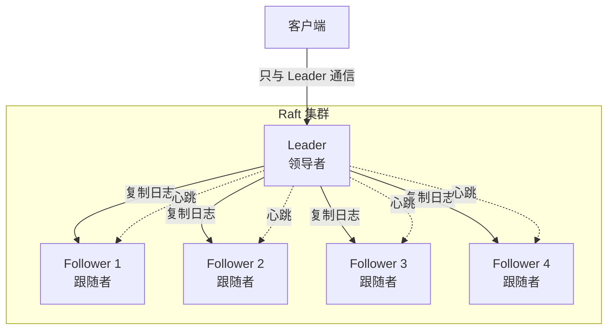
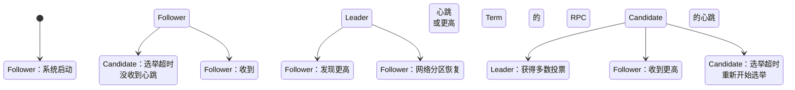

# Raft 协议通俗指南

> 一看就懂的分布式一致性协议

## 目录
- [1. 什么是分布式一致性问题?](#1-什么是分布式一致性问题)
- [2. 为什么需要 Raft?](#2-为什么需要-raft)
- [3. Raft 核心思想](#3-raft-核心思想)
- [4. 角色与状态](#4-角色与状态)
- [5. 领导者选举](#5-领导者选举)
- [6. 日志复制](#6-日志复制)
- [7. 安全性保证](#7-安全性保证)
- [8. 实战案例](#8-实战案例)

---

## 1. 什么是分布式一致性问题?

### 1.1 一个简单的故事

```
想象你和朋友要在微信群决定周末去哪里吃饭：

你：「去吃火锅吧！」
朋友 A：「好啊，我同意」
朋友 B：「不行，我想吃日料」
朋友 C：「我觉得烧烤也不错」

问题来了：
- 谁来做最终决定？
- 如何确保大家达成一致？
- 如果有人网络断了怎么办？
```

### 1.2 分布式系统的困境

```java
/**
 * 分布式系统面临的问题:
 *
 * 1. 网络不可靠
 *    - 消息可能延迟
 *    - 消息可能丢失
 *    - 网络可能分区
 *
 * 2. 节点不可靠
 *    - 节点可能崩溃
 *    - 节点可能重启
 *    - 节点可能永久故障
 *
 * 3. 时钟不同步
 *    - 不同节点时间不一致
 *    - 难以判断事件顺序
 *
 * CAP 定理:
 * - Consistency (一致性): 所有节点看到相同数据
 * - Availability (可用性): 每个请求都能得到响应
 * - Partition Tolerance (分区容错): 网络分区时系统仍能运行
 *
 * 只能同时满足两个！
 */
```

### 1.3 一致性的目标

```
┌─────────────────────────────────────────────────────────┐
│                     一致性的目标                          │
├─────────────────────────────────────────────────────────┤
│                                                         │
│  所有节点在任何时刻看到相同的数据                        │
│                                                         │
│  ┌─────────┐    ┌─────────┐    ┌─────────┐            │
│  │ Node A  │    │ Node B  │    │ Node C  │            │
│  │ X = 5   │    │ X = 5   │    │ X = 5   │            │
│  └─────────┘    └─────────┘    └─────────┘            │
│                                                         │
│  写入 X = 10 后：                                        │
│                                                         │
│  ┌─────────┐    ┌─────────┐    ┌─────────┐            │
│  │ Node A  │    │ Node B  │    │ Node C  │            │
│  │ X = 10  │    │ X = 10  │    │ X = 10  │            │
│  └─────────┘    └─────────┘    └─────────┘            │
│                                                         │
│  而不是：                                                │
│  ┌─────────┐    ┌─────────┐    ┌─────────┐            │
│  │ Node A  │    │ Node B  │    │ Node C  │            │
│  │ X = 10  │    │ X = 5   │    │ X = 10  │ ← 不一致   │
│  └─────────┘    └─────────┘    └─────────┘            │
└─────────────────────────────────────────────────────────┘
```

---

## 2. 为什么需要 Raft?

### 2.1 之前的一致性协议问题

```java
/**
 * Paxos - 经典但复杂
 *
 * 问题：
 * 1. 极其难懂
 *    - "Paxos made simple" 论文还是很难懂
 *    - 多种变体，容易实现错误
 * 2. 缺乏实践指导
 *    - 只有理论，缺少工程细节
 * 3. 难以实现
 *    - 很多实际实现都有 bug
 *
 * Raft 的设计目标：
 * 1. 可理解性优先
 *    - 必须容易理解
 * 2. 实用性
 *    - 提供完整的实现指导
 * 3. 性能
 *    - 与 Paxos 性能相当
 */
```

### 2.2 Raft 的设计哲学

```
┌────────────────────────────────────────────────────────┐
│                    Raft 设计哲学                        │
├────────────────────────────────────────────────────────┤
│                                                        │
│  1. 分解问题                                          │
│     ├── 领导者选举（Leader Election）                  │
│     ├── 日志复制（Log Replication）                    │
│     └── 安全性（Safety）                               │
│                                                        │
│  2. 减少状态                                          │
│     ├── 强制领导者（Strong Leader）                    │
│     └── 简化状态机                                    │
│                                                        │
│  3. 约束随机性                                        │
│     ├── 随机超时                                       │
│     └── 可预测的行为                                  │
│                                                        │
└────────────────────────────────────────────────────────┘
```

---

## 3. Raft 核心思想

### 3.1 强领导者模型

```java
/**
 * Raft 的核心：强领导者
 *
 * 与其他协议不同：
 * - Multi-Paxos：任何节点都可以接受提案
 * - Raft：只有 Leader 可以处理客户端请求
 *
 * 优势：
 * 1. 简化日志管理
 *    - 日志只能从 Leader 流向 Follower
 *    - 不会出现日志分叉
 *
 * 2. 简化客户端交互
 *    - 客户端只需与 Leader 通信
 *    - 不需要关心其他节点
 *
 * 3. 简化一致性保证
 *    - Leader 保证日志不会冲突
 */
```

### 3.2 整体架构



---

## 4. 角色与状态

### 4.1 三种角色

```java
/**
 * Raft 节点的三种状态：
 *
 * 1. Follower（跟随者）
 *    - 被动接收 Leader 的日志和心跳
 *    - 不主动发起任何请求
 *    - 如果长时间没收到心跳，转换为 Candidate
 *
 * 2. Candidate（候选人）
 *    - 候选人，竞选 Leader
 *    - 发起投票请求
 *    - 获得多数票成为 Leader
 *
 * 3. Leader（领导者）
 *    - 处理所有客户端请求
 *    - 负责日志复制
 *    - 定期发送心跳维持统治
 */
```

### 4.2 状态转换



### 4.3 状态详解

```
┌────────────────────────────────────────────────────────────┐
│                      Follower（跟随者）                     │
├────────────────────────────────────────────────────────────┤
│                                                            │
│  职责：                                                     │
│  - 接收 Leader 的日志复制请求                              │
│  - 接收 Leader 的心跳                                      │
│  - 响应 Candidate 的投票请求                              │
│  - 如果选举超时，转换为 Candidate                          │
│                                                            │
│  特点：                                                     │
│  - 被动，不主动发送请求（除了投票响应）                     │
│  - 随时准备转换角色                                        │
│                                                            │
└────────────────────────────────────────────────────────────┘

┌────────────────────────────────────────────────────────────┐
│                      Candidate（候选人）                    │
├────────────────────────────────────────────────────────────┤
│                                                            │
│  职责：                                                     │
│  - 发起投票请求                                            │
│  - 等待其他节点响应                                        │
│  - 统计投票结果                                            │
│                                                            │
│  特点：                                                     │
│  - 任期（Term）递增                                        │
│  - 首先投票给自己                                          │
│  - 向所有节点请求投票                                      │
│  - 选举超时后重新开始                                      │
│                                                            │
└────────────────────────────────────────────────────────────┘

┌────────────────────────────────────────────────────────────┐
│                       Leader（领导者）                      │
├────────────────────────────────────────────────────────────┤
│                                                            │
│  职责：                                                     │
│  - 处理所有客户端请求                                      │
│  - 将日志复制到所有 Follower                              │
│  - 定期发送心跳                                            │
│  - 告知 Follower 已提交的日志索引                         │
│                                                            │
│  特点：                                                     │
│  - 强领导者，唯一处理客户端请求                            │
│  - 心跳间隔远短于选举超时                                  │
│  - 保证日志不会冲突                                        │
│                                                            │
└────────────────────────────────────────────────────────────┘
```

---

## 5. 领导者选举

### 5.1 选举的触发条件

```java
/**
 * 何时触发选举？
 *
 * 正常情况：
 * - 集群启动时，所有节点都是 Follower
 * - 没有收到 Leader 心跳，触发选举
 *
 * Leader 故障：
 * - Leader 崩溃
 * - Follower 收不到心跳
 * - 选举超时，转为 Candidate
 *
 * 网络分区：
 * - Leader 被隔离
 * - 剩余节点重新选举
 * - 可能产生多个 Leader（脑裂）
 * - 但只有拥有多数派的 Leader 能提交日志
 */
```

### 5.2 Term (任期) 的概念

```
┌────────────────────────────────────────────────────────┐
│                   Term（任期）                          │
├────────────────────────────────────────────────────────┤
│                                                        │
│  Term 是单调递增的整数，充当逻辑时钟                    │
│                                                        │
│  Term 1                                               │
│  ┌─────────┐                                          │
│  │ Leader  │ Node A                                   │
│  └─────────┘                                          │
│       │                                               │
│       │ 崩溃                                          │
│       ↓                                               │
│  Term 2                                               │
│  ┌─────────┐                                          │
│  │ Leader  │ Node B                                   │
│  └─────────┘                                          │
│                                                        │
│  作用：                                                 │
│  1. 识别过时的 Leader                                  │
│  2. 防止陈旧日志覆盖新日志                             │
│  3. 保证最多一个有效 Leader                            │
│                                                        │
└────────────────────────────────────────────────────────┘
```

### 5.3 选举完整流程

```mermaid
sequenceDiagram
    participant F1 as Follower 1
    participant F2 as Follower 2
    participant F3 as Follower 3
    participant F4 as Follower 4
    participant F5 as Follower 5

    Note over F1,F5：初始状态：都是 Follower，Term 1

    F1->>F1：选举超时
    F1->>F1：Term++，转为 Candidate（Term 2）

    F1->>F1：投票给自己
    F1->>F2：RequestVote(Term=2)
    F1->>F3：RequestVote(Term=2)
    F1->>F4：RequestVote(Term=2)
    F1->>F5：RequestVote(Term=2)

    F2->>F2：还没超时，投票给 F1
    F3->>F3：还没超时，投票给 F1
    F4->>F4：已经投票给其他，拒绝
    F5->>F5：还没超时，投票给 F1

    F2-->>F1：投票给 F1
    F3-->>F1：投票给 F1
    F4-->>F1：拒绝
    F5-->>F1：投票给 F1

    Note over F1：获得 4 票（包括自己）
    Note over F1：超过多数（3/5）
    F1->>F1：成为 Leader（Term 2）

    F1->>F2：心跳（Term=2）
    F1->>F3：心跳（Term=2）
    F1->>F4：心跳（Term=2）
    F1->>F5：心跳（Term=2）

    Note over F2,F5：转为 Follower（Term 2）
```

### 5.4 投票规则

```java
/**
 * Follower 如何决定投票给谁？
 *
 * 投票条件（必须同时满足）：
 *
 * 1. Candidate 的 Term >= 自己的 Term
 *    - 如果 Term 更大，更新自己的 Term
 *    - 如果 Term 相同，检查日志
 *
 * 2. Candidate 的日志至少和自己一样新
 *    - 比较 Term：最后一条日志的 Term
 *    - 比较 Index：日志条目的索引
 *    - Term 更大 OR（Term 相同 AND Index 更大）
 *
 * 重要：
 * - 每个 Term 最多投一票
 * - 先投先得原则
 * - 投票后重置选举超时
 */
```

### 5.5 为什么需要随机超时?

```
┌────────────────────────────────────────────────────────┐
│              随机选举超时的作用                         │
├────────────────────────────────────────────────────────┤
│                                                        │
│  如果没有随机超时：                                      │
│                                                        │
│  ┌─────────┐  ┌─────────┐  ┌─────────┐               │
│  │ Node A  │  │ Node B  │  │ Node C  │               │
│  │超时：5s │  │超时：5s │  │超时：5s │               │
│  └─────────┘  └─────────┘  └─────────┘               │
│       │             │             │                   │
│       └─────────────┴─────────────┘                   │
│              同时超时！                                  │
│       │             │             │                   │
│       ▼             ▼             ▼                   │
│   都转为 Candidate，都投票给自己                         │
│   结果：没人获得多数，选举失败！                         │
│                                                        │
├────────────────────────────────────────────────────────┤
│                                                        │
│  使用随机超时（150ms - 300ms）：                         │
│                                                        │
│  ┌─────────┐  ┌─────────┐  ┌─────────┐               │
│  │ Node A  │  │ Node B  │  │ Node C  │               │
│  │超时：180ms│  │超时：250ms│  │超时：200ms│             │
│  └─────────┘  └─────────┘  └─────────┘               │
│       │                        │                      │
│       ▼                        │                      │
│   先超时，转为 Candidate         │                      │
│       │                        │                      │
│       │ 请求投票 ───────────────┘                      │
│       ▼                                               │
│   获得多数票，成为 Leader                              │
│                                                        │
│   发送心跳阻止其他节点超时                              │
│                                                        │
└────────────────────────────────────────────────────────┘
```

### 5.6 处理分裂投票

```
┌────────────────────────────────────────────────────────┐
│              分裂投票（Split Vote）                     │
├────────────────────────────────────────────────────────┤
│                                                        │
│  可能发生的情况：                                        │
│                                                        │
│  Node A 和 Node B 同时超时                             │
│                                                        │
│  Node A 投票给自己                                      │
│  Node B 投票给自己                                      │
│  Node C 投票给 Node A（随机）                           │
│  Node D 投票给 Node B（随机）                           │
│  Node E 投票给 Node A（随机）                           │
│                                                        │
│  结果：                                                 │
│  - Node A：3 票（A, C, E）← 赢得选举                  │
│  - Node B：2 票（B, D）                                 │
│                                                        │
│  如果票数相同：                                          │
│  - 都没获得多数                                         │
│  - 选举超时后重新开始                                   │
│  - 由于随机性，下次通常能选出 Leader                    │
│                                                        │
└────────────────────────────────────────────────────────┘
```

---

## 6. 日志复制

### 6.1 日志的结构

```java
/**
 * Raft 日志的格式：
 *
 * 每条日志包含：
 * 1. Index：日志条目的位置（单调递增）
 * 2. Term：写入时的 Leader 任期
 * 3. Command：客户端的命令
 *
 * 示例：
 *
 * Index | Term | Command
 * ------|------|------------------------
 *   1   |   1  | x = 5
 *   2   |   1  | x = 10
 *   3   |   2  | x = 15  ← Leader 切换
 *   4   |   2  | y = 20
 *   5   |   2  | z = 25
 *
 * 特性：
 * - 不同节点的日志如果 Index 和 Term 相同，则该条日志相同
 * - 单调递增的 Index
 * - 单调递增的 Term（按 Index）
 */
```

### 6.2 日志复制流程

```mermaid
sequenceDiagram
    participant Client as 客户端
    participant Leader as Leader
    participant F1 as Follower 1
    participant F2 as Follower 2

    Client->>Leader：1. 发送命令：set x = 10

    Leader->>Leader：2. 追加到本地日志
    Note over Leader：Index=3, Term=2<br/>状态：未提交

    par 并行复制
        Leader->>F1：3a. AppendEntries(3, 2)
        Leader->>F2：3b. AppendEntries(3, 2)
    end

    F1->>F1：4a. 追加到本地日志
    F1-->>Leader：5a. 成功

    F2->>F2：4b. 追加到本地日志
    F2-->>Leader：5b. 成功

    Note over Leader：6. 收到多数确认（2/3）

    Leader->>Leader：7. 提交日志（Commit）
    Leader->>Leader：8. 应用到状态机：x = 10

    Leader-->>Client：9. 返回成功

    Note over Leader：下次心跳告知 Follower<br/>commitIndex = 3
```

### 6.3 Commit Index (提交索引)

```java
/**
 * 什么是 Commit Index？
 *
 * Commit Index：
 * - 已知被复制到多数节点的最大日志索引
 * - 只有 Commit Index 之前的日志才被提交
 * - 提交的日志才能应用到状态机
 *
 * 更新时机：
 * - Leader 收到 Follower 对某条日志的确认
 * - 该日志被复制到多数节点
 * - Leader 更新 commitIndex
 *
 * 传播：
 * - Leader 通过 AppendEntries RPC
 * - 告知 Follower 当前的 commitIndex
 * - Follower 也更新自己的 commitIndex
 */
```

### 6.4 日志一致性检查

```java
/**
 * AppendEntries RPC 的一致性检查：
 *
 * 请求参数：
 * - prevLogIndex：前一条日志的索引
 * - prevLogTerm：前一条日志的任期
 * - entries[]：新的日志条目
 *
 * Follower 检查：
 * 1. 查找本地日志中 index = prevLogIndex 的条目
 * 2. 检查该条目的 term 是否等于 prevLogTerm
 * 3. 如果匹配，追加新日志
 * 4. 如果不匹配，拒绝请求
 *
 * Leader 的处理：
 * - 收到拒绝后，递减 prevLogIndex
 * - 重试 AppendEntries
 * - 最终找到匹配点
 */
```

### 6.5 日志冲突解决

```
┌────────────────────────────────────────────────────────┐
│              日志冲突示例                               │
├────────────────────────────────────────────────────────┤
│                                                        │
│  Leader（Term 3）：                                      │
│  ┌───┬───┬───┬───┬───┬───┐                            │
│  │ 1 │ 2 │ 3 │ 4 │ 5 │ 6 │ ← Index                   │
│  ├───┼───┼───┼───┼───┼───┤                            │
│  │ 1 │ 1 │ 2 │ 3 │ 3 │ 3 │ ← Term                    │
│  ├───┼───┼───┼───┼───┼───┤                            │
│  │ A │ B │ C │ D │ E │ F │ ← Command                 │
│  └───┴───┴───┴───┴───┴───┘                            │
│                               ↑                         │
│  Follower：                    ← prevLogIndex=5, Term=3  │
│  ┌───┬───┬───┬───┬───┬───┐                            │
│  │ 1 │ 2 │ 3 │ 4 │ 5 │ 6 │                            │
│  ├───┼───┼───┼───┼───┼───┤                            │
│  │ 1 │ 1 │ 2 │ 2 │ 2 │ 2 │ ← Term 不同！              │
│  ├───┼───┼───┼───┼───┼───┤                            │
│  │ A │ B │ C │ X │ Y │ Z │ ← 冲突                    │
│  └───┴───┴───┴───┴───┴───┘                            │
│             ↑                                           │
│  匹配点：prevLogIndex=2, Term=1                         │
│                                                        │
│  解决过程：                                              │
│  1. Leader 发送 prevLogIndex=5, Term=3                 │
│  2. Follower 检查：Index 5 的 Term 是 2，不是 3         │
│  3. Follower 拒绝                                       │
│  4. Leader 递减到 prevLogIndex=4, Term=3               │
│  5. Follower 仍然拒绝（Term 是 2）                       │
│  6. Leader 递减到 prevLogIndex=3, Term=2               │
│  7. Follower 检查：Index 3 的 Term 是 2，匹配！         │
│  8. Follower 删除 Index 3 之后的所有日志                │
│  9. Follower 追加 Leader 的新日志                       │
│                                                        │
│  最终 Follower 日志与 Leader 一致                       │
│                                                        │
└────────────────────────────────────────────────────────┘
```

---

## 7. 安全性保证

### 7.1 选举安全性

```java
/**
 * 选举安全性（Election Safety）：
 *
 * 定理：在一个任期内，最多有一个 Leader 被选出
 *
 * 证明：
 * 1. 一个 Candidate 要成为 Leader，必须获得多数票
 * 2. 多数票集合必然有交集
 * 3. 两个 Candidate 不可能同时获得多数票
 * 4. 因此每个 Term 最多一个 Leader
 *
 * 意义：
 * - 保证日志不会出现分支
 * - 保证状态机一致性
 */
```

### 7.2 Leader 完整性

```java
/**
 * Leader 完整性（Leader Completeness）：
 *
 * 定理：如果一条日志在某个 Term 被提交，
 *       那么这条日志将在所有未来的 Term 中存在
 *
 * 证明：
 * 1. 日志被提交 = 被复制到多数节点
 * 2. 未来的 Leader 必须获得多数票
 * 3. 多数集合有交集
 * 4. 新 Leader 必然拥有所有已提交的日志
 *
 * 意义：
 * - 已提交的日志不会丢失
 * - 保证数据持久性
 */
```

### 7.3 日志匹配性

```java
/**
 * 日志匹配性（Log Matching Property）：
 *
 * 定理：如果两个日志包含相同（Index, Term）的条目，
 *       那么这个条目之前的所有条目都相同
 *
 * 证明：
 * 1. 日志只追加，不修改
 * 2. AppendEntries 的一致性检查
 * 3. 如果冲突，Follower 会截断
 * 4. 最终收敛到一致状态
 *
 * 意义：
 * - 保证日志最终一致
 * - 简化日志复制
 */
```

### 7.4 为什么新 Leader 必须拥有最新日志?

```java
/**
 * 投票限制：只有日志最新的节点才能成为 Leader
 *
 * 为什么？
 *
 * 反例：如果允许旧日志节点成为 Leader
 *
 * Term 2：
 * Leader A 的日志：[1, 2, 3, 4, 5]
 * Follower B 的日志：[1, 2, 3]     ← 落后
 *
 * 如果 B 在 Term 3 成为 Leader：
 * B 可能提交日志：[1, 2, 3, 6]     ← 覆盖了 4, 5！
 *
 * 这违反了 Leader 完整性！
 *
 * 解决：投票时检查日志新旧
 * - 比较 Term：最后一条日志的 Term
 * - 比较 Index：日志索引
 * - 必须至少和自己一样新
 */
```

---

## 8. 实战案例

### 8.1 Kafka 的 KRaft 实现

```java
/**
 * Kafka 如何使用 Raft？
 *
 * __cluster_metadata Topic：
 * - 相当于 Raft 的日志
 * - 存储集群元数据
 * - 只在 Controller 节点
 *
 * Controller 角色：
 * - Leader：处理元数据变更
 * - Follower：同步元数据
 *
 * 元数据变更流程：
 * 1. Controller Leader 接收请求（如 CreateTopic）
 * 2. 生成记录，追加到 __cluster_metadata
 * 3. 通过 Raft 协议复制到其他 Controller
 * 4. 多数确认后提交
 * 5. 应用到状态机（内存元数据）
 * 6. 发布快照到所有 Broker
 *
 * Kafka 特点：
 * - 使用 Snapshot 加快启动
 * - 批量处理提高效率
 * - MetadataCache 作为状态机
 */
```

### 8.2 Etcd 的 Raft 实现

```java
/**
 * Etcd 如何使用 Raft？
 *
 * etcd 是一个分布式 KV 存储：
 *
 * 架构：
 * - Raft 层：复制日志，保证一致性
 * - 存储层：boltdb，持久化日志
 * - API 层：gRPC，客户端接口
 *
 * Key-Value 存储：
 * - Put/Delete 操作作为 Raft 日志
 * - 提交后应用到 boltdb
 * - 提供 ReadIndex 保证线性一致性读
 *
 * 特点：
 * - WAL（Write-Ahead Log）持久化
 * - Snapshot 压缩日志
 * - 变更 Watch 机制
 */
```

### 8.3 Consul 的 Raft 实现

```java
/**
 * Consul 如何使用 Raft？
 *
 * Consul 使用 Raft 管理：
 * - 服务注册信息
 * - 健康检查状态
 * - KV 存储
 *
 * 特点：
 * - 多数据中心
 * - 每个 Datacenter 一个 Raft 集群
 * - WAN gossip 跨数据中心同步
 *
 * 一致性模式：
 * - consistent：强一致性读
 * - default：最终一致性读
 * - stale：允许读 stale 数据
 */
```

### 8.4 Raft 参数调优

```java
/**
 * Raft 关键参数：
 *
 * 1. 选举超时（Election Timeout）
 *    - 典型值：150ms - 300ms
 *    - 影响：Leader 故障检测速度
 *    - 调优：网络延迟高时增大
 *
 * 2. 心跳间隔（Heartbeat Interval）
 *    - 典型值：50ms - 100ms
 *    - 影响：阻止不必要选举
 *    - 调优：远小于选举超时
 *
 * 3. 日志批量大小
 *    - 典型值：几 KB 到几 MB
 *    - 影响：吞吐量 vs 延迟
 *    - 调优：高吞吐场景增大
 *
 * 4. 快照阈值
 *    - 典型值：几千到几万条
 *    - 影响：内存占用 vs 恢复速度
 *    - 调优：日志增长快时降低
 */
```

---

## 9. 总结

### 9.1 Raft 的优势

```
┌────────────────────────────────────────────────────────┐
│                    Raft 的优势                         │
├────────────────────────────────────────────────────────┤
│                                                        │
│  1. 可理解性                                           │
│     ├── 分解为独立子问题                               │
│     ├── 强领导者简化设计                               │
│     └── 状态转换清晰                                   │
│                                                        │
│  2. 实用性                                             │
│     ├── 提供完整实现指导                               │
│     ├── 考虑工程细节                                   │
│     └── 广泛应用于生产                                 │
│                                                        │
│  3. 正确性                                             │
│     ├── 严格证明                                       │
│     ├── 避免常见错误                                   │
│     └── 社区验证                                       │
│                                                        │
│  4. 性能                                               │
│     ├── 与 Paxos 相当                                  │
│     ├── 批量处理优化                                   │
│     └── 流水线复制                                     │
│                                                        │
└────────────────────────────────────────────────────────┘
```

### 9.2 学习路径

```
第一步: 理解基本概念
├── 分布式一致性问题
├── CAP 定理
└── Raft 的设计目标

第二步: 理解核心机制
├── 领导者选举
├── 日志复制
└── 安全性保证

第三步: 实践
├── 阅读 Raft 论文
├── 实现 Raft 算法
└── 使用 Raft 系统 (etcd, Kafka)

第四步: 深入
├── 性能优化
├── 生产实践
└── 变体和扩展
```

### 9.3 资源推荐

```java
/**
 * 学习资源：
 *
 * 1. 论文
 *    - "In Search of an Understandable Consensus Algorithm"
 *    - Diego Ongaro & John Ousterhout
 *
 * 2. 可视化
 *    - http://thesecretlivesofdata.com/raft/
 *    - Raft 动画演示
 *
 * 3. 实现
 *    - etcd/raft（Go）
 *    - hashicorp/raft（Go）
 *    - Apache Ratis（Java）
 *
 * 4. 教程
 *    - The Raft Consensus Algorithm（MIT 6.824）
 *    - Raft 用户指南
 */
```

---

## 附录: 常见问题

### Q1: Raft 和 Paxos 的区别?

```java
/**
 * Raft vs Paxos：
 *
 * 可理解性：
 * - Raft：专为可理解性设计
 * - Paxos：理论复杂，实现困难
 *
 * 领导者：
 * - Raft：强领导者，只有 Leader 处理请求
 * - Paxos：Basic Paxos 无 Leader，Multi-Paxos 有 Leader
 *
 * 日志复制：
 * - Raft：只有 Leader 追加日志
 * - Paxos：任何节点都可以提议
 *
 * 使用场景：
 * - Raft：etcd, Consul, Kafka（KRaft），TiKV
 * - Paxos：Google Spanner，Chubby
 */
```

### Q2: 为什么需要多数派?

```java
/**
 * 为什么需要多数派（Quorum）？
 *
 * 原因：保证只有一个 Leader
 *
 * 反例：简单多数
 *
 * 假设 4 个节点，只要 2 个同意就可以：
 * - 节点 A、B 选举出 Leader 1
 * - 节点 C、D 选举出 Leader 2
 * - 两个 Leader！（脑裂）
 *
 * 使用多数派（N/2 + 1）：
 * - 4 个节点需要 3 个同意
 * - A、B 选举 Leader 1（2 票，不够）
 * - 需要至少拉到 C 或 D
 * - C、D 就无法再选举出另一个 Leader
 *
 * 结论：多数派保证唯一性
 */
```

### Q3: Raft 如何处理网络分区?

```java
/**
 * 网络分区场景：
 *
 * 集群：5 个节点（A, B, C, D, E）
 * 分区前：A 是 Leader
 *
 * 网络分区：
 * - 分区 1：A, B（2 个节点）
 * - 分区 2：C, D, E（3 个节点）
 *
 * 分区 1：
 * - A 收不到多数节点的心跳响应
 * - A 成为 Follower（Term 递增）
 * - 没有新 Leader（票数不够）
 *
 * 分区 2：
 * - C, D, E 触发选举
 * - C 成为 Leader（Term 2）
 * - 有 3 票，超过多数
 *
 * 恢复后：
 * - A 发现 Term 2 > Term 1
 * - A 成为 Follower
 * - C 保持 Leader
 * - A 截断日志，从 C 同步
 *
 * 结果：最多一个 Leader 能提交日志
 */
```

---

**作者**: Claude Code

**最后更新**: 2026-03-01

**反馈**: 如有疑问或建议，欢迎提 Issue
