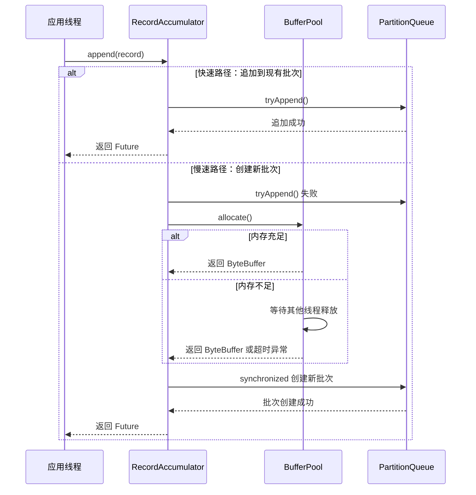

# 02. RecordAccumulator 消息缓冲区

本文档深入分析 Kafka Producer 的消息缓冲区实现，这是实现高吞吐批量发送的核心组件。

## 目录
- [1. RecordAccumulator 概述](#1-recordaccumulator-概述)
- [2. 核心数据结构](#2-核心数据结构)
- [3. 消息追加流程](#3-消息追加流程)
- [4. 缓冲区内存管理](#4-缓冲区内存管理)
- [5. 批次管理与压缩](#5-批次管理与压缩)
- [6. 实战调优](#6-实战调优)

---

## 1. RecordAccumulator 概述

### 1.1 设计目标

RecordAccumulator 是 Kafka Producer 的核心缓冲区组件，承担以下关键职责：

| 职责 | 说明 |
|-----|------|
| **消息缓冲** | 将多条消息聚合成批次，减少网络请求次数 |
| **内存管理** | 统一管理生产者内存，避免 OOM |
| **压缩优化** | 在缓冲区完成消息压缩，降低网络传输量 |
| **并发安全** | 支持多线程并发写入，保证线程安全 |

### 1.2 在 Producer 中的位置

```
┌─────────────────────────────────────────────────────────────┐
│                     KafkaProducer                           │
│  ┌─────────────────┐      ┌──────────────────────────────┐ │
│  │   主线程 (send)  │─────▶│    RecordAccumulator         │ │
│  │                 │      │  ┌────────────────────────┐  │ │
│  │  1. 序列化       │      │  │ batches: Map<TP, Deque>│  │ │
│  │  2. 分区计算     │      │  │   - tp1: [batch1, batch2]│ │
│  │  3. append()    │      │  │   - tp2: [batch3]      │  │ │
│  └─────────────────┘      │  └────────────────────────┘  │ │
│                           │  ┌────────────────────────┐  │ │
│  ┌─────────────────┐      │  │ bufferPool: BufferPool │  │ │
│  │  Sender 线程     │◀─────│  │   - 管理 ByteBuffer    │  │ │
│  │                 │      │  └────────────────────────┘  │ │
│  │  1. ready()     │      │  ┌────────────────────────┐  │ │
│  │  2. drain()     │      │  │ incomplete: Set<Batch> │  │ │
│  │  3. 网络发送     │      │  │   - 追踪未完成批次      │  │ │
│  └─────────────────┘      │  └────────────────────────┘  │ │
│                           └──────────────────────────────┘ │
└─────────────────────────────────────────────────────────────┘
```

### 1.3 核心参数

```java
public final class RecordAccumulator {
    // 批次大小（默认 16KB）
    private final int batchSize;
    // 压缩类型（none/gzip/snappy/lz4/zstd）
    private final CompressionType compressionType;
    // 延迟发送时间（默认 0ms）
    private final long lingerMs;
    // 重试退避时间
    private final long retryBackoffMs;
    // 内存缓冲区
    private final BufferPool bufferPool;
    // 批次映射表
    private final ConcurrentMap<TopicPartition, Deque<ProducerBatch>> batches;
    // 未完成批次集合
    private final IncompleteBatches incomplete;
}
```

---

## 2. 核心数据结构

### 2.1 批次映射表

```java
// 核心数据结构：按 TopicPartition 组织的双端队列
private final ConcurrentMap<TopicPartition, Deque<ProducerBatch>> batches;
```

内存结构示意：

```
batches (ConcurrentHashMap)
│
├── TopicPartition(topic="order", partition=0)
│   └── Deque[ProducerBatch(batchId=1, records=100),
│             ProducerBatch(batchId=2, records=50)]
│
├── TopicPartition(topic="order", partition=1)
│   └── Deque[ProducerBatch(batchId=3, records=80)]
│
└── TopicPartition(topic="user", partition=0)
    └── Deque[ProducerBatch(batchId=4, records=200)]
```

**设计要点**：
- 使用 `ConcurrentHashMap` 保证并发安全
- 每个分区独立队列，避免锁竞争
- 双端队列支持头部追加（新批次）和尾部读取（发送完成）

### 2.2 BufferPool 内存池

```java
public class BufferPool {
    // 总内存大小（默认 32MB = buffer.memory）
    private final long totalMemory;
    // 单个缓冲区大小（默认 16KB = batch.size）
    private final int bufferSize;
    // 可用内存（非池化）
    private long availableMemory;
    // 空闲缓冲区队列（池化复用）
    private final Deque<ByteBuffer> free;
    // 等待内存的线程队列
    private final Deque<Condition> waiters;
}
```

内存分配策略：

```
┌──────────────────────────────────────────────────────────┐
│                    总内存 (32MB)                          │
├──────────────────────────────────────────────────────────┤
│  池化内存 (16KB × N)      │      非池化内存               │
│  ┌─────┐ ┌─────┐ ┌─────┐  │                              │
│  │16KB │ │16KB │ │16KB │  │    <── 大消息使用（>16KB）    │
│  └─────┘ └─────┘ └─────┘  │                              │
│   (free队列，可复用)        │                              │
└──────────────────────────────────────────────────────────┘
```

**内存分配流程**：

```java
public ByteBuffer allocate(int size, long maxTimeToBlock) throws InterruptedException {
    // 1. 如果请求大小正好是 bufferSize，从 free 队列获取
    if (size == bufferSize && !free.isEmpty()) {
        return free.pollFirst();
    }

    // 2. 如果请求大于 bufferSize，直接分配（不归还给池）
    if (size > bufferSize) {
        return ByteBuffer.allocate(size);
    }

    // 3. 内存不足时，阻塞等待其他线程释放
    // 4. 压缩 free 队列中的缓冲区来腾出空间
    // 5. 超时后抛出 BufferExhaustedException
}
```

### 2.3 IncompleteBatches 未完成追踪

```java
private final Set<ProducerBatch> incomplete;

// 添加批次到未完成集合
public void add(ProducerBatch batch) {
    if (batch != null) {
        incomplete.add(batch);
    }
}

// 批次发送完成后移除
public void remove(ProducerBatch batch) {
    boolean removed = incomplete.remove(batch);
    if (removed) {
        // 释放批次占用的内存
        batch.release();
    }
}
```

**作用**：
- 追踪所有已发送但未确认的批次
- 支持优雅关闭时等待未完成批次
- 重试时快速定位需要重新发送的批次

---

## 3. 消息追加流程

### 3.1 append() 方法详解

```java
/**
 * 追加消息到缓冲区
 *
 * @param topic 目标 Topic
 * @param partition 目标分区（可能为 null）
 * @param timestamp 消息时间戳
 * @param key 消息 Key
 * @param value 消息 Value
 * @param headers 消息头
 * @param callback 回调函数
 * @param maxTimeToBlock 最大阻塞时间
 */
public RecordAppendResult append(String topic,
                                  int partition,
                                  long timestamp,
                                  byte[] key,
                                  byte[] value,
                                  Header[] headers,
                                  Callback callback,
                                  long maxTimeToBlock) throws InterruptedException {
    // 1. 创建 TopicPartition 标识
    TopicPartition tp = new TopicPartition(topic, partition);

    // 2. 尝试追加到现有批次（快速路径，无锁）
    Deque<ProducerBatch> dq = getOrCreateDeque(tp);
    synchronized (dq) {
        RecordAppendResult result = tryAppend(timestamp, key, value, headers,
                                               callback, dq);
        if (result != null) {
            return result;  // 追加成功，直接返回
        }
    }

    // 3. 需要创建新批次，分配内存（可能阻塞）
    int size = Math.max(this.batchSize, Records.LOG_OVERHEAD + recordSize);
    buffer = bufferPool.allocate(size, maxTimeToBlock);

    // 4. 创建新批次并追加（需要再次获取锁）
    synchronized (dq) {
        // 再次尝试，防止其他线程已创建新批次
        RecordAppendResult result = tryAppend(timestamp, key, value, headers,
                                               callback, dq);
        if (result != null) {
            bufferPool.deallocate(buffer);  // 归还未使用的内存
            return result;
        }

        // 5. 创建新的 ProducerBatch
        MemoryRecordsBuilder recordsBuilder = new MemoryRecordsBuilder(
            buffer, ...);
        ProducerBatch batch = new ProducerBatch(tp, recordsBuilder, time.milliseconds());

        // 6. 追加消息到新批次
        FutureRecordMetadata future = batch.tryAppend(timestamp, key, value,
                                                       headers, callback, time.milliseconds());

        // 7. 将新批次加入队列
        dq.addLast(batch);
        incomplete.add(batch);

        return new RecordAppendResult(future, dq.size() > 1 || batch.isFull(), true);
    }
}
```

### 3.2 tryAppend() 快速路径

```java
private RecordAppendResult tryAppend(long timestamp, byte[] key, byte[] value,
                                      Header[] headers, Callback callback,
                                      Deque<ProducerBatch> deque) {
    // 获取队列最后一个批次
    ProducerBatch last = deque.peekLast();
    if (last != null) {
        // 尝试追加到该批次
        FutureRecordMetadata future = last.tryAppend(timestamp, key, value,
                                                      headers, callback, time.milliseconds());
        if (future != null) {
            // 追加成功
            return new RecordAppendResult(future, last.isFull(), false);
        }
    }
    return null;  // 需要创建新批次
}
```

**为什么需要 double-check？**

```
线程 A                        线程 B
  │                            │
  ├─ 检查 last batch 已满 ─────▶│
  │                            ├─ 同样发现已满
  │◀───────────────────────────┤
  │                            │
  ├─ 释放锁                    │
  │                            ├─ 释放锁
  │                            │
  ├─ 分配内存（耗时）            │
  │                            ├─ 分配内存（耗时）
  │                            │
  ├─ 获取锁                    │
  │  ├─ 创建 batch 2            ├─ 获取锁
  │  └─ 加入队列                │  ├─ 发现 batch 2 已存在！
  │                            │  └─ 归还内存，使用 batch 2
```

### 3.3 消息追加时序图



---

## 4. 缓冲区内存管理

### 4.1 总内存限制

`buffer.memory` 参数控制生产者的总内存使用量：

```
生产者内存使用构成：
┌────────────────────────────────────────────────────────┐
│                  buffer.memory (32MB)                   │
├────────────────────────────────────────────────────────┤
│  RecordAccumulator 缓冲区    │    其他内存使用           │
│  - batches 中的消息数据       │    - 元数据缓存           │
│  - BufferPool 中的空闲块      │    - 网络缓冲区           │
│                              │    - 对象开销             │
└────────────────────────────────────────────────────────┘
```

### 4.2 内存分配策略

```java
public ByteBuffer allocate(int size, long maxTimeToBlock) throws InterruptedException {
    if (size > this.totalMemory)
        throw new IllegalArgumentException("...");

    this.lock.lock();
    try {
        // 1. 尝试从 free 队列获取（仅当 size == bufferSize）
        if (size == bufferSize && !this.free.isEmpty())
            return this.free.pollFirst();

        // 2. 计算需要释放的空间
        int freeListSize = this.free.size() * this.bufferSize;
        long availableMemory = this.availableMemory + freeListSize;

        // 3. 如果足够，直接分配
        if (availableMemory >= size) {
            freeUp(size);
            this.availableMemory -= size;
            lock.unlock();
            return ByteBuffer.allocate(size);
        }

        // 4. 内存不足，等待其他线程释放
        Condition moreMemory = this.lock.newCondition();
        long waitedTime = 0;
        this.waiters.addLast(moreMemory);

        while (availableMemory < size) {
            long startWait = time.nanoseconds();
            long timeNs = Math.max(0L, maxTimeToBlock * 1_000_000L - waitedTime);
            moreMemory.await(timeNs, TimeUnit.NANOSECONDS);
            waitedTime += time.nanoseconds() - startWait;

            if (waitedTime >= maxTimeToBlock * 1_000_000L) {
                this.waiters.remove(moreMemory);
                throw new BufferExhaustedException("...");
            }

            availableMemory = this.availableMemory + this.free.size() * this.bufferSize;
        }

        // 5. 等待成功，分配内存
        this.waiters.remove(moreMemory);
        this.availableMemory -= size;
        lock.unlock();
        return ByteBuffer.allocate(size);

    } finally {
        if (lock.isHeldByCurrentThread())
            lock.unlock();
    }
}
```

### 4.3 内存紧张处理

当内存不足时，Producer 的行为取决于 `max.block.ms` 参数：

| 场景 | 行为 |
|-----|------|
| 内存充足 | 直接分配，无阻塞 |
| 内存不足但在时限内恢复 | 阻塞等待，直到内存可用 |
| 内存不足且超时 | 抛出 `BufferExhaustedException` |

**阻塞等待的唤醒机制**：

```java
public void deallocate(ByteBuffer buffer, int size) {
    lock.lock();
    try {
        if (size == this.bufferSize && size == buffer.capacity()) {
            buffer.clear();
            this.free.add(buffer);  // 归还到池
        } else {
            this.availableMemory += size;  // 归还到可用内存
        }

        // 唤醒等待的线程
        Condition moreMem = this.waiters.peekFirst();
        if (moreMem != null)
            moreMem.signal();
    } finally {
        lock.unlock();
    }
}
```

---

## 5. 批次管理与压缩

### 5.1 ProducerBatch 结构

```java
public final class ProducerBatch {
    // 目标 TopicPartition
    private final TopicPartition topicPartition;
    // 内存记录构建器
    private final MemoryRecordsBuilder recordsBuilder;
    // 创建时间（用于延迟发送）
    private final long createdMs;
    // 关联的回调列表
    private final List<Thunk> thunks = new ArrayList<>();

    // 内部批次状态
    private final AtomicInteger recordCount = new AtomicInteger(0);
    private final AtomicInteger attempts = new AtomicInteger(0);
    private boolean isClosed = false;
    private int lastAppendTime;

    // 关联的 Future 列表
    private final List<FutureRecordMetadata> futures = new ArrayList<>();
}
```

### 5.2 批次关闭时机

批次被标记为"关闭"后，不再接受新消息：

```java
// 1. 批次已满（达到 batch.size）
public boolean isFull() {
    return recordsBuilder.isFull() ||
           (lingerMs > 0 && recordsBuilder.numRecords() > 0);
}

// 2. Sender 线程准备发送时关闭
public void close() {
    recordsBuilder.close();
    isClosed = true;
}

// 3. 重试时重新打开
public void reopen() {
    recordsBuilder.reopen();
    isClosed = false;
}
```

### 5.3 压缩策略

```java
public enum CompressionType {
    NONE(0, "none", 1.0f),
    GZIP(1, "gzip", 1.0f),
    SNAPPY(2, "snappy", 1.0f),
    LZ4(3, "lz4", 1.0f),
    ZSTD(4, "zstd", 1.0f);

    public final int id;
    public final String name;
    public final float rate;
}
```

压缩在 ProducerBatch 创建时确定：

```java
MemoryRecordsBuilder recordsBuilder = new MemoryRecordsBuilder(
    buffer,                    // 底层 ByteBuffer
    RecordBatch.CURRENT_MAGIC_VALUE,  // 消息格式版本
    compressionType,           // 压缩类型
    TimestampType.CREATE_TIME, // 时间戳类型
    baseOffset,                // 基础偏移量
    logAppendTime,             // 日志追加时间
    producerId,                // 生产者 ID（事务/幂等）
    producerEpoch,             // 生产者 Epoch
    baseSequence,              // 基础序列号
    isTransactional,           // 是否事务
    partitionLeaderEpoch,      // 分区 Leader Epoch
    buffer.capacity()          // 写入限制
);
```

**压缩算法对比**：

| 算法 | CPU 占用 | 压缩比 | 速度 | 适用场景 |
|-----|---------|-------|------|---------|
| none | 无 | 1x | 最快 | 内网、低延迟 |
| snappy | 低 | 2.0x | 很快 | 默认推荐 |
| lz4 | 很低 | 2.1x | 最快 | 高吞吐场景 |
| gzip | 高 | 2.5x | 慢 | 带宽受限 |
| zstd | 中 | 2.8x | 快 | Kafka 2.1+ |

---

## 6. 实战调优

### 6.1 batch.size 调优

```java
// 默认值 16KB
props.put("batch.size", 32768);  // 增加到 32KB
```

**调优策略**：

| 场景 | 建议值 | 说明 |
|-----|-------|------|
| 高吞吐，允许延迟 | 32-128KB | 更大批次，更高压缩效率 |
| 低延迟，消息量小 | 1-4KB | 小批次，快速发送 |
| 大消息 | > 消息大小 | 确保单条消息能放入批次 |

### 6.2 buffer.memory 调优

```java
// 默认值 32MB
props.put("buffer.memory", 67108864);  // 64MB
```

计算公式：
```
buffer.memory = 单分区吞吐量 × 分区数 × 延迟容忍度 × 安全系数

示例：
- 单分区：10,000 消息/秒
- 分区数：50
- 延迟容忍：100ms
- 消息大小：平均 1KB

buffer.memory = 10,000 × 50 × 0.1 × 1KB × 2 = 100MB
```

### 6.3 linger.ms 调优

```java
// 默认值 0（立即发送）
props.put("linger.ms", 10);  // 等待 10ms 积累批次
```

**调优权衡**：

```
linger.ms = 0                    linger.ms = 10-100ms
    │                                  │
    ▼                                  ▼
┌──────────┐                    ┌──────────┐
│ 低延迟   │                    │ 高吞吐   │
│ 低吞吐   │                    │ 稍高延迟 │
│ 高网络IO │                    │ 批处理   │
└──────────┘                    └──────────┘
```

### 6.4 监控指标解读

```java
// 通过 KafkaProducer.metrics() 获取
public Map<MetricName, ? extends Metric> metrics() {
    return Collections.unmodifiableMap(this.metrics.metrics());
}
```

关键指标：

| 指标名 | 类型 | 说明 | 健康范围 |
|-------|------|------|---------|
| `buffer-available-bytes` | Gauge | 可用缓冲区字节数 | > 10% buffer.memory |
| `buffer-total-bytes` | Gauge | 总缓冲区大小 | = buffer.memory |
| `buffer-exhausted-rate` | Rate | 缓冲区耗尽频率 | = 0 |
| `batch-size-avg` | Avg | 平均批次大小 | 接近 batch.size |
| `record-queue-time-avg` | Avg | 消息在缓冲区平均等待时间 | < linger.ms |

**调优检查清单**：

- [ ] `buffer-exhausted-rate` 为 0，否则增加 `buffer.memory`
- [ ] `batch-size-avg` 接近 `batch.size` 的 80%，否则增加 `linger.ms`
- [ ] `record-queue-time-avg` 在可接受范围内
- [ ] 内存使用平稳，无剧烈波动

---

**上一章**: [01. Producer 架构概述](./01-producer-overview.md)
**下一章**: [03. Sender 线程详解](./03-sender-thread.md)
